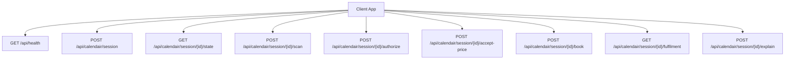
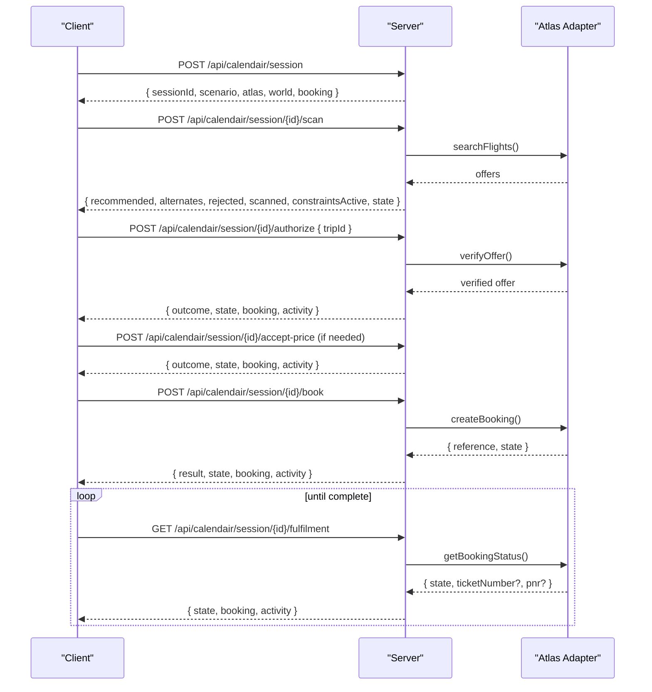
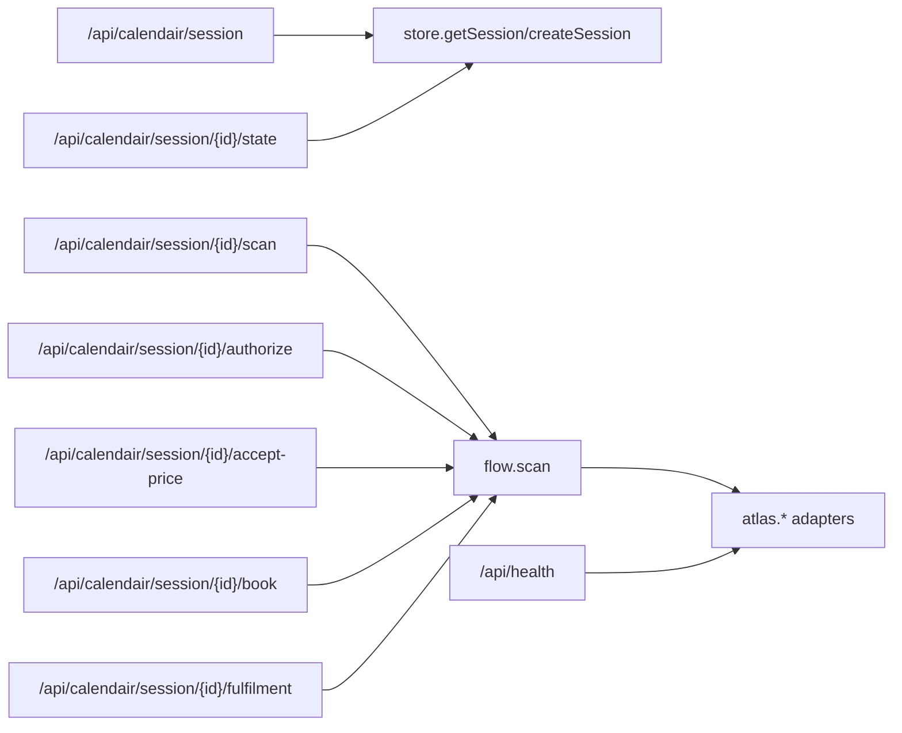
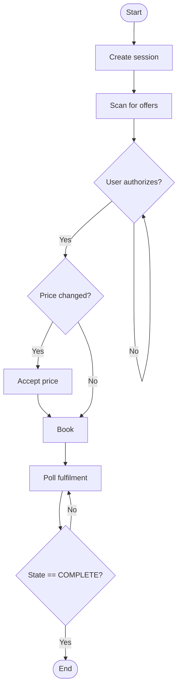

# API Reference

<cite>
**Referenced Files in This Document**
- [route.ts](file://src/app/api/calendair/session/route.ts)
- [route.ts](file://src/app/api/calendair/session/[id]/state/route.ts)
- [route.ts](file://src/app/api/calendair/session/[id]/authorize/route.ts)
- [route.ts](file://src/app/api/calendair/session/[id]/book/route.ts)
- [route.ts](file://src/app/api/calendair/session/[id]/accept-price/route.ts)
- [route.ts](file://src/app/api/calendair/session/[id]/scan/route.ts)
- [route.ts](file://src/app/api/calendair/session/[id]/explain/route.ts)
- [route.ts](file://src/app/api/calendair/session/[id]/fulfilment/route.ts)
- [route.ts](file://src/app/api/health/route.ts)
- [types.ts](file://src/lib/calendair/types.ts)
- [SessionProvider.tsx](file://src/components/calendair/SessionProvider.tsx)
- [adapter.ts](file://src/lib/atlas/adapter.ts)
- [demo-adapter.ts](file://src/lib/atlas/demo-adapter.ts)
- [flow.ts](file://src/lib/calendair/flow.ts)
</cite>

## Table of Contents
1. Introduction
2. Project Structure
3. Core Components
4. Architecture Overview
5. Detailed Component Analysis
6. Dependency Analysis
7. Performance Considerations
8. Troubleshooting Guide
9. Conclusion
10. Appendices

## Introduction
This document provides comprehensive API documentation for CALENDAIR’s REST endpoints that manage a booking session from initialization through confirmation. It covers HTTP methods, URL patterns, request/response schemas, authentication requirements, error handling, and retry strategies. It also includes client integration guidelines and debugging tips based on the server implementation and the built-in health endpoint.

## Project Structure
The API is implemented as Next.js Route Handlers under /api/calendair/session with sub-resources per session ID. A global health endpoint exposes configuration status without leaking secrets. The client-side SessionProvider orchestrates calls to these endpoints and maintains UI state.

**Diagram sources**
- [route.ts:10-38](file://src/app/api/health/route.ts#L10-L38)
- [route.ts:24-60](file://src/app/api/calendair/session/route.ts#L24-L60)
- [route.ts:6-34](file://src/app/api/calendair/session/[id]/state/route.ts#L6-L34)
- [route.ts:9-33](file://src/app/api/calendair/session/[id]/scan/route.ts#L9-L33)
- [route.ts:14-24](file://src/app/api/calendair/session/[id]/authorize/route.ts#L14-L24)
- [route.ts:8-15](file://src/app/api/calendair/session/[id]/accept-price/route.ts#L8-L15)
- [route.ts:9-23](file://src/app/api/calendair/session/[id]/book/route.ts#L9-L23)
- [route.ts:9-20](file://src/app/api/calendair/session/[id]/fulfilment/route.ts#L9-L20)
- [route.ts:20-77](file://src/app/api/calendair/session/[id]/explain/route.ts#L20-L77)

**Section sources**
- [route.ts:10-38](file://src/app/api/health/route.ts#L10-L38)
- [route.ts:24-60](file://src/app/api/calendair/session/route.ts#L24-L60)
- [SessionProvider.tsx:114-175](file://src/components/calendair/SessionProvider.tsx#L114-L175)

## Core Components
- Session lifecycle: create, resume via state, scan, authorize, accept price changes, book, poll fulfilment, explain match.
- Health check: reports service readiness, demo mode, provider adapter status, and configured integrations.
- Types: shared domain types define booking states, offers, scoring, passenger profiles, and activity logs.

Key responsibilities:
- Session creation initializes world context, scenario, and initial booking state.
- State retrieval returns current booking state, engine snapshot, and world context.
- Authorization re-verifies an offer before booking.
- Booking creates a reservation and transitions to pending or failed.
- Fulfilment polling confirms final outcome and updates calendar blocks.
- Explain enriches a trip with a language-only explanation when configured.

**Section sources**
- [types.ts:197-215](file://src/lib/calendair/types.ts#L197-L215)
- [types.ts:116-176](file://src/lib/calendair/types.ts#L116-L176)
- [types.ts:217-246](file://src/lib/calendair/types.ts#L217-L246)
- [types.ts:250-261](file://src/lib/calendair/types.ts#L250-L261)
- [types.ts:265-273](file://src/lib/calendair/types.ts#L265-L273)

## Architecture Overview
The API enforces a strict human-checkpoint flow: search results are presented, the user authorizes a specific trip, any price increase must be explicitly accepted, then booking proceeds. Final confirmation is only asserted by polling the provider’s fulfilment endpoint.

**Diagram sources**
- [route.ts:24-60](file://src/app/api/calendair/session/route.ts#L24-L60)
- [route.ts:9-33](file://src/app/api/calendair/session/[id]/scan/route.ts#L9-L33)
- [route.ts:14-24](file://src/app/api/calendair/session/[id]/authorize/route.ts#L14-L24)
- [route.ts:8-15](file://src/app/api/calendair/session/[id]/accept-price/route.ts#L8-L15)
- [route.ts:9-23](file://src/app/api/calendair/session/[id]/book/route.ts#L9-L23)
- [route.ts:9-20](file://src/app/api/calendair/session/[id]/fulfilment/route.ts#L9-L20)
- [flow.ts:227-256](file://src/lib/calendair/flow.ts#L227-L256)

## Detailed Component Analysis

### Health Check
- Method: GET
- Path: /api/health
- Authentication: None
- Purpose: Service readiness and configuration status without leaking secrets.
- Response fields: ok, service, time, demoMode, demoScenario, maxReplans, atlas (status), calendar (source/configured), reasoning (configured/provider/model/note).
- Typical use: Probe before starting sessions; surface adapter mode and credentials presence.

**Section sources**
- [route.ts:10-38](file://src/app/api/health/route.ts#L10-L38)

### Create Session
- Method: POST
- Path: /api/calendair/session
- Authentication: None
- Request body: optional scenario (string), optional profile (object). Scenario defaults to environment or “perfect”. Profile is sanitized and only used if completed.
- Response fields: sessionId, scenario, demoMode, atlas, world (taste, window, companions, busy, nextCommitmentIso, profileSource, passenger with masked document number), booking.
- Notes: Returns provider mode and world context for the first search.

**Section sources**
- [route.ts:24-60](file://src/app/api/calendair/session/route.ts#L24-L60)

### Get Session State
- Method: GET
- Path: /api/calendair/session/{id}/state
- Authentication: None
- Path parameter: id (session identifier)
- Response fields: state, booking, activity, engine (recommended, alternates, rejected, scanned, constraintsActive, searchInput), world (taste, window, companions, busy, nextCommitmentIso, profileSource).
- Error: 404 with { error: "Session expired" } when session not found.

**Section sources**
- [route.ts:6-34](file://src/app/api/calendair/session/[id]/state/route.ts#L6-L34)

### Scan (Search)
- Method: POST
- Path: /api/calendair/session/{id}/scan
- Authentication: None
- Request body: none
- Response fields: state, searchInput, recommended, alternates, rejected, scanned, constraintsActive, activity.
- Errors:
  - 404: Session expired
  - 501: AtlasNotWiredError (adapter not wired for configured mode)
  - 502: Other search failures
- Notes: Read-only discovery step; can run independently after session creation.

**Section sources**
- [route.ts:9-33](file://src/app/api/calendair/session/[id]/scan/route.ts#L9-L33)
- [adapter.ts:31-41](file://src/lib/atlas/adapter.ts#L31-L41)

### Authorize Trip
- Method: POST
- Path: /api/calendair/session/{id}/authorize
- Authentication: None
- Request body: { tripId: string }
- Response fields: outcome, state, booking, activity.
- Behavior: Re-verifies the selected offer against live data without writing a booking. Ensures human checkpoint before booking.
- Errors:
  - 400: Missing or invalid tripId
  - 404: Session expired

**Section sources**
- [route.ts:14-24](file://src/app/api/calendair/session/[id]/authorize/route.ts#L14-L24)

### Accept Price Change
- Method: POST
- Path: /api/calendair/session/{id}/accept-price
- Authentication: None
- Request body: none
- Response fields: outcome, state, booking, activity.
- Behavior: Explicit acceptance required when price increases; never absorbed silently.

**Section sources**
- [route.ts:8-15](file://src/app/api/calendair/session/[id]/accept-price/route.ts#L8-L15)

### Book
- Method: POST
- Path: /api/calendair/session/{id}/book
- Authentication: None
- Request body: none
- Response fields: result, state, booking, activity.
- Behavior: First write; runs only against an approved total. Transitions to pending or failed.
- Errors:
  - 404: Session expired
  - 409: Booking conflict or failure reason returned in { error }

**Section sources**
- [route.ts:9-23](file://src/app/api/calendair/session/[id]/book/route.ts#L9-L23)
- [flow.ts:227-248](file://src/lib/calendair/flow.ts#L227-L248)

### Poll Fulfilment
- Method: GET
- Path: /api/calendair/session/{id}/fulfilment
- Authentication: None
- Response fields: state, result, booking, activity.
- Behavior: Asks the provider what actually happened; asserts final confirmed state before marking complete.

**Section sources**
- [route.ts:9-20](file://src/app/api/calendair/session/[id]/fulfilment/route.ts#L9-L20)
- [flow.ts:250-256](file://src/lib/calendair/flow.ts#L250-L256)

### Explain Match
- Method: POST
- Path: /api/calendair/session/{id}/explain
- Authentication: None
- Request body: { tripId: string }
- Response fields: source ("qwen" | "none"), explanation (string|null), model (string|null).
- Behavior: Language-only enrichment; does not change pricing, constraints, or state. Persists explanation in trip when available.
- Errors:
  - 400: Missing or invalid tripId
  - 404: Unknown trip or session expired

**Section sources**
- [route.ts:20-77](file://src/app/api/calendair/session/[id]/explain/route.ts#L20-L77)

## Dependency Analysis
- Routes depend on:
  - Store accessors for session retrieval and persistence
  - Flow functions for authorization, booking, scanning, and fulfilment polling
  - Atlas adapter abstraction for provider interactions (demo vs unwired live)
- Client uses SessionProvider to orchestrate calls and maintain local state.

**Diagram sources**
- [route.ts:24-60](file://src/app/api/calendair/session/route.ts#L24-L60)
- [route.ts:6-34](file://src/app/api/calendair/session/[id]/state/route.ts#L6-L34)
- [route.ts:9-33](file://src/app/api/calendair/session/[id]/scan/route.ts#L9-L33)
- [route.ts:14-24](file://src/app/api/calendair/session/[id]/authorize/route.ts#L14-L24)
- [route.ts:8-15](file://src/app/api/calendair/session/[id]/accept-price/route.ts#L8-L15)
- [route.ts:9-23](file://src/app/api/calendair/session/[id]/book/route.ts#L9-L23)
- [route.ts:9-20](file://src/app/api/calendair/session/[id]/fulfilment/route.ts#L9-L20)
- [route.ts:10-38](file://src/app/api/health/route.ts#L10-L38)
- [adapter.ts:31-78](file://src/lib/atlas/adapter.ts#L31-L78)

**Section sources**
- [adapter.ts:31-78](file://src/lib/atlas/adapter.ts#L31-L78)
- [demo-adapter.ts:28-41](file://src/lib/atlas/demo-adapter.ts#L28-L41)

## Performance Considerations
- Prefer GET /api/calendair/session/{id}/state to refresh UI state without side effects.
- Use GET /api/calendair/session/{id}/fulfilment in a polling loop with exponential backoff until state reaches COMPLETE.
- Avoid repeated expensive scans; cache engine snapshots locally between user interactions.
- Leverage /api/health to detect adapter wiring early and avoid unnecessary retries.

[No sources needed since this section provides general guidance]

## Troubleshooting Guide
Common errors and responses:
- 404 Not Found: Session expired. Occurs on state, authorize, accept-price, book, scan, fulfilment, explain when session is missing.
- 400 Bad Request: Missing or invalid tripId on authorize/explain.
- 409 Conflict: Booking failed or conflict; response includes error reason.
- 501 Not Implemented: AtlasNotWiredError indicates the configured adapter has no implementation; do not proceed with live calls.
- 502 Bad Gateway: Search failed due to transport or provider issues.

Debugging steps:
- Call /api/health to confirm service status, adapter mode, and credential presence.
- Inspect activity arrays returned by endpoints for timestamps and outcomes.
- For scan failures, check atlasNotWired flag to determine if the adapter is missing.
- Use explain to retrieve language-only reasons for matches when configured.

Retry strategy:
- For transient network errors, retry with exponential backoff and jitter.
- For 501/502, stop retries once adapter wiring is confirmed missing; inform the operator.
- For 409, present the error reason to the user and allow them to re-scan or choose another option.

**Section sources**
- [route.ts:9-33](file://src/app/api/calendair/session/[id]/scan/route.ts#L9-L33)
- [route.ts:14-24](file://src/app/api/calendair/session/[id]/authorize/route.ts#L14-L24)
- [route.ts:9-23](file://src/app/api/calendair/session/[id]/book/route.ts#L9-L23)
- [route.ts:20-77](file://src/app/api/calendair/session/[id]/explain/route.ts#L20-L77)
- [adapter.ts:31-41](file://src/lib/atlas/adapter.ts#L31-L41)

## Conclusion
CALENDAIR’s API enforces a safe, human-in-the-loop booking workflow with clear state transitions, explicit price acceptance, and final fulfilment confirmation. Clients should follow the documented sequence, handle errors robustly, and rely on health and state endpoints for reliable integration.

[No sources needed since this section summarizes without analyzing specific files]

## Appendices

### Complete Booking Workflow Example
Sequence of typical client calls:
1. POST /api/calendair/session
2. POST /api/calendair/session/{id}/scan
3. POST /api/calendair/session/{id}/authorize { tripId }
4. POST /api/calendair/session/{id}/accept-price (only if price changed)
5. POST /api/calendair/session/{id}/book
6. Loop GET /api/calendair/session/{id}/fulfilment until state is COMPLETE
7. Optional: POST /api/calendair/session/{id}/explain { tripId }

**Diagram sources**
- [route.ts:24-60](file://src/app/api/calendair/session/route.ts#L24-L60)
- [route.ts:9-33](file://src/app/api/calendair/session/[id]/scan/route.ts#L9-L33)
- [route.ts:14-24](file://src/app/api/calendair/session/[id]/authorize/route.ts#L14-L24)
- [route.ts:8-15](file://src/app/api/calendair/session/[id]/accept-price/route.ts#L8-L15)
- [route.ts:9-23](file://src/app/api/calendair/session/[id]/book/route.ts#L9-L23)
- [route.ts:9-20](file://src/app/api/calendair/session/[id]/fulfilment/route.ts#L9-L20)

### Client Integration Guidelines
- Always start with /api/health to detect adapter mode and configuration.
- Persist sessionId in sessionStorage to resume across reloads using /api/calendair/session/{id}/state.
- Update UI from activity arrays and booking.state returned by each endpoint.
- Mask sensitive identifiers in UI; the session creation response already masks document numbers.
- Implement robust error handling for 4xx/5xx responses and adapter-specific flags like atlasNotWired.

**Section sources**
- [SessionProvider.tsx:114-175](file://src/components/calendair/SessionProvider.tsx#L114-L175)
- [SessionProvider.tsx:177-258](file://src/components/calendair/SessionProvider.tsx#L177-L258)

### Security Considerations
- No authentication headers are required by the API; session isolation is enforced by unique session IDs.
- Sensitive data is minimized in responses (e.g., masked document numbers).
- Activity logs exclude secrets such as tokens and document numbers.
- Health endpoint reports configuration without exposing credentials.

**Section sources**
- [route.ts:24-60](file://src/app/api/calendair/session/route.ts#L24-L60)
- [route.ts:10-38](file://src/app/api/health/route.ts#L10-L38)

### Rate Limiting
- No explicit rate limiting is implemented in the provided routes.
- Consumers should implement client-side throttling and backoff to avoid overwhelming downstream providers.

[No sources needed since this section provides general guidance]