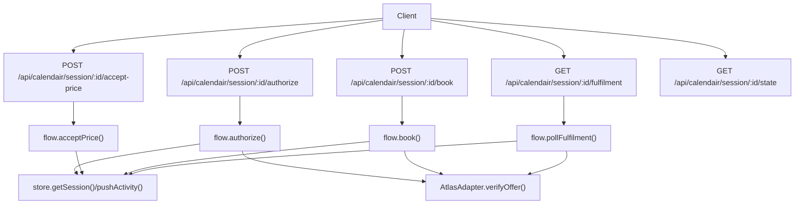
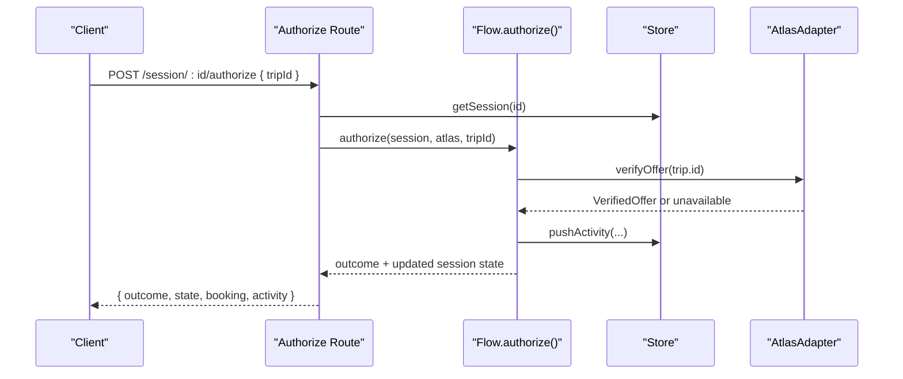
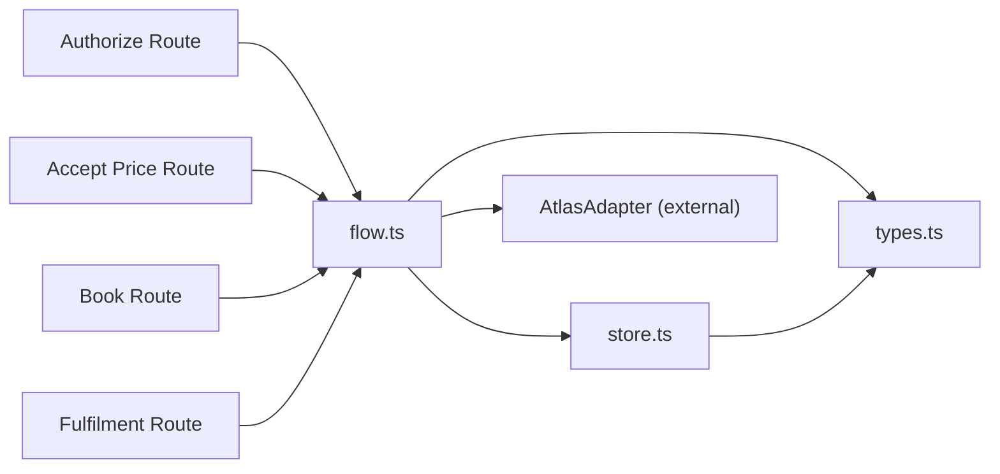

# Booking Workflow

<cite>
**Referenced Files in This Document**
- [route.ts](file://src/app/api/calendair/session/[id]/authorize/route.ts)
- [route.ts](file://src/app/api/calendair/session/[id]/book/route.ts)
- [route.ts](file://src/app/api/calendair/session/[id]/accept-price/route.ts)
- [flow.ts](file://src/lib/calendair/flow.ts)
- [store.ts](file://src/lib/calendair/store.ts)
- [types.ts](file://src/lib/calendair/types.ts)
- [route.ts](file://src/app/api/calendair/session/route.ts)
- [route.ts](file://src/app/api/calendair/session/[id]/state/route.ts)
- [route.ts](file://src/app/api/calendair/session/[id]/fulfilment/route.ts)
- [booking-workflow.md](file://.agents/skills/atlas-flight-booking/references/booking-workflow.md)
- [error-handling.md](file://.agents/skills/atlas-flight-booking/references/error-handling.md)
- [cli-contract.md](file://.agents/skills/atlas-flight-booking/references/cli-contract.md)
</cite>

## Table of Contents
1. Introduction
2. Project Structure
3. Core Components
4. Architecture Overview
5. Detailed Component Analysis
6. Dependency Analysis
7. Performance Considerations
8. Troubleshooting Guide
9. Conclusion

## Introduction
This document describes CALENDAIR’s booking workflow endpoints that implement a safe, human-in-the-loop flight booking process. It covers:
- Authorization endpoint for human approval and live re-verification of fares
- Price acceptance endpoint for dynamic pricing scenarios
- Booking endpoint for creating orders and handling payment/ticketing outcomes
- Fulfilment polling to confirm ticketing and update the calendar
It also documents idempotency, transaction safety, rollback behavior, error handling strategies, and retry mechanisms aligned with the Atlas CLI contract and error handling reference.

## Project Structure
The booking workflow is implemented as Next.js API routes under calendair sessions. Each route validates inputs, loads an in-memory session, and delegates to domain logic in the flow layer. The store maintains session state and activity logs. Supporting references define the end-to-end booking policy and error handling rules.

**Diagram sources**
- [route.ts:14-24](file://src/app/api/calendair/session/[id]/authorize/route.ts#L14-L24)
- [route.ts:8-15](file://src/app/api/calendair/session/[id]/accept-price/route.ts#L8-L15)
- [route.ts:9-22](file://src/app/api/calendair/session/[id]/book/route.ts#L9-L22)
- [route.ts:9-20](file://src/app/api/calendair/session/[id]/fulfilment/route.ts#L9-L20)
- [flow.ts:65-84](file://src/lib/calendair/flow.ts#L65-L84)
- [flow.ts:193-210](file://src/lib/calendair/flow.ts#L193-L210)
- [flow.ts:218-248](file://src/lib/calendair/flow.ts#L218-L248)
- [flow.ts:251-280](file://src/lib/calendair/flow.ts#L251-L280)
- [store.ts:88-98](file://src/lib/calendair/store.ts#L88-L98)

**Section sources**
- [route.ts:24-60](file://src/app/api/calendair/session/route.ts#L24-L60)
- [route.ts:6-34](file://src/app/api/calendair/session/[id]/state/route.ts#L6-L34)
- [store.ts:7-13](file://src/lib/calendair/store.ts#L7-L13)

## Core Components
- Session lifecycle: created via the session creation endpoint; stored in memory with TTL-based cleanup.
- Flow state machine: enforces human checkpoints before any write, re-verifies prices, and only proceeds when the traveller explicitly approves changes.
- Atlas adapter integration: verifies offers, creates bookings, and polls fulfilment status.
- Activity logging: every step records an auditable event for transparency and debugging.

Key responsibilities by file:
- authorize route: validates request, loads session, calls authorize flow, returns outcome and current state.
- accept-price route: accepts a price change if one is pending, transitions to confirmed price.
- book route: performs the first write (order creation) against a verified and approved fare.
- fulfilment route: polls provider until a terminal state is reached and updates the calendar on confirmation.
- flow: implements the state machine, re-verification, replanning limits, and calendar writes.
- store: manages sessions, activity log, and time-based cleanup.
- types: defines domain models, booking states, and offer shapes used across components.

**Section sources**
- [route.ts:14-24](file://src/app/api/calendair/session/[id]/authorize/route.ts#L14-L24)
- [route.ts:8-15](file://src/app/api/calendair/session/[id]/accept-price/route.ts#L8-L15)
- [route.ts:9-22](file://src/app/api/calendair/session/[id]/book/route.ts#L9-L22)
- [route.ts:9-20](file://src/app/api/calendair/session/[id]/fulfilment/route.ts#L9-L20)
- [flow.ts:22-45](file://src/lib/calendair/flow.ts#L22-L45)
- [flow.ts:65-84](file://src/lib/calendair/flow.ts#L65-L84)
- [flow.ts:94-176](file://src/lib/calendair/flow.ts#L94-L176)
- [flow.ts:193-210](file://src/lib/calendair/flow.ts#L193-L210)
- [flow.ts:218-248](file://src/lib/calendair/flow.ts#L218-L248)
- [flow.ts:251-280](file://src/lib/calendair/flow.ts#L251-L280)
- [store.ts:69-98](file://src/lib/calendair/store.ts#L69-L98)
- [types.ts:197-215](file://src/lib/calendair/types.ts#L197-L215)

## Architecture Overview
The booking workflow follows a strict sequence: search and recommendation → human authorization → live re-verification → optional price acceptance → order creation → fulfilment polling → calendar update.

**Diagram sources**
- [route.ts:14-24](file://src/app/api/calendair/session/[id]/authorize/route.ts#L14-L24)
- [flow.ts:65-84](file://src/lib/calendair/flow.ts#L65-L84)
- [flow.ts:94-176](file://src/lib/calendair/flow.ts#L94-L176)
- [store.ts:94-98](file://src/lib/calendair/store.ts#L94-L98)

## Detailed Component Analysis

### Authorization Endpoint: POST /api/calendair/session/[id]/authorize
Purpose:
- Human checkpoint: the traveller authorizes a selected trip.
- Live re-verification: the system re-checks availability and price before proceeding.
- Safe replanning: if the offer is sold out, it attempts one bounded replan within budget and stops for a decision.

Request:
- Path parameter: id (session identifier)
- Body: tripId (string, required)

Response:
- outcome: one of confirmed, price-changed, unavailable (with replacement), or safe-stop
- state: current booking state
- booking: current booking snapshot
- activity: latest activity events

Behavior highlights:
- Validates session existence; returns 404 if expired.
- Validates body; returns 400 if tripId missing.
- Sets USER_AUTHORIZED, then re-verifies the offer.
- If price unchanged: PRICE_CONFIRMED.
- If price changed: PRICE_CHANGED (requires explicit acceptance).
- If unavailable: SOLD_OUT with up to MAX_REPLANS replans; otherwise SAFE_STOP.

Security considerations:
- No writes occur during authorization; only reads and state transitions.
- Re-verification ensures no silent price absorption.

Idempotency:
- Repeated calls with the same tripId are safe; they re-run verification and return the current outcome based on live data.

Error handling:
- 404 for expired session
- 400 for invalid payload
- Outcome-driven client branching per booking-workflow and error-handling references

**Section sources**
- [route.ts:14-24](file://src/app/api/calendair/session/[id]/authorize/route.ts#L14-L24)
- [flow.ts:65-84](file://src/lib/calendair/flow.ts#L65-L84)
- [flow.ts:94-176](file://src/lib/calendair/flow.ts#L94-L176)
- [types.ts:197-215](file://src/lib/calendair/types.ts#L197-L215)

### Price Acceptance Endpoint: POST /api/calendair/session/[id]/accept-price
Purpose:
- Explicitly accept a price increase after re-verification.
- Transitions from PRICE_CHANGED to PRICE_CONFIRMED.

Request:
- Path parameter: id (session identifier)
- Body: none required

Response:
- outcome: confirmed with new total/currency or safe-stop if not applicable
- state: updated booking state
- booking: updated booking snapshot
- activity: updated activity log

Behavior highlights:
- Only allowed when a price change is pending.
- Records an activity event for auditability.
- Prevents silent absorption of increased prices.

Idempotency:
- Safe to call multiple times; once accepted, subsequent calls will indicate no pending price change.

**Section sources**
- [route.ts:8-15](file://src/app/api/calendair/session/[id]/accept-price/route.ts#L8-L15)
- [flow.ts:193-210](file://src/lib/calendair/flow.ts#L193-L210)

### Booking Endpoint: POST /api/calendair/session/[id]/book
Purpose:
- First write operation: create the order against the verified and approved fare.
- Handles provider responses and sets appropriate booking state.

Request:
- Path parameter: id (session identifier)
- Body: none required

Response:
- result: provider booking result (reference, state, testMode, etc.)
- state: updated booking state
- booking: updated booking snapshot
- activity: updated activity log

Behavior highlights:
- Guards: requires PRICE_CONFIRMED and matching approved total.
- Creates booking via Atlas adapter; sets BOOKING_CREATING then BOOKING_PENDING or BOOKING_FAILED.
- Returns 409 when conditions are not met (e.g., fare not confirmed).

Idempotency and transaction safety:
- The route does not guard against duplicate HTTP retries at the API level; clients should treat this as non-idempotent and rely on provider semantics plus polling to determine final state.
- Follows “create once” rule; never auto-retry order creation.

Rollback procedures:
- On uncertain side effects, do not create another order; query provider status instead.
- If payment or ticketing status is unknown, poll using order status rather than replaying payments.

**Section sources**
- [route.ts:9-22](file://src/app/api/calendair/session/[id]/book/route.ts#L9-L22)
- [flow.ts:218-248](file://src/lib/calendair/flow.ts#L218-L248)
- [booking-workflow.md:31-63](file://.agents/skills/atlas-flight-booking/references/booking-workflow.md#L31-L63)
- [error-handling.md:44-63](file://.agents/skills/atlas-flight-booking/references/error-handling.md#L44-L63)

### Fulfilment Polling: GET /api/calendair/session/[id]/fulfilment
Purpose:
- Ask the provider what actually happened after booking creation.
- On confirmed fulfilment, write calendar blocks and mark COMPLETE.

Request:
- Path parameter: id (session identifier)

Response:
- state: updated booking state
- result: latest provider result
- booking: updated booking snapshot
- activity: updated activity log

Behavior highlights:
- Polls provider until confirmed or failed.
- Writes tentative calendar blocks only after confirmed fulfilment.
- Marks CALENDAR_UPDATED and COMPLETE upon success.

**Section sources**
- [route.ts:9-20](file://src/app/api/calendair/session/[id]/fulfilment/route.ts#L9-L20)
- [flow.ts:251-280](file://src/lib/calendair/flow.ts#L251-L280)
- [flow.ts:288-343](file://src/lib/calendair/flow.ts#L288-L343)

### Session Management and State
- Session creation: initializes world, booking state, and activity log; returns sessionId and initial context.
- State retrieval: exposes current booking state, engine results, and world context for UI orchestration.

**Section sources**
- [route.ts:24-60](file://src/app/api/calendair/session/route.ts#L24-L60)
- [route.ts:6-34](file://src/app/api/calendair/session/[id]/state/route.ts#L6-L34)
- [store.ts:69-98](file://src/lib/calendair/store.ts#L69-L98)

## Dependency Analysis
High-level dependencies between components:

**Diagram sources**
- [route.ts:14-24](file://src/app/api/calendair/session/[id]/authorize/route.ts#L14-L24)
- [route.ts:8-15](file://src/app/api/calendair/session/[id]/accept-price/route.ts#L8-L15)
- [route.ts:9-22](file://src/app/api/calendair/session/[id]/book/route.ts#L9-L22)
- [route.ts:9-20](file://src/app/api/calendair/session/[id]/fulfilment/route.ts#L9-L20)
- [flow.ts:1-7](file://src/lib/calendair/flow.ts#L1-L7)
- [store.ts:1-5](file://src/lib/calendair/store.ts#L1-L5)
- [types.ts:1-7](file://src/lib/calendair/types.ts#L1-L7)

**Section sources**
- [flow.ts:1-7](file://src/lib/calendair/flow.ts#L1-L7)
- [store.ts:1-5](file://src/lib/calendair/store.ts#L1-L5)
- [types.ts:1-7](file://src/lib/calendair/types.ts#L1-L7)

## Performance Considerations
- In-memory session store with TTL reduces persistence overhead; suitable for demo/stage environments.
- Activity log is bounded to prevent unbounded growth.
- Replanning is limited to MAX_REPLANS to avoid excessive provider calls.
- Calendar writes occur only after confirmed fulfilment to minimize unnecessary writes.

[No sources needed since this section provides general guidance]

## Troubleshooting Guide
Common issues and how to handle them:

- Expired session:
  - Symptom: 404 errors on all session endpoints.
  - Action: Create a new session and restart the workflow.

- Invalid payload:
  - Symptom: 400 on authorize with missing tripId.
  - Action: Ensure the correct tripId is provided.

- Price changed:
  - Symptom: outcome indicates price-changed; booking remains in PRICE_CHANGED.
  - Action: Call accept-price to approve the new total; otherwise stop.

- Sold out:
  - Symptom: outcome indicates unavailable with or without replacement; state SOLD_OUT.
  - Action: Review replacement offer or start a new search.

- Booking pending:
  - Symptom: state BOOKING_PENDING after book.
  - Action: Poll fulfilment until confirmed or failed.

- Payment or ticketing uncertainty:
  - Symptom: ambiguous provider response codes.
  - Action: Query order status; never retry payment or create another order.

- Authorization required/pending/expired:
  - Symptom: provider reports AUTHORIZATION_REQUIRED/AUTH_PENDING/AUTH_EXPIRED.
  - Action: Follow the authorization flow per error-handling reference; poll once after user completes authorization.

- Service temporarily unavailable:
  - Symptom: SERVICE_TEMPORARILY_UNAVAILABLE with retryable=true.
  - Action: Retry identical read-only command at most once; do not repeat order creation or payment.

**Section sources**
- [error-handling.md:7-17](file://.agents/skills/atlas-flight-booking/references/error-handling.md#L7-L17)
- [error-handling.md:19-31](file://.agents/skills/atlas-flight-booking/references/error-handling.md#L19-L31)
- [error-handling.md:44-63](file://.agents/skills/atlas-flight-booking/references/error-handling.md#L44-L63)
- [error-handling.md:65-74](file://.agents/skills/atlas-flight-booking/references/error-handling.md#L65-L74)
- [booking-workflow.md:31-63](file://.agents/skills/atlas-flight-booking/references/booking-workflow.md#L31-L63)

## Conclusion
CALENDAIR’s booking workflow enforces strong human-in-the-loop controls, live re-verification of fares, and explicit price acceptance before any write. The design prioritizes safety over speed: it avoids silent price changes, limits replanning, and defers calendar updates until fulfilment is confirmed. Clients should follow the documented endpoint contracts, handle errors according to the Atlas error handling reference, and use polling to resolve asynchronous ticketing outcomes.