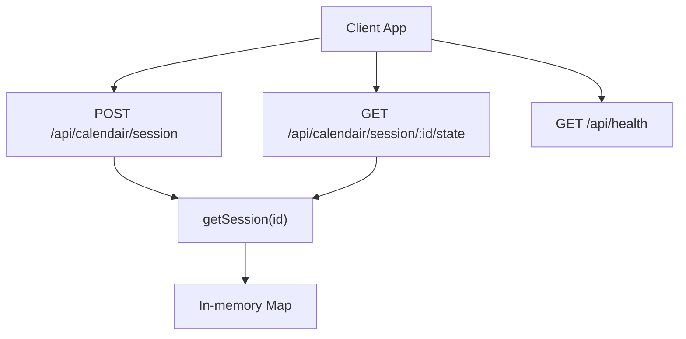
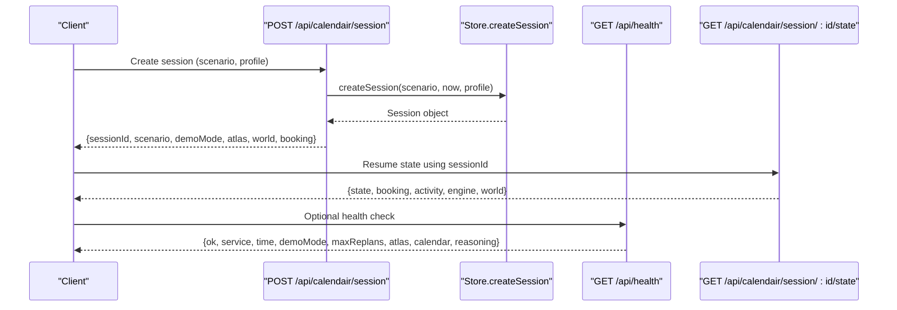
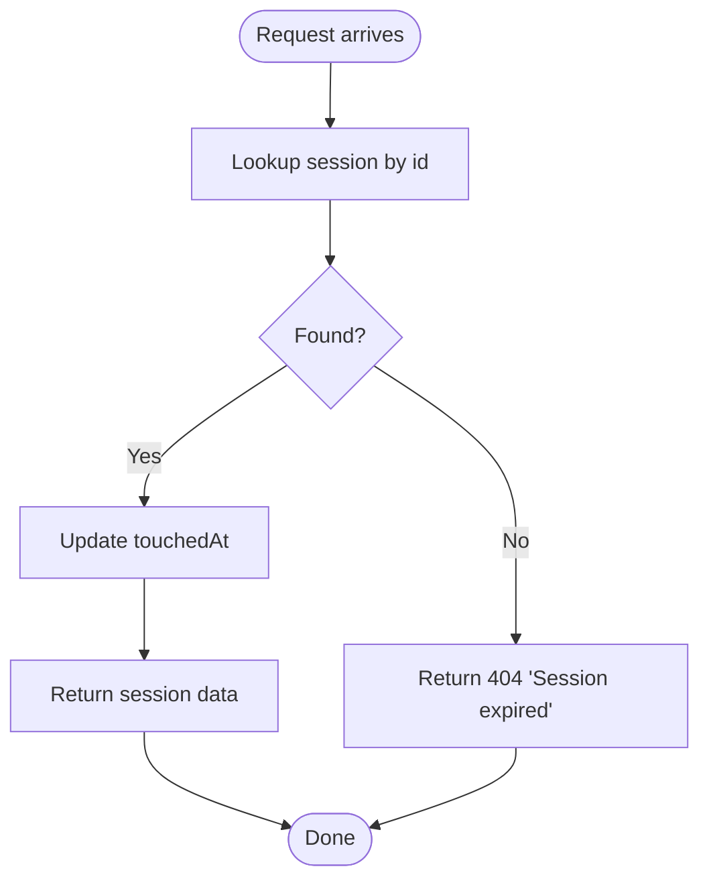
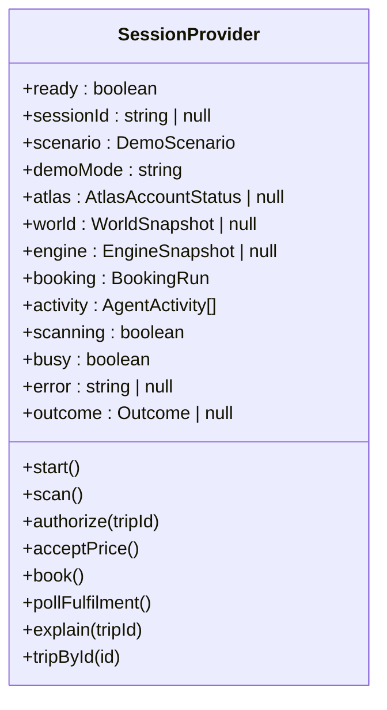
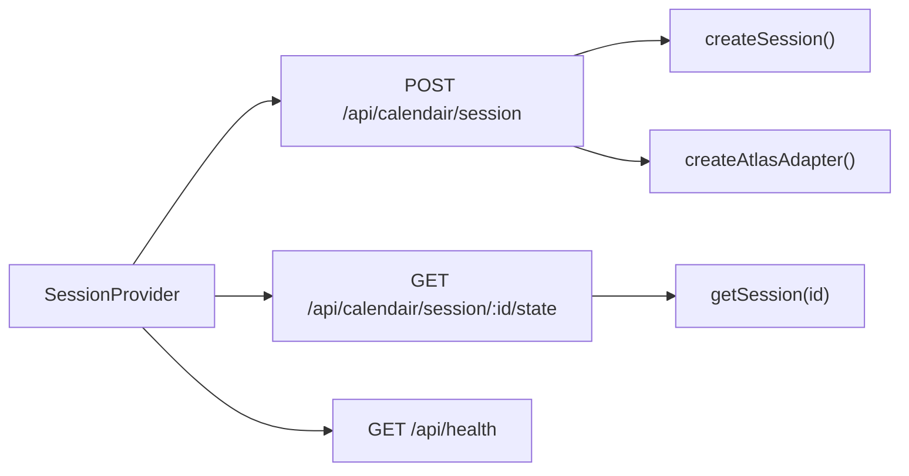

# Session Management

<cite>
**Referenced Files in This Document**
- [route.ts](file://src/app/api/calendair/session/route.ts)
- [state route.ts](file://src/app/api/calendair/session/[id]/state/route.ts)
- [SessionProvider.tsx](file://src/components/calendair/SessionProvider.tsx)
- [store.ts](file://src/lib/calendair/store.ts)
- [types.ts](file://src/lib/calendair/types.ts)
- [health route.ts](file://src/app/api/health/route.ts)
- [e2e.mjs](file://scripts/e2e.mjs)
</cite>

## Table of Contents
1. [Introduction](#introduction)
2. [Project Structure](#project-structure)
3. [Core Components](#core-components)
4. [Architecture Overview](#architecture-overview)
5. [Detailed Component Analysis](#detailed-component-analysis)
6. [Dependency Analysis](#dependency-analysis)
7. [Performance Considerations](#performance-considerations)
8. [Troubleshooting Guide](#troubleshooting-guide)
9. [Conclusion](#conclusion)
10. [Appendices](#appendices)

## Introduction
This document provides detailed API documentation for CALENDAIR’s session management endpoints, focusing on:
- Creating a session (POST /api/calendair/session)
- Retrieving and synchronizing session state (GET /api/calendair/session/[id]/state)
- Session lifecycle, timeouts, and server-side storage behavior
- Authentication requirements, rate limiting, and error handling
- Client implementation guidelines for concurrent sessions and network failures

The goal is to enable clients to initialize sessions reliably, poll for updates, handle errors gracefully, and manage multiple sessions safely.

## Project Structure
The session management APIs are implemented as Next.js Route Handlers under the calendair namespace. The client-side session orchestration lives in a React provider that persists the active session id and coordinates polling and actions.

**Diagram sources**
- [route.ts:24-59](file://src/app/api/calendair/session/route.ts#L24-L59)
- [state route.ts:6-34](file://src/app/api/calendair/session/[id]/state/route.ts#L6-L34)
- [store.ts:69-92](file://src/lib/calendair/store.ts#L69-L92)
- [health route.ts:10-38](file://src/app/api/health/route.ts#L10-L38)

**Section sources**
- [route.ts:24-59](file://src/app/api/calendair/session/route.ts#L24-L59)
- [state route.ts:6-34](file://src/app/api/calendair/session/[id]/state/route.ts#L6-L34)
- [store.ts:69-92](file://src/lib/calendair/store.ts#L69-L92)
- [health route.ts:10-38](file://src/app/api/health/route.ts#L10-L38)

## Core Components
- Session creation endpoint: POST /api/calendair/session
  - Accepts optional scenario and profile payload
  - Returns sessionId, scenario, demoMode, atlas status, world snapshot, and initial booking state
- Session state retrieval endpoint: GET /api/calendair/session/[id]/state
  - Returns current booking state, activity log, engine snapshot, and world snapshot
  - Returns 404 with an error when the session has expired or does not exist
- In-memory session store with TTL-based cleanup
  - Sessions expire after 2 hours of inactivity
  - Each access refreshes the last-touched timestamp
- Client-side session provider
  - Persists sessionId in sessionStorage to resume across reloads
  - Provides methods to scan, authorize, accept price, book, and poll fulfilment
  - Centralizes error handling and optimistic UI updates

**Section sources**
- [route.ts:24-59](file://src/app/api/calendair/session/route.ts#L24-L59)
- [state route.ts:6-34](file://src/app/api/calendair/session/[id]/state/route.ts#L6-L34)
- [store.ts:53-92](file://src/lib/calendair/store.ts#L53-L92)
- [SessionProvider.tsx:114-175](file://src/components/calendair/SessionProvider.tsx#L114-L175)

## Architecture Overview
The session lifecycle is driven by the client provider and backed by server routes. On start, the client calls the session creation endpoint, receives a sessionId, and resumes or initializes state via the state endpoint. Subsequent interactions update the session’s booking state and activity log, which can be polled or read directly.

**Diagram sources**
- [route.ts:24-59](file://src/app/api/calendair/session/route.ts#L24-L59)
- [state route.ts:6-34](file://src/app/api/calendair/session/[id]/state/route.ts#L6-L34)
- [store.ts:69-92](file://src/lib/calendair/store.ts#L69-L92)
- [health route.ts:10-38](file://src/app/api/health/route.ts#L10-L38)

## Detailed Component Analysis

### Session Creation: POST /api/calendair/session
- Purpose: Start a new demo run and return the session context needed by the client.
- Request body:
  - scenario: optional string; validated against allowed values; defaults to environment variable or “perfect”
  - profile: optional loose object; sanitized and only accepted if completed
- Response:
  - sessionId: unique identifier for the session
  - scenario: effective scenario used
  - demoMode: runtime mode from environment
  - atlas: provider status snapshot
  - world: travel window, companions, busy blocks, passenger info (sanitized), and profile source
  - booking: initial booking state
- Error handling:
  - Malformed JSON is tolerated; defaults are applied
  - Unknown scenarios are normalized to a safe default

Implementation notes:
- Profile sanitization ensures only fully completed profiles influence the engine
- Atlas adapter is created per request to fetch live status

**Section sources**
- [route.ts:18-36](file://src/app/api/calendair/session/route.ts#L18-L36)
- [route.ts:37-59](file://src/app/api/calendair/session/route.ts#L37-L59)

### Session State Retrieval: GET /api/calendair/session/[id]/state
- Purpose: Read the current state of a session for synchronization and UI updates.
- Path parameter:
  - id: session identifier
- Response:
  - state: current booking state
  - booking: full booking run details
  - activity: recent agent activity log
  - engine: recommended trip, alternates, rejected candidates, scanned count, constraints active, search input
  - world: taste, window, companions, busy blocks, next commitment, profile source
- Errors:
  - 404 with error message when session is missing or expired

State synchronization patterns:
- Polling: Clients may periodically call this endpoint to keep UI in sync with server state
- Resume: After page reload, clients attempt to resume using stored sessionId; if unavailable, they start a new session

Conflict resolution:
- Server owns the authoritative state; client should never assume local state without reconciliation
- If a conflict arises (e.g., stale sessionId), the client should fall back to creating a new session

**Section sources**
- [state route.ts:6-34](file://src/app/api/calendair/session/[id]/state/route.ts#L6-L34)

### Session Lifecycle and Timeouts
- Storage:
  - Sessions are stored in memory using a Map keyed by sessionId
  - Each access updates touchedAt to extend the session lifetime
- Expiration:
  - Sessions older than 2 hours without activity are cleaned up
- Implications:
  - Long idle sessions will eventually expire; clients must handle 404 responses and restart
  - Activity logs are bounded to prevent unbounded growth

**Diagram sources**
- [store.ts:53-92](file://src/lib/calendair/store.ts#L53-L92)
- [state route.ts:6-34](file://src/app/api/calendair/session/[id]/state/route.ts#L6-L34)

**Section sources**
- [store.ts:53-92](file://src/lib/calendair/store.ts#L53-L92)

### Client-Side Session Provider
Responsibilities:
- Initialize and resume sessions
- Persist sessionId in sessionStorage
- Provide methods for scanning, authorizing, accepting price, booking, and polling fulfilment
- Centralize error handling and optimistic updates
- Maintain UI state such as scanning/busy flags and outcomes

Key behaviors:
- On mount, attempts to resume from sessionStorage; falls back to starting a new session
- Uses a shared call helper to normalize errors and update activity/booking state
- Optimistically sets scanning/busy states during long-running operations
- Handles provider status via health endpoint when resuming

**Diagram sources**
- [SessionProvider.tsx:98-333](file://src/components/calendair/SessionProvider.tsx#L98-L333)

**Section sources**
- [SessionProvider.tsx:114-175](file://src/components/calendair/SessionProvider.tsx#L114-L175)
- [SessionProvider.tsx:177-281](file://src/components/calendair/SessionProvider.tsx#L177-L281)

### Data Models and Types
- Session: contains id, timestamps, scenario, world, engine, booking, and activity
- BookingRun: tracks state transitions, approvals, replans, references, results, and calendar blocks
- WorldSnapshot: includes taste, window, companions, busy blocks, next commitment, and profile source
- EngineSnapshot: includes recommended, alternates, rejected, scanned, and constraintsActive
- AtlasAccountStatus: indicates authorization, ticketing availability, environment, adapter, and label

These types define the contracts between server routes and the client provider.

**Section sources**
- [store.ts:15-51](file://src/lib/calendair/store.ts#L15-L51)
- [types.ts:17-56](file://src/lib/calendair/types.ts#L17-L56)
- [types.ts:197-215](file://src/lib/calendair/types.ts#L197-L215)
- [types.ts:265-273](file://src/lib/calendair/types.ts#L265-L273)

## Dependency Analysis
- Session creation depends on:
  - Zod validation for request body
  - Atlas adapter for status
  - Store for session creation
  - Profile sanitization for safety
- State retrieval depends on:
  - Store for session lookup and touch
- Client provider depends on:
  - Health endpoint for provider configuration
  - Session routes for all operations
  - Local storage for persistence

**Diagram sources**
- [route.ts:24-59](file://src/app/api/calendair/session/route.ts#L24-L59)
- [state route.ts:6-34](file://src/app/api/calendair/session/[id]/state/route.ts#L6-L34)
- [SessionProvider.tsx:114-175](file://src/components/calendair/SessionProvider.tsx#L114-L175)
- [health route.ts:10-38](file://src/app/api/health/route.ts#L10-L38)

**Section sources**
- [route.ts:24-59](file://src/app/api/calendair/session/route.ts#L24-L59)
- [state route.ts:6-34](file://src/app/api/calendair/session/[id]/state/route.ts#L6-L34)
- [SessionProvider.tsx:114-175](file://src/components/calendair/SessionProvider.tsx#L114-L175)
- [health route.ts:10-38](file://src/app/api/health/route.ts#L10-L38)

## Performance Considerations
- In-memory store: Fast lookups and updates but not durable across process restarts
- TTL cleanup: Periodic sweep prevents unbounded memory growth; ensure clients do not rely on long-lived sessions beyond 2 hours
- Activity log bounding: Prevents excessive memory usage by trimming old entries
- Minimal payloads: State endpoint returns only necessary fields; avoid over-fetching
- Polling strategy: Use reasonable intervals; debounce rapid polls; handle 404 gracefully

[No sources needed since this section provides general guidance]

## Troubleshooting Guide
Common issues and resolutions:
- Session expired (404):
  - Cause: Session exceeded TTL or was never created
  - Resolution: Create a new session and resume flow
- Malformed request body:
  - Cause: Invalid JSON or unexpected fields
  - Resolution: Ensure content-type is application/json and payload matches expected schema
- Network failures:
  - Cause: Transient connectivity issues
  - Resolution: Implement retries with exponential backoff; surface user-friendly errors
- Concurrent sessions:
  - Cause: Multiple tabs or processes managing different sessions
  - Resolution: Isolate sessionId per tab/process; avoid sharing across contexts

Error handling patterns:
- Always check response.ok before parsing JSON
- Normalize errors into a consistent shape for UI display
- Update activity logs to provide evidence for debugging

**Section sources**
- [state route.ts:6-34](file://src/app/api/calendair/session/[id]/state/route.ts#L6-L34)
- [route.ts:24-59](file://src/app/api/calendair/session/route.ts#L24-L59)
- [SessionProvider.tsx:177-192](file://src/components/calendair/SessionProvider.tsx#L177-L192)

## Conclusion
CALENDAIR’s session management provides a robust, in-memory-backed API for creating and synchronizing sessions with clear expiration semantics. Clients should implement resilient initialization, polling, and error handling to ensure smooth user experiences even under network failures or session expiry. The provider centralizes session orchestration and offers a clean interface for complex workflows like scanning, authorization, and booking.

[No sources needed since this section summarizes without analyzing specific files]

## Appendices

### API Reference

- POST /api/calendair/session
  - Request:
    - scenario: optional string; one of ["perfect", "price-change", "sold-out", "pending"]; defaults to environment or "perfect"
    - profile: optional object; only accepted if completed
  - Response:
    - sessionId: string
    - scenario: string
    - demoMode: string
    - atlas: AtlasAccountStatus
    - world: { taste, window, companions, busy, nextCommitmentIso, profileSource, passenger }
    - booking: BookingRun
  - Notes:
    - Sanitizes profile to prevent unsafe inputs
    - Returns provider status and initial world snapshot

- GET /api/calendair/session/[id]/state
  - Path:
    - id: string (session identifier)
  - Response:
    - state: BookingState
    - booking: BookingRun
    - activity: AgentActivity[]
    - engine: { recommended, alternates, rejected, scanned, constraintsActive, searchInput }
    - world: { taste, window, companions, busy, nextCommitmentIso, profileSource }
  - Errors:
    - 404: { error: "Session expired" }

- GET /api/health
  - Response:
    - ok: boolean
    - service: string
    - time: ISO timestamp
    - demoMode: string
    - maxReplans: number
    - atlas: AtlasAccountStatus
    - calendar: { googleConfigured, source }
    - reasoning: { configured, provider, model, note }

**Section sources**
- [route.ts:24-59](file://src/app/api/calendair/session/route.ts#L24-L59)
- [state route.ts:6-34](file://src/app/api/calendair/session/[id]/state/route.ts#L6-L34)
- [health route.ts:10-38](file://src/app/api/health/route.ts#L10-L38)

### Client Implementation Guidelines

- Initialization:
  - Call POST /api/calendair/session with optional scenario and profile
  - Store sessionId in sessionStorage to survive reloads
  - On mount, attempt to resume via GET /api/calendair/session/[id]/state; fallback to new session if 404

- State polling:
  - Poll GET /api/calendair/session/[id]/state at reasonable intervals during active flows
  - Debounce rapid polls; handle 404 by restarting session
  - Merge server state into local UI state; prefer server authority

- Concurrency:
  - Manage one active session per tab/process
  - Avoid cross-tab sharing of sessionId unless coordinated
  - Use optimistic updates for UI responsiveness; reconcile with server state

- Network failures:
  - Implement retries with exponential backoff
  - Surface user-friendly errors; log activity for diagnostics
  - Gracefully degrade if provider status is unavailable

- Authentication and rate limiting:
  - No explicit authentication middleware observed in session routes
  - No rate limiting observed in session routes
  - Use health endpoint to detect provider configuration and credentials presence

- Session timeout behavior:
  - Sessions expire after 2 hours of inactivity
  - Handle 404 responses by creating a new session
  - Keep clients aware of demoMode and maxReplans via health endpoint

**Section sources**
- [SessionProvider.tsx:114-175](file://src/components/calendair/SessionProvider.tsx#L114-L175)
- [store.ts:53-92](file://src/lib/calendair/store.ts#L53-L92)
- [health route.ts:10-38](file://src/app/api/health/route.ts#L10-L38)
- [e2e.mjs:50-54](file://scripts/e2e.mjs#L50-L54)