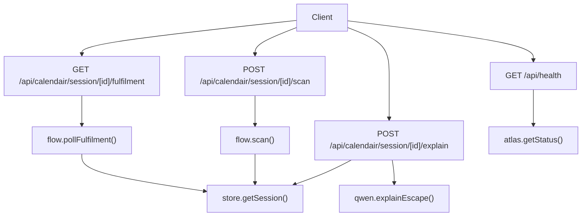
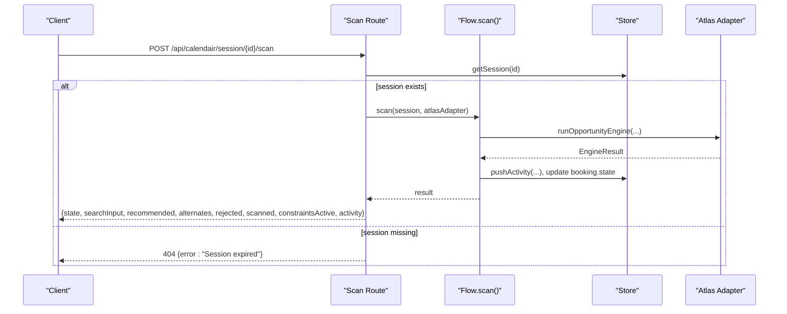
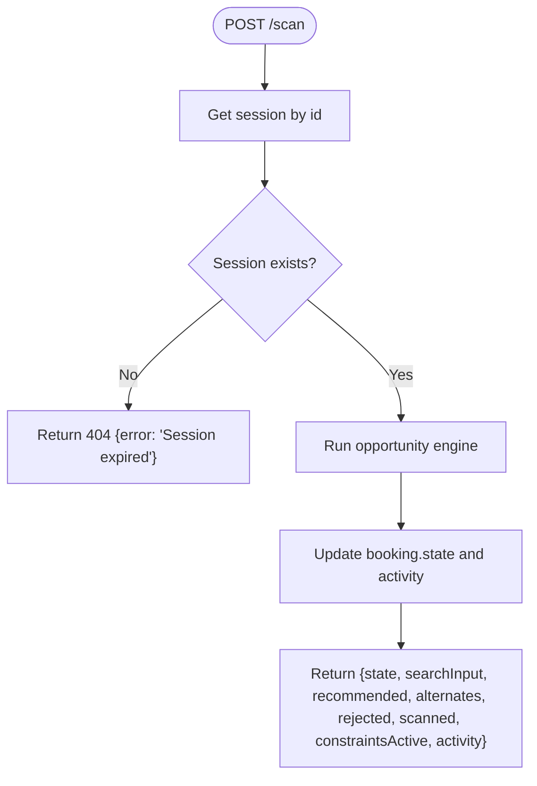
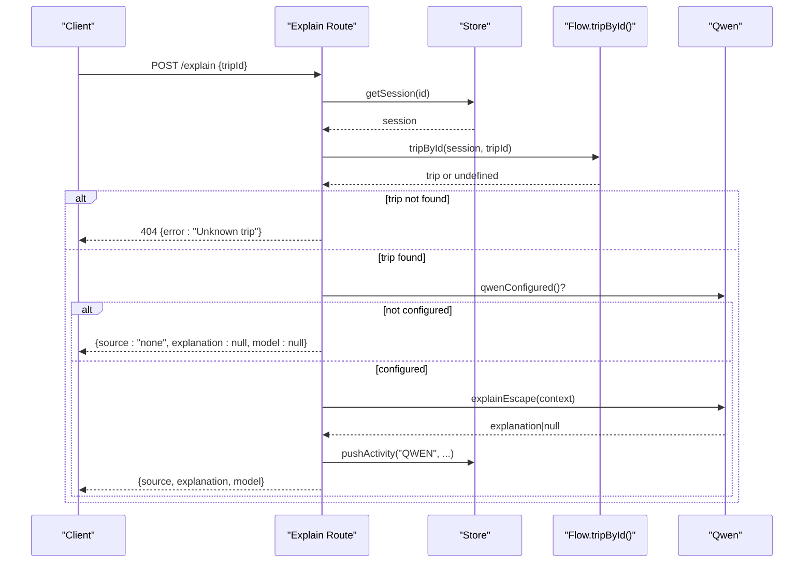
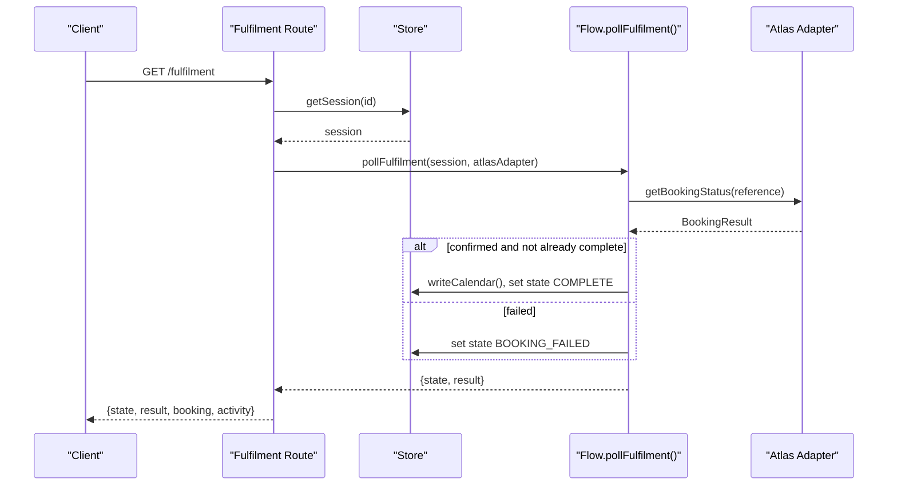
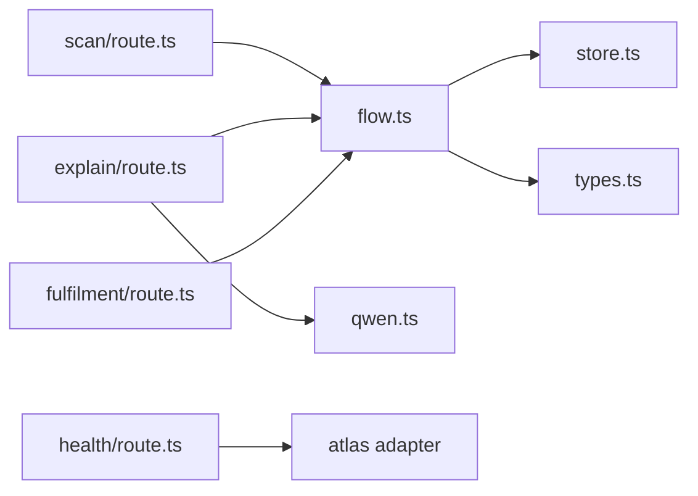

# Utility Endpoints

<cite>
**Referenced Files in This Document**
- [route.ts](file://src/app/api/calendair/session/[id]/scan/route.ts)
- [route.ts](file://src/app/api/calendair/session/[id]/explain/route.ts)
- [route.ts](file://src/app/api/calendair/session/[id]/fulfilment/route.ts)
- [route.ts](file://src/app/api/health/route.ts)
- [flow.ts](file://src/lib/calendair/flow.ts)
- [store.ts](file://src/lib/calendair/store.ts)
- [types.ts](file://src/lib/calendair/types.ts)
- [qwen.ts](file://src/lib/llm/qwen.ts)
</cite>

## Table of Contents
1. [Introduction](#introduction)
2. [Project Structure](#project-structure)
3. [Core Components](#core-components)
4. [Architecture Overview](#architecture-overview)
5. [Detailed Component Analysis](#detailed-component-analysis)
6. [Dependency Analysis](#dependency-analysis)
7. [Performance Considerations](#performance-considerations)
8. [Troubleshooting Guide](#troubleshooting-guide)
9. [Conclusion](#conclusion)

## Introduction
This document provides detailed API documentation for CALENDAIR’s utility endpoints that power calendar window detection, AI-powered trip explanations, booking fulfilment polling, and system health monitoring. It covers request/response contracts, parameter validation, error handling, usage examples, and performance considerations including caching strategies.

## Project Structure
The utility endpoints are implemented as Next.js Route Handlers under the calendair session namespace and a top-level health endpoint. They coordinate with:
- In-memory session store for state management
- A domain flow layer orchestrating scanning, authorisation, booking, and fulfilment
- An Atlas adapter abstraction for provider interactions (demo/live)
- An optional Qwen LLM integration for language-only explanations

**Diagram sources**
- [route.ts:8-33](file://src/app/api/calendair/session/[id]/scan/route.ts#L8-L33)
- [route.ts:20-77](file://src/app/api/calendair/session/[id]/explain/route.ts#L20-L77)
- [route.ts:9-20](file://src/app/api/calendair/session/[id]/fulfilment/route.ts#L9-L20)
- [route.ts:10-38](file://src/app/api/health/route.ts#L10-L38)
- [flow.ts:22-45](file://src/lib/calendair/flow.ts#L22-L45)
- [flow.ts:251-280](file://src/lib/calendair/flow.ts#L251-L280)
- [store.ts:69-92](file://src/lib/calendair/store.ts#L69-L92)
- [qwen.ts:19-21](file://src/lib/llm/qwen.ts#L19-L21)

**Section sources**
- [route.ts:8-33](file://src/app/api/calendair/session/[id]/scan/route.ts#L8-L33)
- [route.ts:20-77](file://src/app/api/calendair/session/[id]/explain/route.ts#L20-L77)
- [route.ts:9-20](file://src/app/api/calendair/session/[id]/fulfilment/route.ts#L9-L20)
- [route.ts:10-38](file://src/app/api/health/route.ts#L10-L38)
- [flow.ts:22-45](file://src/lib/calendair/flow.ts#L22-L45)
- [flow.ts:251-280](file://src/lib/calendair/flow.ts#L251-L280)
- [store.ts:69-92](file://src/lib/calendair/store.ts#L69-L92)
- [qwen.ts:19-21](file://src/lib/llm/qwen.ts#L19-L21)

## Core Components
- Session lifecycle and persistence: In-memory Map with TTL-based sweep; touchedAt updated on access.
- Domain flow: Orchestrates scanning, verification, booking, and fulfilment with explicit state transitions and activity logging.
- Provider abstraction: Atlas adapter encapsulates provider-specific calls; status checks used by health and flows.
- Optional reasoning: Qwen integration for human-friendly explanations, guarded by configuration and timeouts.

Key responsibilities:
- scan: Discover opportunities within detected calendar windows using the opportunity engine.
- explain: Generate a concise “why this fits” sentence based on deterministic factors and traveller context.
- fulfilment: Poll provider until confirmed, then write calendar blocks and mark complete.
- health: Report service configuration and provider readiness without leaking secrets.

**Section sources**
- [store.ts:15-51](file://src/lib/calendair/store.ts#L15-L51)
- [store.ts:53-92](file://src/lib/calendair/store.ts#L53-L92)
- [flow.ts:22-45](file://src/lib/calendair/flow.ts#L22-L45)
- [flow.ts:251-280](file://src/lib/calendair/flow.ts#L251-L280)
- [qwen.ts:19-21](file://src/lib/llm/qwen.ts#L19-L21)

## Architecture Overview
The endpoints follow a layered architecture:
- HTTP layer: Validates inputs, resolves sessions, and returns JSON responses.
- Domain layer: Encapsulates business rules, state transitions, and activity logging.
- Integration layer: Atlas adapter abstracts external provider calls.
- Optional enrichment: Qwen model for language-only explanation text.

**Diagram sources**
- [route.ts:8-33](file://src/app/api/calendair/session/[id]/scan/route.ts#L8-L33)
- [flow.ts:22-45](file://src/lib/calendair/flow.ts#L22-L45)
- [store.ts:88-92](file://src/lib/calendair/store.ts#L88-L92)

## Detailed Component Analysis

### Scan Endpoint
- Method and path: POST /api/calendair/session/[id]/scan
- Purpose: Perform read-only discovery of opportunities within detected calendar windows.
- Request body: None required by the route handler.
- Path parameters:
  - id: string — session identifier obtained from session creation.
- Response fields:
  - state: BookingState — current booking state after scan.
  - searchInput: FlightSearchInput — normalized search parameters derived from the session world.
  - recommended: ScoredTrip | null — best candidate if any cleared hard constraints.
  - alternates: ScoredTrip[] — other candidates considered.
  - rejected: RejectedCandidate[] — offers that failed hard constraints.
  - scanned: number — count of offers evaluated.
  - constraintsActive: boolean — whether hard constraints were active during scan.
  - activity: AgentActivity[] — audit log entries produced during scan.
- Error responses:
  - 404 Not Found: { error: "Session expired" } when session is missing.
  - 501 Not Implemented: { error, atlasNotWired: true } when provider adapter is not configured.
  - 502 Bad Gateway: { error, atlasNotWired: false } for other provider errors.
- Validation:
  - The route validates session existence; provider wiring is checked via adapter errors.
- Usage example:
  - POST to the scan endpoint with a valid session id to discover opportunities.
  - Inspect recommended and alternates to present options to the user.
- Performance notes:
  - Scanning runs the opportunity engine once per call; results are stored in session.engine for reuse.
  - Activity log is bounded to prevent unbounded growth.

**Diagram sources**
- [route.ts:8-33](file://src/app/api/calendair/session/[id]/scan/route.ts#L8-L33)
- [flow.ts:22-45](file://src/lib/calendair/flow.ts#L22-L45)
- [store.ts:94-98](file://src/lib/calendair/store.ts#L94-L98)

**Section sources**
- [route.ts:8-33](file://src/app/api/calendair/session/[id]/scan/route.ts#L8-L33)
- [flow.ts:22-45](file://src/lib/calendair/flow.ts#L22-L45)
- [types.ts:106-114](file://src/lib/calendair/types.ts#L106-L114)
- [types.ts:163-185](file://src/lib/calendair/types.ts#L163-L185)
- [store.ts:94-98](file://src/lib/calendair/store.ts#L94-L98)

### Explain Endpoint
- Method and path: POST /api/calendair/session/[id]/explain
- Purpose: Generate an AI-powered, language-only explanation of why a trip fits the traveller’s life.
- Request body:
  - tripId: string (required) — identifies a trip from the current session’s engine results.
- Path parameters:
  - id: string — session identifier.
- Response fields:
  - source: "qwen" | "none" — indicates whether an LLM-generated explanation was produced.
  - explanation: string | null — concise “why this fits” sentence or null if unavailable.
  - model: string | null — model name used when available.
- Validation:
  - Body validated with schema requiring tripId; missing or invalid body returns 400.
  - If tripId does not match any trip in the session, returns 404.
  - If LLM is not configured, returns source "none" and null explanation.
- Side effects:
  - On success, writes the explanation into the trip object and logs an activity event.
- Usage example:
  - POST with { tripId } to get a warm, human-readable reason for the recommendation.
- Performance notes:
  - LLM call is guarded by timeout and configuration checks; failures degrade gracefully.
  - Explanation is persisted in-session to avoid repeated calls on refresh.

**Diagram sources**
- [route.ts:20-77](file://src/app/api/calendair/session/[id]/explain/route.ts#L20-L77)
- [flow.ts:47-51](file://src/lib/calendair/flow.ts#L47-L51)
- [qwen.ts:19-21](file://src/lib/llm/qwen.ts#L19-L21)
- [qwen.ts:46-100](file://src/lib/llm/qwen.ts#L46-L100)
- [store.ts:94-98](file://src/lib/calendair/store.ts#L94-L98)

**Section sources**
- [route.ts:20-77](file://src/app/api/calendair/session/[id]/explain/route.ts#L20-L77)
- [flow.ts:47-51](file://src/lib/calendair/flow.ts#L47-L51)
- [qwen.ts:19-21](file://src/lib/llm/qwen.ts#L19-L21)
- [qwen.ts:46-100](file://src/lib/llm/qwen.ts#L46-L100)
- [store.ts:94-98](file://src/lib/calendair/store.ts#L94-L98)

### Fulfilment Endpoint
- Method and path: GET /api/calendair/session/[id]/fulfilment
- Purpose: Poll the provider for actual booking outcome and update calendar upon confirmation.
- Path parameters:
  - id: string — session identifier.
- Response fields:
  - state: BookingState — current booking state after polling.
  - result: BookingResult | undefined — latest provider status for the reference.
  - booking: BookingRun — full booking snapshot for client state reconciliation.
  - activity: AgentActivity[] — updated activity log reflecting polling outcomes.
- Behavior:
  - If no booking reference exists, returns current state and result without changes.
  - On provider confirmation, writes calendar blocks and sets state to COMPLETE.
- Usage example:
  - Poll repeatedly until state becomes COMPLETE or BOOKING_FAILED.
- Performance notes:
  - Calendar blocks are written only after confirmed fulfilment to avoid premature updates.
  - Activity log captures each step for traceability.

**Diagram sources**
- [route.ts:9-20](file://src/app/api/calendair/session/[id]/fulfilment/route.ts#L9-L20)
- [flow.ts:251-280](file://src/lib/calendair/flow.ts#L251-L280)
- [flow.ts:288-343](file://src/lib/calendair/flow.ts#L288-L343)
- [store.ts:88-92](file://src/lib/calendair/store.ts#L88-L92)

**Section sources**
- [route.ts:9-20](file://src/app/api/calendair/session/[id]/fulfilment/route.ts#L9-L20)
- [flow.ts:251-280](file://src/lib/calendair/flow.ts#L251-L280)
- [flow.ts:288-343](file://src/lib/calendair/flow.ts#L288-L343)
- [store.ts:88-92](file://src/lib/calendair/store.ts#L88-L92)

### Health Check Endpoint
- Method and path: GET /api/health
- Purpose: Provide system monitoring and configuration status without exposing secrets.
- Response fields:
  - ok: boolean — always true when reachable.
  - service: string — service name.
  - time: string — ISO timestamp of response generation.
  - demoMode: string — current demo mode setting.
  - demoScenario: string — scenario being used.
  - maxReplans: number — replan limit enforced during authorisation.
  - atlas: object — provider adapter status and credential presence flags.
  - calendar: object — Google calendar configuration status and source.
  - reasoning: object — LLM configuration status, provider, model, and usage note.
- Usage example:
  - Periodically poll to verify service availability and integration readiness.

**Section sources**
- [route.ts:10-38](file://src/app/api/health/route.ts#L10-L38)

## Dependency Analysis
- Route handlers depend on:
  - Session store for state retrieval and activity logging.
  - Flow layer for domain operations (scan, explain via trip lookup, fulfilment polling).
  - Atlas adapter for provider status and booking operations.
  - Qwen module for optional explanation generation.
- Coupling and cohesion:
  - Routes are thin controllers delegating to cohesive domain functions.
  - Flow encapsulates complex state transitions and side effects, improving maintainability.
- External dependencies:
  - Atlas adapter abstracts provider specifics; health endpoint surfaces readiness without secrets.
  - Qwen integration is optional and fails safely when unconfigured or timed out.

**Diagram sources**
- [route.ts:8-33](file://src/app/api/calendair/session/[id]/scan/route.ts#L8-L33)
- [route.ts:20-77](file://src/app/api/calendair/session/[id]/explain/route.ts#L20-L77)
- [route.ts:9-20](file://src/app/api/calendair/session/[id]/fulfilment/route.ts#L9-L20)
- [route.ts:10-38](file://src/app/api/health/route.ts#L10-L38)
- [flow.ts:22-45](file://src/lib/calendair/flow.ts#L22-L45)
- [flow.ts:251-280](file://src/lib/calendair/flow.ts#L251-L280)
- [store.ts:69-92](file://src/lib/calendair/store.ts#L69-L92)
- [types.ts:197-215](file://src/lib/calendair/types.ts#L197-L215)

**Section sources**
- [flow.ts:22-45](file://src/lib/calendair/flow.ts#L22-L45)
- [flow.ts:251-280](file://src/lib/calendair/flow.ts#L251-L280)
- [store.ts:69-92](file://src/lib/calendair/store.ts#L69-L92)
- [types.ts:197-215](file://src/lib/calendair/types.ts#L197-L215)

## Performance Considerations
- Session storage:
  - In-memory Map with TTL-based sweep reduces memory pressure; sessions expire after a fixed period.
  - touchedAt updated on access to keep active sessions alive.
- Activity log:
  - Bounded to a maximum length to prevent unbounded growth.
- LLM integration:
  - Timeout guard prevents long-running requests; failures degrade gracefully to deterministic reasons.
  - Explanations are cached in-session to avoid repeated calls on page refresh.
- Provider calls:
  - Reverification and booking steps call provider APIs; ensure retries/backoff at higher layers if needed.
- Calendar writes:
  - Only performed after confirmed fulfilment to avoid unnecessary updates.

[No sources needed since this section provides general guidance]

## Troubleshooting Guide
Common issues and resolutions:
- Session expired:
  - Cause: Session not found or TTL exceeded.
  - Action: Create a new session before calling scan/explain/fulfilment.
- Unknown trip:
  - Cause: tripId does not exist in current session’s engine results.
  - Action: Ensure tripId comes from the most recent scan results.
- Provider not wired:
  - Cause: Atlas adapter not configured or credentials missing.
  - Action: Configure environment variables for the desired provider; check health endpoint.
- LLM not configured:
  - Cause: Missing API key or model name.
  - Action: Set required environment variables; otherwise expect source "none".
- Booking pending or failed:
  - Cause: Provider still processing or rejection.
  - Action: Poll fulfilment endpoint until state becomes COMPLETE or BOOKING_FAILED.

**Section sources**
- [route.ts:8-33](file://src/app/api/calendair/session/[id]/scan/route.ts#L8-L33)
- [route.ts:20-77](file://src/app/api/calendair/session/[id]/explain/route.ts#L20-L77)
- [route.ts:9-20](file://src/app/api/calendair/session/[id]/fulfilment/route.ts#L9-L20)
- [route.ts:10-38](file://src/app/api/health/route.ts#L10-L38)
- [store.ts:53-92](file://src/lib/calendair/store.ts#L53-L92)
- [qwen.ts:19-21](file://src/lib/llm/qwen.ts#L19-L21)

## Conclusion
CALENDAIR’s utility endpoints provide a robust foundation for discovering travel opportunities, explaining recommendations with AI, confirming bookings through provider polling, and monitoring system health. The design emphasizes safety (hard constraints, safe stops), clarity (activity logs), and resilience (graceful degradation when providers or LLMs are unavailable). Use the health endpoint to validate configuration, scan to find opportunities, explain to enrich UI messaging, and fulfilment to finalize bookings and update calendars.

[No sources needed since this section summarizes without analyzing specific files]