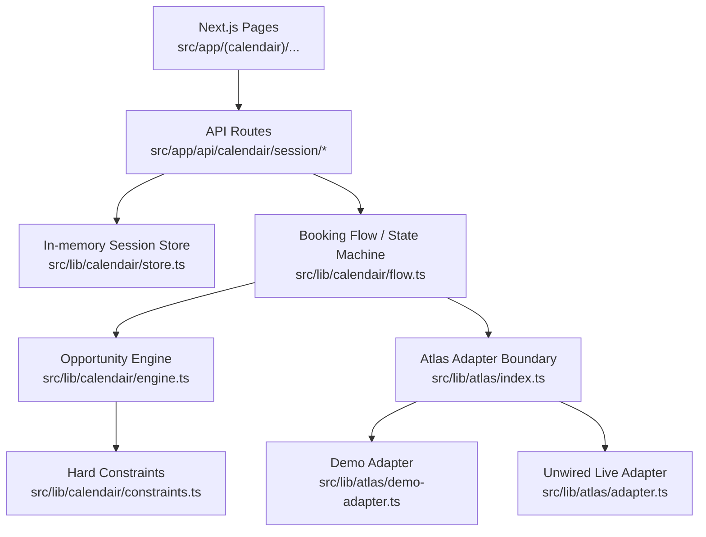
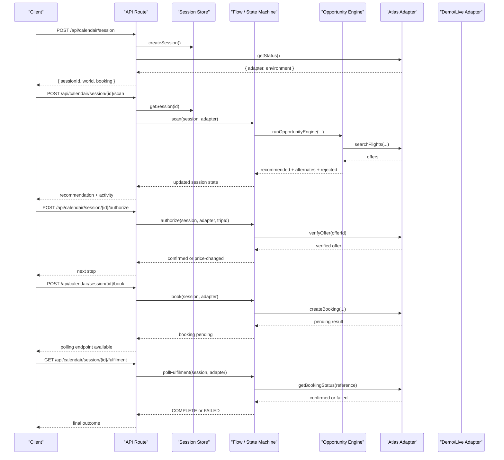
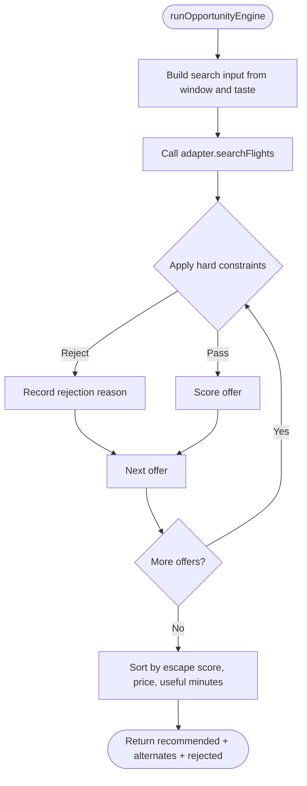
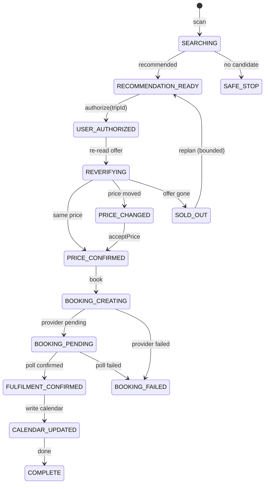
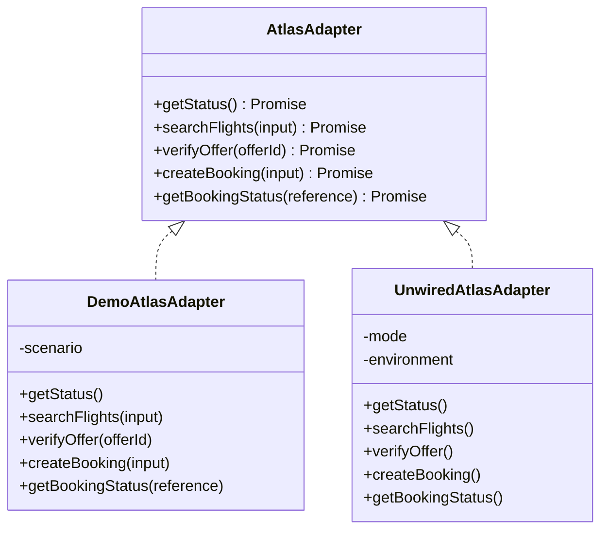
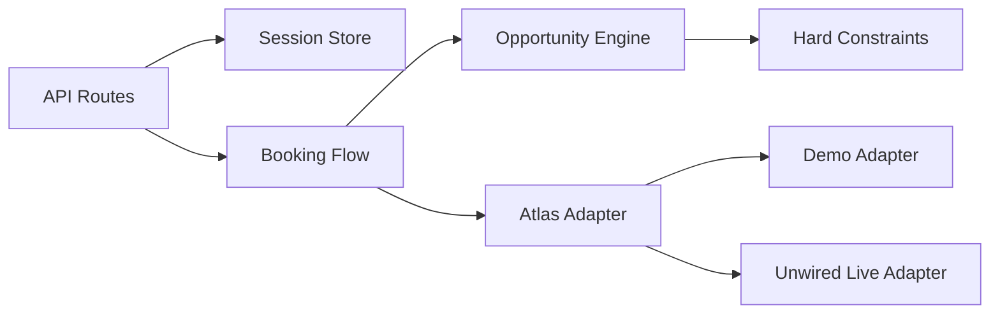

# Architecture Overview

<cite>
**Referenced Files in This Document**
- [README.md](file://README.md)
- [package.json](file://package.json)
- [types.ts](file://src/lib/calendair/types.ts)
- [engine.ts](file://src/lib/calendair/engine.ts)
- [constraints.ts](file://src/lib/calendair/constraints.ts)
- [flow.ts](file://src/lib/calendair/flow.ts)
- [store.ts](file://src/lib/calendair/store.ts)
- [adapter.ts](file://src/lib/atlas/adapter.ts)
- [demo-adapter.ts](file://src/lib/atlas/demo-adapter.ts)
- [index.ts](file://src/lib/atlas/index.ts)
- [session route.ts](file://src/app/api/calendair/session/route.ts)
- [scan route.ts](file://src/app/api/calendair/session/[id]/scan/route.ts)
- [authorize route.ts](file://src/app/api/calendair/session/[id]/authorize/route.ts)
- [book route.ts](file://src/app/api/calendair/session/[id]/book/route.ts)
- [fulfilment route.ts](file://src/app/api/calendair/session/[id]/fulfilment/route.ts)
- [SessionProvider.tsx](file://src/components/calendair/SessionProvider.tsx)
</cite>

## Table of Contents
1. Introduction
2. Project Structure
3. Core Components
4. Architecture Overview
5. Detailed Component Analysis
6. Dependency Analysis
7. Performance Considerations
8. Troubleshooting Guide
9. Conclusion

## Introduction
CALENDAIR turns unexpected free time in a calendar into a safe, bookable travel escape. It reads free/busy windows, runs deterministic business logic to find the best option, and then guides a human through checkpoints before any booking is created or calendar updated. The system separates deterministic rules (time math, constraints, scoring, state machine) from optional AI-assisted text generation, ensuring that no AI can invent numbers that become promises.

High-level flow:
- Calendar window detection
- Deterministic opportunity engine with hard constraints and scoring
- Human checkpoint for authorization and price confirmation
- Provider interaction via an adapter boundary
- Fulfilment polling until the provider confirms
- Calendar write-back only after confirmed fulfilment

**Section sources**
- [README.md:93-105](file://README.md#L93-L105)
- [README.md:116-137](file://README.md#L116-L137)

## Project Structure
The application is a Next.js App Router project. Client pages drive user interactions; server API routes own the session state and orchestrate the booking workflow. The core domain lives under src/lib/calendair, while provider integration is isolated behind src/lib/atlas.

**Diagram sources**
- [session route.ts:23-59](file://src/app/api/calendair/session/route.ts#L23-L59)
- [scan route.ts:8-33](file://src/app/api/calendair/session/[id]/scan/route.ts#L8-L33)
- [flow.ts:22-45](file://src/lib/calendair/flow.ts#L22-L45)
- [engine.ts:88-201](file://src/lib/calendair/engine.ts#L88-L201)
- [constraints.ts:42-161](file://src/lib/calendair/constraints.ts#L42-L161)
- [index.ts:18-37](file://src/lib/atlas/index.ts#L18-L37)
- [demo-adapter.ts:28-114](file://src/lib/atlas/demo-adapter.ts#L28-L114)
- [adapter.ts:23-79](file://src/lib/atlas/adapter.ts#L23-L79)

**Section sources**
- [package.json:5-16](file://package.json#L5-L16)
- [README.md:92-114](file://README.md#L92-L114)

## Core Components
- Opportunity Engine: deterministic search input builder, companion overlap check, constraint filtering, scoring, and ranking.
- Hard Constraints: pass/fail checks on budget, useful time, flight length, stops, return buffer, companion availability, and reference-only offers.
- Booking Flow: explicit state machine governing scan, authorize/reverify, accept price, book, poll fulfilment, and calendar update.
- Atlas Adapter Boundary: single interface abstracting provider access; demo adapter for deterministic scenarios; unwired live adapter that refuses to pretend.
- Session Store: in-memory server-side session holding world snapshot, engine results, booking run state, and activity log.
- Client Context: React context holds per-run snapshots and delegates consequential steps to the server.

Key types define the contracts between components: windows, companions, offers, verified offers, scoring factors, booking states, and activity entries.

**Section sources**
- [engine.ts:15-39](file://src/lib/calendair/engine.ts#L15-L39)
- [constraints.ts:15-37](file://src/lib/calendair/constraints.ts#L15-L37)
- [flow.ts:8-18](file://src/lib/calendair/flow.ts#L8-L18)
- [adapter.ts:10-29](file://src/lib/atlas/adapter.ts#L10-L29)
- [store.ts:7-51](file://src/lib/calendair/store.ts#L7-L51)
- [types.ts:17-274](file://src/lib/calendair/types.ts#L17-L274)

## Architecture Overview
CALENDAIR follows a layered architecture:
- Presentation: Next.js pages and client context for UI state.
- API Layer: App Router routes that validate inputs, load sessions, and call domain functions.
- Domain Layer: Opportunity engine, constraints, scoring, and booking state machine.
- Integration Layer: Atlas adapter boundary isolating provider specifics.

**Diagram sources**
- [session route.ts:23-59](file://src/app/api/calendair/session/route.ts#L23-L59)
- [scan route.ts:8-33](file://src/app/api/calendair/session/[id]/scan/route.ts#L8-L33)
- [authorize route.ts:14-23](file://src/app/api/calendair/session/[id]/authorize/route.ts#L14-L23)
- [book route.ts:8-22](file://src/app/api/calendair/session/[id]/book/route.ts#L8-L22)
- [fulfilment route.ts:8-19](file://src/app/api/calendair/session/[id]/fulfilment/route.ts#L8-L19)
- [flow.ts:22-280](file://src/lib/calendair/flow.ts#L22-L280)
- [engine.ts:88-201](file://src/lib/calendair/engine.ts#L88-L201)
- [demo-adapter.ts:56-114](file://src/lib/atlas/demo-adapter.ts#L56-L114)

## Detailed Component Analysis

### Opportunity Engine
- Builds a FlightSearchInput from the detected window and taste preferences.
- Checks companion overlap using free/busy only; titles are never used.
- Calls the provider through the adapter to retrieve offers.
- Applies hard constraints to filter out non-viable options.
- Scores viable offers deterministically and ranks them by escape score, price, and useful minutes.
- Returns one hero recommendation plus up to two alternates, along with detailed rejection reasons.

**Diagram sources**
- [engine.ts:77-201](file://src/lib/calendair/engine.ts#L77-L201)
- [constraints.ts:42-161](file://src/lib/calendair/constraints.ts#L42-L161)

**Section sources**
- [engine.ts:15-39](file://src/lib/calendair/engine.ts#L15-L39)
- [engine.ts:88-201](file://src/lib/calendair/engine.ts#L88-L201)
- [constraints.ts:42-161](file://src/lib/calendair/constraints.ts#L42-L161)

### Hard Constraints
- Enforces pass/fail rules: complete itinerary, departure within window, return before next commitment, minimum return buffer, budget ceiling in comparable currency, minimum useful time at destination, maximum flight duration, maximum stops, companion availability, and reference-only offers cannot proceed to booking.
- Converts budgets across currencies once and carries the converted ceiling to prevent accidental unit mismatches.
- Produces structured rejections with rule names and details for transparency.

**Section sources**
- [constraints.ts:6-161](file://src/lib/calendair/constraints.ts#L6-L161)

### Booking State Machine
- Explicit states model the lifecycle: WINDOW_DETECTED through COMPLETE, with branches for price changes, sold-out replans, and safe stops.
- Authorize triggers a fresh read of the offer; if price changed, the traveller must explicitly accept before proceeding.
- Book creates the first write against the approved total; the provider may return pending.
- PollFulfilment waits for the provider’s own confirmed state before updating the calendar.
- Replanning is bounded by a configurable limit; replacements require human decisions.

**Diagram sources**
- [flow.ts:22-280](file://src/lib/calendair/flow.ts#L22-L280)
- [types.ts:197-215](file://src/lib/calendair/types.ts#L197-L215)

**Section sources**
- [flow.ts:59-210](file://src/lib/calendair/flow.ts#L59-L210)
- [flow.ts:212-280](file://src/lib/calendair/flow.ts#L212-L280)
- [types.ts:197-215](file://src/lib/calendair/types.ts#L197-L215)

### Adapter Pattern for Provider Abstraction
- Single interface defines provider operations: status, search, verify, create booking, and status polling.
- Factory selects adapter based on environment variables and scenario; caches instances to keep references alive across requests.
- Demo adapter provides deterministic inventory and simulated ticketing timelines for reliable demos.
- Unwired live adapter throws explicit errors when live mode is selected without implementation, preventing silent fallback to demo data.

**Diagram sources**
- [adapter.ts:23-79](file://src/lib/atlas/adapter.ts#L23-L79)
- [demo-adapter.ts:28-114](file://src/lib/atlas/demo-adapter.ts#L28-L114)
- [index.ts:18-37](file://src/lib/atlas/index.ts#L18-L37)

**Section sources**
- [adapter.ts:10-79](file://src/lib/atlas/adapter.ts#L10-L79)
- [demo-adapter.ts:14-114](file://src/lib/atlas/demo-adapter.ts#L14-L114)
- [index.ts:8-37](file://src/lib/atlas/index.ts#L8-L37)

### Context-Based State Management
- Server owns the session state machine; clients never decide outcomes like confirmation.
- In-memory store keeps session, world snapshot, engine results, booking run, and activity log.
- Client component maintains a lightweight snapshot and calls server endpoints for every consequential step.
- Activity log records each action with source attribution and timing, sanitized to exclude sensitive data.

**Section sources**
- [store.ts:7-51](file://src/lib/calendair/store.ts#L7-L51)
- [SessionProvider.tsx:27-54](file://src/components/calendair/SessionProvider.tsx#L27-L54)
- [types.ts:248-274](file://src/lib/calendair/types.ts#L248-L274)

### Separation of Deterministic Logic and AI-Assisted Components
- Deterministic parts include timezone arithmetic, budget limits, price comparison, hard-constraint decisions, booking state transitions, and fulfilment assertions.
- AI is limited to interpreting stated preferences or phrasing explanations; it cannot produce numbers that become promises.
- Safety properties ensure hard constraints cannot be overridden by scores and that no titles, tokens, or document numbers reach logs.

**Section sources**
- [README.md:116-121](file://README.md#L116-L121)
- [README.md:73-90](file://README.md#L73-L90)
- [engine.ts:15-21](file://src/lib/calendair/engine.ts#L15-L21)

### Client-Server Communication Model
- Next.js App Router API routes expose a small set of endpoints:
  - Create session and read world
  - Scan for opportunities
  - Authorize and reverify offers
  - Accept price changes
  - Create bookings
  - Poll fulfilment
- Each route validates inputs, loads the session, invokes domain functions, and returns normalized responses including state, booking, and activity.

**Section sources**
- [session route.ts:23-59](file://src/app/api/calendair/session/route.ts#L23-L59)
- [scan route.ts:8-33](file://src/app/api/calendair/session/[id]/scan/route.ts#L8-L33)
- [authorize route.ts:14-23](file://src/app/api/calendair/session/[id]/authorize/route.ts#L14-L23)
- [book route.ts:8-22](file://src/app/api/calendair/session/[id]/book/route.ts#L8-L22)
- [fulfilment route.ts:8-19](file://src/app/api/calendair/session/[id]/fulfilment/route.ts#L8-L19)

### Hybrid Demo/Live Provider Switching
- Environment variable selects adapter mode:
  - Unset or visual: deterministic demo inventory
  - skill or atrip: unwired live adapter unless implemented
- Scenario parameter drives demo behavior such as price changes, sold-out offers, or pending ticketing.
- Status response always reveals which adapter answered and the environment label.

**Section sources**
- [index.ts:8-37](file://src/lib/atlas/index.ts#L8-L37)
- [demo-adapter.ts:33-41](file://src/lib/atlas/demo-adapter.ts#L33-L41)
- [adapter.ts:43-79](file://src/lib/atlas/adapter.ts#L43-L79)
- [session route.ts:23-59](file://src/app/api/calendair/session/route.ts#L23-L59)

### Security Considerations and Human-in-the-Loop Approvals
- Profile sanitization rebuilds fields server-side; unknown or unsafe values are dropped.
- Hard constraints enforce budgets and feasibility regardless of client input.
- Reference-only fares cannot be booked; verification is required before any write.
- Price changes require explicit acceptance before booking proceeds.
- A successful HTTP response is not treated as a journey; fulfilment is asserted before calendar updates.
- Activity logs sanitize sensitive information; titles, tokens, and document numbers are excluded.

**Section sources**
- [README.md:73-90](file://README.md#L73-L90)
- [flow.ts:59-84](file://src/lib/calendair/flow.ts#L59-L84)
- [flow.ts:192-210](file://src/lib/calendair/flow.ts#L192-L210)
- [flow.ts:212-280](file://src/lib/calendair/flow.ts#L212-L280)
- [types.ts:248-274](file://src/lib/calendair/types.ts#L248-L274)

## Dependency Analysis

**Diagram sources**
- [session route.ts:23-59](file://src/app/api/calendair/session/route.ts#L23-L59)
- [flow.ts:22-280](file://src/lib/calendair/flow.ts#L22-L280)
- [engine.ts:88-201](file://src/lib/calendair/engine.ts#L88-L201)
- [constraints.ts:42-161](file://src/lib/calendair/constraints.ts#L42-L161)
- [index.ts:18-37](file://src/lib/atlas/index.ts#L18-L37)
- [demo-adapter.ts:28-114](file://src/lib/atlas/demo-adapter.ts#L28-L114)
- [adapter.ts:23-79](file://src/lib/atlas/adapter.ts#L23-L79)

**Section sources**
- [flow.ts:22-280](file://src/lib/calendair/flow.ts#L22-L280)
- [engine.ts:88-201](file://src/lib/calendair/engine.ts#L88-L201)
- [index.ts:18-37](file://src/lib/atlas/index.ts#L18-L37)

## Performance Considerations
- Caching adapters by configuration avoids recreating provider clients per request.
- Reverification reads fresh offers before writes to minimize stale data risk.
- Scoring and ranking operate over provider-supplied sets; keep search scopes tight to reduce processing.
- In-memory session storage is suitable for demo scale; consider persistence for production workloads.

[No sources needed since this section provides general guidance]

## Troubleshooting Guide
- If searching fails because live mode is configured without implementation, the API returns a specific error indicating the adapter is not wired.
- If an offer disappears during reverify, the flow replans up to a bounded limit and stops safely if no replacement clears constraints.
- If the provider remains pending, polling continues until a confirmed or failed state is returned; calendar is not written until confirmed.
- Use the health endpoint to confirm which adapter is active without exposing secrets.

**Section sources**
- [scan route.ts:14-33](file://src/app/api/calendair/session/[id]/scan/route.ts#L14-L33)
- [flow.ts:147-190](file://src/lib/calendair/flow.ts#L147-L190)
- [flow.ts:250-280](file://src/lib/calendair/flow.ts#L250-L280)
- [README.md:164-167](file://README.md#L164-L167)

## Conclusion
CALENDAIR combines deterministic business logic with a clear provider abstraction to deliver safe, auditable travel recommendations. The adapter pattern isolates external dependencies, the state machine enforces human checkpoints, and the separation between deterministic code and optional AI ensures trustworthiness. The Next.js App Router API routes provide a clean client-server contract, while hybrid demo/live switching supports both stage reliability and real integrations.

[No sources needed since this section summarizes without analyzing specific files]