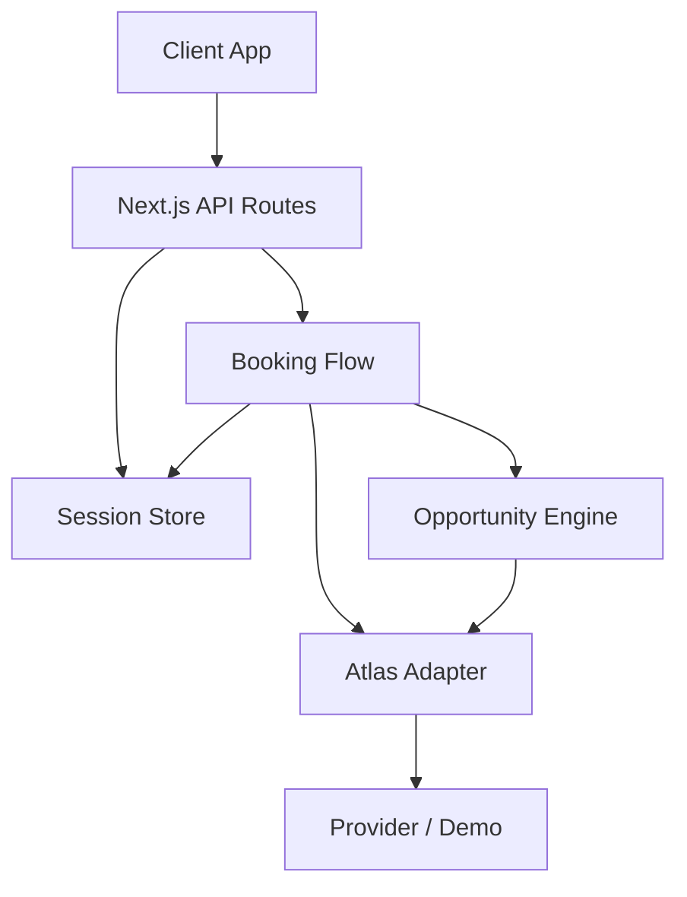
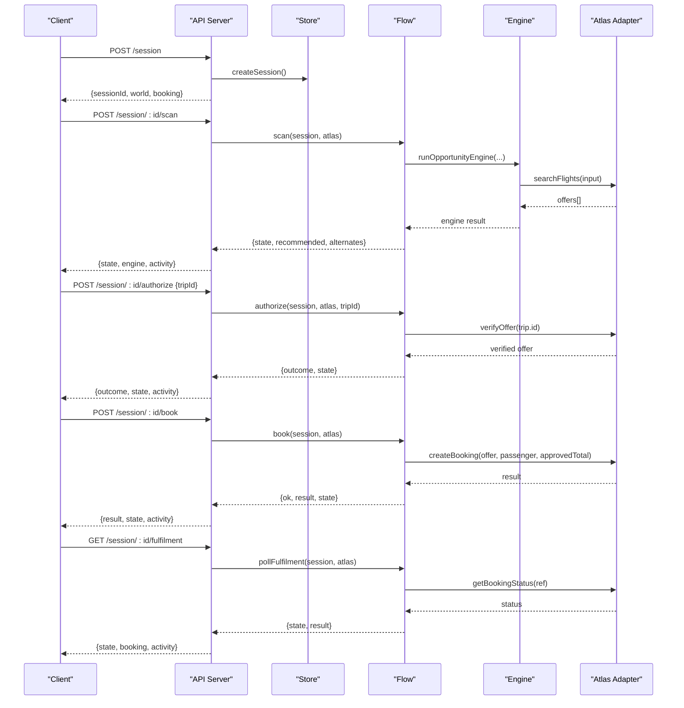
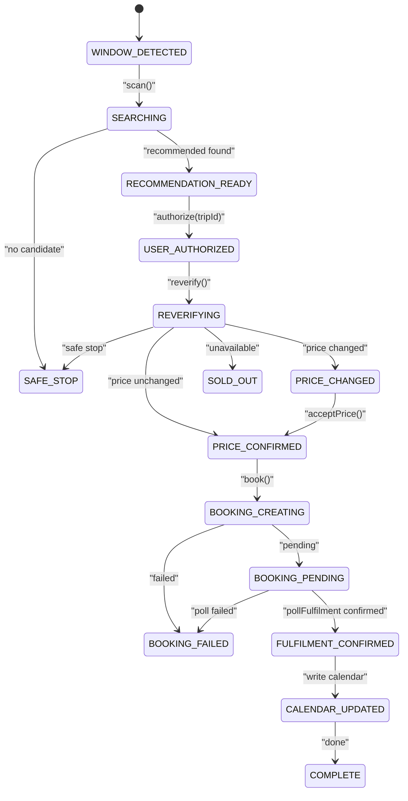
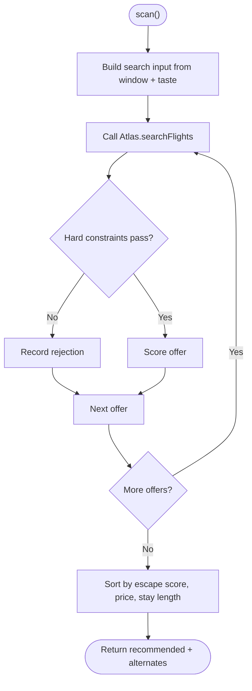
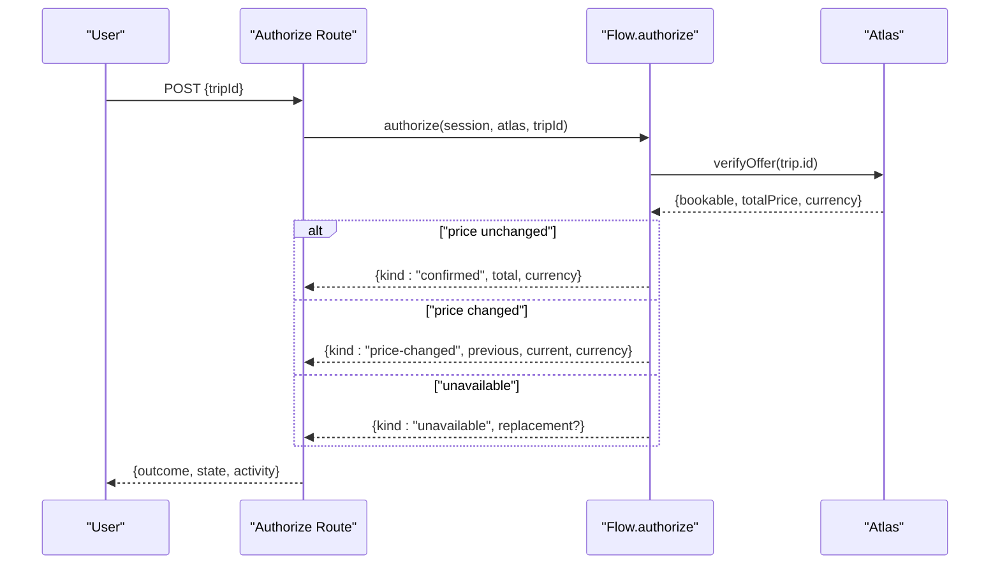
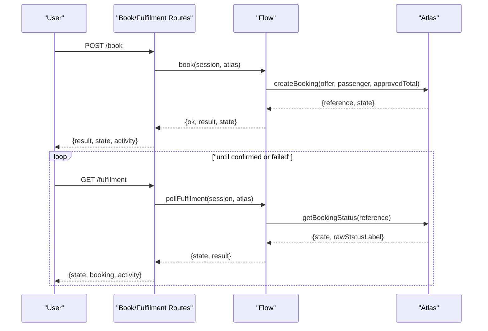
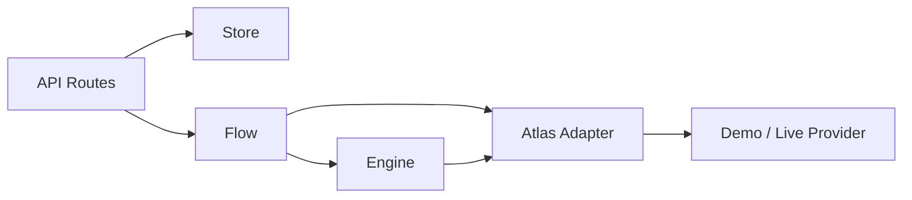

# Data Flow Architecture

<cite>
**Referenced Files in This Document**
- [route.ts](file://src/app/api/calendair/session/route.ts)
- [scan/route.ts](file://src/app/api/calendair/session/[id]/scan/route.ts)
- [authorize/route.ts](file://src/app/api/calendair/session/[id]/authorize/route.ts)
- [accept-price/route.ts](file://src/app/api/calendair/session/[id]/accept-price/route.ts)
- [book/route.ts](file://src/app/api/calendair/session/[id]/book/route.ts)
- [fulfilment/route.ts](file://src/app/api/calendair/session/[id]/fulfilment/route.ts)
- [state/route.ts](file://src/app/api/calendair/session/[id]/state/route.ts)
- [flow.ts](file://src/lib/calendair/flow.ts)
- [engine.ts](file://src/lib/calendair/engine.ts)
- [types.ts](file://src/lib/calendair/types.ts)
- [store.ts](file://src/lib/calendair/store.ts)
- [profile.ts](file://src/lib/calendair/profile.ts)
- [index.ts](file://src/lib/atlas/index.ts)
</cite>

## Table of Contents
1. Introduction
2. Project Structure
3. Core Components
4. Architecture Overview
5. Detailed Component Analysis
6. Dependency Analysis
7. Performance Considerations
8. Troubleshooting Guide
9. Conclusion

## Introduction
This document explains CALENDAIR’s data flow architecture from calendar window detection to booking confirmation. It covers the end-to-end pipeline: scanning for opportunities, scoring and ranking offers, human checkpoints for authorization and price acceptance, creating bookings, polling fulfilment, and writing calendar blocks only after confirmed ticketing. It also documents the state machine governing the booking workflow, client/server request/response cycles, type-safe models and validation, error handling strategies, and consistency guarantees across distributed boundaries.

## Project Structure
The system is a Next.js API surface backed by an in-memory session store and a domain engine that orchestrates calls to an Atlas adapter (demo or live). The key layers are:
- API routes: thin handlers that validate input, fetch sessions, invoke domain functions, and return JSON.
- Domain flow: explicit state transitions and business rules for scanning, authorizing, booking, and fulfilment.
- Engine: deterministic opportunity discovery, hard constraint filtering, and scoring.
- Store: in-memory session lifecycle, activity log, and calendar block bookkeeping.
- Profile: sanitization and projection into the engine’s trusted taste model.
- Atlas adapter: pluggable provider interface with demo and unwired modes.

**Diagram sources**
- [route.ts:24-59](file://src/app/api/calendair/session/route.ts#L24-L59)
- [scan/route.ts:9-32](file://src/app/api/calendair/session/[id]/scan/route.ts#L9-L32)
- [flow.ts:22-44](file://src/lib/calendair/flow.ts#L22-L44)
- [engine.ts:88-201](file://src/lib/calendair/engine.ts#L88-L201)
- [index.ts:18-37](file://src/lib/atlas/index.ts#L18-L37)

**Section sources**
- [route.ts:24-59](file://src/app/api/calendair/session/route.ts#L24-L59)
- [store.ts:69-86](file://src/lib/calendair/store.ts#L69-L86)
- [index.ts:18-37](file://src/lib/atlas/index.ts#L18-L37)

## Core Components
- Session and world: A server-side session holds the detected calendar window, traveller taste, companions, busy blocks, and the current booking run state.
- Booking flow: State machine that moves through SEARCHING, RECOMMENDATION_READY, USER_AUTHORIZED, REVERIFYING, PRICE_CONFIRMED/PRICE_CHANGED, BOOKING_CREATING, BOOKING_PENDING, FULFILMENT_CONFIRMED, CALENDAR_UPDATED, COMPLETE, and safe-stop states.
- Opportunity engine: Builds search inputs from the window and taste, queries inventory via Atlas, applies hard constraints, scores viable offers, and returns a recommended trip plus alternates.
- Profile sanitization: Rebuilds a trusted profile from untrusted browser input, clamping values to safe bounds and projecting into the engine’s TravelTaste shape.
- Atlas adapter: Pluggable provider abstraction; environment variables select demo or unwired mode, with caching per configuration.

**Section sources**
- [store.ts:15-51](file://src/lib/calendair/store.ts#L15-L51)
- [flow.ts:22-349](file://src/lib/calendair/flow.ts#L22-L349)
- [engine.ts:23-39](file://src/lib/calendair/engine.ts#L23-L39)
- [profile.ts:160-239](file://src/lib/calendair/profile.ts#L160-L239)
- [index.ts:18-37](file://src/lib/atlas/index.ts#L18-L37)

## Architecture Overview
The booking workflow is a small explicit state machine enforced in the flow layer. Each API route performs minimal validation and delegates to the flow function, which mutates the session state and records activity events. The engine is deterministic and side-effect free except for logging; all external calls go through the Atlas adapter.

**Diagram sources**
- [scan/route.ts:9-32](file://src/app/api/calendair/session/[id]/scan/route.ts#L9-L32)
- [authorize/route.ts:14-23](file://src/app/api/calendair/session/[id]/authorize/route.ts#L14-L23)
- [book/route.ts:9-22](file://src/app/api/calendair/session/[id]/book/route.ts#L9-L22)
- [fulfilment/route.ts:9-19](file://src/app/api/calendair/session/[id]/fulfilment/route.ts#L9-L19)
- [flow.ts:22-280](file://src/lib/calendair/flow.ts#L22-L280)
- [engine.ts:88-201](file://src/lib/calendair/engine.ts#L88-L201)

## Detailed Component Analysis

### Booking State Machine
The booking state machine enforces human checkpoints and re-reads of the world before writes. Key transitions:
- WINDOW_DETECTED → SEARCHING → RECOMMENDATION_READY or SAFE_STOP
- RECOMMENDATION_READY → USER_AUTHORIZED → REVERIFYING → PRICE_CONFIRMED or PRICE_CHANGED or SOLD_OUT or SAFE_STOP
- PRICE_CHANGED → PRICE_CONFIRMED (after explicit accept)
- PRICE_CONFIRMED → BOOKING_CREATING → BOOKING_PENDING or BOOKING_FAILED
- BOOKING_PENDING → FULFILMENT_CONFIRMED → CALENDAR_UPDATED → COMPLETE
- Any path may fall back to SAFE_STOP on policy or availability issues.

**Diagram sources**
- [types.ts:197-215](file://src/lib/calendair/types.ts#L197-L215)
- [flow.ts:22-349](file://src/lib/calendair/flow.ts#L22-L349)

**Section sources**
- [types.ts:197-215](file://src/lib/calendair/types.ts#L197-L215)
- [flow.ts:22-349](file://src/lib/calendair/flow.ts#L22-L349)

### Scan Pipeline: Calendar Window to Recommendations
- Input: Detected window, traveller taste, companion free/busy, next commitment.
- Search: Build FlightSearchInput and call Atlas.searchFlights.
- Filtering: Apply hard constraints (budget, stops, flight duration, buffer, etc.).
- Scoring: Score viable offers; sort by escape score, then cheaper fare, then longer stay.
- Output: Recommended trip plus up to two alternates, rejected candidates, and activity log.

**Diagram sources**
- [engine.ts:77-201](file://src/lib/calendair/engine.ts#L77-L201)
- [flow.ts:22-44](file://src/lib/calendair/flow.ts#L22-L44)

**Section sources**
- [engine.ts:77-201](file://src/lib/calendair/engine.ts#L77-L201)
- [flow.ts:22-44](file://src/lib/calendair/flow.ts#L22-L44)

### Authorization and Price Reverification
- Human checkpoint: User selects a trip to authorize.
- Reverification: System re-checks live availability and price against the exact offer.
- Outcomes:
  - Confirmed: Price matches; move to PRICE_CONFIRMED.
  - Price changed: Present new total to user; requires explicit accept.
  - Unavailable: Attempt one replan within budget; present replacement or safe stop.
  - Safe stop: Policy or no candidate left.

**Diagram sources**
- [authorize/route.ts:14-23](file://src/app/api/calendair/session/[id]/authorize/route.ts#L14-L23)
- [flow.ts:65-176](file://src/lib/calendair/flow.ts#L65-L176)

**Section sources**
- [authorize/route.ts:14-23](file://src/app/api/calendair/session/[id]/authorize/route.ts#L14-L23)
- [flow.ts:65-176](file://src/lib/calendair/flow.ts#L65-L176)

### Booking Creation and Fulfilment Polling
- Create booking: Only allowed when fare is confirmed and approved totals match.
- Fulfilment polling: Repeatedly query provider until it reports its own confirmed state; only then write calendar blocks.
- Calendar write-back: Writes outbound, destination, return, and recovery buffer blocks; marks them tentative until confirmed.

**Diagram sources**
- [book/route.ts:9-22](file://src/app/api/calendair/session/[id]/book/route.ts#L9-L22)
- [fulfilment/route.ts:9-19](file://src/app/api/calendair/session/[id]/fulfilment/route.ts#L9-L19)
- [flow.ts:218-349](file://src/lib/calendair/flow.ts#L218-L349)

**Section sources**
- [book/route.ts:9-22](file://src/app/api/calendair/session/[id]/book/route.ts#L9-L22)
- [fulfilment/route.ts:9-19](file://src/app/api/calendair/session/[id]/fulfilment/route.ts#L9-L19)
- [flow.ts:218-349](file://src/lib/calendair/flow.ts#L218-L349)

### Type-Safe Models and Validation
- Zod schemas at API boundaries:
  - Session creation body accepts optional scenario and profile; profile is sanitized server-side.
  - Authorize body validates tripId presence.
- Domain types define closed sets for scenarios, spontaneity levels, opportunity types, and booking states.
- Profile sanitization enforces bounds, whitelists, and safe defaults, producing a trusted TravellerProfile projected into TravelTaste for the engine.

Key contracts and validations:
- Session creation payload validated loosely; sanitisation rebuilds every field safely.
- Authorize endpoint validates tripId with minimum length.
- Types enforce strict shapes for offers, verified offers, scored trips, and booking results.

**Section sources**
- [route.ts:18-36](file://src/app/api/calendair/session/route.ts#L18-L36)
- [authorize/route.ts:7-20](file://src/app/api/calendair/session/[id]/authorize/route.ts#L7-L20)
- [types.ts:9-12](file://src/lib/calendair/types.ts#L9-L12)
- [types.ts:17-56](file://src/lib/calendair/types.ts#L17-L56)
- [types.ts:106-138](file://src/lib/calendair/types.ts#L106-L138)
- [types.ts:163-193](file://src/lib/calendair/types.ts#L163-L193)
- [types.ts:197-246](file://src/lib/calendair/types.ts#L197-L246)
- [profile.ts:58-67](file://src/lib/calendair/profile.ts#L58-L67)
- [profile.ts:160-239](file://src/lib/calendair/profile.ts#L160-L239)

### Error Handling Strategies
- Provider wiring errors: Distinct error classification for “not wired” vs general failures; appropriate HTTP status codes returned.
- Session expiry: All endpoints return 404 when session not found.
- Booking guardrails: Book only proceeds if fare is confirmed and approved totals match; otherwise returns conflict.
- Safe stops: Policy-driven halts recorded as activity events with clear reasons.
- Activity log: Every step logs source, title, detail, success flag, and optional duration for observability.

**Section sources**
- [scan/route.ts:14-32](file://src/app/api/calendair/session/[id]/scan/route.ts#L14-L32)
- [book/route.ts:9-22](file://src/app/api/calendair/session/[id]/book/route.ts#L9-L22)
- [flow.ts:186-190](file://src/lib/calendair/flow.ts#L186-L190)
- [store.ts:94-116](file://src/lib/calendair/store.ts#L94-L116)

### Data Consistency Guarantees
- Read-before-write: Before any write (booking), the flow re-reads the world via Atlas to ensure current availability and price.
- Explicit approvals: Price changes require explicit acceptance; no silent absorption of differences.
- Tentative calendar blocks: Blocks are written only after provider confirms; marked tentative until fully confirmed.
- Idempotent reads: State polling returns current session snapshot without side effects.
- Deterministic engine: Scoring and ranking are pure computations over inputs; only logging has side effects.

**Section sources**
- [flow.ts:65-176](file://src/lib/calendair/flow.ts#L65-L176)
- [flow.ts:218-349](file://src/lib/calendair/flow.ts#L218-L349)
- [engine.ts:88-201](file://src/lib/calendair/engine.ts#L88-L201)

## Dependency Analysis
The system decouples UI from provider specifics via the Atlas adapter and keeps business logic in the flow and engine layers.

**Diagram sources**
- [index.ts:18-37](file://src/lib/atlas/index.ts#L18-L37)
- [flow.ts:22-44](file://src/lib/calendair/flow.ts#L22-L44)
- [engine.ts:88-201](file://src/lib/calendair/engine.ts#L88-L201)

**Section sources**
- [index.ts:18-37](file://src/lib/atlas/index.ts#L18-L37)
- [flow.ts:22-44](file://src/lib/calendair/flow.ts#L22-L44)
- [engine.ts:88-201](file://src/lib/calendair/engine.ts#L88-L201)

## Performance Considerations
- In-memory session store: Fast access during demos; bounded TTL cleanup prevents unbounded growth.
- Adapter reuse: Atlas adapters are cached per configuration to avoid repeated initialization overhead.
- Limited alternates: Engine caps alternates to reduce downstream processing and UI complexity.
- Activity log capping: Keeps logs bounded to prevent memory pressure.

[No sources needed since this section provides general guidance]

## Troubleshooting Guide
Common issues and how to diagnose:
- Session expired: Ensure you have a valid sessionId and use it consistently across requests.
- Provider not wired: When the provider integration is disabled, scan returns a specific error indicating the adapter is not wired; adjust environment settings or enable demo mode.
- No recommendations: Check hard constraints and window size; review activity log for constraint application details.
- Price changed: Review outcome from authorize; accept the new price explicitly before booking.
- Booking pending: Poll fulfilment until provider reports confirmed or failed; do not assume success from initial booking response.

**Section sources**
- [scan/route.ts:14-32](file://src/app/api/calendair/session/[id]/scan/route.ts#L14-L32)
- [authorize/route.ts:14-23](file://src/app/api/calendair/session/[id]/authorize/route.ts#L14-L23)
- [book/route.ts:9-22](file://src/app/api/calendair/session/[id]/book/route.ts#L9-L22)
- [fulfilment/route.ts:9-19](file://src/app/api/calendair/session/[id]/fulfilment/route.ts#L9-L19)
- [flow.ts:186-190](file://src/lib/calendair/flow.ts#L186-L190)

## Conclusion
CALENDAIR’s architecture separates concerns cleanly: thin API routes, a robust domain flow enforcing human checkpoints and re-reads, a deterministic engine for opportunity discovery, and a pluggable provider adapter. The state machine ensures safety and clarity, while type-safe models and validation keep data consistent across client and server boundaries. Errors are explicit, activity logs provide traceability, and calendar updates occur only after confirmed fulfilment, preserving trust in the user’s schedule.