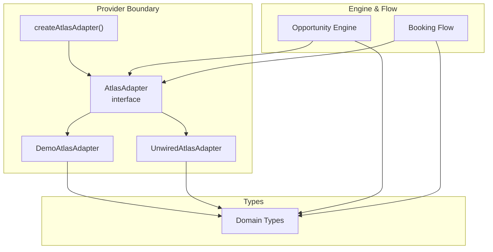
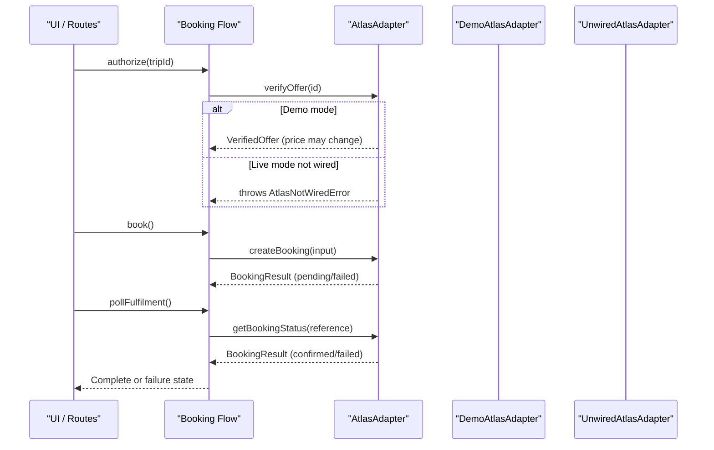
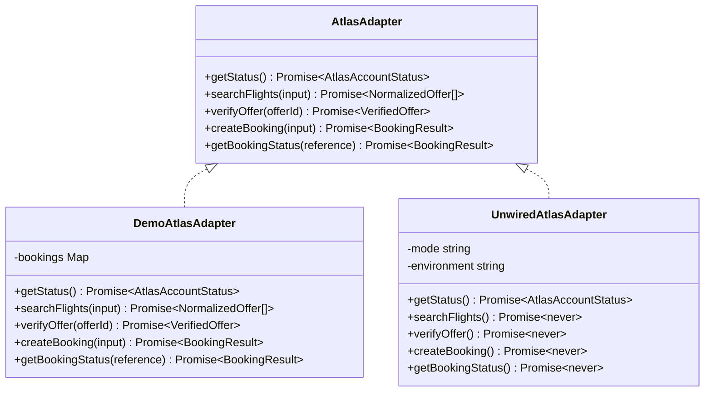
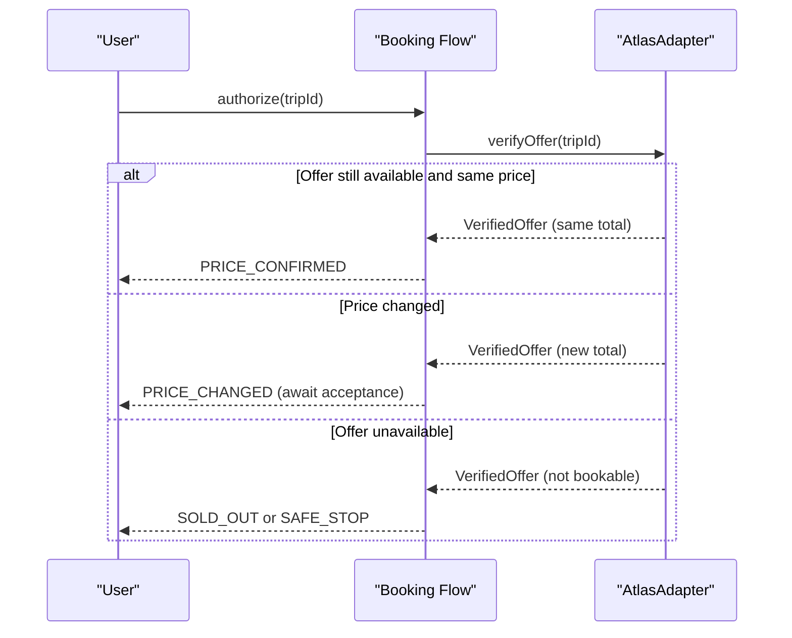
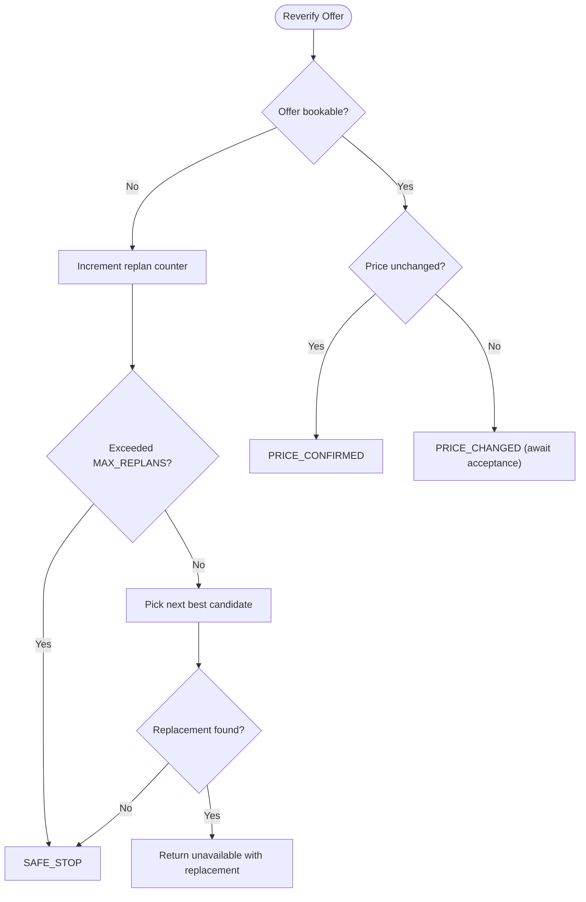
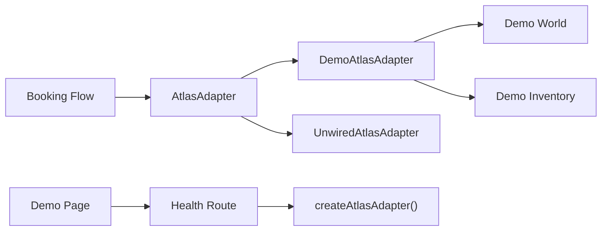

# Provider Integration Layer

<cite>
**Referenced Files in This Document**
- [adapter.ts](file://src/lib/atlas/adapter.ts)
- [demo-adapter.ts](file://src/lib/atlas/demo-adapter.ts)
- [index.ts](file://src/lib/atlas/index.ts)
- [types.ts](file://src/lib/calendair/types.ts)
- [flow.ts](file://src/lib/calendair/flow.ts)
- [world.ts](file://src/lib/calendair/demo/world.ts)
- [inventory.ts](file://src/lib/calendair/demo/inventory.ts)
- [route.ts (health)](file://src/app/api/health/route.ts)
- [route.ts (fulfilment)](file://src/app/api/calendair/session/[id]/fulfilment/route.ts)
- [page.tsx (demo)](file://src/app/(calendair)/demo/page.tsx)
- [demo.mjs](file://scripts/demo.mjs)
</cite>

## Table of Contents
1. Introduction
2. Project Structure
3. Core Components
4. Architecture Overview
5. Detailed Component Analysis
6. Dependency Analysis
7. Performance Considerations
8. Troubleshooting Guide
9. Conclusion
10. Appendices

## Introduction
This document explains CALENDAIR’s provider abstraction layer that isolates travel provider behavior behind a single interface. It focuses on the Atlas adapter design, how demo and live providers are selected, error handling and retry strategies, and guidance for implementing custom providers and testing them. Security considerations for credentials and API keys are also covered.

## Project Structure
The provider boundary lives under src/lib/atlas with a clear separation between:
- The adapter interface and safety guards
- A deterministic demo implementation
- An environment-driven factory that selects the correct adapter
- Domain types used by both engine and adapters
- Booking flow code that calls the adapter at key checkpoints

**Diagram sources**
- [adapter.ts:23-29](file://src/lib/atlas/adapter.ts#L23-L29)
- [demo-adapter.ts:28-114](file://src/lib/atlas/demo-adapter.ts#L28-L114)
- [index.ts:18-37](file://src/lib/atlas/index.ts#L18-L37)
- [types.ts:106-138](file://src/lib/calendair/types.ts#L106-L138)
- [flow.ts:22-45](file://src/lib/calendair/flow.ts#L22-L45)

**Section sources**
- [adapter.ts:10-29](file://src/lib/atlas/adapter.ts#L10-L29)
- [demo-adapter.ts:14-20](file://src/lib/atlas/demo-adapter.ts#L14-L20)
- [index.ts:8-15](file://src/lib/atlas/index.ts#L8-L15)
- [types.ts:106-138](file://src/lib/calendair/types.ts#L106-L138)
- [flow.ts:8-18](file://src/lib/calendair/flow.ts#L8-L18)

## Core Components
- AtlasAdapter: The single contract for all travel providers. Methods include status checks, flight search, offer verification, booking creation, and booking status polling.
- DemoAtlasAdapter: Deterministic provider that simulates inventory and ticketing states based on a scenario. It always labels itself as demo so UIs never misrepresent data.
- UnwiredAtlasAdapter: A safe placeholder for live modes when no real adapter is implemented. It refuses to pretend and throws explicit errors to avoid silent fallbacks.
- createAtlasAdapter(): Factory that chooses an adapter from environment variables and caches it per configuration.

Key behaviors:
- No guessing of endpoints or auth headers; live integrations must be explicitly wired.
- Demo mode is first-class and fully repeatable.
- Live mode without wiring fails loudly with a descriptive error.

**Section sources**
- [adapter.ts:23-78](file://src/lib/atlas/adapter.ts#L23-L78)
- [demo-adapter.ts:28-114](file://src/lib/atlas/demo-adapter.ts#L28-L114)
- [index.ts:18-37](file://src/lib/atlas/index.ts#L18-L37)

## Architecture Overview
The system enforces a strict boundary around provider interactions. The engine proposes candidates; before any write, the provider is re-checked. Bookings are not considered complete until the provider confirms fulfilment.

**Diagram sources**
- [flow.ts:65-84](file://src/lib/calendair/flow.ts#L65-L84)
- [flow.ts:94-176](file://src/lib/calendair/flow.ts#L94-L176)
- [flow.ts:218-248](file://src/lib/calendair/flow.ts#L218-L248)
- [flow.ts:251-280](file://src/lib/calendair/flow.ts#L251-L280)
- [adapter.ts:50-78](file://src/lib/atlas/adapter.ts#L50-L78)
- [demo-adapter.ts:60-113](file://src/lib/atlas/demo-adapter.ts#L60-L113)

## Detailed Component Analysis

### AtlasAdapter Interface Design
The interface defines a stable contract for all providers:
- getStatus(): Reports authorization, ticketing availability, environment, and adapter identity.
- searchFlights(input): Returns normalized offers consistent across providers.
- verifyOffer(offerId): Re-reads current availability and price immediately before writes.
- createBooking(input): Initiates ticketing and returns a provider-defined result.
- getBookingStatus(reference): Polls for final confirmation or failure.

Design principles:
- Normalized data shapes decouple callers from provider-specific payloads.
- Status reporting includes adapter identity and human-readable label to prevent misleading UIs.
- Errors for unwired live modes are explicit and actionable.

**Section sources**
- [adapter.ts:23-29](file://src/lib/atlas/adapter.ts#L23-L29)
- [types.ts:265-273](file://src/lib/calendair/types.ts#L265-L273)

### Demo vs Live Provider Switching
Switching is controlled by environment variables:
- ATLAS_INTEGRATION_MODE: unset defaults to demo; set to skill or atrip selects live mode placeholders.
- ATLAS_ENV: sandbox, production, or unknown influences status reporting.
- DEMO_SCENARIO: perfect, price-change, sold-out, pending controls deterministic behavior.

Factory behavior:
- Creates one adapter per configuration and caches it across requests.
- Refuses to silently downgrade live configurations to demo data.
- Health endpoint reports integration mode and whether credentials are present without leaking secrets.

Operational notes:
- The demo script prints the active provider mode before starting the server.
- The demo page displays adapter details and warns when running on demo inventory.

**Section sources**
- [index.ts:18-37](file://src/lib/atlas/index.ts#L18-L37)
- [route.ts (health):10-38](file://src/app/api/health/route.ts#L10-L38)
- [demo.mjs:11-38](file://scripts/demo.mjs#L11-L38)
- [page.tsx (demo):79-100](file://src/app/(calendair)/demo/page.tsx#L79-L100)

### Error Handling Strategies
- Unwired live mode: Throws a specific error type with context about the missing implementation. This prevents accidental substitution of demo data for live calls.
- Offer verification failures: If an offer is no longer available, the flow replans once within a bounded limit and stops for a decision if no replacement clears hard constraints.
- Booking outcomes: createBooking returns a result with state and raw status label; the flow transitions to pending or failed accordingly.
- Fulfilment polling: Only confirmed results update the calendar; failures remain in a failed state.

Retry and fallback logic:
- Replanning is limited by MAX_REPLANS (default 2).
- No automatic substitution of trips without user approval.
- Price changes require explicit acceptance before proceeding.

**Section sources**
- [adapter.ts:31-41](file://src/lib/atlas/adapter.ts#L31-L41)
- [flow.ts:94-176](file://src/lib/calendair/flow.ts#L94-L176)
- [flow.ts:218-248](file://src/lib/calendair/flow.ts#L218-L248)
- [flow.ts:251-280](file://src/lib/calendair/flow.ts#L251-L280)

### Data Flows and Processing Logic
Search and scoring:
- The engine uses the adapter to search normalized offers and score them against hard constraints and preferences.
- Offers are normalized to a common shape, including currency, cabin, and flight numbers when provided.

Verification and booking:
- Before booking, the offer is re-verified to catch price changes or sell-outs.
- After creating a booking, the system polls for fulfilment and only writes to the calendar upon confirmation.

Deterministic demo world:
- The demo world generates a fixed opening window relative to “now,” ensuring repeatable demos.
- Inventory blueprints define multiple options, including some that must be rejected for different reasons.

**Section sources**
- [flow.ts:22-45](file://src/lib/calendair/flow.ts#L22-L45)
- [types.ts:106-138](file://src/lib/calendair/types.ts#L106-L138)
- [world.ts:84-169](file://src/lib/calendair/demo/world.ts#L84-L169)
- [inventory.ts:152-196](file://src/lib/calendair/demo/inventory.ts#L152-L196)

### Class Relationships

**Diagram sources**
- [adapter.ts:23-78](file://src/lib/atlas/adapter.ts#L23-L78)
- [demo-adapter.ts:28-114](file://src/lib/atlas/demo-adapter.ts#L28-L114)

### Sequence: Authorize and Reverify

**Diagram sources**
- [flow.ts:65-84](file://src/lib/calendair/flow.ts#L65-L84)
- [flow.ts:94-176](file://src/lib/calendair/flow.ts#L94-L176)

### Flowchart: Replan Decision

**Diagram sources**
- [flow.ts:94-176](file://src/lib/calendair/flow.ts#L94-L176)

## Dependency Analysis
- The booking flow depends on the AtlasAdapter for search, verification, booking, and fulfilment polling.
- The demo adapter depends on deterministic world and inventory modules to generate consistent outputs.
- The health route depends on the adapter factory to report configuration without exposing secrets.
- The demo page surfaces adapter status and warnings when running in demo mode.

**Diagram sources**
- [flow.ts:22-45](file://src/lib/calendair/flow.ts#L22-L45)
- [demo-adapter.ts:11-12](file://src/lib/atlas/demo-adapter.ts#L11-L12)
- [world.ts:84-169](file://src/lib/calendair/demo/world.ts#L84-L169)
- [inventory.ts:152-196](file://src/lib/calendair/demo/inventory.ts#L152-L196)
- [route.ts (health):10-38](file://src/app/api/health/route.ts#L10-L38)
- [page.tsx (demo):79-100](file://src/app/(calendair)/demo/page.tsx#L79-L100)

**Section sources**
- [flow.ts:22-45](file://src/lib/calendair/flow.ts#L22-L45)
- [demo-adapter.ts:11-12](file://src/lib/atlas/demo-adapter.ts#L11-L12)
- [route.ts (health):10-38](file://src/app/api/health/route.ts#L10-L38)
- [page.tsx (demo):79-100](file://src/app/(calendair)/demo/page.tsx#L79-L100)

## Performance Considerations
- Adapter caching: The factory caches adapters per configuration to avoid repeated initialization overhead.
- Deterministic demo: Avoids network latency and external dependencies during development and staging.
- Replan limits: Bounded replanning prevents excessive provider calls and keeps flows responsive.
- Verification before writes: Ensures correctness at the cost of one additional provider call per booking attempt.

[No sources needed since this section provides general guidance]

## Troubleshooting Guide
Common issues and resolutions:
- Live mode without adapter: You will see explicit errors indicating the adapter is not wired. Set up a real adapter for skill or atrip modes.
- Unexpected demo data: Ensure ATLAS_INTEGRATION_MODE is set appropriately. The demo page and health endpoint show which adapter is active.
- Price changes blocking booking: Accept the new price via the accept-price flow or choose a replacement trip if available.
- Sold-out offers: The system replans up to MAX_REPLANS; if no replacement clears constraints, the flow stops safely.

Diagnostics:
- Use the health endpoint to check integration mode, credential presence, and adapter status.
- Inspect activity logs for provider interactions and outcomes.

**Section sources**
- [adapter.ts:31-41](file://src/lib/atlas/adapter.ts#L31-L41)
- [route.ts (health):10-38](file://src/app/api/health/route.ts#L10-L38)
- [flow.ts:94-176](file://src/lib/calendair/flow.ts#L94-L176)

## Conclusion
CALENDAIR’s provider abstraction cleanly separates provider concerns from core business logic. The AtlasAdapter interface ensures consistent behavior across implementations, while the factory and safety guards enforce secure, predictable operation. Demo mode enables reliable staging and rehearsal, and live mode requires explicit wiring to prevent accidental fallbacks. Error handling and replanning keep transactions safe and user-controlled.

[No sources needed since this section summarizes without analyzing specific files]

## Appendices

### Implementing a Custom Provider
Steps:
- Implement the AtlasAdapter interface methods using your provider’s SDK or REST APIs.
- Normalize responses to the domain types defined in the types module.
- Integrate authentication and transport details in your adapter; do not guess endpoints.
- Register or wire your adapter through the factory or dependency injection where appropriate.

Testing strategy:
- Use the demo adapter to validate end-to-end flows without external dependencies.
- Write unit tests for your adapter against the domain types and expected behaviors.
- Simulate edge cases like price changes, sold-out offers, and pending ticketing using scenarios.

Security considerations:
- Keep credentials server-only; never expose them in client-side code.
- Use environment variables for API keys and secrets.
- Report configuration status without leaking sensitive values.

**Section sources**
- [adapter.ts:23-29](file://src/lib/atlas/adapter.ts#L23-L29)
- [types.ts:106-138](file://src/lib/calendair/types.ts#L106-L138)
- [route.ts (health):10-38](file://src/app/api/health/route.ts#L10-L38)