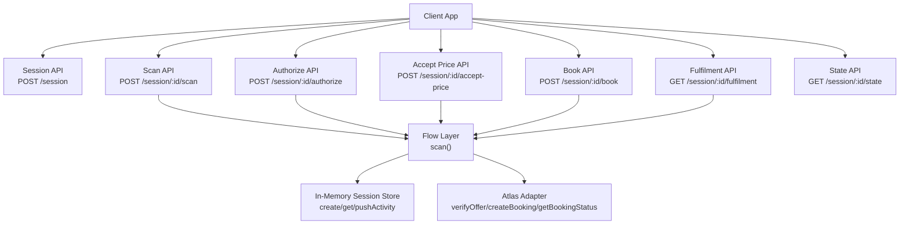
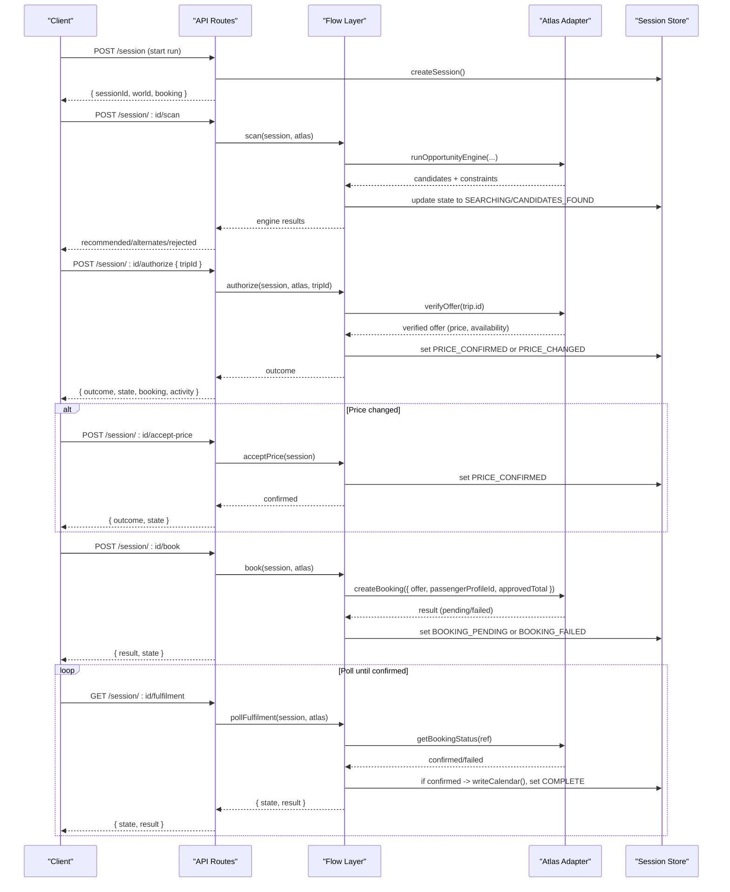
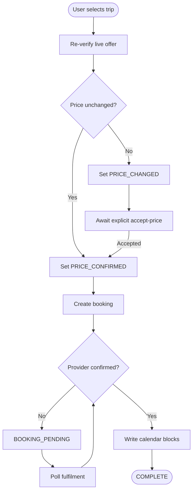
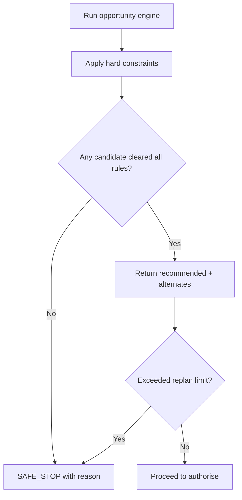
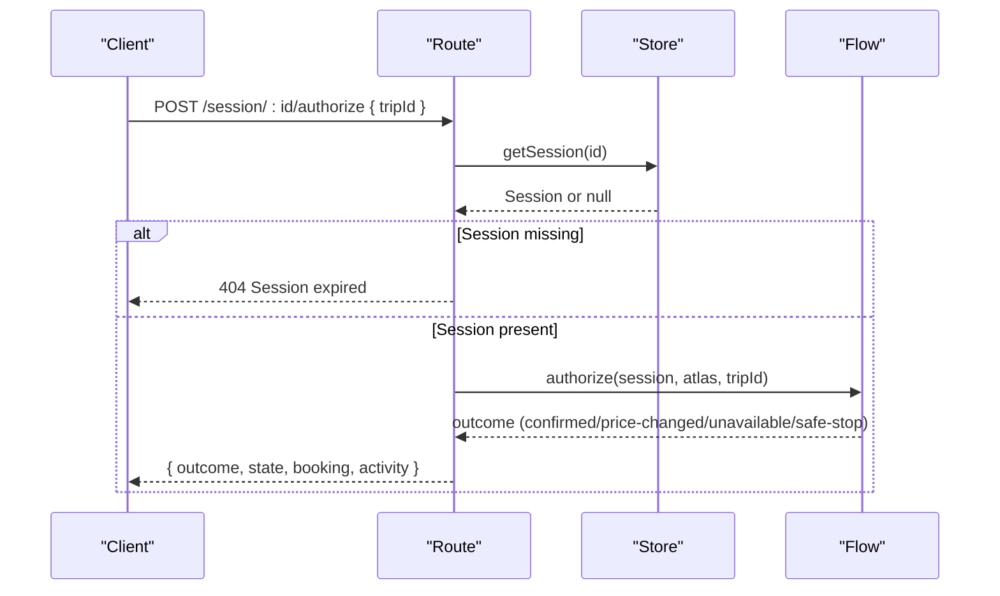
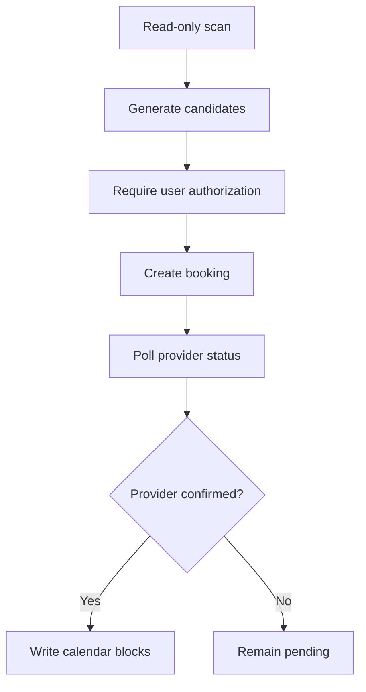
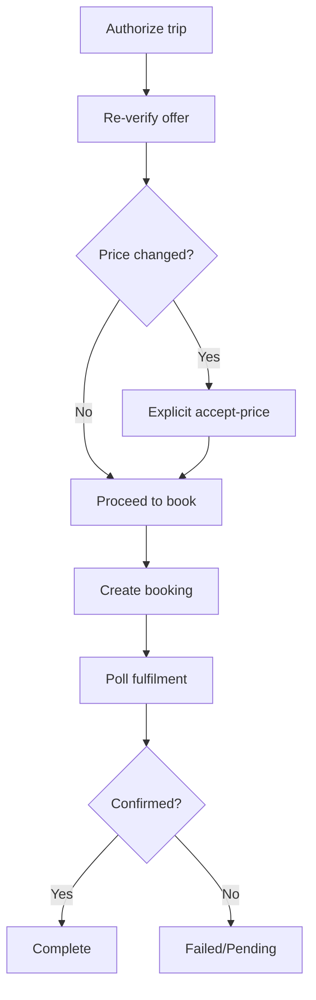
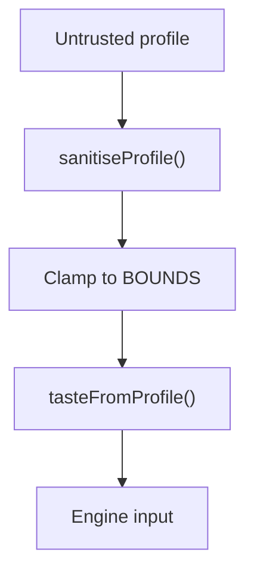
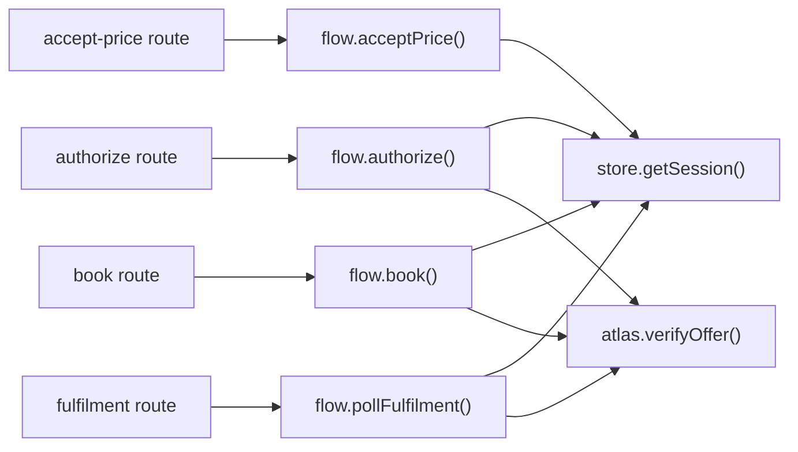

# Security Model

<cite>
**Referenced Files in This Document**
- [route.ts](file://src/app/api/calendair/session/route.ts)
- [route.ts](file://src/app/api/calendair/session/[id]/scan/route.ts)
- [route.ts](file://src/app/api/calendair/session/[id]/authorize/route.ts)
- [route.ts](file://src/app/api/calendair/session/[id]/accept-price/route.ts)
- [route.ts](file://src/app/api/calendair/session/[id]/book/route.ts)
- [route.ts](file://src/app/api/calendair/session/[id]/fulfilment/route.ts)
- [route.ts](file://src/app/api/calendair/session/[id]/state/route.ts)
- [flow.ts](file://src/lib/calendair/flow.ts)
- [store.ts](file://src/lib/calendair/store.ts)
- [profile.ts](file://src/lib/calendair/profile.ts)
- [types.ts](file://src/lib/calendair/types.ts)
</cite>

## Table of Contents
1. Introduction
2. Project Structure
3. Core Components
4. Architecture Overview
5. Detailed Component Analysis
6. Dependency Analysis
7. Performance Considerations
8. Troubleshooting Guide
9. Conclusion

## Introduction
This document explains CALENDAIR’s security model and safety guarantees for booking workflows that involve AI-assisted discovery, human approval, and financial transactions. It focuses on:
- Human-in-the-loop approvals that prevent unauthorized bookings or price changes
- Hard constraints enforced by the system and not overridable by AI suggestions
- Authorization checkpoints across the booking workflow with explicit user consent
- Security considerations for calendar data access, payment processing, and personal information handling
- Privacy protections and data retention policies

## Project Structure
The security-relevant surface is implemented as a set of Next.js API routes under /api/calendair/session, backed by an in-memory session store and a domain flow layer that orchestrates scanning, authorization, booking, and fulfilment.

**Diagram sources**
- [route.ts:24-60](file://src/app/api/calendair/session/route.ts#L24-L60)
- [route.ts:9-33](file://src/app/api/calendair/session/[id]/scan/route.ts#L9-L33)
- [route.ts:14-23](file://src/app/api/calendair/session/[id]/authorize/route.ts#L14-L23)
- [route.ts:8-15](file://src/app/api/calendair/session/[id]/accept-price/route.ts#L8-L15)
- [route.ts:9-22](file://src/app/api/calendair/session/[id]/book/route.ts#L9-L22)
- [route.ts:9-19](file://src/app/api/calendair/session/[id]/fulfilment/route.ts#L9-L19)
- [route.ts:6-34](file://src/app/api/calendair/session/[id]/state/route.ts#L6-L34)
- [flow.ts:22-45](file://src/lib/calendair/flow.ts#L22-L45)
- [store.ts:69-98](file://src/lib/calendair/store.ts#L69-L98)

**Section sources**
- [route.ts:24-60](file://src/app/api/calendair/session/route.ts#L24-L60)
- [route.ts:9-33](file://src/app/api/calendair/session/[id]/scan/route.ts#L9-L33)
- [route.ts:14-23](file://src/app/api/calendair/session/[id]/authorize/route.ts#L14-L23)
- [route.ts:8-15](file://src/app/api/calendair/session/[id]/accept-price/route.ts#L8-L15)
- [route.ts:9-22](file://src/app/api/calendair/session/[id]/book/route.ts#L9-L22)
- [route.ts:9-19](file://src/app/api/calendair/session/[id]/fulfilment/route.ts#L9-L19)
- [route.ts:6-34](file://src/app/api/calendair/session/[id]/state/route.ts#L6-L34)
- [flow.ts:22-45](file://src/lib/calendair/flow.ts#L22-L45)
- [store.ts:69-98](file://src/lib/calendair/store.ts#L69-L98)

## Core Components
- In-memory session store: Creates sessions, tracks state transitions, activity logs, and enforces TTL-based cleanup.
- Domain flow: Encapsulates the booking state machine, hard constraint enforcement, re-verification of offers, replanning limits, and calendar write-back only after confirmed fulfilment.
- Profile sanitisation: Rebuilds traveller preferences from untrusted input within strict bounds; never trusts client-supplied budgets beyond safe ranges.
- API routes: Thin controllers that validate inputs, fetch sessions, call flow functions, and return structured outcomes.

Key security properties:
- Search is read-only and autonomous; all writes require explicit human steps.
- Every write re-reads live provider state before proceeding.
- Prices must be explicitly approved; increases are never absorbed silently.
- Calendar blocks are written only after provider confirmation.

**Section sources**
- [store.ts:7-13](file://src/lib/calendair/store.ts#L7-L13)
- [store.ts:53-59](file://src/lib/calendair/store.ts#L53-L59)
- [flow.ts:8-18](file://src/lib/calendair/flow.ts#L8-L18)
- [flow.ts:22-45](file://src/lib/calendair/flow.ts#L22-L45)
- [flow.ts:65-84](file://src/lib/calendair/flow.ts#L65-L84)
- [flow.ts:94-176](file://src/lib/calendair/flow.ts#L94-L176)
- [flow.ts:192-210](file://src/lib/calendair/flow.ts#L192-L210)
- [flow.ts:218-248](file://src/lib/calendair/flow.ts#L218-L248)
- [flow.ts:251-280](file://src/lib/calendair/flow.ts#L251-L280)
- [flow.ts:282-343](file://src/lib/calendair/flow.ts#L282-L343)
- [profile.ts:12-24](file://src/lib/calendair/profile.ts#L12-L24)
- [profile.ts:51-67](file://src/lib/calendair/profile.ts#L51-L67)
- [profile.ts:153-240](file://src/lib/calendair/profile.ts#L153-L240)

## Architecture Overview
The booking workflow is a guarded state machine with explicit human checkpoints. The following sequence shows how a trip moves from search to confirmed booking, with re-verification and consent at each critical step.

**Diagram sources**
- [route.ts:24-60](file://src/app/api/calendair/session/route.ts#L24-L60)
- [route.ts:9-33](file://src/app/api/calendair/session/[id]/scan/route.ts#L9-L33)
- [route.ts:14-23](file://src/app/api/calendair/session/[id]/authorize/route.ts#L14-L23)
- [route.ts:8-15](file://src/app/api/calendair/session/[id]/accept-price/route.ts#L8-L15)
- [route.ts:9-22](file://src/app/api/calendair/session/[id]/book/route.ts#L9-L22)
- [route.ts:9-19](file://src/app/api/calendair/session/[id]/fulfilment/route.ts#L9-L19)
- [flow.ts:22-45](file://src/lib/calendair/flow.ts#L22-L45)
- [flow.ts:65-84](file://src/lib/calendair/flow.ts#L65-L84)
- [flow.ts:94-176](file://src/lib/calendair/flow.ts#L94-L176)
- [flow.ts:192-210](file://src/lib/calendair/flow.ts#L192-L210)
- [flow.ts:218-248](file://src/lib/calendair/flow.ts#L218-L248)
- [flow.ts:251-280](file://src/lib/calendair/flow.ts#L251-L280)

## Detailed Component Analysis

### Human-in-the-Loop Approval System
- Authorize checkpoint: After a candidate is selected, the system verifies the live offer and requires explicit user authorization before any booking attempt. If the price changes, the flow stops and waits for explicit acceptance.
- Accept price checkpoint: An increase is never absorbed silently; the user must explicitly accept the new total to proceed.
- Booking checkpoint: Only proceeds when the fare has been both verified and approved for the exact total.
- Fulfilment checkpoint: The provider’s own “confirmed” state is required before writing to the calendar.

**Diagram sources**
- [flow.ts:65-84](file://src/lib/calendair/flow.ts#L65-L84)
- [flow.ts:94-176](file://src/lib/calendair/flow.ts#L94-L176)
- [flow.ts:192-210](file://src/lib/calendair/flow.ts#L192-L210)
- [flow.ts:218-248](file://src/lib/calendair/flow.ts#L218-L248)
- [flow.ts:251-280](file://src/lib/calendair/flow.ts#L251-L280)

**Section sources**
- [route.ts:14-23](file://src/app/api/calendair/session/[id]/authorize/route.ts#L14-L23)
- [route.ts:8-15](file://src/app/api/calendair/session/[id]/accept-price/route.ts#L8-L15)
- [route.ts:9-22](file://src/app/api/calendair/session/[id]/book/route.ts#L9-L22)
- [route.ts:9-19](file://src/app/api/calendair/session/[id]/fulfilment/route.ts#L9-L19)
- [flow.ts:65-84](file://src/lib/calendair/flow.ts#L65-L84)
- [flow.ts:94-176](file://src/lib/calendair/flow.ts#L94-L176)
- [flow.ts:192-210](file://src/lib/calendair/flow.ts#L192-L210)
- [flow.ts:218-248](file://src/lib/calendair/flow.ts#L218-L248)
- [flow.ts:251-280](file://src/lib/calendair/flow.ts#L251-L280)

### Constraint System and Hard Rules
- Hard constraints are enforced during opportunity scanning and replanning. If no candidate clears every hard rule, the flow enters a safe stop.
- Budget checks use currency-aware comparisons; unknown currencies fail budget checks rather than being guessed.
- Replanning is bounded by a configurable limit to avoid silent substitutions.
- Reference-only prices cannot be booked; they serve as informational signals only.

**Diagram sources**
- [flow.ts:22-45](file://src/lib/calendair/flow.ts#L22-L45)
- [flow.ts:94-176](file://src/lib/calendair/flow.ts#L94-L176)
- [types.ts:197-215](file://src/lib/calendair/types.ts#L197-L215)

**Section sources**
- [flow.ts:22-45](file://src/lib/calendair/flow.ts#L22-L45)
- [flow.ts:94-176](file://src/lib/calendair/flow.ts#L94-L176)
- [types.ts:197-215](file://src/lib/calendair/types.ts#L197-L215)

### Authorization Checkpoints and Consent Verification
- Session validation: All endpoints retrieve the session by ID and reject expired sessions.
- Input validation: Request bodies are validated with schema checks before processing.
- Explicit consent: Authorization and price acceptance are separate steps; booking only proceeds after both are satisfied.
- Live re-read: Before booking, the system re-verifies the offer against the provider to ensure current availability and price.

**Diagram sources**
- [route.ts:14-23](file://src/app/api/calendair/session/[id]/authorize/route.ts#L14-L23)
- [store.ts:88-92](file://src/lib/calendair/store.ts#L88-L92)
- [flow.ts:65-84](file://src/lib/calendair/flow.ts#L65-L84)

**Section sources**
- [route.ts:14-23](file://src/app/api/calendair/session/[id]/authorize/route.ts#L14-L23)
- [route.ts:9-33](file://src/app/api/calendair/session/[id]/scan/route.ts#L9-L33)
- [route.ts:8-15](file://src/app/api/calendair/session/[id]/accept-price/route.ts#L8-L15)
- [route.ts:9-22](file://src/app/api/calendair/session/[id]/book/route.ts#L9-L22)
- [store.ts:88-92](file://src/lib/calendair/store.ts#L88-L92)
- [flow.ts:65-84](file://src/lib/calendair/flow.ts#L65-L84)

### Calendar Data Access Security
- Read-only discovery: Scanning is the only step allowed to run without prior human approval; it performs read-only discovery and returns recommendations.
- No automatic calendar writes: Calendar blocks are written only after the provider confirms fulfilment.
- Timezone-safe blocks: Each block’s start/end times are interpreted in local airport time to avoid misleading representations.

**Diagram sources**
- [route.ts:9-33](file://src/app/api/calendair/session/[id]/scan/route.ts#L9-L33)
- [flow.ts:251-280](file://src/lib/calendair/flow.ts#L251-L280)
- [flow.ts:282-343](file://src/lib/calendair/flow.ts#L282-L343)

**Section sources**
- [route.ts:9-33](file://src/app/api/calendair/session/[id]/scan/route.ts#L9-L33)
- [flow.ts:251-280](file://src/lib/calendair/flow.ts#L251-L280)
- [flow.ts:282-343](file://src/lib/calendair/flow.ts#L282-L343)

### Payment Processing Security
- Approved totals are locked: Booking requires the verified offer to match the approved total exactly.
- No silent absorption: Price increases require explicit acceptance via a dedicated endpoint.
- Post-booking verification: The system polls the provider to confirm ticketing rather than trusting initial responses.

**Diagram sources**
- [flow.ts:94-176](file://src/lib/calendair/flow.ts#L94-L176)
- [flow.ts:192-210](file://src/lib/calendair/flow.ts#L192-L210)
- [flow.ts:218-248](file://src/lib/calendair/flow.ts#L218-L248)
- [flow.ts:251-280](file://src/lib/calendair/flow.ts#L251-L280)

**Section sources**
- [flow.ts:94-176](file://src/lib/calendair/flow.ts#L94-L176)
- [flow.ts:192-210](file://src/lib/calendair/flow.ts#L192-L210)
- [flow.ts:218-248](file://src/lib/calendair/flow.ts#L218-L248)
- [flow.ts:251-280](file://src/lib/calendair/flow.ts#L251-L280)

### Personal Information Handling
- Profile sanitisation: All traveller profile fields are rebuilt server-side within strict bounds; client values cannot widen hard rules like budgets.
- PII minimization: Responses mask sensitive identifiers (e.g., document numbers) in world payloads.
- Activity log hygiene: Activity entries are sanitised and bounded to prevent leakage of sensitive details.

**Diagram sources**
- [profile.ts:153-240](file://src/lib/calendair/profile.ts#L153-L240)
- [profile.ts:242-261](file://src/lib/calendair/profile.ts#L242-L261)

**Section sources**
- [profile.ts:12-24](file://src/lib/calendair/profile.ts#L12-L24)
- [profile.ts:51-67](file://src/lib/calendair/profile.ts#L51-L67)
- [profile.ts:153-240](file://src/lib/calendair/profile.ts#L153-L240)
- [route.ts:40-59](file://src/app/api/calendair/session/route.ts#L40-L59)
- [store.ts:94-98](file://src/lib/calendair/store.ts#L94-L98)

### Privacy Protections and Data Retention
- In-memory sessions: Sessions are stored in memory and automatically swept after a fixed TTL, ensuring they do not persist beyond process lifetime.
- Bounded activity logs: Activity events are capped to a maximum size to prevent unbounded growth.
- Minimal exposure: World responses strip sensitive fields (e.g., masked document numbers).

**Section sources**
- [store.ts:7-13](file://src/lib/calendair/store.ts#L7-L13)
- [store.ts:53-59](file://src/lib/calendair/store.ts#L53-L59)
- [store.ts:94-98](file://src/lib/calendair/store.ts#L94-L98)
- [route.ts:40-59](file://src/app/api/calendair/session/route.ts#L40-L59)

## Dependency Analysis
The API routes depend on the flow layer for business logic, which depends on the session store and an adapter to external providers. The flow layer encapsulates all state transitions and safety checks.

**Diagram sources**
- [route.ts:14-23](file://src/app/api/calendair/session/[id]/authorize/route.ts#L14-L23)
- [route.ts:8-15](file://src/app/api/calendair/session/[id]/accept-price/route.ts#L8-L15)
- [route.ts:9-22](file://src/app/api/calendair/session/[id]/book/route.ts#L9-L22)
- [route.ts:9-19](file://src/app/api/calendair/session/[id]/fulfilment/route.ts#L9-L19)
- [flow.ts:65-84](file://src/lib/calendair/flow.ts#L65-L84)
- [flow.ts:192-210](file://src/lib/calendair/flow.ts#L192-L210)
- [flow.ts:218-248](file://src/lib/calendair/flow.ts#L218-L248)
- [flow.ts:251-280](file://src/lib/calendair/flow.ts#L251-L280)
- [store.ts:88-92](file://src/lib/calendair/store.ts#L88-L92)

**Section sources**
- [route.ts:14-23](file://src/app/api/calendair/session/[id]/authorize/route.ts#L14-L23)
- [route.ts:8-15](file://src/app/api/calendair/session/[id]/accept-price/route.ts#L8-L15)
- [route.ts:9-22](file://src/app/api/calendair/session/[id]/book/route.ts#L9-L22)
- [route.ts:9-19](file://src/app/api/calendair/session/[id]/fulfilment/route.ts#L9-L19)
- [flow.ts:65-84](file://src/lib/calendair/flow.ts#L65-L84)
- [flow.ts:192-210](file://src/lib/calendair/flow.ts#L192-L210)
- [flow.ts:218-248](file://src/lib/calendair/flow.ts#L218-L248)
- [flow.ts:251-280](file://src/lib/calendair/flow.ts#L251-L280)
- [store.ts:88-92](file://src/lib/calendair/store.ts#L88-L92)

## Performance Considerations
- Reverification cost: Each authorization triggers a live provider check; batch operations should minimize redundant calls.
- Replanning budget: Replans are limited to a configured maximum to avoid excessive provider queries.
- Activity log capping: Activity logs are bounded to reduce memory usage.

[No sources needed since this section provides general guidance]

## Troubleshooting Guide
Common error conditions and their meanings:
- Session expired: The session was not found or timed out; restart a new session.
- Trip not found: The selected trip is no longer in the current engine results.
- Unknown trip: Invalid trip identifier provided to explanation endpoints.
- Offer unavailable: The verified offer is no longer bookable; the flow may propose a replacement within budget.
- Price mismatch: The approved total no longer matches the verified fare; re-authorize.
- Booking failed: Provider rejected the booking; inspect activity and retry later.
- Atlas not wired: External provider integration is not available; scan will fail with a specific code.

Operational tips:
- Use the state endpoint to inspect current session state, engine results, and world context.
- Review activity logs to trace decisions and provider interactions.
- For price changes, always call the accept-price endpoint before attempting to book.

**Section sources**
- [route.ts:14-23](file://src/app/api/calendair/session/[id]/authorize/route.ts#L14-L23)
- [route.ts:9-33](file://src/app/api/calendair/session/[id]/scan/route.ts#L9-L33)
- [route.ts:9-22](file://src/app/api/calendair/session/[id]/book/route.ts#L9-L22)
- [route.ts:6-34](file://src/app/api/calendair/session/[id]/state/route.ts#L6-L34)
- [flow.ts:65-84](file://src/lib/calendair/flow.ts#L65-L84)
- [flow.ts:94-176](file://src/lib/calendair/flow.ts#L94-L176)
- [flow.ts:218-248](file://src/lib/calendair/flow.ts#L218-L248)
- [flow.ts:251-280](file://src/lib/calendair/flow.ts#L251-L280)

## Conclusion
CALENDAIR’s security model centers on explicit human control over financially significant actions, strict enforcement of hard constraints, and conservative assumptions about external systems. The design ensures that:
- AI can assist discovery but cannot unilaterally change prices or commit bookings.
- Every write path requires re-verification and explicit user consent.
- Calendar updates occur only after confirmed fulfilment.
- Personal data is sanitized, minimized, and retained only in memory with bounded lifetimes.

These guarantees provide strong safety for users while enabling flexible, AI-augmented travel planning.

[No sources needed since this section summarizes without analyzing specific files]