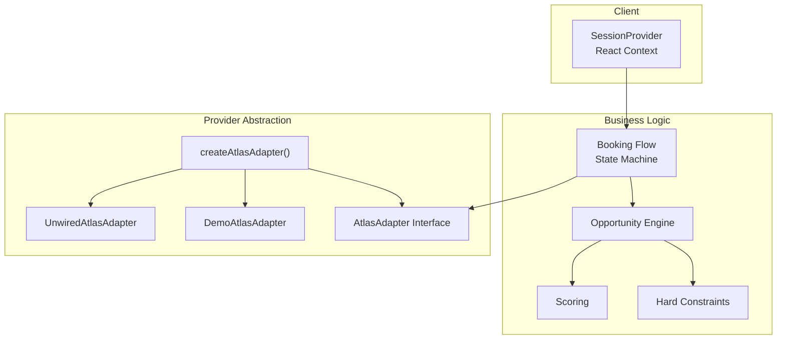
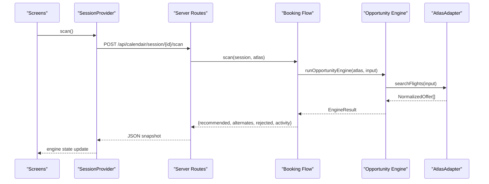
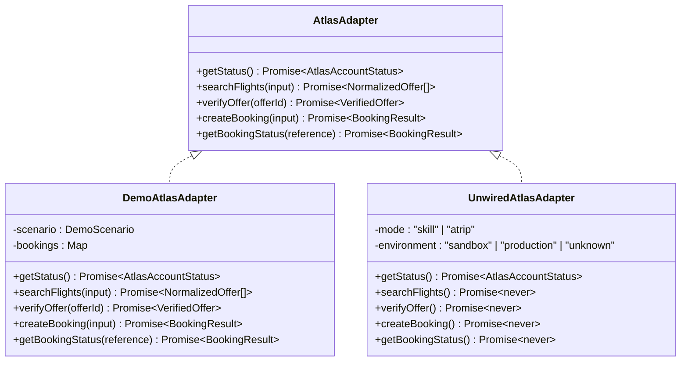
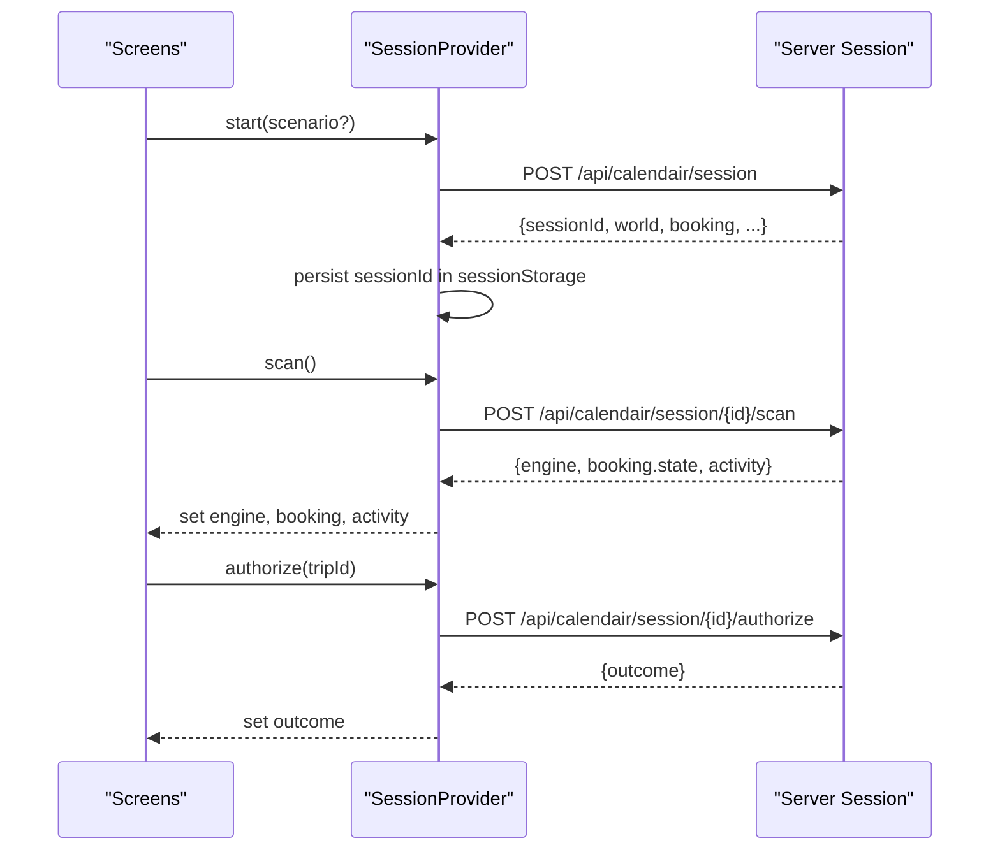
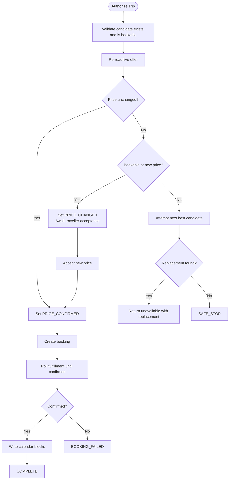
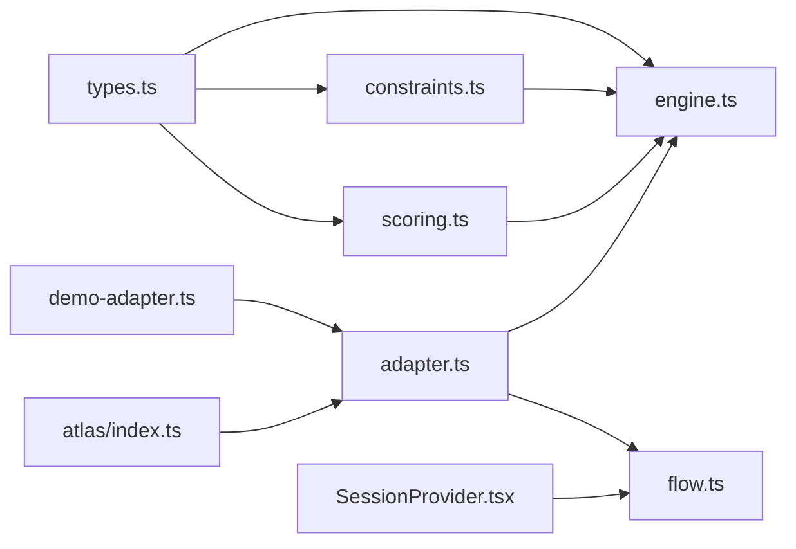

# System Design Patterns

<cite>
**Referenced Files in This Document**
- [SessionProvider.tsx](file://src/components/calendair/SessionProvider.tsx)
- [adapter.ts](file://src/lib/atlas/adapter.ts)
- [demo-adapter.ts](file://src/lib/atlas/demo-adapter.ts)
- [index.ts](file://src/lib/atlas/index.ts)
- [engine.ts](file://src/lib/calendair/engine.ts)
- [flow.ts](file://src/lib/calendair/flow.ts)
- [scoring.ts](file://src/lib/calendair/scoring.ts)
- [constraints.ts](file://src/lib/calendair/constraints.ts)
- [types.ts](file://src/lib/calendair/types.ts)
</cite>

## Table of Contents
1. Introduction
2. Project Structure
3. Core Components
4. Architecture Overview
5. Detailed Component Analysis
6. Dependency Analysis
7. Performance Considerations
8. Troubleshooting Guide
9. Conclusion

## Introduction
This document explains CALENDAIR’s core architectural patterns and how they work together to deliver a reliable, testable, and maintainable travel booking experience:

- Adapter pattern in the Atlas layer abstracts different travel providers behind a single interface, enabling seamless switching between deterministic demo inventory and live provider integrations without changing business logic.
- Context-based state management using React Context synchronizes client and server session state, ensuring consistent UI behavior across page reloads and multi-screen flows.
- Deterministic business logic architecture separates pure functions (constraints, scoring, flow control) from AI-assisted components, preserving type safety, predictability, and testability while allowing optional language model enhancements for narrative explanations.

These patterns collectively provide strong guarantees: no silent fallbacks to fake data in live mode, explicit human checkpoints before irreversible actions, and clear separation between what must be correct by construction versus what can be improved with AI.

## Project Structure
The system is organized around three layers:

- Client session context: A React Context provider that owns the user session, persists it across navigations, and exposes typed operations to screens.
- Business logic: Pure, deterministic functions that implement constraints, scoring, and the booking flow. These are independent of transport details and fully testable.
- Provider abstraction: An adapter interface that hides provider specifics. The factory selects demo or unwired live adapters based on environment configuration.

**Diagram sources**
- [SessionProvider.tsx:98-175](file://src/components/calendair/SessionProvider.tsx#L98-L175)
- [flow.ts:22-45](file://src/lib/calendair/flow.ts#L22-L45)
- [engine.ts:88-201](file://src/lib/calendair/engine.ts#L88-L201)
- [scoring.ts:56-227](file://src/lib/calendair/scoring.ts#L56-L227)
- [constraints.ts:42-161](file://src/lib/calendair/constraints.ts#L42-L161)
- [adapter.ts:23-29](file://src/lib/atlas/adapter.ts#L23-L29)
- [demo-adapter.ts:28-114](file://src/lib/atlas/demo-adapter.ts#L28-L114)
- [index.ts:18-37](file://src/lib/atlas/index.ts#L18-L37)

**Section sources**
- [SessionProvider.tsx:98-175](file://src/components/calendair/SessionProvider.tsx#L98-L175)
- [flow.ts:22-45](file://src/lib/calendair/flow.ts#L22-L45)
- [engine.ts:88-201](file://src/lib/calendair/engine.ts#L88-L201)
- [adapter.ts:23-29](file://src/lib/atlas/adapter.ts#L23-L29)
- [demo-adapter.ts:28-114](file://src/lib/atlas/demo-adapter.ts#L28-L114)
- [index.ts:18-37](file://src/lib/atlas/index.ts#L18-L37)

## Core Components
- SessionProvider: Manages the client-side session lifecycle, persists the session id, and coordinates calls to server endpoints. It exposes typed methods for scanning, authorization, price acceptance, booking, fulfillment polling, and explanation retrieval.
- AtlasAdapter: Defines a unified interface for travel provider interactions. Implementations include a deterministic demo adapter and an unwired placeholder for live modes that refuses to pretend.
- Opportunity Engine: Builds search inputs, queries the provider via the adapter, applies hard constraints, scores viable offers, and returns a ranked recommendation plus alternates and activity logs.
- Booking Flow: Implements an explicit state machine that enforces human checkpoints, re-verifies fares, replans within limits, creates bookings, polls fulfillment, and writes calendar blocks only after confirmation.
- Scoring and Constraints: Pure functions that compute deterministic metrics and enforce pass/fail rules. They never consult AI for decisions that affect money, time, or safety.

**Section sources**
- [SessionProvider.tsx:98-333](file://src/components/calendair/SessionProvider.tsx#L98-L333)
- [adapter.ts:23-79](file://src/lib/atlas/adapter.ts#L23-L79)
- [engine.ts:88-201](file://src/lib/calendair/engine.ts#L88-L201)
- [flow.ts:22-350](file://src/lib/calendair/flow.ts#L22-L350)
- [scoring.ts:56-227](file://src/lib/calendair/scoring.ts#L56-L227)
- [constraints.ts:42-161](file://src/lib/calendair/constraints.ts#L42-L161)

## Architecture Overview
The system composes a client session context with deterministic business logic and a provider abstraction. Screens call into the session context, which orchestrates server-side state transitions and updates local state. The server uses the adapter to interact with either demo inventory or a live provider, depending on configuration.

**Diagram sources**
- [SessionProvider.tsx:194-212](file://src/components/calendair/SessionProvider.tsx#L194-L212)
- [flow.ts:22-45](file://src/lib/calendair/flow.ts#L22-L45)
- [engine.ts:88-201](file://src/lib/calendair/engine.ts#L88-L201)
- [adapter.ts:23-29](file://src/lib/atlas/adapter.ts#L23-L29)

## Detailed Component Analysis

### Adapter Pattern in the Atlas Layer
The adapter pattern isolates provider-specific behavior behind a stable interface. The factory chooses an implementation based on environment variables, ensuring deterministic behavior in demos and safe failure in live configurations that lack wiring.

Key behaviors:
- Unified interface: status checks, flight search, offer verification, booking creation, and booking status polling.
- Demo adapter: provides deterministic, scenario-driven inventory and booking simulation with labeled test mode.
- Unwired live adapter: refuses to proceed when live integration is selected but not implemented, preventing silent fallbacks.

**Diagram sources**
- [adapter.ts:23-79](file://src/lib/atlas/adapter.ts#L23-L79)
- [demo-adapter.ts:28-114](file://src/lib/atlas/demo-adapter.ts#L28-L114)

**Section sources**
- [adapter.ts:23-79](file://src/lib/atlas/adapter.ts#L23-L79)
- [demo-adapter.ts:28-114](file://src/lib/atlas/demo-adapter.ts#L28-L114)
- [index.ts:18-37](file://src/lib/atlas/index.ts#L18-L37)

### Context-Based State Management with React Context
The SessionProvider centralizes session state and synchronization between client and server:

- Persists the session id in session storage to resume across reloads.
- Exposes typed operations for scanning, authorization, price acceptance, booking, fulfillment polling, and explanation retrieval.
- Updates local snapshots for world, engine, booking, activity, and outcomes, keeping UI consistent with server state.

**Diagram sources**
- [SessionProvider.tsx:114-175](file://src/components/calendair/SessionProvider.tsx#L114-L175)
- [SessionProvider.tsx:194-231](file://src/components/calendair/SessionProvider.tsx#L194-L231)

**Section sources**
- [SessionProvider.tsx:98-333](file://src/components/calendair/SessionProvider.tsx#L98-L333)

### Deterministic Business Logic Architecture
Determinism is enforced through pure functions and explicit state transitions:

- Hard constraints: Pass/fail checks for budget, timing, stops, flight length, companion availability, and reference-only fares. No AI involvement.
- Scoring: Weighted factors produce a transparent escape score used for ranking. Factors include calendar fit, useful hours, budget headroom, fare value, affinity, companion match, convenience, return safety, and friction.
- Booking flow: Explicit state machine ensures human checkpoints before irreversible actions, re-verifies fares, replans within limits, and writes calendar blocks only after confirmed fulfillment.

**Diagram sources**
- [flow.ts:65-176](file://src/lib/calendair/flow.ts#L65-L176)
- [flow.ts:218-280](file://src/lib/calendair/flow.ts#L218-L280)
- [flow.ts:288-343](file://src/lib/calendair/flow.ts#L288-L343)

**Section sources**
- [constraints.ts:42-161](file://src/lib/calendair/constraints.ts#L42-L161)
- [scoring.ts:56-227](file://src/lib/calendair/scoring.ts#L56-L227)
- [flow.ts:65-176](file://src/lib/calendair/flow.ts#L65-L176)
- [flow.ts:218-280](file://src/lib/calendair/flow.ts#L218-L280)
- [flow.ts:288-343](file://src/lib/calendair/flow.ts#L288-L343)

### Concrete Examples of Type Safety, Testability, and Maintainability
- Type safety: Shared domain types define contracts for sessions, offers, scoring, and booking results. Both client and server rely on these types to ensure consistency.
- Testability: Pure functions for constraints and scoring have no side effects and can be unit-tested with deterministic inputs. The demo adapter provides stable inventory for end-to-end scenarios.
- Maintainability: The adapter pattern isolates provider changes; adding a new integration requires implementing the interface without touching business logic. The explicit flow reduces hidden state mutations and makes debugging easier.

Examples of where these patterns appear:
- Types define closed vocabularies and structured payloads for offers, scoring, and booking states.
- The engine composes constraint checks and scoring to produce deterministic rankings.
- The flow enforces human checkpoints and re-reads the world before writes.
- The adapter factory switches implementations based on environment configuration.

**Section sources**
- [types.ts:1-274](file://src/lib/calendair/types.ts#L1-L274)
- [engine.ts:88-201](file://src/lib/calendair/engine.ts#L88-L201)
- [flow.ts:22-45](file://src/lib/calendair/flow.ts#L22-L45)
- [index.ts:18-37](file://src/lib/atlas/index.ts#L18-L37)

## Dependency Analysis
The following diagram shows key dependencies among modules:

**Diagram sources**
- [types.ts:1-274](file://src/lib/calendair/types.ts#L1-L274)
- [constraints.ts:42-161](file://src/lib/calendair/constraints.ts#L42-L161)
- [scoring.ts:56-227](file://src/lib/calendair/scoring.ts#L56-L227)
- [engine.ts:88-201](file://src/lib/calendair/engine.ts#L88-L201)
- [flow.ts:22-45](file://src/lib/calendair/flow.ts#L22-L45)
- [adapter.ts:23-79](file://src/lib/atlas/adapter.ts#L23-L79)
- [demo-adapter.ts:28-114](file://src/lib/atlas/demo-adapter.ts#L28-L114)
- [index.ts:18-37](file://src/lib/atlas/index.ts#L18-L37)
- [SessionProvider.tsx:98-333](file://src/components/calendair/SessionProvider.tsx#L98-L333)

**Section sources**
- [engine.ts:88-201](file://src/lib/calendair/engine.ts#L88-L201)
- [flow.ts:22-45](file://src/lib/calendair/flow.ts#L22-L45)
- [adapter.ts:23-79](file://src/lib/atlas/adapter.ts#L23-L79)
- [index.ts:18-37](file://src/lib/atlas/index.ts#L18-L37)

## Performance Considerations
- Deterministic scoring and constraints are pure computations with predictable complexity relative to the number of offers returned by the provider. Sorting and filtering scale linearly with offer count.
- The adapter caches instances per configuration to avoid repeated setup costs for long-lived provider clients.
- Reverification reads fresh offers before booking to prevent stale pricing, minimizing risk at the cost of additional network calls.
- Calendar write-back occurs only after fulfillment confirmation, avoiding unnecessary UI churn.

[No sources needed since this section provides general guidance]

## Troubleshooting Guide
Common issues and their handling:

- Live mode without wiring: When live integration is selected but not implemented, calls throw a specific error indicating the missing adapter. This prevents silent fallbacks to demo data.
- Price changes during authorization: If the verified price differs from the displayed price, the flow stops and waits for explicit acceptance rather than proceeding silently.
- Offer unavailability: If an offer becomes unavailable, the flow attempts one replan within configured limits and stops if no replacement clears constraints.
- Fulfillment delays: After booking creation, the flow polls provider status until confirmed or failed, updating the session accordingly.

**Section sources**
- [adapter.ts:31-79](file://src/lib/atlas/adapter.ts#L31-L79)
- [flow.ts:94-176](file://src/lib/calendair/flow.ts#L94-L176)
- [flow.ts:218-280](file://src/lib/calendair/flow.ts#L218-L280)

## Conclusion
CALENDAIR’s architecture combines an adapter pattern for provider abstraction, React Context for session synchronization, and deterministic business logic for reliability. This design delivers:

- Type safety through shared domain contracts.
- Testability via pure functions and deterministic demo inventory.
- Maintainability by isolating provider changes and enforcing explicit state transitions.

Trade-offs include additional indirection through the adapter and more explicit state management, which increase clarity and reduce risk. The result is a system that scales safely: new providers integrate cleanly, business rules remain auditable, and user-facing workflows stay predictable even as external services evolve.

[No sources needed since this section summarizes without analyzing specific files]