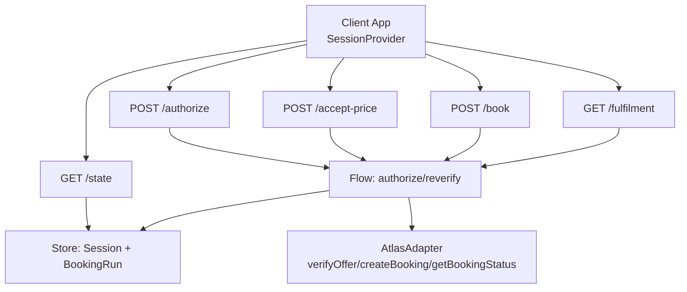
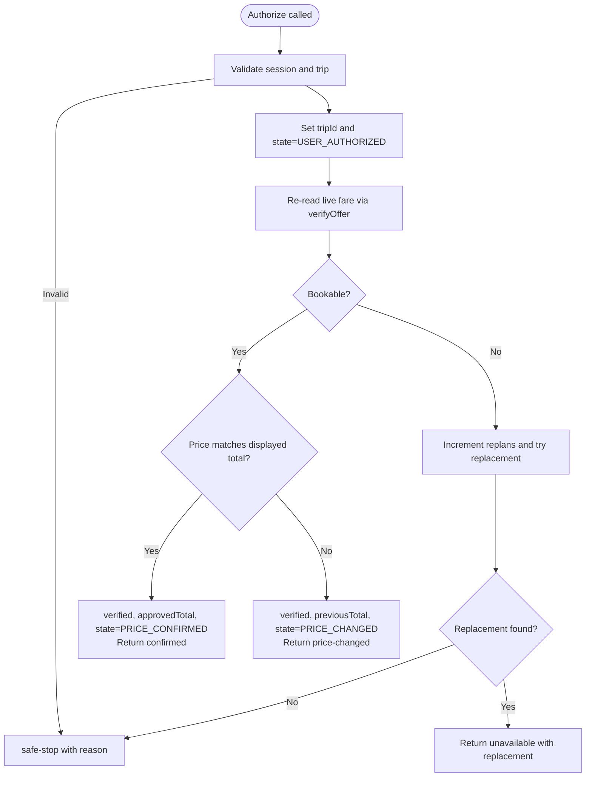
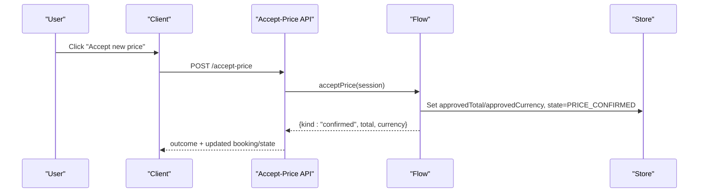
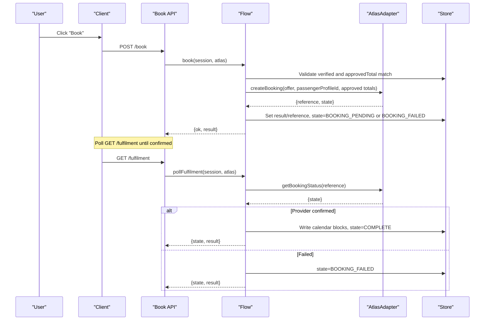
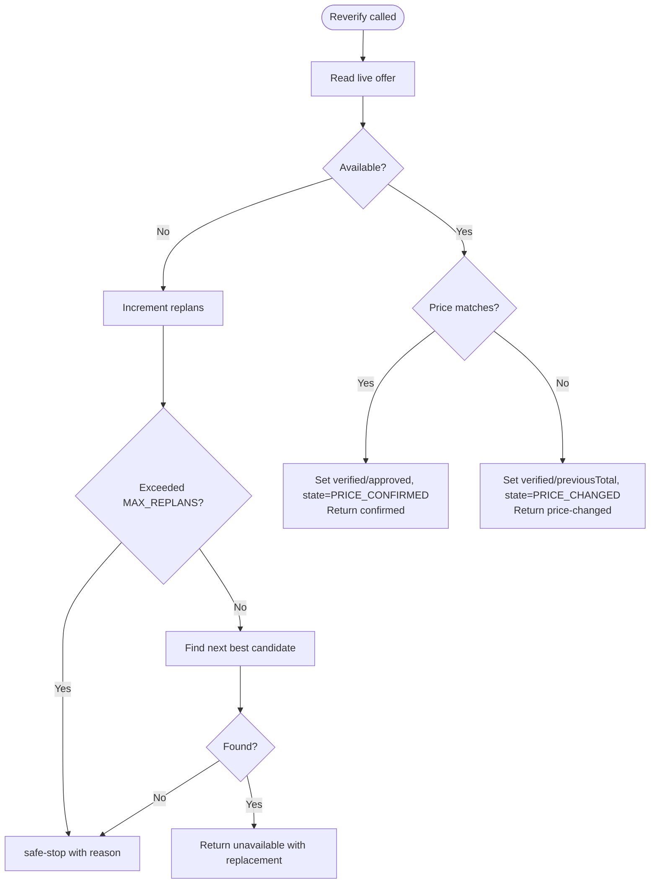
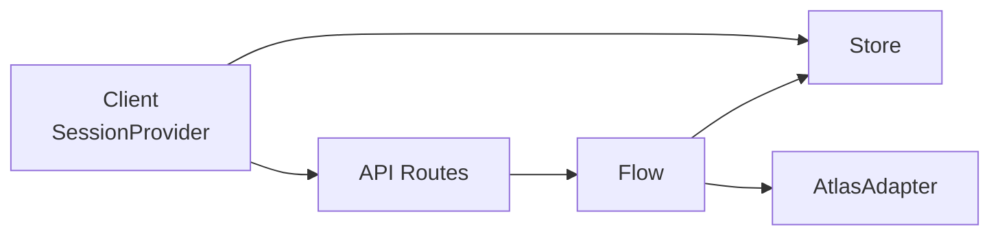

# Authorization Checkpoints

<cite>
**Referenced Files in This Document**
- [flow.ts](file://src/lib/calendair/flow.ts)
- [authorize route](file://src/app/api/calendair/session/[id]/authorize/route.ts)
- [accept-price route](file://src/app/api/calendair/session/[id]/accept-price/route.ts)
- [book route](file://src/app/api/calendair/session/[id]/book/route.ts)
- [state route](file://src/app/api/calendair/session/[id]/state/route.ts)
- [fulfilment route](file://src/app/api/calendair/session/[id]/fulfilment/route.ts)
- [SessionProvider](file://src/components/calendair/SessionProvider.tsx)
- [store](file://src/lib/calendair/store.ts)
- [booking page UI steps](file://src/app/(calendair)/booking/page.tsx)
</cite>

## Table of Contents
1. [Introduction](#introduction)
2. [Project Structure](#project-structure)
3. [Core Components](#core-components)
4. [Architecture Overview](#architecture-overview)
5. [Detailed Component Analysis](#detailed-component-analysis)
6. [Dependency Analysis](#dependency-analysis)
7. [Performance Considerations](#performance-considerations)
8. [Troubleshooting Guide](#troubleshooting-guide)
9. [Conclusion](#conclusion)

## Introduction
This document explains CALENDAIR’s human authorization checkpoints that ensure explicit user approval at critical decision points during flight booking. It covers the end-to-end flow from trip selection to price verification and acceptance, the AuthorizeOutcome types (confirmed, price-changed, unavailable, safe-stop), and the reverification process that re-reads live inventory before any write. It also includes examples of workflows, error handling strategies, and user interaction patterns for each checkpoint.

## Project Structure
The authorization flow is implemented as a small state machine with clear boundaries between read-only checks and writes:
- API routes expose endpoints for authorize, accept-price, book, state, and fulfilment polling.
- The core logic lives in a flow module that enforces “re-read before write” and requires explicit user actions before proceeding.
- The client SessionProvider orchestrates calls and exposes an Outcome type to drive UI behavior.



**Diagram sources**
- [authorize route:10-24](file://src/app/api/calendair/session/[id]/authorize/route.ts#L10-L24)
- [accept-price route:7-15](file://src/app/api/calendair/session/[id]/accept-price/route.ts#L7-L15)
- [book route:8-23](file://src/app/api/calendair/session/[id]/book/route.ts#L8-L23)
- [state route:6-34](file://src/app/api/calendair/session/[id]/state/route.ts#L6-L34)
- [fulfilment route:8-20](file://src/app/api/calendair/session/[id]/fulfilment/route.ts#L8-L20)
- [flow.ts:59-248](file://src/lib/calendair/flow.ts#L59-L248)
- [store.ts:28-51](file://src/lib/calendair/store.ts#L28-L51)

**Section sources**
- [authorize route:10-24](file://src/app/api/calendair/session/[id]/authorize/route.ts#L10-L24)
- [accept-price route:7-15](file://src/app/api/calendair/session/[id]/accept-price/route.ts#L7-L15)
- [book route:8-23](file://src/app/api/calendair/session/[id]/book/route.ts#L8-L23)
- [state route:6-34](file://src/app/api/calendair/session/[id]/state/route.ts#L6-L34)
- [fulfilment route:8-20](file://src/app/api/calendair/session/[id]/fulfilment/route.ts#L8-L20)
- [flow.ts:59-248](file://src/lib/calendair/flow.ts#L59-L248)
- [store.ts:28-51](file://src/lib/calendair/store.ts#L28-L51)

## Core Components
- AuthorizeOutcome: A discriminated union describing the result of authorization and reverification:
  - confirmed: fare available at the same total; proceed to booking.
  - price-changed: fare available but at a different total; requires explicit acceptance.
  - unavailable: fare no longer available; a replacement may be offered after bounded replanning.
  - safe-stop: cannot proceed (e.g., reference-only offer, no candidate left, replan limit reached).
- Reverification: After user authorizes a trip, the system re-reads live inventory before any write. If the fare changed or disappeared, it stops and waits for explicit user action.
- Acceptance: A separate, explicit step to approve a new total. Only then can booking proceed.
- Booking: The first write occurs only against an approved total. The provider may return a pending state; final confirmation is polled.
- Calendar update: Calendar blocks are written only after the provider confirms the booking.

**Section sources**
- [flow.ts:53-84](file://src/lib/calendair/flow.ts#L53-L84)
- [flow.ts:94-176](file://src/lib/calendair/flow.ts#L94-L176)
- [flow.ts:192-248](file://src/lib/calendair/flow.ts#L192-L248)
- [flow.ts:250-343](file://src/lib/calendair/flow.ts#L250-L343)
- [store.ts:28-51](file://src/lib/calendair/store.ts#L28-L51)

## Architecture Overview
The authorization flow enforces two rules:
- The agent can search autonomously, but every consequential step waits for a person.
- The world is re-read before every write; a successful HTTP response does not imply a successful journey.

```mermaid
sequenceDiagram
participant U as "User"
participant C as "Client<br/>SessionProvider"
participant A as "Authorize API"
participant F as "Flow"
participant S as "Store"
participant X as "AtlasAdapter"
U->>C : Select trip and click "Authorize"
C->>A : POST /authorize {tripId}
A->>F : authorize(session, atlas, tripId)
F->>S : set tripId, state=USER_AUTHORIZED
F->>X : verifyOffer(trip.id)
X-->>F : {bookable, totalPrice, currency}
alt Same price and available
F->>S : verified, approvedTotal, state=PRICE_CONFIRMED
F-->>A : {kind : "confirmed", total, currency}
else Price changed
F->>S : verified, previousTotal, state=PRICE_CHANGED
F-->>A : {kind : "price-changed", previous, current, currency}
else Not available
F->>S : replans++, state=SOLD_OUT
F->>X : nextBestCandidate()
alt Replacement found
F-->>A : {kind : "unavailable", replacement}
else No replacement
F-->>A : {kind : "safe-stop", reason}
end
```

**Diagram sources**
- [authorize route:10-24](file://src/app/api/calendair/session/[id]/authorize/route.ts#L10-L24)
- [flow.ts:65-176](file://src/lib/calendair/flow.ts#L65-L176)
- [store.ts:28-51](file://src/lib/calendair/store.ts#L28-L51)

## Detailed Component Analysis

### Authorization Checkpoint: Trip Selection to Reverification
- User selects a trip from the engine results and triggers authorization.
- The server validates the session and trip, marks USER_AUTHORIZED, and immediately re-verifies availability and price.
- Outcomes:
  - confirmed: Proceed to booking.
  - price-changed: Stop and require explicit acceptance.
  - unavailable: Attempt bounded replanning; if a replacement exists, present it; otherwise safe-stop.
  - safe-stop: Stop with a reason (e.g., reference-only offer, no candidate left).



**Diagram sources**
- [flow.ts:65-176](file://src/lib/calendair/flow.ts#L65-L176)

**Section sources**
- [authorize route:10-24](file://src/app/api/calendair/session/[id]/authorize/route.ts#L10-L24)
- [flow.ts:65-176](file://src/lib/calendair/flow.ts#L65-L176)

### Price Verification and Acceptance
- If the live fare differs from the displayed total, the flow stops and returns price-changed.
- The user must explicitly call accept-price to approve the new total.
- On acceptance, the flow sets approvedTotal/approvedCurrency and moves to PRICE_CONFIRMED.
- Booking is blocked until acceptance completes.



**Diagram sources**
- [accept-price route:7-15](file://src/app/api/calendair/session/[id]/accept-price/route.ts#L7-L15)
- [flow.ts:192-210](file://src/lib/calendair/flow.ts#L192-L210)

**Section sources**
- [accept-price route:7-15](file://src/app/api/calendair/session/[id]/accept-price/route.ts#L7-L15)
- [flow.ts:192-210](file://src/lib/calendair/flow.ts#L192-L210)

### Booking and Fulfilment
- The first write occurs only when the fare is confirmed and matches the approved total.
- The provider may return a pending state; the client polls fulfilment until the provider reports confirmed.
- Upon confirmed status, calendar blocks are written and the session reaches COMPLETE.



**Diagram sources**
- [book route:8-23](file://src/app/api/calendair/session/[id]/book/route.ts#L8-L23)
- [flow.ts:218-343](file://src/lib/calendair/flow.ts#L218-L343)
- [fulfilment route:8-20](file://src/app/api/calendair/session/[id]/fulfilment/route.ts#L8-L20)

**Section sources**
- [book route:8-23](file://src/app/api/calendair/session/[id]/book/route.ts#L8-L23)
- [flow.ts:218-343](file://src/lib/calendair/flow.ts#L218-L343)
- [fulfilment route:8-20](file://src/app/api/calendair/session/[id]/fulfilment/route.ts#L8-L20)

### AuthorizeOutcome Types
- confirmed: Live fare matches the displayed total; proceed to booking.
- price-changed: Live fare differs; requires explicit acceptance before booking.
- unavailable: Fare gone; bounded replanning attempted; if a replacement exists, present it for authorization.
- safe-stop: Cannot proceed; reasons include reference-only offers, no candidate left, or replan limit reached.

These outcomes are surfaced to the client through the SessionProvider’s Outcome type and drive UI transitions.

**Section sources**
- [flow.ts:53-57](file://src/lib/calendair/flow.ts#L53-L57)
- [SessionProvider.tsx:56-60](file://src/components/calendair/SessionProvider.tsx#L56-L60)

### Reverification Process
- Triggered immediately after user authorization.
- Reads live inventory via verifyOffer.
- Compares availability and price against the displayed total.
- Handles changes by stopping and requiring explicit user action.
- For unavailability, attempts bounded replanning up to a configured limit and presents a replacement if found.



**Diagram sources**
- [flow.ts:94-176](file://src/lib/calendair/flow.ts#L94-L176)

**Section sources**
- [flow.ts:94-176](file://src/lib/calendair/flow.ts#L94-L176)

### Error Handling Strategies
- Session expiration: All routes return a 404 with an error message when the session is missing.
- Validation errors: Missing or invalid inputs (e.g., tripId) return 400 with descriptive errors.
- Booking guardrails: Booking refuses to proceed unless the fare is confirmed and matches the approved total.
- Provider failures: If the provider rejects or fails, the session moves to BOOKING_FAILED; calendar is not written.
- Activity logging: Every significant step pushes an activity event, providing an auditable trail without storing secrets.

**Section sources**
- [authorize route:14-24](file://src/app/api/calendair/session/[id]/authorize/route.ts#L14-L24)
- [accept-price route:7-15](file://src/app/api/calendair/session/[id]/accept-price/route.ts#L7-L15)
- [book route:8-23](file://src/app/api/calendair/session/[id]/book/route.ts#L8-L23)
- [flow.ts:218-248](file://src/lib/calendair/flow.ts#L218-L248)
- [store.ts:94-117](file://src/lib/calendair/store.ts#L94-L117)

### User Interaction Patterns
- Authorization screen: Presents the selected trip and indicates that live rechecking is underway.
- Price change screen: Shows previous vs. current total and asks for explicit acceptance.
- Sold-out screen: Offers a replacement that clears the same constraints; user must authorize again.
- Booking screen: Indicates creation and pending status; shows provider confirmation once received.
- Calendar update screen: Displays outbound, destination stay, return, and recovery buffer blocks after confirmation.

These patterns align with the booking page’s step definitions and the SessionProvider’s Outcome-driven UI updates.

**Section sources**
- [booking page UI steps:226-269](file://src/app/(calendair)/booking/page.tsx#L226-L269)
- [SessionProvider.tsx:214-258](file://src/components/calendair/SessionProvider.tsx#L214-L258)

## Dependency Analysis
- API routes depend on:
  - getSession from store to access the in-memory session.
  - Flow functions for business logic.
  - AtlasAdapter for provider interactions.
- Flow depends on:
  - Store for session state and activity logging.
  - Engine for candidate lists and scoring.
  - AtlasAdapter for verifyOffer, createBooking, and getBookingStatus.
- Client depends on:
  - SessionProvider to orchestrate calls and manage Outcome state.
  - UI components to render step-specific screens based on booking.state and outcome.



**Diagram sources**
- [authorize route:1-24](file://src/app/api/calendair/session/[id]/authorize/route.ts#L1-L24)
- [flow.ts:1-6](file://src/lib/calendair/flow.ts#L1-L6)
- [store.ts:1-51](file://src/lib/calendair/store.ts#L1-L51)
- [SessionProvider.tsx:177-258](file://src/components/calendair/SessionProvider.tsx#L177-L258)

**Section sources**
- [authorize route:1-24](file://src/app/api/calendair/session/[id]/authorize/route.ts#L1-L24)
- [flow.ts:1-6](file://src/lib/calendair/flow.ts#L1-L6)
- [store.ts:1-51](file://src/lib/calendair/store.ts#L1-L51)
- [SessionProvider.tsx:177-258](file://src/components/calendair/SessionProvider.tsx#L177-L258)

## Performance Considerations
- Reverification adds a network call per authorization; cache-friendly where possible and keep UI responsive with busy states.
- Bounded replanning prevents infinite loops; respect MAX_REPLANS to avoid excessive provider calls.
- Activity log is bounded to prevent memory growth.
- Polling for fulfilment should use reasonable intervals and stop on terminal states.

[No sources needed since this section provides general guidance]

## Troubleshooting Guide
- Session expired: Ensure the client persists and uses the correct sessionId; check 404 responses.
- tripId required: Validate input before calling authorize; ensure the selected trip exists in the current engine snapshot.
- Booking refused: Verify that the flow returned confirmed and that the approved total matches the verified fare.
- Price change loop: If prices fluctuate, the flow will repeatedly stop; guide users to accept the latest total before booking.
- Sold out with no replacement: Present safe-stop messaging and allow the user to adjust constraints or window.

**Section sources**
- [authorize route:14-24](file://src/app/api/calendair/session/[id]/authorize/route.ts#L14-L24)
- [book route:8-23](file://src/app/api/calendair/session/[id]/book/route.ts#L8-L23)
- [flow.ts:147-176](file://src/lib/calendair/flow.ts#L147-L176)

## Conclusion
CALENDAIR’s authorization checkpoints enforce explicit user approval at every critical decision point. By reverifying live fares before any write and requiring explicit acceptance of price changes, the system ensures transparency and control. The AuthorizeOutcome types provide clear signals for UI and workflow progression, while robust error handling and activity logging support reliability and auditability.

[No sources needed since this section summarizes without analyzing specific files]