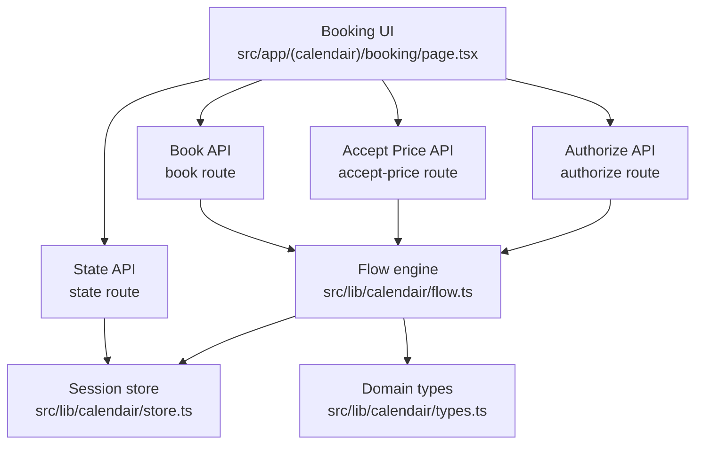
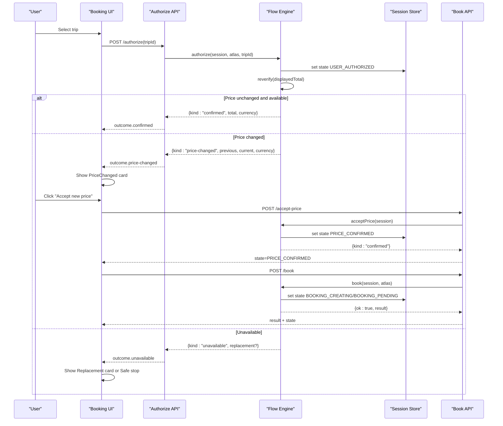
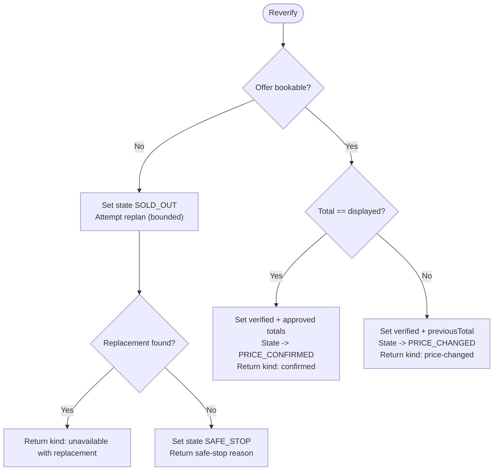
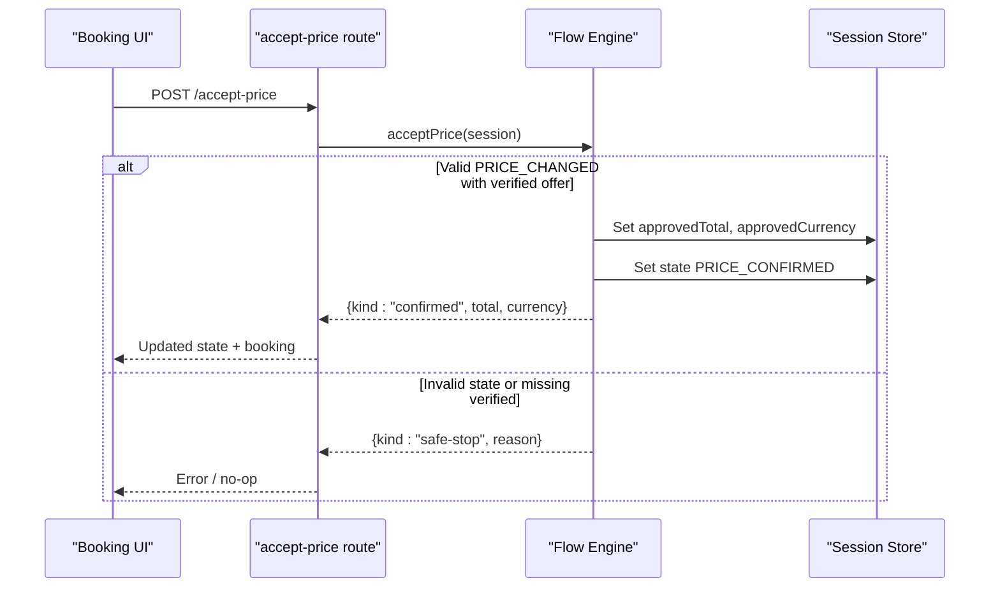
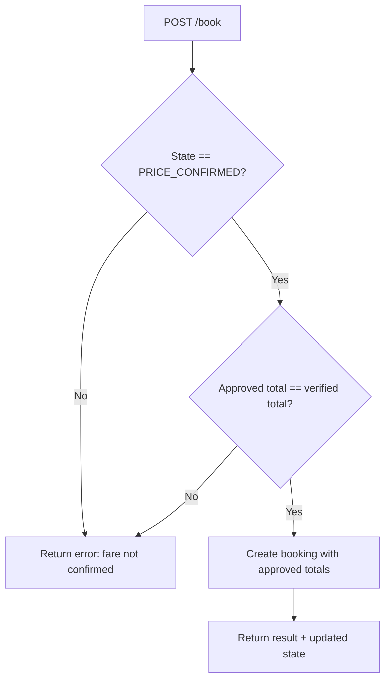
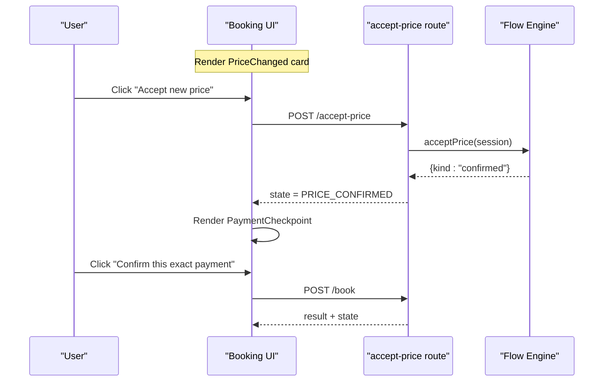
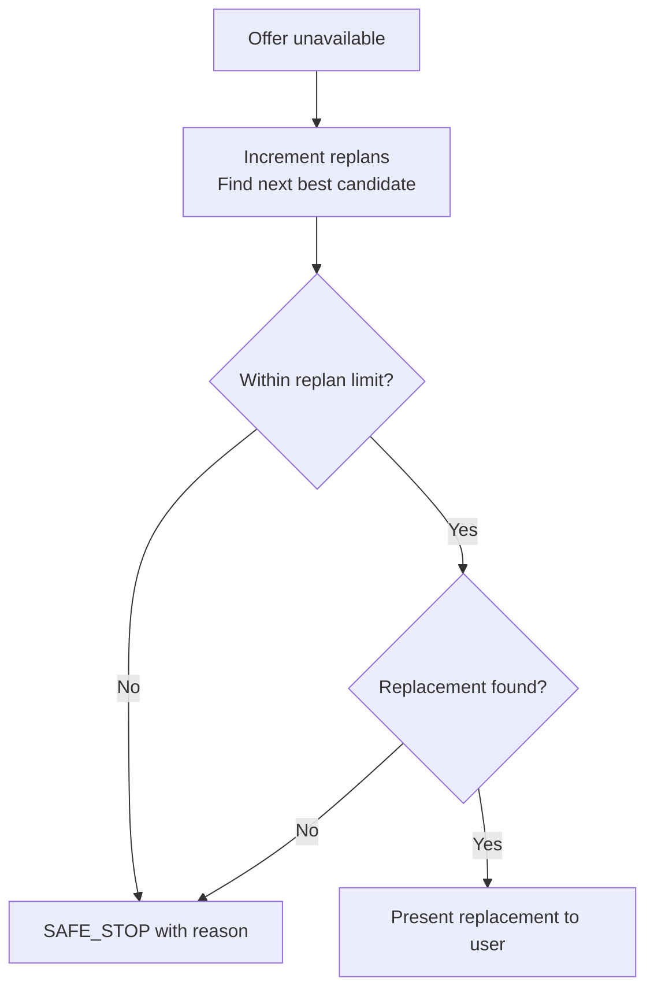
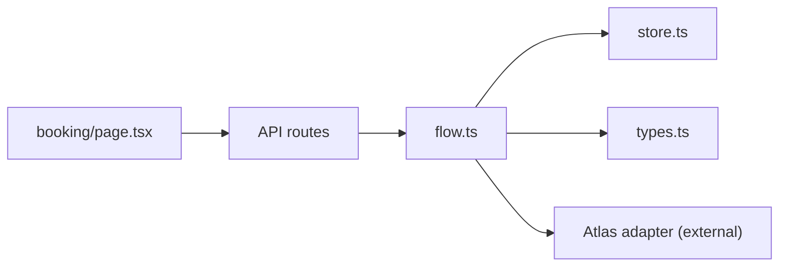

# Price Verification & Acceptance

<cite>
**Referenced Files in This Document**
- [flow.ts](file://src/lib/calendair/flow.ts)
- [store.ts](file://src/lib/calendair/store.ts)
- [types.ts](file://src/lib/calendair/types.ts)
- [accept-price/route.ts](file://src/app/api/calendair/session/[id]/accept-price/route.ts)
- [book/route.ts](file://src/app/api/calendair/session/[id]/book/route.ts)
- [state/route.ts](file://src/app/api/calendair/session/[id]/state/route.ts)
- [booking/page.tsx](file://src/app/(calendair)/booking/page.tsx)
- [e2e.mjs](file://scripts/e2e.mjs)
</cite>

## Table of Contents
1. [Introduction](#introduction)
2. [Project Structure](#project-structure)
3. [Core Components](#core-components)
4. [Architecture Overview](#architecture-overview)
5. [Detailed Component Analysis](#detailed-component-analysis)
6. [Dependency Analysis](#dependency-analysis)
7. [Performance Considerations](#performance-considerations)
8. [Troubleshooting Guide](#troubleshooting-guide)
9. [Conclusion](#conclusion)

## Introduction
This document explains the price verification and acceptance workflow that ensures users explicitly approve any fare changes before booking proceeds. It covers:
- Reverification of live fares after user authorization
- Handling price increases, unchanged prices, and unavailable trips
- The acceptPrice function and state transitions to PRICE_CONFIRMED
- Safety guarantees that prevent booking without explicit approval
- UI examples for price change notifications, user acceptance flows, and fallback scenarios when no replacement is available

## Project Structure
The price verification and acceptance flow spans server routes, a domain flow module, session store, types, and the booking UI.

**Diagram sources**
- [flow.ts:65-176](file://src/lib/calendair/flow.ts#L65-L176)
- [accept-price/route.ts:1-15](file://src/app/api/calendair/session/[id]/accept-price/route.ts#L1-L15)
- [book/route.ts:1-23](file://src/app/api/calendair/session/[id]/book/route.ts#L1-L23)
- [state/route.ts:1-34](file://src/app/api/calendair/session/[id]/state/route.ts#L1-L34)
- [store.ts:1-117](file://src/lib/calendair/store.ts#L1-L117)
- [types.ts:197-215](file://src/lib/calendair/types.ts#L197-L215)
- [booking/page.tsx:91-174](file://src/app/(calendair)/booking/page.tsx#L91-L174)

**Section sources**
- [flow.ts:65-176](file://src/lib/calendair/flow.ts#L65-L176)
- [accept-price/route.ts:1-15](file://src/app/api/calendair/session/[id]/accept-price/route.ts#L1-L15)
- [book/route.ts:1-23](file://src/app/api/calendair/session/[id]/book/route.ts#L1-L23)
- [state/route.ts:1-34](file://src/app/api/calendair/session/[id]/state/route.ts#L1-L34)
- [store.ts:1-117](file://src/lib/calendair/store.ts#L1-L117)
- [types.ts:197-215](file://src/lib/calendair/types.ts#L197-L215)
- [booking/page.tsx:91-174](file://src/app/(calendair)/booking/page.tsx#L91-L174)

## Core Components
- Flow engine (reverify, acceptPrice, book): Implements the state machine and safety checks around pricing and booking.
- Session store: Holds per-session booking state, activity log, and lifecycle management.
- Domain types: Define BookingState values and data contracts used across the flow.
- API routes: Expose endpoints for authorize, accept-price, book, and state polling.
- Booking UI: Renders checkpoints, price change notifications, and confirmation screens; drives user actions.

Key responsibilities:
- Reverify live fares immediately after user authorization.
- Stop on price changes or unavailability until the user decides.
- Require explicit acceptance via acceptPrice before allowing booking.
- Enforce that only an approved total can be booked.

**Section sources**
- [flow.ts:65-176](file://src/lib/calendair/flow.ts#L65-L176)
- [flow.ts:192-248](file://src/lib/calendair/flow.ts#L192-L248)
- [store.ts:28-51](file://src/lib/calendair/store.ts#L28-L51)
- [types.ts:197-215](file://src/lib/calendair/types.ts#L197-L215)
- [accept-price/route.ts:1-15](file://src/app/api/calendair/session/[id]/accept-price/route.ts#L1-L15)
- [book/route.ts:1-23](file://src/app/api/calendair/session/[id]/book/route.ts#L1-L23)
- [booking/page.tsx:91-174](file://src/app/(calendair)/booking/page.tsx#L91-L174)

## Architecture Overview
End-to-end flow from user authorization to confirmed booking with explicit price acceptance:

**Diagram sources**
- [flow.ts:65-176](file://src/lib/calendair/flow.ts#L65-L176)
- [flow.ts:192-248](file://src/lib/calendair/flow.ts#L192-L248)
- [accept-price/route.ts:1-15](file://src/app/api/calendair/session/[id]/accept-price/route.ts#L1-L15)
- [book/route.ts:1-23](file://src/app/api/calendair/session/[id]/book/route.ts#L1-L23)
- [booking/page.tsx:91-174](file://src/app/(calendair)/booking/page.tsx#L91-L174)

## Detailed Component Analysis

### Reverification and State Transitions
- After user authorizes a trip, the system re-reads the live offer.
- If the offer is still bookable and the total matches the displayed price, the session moves to PRICE_CONFIRMED.
- If the offer is bookable but the total differs, the session moves to PRICE_CHANGED and waits for explicit acceptance.
- If the offer is not bookable, the session moves to SOLD_OUT and attempts one replan within limits; if no replacement clears constraints, it stops safely.

**Diagram sources**
- [flow.ts:94-176](file://src/lib/calendair/flow.ts#L94-L176)

**Section sources**
- [flow.ts:94-176](file://src/lib/calendair/flow.ts#L94-L176)
- [types.ts:197-215](file://src/lib/calendair/types.ts#L197-L215)

### acceptPrice Function and Safety Guarantees
- acceptPrice validates that there is a verified offer and the session is in PRICE_CHANGED.
- On success, it records the approved total and currency, transitions to PRICE_CONFIRMED, logs an activity event, and returns a confirmed outcome.
- If conditions are not met, it returns a safe-stop outcome, preventing silent progression.

**Diagram sources**
- [flow.ts:192-210](file://src/lib/calendair/flow.ts#L192-L210)
- [accept-price/route.ts:1-15](file://src/app/api/calendair/session/[id]/accept-price/route.ts#L1-L15)

**Section sources**
- [flow.ts:192-210](file://src/lib/calendair/flow.ts#L192-L210)
- [accept-price/route.ts:1-15](file://src/app/api/calendair/session/[id]/accept-price/route.ts#L1-L15)

### Booking Guardrails
- The book endpoint refuses to proceed unless the session is in PRICE_CONFIRMED and the approved total matches the verified fare.
- This enforces that no booking write occurs without explicit user approval of the exact total.

**Diagram sources**
- [book/route.ts:1-23](file://src/app/api/calendair/session/[id]/book/route.ts#L1-L23)
- [flow.ts:218-248](file://src/lib/calendair/flow.ts#L218-L248)

**Section sources**
- [book/route.ts:1-23](file://src/app/api/calendair/session/[id]/book/route.ts#L1-L23)
- [flow.ts:218-248](file://src/lib/calendair/flow.ts#L218-L248)

### UI: Price Change Notifications and User Acceptance
- When PRICE_CHANGED, the UI shows a clear notification comparing previous and new prices, explaining that no action has been taken yet.
- The user must click “Accept new price” to call acceptPrice; otherwise, booking cannot proceed.
- When PRICE_CONFIRMED, the UI presents a payment checkpoint showing the exact total to confirm, then calls book.

**Diagram sources**
- [booking/page.tsx:91-174](file://src/app/(calendair)/booking/page.tsx#L91-L174)
- [booking/page.tsx:374-461](file://src/app/(calendair)/booking/page.tsx#L374-L461)
- [booking/page.tsx:463-549](file://src/app/(calendair)/booking/page.tsx#L463-L549)
- [accept-price/route.ts:1-15](file://src/app/api/calendair/session/[id]/accept-price/route.ts#L1-L15)
- [book/route.ts:1-23](file://src/app/api/calendair/session/[id]/book/route.ts#L1-L23)

**Section sources**
- [booking/page.tsx:91-174](file://src/app/(calendair)/booking/page.tsx#L91-L174)
- [booking/page.tsx:374-461](file://src/app/(calendair)/booking/page.tsx#L374-L461)
- [booking/page.tsx:463-549](file://src/app/(calendair)/booking/page.tsx#L463-L549)

### Fallback Scenarios: Unavailable Trips and No Replacement
- If the original fare becomes unavailable, the system attempts one replan within configured limits and presents a replacement if found.
- If no replacement clears all hard constraints, the flow stops safely and does not book anything.

**Diagram sources**
- [flow.ts:147-176](file://src/lib/calendair/flow.ts#L147-L176)

**Section sources**
- [flow.ts:147-176](file://src/lib/calendair/flow.ts#L147-L176)
- [booking/page.tsx:148-174](file://src/app/(calendair)/booking/page.tsx#L148-L174)

## Dependency Analysis
- The booking UI depends on session state and exposes actions (authorize, acceptPrice, book, pollFulfilment).
- Server routes delegate to the flow engine, which mutates session state and interacts with the Atlas adapter for live verification and booking.
- The session store provides in-memory persistence and activity logging for auditability.

**Diagram sources**
- [booking/page.tsx:91-174](file://src/app/(calendair)/booking/page.tsx#L91-L174)
- [flow.ts:65-176](file://src/lib/calendair/flow.ts#L65-L176)
- [store.ts:1-117](file://src/lib/calendair/store.ts#L1-L117)
- [types.ts:197-215](file://src/lib/calendair/types.ts#L197-L215)

**Section sources**
- [booking/page.tsx:91-174](file://src/app/(calendair)/booking/page.tsx#L91-L174)
- [flow.ts:65-176](file://src/lib/calendair/flow.ts#L65-L176)
- [store.ts:1-117](file://src/lib/calendair/store.ts#L1-L117)
- [types.ts:197-215](file://src/lib/calendair/types.ts#L197-L215)

## Performance Considerations
- Reverification is performed once per authorization attempt; avoid redundant calls by relying on session state.
- The replan budget is bounded to prevent excessive recomputation; tune MAX_REPLANS based on provider latency and cost.
- Activity logs are capped to keep memory usage predictable during long sessions.

[No sources needed since this section provides general guidance]

## Troubleshooting Guide
Common issues and how the system handles them:
- Booking refused before acceptance: The book endpoint requires PRICE_CONFIRMED and matching approved total; ensure acceptPrice was called successfully.
- Session expired: All routes return a session-expired error if the session is not found; refresh the session.
- No replacement available: The flow stops safely; guide the user back to search or alternative windows.

Validation references:
- E2E script asserts that booking is refused before acceptance and proceeds after acceptance.

**Section sources**
- [book/route.ts:1-23](file://src/app/api/calendair/session/[id]/book/route.ts#L1-L23)
- [flow.ts:218-248](file://src/lib/calendair/flow.ts#L218-L248)
- [e2e.mjs:121-147](file://scripts/e2e.mjs#L121-L147)

## Conclusion
The price verification and acceptance workflow enforces explicit user approval for any fare changes through a strict state machine:
- Reverification detects price changes or unavailability and pauses for user decisions.
- acceptPrice transitions the session to PRICE_CONFIRMED only when the user explicitly approves the new total.
- Booking is guarded to ensure only approved totals are written, preventing unauthorized charges.
- Fallback logic handles unavailable trips with bounded replanning and clear safe stops when no suitable replacement exists.

This design prioritizes transparency, safety, and user control throughout the booking process.