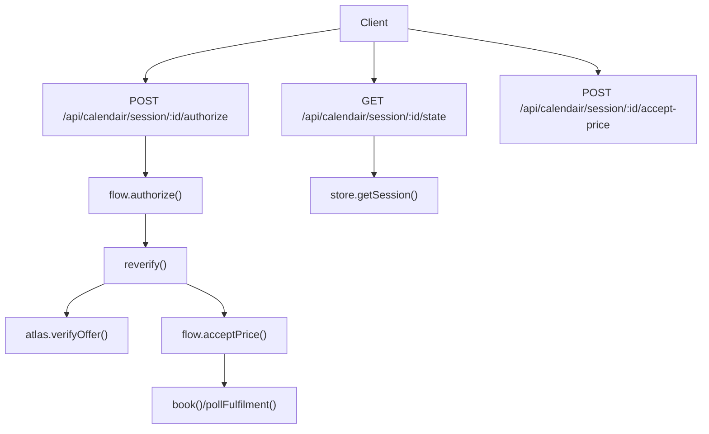
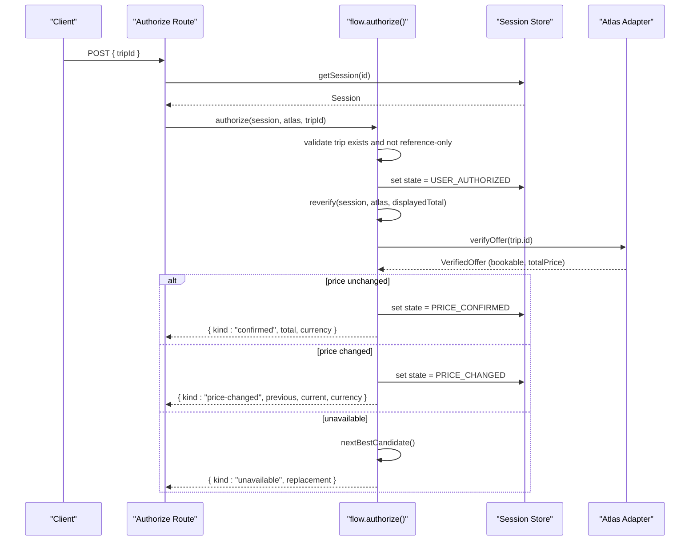
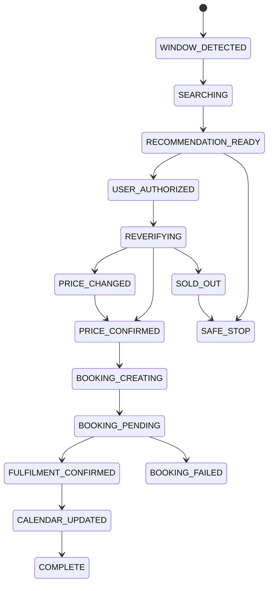
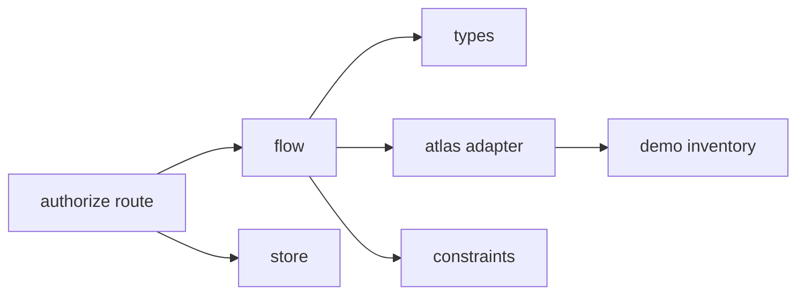

# Trip Authorization

<cite>
**Referenced Files in This Document**
- [authorize route](file://src/app/api/calendair/session/[id]/authorize/route.ts)
- [state route](file://src/app/api/calendair/session/[id]/state/route.ts)
- [accept-price route](file://src/app/api/calendair/session/[id]/accept-price/route.ts)
- [flow](file://src/lib/calendair/flow.ts)
- [store](file://src/lib/calendair/store.ts)
- [types](file://src/lib/calendair/types.ts)
- [constraints](file://src/lib/calendair/constraints.ts)
- [demo adapter](file://src/lib/atlas/demo-adapter.ts)
- [demo inventory](file://src/lib/calendair/demo/inventory.ts)
- [e2e script](file://scripts/e2e.mjs)
</cite>

## Table of Contents
1. [Introduction](#introduction)
2. [Project Structure](#project-structure)
3. [Core Components](#core-components)
4. [Architecture Overview](#architecture-overview)
5. [Detailed Component Analysis](#detailed-component-analysis)
6. [Dependency Analysis](#dependency-analysis)
7. [Performance Considerations](#performance-considerations)
8. [Troubleshooting Guide](#troubleshooting-guide)
9. [Conclusion](#conclusion)

## Introduction
This document explains the initial trip authorization process where users approve travel recommendations. It covers validation checks (including reference-only offers and current search availability), state transitions from SEARCHING to USER_AUTHORIZED, and the subsequent reverification process that re-reads live fares and enforces explicit user acceptance when prices change. It also includes examples of authorization requests, response handling, and error scenarios such as removed trips or invalid references.

## Project Structure
The authorization flow is implemented across a Next.js API layer and core business logic:
- API routes handle HTTP requests and return session state and outcomes.
- The flow module implements the booking state machine and orchestrates verification and replanning.
- The store manages in-memory sessions and activity logs.
- Types define booking states and offer shapes.
- Constraints enforce hard rules before any write path.
- The Atlas adapter provides provider interactions including offer verification.

**Diagram sources**
- [authorize route:1-24](file://src/app/api/calendair/session/[id]/authorize/route.ts#L1-L24)
- [state route:1-35](file://src/app/api/calendair/session/[id]/state/route.ts#L1-L35)
- [accept-price route:1-16](file://src/app/api/calendair/session/[id]/accept-price/route.ts#L1-L16)
- [flow:65-210](file://src/lib/calendair/flow.ts#L65-L210)
- [store:88-92](file://src/lib/calendair/store.ts#L88-L92)

**Section sources**
- [authorize route:1-24](file://src/app/api/calendair/session/[id]/authorize/route.ts#L1-L24)
- [state route:1-35](file://src/app/api/calendair/session/[id]/state/route.ts#L1-L35)
- [flow:22-84](file://src/lib/calendair/flow.ts#L22-L84)
- [store:88-92](file://src/lib/calendair/store.ts#L88-L92)

## Core Components
- Authorization endpoint: validates input, loads session, calls authorize, returns outcome and updated session state.
- Authorization flow: validates trip presence and reference-only status, transitions to USER_AUTHORIZED, then re-verifies with provider.
- Reverification: reads live fare, handles price changes, sold-out conditions, and bounded replanning.
- Price acceptance: explicit user action required when price changes; only after acceptance can booking proceed.
- Session state: tracks booking state, verified offers, approved totals, replans, and activity log.

**Section sources**
- [authorize route:14-23](file://src/app/api/calendair/session/[id]/authorize/route.ts#L14-L23)
- [flow:65-210](file://src/lib/calendair/flow.ts#L65-L210)
- [store:28-51](file://src/lib/calendair/store.ts#L28-L51)

## Architecture Overview
The authorization process follows a strict human-checkpoint model: no writes occur until the user explicitly approves any price change. The flow ensures safety by re-reading the world before any write and stopping when constraints or availability are not met.

**Diagram sources**
- [authorize route:14-23](file://src/app/api/calendair/session/[id]/authorize/route.ts#L14-L23)
- [flow:65-176](file://src/lib/calendair/flow.ts#L65-L176)
- [demo adapter:60-68](file://src/lib/atlas/demo-adapter.ts#L60-L68)

## Detailed Component Analysis

### Authorization Endpoint
- Validates request body for tripId using schema validation.
- Loads session by id; returns 404 if expired.
- Calls authorize with an Atlas adapter created from the session scenario.
- Returns outcome, current booking state, booking data, and activity log.

Validation checks performed here:
- Session existence.
- Request payload shape.

State transitions initiated:
- Sets USER_AUTHORIZED during authorize flow.

Response handling:
- Outcome indicates confirmed, price-changed, unavailable, or safe-stop.
- Booking state reflects current step (USER_AUTHORIZED, REVERIFYING, PRICE_CHANGED, PRICE_CONFIRMED, SOLD_OUT, SAFE_STOP).

**Section sources**
- [authorize route:7-23](file://src/app/api/calendair/session/[id]/authorize/route.ts#L7-L23)
- [flow:65-84](file://src/lib/calendair/flow.ts#L65-L84)

### Authorization Flow and Validation Checks
Key validations:
- Reference-only offers: rejected immediately with safe-stop reason.
- Current search availability: trip must exist in current engine results; otherwise safe-stop.

State transitions:
- From SEARCHING (set earlier by scan) to USER_AUTHORIZED upon valid authorization.
- Then to REVERIFYING while provider verification runs.

Reverification behavior:
- Reads live fare via provider.
- If available and price matches displayed total: moves to PRICE_CONFIRMED.
- If available but price differs: moves to PRICE_CHANGED and requires explicit acceptance.
- If unavailable: attempts one bounded replan within budget; may return a replacement or stop safely.

Error scenarios:
- Removed trip: safe-stop with reason indicating offer no longer in current search.
- Invalid reference: safe-stop indicating reference price cannot be verified or booked.

**Section sources**
- [flow:47-84](file://src/lib/calendair/flow.ts#L47-L84)
- [flow:94-176](file://src/lib/calendair/flow.ts#L94-L176)
- [constraints:145-151](file://src/lib/calendair/constraints.ts#L145-L151)

### Reverification and Provider Interaction
- Provider verification always re-reads; it never trusts caller-held data.
- Demo scenarios simulate price changes and sold-out conditions.
- Activity logging records recheck timing and availability.

Provider behaviors:
- verifyOffer throws if offer is no longer present in current search.
- demoReverification adjusts price or marks bookable false based on scenario.

**Section sources**
- [demo adapter:60-68](file://src/lib/atlas/demo-adapter.ts#L60-L68)
- [demo inventory:176-195](file://src/lib/calendair/demo/inventory.ts#L176-L195)
- [flow:103-115](file://src/lib/calendair/flow.ts#L103-L115)

### Price Acceptance
- When price changes, booking is refused until explicit acceptance.
- acceptPrice sets approved total and currency, transitions to PRICE_CONFIRMED.
- Only after acceptance can booking proceed.

**Section sources**
- [accept-price route:7-14](file://src/app/api/calendair/session/[id]/accept-price/route.ts#L7-L14)
- [flow:192-210](file://src/lib/calendair/flow.ts#L192-L210)

### State Machine Overview
Booking states relevant to authorization:
- WINDOW_DETECTED → SEARCHING → RECOMMENDATION_READY → USER_AUTHORIZED → REVERIFYING → PRICE_CHANGED | PRICE_CONFIRMED → BOOKING_CREATING → BOOKING_PENDING → FULFILMENT_CONFIRMED → CALENDAR_UPDATED → COMPLETE
- Additional terminal/error states: OFFER_EXPIRED, SOLD_OUT, BOOKING_FAILED, SAFE_STOP

**Diagram sources**
- [types:197-215](file://src/lib/calendair/types.ts#L197-L215)
- [flow:22-33](file://src/lib/calendair/flow.ts#L22-L33)
- [flow:65-189](file://src/lib/calendair/flow.ts#L65-L189)

## Dependency Analysis
- API routes depend on store for session retrieval and flow for business logic.
- Flow depends on types for state definitions and on Atlas adapter for provider operations.
- Constraints enforce hard rules prior to any write path.
- Demo adapter and inventory provide test scenarios for price changes and sold-out conditions.

**Diagram sources**
- [authorize route:1-23](file://src/app/api/calendair/session/[id]/authorize/route.ts#L1-L23)
- [flow:1-84](file://src/lib/calendair/flow.ts#L1-L84)
- [types:197-215](file://src/lib/calendair/types.ts#L197-L215)
- [constraints:42-161](file://src/lib/calendair/constraints.ts#L42-L161)
- [demo adapter:60-68](file://src/lib/atlas/demo-adapter.ts#L60-L68)
- [demo inventory:176-195](file://src/lib/calendair/demo/inventory.ts#L176-L195)

**Section sources**
- [authorize route:1-23](file://src/app/api/calendair/session/[id]/authorize/route.ts#L1-L23)
- [flow:1-84](file://src/lib/calendair/flow.ts#L1-L84)
- [types:197-215](file://src/lib/calendair/types.ts#L197-L215)
- [constraints:42-161](file://src/lib/calendair/constraints.ts#L42-L161)
- [demo adapter:60-68](file://src/lib/atlas/demo-adapter.ts#L60-L68)
- [demo inventory:176-195](file://src/lib/calendair/demo/inventory.ts#L176-L195)

## Performance Considerations
- Reverification performs a fresh provider read before any write, ensuring correctness at the cost of latency.
- Bounded replanning limits retries to avoid excessive provider calls.
- Activity logging is bounded to prevent unbounded memory growth.

[No sources needed since this section provides general guidance]

## Troubleshooting Guide
Common error scenarios and how they are handled:
- Session expired: 404 returned by API routes when session not found.
- Missing tripId: 400 returned due to schema validation failure.
- Offer no longer in current search: safe-stop with reason indicating the offer is not present.
- Reference-only offer: safe-stop indicating reference price cannot be verified or booked.
- Sold-out at reverification: returns unavailable with a replacement candidate; if none, safe-stop.
- Price changed: requires explicit acceptance via accept-price endpoint before booking proceeds.

Example flows validated by e2e tests:
- Authorization stops on price change and reports both totals.
- Booking is refused before acceptance.
- After acceptance, booking proceeds.
- Sold-out scenario returns unavailable with a replacement and counts replans.

**Section sources**
- [authorize route:14-23](file://src/app/api/calendair/session/[id]/authorize/route.ts#L14-L23)
- [flow:70-84](file://src/lib/calendair/flow.ts#L70-L84)
- [flow:147-176](file://src/lib/calendair/flow.ts#L147-L176)
- [flow:186-190](file://src/lib/calendair/flow.ts#L186-L190)
- [e2e script:121-147](file://scripts/e2e.mjs#L121-L147)

## Conclusion
The trip authorization process enforces strong safety guarantees:
- No writes occur without explicit user approval.
- Reference-only offers are blocked from booking.
- Live verification ensures current availability and pricing.
- Price changes require explicit acceptance before proceeding.
- Bounded replanning prevents infinite loops and maintains user control.

This design prioritizes correctness and transparency over speed, ensuring users remain in control of their bookings throughout the process.