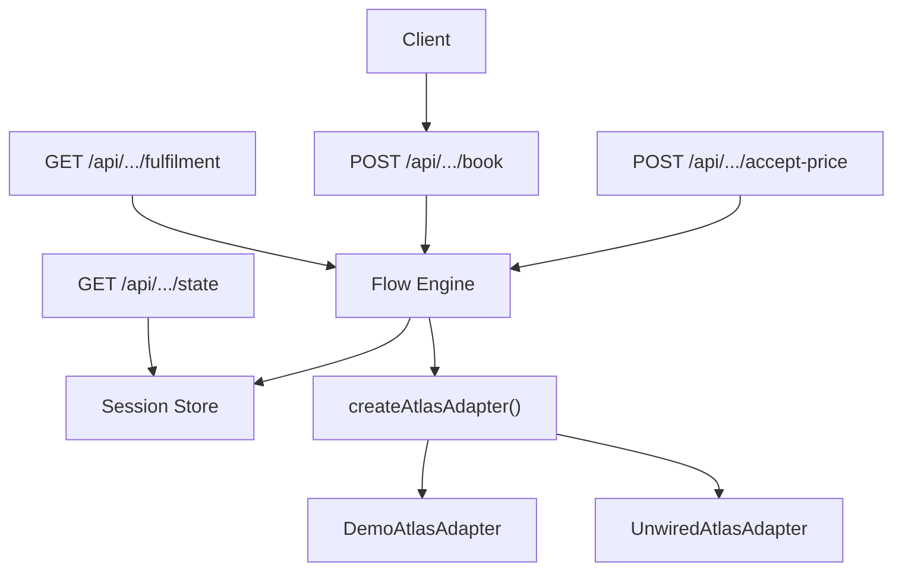
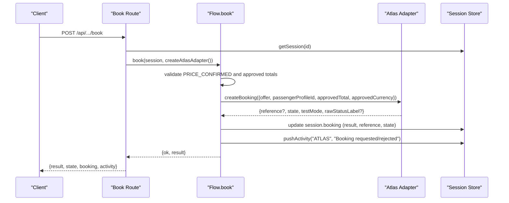
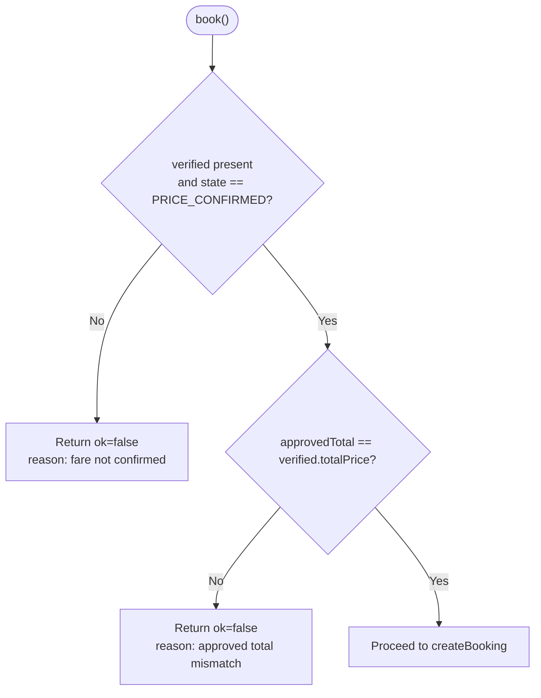
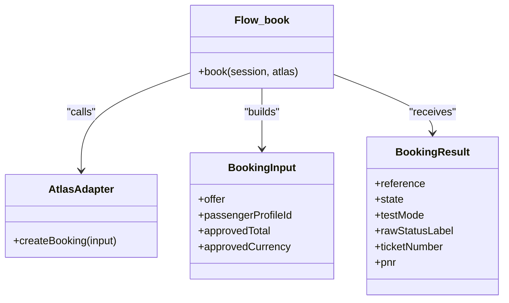
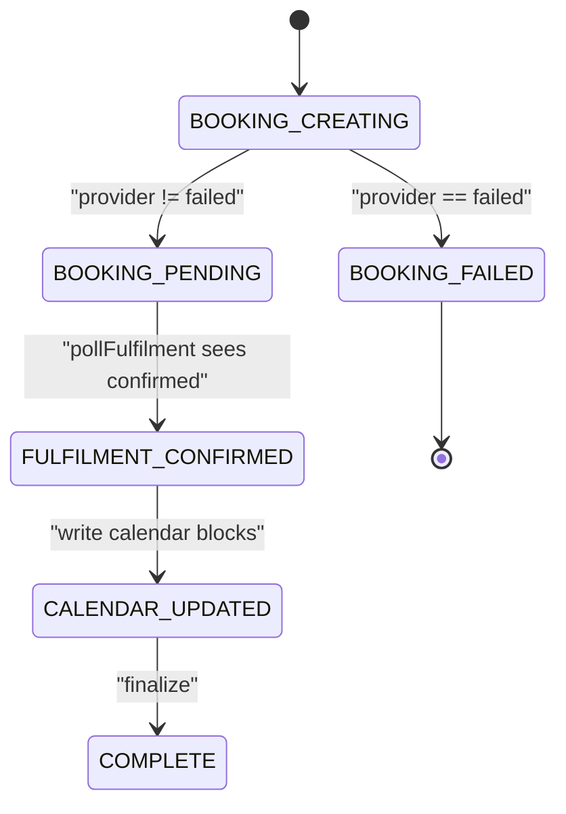
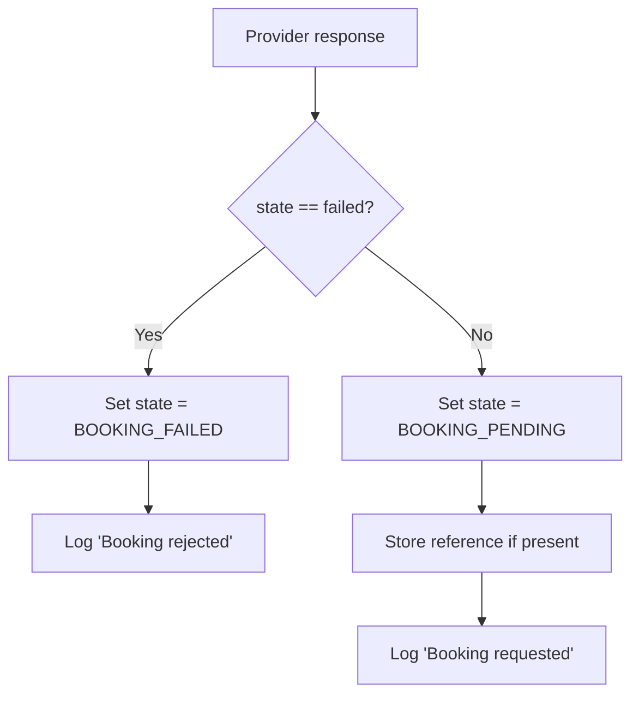
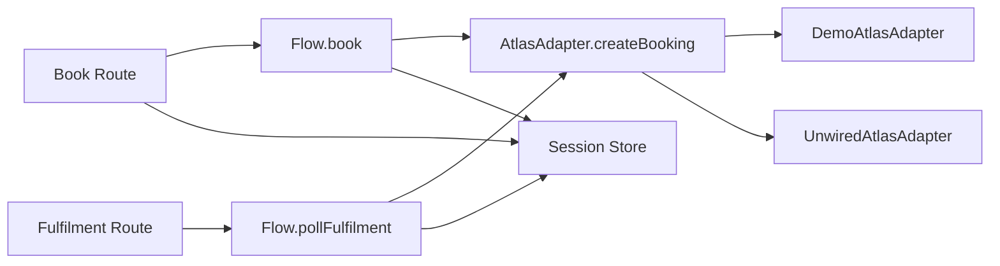

# Booking Creation

<cite>
**Referenced Files in This Document**
- [route.ts](file://src/app/api/calendair/session/[id]/book/route.ts)
- [route.ts](file://src/app/api/calendair/session/[id]/accept-price/route.ts)
- [route.ts](file://src/app/api/calendair/session/[id]/state/route.ts)
- [route.ts](file://src/app/api/calendair/session/[id]/fulfilment/route.ts)
- [flow.ts](file://src/lib/calendair/flow.ts)
- [index.ts](file://src/lib/atlas/index.ts)
- [adapter.ts](file://src/lib/atlas/adapter.ts)
- [demo-adapter.ts](file://src/lib/atlas/demo-adapter.ts)
- [store.ts](file://src/lib/calendair/store.ts)
- [types.ts](file://src/lib/calendair/types.ts)
</cite>

## Table of Contents
1. Introduction
2. Project Structure
3. Core Components
4. Architecture Overview
5. Detailed Component Analysis
6. Dependency Analysis
7. Performance Considerations
8. Troubleshooting Guide
9. Conclusion

## Introduction
This document explains the booking creation process that initiates a reservation through the Atlas provider. It covers:
- Validation checks ensuring price confirmation before any write
- The createBooking call with passenger profile and approved totals
- State management for booking results
- Error handling for failed bookings, reference handling, and activity logging
- Examples of booking requests, provider responses, and failure scenarios

The flow is intentionally conservative: nothing is written until the traveller explicitly approves the final total, and success is never assumed from an HTTP 200.

## Project Structure
The booking creation path spans API routes, a stateful session store, a deterministic flow engine, and an Atlas adapter abstraction that can be wired to demo or live providers.

**Diagram sources**
- [route.ts:1-24](file://src/app/api/calendair/session/[id]/book/route.ts#L1-L24)
- [route.ts:1-16](file://src/app/api/calendair/session/[id]/accept-price/route.ts#L1-L16)
- [route.ts:1-35](file://src/app/api/calendair/session/[id]/state/route.ts#L1-L35)
- [route.ts:1-20](file://src/app/api/calendair/session/[id]/fulfilment/route.ts#L1-L20)
- [flow.ts:218-248](file://src/lib/calendair/flow.ts#L218-L248)
- [index.ts:18-37](file://src/lib/atlas/index.ts#L18-L37)
- [adapter.ts:23-29](file://src/lib/atlas/adapter.ts#L23-L29)
- [demo-adapter.ts:70-113](file://src/lib/atlas/demo-adapter.ts#L70-L113)
- [store.ts:42-51](file://src/lib/calendair/store.ts#L42-L51)

**Section sources**
- [route.ts:1-24](file://src/app/api/calendair/session/[id]/book/route.ts#L1-L24)
- [flow.ts:218-248](file://src/lib/calendair/flow.ts#L218-L248)
- [index.ts:18-37](file://src/lib/atlas/index.ts#L18-L37)
- [store.ts:42-51](file://src/lib/calendair/store.ts#L42-L51)

## Core Components
- API route POST /api/calendair/session/{id}/book: entry point for the first write; validates session and delegates to the flow book function.
- Flow book(): enforces price confirmation, calls Atlas.createBooking with verified offer, passenger profile ID, and approved totals, updates session state and activity log.
- Atlas adapter selection: createAtlasAdapter chooses between demo and unwired adapters based on environment variables.
- Session store: holds booking state, activity log, and world/engine context; bounded activity log.
- Types: define BookingState, BookingInput, BookingResult, and activity model.

**Section sources**
- [route.ts:1-24](file://src/app/api/calendair/session/[id]/book/route.ts#L1-L24)
- [flow.ts:218-248](file://src/lib/calendair/flow.ts#L218-L248)
- [index.ts:18-37](file://src/lib/atlas/index.ts#L18-L37)
- [store.ts:94-116](file://src/lib/calendair/store.ts#L94-L116)
- [types.ts:197-246](file://src/lib/calendair/types.ts#L197-L246)

## Architecture Overview
The booking creation follows a strict sequence:
1. Client calls POST /api/calendair/session/{id}/book.
2. Route loads the session by id; if missing, returns 404.
3. Route builds an Atlas adapter via createAtlasAdapter(session.scenario).
4. Route invokes book(session, atlas), which:
   - Validates that the fare is PRICE_CONFIRMED and matches approved totals.
   - Sets state to BOOKING_CREATING.
   - Calls atlas.createBooking with the verified offer, passengerProfileId, approvedTotal, and approvedCurrency.
   - Persists result and reference into session.booking.
   - Sets state to BOOKING_PENDING or BOOKING_FAILED.
   - Logs an ATLAS activity event.
5. Route returns result, current state, booking snapshot, and activity log.

**Diagram sources**
- [route.ts:1-24](file://src/app/api/calendair/session/[id]/book/route.ts#L1-L24)
- [flow.ts:218-248](file://src/lib/calendair/flow.ts#L218-L248)
- [index.ts:18-37](file://src/lib/atlas/index.ts#L18-L37)
- [store.ts:94-116](file://src/lib/calendair/store.ts#L94-L116)

## Detailed Component Analysis

### Price Confirmation Gate
Before any booking attempt, the flow ensures:
- The session has a verified offer and is in PRICE_CONFIRMED.
- The approved total equals the verified total at this moment.
If either check fails, the request is rejected with a 409 error and a reason.

**Diagram sources**
- [flow.ts:218-226](file://src/lib/calendair/flow.ts#L218-L226)

**Section sources**
- [flow.ts:218-226](file://src/lib/calendair/flow.ts#L218-L226)

### createBooking Call and Data Passed
When validation passes:
- State transitions to BOOKING_CREATING.
- createBooking is invoked with:
  - offer: the verified offer
  - passengerProfileId: from session.world.passenger.id
  - approvedTotal: from session.booking.approvedTotal
  - approvedCurrency: from session.booking.approvedCurrency

After the call:
- session.booking.result and session.booking.reference are updated.
- State becomes BOOKING_PENDING unless the provider returned failed, then BOOKING_FAILED.
- An ATLAS activity event is logged indicating whether the booking was requested or rejected.

**Diagram sources**
- [flow.ts:227-236](file://src/lib/calendair/flow.ts#L227-L236)
- [types.ts:231-246](file://src/lib/calendair/types.ts#L231-L246)
- [adapter.ts:23-29](file://src/lib/atlas/adapter.ts#L23-L29)

**Section sources**
- [flow.ts:227-247](file://src/lib/calendair/flow.ts#L227-L247)
- [types.ts:231-246](file://src/lib/calendair/types.ts#L231-L246)

### State Management for Booking Results
- BOOKING_CREATING: set before calling the provider.
- BOOKING_PENDING: set when provider returns a non-failed result (typically pending ticketing).
- BOOKING_FAILED: set when provider returns failed.
- Subsequent polling via GET /api/.../fulfilment can move state to FULFILMENT_CONFIRMED, CALENDAR_UPDATED, and COMPLETE once the provider confirms.

**Diagram sources**
- [flow.ts:227-247](file://src/lib/calendair/flow.ts#L227-L247)
- [flow.ts:250-280](file://src/lib/calendair/flow.ts#L250-L280)

**Section sources**
- [flow.ts:227-280](file://src/lib/calendair/flow.ts#L227-L280)

### Error Handling for Failed Bookings
- If the fare is not confirmed or totals mismatch, the route returns 409 with a reason string.
- If the provider returns failed, the session state becomes BOOKING_FAILED and an ATLAS activity event records “Booking rejected”.
- Reference handling: if the provider returns a reference, it is stored even when pending; if failed, the reference may be absent or invalid depending on provider behavior. Polling will return unknown reference if none exists.

**Diagram sources**
- [flow.ts:227-247](file://src/lib/calendair/flow.ts#L227-L247)

**Section sources**
- [flow.ts:227-247](file://src/lib/calendair/flow.ts#L227-L247)
- [route.ts:14-15](file://src/app/api/calendair/session/[id]/book/route.ts#L14-L15)

### Activity Logging
Every significant step pushes an activity event:
- ATLAS: “Booking requested” or “Booking rejected” with status label.
- CALENDAR: after fulfilment confirmation, number of blocks written.
Activity entries include timestamp, source, title, detail, ok flag, and optional duration. The log is bounded to prevent unbounded growth.

**Section sources**
- [flow.ts:238-247](file://src/lib/calendair/flow.ts#L238-L247)
- [flow.ts:260-274](file://src/lib/calendair/flow.ts#L260-L274)
- [store.ts:94-116](file://src/lib/calendair/store.ts#L94-L116)

### Provider Responses and Failure Scenarios
- Demo adapter createBooking:
  - Rejects reference-only or non-bookable offers with state=failed and a descriptive label.
  - Otherwise returns a generated reference, state=pending, testMode=true, and a human-readable status label.
- Demo adapter getBookingStatus:
  - Unknown reference returns state=failed.
  - Pending scenario stays pending until polled again.
  - After a short delay, transitions to confirmed with pnr and ticketNumber.

These behaviors illustrate expected provider contracts and how the system treats them.

**Section sources**
- [demo-adapter.ts:70-113](file://src/lib/atlas/demo-adapter.ts#L70-L113)

### Example Requests and Responses
- Booking request:
  - Endpoint: POST /api/calendair/session/{id}/book
  - No body required; the route uses the session’s verified offer and approved totals.
  - Success response includes result, state, booking snapshot, and activity log.
  - Failure response (409) includes an error reason when price is not confirmed or totals mismatch.

- Fulfilment polling:
  - Endpoint: GET /api/calendair/session/{id}/fulfilment
  - Returns updated state, result, booking snapshot, and activity log.

- State query:
  - Endpoint: GET /api/calendair/session/{id}/state
  - Returns current state, booking, activity, engine, and world snapshots.

- Price acceptance:
  - Endpoint: POST /api/calendair/session/{id}/accept-price
  - Explicitly accepts a changed price and moves state to PRICE_CONFIRMED.

**Section sources**
- [route.ts:1-24](file://src/app/api/calendair/session/[id]/book/route.ts#L1-L24)
- [route.ts:1-20](file://src/app/api/calendair/session/[id]/fulfilment/route.ts#L1-L20)
- [route.ts:1-35](file://src/app/api/calendair/session/[id]/state/route.ts#L1-L35)
- [route.ts:1-16](file://src/app/api/calendair/session/[id]/accept-price/route.ts#L1-L16)

## Dependency Analysis

**Diagram sources**
- [route.ts:1-24](file://src/app/api/calendair/session/[id]/book/route.ts#L1-L24)
- [route.ts:1-20](file://src/app/api/calendair/session/[id]/fulfilment/route.ts#L1-L20)
- [flow.ts:218-280](file://src/lib/calendair/flow.ts#L218-L280)
- [adapter.ts:23-29](file://src/lib/atlas/adapter.ts#L23-L29)
- [demo-adapter.ts:70-113](file://src/lib/atlas/demo-adapter.ts#L70-L113)
- [store.ts:42-51](file://src/lib/calendair/store.ts#L42-L51)

**Section sources**
- [flow.ts:218-280](file://src/lib/calendair/flow.ts#L218-L280)
- [adapter.ts:23-29](file://src/lib/atlas/adapter.ts#L23-L29)

## Performance Considerations
- Adapter caching: createAtlasAdapter caches adapters per configuration to avoid recreating clients across requests.
- Activity log capping: activity events are bounded to prevent memory growth.
- Reverification and replanning: ensure only necessary provider calls occur and respect MAX_REPLANS limits.

[No sources needed since this section provides general guidance]

## Troubleshooting Guide
Common issues and where to look:
- 404 Session expired: session not found by id.
- 409 Fare not confirmed or total mismatch: ensure accept-price was called when price changed and state is PRICE_CONFIRMED.
- Booking failed immediately: check provider response; demo adapter rejects reference-only or non-bookable offers.
- Pending forever: poll GET /api/.../fulfilment repeatedly; demo adapter transitions to confirmed after a short delay or stays pending in specific scenarios.
- Unknown reference: no reference was created or stored; verify createBooking response and adapter behavior.

**Section sources**
- [route.ts:11-15](file://src/app/api/calendair/session/[id]/book/route.ts#L11-L15)
- [flow.ts:218-247](file://src/lib/calendair/flow.ts#L218-L247)
- [demo-adapter.ts:70-113](file://src/lib/atlas/demo-adapter.ts#L70-L113)

## Conclusion
The booking creation process is designed around explicit traveller approval and cautious state transitions. It validates price confirmation, calls the Atlas provider with precise inputs, persists references and results, logs every meaningful step, and defers final confirmation until the provider reports it. This approach avoids silent failures and ensures the UI always reflects the true state of the reservation lifecycle.