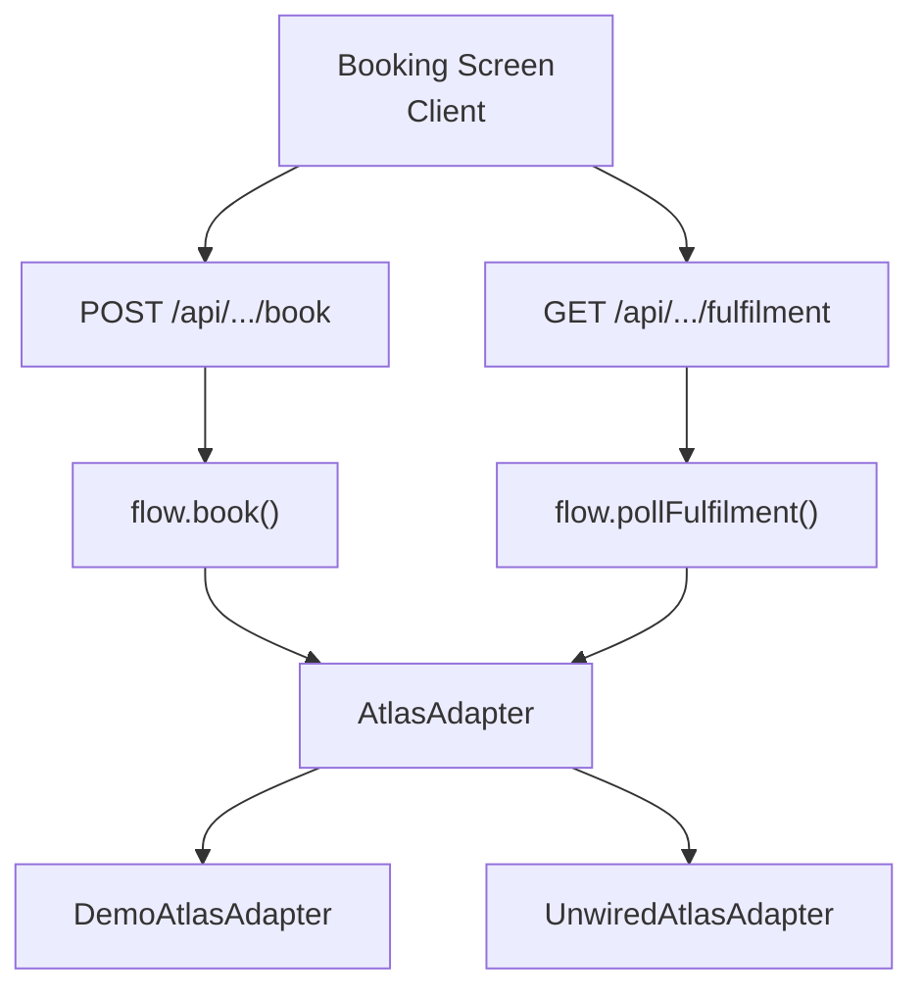
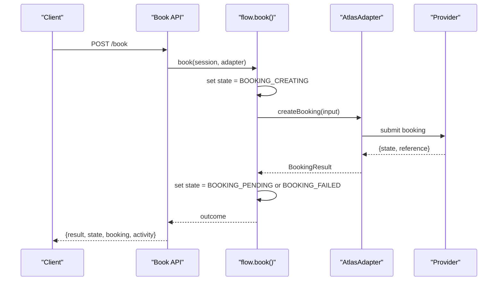
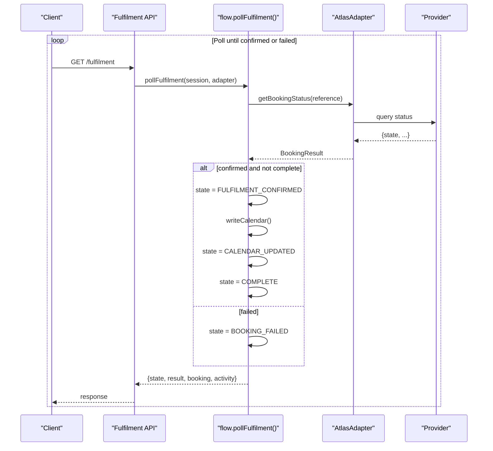
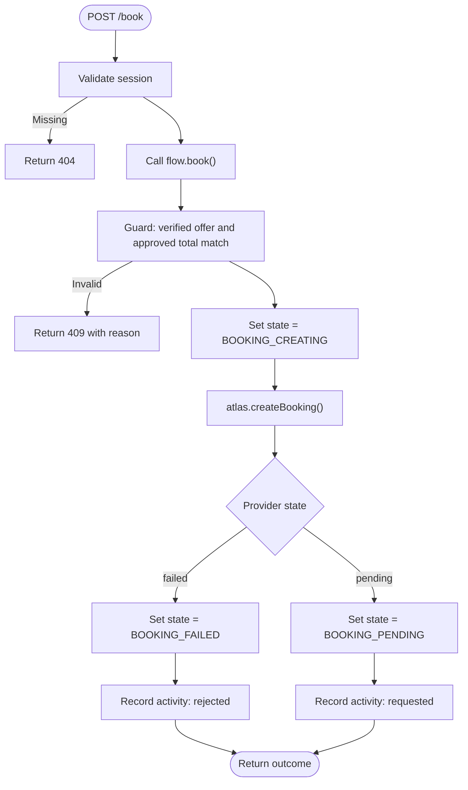
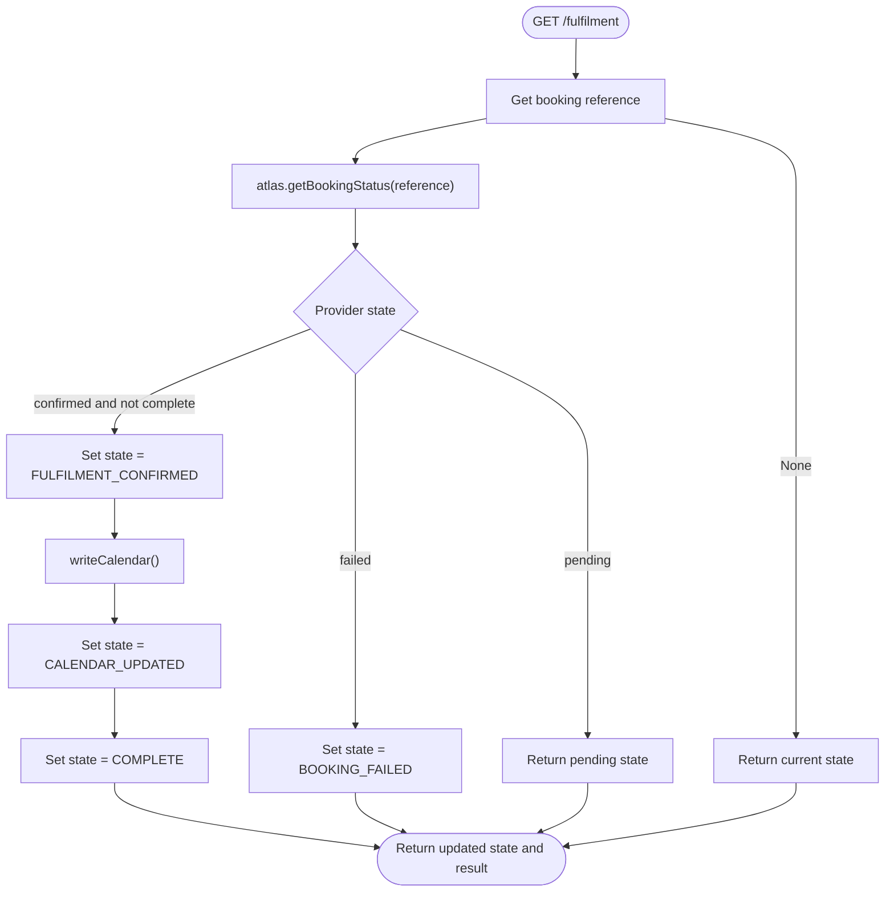
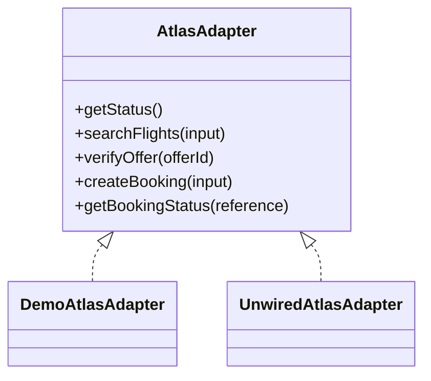
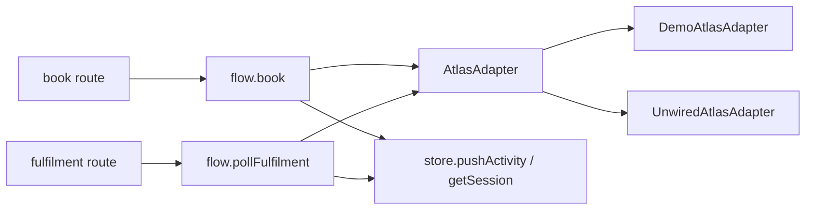

# Booking Execution

<cite>
**Referenced Files in This Document**
- [route.ts](file://src/app/api/calendair/session/[id]/book/route.ts)
- [route.ts](file://src/app/api/calendair/session/[id]/fulfilment/route.ts)
- [flow.ts](file://src/lib/calendair/flow.ts)
- [adapter.ts](file://src/lib/atlas/adapter.ts)
- [index.ts](file://src/lib/atlas/index.ts)
- [demo-adapter.ts](file://src/lib/atlas/demo-adapter.ts)
- [types.ts](file://src/lib/calendair/types.ts)
- [store.ts](file://src/lib/calendair/store.ts)
- [page.tsx](file://src/app/(calendair)/booking/page.tsx)
</cite>

## Table of Contents
1. [Introduction](#introduction)
2. [Project Structure](#project-structure)
3. [Core Components](#core-components)
4. [Architecture Overview](#architecture-overview)
5. [Detailed Component Analysis](#detailed-component-analysis)
6. [Dependency Analysis](#dependency-analysis)
7. [Performance Considerations](#performance-considerations)
8. [Troubleshooting Guide](#troubleshooting-guide)
9. [Conclusion](#conclusion)

## Introduction
This document explains the booking execution phase that transforms an authorized trip into a confirmed reservation. It focuses on:
- The book function that creates bookings via the Atlas adapter and transitions session state from BOOKING_CREATING to BOOKING_PENDING or BOOKING_FAILED.
- The pollFulfilment polling mechanism that waits for provider confirmation and triggers calendar write-back upon successful fulfilment.
- Error handling strategies, retry logic, and how booking states relate to calendar updates.

## Project Structure
The booking execution spans Next.js API routes, a domain flow module, and an adapter abstraction over the travel provider.

**Diagram sources**
- [route.ts:8-23](file://src/app/api/calendair/session/[id]/book/route.ts#L8-L23)
- [route.ts:8-20](file://src/app/api/calendair/session/[id]/fulfilment/route.ts#L8-L20)
- [flow.ts:218-280](file://src/lib/calendair/flow.ts#L218-L280)
- [adapter.ts:23-28](file://src/lib/atlas/adapter.ts#L23-L28)
- [index.ts:18-36](file://src/lib/atlas/index.ts#L18-L36)
- [demo-adapter.ts:28-41](file://src/lib/atlas/demo-adapter.ts#L28-L41)

**Section sources**
- [route.ts:8-23](file://src/app/api/calendair/session/[id]/book/route.ts#L8-L23)
- [route.ts:8-20](file://src/app/api/calendair/session/[id]/fulfilment/route.ts#L8-L20)
- [flow.ts:218-280](file://src/lib/calendair/flow.ts#L218-L280)
- [adapter.ts:23-28](file://src/lib/atlas/adapter.ts#L23-L28)
- [index.ts:18-36](file://src/lib/atlas/index.ts#L18-L36)
- [demo-adapter.ts:28-41](file://src/lib/atlas/demo-adapter.ts#L28-L41)

## Core Components
- API layer: Two endpoints orchestrate the booking lifecycle.
  - POST /api/calendair/session/[id]/book initiates booking creation.
  - GET /api/calendair/session/[id]/fulfilment polls for final confirmation and calendar updates.
- Domain flow: Encapsulates state machine transitions and provider interactions.
- Adapter abstraction: Decouples provider implementation details; supports demo and unwired modes.
- Session store: Holds in-memory session state, including booking state, result, reference, and calendar blocks.

Key responsibilities:
- Validate preconditions before writing anything.
- Transition states explicitly and record activity events.
- Treat provider HTTP success as not yet confirmed; only poll until the provider reports its own confirmed state.

**Section sources**
- [route.ts:8-23](file://src/app/api/calendair/session/[id]/book/route.ts#L8-L23)
- [route.ts:8-20](file://src/app/api/calendair/session/[id]/fulfilment/route.ts#L8-L20)
- [flow.ts:218-280](file://src/lib/calendair/flow.ts#L218-L280)
- [store.ts:15-51](file://src/lib/calendair/store.ts#L15-L51)
- [types.ts:197-246](file://src/lib/calendair/types.ts#L197-L246)

## Architecture Overview
The booking execution follows a strict sequence:
1. Client calls the book endpoint with an authorized offer.
2. Server validates session and price approval, then calls flow.book().
3. flow.book() sets state to BOOKING_CREATING, calls atlas.createBooking(), and transitions to BOOKING_PENDING or BOOKING_FAILED based on provider response.
4. Client polls the fulfilment endpoint repeatedly until the provider confirms.
5. On confirmed, flow.pollFulfilment() transitions through FULFILMENT_CONFIRMED → CALENDAR_UPDATED → COMPLETE and writes calendar blocks.

**Diagram sources**
- [route.ts:8-23](file://src/app/api/calendair/session/[id]/book/route.ts#L8-L23)
- [flow.ts:218-248](file://src/lib/calendair/flow.ts#L218-L248)
- [adapter.ts:23-28](file://src/lib/atlas/adapter.ts#L23-L28)

**Diagram sources**
- [route.ts:8-20](file://src/app/api/calendair/session/[id]/fulfilment/route.ts#L8-L20)
- [flow.ts:251-280](file://src/lib/calendair/flow.ts#L251-L280)

## Detailed Component Analysis

### Book Endpoint and flow.book()
- Validates session existence and returns 404 if expired.
- Calls flow.book() with the session and an Atlas adapter created from the scenario.
- Returns error responses when preconditions are not met (e.g., fare not confirmed).
- flow.book():
  - Guards against missing verified offer or mismatched approved total.
  - Sets state to BOOKING_CREATING.
  - Invokes atlas.createBooking() with verified offer, passenger profile, and approved totals.
  - Persists provider result and reference, then transitions to BOOKING_PENDING or BOOKING_FAILED.
  - Records an activity event indicating request or rejection.

**Diagram sources**
- [route.ts:8-23](file://src/app/api/calendair/session/[id]/book/route.ts#L8-L23)
- [flow.ts:218-248](file://src/lib/calendair/flow.ts#L218-L248)

**Section sources**
- [route.ts:8-23](file://src/app/api/calendair/session/[id]/book/route.ts#L8-L23)
- [flow.ts:218-248](file://src/lib/calendair/flow.ts#L218-L248)
- [types.ts:231-246](file://src/lib/calendair/types.ts#L231-L246)

### Fulfilment Polling and Calendar Write-Back
- The fulfilment endpoint retrieves the session and calls flow.pollFulfilment() with the same adapter strategy.
- pollFulfilment():
  - If no reference exists, returns current state without changes.
  - Queries provider status via atlas.getBookingStatus(reference).
  - On confirmed and not already complete:
    - Transitions to FULFILMENT_CONFIRMED and records activity.
    - Generates calendar blocks via writeCalendar() and sets state to CALENDAR_UPDATED.
    - Records calendar update activity and transitions to COMPLETE.
  - On failed provider status, transitions to BOOKING_FAILED.
- writeCalendar() produces outbound, destination, return, and buffer blocks using verified offer times and traveller preferences. Blocks are marked tentative unless the provider has confirmed.

**Diagram sources**
- [route.ts:8-20](file://src/app/api/calendair/session/[id]/fulfilment/route.ts#L8-L20)
- [flow.ts:251-280](file://src/lib/calendair/flow.ts#L251-L280)
- [flow.ts:288-343](file://src/lib/calendair/flow.ts#L288-L343)

**Section sources**
- [route.ts:8-20](file://src/app/api/calendair/session/[id]/fulfilment/route.ts#L8-L20)
- [flow.ts:251-280](file://src/lib/calendair/flow.ts#L251-L280)
- [flow.ts:288-343](file://src/lib/calendair/flow.ts#L288-L343)
- [store.ts:15-26](file://src/lib/calendair/store.ts#L15-L26)

### Atlas Adapter Strategy
- createAtlasAdapter selects between:
  - DemoAtlasAdapter for deterministic staging behavior.
  - UnwiredAtlasAdapter for live modes where the real integration is not wired; it throws explicit errors rather than pretending to work.
- The interface defines searchFlights, verifyOffer, createBooking, and getBookingStatus, ensuring consistent contracts across implementations.

**Diagram sources**
- [adapter.ts:23-28](file://src/lib/atlas/adapter.ts#L23-L28)
- [demo-adapter.ts:28-41](file://src/lib/atlas/demo-adapter.ts#L28-L41)
- [adapter.ts:50-78](file://src/lib/atlas/adapter.ts#L50-L78)

**Section sources**
- [index.ts:18-36](file://src/lib/atlas/index.ts#L18-L36)
- [adapter.ts:23-28](file://src/lib/atlas/adapter.ts#L23-L28)
- [adapter.ts:50-78](file://src/lib/atlas/adapter.ts#L50-L78)
- [demo-adapter.ts:28-41](file://src/lib/atlas/demo-adapter.ts#L28-L41)

### Booking States and Calendar Relationship
- State progression during execution:
  - BOOKING_CREATING: Immediate transition before calling provider.
  - BOOKING_PENDING: After successful initial provider response; awaiting final confirmation.
  - BOOKING_FAILED: When provider rejects or fails.
  - FULFILMENT_CONFIRMED: Provider reports confirmed.
  - CALENDAR_UPDATED: Calendar blocks written after confirmation.
  - COMPLETE: Final terminal state.
- Calendar blocks are only written after confirmed fulfilment to avoid misleading tentative entries. Blocks include outbound flight, destination stay, return flight, and recovery buffer. Tentative flag reflects whether the provider has confirmed.

**Section sources**
- [types.ts:197-215](file://src/lib/calendair/types.ts#L197-L215)
- [flow.ts:218-280](file://src/lib/calendair/flow.ts#L218-L280)
- [flow.ts:288-343](file://src/lib/calendair/flow.ts#L288-L343)
- [store.ts:15-26](file://src/lib/calendair/store.ts#L15-L26)

## Dependency Analysis
- API routes depend on:
  - getSession to retrieve server-side session.
  - createAtlasAdapter to obtain the correct provider implementation.
  - flow functions (book, pollFulfilment) to execute domain logic.
- flow depends on:
  - AtlasAdapter for provider calls.
  - store utilities to persist session state and record activity.
  - types for BookingState and BookingResult definitions.
- Adapter selection depends on environment variables and scenario configuration.

**Diagram sources**
- [route.ts:8-23](file://src/app/api/calendair/session/[id]/book/route.ts#L8-L23)
- [route.ts:8-20](file://src/app/api/calendair/session/[id]/fulfilment/route.ts#L8-L20)
- [flow.ts:218-280](file://src/lib/calendair/flow.ts#L218-L280)
- [index.ts:18-36](file://src/lib/atlas/index.ts#L18-L36)

**Section sources**
- [route.ts:8-23](file://src/app/api/calendair/session/[id]/book/route.ts#L8-L23)
- [route.ts:8-20](file://src/app/api/calendair/session/[id]/fulfilment/route.ts#L8-L20)
- [flow.ts:218-280](file://src/lib/calendair/flow.ts#L218-L280)
- [index.ts:18-36](file://src/lib/atlas/index.ts#L18-L36)

## Performance Considerations
- Adapter caching: createAtlasAdapter caches adapters per configuration to reuse long-lived provider clients and maintain booking references across requests.
- In-memory session store: Sessions are kept in memory with TTL-based cleanup to reduce overhead and avoid external dependencies during demos.
- Activity log bounding: Activity arrays are trimmed to a fixed size to prevent unbounded growth.
- Polling frequency: Client-side polling should be tuned to balance responsiveness and load; the server does not enforce backoff but can handle repeated queries efficiently.

[No sources needed since this section provides general guidance]

## Troubleshooting Guide
Common issues and their indicators:
- Session expired:
  - Symptom: 404 error from book or fulfilment endpoints.
  - Cause: Session TTL exceeded or invalid ID.
  - Action: Reinitialize session and restart flow.
- Price not confirmed:
  - Symptom: 409 error from book endpoint with reason about unconfirmed fare.
  - Cause: Missing verified offer or mismatched approved total.
  - Action: Ensure reverification completed and price accepted before booking.
- Adapter not wired:
  - Symptom: Explicit errors thrown by UnwiredAtlasAdapter for createBooking/getBookingStatus.
  - Cause: ATLAS_INTEGRATION_MODE set without implementing the real adapter.
  - Action: Implement the adapter or switch to demo mode for testing.
- No provider confirmation:
  - Symptom: State remains BOOKING_PENDING after multiple polls.
  - Cause: Provider still processing or network delay.
  - Action: Continue polling; ensure client retries with reasonable intervals.
- Booking failed:
  - Symptom: State transitions to BOOKING_FAILED.
  - Cause: Provider rejected or failed to issue ticket.
  - Action: Inspect activity logs and provider raw status label; consider replanning or user intervention.

**Section sources**
- [route.ts:8-23](file://src/app/api/calendair/session/[id]/book/route.ts#L8-L23)
- [route.ts:8-20](file://src/app/api/calendair/session/[id]/fulfilment/route.ts#L8-L20)
- [adapter.ts:50-78](file://src/lib/atlas/adapter.ts#L50-L78)
- [flow.ts:218-280](file://src/lib/calendair/flow.ts#L218-L280)
- [store.ts:53-98](file://src/lib/calendair/store.ts#L53-L98)

## Conclusion
The booking execution phase enforces a cautious, state-driven workflow:
- Only after explicit price confirmation is a booking attempted.
- Initial provider success does not imply confirmation; polling ensures the provider’s own confirmed state drives finalization.
- Calendar updates occur only after confirmed fulfilment, preventing misleading tentative entries.
- Clear state transitions and activity logging provide transparency and support troubleshooting.
- Adapter abstraction enables safe demo and production modes while avoiding silent fallbacks.