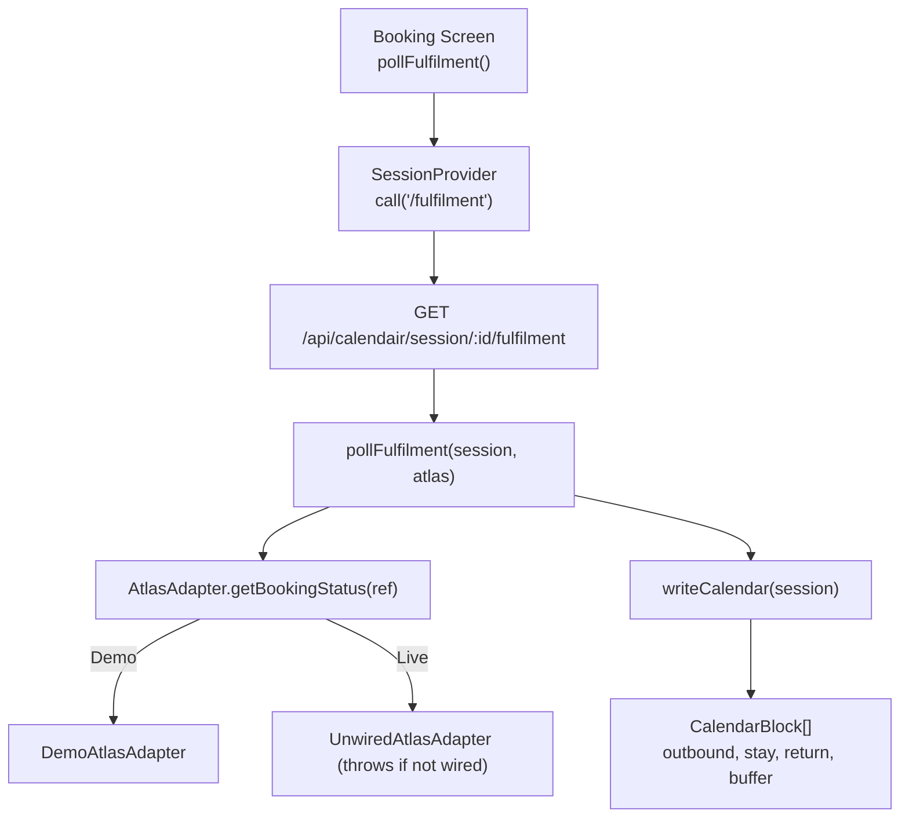
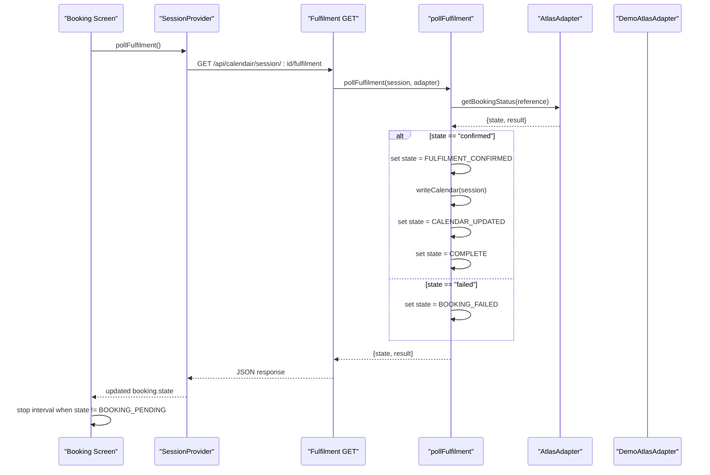
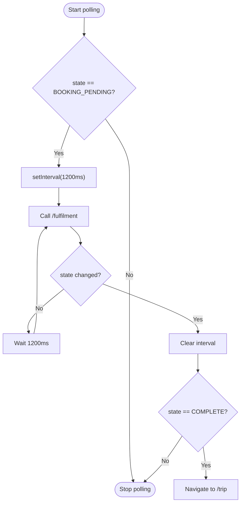
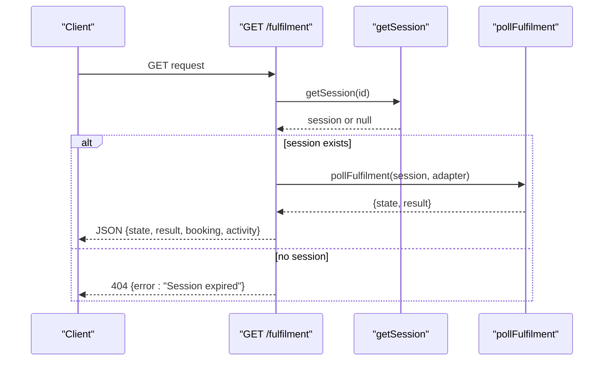
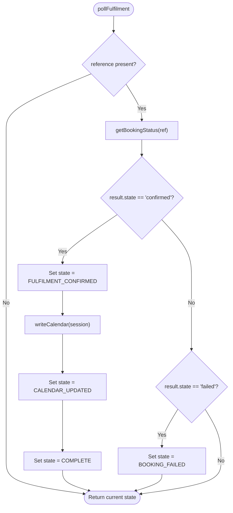
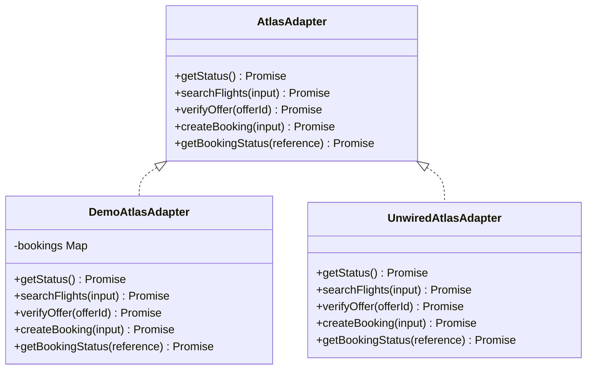
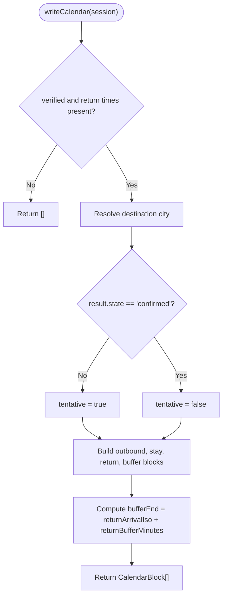
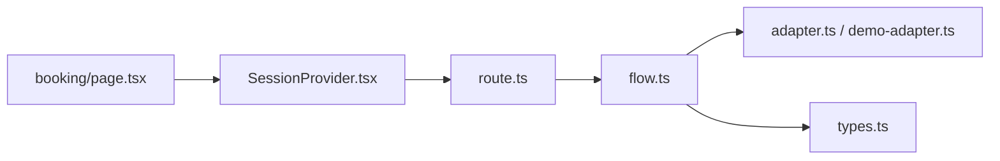

# Fulfilment Polling & Confirmation

<cite>
**Referenced Files in This Document**
- [route.ts](file://src/app/api/calendair/session/[id]/fulfilment/route.ts)
- [flow.ts](file://src/lib/calendair/flow.ts)
- [SessionProvider.tsx](file://src/components/calendair/SessionProvider.tsx)
- [booking/page.tsx](file://src/app/(calendair)/booking/page.tsx)
- [adapter.ts](file://src/lib/atlas/adapter.ts)
- [demo-adapter.ts](file://src/lib/atlas/demo-adapter.ts)
- [types.ts](file://src/lib/calendair/types.ts)
</cite>

## Table of Contents
1. [Introduction](#introduction)
2. [Project Structure](#project-structure)
3. [Core Components](#core-components)
4. [Architecture Overview](#architecture-overview)
5. [Detailed Component Analysis](#detailed-component-analysis)
6. [Dependency Analysis](#dependency-analysis)
7. [Performance Considerations](#performance-considerations)
8. [Troubleshooting Guide](#troubleshooting-guide)
9. [Conclusion](#conclusion)

## Introduction
This document explains the fulfilment polling mechanism that monitors a booking until the provider confirms it, and the subsequent calendar write-back that creates tentative and confirmed blocks with buffer management and timezone-aware timing. It covers:
- How getBookingStatus is called repeatedly until the provider reports its own confirmed state
- The state transitions from BOOKING_PENDING to FULFILMENT_CONFIRMED and then to COMPLETE
- When and how the calendar write-back is triggered
- The writeCalendar function’s block generation, buffer logic, and timezone handling
- Examples of polling intervals, status updates, and calendar block outputs

## Project Structure
The fulfilment flow spans client UI, server API, core flow logic, and provider adapters:
- Client triggers periodic polling when a booking is pending
- A Next.js API route delegates to the core flow
- Core flow calls the provider adapter to check status and writes calendar blocks on confirmation
- Adapters simulate or implement provider behaviour for status checks

**Diagram sources**
- [booking/page.tsx:49-61](file://src/app/(calendair)/booking/page.tsx#L49-L61)
- [SessionProvider.tsx:255-258](file://src/components/calendair/SessionProvider.tsx#L255-L258)
- [route.ts:8-20](file://src/app/api/calendair/session/[id]/fulfilment/route.ts#L8-L20)
- [flow.ts:251-280](file://src/lib/calendair/flow.ts#L251-L280)
- [adapter.ts:23-29](file://src/lib/atlas/adapter.ts#L23-L29)
- [demo-adapter.ts:91-113](file://src/lib/atlas/demo-adapter.ts#L91-L113)

**Section sources**
- [booking/page.tsx:49-61](file://src/app/(calendair)/booking/page.tsx#L49-L61)
- [SessionProvider.tsx:255-258](file://src/components/calendair/SessionProvider.tsx#L255-L258)
- [route.ts:8-20](file://src/app/api/calendair/session/[id]/fulfilment/route.ts#L8-L20)
- [flow.ts:251-280](file://src/lib/calendair/flow.ts#L251-L280)
- [adapter.ts:23-29](file://src/lib/atlas/adapter.ts#L23-L29)
- [demo-adapter.ts:91-113](file://src/lib/atlas/demo-adapter.ts#L91-L113)

## Core Components
- Booking screen polling: starts an interval when the session enters BOOKING_PENDING and stops when the provider returns a non-pending state
- Session provider: exposes pollFulfilment which calls the server endpoint and updates session state
- Fulfilment API route: validates session, invokes pollFulfilment, and returns updated state and activity
- Core flow: polls provider via getBookingStatus, transitions states, writes calendar blocks on confirmation
- Provider adapters: demo adapter simulates delayed confirmation; unwired adapter throws in live mode unless implemented

Key responsibilities:
- Avoid assuming success from HTTP responses; only trust provider-reported confirmed state
- Write calendar blocks only after confirmed fulfilment
- Maintain timezone-safe block times using ISO timestamps per airport local time

**Section sources**
- [booking/page.tsx:49-61](file://src/app/(calendair)/booking/page.tsx#L49-L61)
- [SessionProvider.tsx:255-258](file://src/components/calendair/SessionProvider.tsx#L255-L258)
- [route.ts:8-20](file://src/app/api/calendair/session/[id]/fulfilment/route.ts#L8-L20)
- [flow.ts:251-280](file://src/lib/calendair/flow.ts#L251-L280)
- [adapter.ts:23-29](file://src/lib/atlas/adapter.ts#L23-L29)
- [demo-adapter.ts:91-113](file://src/lib/atlas/demo-adapter.ts#L91-L113)

## Architecture Overview
The fulfilment polling architecture ensures reliability by deferring calendar updates until the provider explicitly confirms ticketing.

**Diagram sources**
- [booking/page.tsx:49-61](file://src/app/(calendair)/booking/page.tsx#L49-L61)
- [SessionProvider.tsx:255-258](file://src/components/calendair/SessionProvider.tsx#L255-L258)
- [route.ts:8-20](file://src/app/api/calendair/session/[id]/fulfilment/route.ts#L8-L20)
- [flow.ts:251-280](file://src/lib/calendair/flow.ts#L251-L280)
- [demo-adapter.ts:91-113](file://src/lib/atlas/demo-adapter.ts#L91-L113)

## Detailed Component Analysis

### Fulfilment Polling Mechanism
- Trigger: When the booking state becomes BOOKING_PENDING or BOOKING_CREATING, the UI starts polling
- Interval: 1200 ms between requests
- Stop condition: Polling stops when the returned state is no longer BOOKING_PENDING
- Outcome: If COMPLETE, the user is redirected to the trip page

**Diagram sources**
- [booking/page.tsx:49-61](file://src/app/(calendair)/booking/page.tsx#L49-L61)

**Section sources**
- [booking/page.tsx:49-61](file://src/app/(calendair)/booking/page.tsx#L49-L61)

### Server-Side Fulfilment Handler
- Validates session existence
- Invokes pollFulfilment with the current session and adapter
- Returns updated state, result, booking, and activity

**Diagram sources**
- [route.ts:8-20](file://src/app/api/calendair/session/[id]/fulfilment/route.ts#L8-L20)

**Section sources**
- [route.ts:8-20](file://src/app/api/calendair/session/[id]/fulfilment/route.ts#L8-L20)

### Core State Transitions and Calendar Write-Back
- pollFulfilment calls getBookingStatus with the booking reference
- On confirmed state:
  - Transition to FULFILMENT_CONFIRMED
  - Generate calendar blocks via writeCalendar
  - Transition to CALENDAR_UPDATED
  - Transition to COMPLETE
- On failed state:
  - Transition to BOOKING_FAILED

**Diagram sources**
- [flow.ts:251-280](file://src/lib/calendair/flow.ts#L251-L280)

**Section sources**
- [flow.ts:251-280](file://src/lib/calendair/flow.ts#L251-L280)

### Provider Adapter Behavior
- Demo adapter:
  - createBooking returns a pending result with a generated reference
  - getBookingStatus simulates delayed confirmation based on elapsed time or scenario
  - In pending scenario, always returns awaiting confirmation
  - Otherwise, returns confirmed after a short delay
- Unwired adapter:
  - Throws errors for all operations in live mode unless properly wired

**Diagram sources**
- [adapter.ts:23-79](file://src/lib/atlas/adapter.ts#L23-L79)
- [demo-adapter.ts:28-115](file://src/lib/atlas/demo-adapter.ts#L28-L115)

**Section sources**
- [adapter.ts:23-79](file://src/lib/atlas/adapter.ts#L23-L79)
- [demo-adapter.ts:28-115](file://src/lib/atlas/demo-adapter.ts#L28-L115)

### Calendar Block Generation and Buffer Management
- writeCalendar generates four blocks:
  - Outbound flight block
  - Destination stay block
  - Return flight block
  - Recovery buffer block after return arrival
- Tentative flag:
  - True when result state is not confirmed
  - False once confirmed
- Timezone handling:
  - Each block’s start/end times are read in the local time of the relevant airport to avoid red-eye anomalies
- Buffer calculation:
  - Uses returnBufferMinutes from traveller taste to compute buffer end time

**Diagram sources**
- [flow.ts:288-343](file://src/lib/calendair/flow.ts#L288-L343)

**Section sources**
- [flow.ts:288-343](file://src/lib/calendair/flow.ts#L288-L343)

### Example Scenarios and Outputs
- Polling interval: 1200 ms between requests while in BOOKING_PENDING
- Status updates:
  - Initial: BOOKING_PENDING
  - After confirmed: FULFILMENT_CONFIRMED → CALENDAR_UPDATED → COMPLETE
  - On failure: BOOKING_FAILED
- Calendar blocks:
  - Outbound: origin → destination
  - Stay: destination duration
  - Return: destination → origin
  - Buffer: recovery window at origin after return arrival
  - Tentative flag reflects whether the provider has confirmed

Examples:
- Demo adapter returns “Ticketing in progress” for first ~2600 ms, then “Sandbox ticket issued” with confirmed state
- Pending scenario keeps returning awaiting confirmation indefinitely
- UI displays “Asking the provider what actually happened…” during polling

**Section sources**
- [demo-adapter.ts:91-113](file://src/lib/atlas/demo-adapter.ts#L91-L113)
- [booking/page.tsx:121-146](file://src/app/(calendair)/booking/page.tsx#L121-L146)
- [flow.ts:251-280](file://src/lib/calendair/flow.ts#L251-L280)
- [flow.ts:288-343](file://src/lib/calendair/flow.ts#L288-L343)

## Dependency Analysis
- UI depends on SessionProvider to call the server endpoint
- SessionProvider depends on fetch to call /api/calendair/session/:id/fulfilment
- API route depends on getSession and pollFulfilment
- pollFulfilment depends on AtlasAdapter.getBookingStatus
- writeCalendar depends on verified offer details and traveller taste settings

**Diagram sources**
- [booking/page.tsx:49-61](file://src/app/(calendair)/booking/page.tsx#L49-L61)
- [SessionProvider.tsx:255-258](file://src/components/calendair/SessionProvider.tsx#L255-L258)
- [route.ts:8-20](file://src/app/api/calendair/session/[id]/fulfilment/route.ts#L8-L20)
- [flow.ts:251-280](file://src/lib/calendair/flow.ts#L251-L280)
- [adapter.ts:23-29](file://src/lib/atlas/adapter.ts#L23-L29)
- [demo-adapter.ts:91-113](file://src/lib/atlas/demo-adapter.ts#L91-L113)
- [types.ts:195-274](file://src/lib/calendair/types.ts#L195-L274)

**Section sources**
- [booking/page.tsx:49-61](file://src/app/(calendair)/booking/page.tsx#L49-L61)
- [SessionProvider.tsx:255-258](file://src/components/calendair/SessionProvider.tsx#L255-L258)
- [route.ts:8-20](file://src/app/api/calendair/session/[id]/fulfilment/route.ts#L8-L20)
- [flow.ts:251-280](file://src/lib/calendair/flow.ts#L251-L280)
- [adapter.ts:23-29](file://src/lib/atlas/adapter.ts#L23-L29)
- [demo-adapter.ts:91-113](file://src/lib/atlas/demo-adapter.ts#L91-L113)
- [types.ts:195-274](file://src/lib/calendair/types.ts#L195-L274)

## Performance Considerations
- Polling interval of 1200 ms balances responsiveness and server load
- Short delays in demo adapter prevent immediate confirmation, mimicking real-world ticketing latency
- Calendar block generation is lightweight and deterministic based on verified offer data
- Avoid redundant polling by stopping immediately when state changes

[No sources needed since this section provides general guidance]

## Troubleshooting Guide
Common issues and resolutions:
- Session expired: API returns 404 when session is missing; ensure valid sessionId is used
- No reference: pollFulfilment returns early if no booking reference; verify booking was created successfully
- Adapter not wired: UnwiredAtlasAdapter throws for getBookingStatus in live mode; implement proper adapter or use demo mode
- Pending scenario: Demo adapter never confirms; switch scenario or wait for timeout behavior

**Section sources**
- [route.ts:8-20](file://src/app/api/calendair/session/[id]/fulfilment/route.ts#L8-L20)
- [flow.ts:251-280](file://src/lib/calendair/flow.ts#L251-L280)
- [adapter.ts:50-79](file://src/lib/atlas/adapter.ts#L50-L79)
- [demo-adapter.ts:91-113](file://src/lib/atlas/demo-adapter.ts#L91-L113)

## Conclusion
The fulfilment polling mechanism ensures reliable booking confirmation by repeatedly querying the provider until it reports its own confirmed state. Only upon confirmation does the system write calendar blocks, including outbound, stay, return, and recovery buffer segments, with timezone-aware timing and appropriate tentative flags. This design prevents premature calendar updates and maintains consistency between provider status and user-facing state.

[No sources needed since this section summarizes without analyzing specific files]