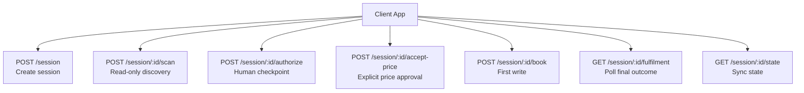
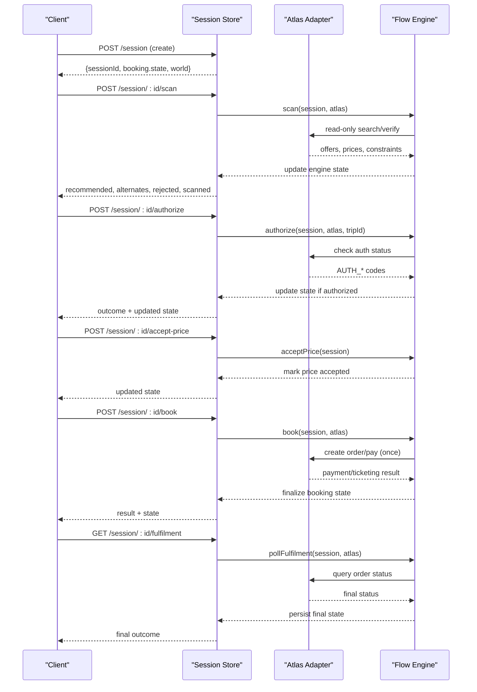
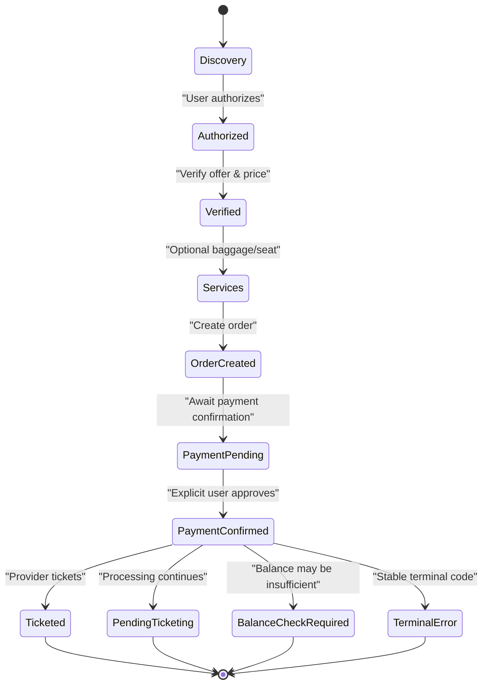
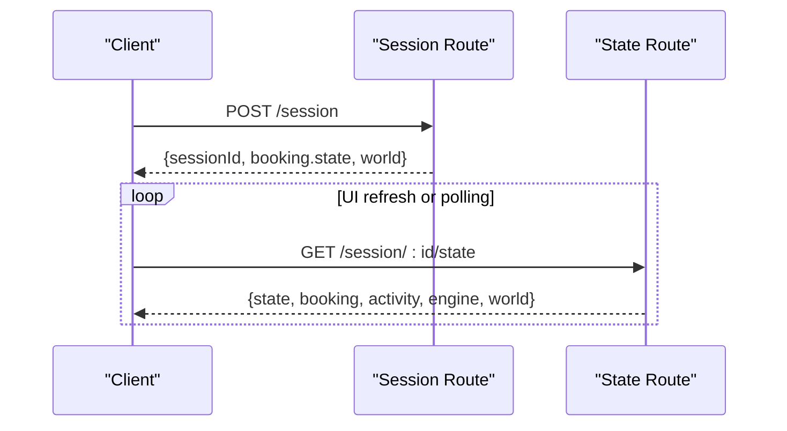
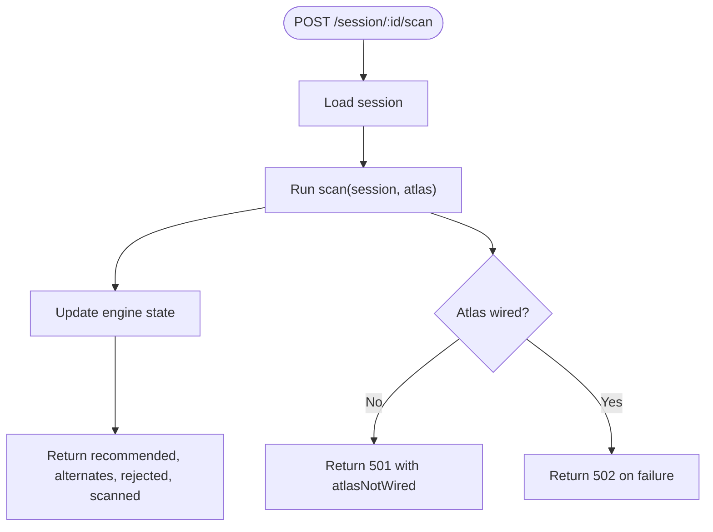
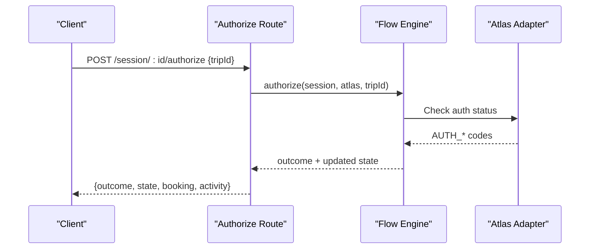
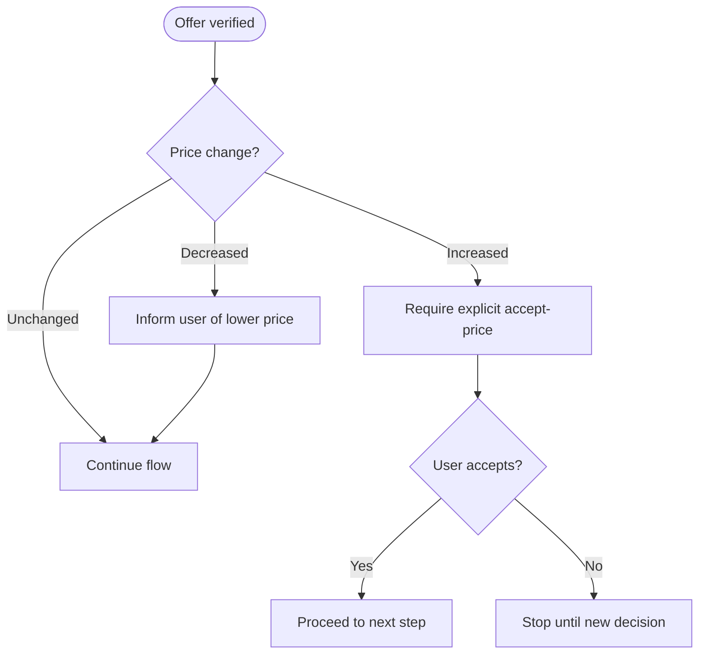
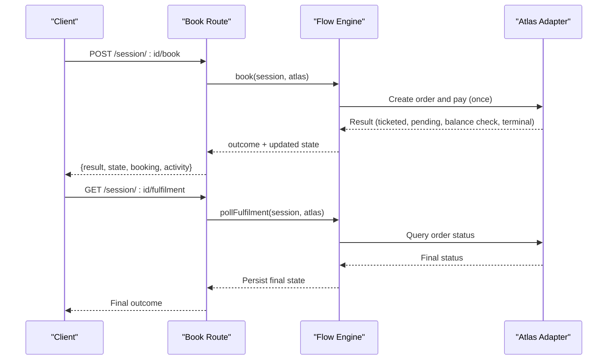
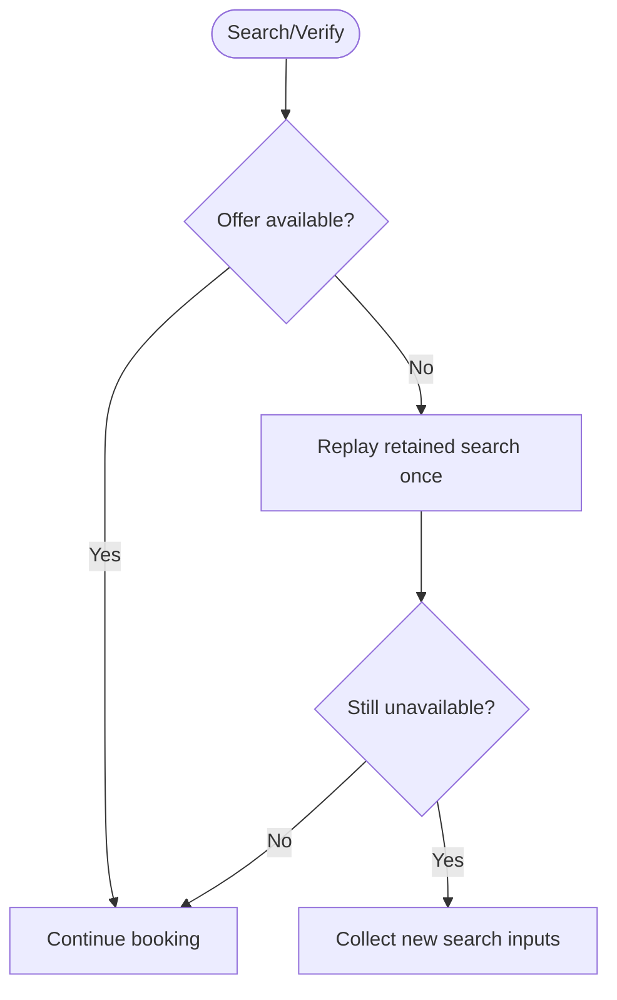
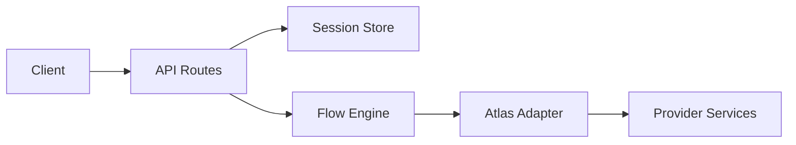

# Booking Workflow

<cite>
**Referenced Files in This Document**
- [booking-workflow.md](file://.agents/skills/atlas-flight-booking/references/booking-workflow.md)
- [error-handling.md](file://.agents/skills/atlas-flight-booking/references/error-handling.md)
- [route.ts](file://src/app/api/calendair/session/route.ts)
- [state route.ts](file://src/app/api/calendair/session/[id]/state/route.ts)
- [book route.ts](file://src/app/api/calendair/session/[id]/book/route.ts)
- [authorize route.ts](file://src/app/api/calendair/session/[id]/authorize/route.ts)
- [scan route.ts](file://src/app/api/calendair/session/[id]/scan/route.ts)
- [fulfilment route.ts](file://src/app/api/calendair/session/[id]/fulfilment/route.ts)
- [accept-price route.ts](file://src/app/api/calendair/session/[id]/accept-price/route.ts)
- [explain route.ts](file://src/app/api/calendair/session/[id]/explain/route.ts)
</cite>

## Table of Contents
1. Introduction
2. Project Structure
3. Core Components
4. Architecture Overview
5. Detailed Component Analysis
6. Dependency Analysis
7. Performance Considerations
8. Troubleshooting Guide
9. Conclusion

## Introduction
This document describes CALENDAIR’s booking workflow state machine and session management for the flight booking skill. It covers the full lifecycle from opportunity discovery through confirmation, including all state transitions, human authorization checkpoints, reverification before writes, handling of price changes and sold-out scenarios, and safety guarantees such as bounded replanning, explicit human approvals, and calendar write-back only after confirmed bookings.

## Project Structure
The booking workflow is exposed via a small set of Next.js API routes under `/api/calendair/session`. A session is created once, then read-only scanning, authorizing, accepting price increases, booking, and fulfilment polling are performed against that session. The server persists session state so the client can poll or refresh without losing progress.

**Diagram sources**
- [route.ts:24-60](file://src/app/api/calendair/session/route.ts#L24-L60)
- [scan route.ts:9-33](file://src/app/api/calendair/session/[id]/scan/route.ts#L9-L33)
- [authorize route.ts:14-24](file://src/app/api/calendair/session/[id]/authorize/route.ts#L14-L24)
- [accept-price route.ts:8-15](file://src/app/api/calendair/session/[id]/accept-price/route.ts#L8-L15)
- [book route.ts:9-23](file://src/app/api/calendair/session/[id]/book/route.ts#L9-L23)
- [fulfilment route.ts:9-20](file://src/app/api/calendair/session/[id]/fulfilment/route.ts#L9-L20)
- [state route.ts:6-34](file://src/app/api/calendair/session/[id]/state/route.ts#L6-L34)

**Section sources**
- [route.ts:24-60](file://src/app/api/calendair/session/route.ts#L24-L60)
- [scan route.ts:9-33](file://src/app/api/calendair/session/[id]/scan/route.ts#L9-L33)
- [authorize route.ts:14-24](file://src/app/api/calendair/session/[id]/authorize/route.ts#L14-L24)
- [accept-price route.ts:8-15](file://src/app/api/calendair/session/[id]/accept-price/route.ts#L8-L15)
- [book route.ts:9-23](file://src/app/api/calendair/session/[id]/book/route.ts#L9-L23)
- [fulfilment route.ts:9-20](file://src/app/api/calendair/session/[id]/fulfilment/route.ts#L9-L20)
- [state route.ts:6-34](file://src/app/api/calendair/session/[id]/state/route.ts#L6-L34)

## Core Components
- Session creation: Initializes scenario, world, profile, and Atlas adapter; returns initial booking state and world snapshot.
- Read-only scan: Discovers opportunities and updates engine state (recommended, alternates, rejected, scanned).
- Human authorization: Requires explicit user action to authorize access to provider services before proceeding.
- Price acceptance: Explicitly accepts price increases; never absorbs them silently.
- Booking: First and only write attempt against an approved total; enforces safety rules.
- Fulfilment polling: Confirms actual ticketing outcome using provider status.
- State sync: Exposes current session state for client synchronization and UI consistency.

**Section sources**
- [route.ts:24-60](file://src/app/api/calendair/session/route.ts#L24-L60)
- [scan route.ts:9-33](file://src/app/api/calendair/session/[id]/scan/route.ts#L9-L33)
- [authorize route.ts:14-24](file://src/app/api/calendair/session/[id]/authorize/route.ts#L14-L24)
- [accept-price route.ts:8-15](file://src/app/api/calendair/session/[id]/accept-price/route.ts#L8-L15)
- [book route.ts:9-23](file://src/app/api/calendair/session/[id]/book/route.ts#L9-L23)
- [fulfilment route.ts:9-20](file://src/app/api/calendair/session/[id]/fulfilment/route.ts#L9-L20)
- [state route.ts:6-34](file://src/app/api/calendair/session/[id]/state/route.ts#L6-L34)

## Architecture Overview
The system separates read-only discovery from side-effecting actions. All mutations go through explicit endpoints that enforce human checkpoints and reverification. The client maintains a single session ID and polls state to stay in sync with server-side state.

**Diagram sources**
- [route.ts:24-60](file://src/app/api/calendair/session/route.ts#L24-L60)
- [scan route.ts:9-33](file://src/app/api/calendair/session/[id]/scan/route.ts#L9-L33)
- [authorize route.ts:14-24](file://src/app/api/calendair/session/[id]/authorize/route.ts#L14-L24)
- [accept-price route.ts:8-15](file://src/app/api/calendair/session/[id]/accept-price/route.ts#L8-L15)
- [book route.ts:9-23](file://src/app/api/calendair/session/[id]/book/route.ts#L9-L23)
- [fulfilment route.ts:9-20](file://src/app/api/calendair/session/[id]/fulfilment/route.ts#L9-L20)

## Detailed Component Analysis

### Booking Lifecycle and State Machine
The booking lifecycle progresses through these phases:
- Opportunity discovery (read-only scan)
- Authorization checkpoint
- Offer verification and optional services
- Passenger input and order creation
- Payment confirmation (explicit human approval)
- Ticketing and fulfilment polling
- Finalization and calendar write-back only after confirmed bookings

Key safety rules enforced by the flow:
- Bounded replanning: Re-run search only when required (e.g., expired offers), never loop automatically.
- Explicit human approvals: Authorization and price increases require user action; earlier statements do not count as payment confirmation.
- Calendar write-back: Only after confirmed bookings (ticketed or pending ticketing with stable status).

**Diagram sources**
- [booking-workflow.md:1-63](file://.agents/skills/atlas-flight-booking/references/booking-workflow.md#L1-L63)
- [error-handling.md:1-74](file://.agents/skills/atlas-flight-booking/references/error-handling.md#L1-L74)

**Section sources**
- [booking-workflow.md:1-63](file://.agents/skills/atlas-flight-booking/references/booking-workflow.md#L1-L63)
- [error-handling.md:1-74](file://.agents/skills/atlas-flight-booking/references/error-handling.md#L1-L74)

### Session Management and State Sync
- Session creation initializes scenario, world, and profile; returns initial booking state and world snapshot to the client.
- State endpoint exposes current session state, engine data, and world snapshot for client synchronization.
- All mutation endpoints return updated state and activity logs to keep the client consistent.

**Diagram sources**
- [route.ts:24-60](file://src/app/api/calendair/session/route.ts#L24-L60)
- [state route.ts:6-34](file://src/app/api/calendair/session/[id]/state/route.ts#L6-L34)

**Section sources**
- [route.ts:24-60](file://src/app/api/calendair/session/route.ts#L24-L60)
- [state route.ts:6-34](file://src/app/api/calendair/session/[id]/state/route.ts#L6-L34)

### Read-Only Discovery (Scan)
- The scan endpoint is explicitly read-only and allowed to run independently.
- It updates engine state with recommended offers, alternates, rejections, and scanned items.
- Errors distinguish between “not wired” and other failures.

**Diagram sources**
- [scan route.ts:9-33](file://src/app/api/calendair/session/[id]/scan/route.ts#L9-L33)

**Section sources**
- [scan route.ts:9-33](file://src/app/api/calendair/session/[id]/scan/route.ts#L9-L33)

### Human Authorization Checkpoint
- Authorization is a required checkpoint before proceeding with any side effects.
- The endpoint performs a fresh read of authorization status and updates session state accordingly.
- Clients must wait for explicit completion before continuing.

**Diagram sources**
- [authorize route.ts:14-24](file://src/app/api/calendair/session/[id]/authorize/route.ts#L14-L24)

**Section sources**
- [authorize route.ts:14-24](file://src/app/api/calendair/session/[id]/authorize/route.ts#L14-L24)

### Price Change Handling and Explicit Approval
- If verified price increases, the client must call accept-price to proceed; increases are never absorbed silently.
- Decreases continue without additional approval; unchanged proceeds normally.
- The accept-price endpoint marks the price as accepted and returns updated state.

**Diagram sources**
- [booking-workflow.md:1-63](file://.agents/skills/atlas-flight-booking/references/booking-workflow.md#L1-L63)
- [accept-price route.ts:8-15](file://src/app/api/calendair/session/[id]/accept-price/route.ts#L8-L15)

**Section sources**
- [booking-workflow.md:1-63](file://.agents/skills/atlas-flight-booking/references/booking-workflow.md#L1-L63)
- [accept-price route.ts:8-15](file://src/app/api/calendair/session/[id]/accept-price/route.ts#L8-L15)

### Booking Write and Safety Guarantees
- The first write occurs only after the traveller approved the total.
- The flow enforces one-time order creation and payment attempts; no automatic retries.
- After payment, fulfilment polling confirms the actual outcome.

**Diagram sources**
- [book route.ts:9-23](file://src/app/api/calendair/session/[id]/book/route.ts#L9-L23)
- [fulfilment route.ts:9-20](file://src/app/api/calendair/session/[id]/fulfilment/route.ts#L9-L20)

**Section sources**
- [book route.ts:9-23](file://src/app/api/calendair/session/[id]/book/route.ts#L9-L23)
- [fulfilment route.ts:9-20](file://src/app/api/calendair/session/[id]/fulfilment/route.ts#L9-L20)

### Sold-Out and Expired Offers
- When offers expire or become unavailable, the flow replays retained search once; if still unavailable, it collects new inputs.
- Old IDs are never reused; the client must start a fresh search when necessary.

**Diagram sources**
- [error-handling.md:19-31](file://.agents/skills/atlas-flight-booking/references/error-handling.md#L19-L31)

**Section sources**
- [error-handling.md:19-31](file://.agents/skills/atlas-flight-booking/references/error-handling.md#L19-L31)

### Explanation Endpoint (Non-Booking Path)
- Provides language-only explanations for why a trip matches preferences.
- Does not affect pricing, constraints, or state; safe to call off the critical path.

**Section sources**
- [explain route.ts:12-77](file://src/app/api/calendair/session/[id]/explain/route.ts#L12-L77)

## Dependency Analysis
- API routes depend on:
  - Session store for persistence and state retrieval
  - Flow engine for business logic and state transitions
  - Atlas adapter for provider interactions (search, verify, order, payment, status)
- Routes enforce separation of concerns:
  - Read-only operations (scan, explain)
  - Human checkpoints (authorize, accept-price)
  - Side-effecting operations (book, fulfilment polling)

[No diagram sources needed since this diagram shows conceptual dependencies, not specific file mappings]

## Performance Considerations
- Keep client polling lightweight; prefer state diffs returned by the state endpoint.
- Avoid redundant reads; batch UI updates after receiving updated state.
- Use read-only scan for discovery; defer expensive side effects until explicit user approval.
- Limit retry attempts per error policy; rely on bounded replanning and explicit user actions.

[No sources needed since this section provides general guidance]

## Troubleshooting Guide
Common error scenarios and expected behaviors:
- Authorization required/expired: Initiate login flow; present descriptive link; stop polling until user completes authorization.
- Subscription required: Explain limitations; present activation steps; wait for user completion.
- Search limits reached: Report limit; do not retry automatically.
- Offer expired or booking expired: Replay retained search once; otherwise collect new inputs.
- Price confirmation required: Present totals and wait for explicit confirmation.
- Optional services unavailable: Skip service and continue main flow.
- Order creation unknown or duplicate suspected: Do not create again; show order link if provided; report uncertainty.
- Payment status unknown or processing: Query order status; never pay again.
- Service temporarily unavailable: Retry identical read-only command at most once when retryable; never repeat order creation or payment.

**Section sources**
- [error-handling.md:1-74](file://.agents/skills/atlas-flight-booking/references/error-handling.md#L1-L74)

## Conclusion
CALENDAIR’s booking workflow enforces strong safety guarantees: read-only discovery, explicit human checkpoints for authorization and price increases, bounded replanning, and calendar write-back only after confirmed bookings. The session-based architecture ensures reliable client-server synchronization and resilient error handling across the entire booking lifecycle.