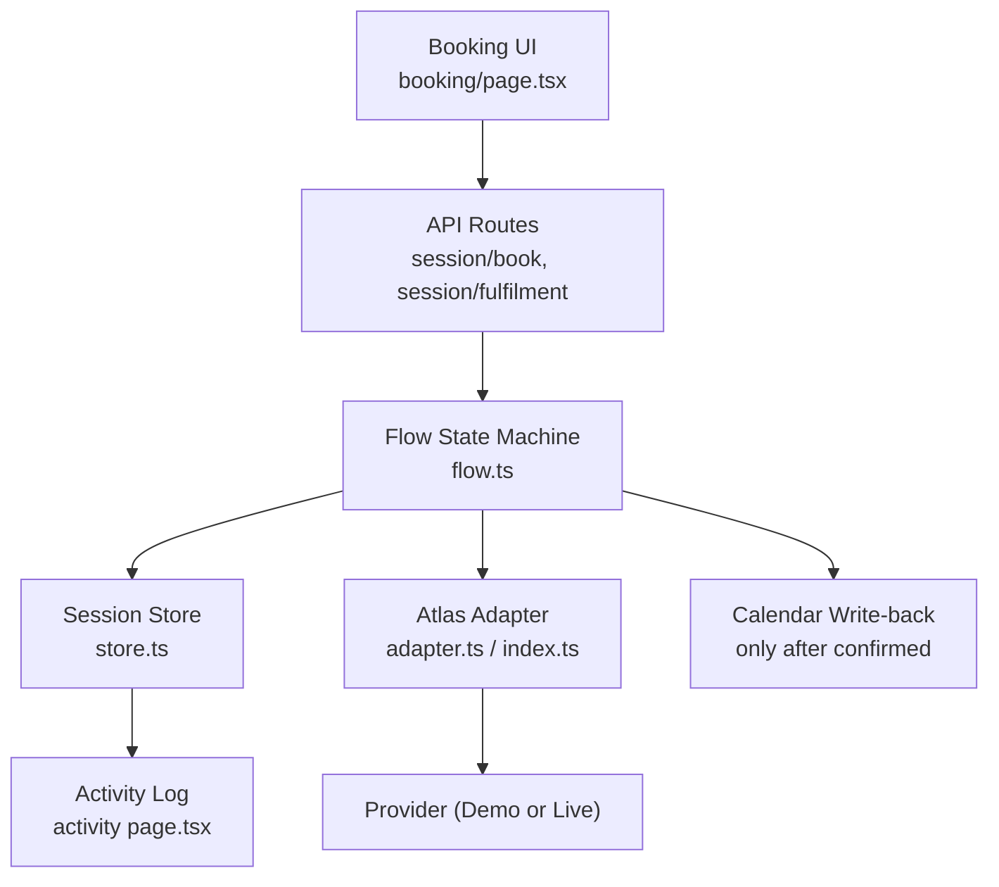
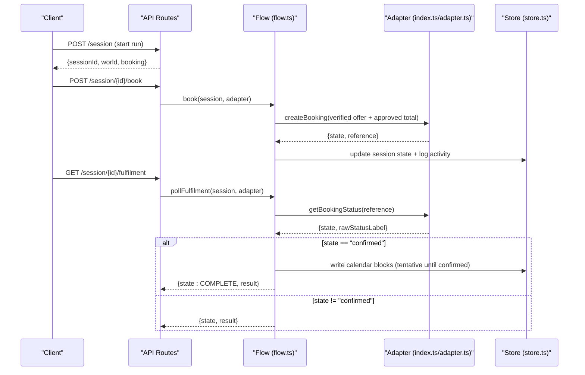
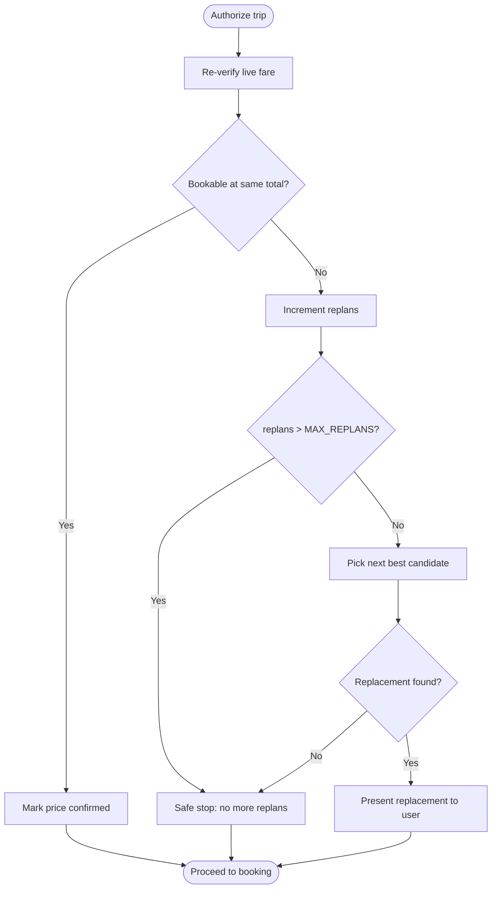
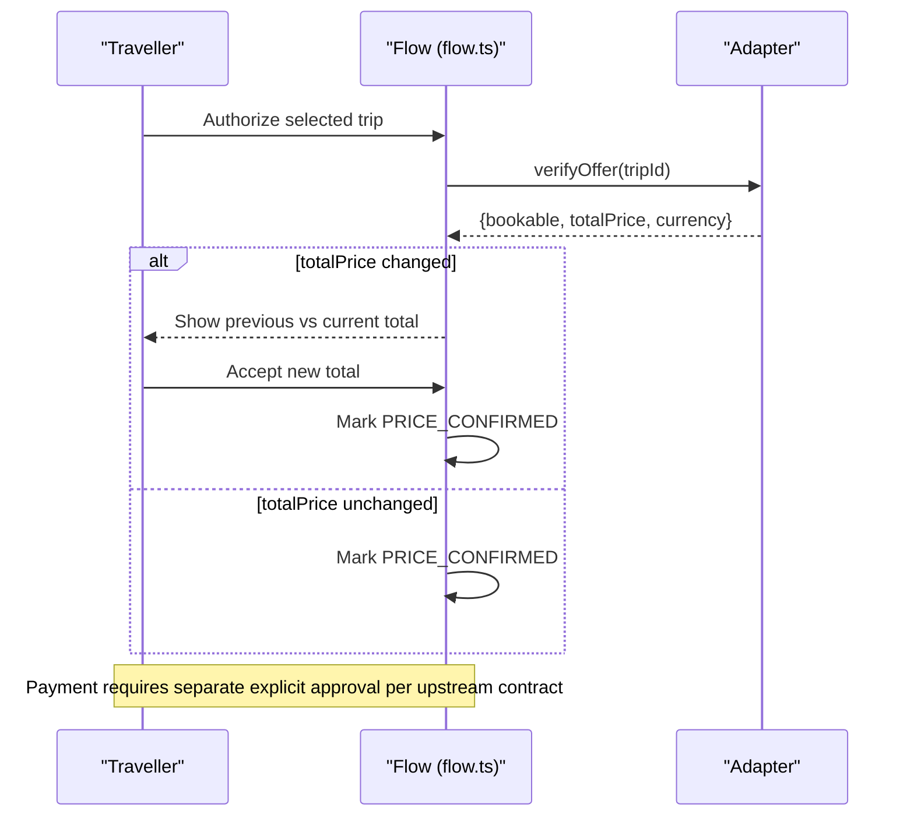
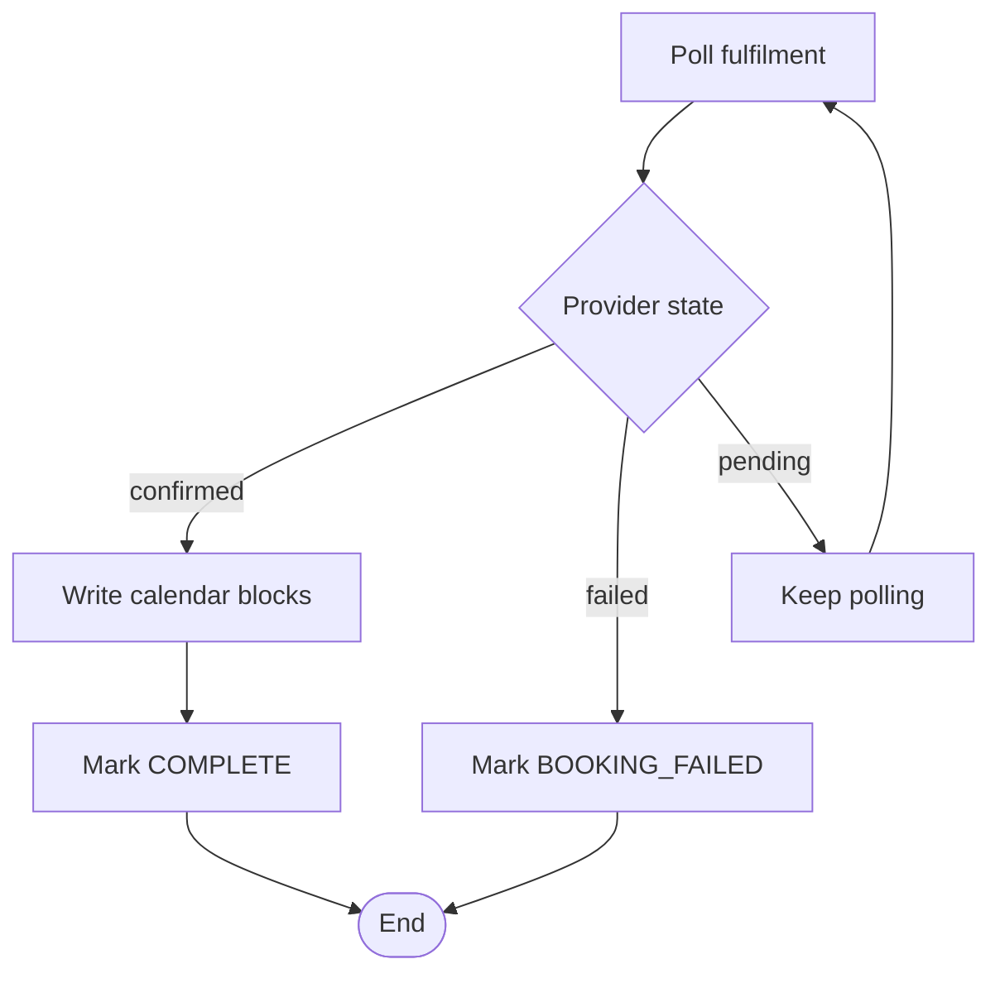
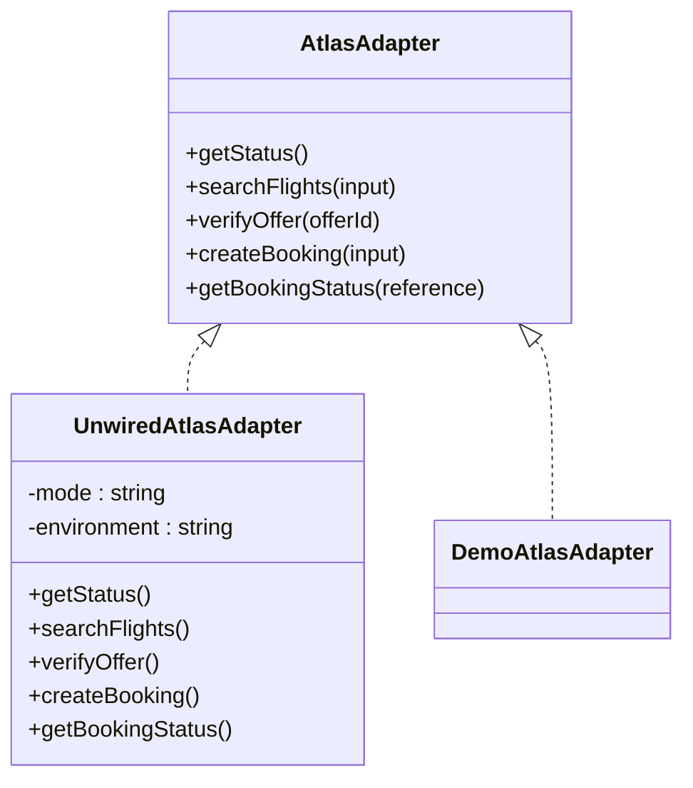
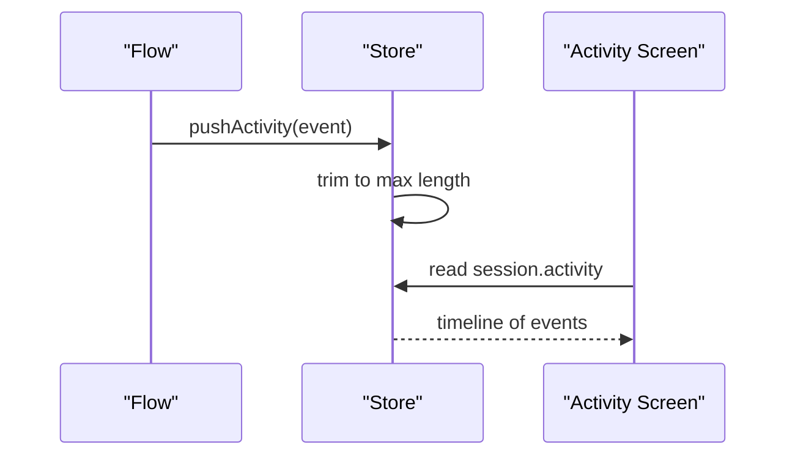
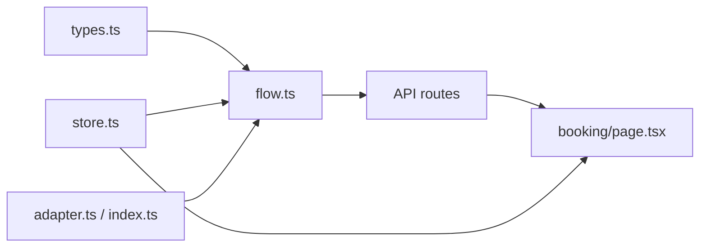

# Error Handling & Safety Guarantees

<cite>
**Referenced Files in This Document**
- [flow.ts](file://src/lib/calendair/flow.ts)
- [store.ts](file://src/lib/calendair/store.ts)
- [types.ts](file://src/lib/calendair/types.ts)
- [adapter.ts](file://src/lib/atlas/adapter.ts)
- [index.ts](file://src/lib/atlas/index.ts)
- [route.ts](file://src/app/api/calendair/session/route.ts)
- [book route.ts](file://src/app/api/calendair/session/[id]/book/route.ts)
- [fulfilment route.ts](file://src/app/api/calendair/session/[id]/fulfilment/route.ts)
- [booking page.tsx](file://src/app/(calendair)/booking/page.tsx)
- [activity page.tsx](file://src/app/(calendair)/activity/page.tsx)
- [error-handling.md](file://.agents/skills/atlas-flight-booking/references/error-handling.md)
- [booking-workflow.md](file://.agents/skills/atlas-flight-booking/references/booking-workflow.md)
</cite>

## Table of Contents
1. Introduction
2. Project Structure
3. Core Components
4. Architecture Overview
5. Detailed Component Analysis
6. Dependency Analysis
7. Performance Considerations
8. Troubleshooting Guide
9. Conclusion
10. Appendices

## Introduction
This document explains CALENDAIR’s error handling strategies and safety guarantees across the booking workflow. It focuses on bounded replanning, safe-stop conditions, explicit human approvals, calendar write-back only after confirmed bookings, provider failure degradation, error recovery patterns, fallback strategies, and monitoring via activity logging. The goal is to make these guarantees clear for both technical and non-technical readers.

## Project Structure
CALENDAIR implements a small, explicit state machine that orchestrates search, verification, booking, fulfilment polling, and calendar updates. Provider access is abstracted behind an adapter interface so live or demo providers can be swapped without changing the flow logic. User-facing screens render step progress and activity logs to keep the process transparent.

**Diagram sources**
- [flow.ts:22-45](file://src/lib/calendair/flow.ts#L22-L45)
- [flow.ts:218-280](file://src/lib/calendair/flow.ts#L218-L280)
- [store.ts:94-116](file://src/lib/calendair/store.ts#L94-L116)
- [adapter.ts:23-79](file://src/lib/atlas/adapter.ts#L23-L79)
- [index.ts:18-37](file://src/lib/atlas/index.ts#L18-L37)
- [booking page.tsx:226-269](file://src/app/(calendair)/booking/page.tsx#L226-L269)
- [activity page.tsx:98-120](file://src/app/(calendair)/activity/page.tsx#L98-L120)

**Section sources**
- [flow.ts:8-20](file://src/lib/calendair/flow.ts#L8-L20)
- [types.ts:197-215](file://src/lib/calendair/types.ts#L197-L215)
- [store.ts:7-13](file://src/lib/calendair/store.ts#L7-L13)

## Core Components
- Bounded replanning: A configurable limit controls how many times the system replans when a fare becomes unavailable.
- Safe-stop: The flow stops when hard constraints cannot be met or when further automation would be unsafe.
- Explicit approvals: Price changes require explicit traveller acceptance before proceeding; payment requires explicit approval per upstream contracts.
- Calendar write-back: Calendar blocks are written only after the provider confirms fulfilment; otherwise blocks remain tentative or are not written.
- Provider abstraction: All provider calls go through an adapter, enabling demo mode and live mode with consistent error handling.
- Activity logging: Every significant step is logged with source, title, detail, success flag, and duration for observability.

**Section sources**
- [flow.ts:20-45](file://src/lib/calendair/flow.ts#L20-L45)
- [flow.ts:94-190](file://src/lib/calendair/flow.ts#L94-L190)
- [flow.ts:218-280](file://src/lib/calendair/flow.ts#L218-L280)
- [store.ts:94-116](file://src/lib/calendair/store.ts#L94-L116)
- [adapter.ts:31-79](file://src/lib/atlas/adapter.ts#L31-L79)
- [types.ts:248-261](file://src/lib/calendair/types.ts#L248-L261)

## Architecture Overview
The booking flow enforces safety by separating spontaneous agent actions from irreversible writes. Search runs autonomously; every subsequent step waits for human confirmation. Before any write, the system re-reads the current world state. Calendar updates occur only after the provider reports a confirmed outcome.

**Diagram sources**
- [route.ts:24-60](file://src/app/api/calendair/session/route.ts#L24-L60)
- [book route.ts:8-23](file://src/app/api/calendair/session/[id]/book/route.ts#L8-L23)
- [fulfilment route.ts:8-20](file://src/app/api/calendair/session/[id]/fulfilment/route.ts#L8-L20)
- [flow.ts:218-280](file://src/lib/calendair/flow.ts#L218-L280)
- [index.ts:18-37](file://src/lib/atlas/index.ts#L18-L37)
- [adapter.ts:23-79](file://src/lib/atlas/adapter.ts#L23-L79)
- [store.ts:94-116](file://src/lib/calendair/store.ts#L94-L116)

## Detailed Component Analysis

### Bounded Replanning and Safe Stop
When a verified fare becomes unavailable, the flow replans within a bounded budget. It selects the next best candidate that still clears all hard constraints and surfaces it to the user. If no replacement exists or the replan limit is reached, the flow enters a safe stop and keeps the window open for future opportunities.

**Diagram sources**
- [flow.ts:94-190](file://src/lib/calendair/flow.ts#L94-L190)
- [types.ts:197-215](file://src/lib/calendair/types.ts#L197-L215)

**Section sources**
- [flow.ts:20-45](file://src/lib/calendair/flow.ts#L20-L45)
- [flow.ts:147-190](file://src/lib/calendair/flow.ts#L147-L190)
- [booking page.tsx:308-334](file://src/app/(calendair)/booking/page.tsx#L308-L334)
- [activity page.tsx:276-282](file://src/app/(calendair)/activity/page.tsx#L276-L282)

### Explicit Human Approval Requirements
- Price change: If the live fare differs from the displayed total, the flow pauses and requires explicit traveller acceptance before continuing.
- Payment: Upstream contracts require explicit approval before paying; earlier statements such as “book it” do not count as payment confirmation.
- Replacement selection: Substituting one trip for another is treated as a new decision requiring user consent.

**Diagram sources**
- [flow.ts:65-84](file://src/lib/calendair/flow.ts#L65-L84)
- [flow.ts:117-145](file://src/lib/calendair/flow.ts#L117-L145)
- [flow.ts:192-210](file://src/lib/calendair/flow.ts#L192-L210)
- [booking-workflow.md:31-47](file://.agents/skills/atlas-flight-booking/references/booking-workflow.md#L31-L47)

**Section sources**
- [flow.ts:65-84](file://src/lib/calendair/flow.ts#L65-L84)
- [flow.ts:117-145](file://src/lib/calendair/flow.ts#L117-L145)
- [flow.ts:192-210](file://src/lib/calendair/flow.ts#L192-L210)
- [booking-workflow.md:31-47](file://.agents/skills/atlas-flight-booking/references/booking-workflow.md#L31-L47)

### Calendar Write-Back Only After Confirmed Bookings
Calendar blocks are generated only after the provider reports a confirmed state. Until then, blocks remain tentative or are not written. This prevents misleading calendar entries when ticketing is still pending.

**Diagram sources**
- [flow.ts:250-280](file://src/lib/calendair/flow.ts#L250-L280)
- [flow.ts:282-343](file://src/lib/calendair/flow.ts#L282-L343)

**Section sources**
- [flow.ts:250-280](file://src/lib/calendair/flow.ts#L250-L280)
- [flow.ts:282-343](file://src/lib/calendair/flow.ts#L282-L343)

### Provider Failure Handling and Graceful Degradation
- Unwired adapter: When integration mode is set but no real adapter is wired, calls fail loudly rather than silently falling back to demo data.
- Demo mode: Deterministic inventory is used when configured; the UI always shows which adapter and environment are active.
- Session lifecycle: Sessions expire after a TTL; expired sessions return a clear error.

**Diagram sources**
- [adapter.ts:23-79](file://src/lib/atlas/adapter.ts#L23-L79)
- [index.ts:18-37](file://src/lib/atlas/index.ts#L18-L37)

**Section sources**
- [adapter.ts:31-79](file://src/lib/atlas/adapter.ts#L31-L79)
- [index.ts:18-37](file://src/lib/atlas/index.ts#L18-L37)
- [route.ts:24-60](file://src/app/api/calendair/session/route.ts#L24-L60)
- [booking page.tsx:79-100](file://src/app/(calendair)/demo/page.tsx#L79-L100)

### Monitoring Through Activity Logging
Every meaningful step is recorded with source, title, detail, success flag, and optional duration. The activity log is bounded to prevent unbounded growth and is visible on the activity screen.

**Diagram sources**
- [store.ts:94-116](file://src/lib/calendair/store.ts#L94-L116)
- [activity page.tsx:98-120](file://src/app/(calendair)/activity/page.tsx#L98-L120)

**Section sources**
- [store.ts:94-116](file://src/lib/calendair/store.ts#L94-L116)
- [activity page.tsx:98-120](file://src/app/(calendair)/activity/page.tsx#L98-L120)

## Dependency Analysis
- Flow depends on the adapter for provider interactions and on the store for session state and activity logging.
- API routes delegate to flow functions and return normalized responses, surfacing errors like session expiration or invalid preconditions.
- Types define the closed set of booking states and domain contracts, ensuring consistent transitions.

**Diagram sources**
- [types.ts:197-215](file://src/lib/calendair/types.ts#L197-L215)
- [flow.ts:218-280](file://src/lib/calendair/flow.ts#L218-L280)
- [store.ts:94-116](file://src/lib/calendair/store.ts#L94-L116)
- [adapter.ts:23-79](file://src/lib/atlas/adapter.ts#L23-L79)
- [index.ts:18-37](file://src/lib/atlas/index.ts#L18-L37)
- [book route.ts:8-23](file://src/app/api/calendair/session/[id]/book/route.ts#L8-L23)
- [fulfilment route.ts:8-20](file://src/app/api/calendair/session/[id]/fulfilment/route.ts#L8-L20)

**Section sources**
- [types.ts:197-215](file://src/lib/calendair/types.ts#L197-L215)
- [flow.ts:218-280](file://src/lib/calendair/flow.ts#L218-L280)
- [store.ts:94-116](file://src/lib/calendair/store.ts#L94-L116)
- [adapter.ts:23-79](file://src/lib/atlas/adapter.ts#L23-L79)
- [index.ts:18-37](file://src/lib/atlas/index.ts#L18-L37)
- [book route.ts:8-23](file://src/app/api/calendair/session/[id]/book/route.ts#L8-L23)
- [fulfilment route.ts:8-20](file://src/app/api/calendair/session/[id]/fulfilment/route.ts#L8-L20)

## Performance Considerations
- Reverification is performed once per authorization to minimize provider load while ensuring freshness.
- Activity logs are bounded to avoid memory growth during long sessions.
- Adapter instances are cached per configuration to reuse connections and maintain booking references across requests.

[No sources needed since this section provides general guidance]

## Troubleshooting Guide
Common error scenarios and their handling:

- Fare unavailable during verification:
  - Behavior: Increment replans, pick next best candidate within constraints, present replacement to user.
  - If no replacement or replan limit reached: Enter safe stop and keep the window open.
  - Evidence: Activity log entry for replanning and safe stop.

- Price increased during verification:
  - Behavior: Pause and require explicit traveller acceptance before proceeding.
  - Evidence: Activity log entry for price change and acceptance.

- Reference-only offers:
  - Behavior: Cannot be verified or booked; stop with safe stop reason.
  - Evidence: Activity log entry indicating reference-only limitation.

- Booking creation returns pending:
  - Behavior: Do not mark complete; poll fulfilment until provider reports confirmed or failed.
  - Evidence: Activity log entry for booking requested/pending; later fulfilled or failed.

- Fulfilment not yet confirmed:
  - Behavior: Keep polling; do not write calendar until confirmed.
  - Evidence: Activity log entry for fulfilment status checks.

- Adapter not wired:
  - Behavior: Calls throw a specific error instead of silently using demo data.
  - Evidence: UI shows adapter label and environment; error surfaced to client.

- Session expired:
  - Behavior: API returns a clear error; client should start a new session.
  - Evidence: Activity log may show prior steps; session store purges old sessions.

**Section sources**
- [flow.ts:94-190](file://src/lib/calendair/flow.ts#L94-L190)
- [flow.ts:218-280](file://src/lib/calendair/flow.ts#L218-L280)
- [adapter.ts:31-79](file://src/lib/atlas/adapter.ts#L31-L79)
- [store.ts:53-98](file://src/lib/calendair/store.ts#L53-L98)
- [book route.ts:8-23](file://src/app/api/calendair/session/[id]/book/route.ts#L8-L23)
- [fulfilment route.ts:8-20](file://src/app/api/calendair/session/[id]/fulfilment/route.ts#L8-L20)

## Conclusion
CALENDAIR’s booking workflow prioritizes safety and transparency. It bounds replanning, requires explicit human approvals for price changes and payments, and writes to the calendar only after confirmed fulfilment. Provider failures are handled gracefully with clear errors and informative activity logs. These guarantees ensure reliable behavior even under dynamic pricing and unreliable provider responses.

## Appendices

### Error Handling Contracts from Atlas Skill References
- Authorization and access codes guide how to handle missing/expired authorizations, pending authorizations, and service unavailability.
- Search and verification codes define how to treat empty results, limits, expired offers, and price confirmations.
- Optional services and passenger input codes specify graceful skipping and field-specific corrections.
- Order, payment, and ticketing codes enforce idempotency, query-only rules under uncertainty, and careful handling of unknown statuses.
- General failures standardize retries and side-effect caution.

**Section sources**
- [error-handling.md:1-74](file://.agents/skills/atlas-flight-booking/references/error-handling.md#L1-L74)
- [booking-workflow.md:1-63](file://.agents/skills/atlas-flight-booking/references/booking-workflow.md#L1-L63)