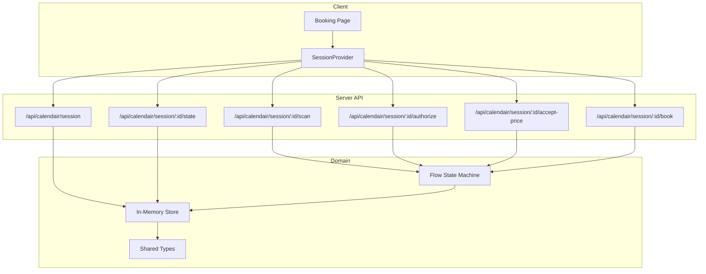
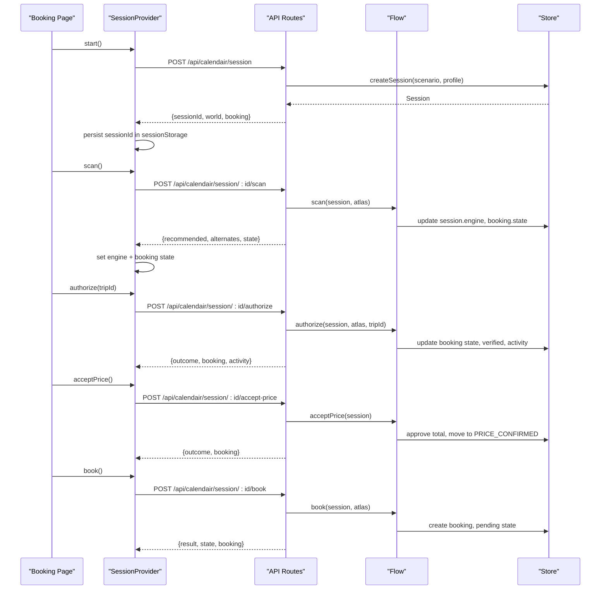
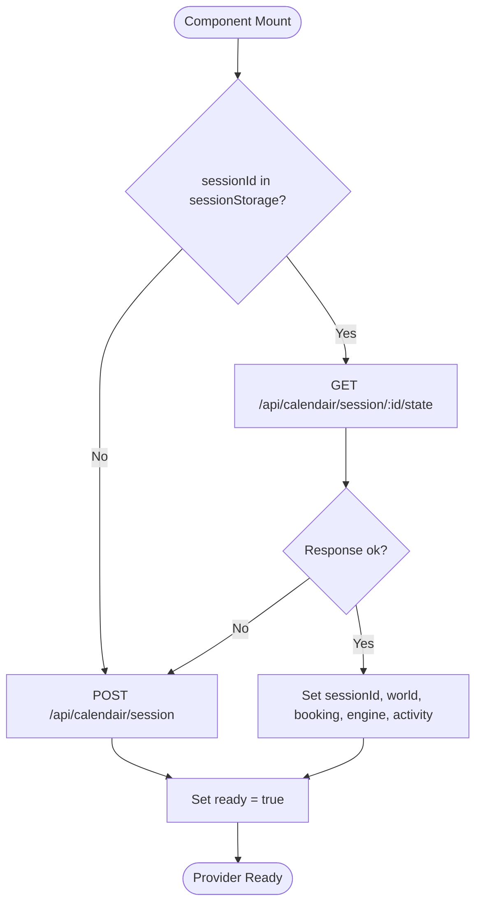
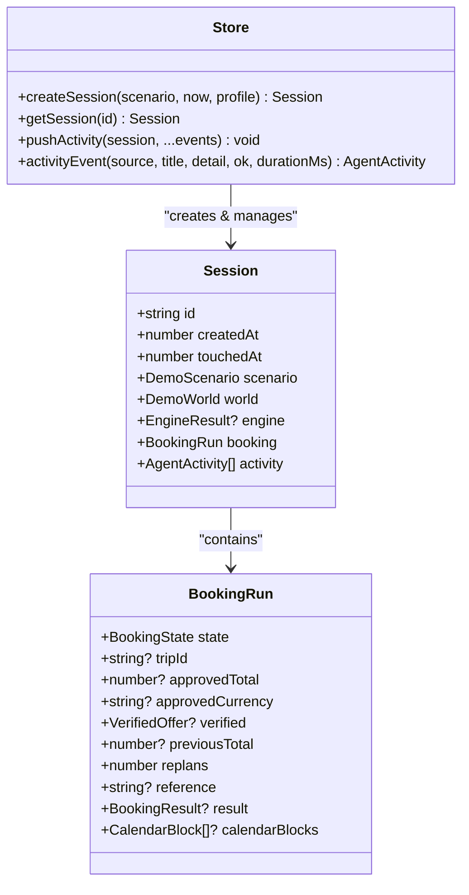
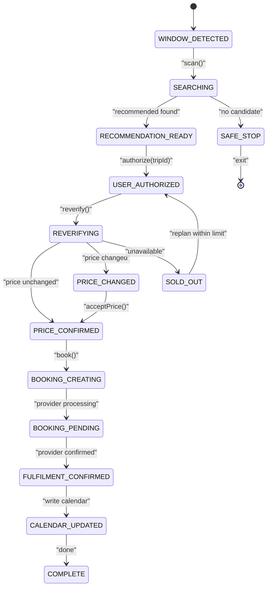
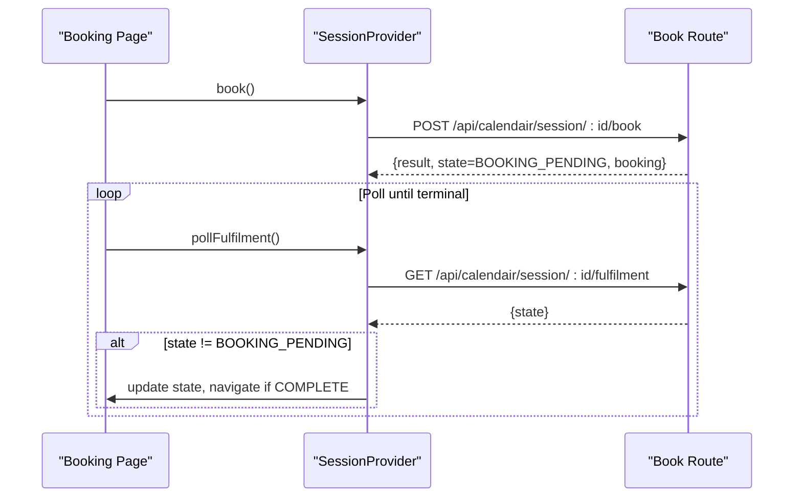
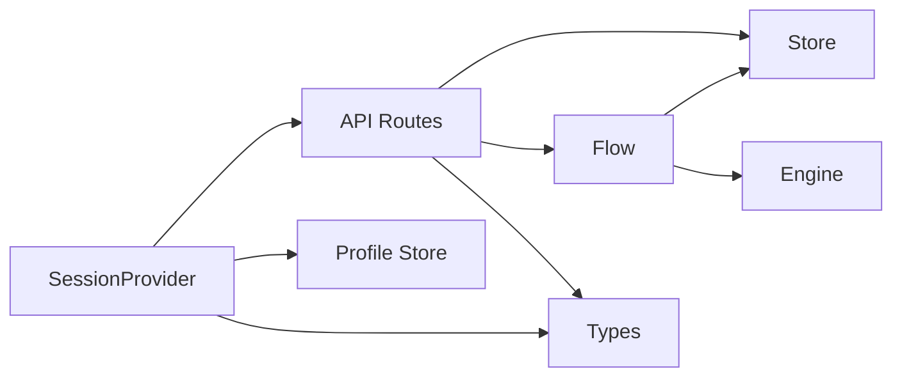

# Session Management

<cite>
**Referenced Files in This Document**
- [SessionProvider.tsx](file://src/components/calendair/SessionProvider.tsx)
- [route.ts (session start)](file://src/app/api/calendair/session/route.ts)
- [route.ts (state snapshot)](file://src/app/api/calendair/session/[id]/state/route.ts)
- [route.ts (scan)](file://src/app/api/calendair/session/[id]/scan/route.ts)
- [route.ts (authorize)](file://src/app/api/calendair/session/[id]/authorize/route.ts)
- [route.ts (accept-price)](file://src/app/api/calendair/session/[id]/accept-price/route.ts)
- [route.ts (book)](file://src/app/api/calendair/session/[id]/book/route.ts)
- [store.ts](file://src/lib/calendair/store.ts)
- [flow.ts](file://src/lib/calendair/flow.ts)
- [types.ts](file://src/lib/calendair/types.ts)
- [booking/page.tsx](file://src/app/(calendair)/booking/page.tsx)
- [profile-store.ts](file://src/lib/onboarding/profile-store.ts)
</cite>

## Table of Contents
1. Introduction
2. Project Structure
3. Core Components
4. Architecture Overview
5. Detailed Component Analysis
6. Dependency Analysis
7. Performance Considerations
8. Troubleshooting Guide
9. Conclusion

## Introduction
This document explains CALENDAIR’s session management system that synchronizes client and server state throughout the booking workflow. It covers how sessions maintain booking state, world context (windows, preferences, companions), and engine results across the application lifecycle. It documents the SessionProvider implementation, state persistence mechanisms, real-time synchronization patterns between frontend and backend, examples of session initialization, state updates, and recovery from failures, and the relationship between sessions and the booking workflow state machine.

## Project Structure
The session system spans a small set of focused modules:
- Client-side provider coordinates UI state and orchestrates calls to the server.
- Server routes expose endpoints for starting sessions, resuming state, scanning, authorizing, accepting price changes, and booking.
- In-memory store holds per-session state with TTL-based cleanup.
- Flow functions implement the booking state machine and orchestrate domain operations.
- Types define shared contracts for world, engine, and booking state.
- The booking page drives user interactions and polling based on session state.

**Diagram sources**
- [SessionProvider.tsx:98-175](file://src/components/calendair/SessionProvider.tsx#L98-L175)
- [route.ts (session start):24-60](file://src/app/api/calendair/session/route.ts#L24-L60)
- [route.ts (state snapshot):6-34](file://src/app/api/calendair/session/[id]/state/route.ts#L6-L34)
- [route.ts (scan):9-33](file://src/app/api/calendair/session/[id]/scan/route.ts#L9-L33)
- [route.ts (authorize):14-24](file://src/app/api/calendair/session/[id]/authorize/route.ts#L14-L24)
- [route.ts (accept-price):8-15](file://src/app/api/calendair/session/[id]/accept-price/route.ts#L8-L15)
- [route.ts (book):9-23](file://src/app/api/calendair/session/[id]/book/route.ts#L9-L23)
- [store.ts:53-92](file://src/lib/calendair/store.ts#L53-L92)
- [flow.ts:22-200](file://src/lib/calendair/flow.ts#L22-L200)
- [types.ts:197-200](file://src/lib/calendair/types.ts#L197-L200)

**Section sources**
- [SessionProvider.tsx:98-175](file://src/components/calendair/SessionProvider.tsx#L98-L175)
- [route.ts (session start):24-60](file://src/app/api/calendair/session/route.ts#L24-L60)
- [store.ts:53-92](file://src/lib/calendair/store.ts#L53-L92)

## Core Components
- SessionProvider: React context that owns the active sessionId, world snapshot, engine snapshot, booking run, activity log, and provides methods to start, scan, authorize, accept price, book, poll fulfilment, and explain trips. It persists the sessionId in sessionStorage for recovery across reloads.
- Server Routes: REST endpoints that create sessions, resume state, execute read-only scans, perform human checkpoints (authorize, accept price), and initiate bookings. Each route validates inputs, fetches or creates the session, delegates to flow logic, and returns updated state.
- Store: In-memory Map of sessions with TTL-based sweep. Creates sessions with initial world and booking state, tracks last-touched timestamps, and bounds activity logs.
- Flow: Implements the booking state machine (scan, authorize, reverify, accept price, book). Enforces replan limits, safe stops, and explicit human approvals before writes.
- Types: Shared contracts for DemoScenario, BookingState, ScoredTrip, VerifiedOffer, and other domain objects used by both client and server.

Key responsibilities:
- Maintain a single source of truth for booking state on the server.
- Keep the client synchronized via snapshots and targeted updates.
- Ensure no write occurs without explicit human approval.
- Provide resilience through session recovery and bounded activity logs.

**Section sources**
- [SessionProvider.tsx:62-86](file://src/components/calendair/SessionProvider.tsx#L62-L86)
- [store.ts:28-51](file://src/lib/calendair/store.ts#L28-L51)
- [flow.ts:22-200](file://src/lib/calendair/flow.ts#L22-L200)
- [types.ts:197-200](file://src/lib/calendair/types.ts#L197-L200)

## Architecture Overview
The session architecture follows a clear separation:
- Client: SessionProvider manages UI state and issues commands to the server.
- Server: Thin API layer validates requests, locates or creates sessions, and delegates to flow.
- Domain: Flow enforces business rules and state transitions; store persists session state in memory with TTL.

**Diagram sources**
- [SessionProvider.tsx:114-175](file://src/components/calendair/SessionProvider.tsx#L114-L175)
- [route.ts (session start):24-60](file://src/app/api/calendair/session/route.ts#L24-L60)
- [route.ts (scan):9-33](file://src/app/api/calendair/session/[id]/scan/route.ts#L9-L33)
- [route.ts (authorize):14-24](file://src/app/api/calendair/session/[id]/authorize/route.ts#L14-L24)
- [route.ts (accept-price):8-15](file://src/app/api/calendair/session/[id]/accept-price/route.ts#L8-L15)
- [route.ts (book):9-23](file://src/app/api/calendair/session/[id]/book/route.ts#L9-L23)
- [flow.ts:22-200](file://src/lib/calendair/flow.ts#L22-L200)
- [store.ts:69-92](file://src/lib/calendair/store.ts#L69-L92)

## Detailed Component Analysis

### SessionProvider Implementation
Responsibilities:
- Initialize or resume a session using sessionId stored in sessionStorage.
- Fetch full state snapshot when resuming.
- Expose methods: start, scan, authorize, acceptPrice, book, pollFulfilment, explain, tripById.
- Update local state for world, engine, booking, activity, and outcomes.
- Handle errors and busy states during long-running operations.

Initialization and recovery:
- On mount, attempts to load an existing sessionId from sessionStorage.
- If found, fetches the latest state via /state endpoint; otherwise starts a new session.
- Reads traveller profile from localStorage to seed the first search with real rules if available.

State updates:
- Centralized call helper updates activity and booking fields returned by server responses.
- Engine snapshot is built from scan responses and persisted locally until next scan.

Error handling:
- Network or server errors set a user-visible error message.
- Graceful fallback when sessionStorage is unavailable.

**Diagram sources**
- [SessionProvider.tsx:114-175](file://src/components/calendair/SessionProvider.tsx#L114-L175)
- [route.ts (state snapshot):6-34](file://src/app/api/calendair/session/[id]/state/route.ts#L6-L34)

**Section sources**
- [SessionProvider.tsx:98-175](file://src/components/calendair/SessionProvider.tsx#L98-L175)
- [profile-store.ts:28-72](file://src/lib/onboarding/profile-store.ts#L28-L72)

### Server Session Lifecycle
- Start: Validates optional scenario and profile, sanitizes profile, creates session, builds world, initializes booking state, and returns sessionId plus initial world and booking data.
- Resume: Returns current session snapshot including booking state, activity, engine, and world.
- Scan: Read-only discovery; runs opportunity engine against world constraints and updates engine and booking state accordingly.
- Authorize: Human checkpoint; verifies live offer and may trigger replanning within limits.
- Accept Price: Explicit acceptance required when price changes; moves to confirmed state.
- Book: First write against approved total; returns result and final state.

**Diagram sources**
- [store.ts:28-51](file://src/lib/calendair/store.ts#L28-L51)
- [store.ts:69-92](file://src/lib/calendair/store.ts#L69-L92)

**Section sources**
- [route.ts (session start):24-60](file://src/app/api/calendair/session/route.ts#L24-L60)
- [route.ts (state snapshot):6-34](file://src/app/api/calendair/session/[id]/state/route.ts#L6-L34)
- [route.ts (scan):9-33](file://src/app/api/calendair/session/[id]/scan/route.ts#L9-L33)
- [route.ts (authorize):14-24](file://src/app/api/calendair/session/[id]/authorize/route.ts#L14-L24)
- [route.ts (accept-price):8-15](file://src/app/api/calendair/session/[id]/accept-price/route.ts#L8-L15)
- [route.ts (book):9-23](file://src/app/api/calendair/session/[id]/book/route.ts#L9-L23)
- [store.ts:53-92](file://src/lib/calendair/store.ts#L53-L92)

### Booking Workflow State Machine
The flow enforces strict state transitions and human checkpoints:
- SCAN: Moves to SEARCHING, runs engine, sets RECOMMENDATION_READY or SAFE_STOP.
- AUTHORIZE: Sets USER_AUTHORIZED, then REVERIFYING while re-checking live fare.
- PRICE_CHANGED vs PRICE_CONFIRMED: Requires explicit acceptPrice when price changed.
- BOOKING_CREATING/BOOKING_PENDING: First write against approved total; polling continues until provider confirms.
- FULFILMENT_CONFIRMED/CALENDAR_UPDATED/COMPLETE: Finalization and navigation.

**Diagram sources**
- [flow.ts:22-200](file://src/lib/calendair/flow.ts#L22-L200)
- [types.ts:197-200](file://src/lib/calendair/types.ts#L197-L200)
- [booking/page.tsx:226-269](file://src/app/(calendair)/booking/page.tsx#L226-L269)

**Section sources**
- [flow.ts:22-200](file://src/lib/calendair/flow.ts#L22-L200)
- [booking/page.tsx:226-269](file://src/app/(calendair)/booking/page.tsx#L226-L269)

### Real-Time Synchronization Patterns
- Snapshot-based sync: After start or resume, the client receives a full snapshot of world, booking, activity, and engine.
- Incremental updates: Each action endpoint returns updated booking, activity, and sometimes engine fields; the provider merges these into local state.
- Polling: During BOOKING_PENDING, the client polls /fulfilment until the provider reports a terminal state.
- Error propagation: Errors are surfaced via a top-level error field in the provider; network failures do not crash the UI.

**Diagram sources**
- [SessionProvider.tsx:245-258](file://src/components/calendair/SessionProvider.tsx#L245-L258)
- [route.ts (book):9-23](file://src/app/api/calendair/session/[id]/book/route.ts#L9-L23)

**Section sources**
- [SessionProvider.tsx:177-258](file://src/components/calendair/SessionProvider.tsx#L177-L258)
- [booking/page.tsx:47-65](file://src/app/(calendair)/booking/page.tsx#L47-L65)

### Examples

#### Session Initialization
- The provider checks sessionStorage for an existing sessionId.
- If present, it fetches the latest state via the state endpoint and resumes.
- Otherwise, it starts a new session by posting to the session creation endpoint with optional scenario and profile.
- The traveller’s profile is read from localStorage at startup so the first search uses real rules when available.

**Section sources**
- [SessionProvider.tsx:114-175](file://src/components/calendair/SessionProvider.tsx#L114-L175)
- [profile-store.ts:28-72](file://src/lib/onboarding/profile-store.ts#L28-L72)
- [route.ts (session start):24-60](file://src/app/api/calendair/session/route.ts#L24-L60)

#### State Updates
- After scan, the provider sets engine snapshot and updates booking state from the response.
- After authorize and acceptPrice, the provider sets outcome and updates booking/activity from the response.
- After book, the provider sets busy flag and proceeds to polling.

**Section sources**
- [SessionProvider.tsx:194-258](file://src/components/calendair/SessionProvider.tsx#L194-L258)
- [route.ts (scan):9-33](file://src/app/api/calendair/session/[id]/scan/route.ts#L9-L33)
- [route.ts (authorize):14-24](file://src/app/api/calendair/session/[id]/authorize/route.ts#L14-L24)
- [route.ts (accept-price):8-15](file://src/app/api/calendair/session/[id]/accept-price/route.ts#L8-L15)
- [route.ts (book):9-23](file://src/app/api/calendair/session/[id]/book/route.ts#L9-L23)

#### Recovery from Failures
- If the state endpoint returns expired session, the provider falls back to starting a new session.
- If sessionStorage is unavailable, the provider still works for a single page view.
- Network errors set a user-facing error message without crashing.

**Section sources**
- [SessionProvider.tsx:145-175](file://src/components/calendair/SessionProvider.tsx#L145-L175)
- [route.ts (state snapshot):6-34](file://src/app/api/calendair/session/[id]/state/route.ts#L6-L34)

## Dependency Analysis
- SessionProvider depends on:
  - Profile store to read traveller profile at startup.
  - API routes for all session operations.
  - Types for shared shapes.
- API routes depend on:
  - Store for session retrieval and creation.
  - Flow for state transitions and domain logic.
  - Atlas adapter for provider interactions (via flow).
- Flow depends on:
  - Store for activity logging and session mutation.
  - Engine for opportunity scanning.
  - Types for domain contracts.

**Diagram sources**
- [SessionProvider.tsx:114-175](file://src/components/calendair/SessionProvider.tsx#L114-L175)
- [route.ts (session start):24-60](file://src/app/api/calendair/session/route.ts#L24-L60)
- [store.ts:69-92](file://src/lib/calendair/store.ts#L69-L92)
- [flow.ts:22-200](file://src/lib/calendair/flow.ts#L22-L200)
- [profile-store.ts:28-72](file://src/lib/onboarding/profile-store.ts#L28-L72)

**Section sources**
- [SessionProvider.tsx:114-175](file://src/components/calendair/SessionProvider.tsx#L114-L175)
- [store.ts:69-92](file://src/lib/calendair/store.ts#L69-L92)
- [flow.ts:22-200](file://src/lib/calendair/flow.ts#L22-L200)

## Performance Considerations
- In-memory sessions with TTL reduce storage dependencies and ensure fast access; sessions older than two hours are swept automatically.
- Activity logs are bounded to prevent unbounded growth.
- Engine results are cached per session and only refreshed on explicit scan.
- Polling interval balances responsiveness with provider load; adjust as needed for production.

[No sources needed since this section provides general guidance]

## Troubleshooting Guide
Common issues and remedies:
- Session expired: The state endpoint returns a 404; the provider will restart a new session.
- Search failed due to provider wiring: The scan endpoint returns a specific error indicating AtlasNotWired; handle gracefully in UI.
- Price change requires explicit acceptance: The flow returns price-changed; the UI must prompt and call acceptPrice before booking.
- No candidates found: The flow sets SAFE_STOP; guide users to adjust constraints or try again later.

Operational tips:
- Verify environment variables for demo mode and scenarios.
- Monitor health endpoint for provider status.
- Inspect activity log in the session snapshot for step-by-step evidence.

**Section sources**
- [route.ts (state snapshot):6-34](file://src/app/api/calendair/session/[id]/state/route.ts#L6-L34)
- [route.ts (scan):9-33](file://src/app/api/calendair/session/[id]/scan/route.ts#L9-L33)
- [flow.ts:94-176](file://src/lib/calendair/flow.ts#L94-L176)

## Conclusion
CALENDAIR’s session management system cleanly separates concerns between client, server, and domain layers. Sessions maintain authoritative booking state and world context on the server, while the client keeps a synchronized snapshot for responsive UX. The flow enforces safety-critical rules such as explicit human approvals, replan limits, and provider-driven confirmations. Together, these components provide a robust, recoverable, and transparent booking workflow suitable for both demo and production use.