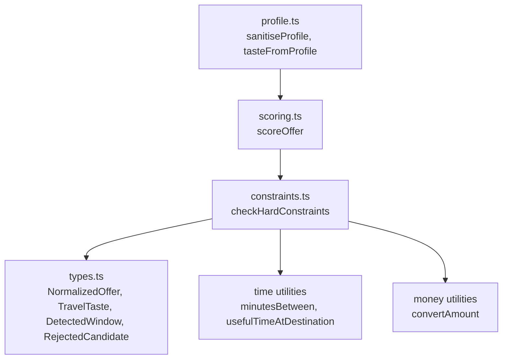
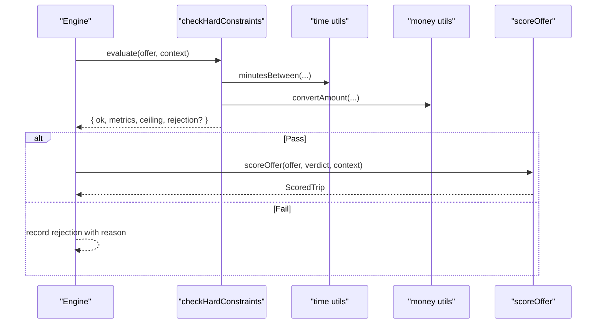
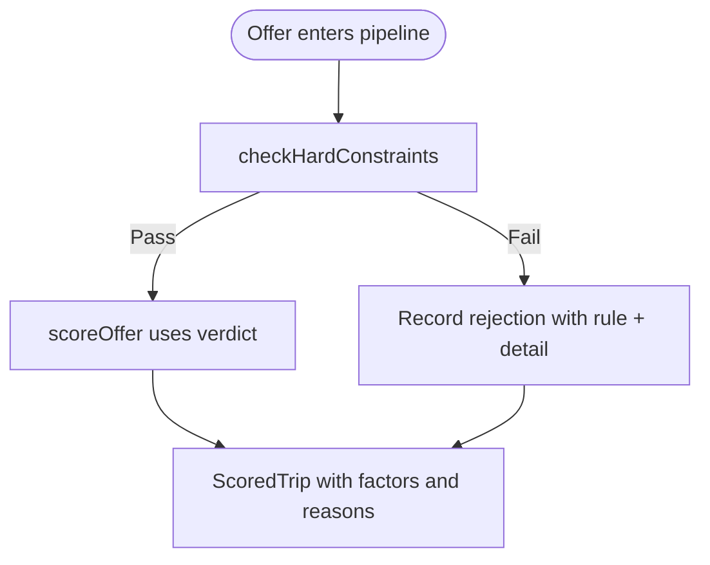
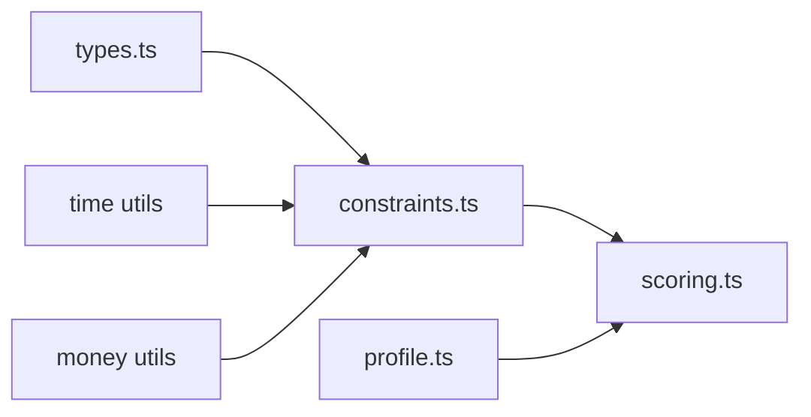

# Constraint System

<cite>
**Referenced Files in This Document**
- [constraints.ts](file://src/lib/calendair/constraints.ts)
- [types.ts](file://src/lib/calendair/types.ts)
- [scoring.ts](file://src/lib/calendair/scoring.ts)
- [profile.ts](file://src/lib/calendair/profile.ts)
- [engine.test.ts](file://src/lib/calendair/engine.test.ts)
- [profile.test.ts](file://src/lib/calendair/profile.test.ts)
</cite>

## Table of Contents
1. [Introduction](#introduction)
2. [Project Structure](#project-structure)
3. [Core Components](#core-components)
4. [Architecture Overview](#architecture-overview)
5. [Detailed Component Analysis](#detailed-component-analysis)
6. [Dependency Analysis](#dependency-analysis)
7. [Performance Considerations](#performance-considerations)
8. [Troubleshooting Guide](#troubleshooting-guide)
9. [Conclusion](#conclusion)
10. [Appendices](#appendices)

## Introduction
This document explains CALENDAIR’s hard constraint system that prevents unsafe or undesirable bookings from being recommended or booked. It focuses on the ConstraintContext interface, the checkHardConstraints function, and each enforced rule (budget limits, destination/time window safety, minimum ground time, return buffer, flight length/connections, companion availability, and reference-only fares). It also clarifies how constraints integrate with the scoring system and how to extend the system safely.

## Project Structure
The constraint logic lives in a small, focused module under the calendair library:
- constraints.ts defines the ConstraintContext, ConstraintVerdict, and the checkHardConstraints function.
- types.ts defines shared domain shapes used by constraints and scoring (e.g., NormalizedOffer, TravelTaste, DetectedWindow, RejectedCandidate).
- scoring.ts consumes the verdict produced by constraints to compute an Escape Score and human-readable reasons.
- profile.ts sanitizes user preferences into TravelTaste and enforces safe bounds before they reach constraints and scoring.
- Tests in engine.test.ts and profile.test.ts validate constraint behavior across scenarios like budget, ground time, connections, and currency conversion.

**Diagram sources**
- [constraints.ts:1-162](file://src/lib/calendair/constraints.ts#L1-L162)
- [types.ts:15-193](file://src/lib/calendair/types.ts#L15-L193)
- [scoring.ts:56-227](file://src/lib/calendair/scoring.ts#L56-L227)
- [profile.ts:160-261](file://src/lib/calendair/profile.ts#L160-L261)

**Section sources**
- [constraints.ts:1-162](file://src/lib/calendair/constraints.ts#L1-L162)
- [types.ts:15-193](file://src/lib/calendair/types.ts#L15-L193)
- [scoring.ts:56-227](file://src/lib/calendair/scoring.ts#L56-L227)
- [profile.ts:160-261](file://src/lib/calendair/profile.ts#L160-L261)

## Core Components
- ConstraintContext: Provides the evaluation context for hard rules, including the detected calendar window, traveller preferences (TravelTaste), next commitment time, and companion availability status.
- ConstraintVerdict: The pass/fail result plus derived metrics (useful minutes, nights, days, return buffer minutes, converted ceiling) and optional rejection details.
- checkHardConstraints: Evaluates an offer against all hard rules in deterministic order and returns either a passing verdict or a structured rejection.

Key responsibilities:
- Enforce budget ceilings in the correct currency.
- Ensure itinerary fits within the calendar window and respects return buffer.
- Guarantee minimum ground time at destination.
- Respect maximum flight duration and connection tolerance.
- Honor companion availability when required by the window.
- Block non-bookable reference-only fares.

**Section sources**
- [constraints.ts:15-37](file://src/lib/calendair/constraints.ts#L15-L37)
- [constraints.ts:42-161](file://src/lib/calendair/constraints.ts#L42-L161)
- [types.ts:16-56](file://src/lib/calendair/types.ts#L16-L56)
- [types.ts:87-102](file://src/lib/calendair/types.ts#L87-L102)
- [types.ts:116-134](file://src/lib/calendair/types.ts#L116-L134)
- [types.ts:187-193](file://src/lib/calendair/types.ts#L187-L193)

## Architecture Overview
The constraint system is a gatekeeper between search results and scoring/booking. Only offers that pass all hard constraints proceed to scoring and potential booking.

**Diagram sources**
- [constraints.ts:42-161](file://src/lib/calendair/constraints.ts#L42-L161)
- [scoring.ts:56-227](file://src/lib/calendair/scoring.ts#L56-L227)

## Detailed Component Analysis

### ConstraintContext and ConstraintVerdict
- ConstraintContext fields:
  - window: DetectedWindow describing the available time range, origin airport, companion IDs, and preference-derived thresholds.
  - taste: TravelTaste capturing budgets, durations, stops, cabin-related preferences, and comfort tolerances.
  - nextCommitmentIso: ISO timestamp of the next obligation, used to compute the return buffer.
  - companionAvailable: Boolean indicating whether companions are free for the entire window.
- ConstraintVerdict fields:
  - ok: Whether the offer passes all hard rules.
  - usefulMinutes, nights, days: Derived stay metrics used downstream.
  - returnBufferMinutes: Minutes between arrival and next commitment.
  - ceiling: Converted spending limit in the offer’s currency; zero if conversion fails.
  - rejection?: Structured reason when a rule fails.

These structures ensure consistent inputs and outputs across constraint checks and scoring.

**Section sources**
- [constraints.ts:15-37](file://src/lib/calendair/constraints.ts#L15-L37)
- [types.ts:16-56](file://src/lib/calendair/types.ts#L16-L56)
- [types.ts:87-102](file://src/lib/calendair/types.ts#L87-L102)
- [types.ts:187-193](file://src/lib/calendair/types.ts#L187-L193)

### Hard Rules Implemented in checkHardConstraints
The function evaluates rules in a fixed order and short-circuits on the first failure. Each rule produces a rejection with a stable rule name and human-friendly detail.

- Incomplete itinerary guard: Requires both outbound and return legs inside the window.
- Departure timing: Rejects if the outbound departure is before the window opens.
- Return timing: Rejects if the return arrival is after the window closes.
- Return buffer: Ensures sufficient minutes between arrival and next commitment based on taste.
- Budget ceiling: Converts the traveller’s maximum spend into the offer’s currency and rejects if exceeded. If conversion is not supported, it rejects with “Budget not comparable”.
- Minimum ground time: Computes useful time at destination using local date boundaries and rejects if below the traveller’s minimum useful hours.
- Flight length: Rejects if the outbound leg exceeds the traveller’s max flight minutes.
- Connections: Rejects if stops exceed the traveller’s maxStops.
- Companion availability: Rejects if companions are required by the window but not available.
- Reference-only fares: Rejects any fare marked as reference-only to prevent booking non-verifiable options.

Each rejection includes:
- offerId: The failing offer identifier.
- destinationName: Human-readable destination.
- rule: Stable rule name for UI and logs.
- detail: Contextual explanation for the user.

Example violation scenarios validated by tests:
- Over budget: Business class fare exceeding the hard maximum.
- Not enough time there: Short ground time below minimum useful hours.
- Reference price only: Non-bookable comparison fare blocked.
- Returns too late: Arrival after the window closes or next commitment.
- Too many connections: Stops beyond tolerance.
- Companion not free: Window requires companions but they conflict.

**Section sources**
- [constraints.ts:42-161](file://src/lib/calendair/constraints.ts#L42-L161)
- [engine.test.ts:69-112](file://src/lib/calendair/engine.test.ts#L69-L112)
- [engine.test.ts:240-253](file://src/lib/calendair/engine.test.ts#L240-L253)
- [profile.test.ts:337-386](file://src/lib/calendair/profile.test.ts#L337-L386)

### Relationship to Scoring
- Constraints run first; only passing offers enter scoring.
- The verdict supplies scoring with:
  - Useful minutes, nights, days for “useful time” factor.
  - Return buffer minutes for “return safety” factor.
  - Converted ceiling for “budget headroom” calculation.
- Scoring computes a transparent 0–100 Escape Score from deterministic factors and never overrides hard constraints.

**Diagram sources**
- [constraints.ts:42-161](file://src/lib/calendair/constraints.ts#L42-L161)
- [scoring.ts:56-227](file://src/lib/calendair/scoring.ts#L56-L227)

**Section sources**
- [scoring.ts:56-227](file://src/lib/calendair/scoring.ts#L56-L227)

### Extensibility Points
To add a new hard constraint:
- Add a new rule check inside checkHardConstraints, returning reject(rule, detail) on failure.
- Keep the rule name stable and descriptive for UI and logs.
- Ensure any new numeric thresholds come from TravelTaste or DetectedWindow so they remain user-configurable and bounded.
- Update tests to assert the new rule behavior and edge cases.
- If the rule affects scoring, propagate relevant metrics via ConstraintVerdict and update scoring accordingly.

Guidelines:
- Place early checks first (completeness, window fit) to fail fast.
- Use money conversion helpers to avoid unit mismatches.
- Avoid LLM involvement in hard rules to keep them deterministic and auditable.

**Section sources**
- [constraints.ts:42-161](file://src/lib/calendair/constraints.ts#L42-L161)
- [types.ts:87-102](file://src/lib/calendair/types.ts#L87-L102)
- [profile.ts:160-261](file://src/lib/calendair/profile.ts#L160-L261)

## Dependency Analysis
Constraints depend on:
- Destination metadata for readable names and zones.
- Time utilities for window comparisons and useful stay calculations.
- Money utilities for safe currency conversion.
- Types for normalized offers, tastes, windows, and rejections.

Scoring depends on the verdict produced by constraints and the same types.

**Diagram sources**
- [constraints.ts:1-5](file://src/lib/calendair/constraints.ts#L1-L5)
- [scoring.ts:1-11](file://src/lib/calendair/scoring.ts#L1-L11)
- [profile.ts:1-10](file://src/lib/calendair/profile.ts#L1-L10)

**Section sources**
- [constraints.ts:1-5](file://src/lib/calendair/constraints.ts#L1-L5)
- [scoring.ts:1-11](file://src/lib/calendair/scoring.ts#L1-L11)
- [profile.ts:1-10](file://src/lib/calendair/profile.ts#L1-L10)

## Performance Considerations
- Deterministic checks: All hard rules are pure computations over offer and context; no network calls inside constraints.
- Early exits: The function returns immediately on the first failing rule, minimizing work.
- Currency conversion: Performed once per offer; caching can be considered if evaluating many offers in batch.
- Time calculations: Localized stay computation is O(1) per offer.

[No sources needed since this section provides general guidance]

## Troubleshooting Guide
Common rejection reasons and their meanings:
- Incomplete itinerary: Missing return leg; verify search parameters and window coverage.
- Departs too early: Outbound departure precedes window start; adjust travel dates or window.
- Returns too late: Arrival after window close or next commitment; shorten trip or shift dates.
- Return buffer too tight: Insufficient recovery time before next commitment; increase buffer or adjust schedule.
- Budget not comparable: Offer currency cannot be converted to traveller’s currency; choose supported currencies or adjust preferences.
- Over your budget: Total price exceeds converted ceiling; lower expectations or increase budget.
- Not enough time there: Ground time below minimum useful hours; extend stay or choose closer destinations.
- Flight too long: Outbound leg exceeds tolerance; prefer shorter routes or direct flights.
- Too many connections: Stops exceed tolerance; filter for fewer connections.
- Companion not free: Companions have conflicts; coordinate schedules or relax requirement.
- Reference price only: Fare is non-bookable; select a verifiable option.

Diagnostics:
- Inspect the rejection.detail string for contextual numbers (hours, minutes, amounts).
- Confirm that TravelTaste values are within safe bounds set by profile sanitization.
- Validate that nextCommitmentIso is accurate to avoid false buffer failures.

**Section sources**
- [constraints.ts:58-151](file://src/lib/calendair/constraints.ts#L58-L151)
- [engine.test.ts:69-112](file://src/lib/calendair/engine.test.ts#L69-L112)
- [profile.test.ts:337-386](file://src/lib/calendair/profile.test.ts#L337-L386)

## Conclusion
CALENDAIR’s hard constraint system ensures that only safe, affordable, and schedule-compatible offers proceed to scoring and booking. By enforcing deterministic rules—budget, timing, ground time, flight characteristics, companion availability, and bookability—it protects users from unrealistic or risky itineraries. The ConstraintContext and ConstraintVerdict provide clear contracts for evaluation and downstream scoring. Adding new constraints is straightforward while preserving safety and transparency.

[No sources needed since this section summarizes without analyzing specific files]

## Appendices

### Example Constraint Violation Scenarios
- Budget exceeded: A business-class fare surpasses the traveller’s hard maximum; rejected with “Over your budget”.
- Insufficient ground time: A short hop yields less than the minimum useful hours; rejected with “Not enough time there”.
- Late return: An itinerary lands after the next commitment; rejected with “Returns too late”.
- Excess connections: More stops than tolerated; rejected with “Too many connections”.
- Companion conflict: Required companions are busy; rejected with “Companion not free”.
- Reference-only fare: Non-bookable comparison fare; rejected with “Reference price only”.

These scenarios are exercised in tests and reflect real-world edge cases the system guards against.

**Section sources**
- [engine.test.ts:69-112](file://src/lib/calendair/engine.test.ts#L69-L112)
- [engine.test.ts:240-253](file://src/lib/calendair/engine.test.ts#L240-L253)