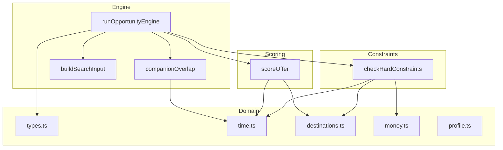
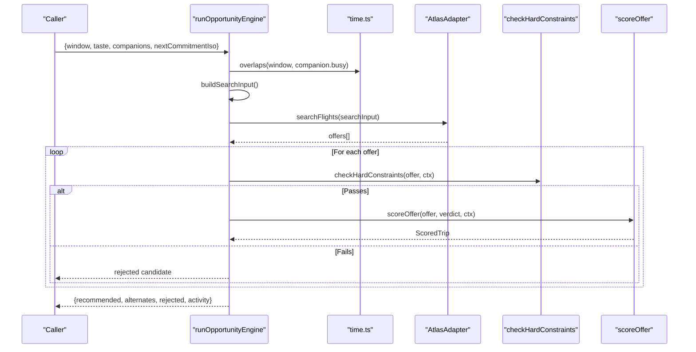
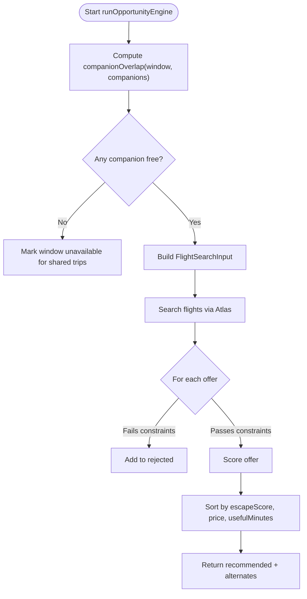
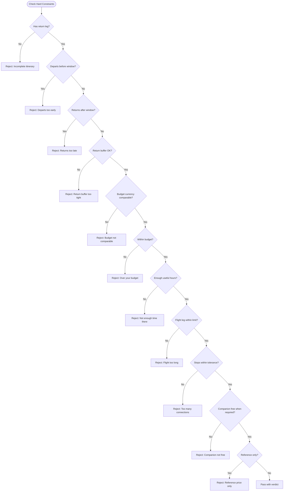
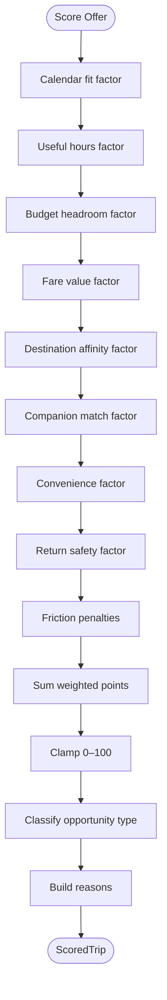
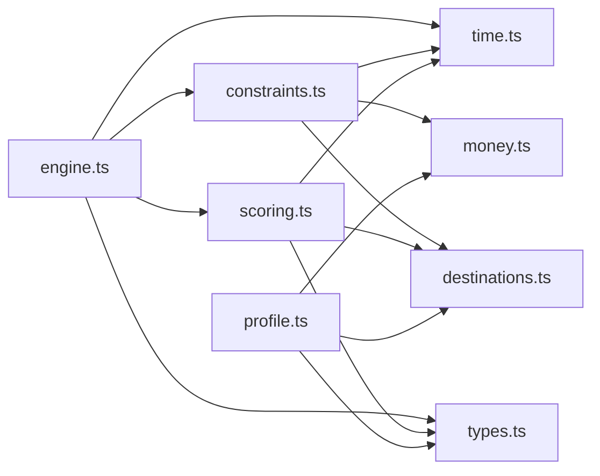

# Core Business Logic

<cite>
**Referenced Files in This Document**
- [engine.ts](file://src/lib/calendair/engine.ts)
- [constraints.ts](file://src/lib/calendair/constraints.ts)
- [scoring.ts](file://src/lib/calendair/scoring.ts)
- [types.ts](file://src/lib/calendair/types.ts)
- [time.ts](file://src/lib/calendair/time.ts)
- [destinations.ts](file://src/lib/calendair/destinations.ts)
- [money.ts](file://src/lib/calendair/money.ts)
- [profile.ts](file://src/lib/calendair/profile.ts)
- [engine.test.ts](file://src/lib/calendair/engine.test.ts)
</cite>

## Table of Contents
1. [Introduction](#introduction)
2. [Project Structure](#project-structure)
3. [Core Components](#core-components)
4. [Architecture Overview](#architecture-overview)
5. [Detailed Component Analysis](#detailed-component-analysis)
6. [Dependency Analysis](#dependency-analysis)
7. [Performance Considerations](#performance-considerations)
8. [Troubleshooting Guide](#troubleshooting-guide)
9. [Conclusion](#conclusion)

## Introduction
This document explains CALENDAIR’s core business logic for opportunistic trip discovery. It focuses on:
- The opportunity engine that turns a calendar free/busy window into a ranked set of flight recommendations
- The hard constraint system that enforces safety rules such as budget limits, time windows, and companion availability
- The deterministic scoring algorithm that evaluates how well each trip fits the traveller’s life and preferences
- The domain type system including DetectedWindow, ScoredTrip, and BookingRun-related types
- How companion availability is checked and integrated into matching
- Concrete examples from tests and code paths showing window detection, constraint evaluation, and score calculation
- Why these algorithms are deterministic and how they ensure safety properties

## Project Structure
The core logic lives under src/lib/calendair with clear separation of concerns:
- engine.ts orchestrates the end-to-end flow from a DetectedWindow to a recommended trip
- constraints.ts implements pass/fail hard rules
- scoring.ts computes a transparent 0–100 Escape Score from weighted factors
- types.ts defines the domain contracts (DetectedWindow, ScoredTrip, etc.)
- time.ts provides deterministic time arithmetic and overlap checks
- destinations.ts supplies destination metadata used by scoring and constraints
- money.ts converts currencies deterministically for budget comparisons
- profile.ts sanitizes and projects user preferences into TravelTaste consumed by the engine
- engine.test.ts validates behavior across scenarios

**Diagram sources**
- [engine.ts:88-201](file://src/lib/calendair/engine.ts#L88-L201)
- [constraints.ts:42-161](file://src/lib/calendair/constraints.ts#L42-L161)
- [scoring.ts:56-227](file://src/lib/calendair/scoring.ts#L56-L227)
- [time.ts:20-22](file://src/lib/calendair/time.ts#L20-L22)
- [destinations.ts:151-153](file://src/lib/calendair/destinations.ts#L151-L153)
- [money.ts:42-52](file://src/lib/calendair/money.ts#L42-L52)

**Section sources**
- [engine.ts:1-206](file://src/lib/calendair/engine.ts#L1-L206)
- [types.ts:1-274](file://src/lib/calendair/types.ts#L1-L274)

## Core Components
- Opportunity Engine: Accepts a DetectedWindow, travel taste, companions, and next commitment; searches inventory; applies hard constraints; scores viable trips; returns one recommendation plus up to two alternates.
- Constraint System: Enforces hard rules (complete itinerary, within window, return buffer, budget currency conversion, minimum useful hours, max flight duration, max stops, companion availability, reference-only fares).
- Scoring Algorithm: Computes a deterministic 0–100 Escape Score from nine weighted factors (calendar fit, useful hours, budget headroom, fare value, affinity, companion match, convenience, return safety, friction), then ranks trips.
- Domain Types: DetectedWindow, ScoredTrip, RejectedCandidate, TravelTaste, NormalizedOffer, BookingState, and related structures define the contracts between components.

**Section sources**
- [engine.ts:23-39](file://src/lib/calendair/engine.ts#L23-L39)
- [constraints.ts:15-37](file://src/lib/calendair/constraints.ts#L15-L37)
- [scoring.ts:23-32](file://src/lib/calendair/scoring.ts#L23-L32)
- [types.ts:46-56](file://src/lib/calendair/types.ts#L46-L56)
- [types.ts:163-176](file://src/lib/calendair/types.ts#L163-L176)
- [types.ts:187-193](file://src/lib/calendair/types.ts#L187-L193)
- [types.ts:197-215](file://src/lib/calendair/types.ts#L197-L215)

## Architecture Overview
The engine runs a deterministic pipeline:
1. Build search input from the DetectedWindow and taste
2. Check companion availability against the window
3. Search live inventory via Atlas adapter
4. Apply hard constraints to filter out unsafe or invalid offers
5. Score all viable offers using weighted factors
6. Rank by escape score, then price, then useful minutes
7. Return hero recommendation and up to two alternates

**Diagram sources**
- [engine.ts:88-201](file://src/lib/calendair/engine.ts#L88-L201)
- [time.ts:117-122](file://src/lib/calendair/time.ts#L117-L122)
- [constraints.ts:42-161](file://src/lib/calendair/constraints.ts#L42-L161)
- [scoring.ts:56-227](file://src/lib/calendair/scoring.ts#L56-L227)

## Detailed Component Analysis

### Opportunity Engine
Responsibilities:
- Companion overlap detection using free/busy blocks
- Building a FlightSearchInput from DetectedWindow and TravelTaste
- Orchestrating search, filtering, scoring, ranking, and result assembly
- Producing AgentActivity logs for transparency

Key behaviors:
- Companion availability is computed purely from busy intervals; titles never enter this function
- If companions are specified but none are free during the window, the whole window is treated as unavailable
- Offers are filtered by hard constraints before scoring
- Ranking uses escapeScore first, then lower totalPrice, then longer usefulMinutes
- Returns one recommended trip and at most two alternates

**Diagram sources**
- [engine.ts:62-86](file://src/lib/calendair/engine.ts#L62-L86)
- [engine.ts:88-201](file://src/lib/calendair/engine.ts#L88-L201)

**Section sources**
- [engine.ts:62-86](file://src/lib/calendair/engine.ts#L62-L86)
- [engine.ts:88-201](file://src/lib/calendair/engine.ts#L88-L201)

### Constraint System
Purpose:
- Enforce hard rules that cannot be overridden by scoring or language models
- Ensure safety: correct timing, budget comparability, sufficient ground time, acceptable flight length/stops, companion availability, and bookable fares

Rules enforced:
- Complete itinerary with return leg inside window
- Departure not before window opens
- Arrival home not after window closes
- Return buffer meets minimum threshold
- Budget ceiling converted deterministically to offer currency; reject if currencies cannot be compared
- Minimum useful hours on the ground
- Maximum flight duration per leg
- Maximum number of stops
- Companion must be free when required
- Reference-only fares are not bookable

Outputs:
- A ConstraintVerdict with usefulMinutes, nights, days, returnBufferMinutes, and ceiling
- A rejection record with rule and detail when failing

**Diagram sources**
- [constraints.ts:42-161](file://src/lib/calendair/constraints.ts#L42-L161)
- [money.ts:42-52](file://src/lib/calendair/money.ts#L42-L52)
- [time.ts:74-96](file://src/lib/calendair/time.ts#L74-L96)

**Section sources**
- [constraints.ts:42-161](file://src/lib/calendair/constraints.ts#L42-L161)
- [money.ts:42-52](file://src/lib/calendair/money.ts#L42-L52)
- [time.ts:74-96](file://src/lib/calendair/time.ts#L74-L96)

### Scoring Algorithm
Purpose:
- Compute a transparent, deterministic 0–100 Escape Score measuring how well a trip fits the traveller’s life
- Provide human-readable reasons and factor breakdowns

Factors and weights:
- Calendar fit (18): proportion of opening used without straining
- Useful hours (20): ground time relative to practical maximum
- Budget headroom (12): distance below ceiling in offer currency
- Fare value (10): ratio to base fare for route
- Affinity (16): dream list position and interest tag matches, baseline spontaneity
- Companion match (10): full bonus if both calendars fit
- Convenience (8): non-stop preference and leg duration
- Return safety (6): buffer beyond minimum requirement
- Friction (penalty): overnight departures and unwanted connections

Ranking:
- Primary: escapeScore descending
- Tie-breaker 1: lower totalPrice
- Tie-breaker 2: longer usefulMinutes

Classification:
- OpportunityType derived from fare ratio, dream list presence, companion availability, and window length

**Diagram sources**
- [scoring.ts:23-32](file://src/lib/calendair/scoring.ts#L23-L32)
- [scoring.ts:56-227](file://src/lib/calendair/scoring.ts#L56-L227)
- [scoring.ts:257-273](file://src/lib/calendair/scoring.ts#L257-L273)

**Section sources**
- [scoring.ts:23-32](file://src/lib/calendair/scoring.ts#L23-L32)
- [scoring.ts:56-227](file://src/lib/calendair/scoring.ts#L56-L227)
- [scoring.ts:257-273](file://src/lib/calendair/scoring.ts#L257-L273)

### Type System and Domain Models
Key types:
- DetectedWindow: Represents a free/busy window with origin airport, companion IDs, useful hours, return buffer, and optional opened-by event metadata
- ScoredTrip: Extends NormalizedOffer with usefulMinutes, escapeScore, reasons, factors, destination info, returnBufferMinutes, opportunityType, dreamMatch, and promise
- RejectedCandidate: Captures why an offer was rejected (rule and detail)
- TravelTaste: Preferences including budget, currency, flight tolerances, interests, dream destinations, spontaneity level
- BookingState: Enumerated states for booking lifecycle (e.g., WINDOW_DETECTED, SEARCHING, PRICE_CONFIRMED, BOOKING_PENDING, COMPLETE)

These types enforce strict contracts between engine, constraints, scoring, and UI layers.

**Section sources**
- [types.ts:46-56](file://src/lib/calendair/types.ts#L46-L56)
- [types.ts:87-102](file://src/lib/calendair/types.ts#L87-L102)
- [types.ts:116-134](file://src/lib/calendair/types.ts#L116-L134)
- [types.ts:163-176](file://src/lib/calendair/types.ts#L163-L176)
- [types.ts:187-193](file://src/lib/calendair/types.ts#L187-L193)
- [types.ts:197-215](file://src/lib/calendair/types.ts#L197-L215)

### Companion Availability Integration
How it works:
- companionOverlap compares the DetectedWindow against each companion’s busy blocks using deterministic overlap logic
- If any companion has a conflict, the window is marked as not shared; the constraint system then rejects all offers requiring shared availability
- Titles are intentionally excluded from companion data to avoid leaking sensitive event details into matching or logs

Examples from tests:
- When companion is free, free list includes companion id
- When companion has a conflict, free list is empty and conflicted list includes companion id
- Serialised companion data never contains titles

**Section sources**
- [engine.ts:62-75](file://src/lib/calendair/engine.ts#L62-L75)
- [time.ts:117-122](file://src/lib/calendair/time.ts#L117-L122)
- [engine.test.ts:35-53](file://src/lib/calendair/engine.test.ts#L35-L53)

### Determinism and Safety Properties
Determinism:
- All time arithmetic uses parse and minutesBetween; no randomness
- Budget conversion goes through convertAmount with explicit rates; unknown currencies fail safely
- Scoring uses fixed weights and clamp functions; results are rounded consistently
- Ranking uses stable tie-breakers (price, useful minutes)

Safety:
- Hard constraints are pass/fail and cannot be overridden by scoring or LLM wording
- Reference-only fares are blocked from booking flows
- Companion availability is enforced before scoring
- Return buffer ensures safe margin before next commitments
- Profile sanitization bounds numeric inputs to meaningful ranges

**Section sources**
- [time.ts:1-8](file://src/lib/calendair/time.ts#L1-L8)
- [money.ts:1-14](file://src/lib/calendair/money.ts#L1-L14)
- [constraints.ts:6-13](file://src/lib/calendair/constraints.ts#L6-L13)
- [profile.ts:12-24](file://src/lib/calendair/profile.ts#L12-L24)
- [profile.ts:58-67](file://src/lib/calendair/profile.ts#L58-L67)

## Dependency Analysis
Component relationships:
- engine.ts depends on constraints.ts, scoring.ts, time.ts, and types.ts
- constraints.ts depends on time.ts, money.ts, destinations.ts, and types.ts
- scoring.ts depends on time.ts, destinations.ts, types.ts, and constraints.ts
- profile.ts depends on destinations.ts, money.ts, and types.ts

**Diagram sources**
- [engine.ts:1-13](file://src/lib/calendair/engine.ts#L1-L13)
- [constraints.ts:1-4](file://src/lib/calendair/constraints.ts#L1-L4)
- [scoring.ts:1-11](file://src/lib/calendair/scoring.ts#L1-L11)
- [profile.ts:1-10](file://src/lib/calendair/profile.ts#L1-L10)

**Section sources**
- [engine.ts:1-13](file://src/lib/calendair/engine.ts#L1-L13)
- [constraints.ts:1-4](file://src/lib/calendair/constraints.ts#L1-L4)
- [scoring.ts:1-11](file://src/lib/calendair/scoring.ts#L1-L11)
- [profile.ts:1-10](file://src/lib/calendair/profile.ts#L1-L10)

## Performance Considerations
- Overlap checks are O(n) per companion; efficient for small companion sets
- Constraint checks are constant-time per offer; linear over offers
- Scoring is constant-time per offer; linear over offers
- Sorting is O(k log k) where k is number of viable offers; typically small
- Avoid repeated parsing by reusing parsed values where possible; current design parses ISO strings once per comparison

[No sources needed since this section provides general guidance]

## Troubleshooting Guide
Common issues and diagnostics:
- No recommendations: Check rejected candidates for specific rule failures (budget, time, stops, companion)
- Unexpected low scores: Inspect factors and reasons to see which aspects penalize the trip (overnight departure, connections, low budget headroom)
- Companion conflicts: Verify companion busy blocks do not overlap the window; confirm companionOverlap output
- Budget mismatches: Ensure currency conversion succeeds; unknown currencies cause rejection
- Stale fares: Reverify offers before booking; sold-out or price changes handled by adapter verification

Test-driven examples:
- Budget rejection: Business class fare rejected due to exceeding maximum spend
- Insufficient ground time: Short stay rejected for not meeting minimum useful hours
- Reference-only fares: Blocked even if cheapest
- Late return: Itinerary landing after window closed rejected
- Too many connections: Exceeds tolerance
- Companion conflict: Whole window rejected when companion not free

**Section sources**
- [engine.test.ts:69-112](file://src/lib/calendair/engine.test.ts#L69-L112)
- [constraints.ts:42-161](file://src/lib/calendair/constraints.ts#L42-L161)
- [scoring.ts:183-207](file://src/lib/calendair/scoring.ts#L183-L207)

## Conclusion
CALENDAIR’s core business logic is built around deterministic, safety-first algorithms:
- The opportunity engine transforms calendar openings into actionable trip recommendations
- Hard constraints enforce non-negotiable rules like budget, timing, and companion availability
- The scoring algorithm quantifies trip suitability with transparent, weighted factors
- The type system ensures consistent contracts across modules
- Tests validate behavior across realistic scenarios, ensuring reliability and correctness

This design guarantees that recommendations are safe, explainable, and aligned with the traveller’s stated preferences and constraints.