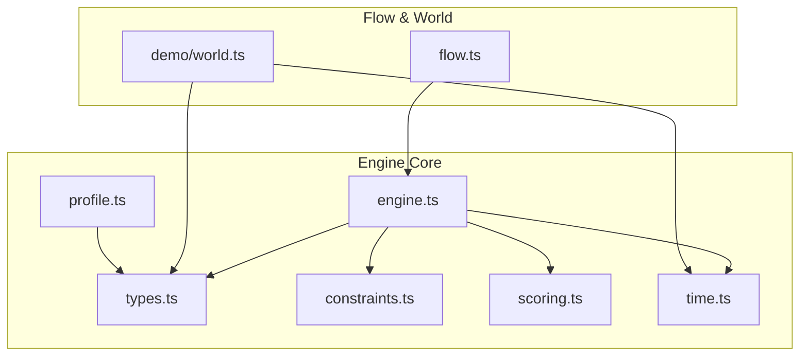
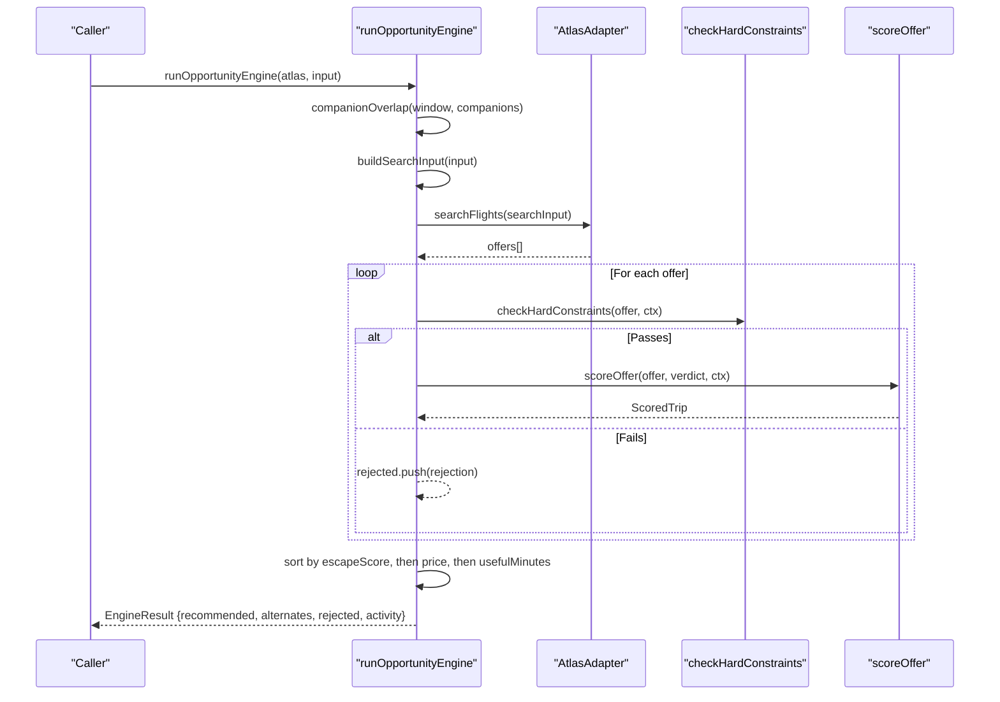
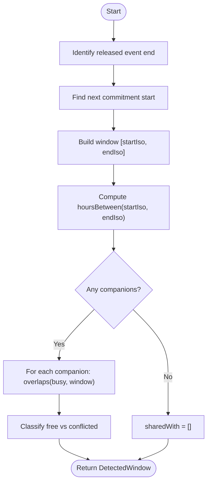
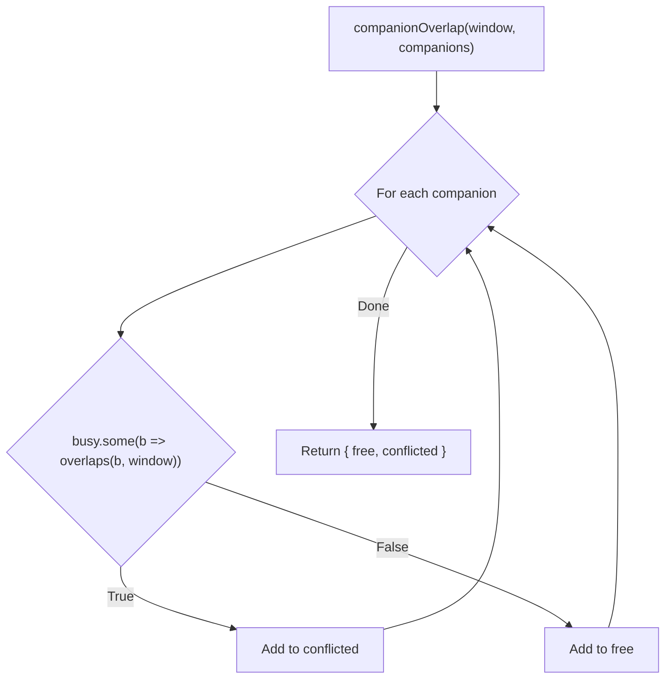
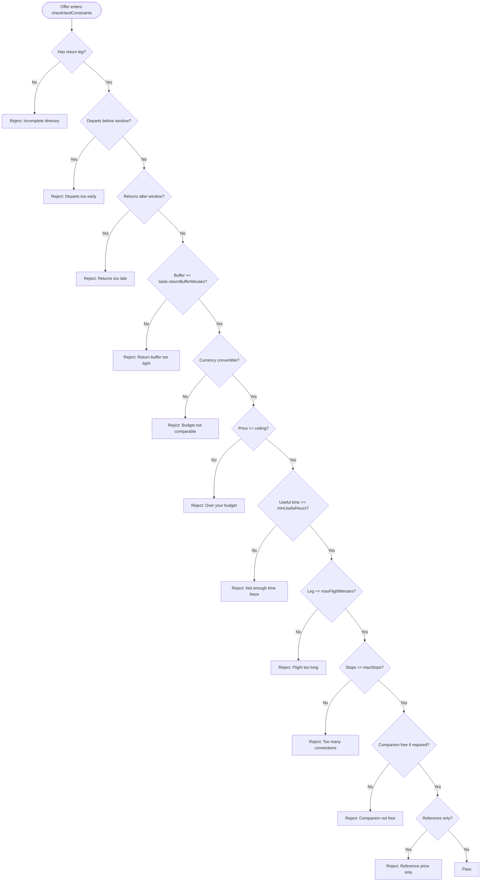
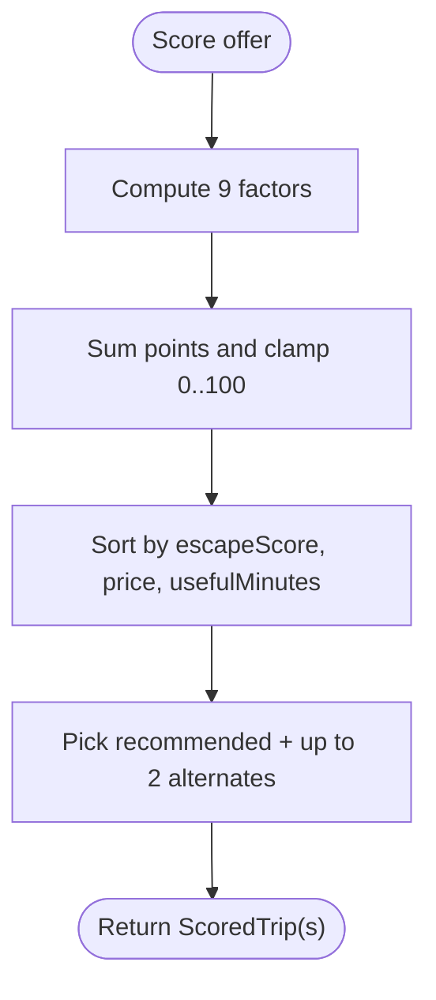
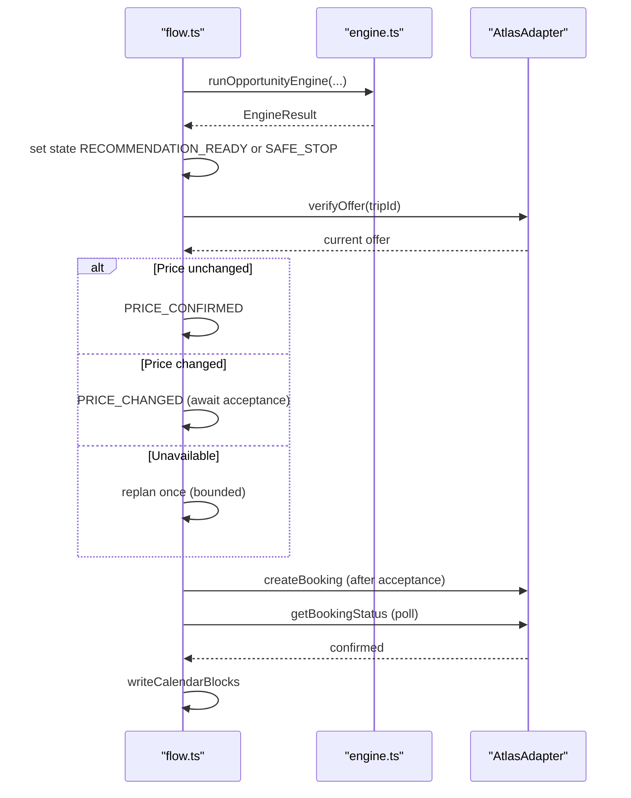
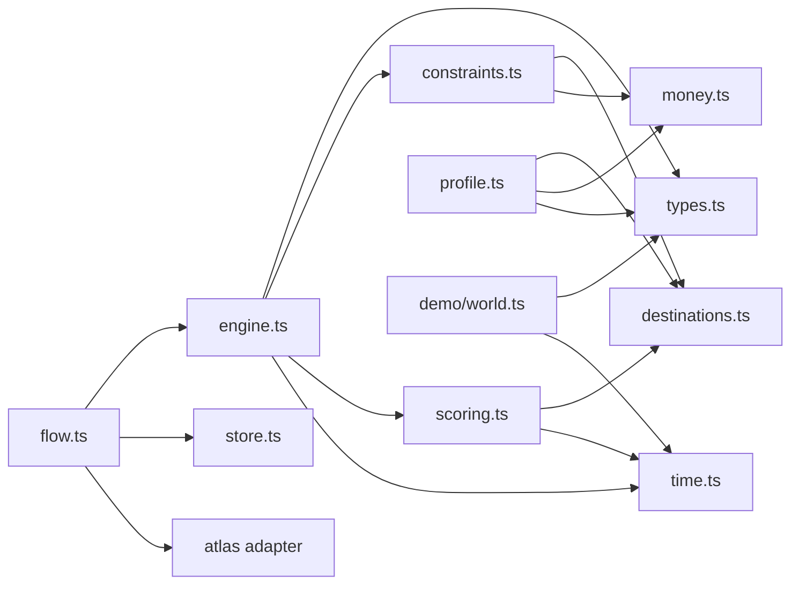

# Opportunity Engine

<cite>
**Referenced Files in This Document**
- [engine.ts](file://src/lib/calendair/engine.ts)
- [types.ts](file://src/lib/calendair/types.ts)
- [constraints.ts](file://src/lib/calendair/constraints.ts)
- [scoring.ts](file://src/lib/calendair/scoring.ts)
- [time.ts](file://src/lib/calendair/time.ts)
- [profile.ts](file://src/lib/calendair/profile.ts)
- [world.ts](file://src/lib/calendair/demo/world.ts)
- [flow.ts](file://src/lib/calendair/flow.ts)
- [engine.test.ts](file://src/lib/calendair/engine.test.ts)
</cite>

## Table of Contents
1. [Introduction](#introduction)
2. [Project Structure](#project-structure)
3. [Core Components](#core-components)
4. [Architecture Overview](#architecture-overview)
5. [Detailed Component Analysis](#detailed-component-analysis)
6. [Dependency Analysis](#dependency-analysis)
7. [Performance Considerations](#performance-considerations)
8. [Troubleshooting Guide](#troubleshooting-guide)
9. [Conclusion](#conclusion)

## Introduction
The Opportunity Engine is the deterministic core that turns calendar free/busy openings into safe, bookable travel opportunities. It detects available time windows from calendar state, validates companion availability through overlap detection, builds flight search parameters based on user preferences and constraints, filters candidates with hard rules, scores viable options, and returns a single recommended trip plus alternates, rejections, and agent activity logs.

It is designed to be predictable and auditable: all arithmetic for time, budget conversion, constraint checks, scoring, and ranking is pure code. Language models are excluded from any decision that could become a promise (budgets, durations, buffers). The engine’s safety properties are enforced by strict pass/fail constraints and bounded replanning.

**Section sources**
- [README.md:15-24](file://README.md#L15-L24)
- [README.md:73-90](file://README.md#L73-L90)
- [README.md:92-121](file://README.md#L92-L121)

## Project Structure
The Opportunity Engine lives under src/lib/calendair and is composed of focused modules:
- Types define the domain contracts for windows, companions, tastes, offers, scoring, and booking states.
- Time utilities provide deterministic arithmetic for minutes, hours, overlaps, useful time at destination, and return buffers.
- Constraints implement hard pass/fail rules that cannot be overridden by scoring.
- Scoring computes a transparent 0–100 Escape Score from nine factors.
- The engine orchestrates window validation, companion overlap, search parameter construction, provider search, filtering, scoring, ranking, and logging.
- Profile sanitization ensures untrusted inputs are clamped to safe bounds before becoming TravelTaste.
- Demo world constructs deterministic calendars and companions for repeatable scenarios.
- Flow implements the booking state machine around the engine, including reverify, price change handling, bounded replanning, and calendar write-back after fulfilment.

**Diagram sources**
- [engine.ts:1-206](file://src/lib/calendair/engine.ts#L1-L206)
- [types.ts:1-274](file://src/lib/calendair/types.ts#L1-L274)
- [constraints.ts:1-162](file://src/lib/calendair/constraints.ts#L1-L162)
- [scoring.ts:1-283](file://src/lib/calendair/scoring.ts#L1-L283)
- [time.ts:1-123](file://src/lib/calendair/time.ts#L1-L123)
- [profile.ts:1-261](file://src/lib/calendair/profile.ts#L1-L261)
- [flow.ts:1-350](file://src/lib/calendair/flow.ts#L1-L350)
- [world.ts:1-170](file://src/lib/calendair/demo/world.ts#L1-L170)

**Section sources**
- [README.md:92-114](file://README.md#L92-L114)

## Core Components
- EngineInput: the contract consumed by the engine. It includes the DetectedWindow, TravelTaste, Companion[], nextCommitmentIso, and optional adults count.
- EngineResult: the output containing FlightSearchInput, an optional recommended ScoredTrip, up to two alternates, rejected candidates, AgentActivity[], scanned offer count, and number of active constraints.
- Window detection: Deterministic windows are built from free/busy blocks; the demo world shows how a released event opens a multi-day window and how companion busy blocks can close it.
- Companion overlap: Uses interval overlap to classify companions as free or conflicted within the window.
- Search parameter construction: Builds origin, departureAfter, returnBefore, adults, cabin, and nonstopPreferred from the window and taste.
- Hard constraints: Enforce itinerary completeness, timing inside the window, return buffer, budget currency conversion and ceiling, minimum ground time, max flight duration, max stops, companion availability, and reference-only fares.
- Scoring: Computes a 0–100 score from calendar fit, useful hours, budget headroom, fare value, destination affinity, companion match, convenience, return safety, and friction.
- Activity logging: Every step is recorded with source, title, detail, ok flag, and duration.

**Section sources**
- [engine.ts:23-39](file://src/lib/calendair/engine.ts#L23-L39)
- [engine.ts:61-86](file://src/lib/calendair/engine.ts#L61-L86)
- [engine.ts:88-201](file://src/lib/calendair/engine.ts#L88-L201)
- [types.ts:17-56](file://src/lib/calendair/types.ts#L17-L56)
- [types.ts:87-114](file://src/lib/calendair/types.ts#L87-L114)
- [types.ts:116-193](file://src/lib/calendair/types.ts#L116-L193)
- [time.ts:116-122](file://src/lib/calendair/time.ts#L116-L122)
- [constraints.ts:42-161](file://src/lib/calendair/constraints.ts#L42-L161)
- [scoring.ts:56-227](file://src/lib/calendair/scoring.ts#L56-L227)
- [world.ts:84-169](file://src/lib/calendair/demo/world.ts#L84-L169)

## Architecture Overview
The engine runs deterministically end-to-end:
- Input: DetectedWindow, TravelTaste, Companions, nextCommitmentIso.
- Companion overlap check determines if shared availability exists when companionIds are present.
- Search input is built from window and taste.
- Provider search returns offers.
- Each offer passes hard constraints; failures are recorded as RejectedCandidate.
- Viable offers are scored and ranked; one hero recommendation and up to two alternates are returned.
- Activity log records each step with timing and outcomes.

**Diagram sources**
- [engine.ts:88-201](file://src/lib/calendair/engine.ts#L88-L201)
- [constraints.ts:42-161](file://src/lib/calendair/constraints.ts#L42-L161)
- [scoring.ts:56-227](file://src/lib/calendair/scoring.ts#L56-L227)

## Detailed Component Analysis

### EngineInput and EngineResult
- EngineInput fields:
  - window: DetectedWindow with start/end ISO times, origin airport, companion IDs, minUsefulHours, returnBufferMinutes.
  - taste: TravelTaste with budget, currency, flight limits, direct preference, ground time, buffer, spontaneity.
  - companions: list of Companion with id, name, relationship, and busy intervals (free/busy only, no titles).
  - nextCommitmentIso: ISO instant used to compute return buffer.
  - adults?: optional override; defaults to 2 if companionIds exist, else 1.
- EngineResult fields:
  - searchInput: FlightSearchInput sent to the provider.
  - recommended?: best ScoredTrip if any cleared constraints.
  - alternates: up to two additional ScoredTrip.
  - rejected: list of RejectedCandidate with rule and detail.
  - activity: ordered AgentActivity entries documenting every step.
  - scanned: total offers returned by provider.
  - constraintsActive: number of active hard constraints.

Concrete example references:
- Adults defaulting logic: see [buildSearchInput:77-86](file://src/lib/calendair/engine.ts#L77-L86).
- Recommended and alternates selection: see [ranking and slicing:171-196](file://src/lib/calendair/engine.ts#L171-L196).
- Activity events for understanding window, constraints, search, filtering, scoring: see [activity pushes:96-129](file://src/lib/calendair/engine.ts#L96-L129), [search event:131-141](file://src/lib/calendair/engine.ts#L131-L141), [filtering event:162-169](file://src/lib/calendair/engine.ts#L162-L169), [scoring event:181-190](file://src/lib/calendair/engine.ts#L181-L190).

**Section sources**
- [engine.ts:23-39](file://src/lib/calendair/engine.ts#L23-L39)
- [engine.ts:77-86](file://src/lib/calendair/engine.ts#L77-L86)
- [engine.ts:171-196](file://src/lib/calendair/engine.ts#L171-L196)
- [types.ts:17-56](file://src/lib/calendair/types.ts#L17-L56)
- [types.ts:87-114](file://src/lib/calendair/types.ts#L87-L114)
- [types.ts:116-193](file://src/lib/calendair/types.ts#L116-L193)

### Window Detection Algorithm
- The demo world constructs a deterministic window starting when a released event ends and closing at the next commitment.
- Hours are computed using deterministic minute arithmetic.
- SharedWith and ConflictedWith lists are derived by checking companion busy intervals against the window.
- The openedBy field captures the releasing event metadata when present.

Algorithm outline:
- Identify the release point (when a busy block ends).
- Determine the next commitment boundary.
- Compute window start and end ISO instants.
- Measure hours between start and end.
- For each companion, test overlap with window to populate sharedWith/conflictedWith.

**Diagram sources**
- [world.ts:84-169](file://src/lib/calendair/demo/world.ts#L84-L169)
- [time.ts:20-26](file://src/lib/calendair/time.ts#L20-L26)
- [time.ts:116-122](file://src/lib/calendair/time.ts#L116-L122)

**Section sources**
- [world.ts:84-169](file://src/lib/calendair/demo/world.ts#L84-L169)
- [time.ts:20-26](file://src/lib/calendair/time.ts#L20-L26)
- [time.ts:116-122](file://src/lib/calendair/time.ts#L116-L122)

### Companion Availability and Conflict Resolution
- companionOverlap compares each companion’s busy intervals against the window using interval overlap.
- If any busy block overlaps the window, the companion is marked conflicted; otherwise free.
- When companionIds are present but none are free, the engine treats the window as not shared, which causes all offers to fail the “Companion not free” hard constraint.

Conflict resolution behavior:
- No companions: always considered available for sharing.
- One or more companions: requires at least one free to proceed; otherwise entire window is rejected.

**Diagram sources**
- [engine.ts:61-75](file://src/lib/calendair/engine.ts#L61-L75)
- [time.ts:116-122](file://src/lib/calendair/time.ts#L116-L122)

**Section sources**
- [engine.ts:61-75](file://src/lib/calendair/engine.ts#L61-L75)
- [engine.test.ts:35-53](file://src/lib/calendair/engine.test.ts#L35-L53)

### Search Parameter Construction
- buildSearchInput derives:
  - origin from window.originAirport.
  - departureAfter from window.startIso.
  - returnBefore from window.endIso.
  - adults from input.adults or default: 2 if companionIds exist, else 1.
  - cabin set to ECONOMY.
  - nonstopPreferred from taste.directPreferred.

This ensures the provider search respects both the temporal window and user preferences without exposing sensitive data.

**Section sources**
- [engine.ts:77-86](file://src/lib/calendair/engine.ts#L77-L86)
- [types.ts:106-114](file://src/lib/calendair/types.ts#L106-L114)

### Hard Constraint Filtering
The engine enforces these hard rules in order; the first failing rule becomes the rejection reason:
- Incomplete itinerary: must have return leg inside the window.
- Departs too early: outbound departure must be after window start.
- Returns too late: return arrival must be before window end.
- Return buffer too tight: buffer between return arrival and next commitment must meet taste.returnBufferMinutes.
- Budget not comparable: currency conversion must succeed; otherwise reject.
- Over your budget: totalPrice must be within converted ceiling.
- Not enough time there: usefulTimeAtDestination must meet minUsefulHours.
- Flight too long: outbound leg duration must be within maxFlightMinutes.
- Too many connections: stops must be within maxStops.
- Companion not free: if companionIds exist, at least one companion must be free.
- Reference price only: reference-only offers cannot be booked.

These rules ensure safety: no score can override a hard failure, and mismatched units are refused rather than guessed.

**Diagram sources**
- [constraints.ts:42-161](file://src/lib/calendair/constraints.ts#L42-L161)

**Section sources**
- [constraints.ts:42-161](file://src/lib/calendair/constraints.ts#L42-L161)
- [engine.test.ts:69-112](file://src/lib/calendair/engine.test.ts#L69-L112)

### Scoring and Ranking
- Escape Score is a 0–100 sum of weighted factors:
  - Calendar fit: how well the trip uses the opening.
  - Useful hours: ground time measured locally at destination.
  - Budget headroom: distance below the converted ceiling.
  - Fare value: ratio to base fare for the route.
  - Destination affinity: dream list position and interest tags.
  - Companion match: bonus if both calendars fit.
  - Convenience: non-stop preference and leg length.
  - Return safety: buffer relative to taste.
  - Friction: penalties for red-eye or unwanted connections.
- Ranking: highest escapeScore wins; ties break on lower totalPrice, then longer usefulMinutes.
- Output includes reasons and opportunity type classification.

**Diagram sources**
- [scoring.ts:56-227](file://src/lib/calendair/scoring.ts#L56-L227)
- [engine.ts:171-196](file://src/lib/calendair/engine.ts#L171-L196)

**Section sources**
- [scoring.ts:56-227](file://src/lib/calendair/scoring.ts#L56-L227)
- [engine.ts:171-196](file://src/lib/calendair/engine.ts#L171-L196)

### Profile and Taste Sanitization
- TravellerProfile is sanitized to enforce bounds on spend, flight minutes, stops, useful hours, buffer, interests, dreams, and text fields.
- tasteFromProfile projects a clean TravelTaste consumed by the engine.
- DEMO_PROFILE provides a deterministic fallback so the engine can run without user input.

Safety properties:
- Stated preferences cannot widen hard rules beyond bounds.
- Unknown currencies or timezones degrade safely to known defaults.

**Section sources**
- [profile.ts:51-67](file://src/lib/calendair/profile.ts#L51-L67)
- [profile.ts:79-100](file://src/lib/calendair/profile.ts#L79-L100)
- [profile.ts:160-239](file://src/lib/calendair/profile.ts#L160-L239)
- [profile.ts:242-260](file://src/lib/calendair/profile.ts#L242-L260)

### Flow Integration and Safety Properties
- scan calls runOpportunityEngine and sets session state to RECOMMENDATION_READY or SAFE_STOP.
- authorize re-reads the live offer immediately before writing anything; price changes stop the flow until explicit acceptance.
- reverify handles unavailable offers by offering a replacement once (bounded by MAX_REPLANS), never substituting silently.
- book creates a booking only after price confirmation; state remains pending until fulfilment confirms.
- pollFulfilment writes calendar blocks only after confirmed fulfilment.

**Diagram sources**
- [flow.ts:22-45](file://src/lib/calendair/flow.ts#L22-L45)
- [flow.ts:65-176](file://src/lib/calendair/flow.ts#L65-L176)
- [flow.ts:218-280](file://src/lib/calendair/flow.ts#L218-L280)
- [flow.ts:288-343](file://src/lib/calendair/flow.ts#L288-L343)

**Section sources**
- [flow.ts:22-45](file://src/lib/calendair/flow.ts#L22-L45)
- [flow.ts:65-176](file://src/lib/calendair/flow.ts#L65-L176)
- [flow.ts:218-280](file://src/lib/calendair/flow.ts#L218-L280)
- [flow.ts:288-343](file://src/lib/calendair/flow.ts#L288-L343)

## Dependency Analysis
- engine.ts depends on:
  - types.ts for domain shapes.
  - constraints.ts for hard rule evaluation.
  - scoring.ts for Escape Score computation.
  - time.ts for overlap and duration helpers.
  - atlas adapter via interface for searchFlights.
- constraints.ts depends on:
  - destinations.ts for IATA lookup.
  - money.ts for currency conversion.
  - time.ts for duration and useful time calculations.
- scoring.ts depends on:
  - destinations.ts for base fare and tags.
  - time.ts for duration helpers.
- profile.ts depends on:
  - destinations.ts for origin mapping.
  - money.ts for currency support.
  - types.ts for enums and structures.
- world.ts depends on:
  - types.ts and time.ts to construct deterministic calendars and windows.
- flow.ts depends on:
  - engine.ts to run the opportunity engine.
  - store.ts for session and activity.
  - atlas adapter for verification, booking, and status polling.

**Diagram sources**
- [engine.ts:1-13](file://src/lib/calendair/engine.ts#L1-L13)
- [constraints.ts:1-4](file://src/lib/calendair/constraints.ts#L1-L4)
- [scoring.ts:1-11](file://src/lib/calendair/scoring.ts#L1-L11)
- [profile.ts:1-10](file://src/lib/calendair/profile.ts#L1-L10)
- [world.ts:1-10](file://src/lib/calendair/demo/world.ts#L1-L10)
- [flow.ts:1-6](file://src/lib/calendair/flow.ts#L1-L6)

**Section sources**
- [engine.ts:1-13](file://src/lib/calendair/engine.ts#L1-L13)
- [constraints.ts:1-4](file://src/lib/calendair/constraints.ts#L1-L4)
- [scoring.ts:1-11](file://src/lib/calendair/scoring.ts#L1-L11)
- [profile.ts:1-10](file://src/lib/calendair/profile.ts#L1-L10)
- [world.ts:1-10](file://src/lib/calendair/demo/world.ts#L1-L10)
- [flow.ts:1-6](file://src/lib/calendair/flow.ts#L1-L6)

## Performance Considerations
- Deterministic arithmetic avoids timezone pitfalls and reduces error-prone parsing overhead.
- Overlap checks are linear in the number of busy blocks per companion; keep companion busy lists concise.
- Hard constraints short-circuit on the first failure, minimizing unnecessary work.
- Scoring is O(n) over offers with constant-time factor computations; sorting is O(n log n).
- Reverification reads live offers only when needed, reducing provider load.
- Bounded replanning prevents runaway loops when offers expire.

[No sources needed since this section provides general guidance]

## Troubleshooting Guide
Common issues and where to look:
- No recommendation produced:
  - Check rejected list for the first failing rule; inspect constraint details.
  - Verify companion overlap; conflicts will reject the whole window.
  - Confirm window hours and nextCommitmentIso are correct.
- Price changed during authorization:
  - Flow stops at PRICE_CHANGED; accept the new price explicitly before proceeding.
- Offer sold out:
  - Flow replans once (bounded); if no replacement clears constraints, safe stop occurs.
- Booking not confirmed:
  - Ensure fulfilment polling reports confirmed state before calendar write-back.
- Activity log missing details:
  - Ensure activity events are pushed at each stage; check source and ok flags.

**Section sources**
- [engine.test.ts:69-112](file://src/lib/calendair/engine.test.ts#L69-L112)
- [flow.ts:65-176](file://src/lib/calendair/flow.ts#L65-L176)
- [flow.ts:218-280](file://src/lib/calendair/flow.ts#L218-L280)

## Conclusion
The Opportunity Engine transforms calendar openings into safe, bookable trips through deterministic window detection, companion overlap validation, constraint-based filtering, and transparent scoring. Its design prioritizes safety and predictability: hard constraints cannot be overridden by scoring, budgets are compared in consistent currencies, and bookings only proceed after explicit human checkpoints and verified fulfilment. The result is a reliable, auditable pipeline that delivers one hero recommendation with alternates, detailed rejections, and full activity logging.

[No sources needed since this section summarizes without analyzing specific files]