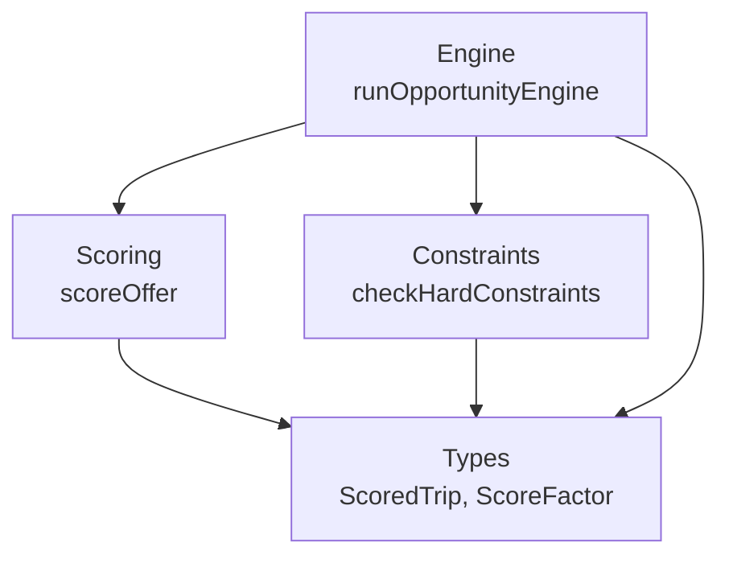
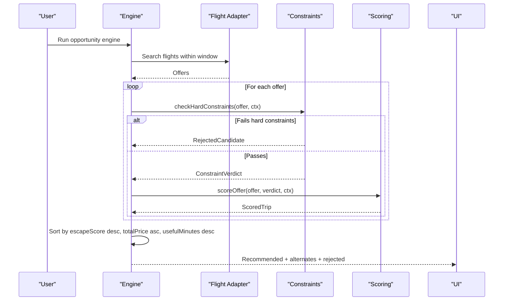
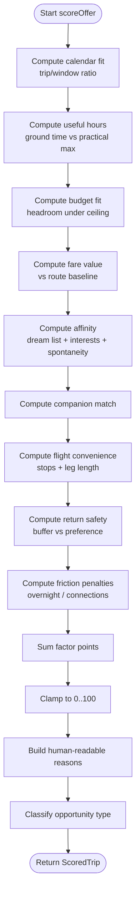
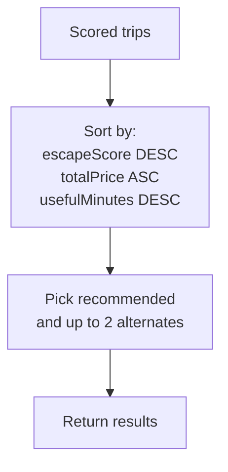
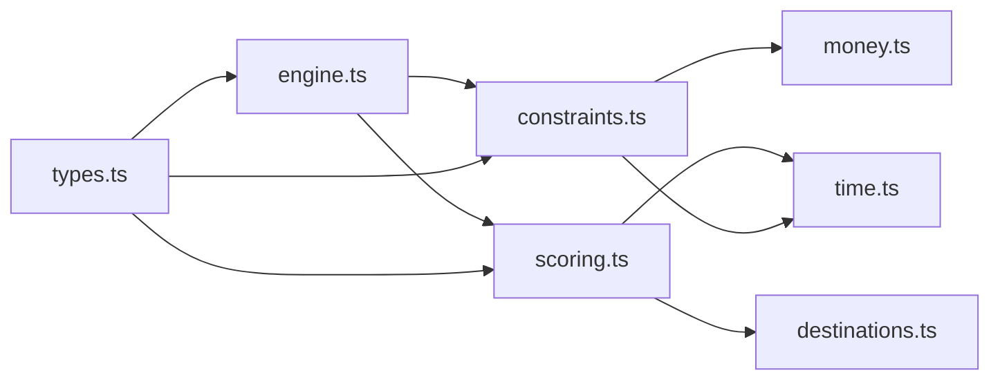

# Scoring Algorithm

<cite>
**Referenced Files in This Document**
- [scoring.ts](file://src/lib/calendair/scoring.ts)
- [types.ts](file://src/lib/calendair/types.ts)
- [engine.ts](file://src/lib/calendair/engine.ts)
- [constraints.ts](file://src/lib/calendair/constraints.ts)
- [profile.test.ts](file://src/lib/calendair/profile.test.ts)
</cite>

## Table of Contents
1. [Introduction](#introduction)
2. [Project Structure](#project-structure)
3. [Core Components](#core-components)
4. [Architecture Overview](#architecture-overview)
5. [Detailed Component Analysis](#detailed-component-analysis)
6. [Dependency Analysis](#dependency-analysis)
7. [Performance Considerations](#performance-considerations)
8. [Troubleshooting Guide](#troubleshooting-guide)
9. [Conclusion](#conclusion)

## Introduction
This document explains CALENDAIR’s scoring algorithm that evaluates trip suitability beyond basic constraints. It focuses on the scoreOffer function, which computes an “escape score” from multiple factors including calendar fit, useful time at destination, budget headroom, fare value, destination affinity (dream list and interests), companion availability, flight convenience, return safety, and friction penalties. It also documents the ScoredTrip interface with enhanced metadata such as total prices, useful minutes, and reasons, and explains the ranking algorithm that selects the best trip by escape score, then price, then useful duration. Finally, it clarifies how scoring interacts with hard constraints and how scores influence recommendation selection.

## Project Structure
The scoring system is implemented in a small set of focused modules:
- Scoring logic and factor computation live in the scoring module.
- Data contracts for offers, scored trips, and preferences are defined in the types module.
- Hard constraint evaluation and context flow into scoring via the constraints module.
- The engine orchestrates search, filtering, scoring, and ranking to produce recommendations.
- Tests validate behavior across profiles and ensure deterministic scoring properties.

**Diagram sources**
- [engine.ts:88-201](file://src/lib/calendair/engine.ts#L88-L201)
- [constraints.ts:42-161](file://src/lib/calendair/constraints.ts#L42-L161)
- [scoring.ts:56-227](file://src/lib/calendair/scoring.ts#L56-L227)
- [types.ts:140-176](file://src/lib/calendair/types.ts#L140-L176)

**Section sources**
- [engine.ts:88-201](file://src/lib/calendair/engine.ts#L88-L201)
- [constraints.ts:42-161](file://src/lib/calendair/constraints.ts#L42-L161)
- [scoring.ts:56-227](file://src/lib/calendair/scoring.ts#L56-L227)
- [types.ts:140-176](file://src/lib/calendair/types.ts#L140-L176)

## Core Components
- Escape Score: A transparent 0–100 composite built from nine weighted factors. It measures how well a trip fits a life rather than luxury alone.
- Factors: Each factor contributes weighted points, including calendar fit, useful hours, budget fit, fare value, affinity, companion match, convenience, return safety, and friction penalties.
- ScoredTrip: An enriched offer carrying usefulMinutes, returnBufferMinutes, escapeScore, factors, reasons, opportunityType, dreamMatch, and destination metadata.
- Ranking: Trips are sorted by highest escape score first; ties break on lower totalPrice, then longer usefulMinutes.

Key behaviors validated by tests:
- The escape score equals the sum of its factor points and is clamped to 0–100.
- Spontaneity affects only destination affinity baseline, not budgets or buffers.
- Interests lift affinity but cannot exceed a dream-list ceiling.

**Section sources**
- [scoring.ts:13-32](file://src/lib/calendair/scoring.ts#L13-L32)
- [scoring.ts:56-227](file://src/lib/calendair/scoring.ts#L56-L227)
- [types.ts:140-176](file://src/lib/calendair/types.ts#L140-L176)
- [profile.test.ts:249-261](file://src/lib/calendair/profile.test.ts#L249-L261)
- [profile.test.ts:264-277](file://src/lib/calendair/profile.test.ts#L264-L277)

## Architecture Overview
The end-to-end flow:
1. The engine builds a search input from the detected window and taste.
2. Offers are retrieved from the flight adapter.
3. Each offer is evaluated against hard constraints; failing offers are rejected.
4. Viable offers are scored using scoreOffer, producing ScoredTrip objects with detailed factors and reasons.
5. Results are ranked by escape score, then cheaper price, then longer useful duration.
6. The top result becomes the recommended trip; up to two alternates are returned.

**Diagram sources**
- [engine.ts:88-201](file://src/lib/calendair/engine.ts#L88-L201)
- [constraints.ts:42-161](file://src/lib/calendair/constraints.ts#L42-L161)
- [scoring.ts:56-227](file://src/lib/calendair/scoring.ts#L56-L227)

## Detailed Component Analysis

### scoreOffer: Escape Score Calculation
The scoreOffer function computes a normalized 0–100 escape score from nine factors. Inputs include a NormalizedOffer, a ConstraintVerdict (from hard checks), and a ConstraintContext (window, taste, next commitment, companion availability).

Factors and their roles:
- Calendar fit: Rewards using a meaningful share of the available opening without straining it. Points scale with the proportion of the window used, capped to avoid over-rewarding overly long trips relative to the window.
- Useful time there: Rewards ground time at destination, measured in useful minutes derived from the constraint verdict and contextualized against practical maximums based on window size.
- Budget fit: Rewards headroom under the spending ceiling, expressed in the offer’s currency. It does not reward cheapness for its own sake; it rewards staying comfortably below the user’s limit.
- Fare value: Rewards fares that are below the route’s typical base fare, comparing the offer’s total price to a baseline per destination.
- Destination affinity: Combines dream-list presence and interest matching. Dream matches cap at the maximum; otherwise, a spontaneity-based baseline plus interest overlap lifts affinity.
- Companion match: Awards points when both calendars are free for the whole window.
- Flight convenience: Rewards non-stop flights and shorter leg durations relative to the user’s tolerance.
- Return safety: Rewards buffer before the next commitment, scaled against the user’s preferred buffer.
- Friction: Penalizes known dislikes such as overnight departures or connections when direct is preferred.

Final score: Sum of all factor points, clamped to 0–100.

**Diagram sources**
- [scoring.ts:56-227](file://src/lib/calendair/scoring.ts#L56-L227)

**Section sources**
- [scoring.ts:56-227](file://src/lib/calendair/scoring.ts#L56-L227)

### ScoredTrip Interface
ScoredTrip extends NormalizedOffer with scoring metadata:
- usefulMinutes: Ground time at destination in minutes.
- returnBufferMinutes: Buffer before the next commitment in minutes.
- escapeScore: Composite 0–100 score.
- factors: Array of ScoreFactor entries with id, label, points, max, and detail.
- reasons: Human-readable explanations for why the trip fits.
- destinationName, destinationCountry: Enriched destination info.
- opportunityType: Classification like unexpected-escape, shared-opening, dream-match, price-match, long-weekend, milestone-match, wildcard.
- dreamMatch: Optional percentage indicating strength of dream-list match.
- promise: Destination promise text.
- qwenExplanation: Optional language-only explanation added later.

These fields enable rich UI presentation and transparency around scoring decisions.

**Section sources**
- [types.ts:140-176](file://src/lib/calendair/types.ts#L140-L176)
- [scoring.ts:214-227](file://src/lib/calendair/scoring.ts#L214-L227)

### Ranking Algorithm
After scoring, the engine sorts candidates deterministically:
1. Highest escape score first.
2. If tied, lower totalPrice wins (cheaper preferred).
3. If still tied, longer usefulMinutes wins (more ground time preferred).

The top result becomes the recommended trip; up to two alternates are returned.

**Diagram sources**
- [engine.ts:171-177](file://src/lib/calendair/engine.ts#L171-L177)

**Section sources**
- [engine.ts:171-177](file://src/lib/calendair/engine.ts#L171-L177)

### Preference Weighting Mechanisms
- Spontaneity: Adjusts the baseline for unfamiliar destinations in affinity. Higher spontaneity increases the baseline score for unknown places, encouraging exploration without altering hard constraints.
- Interests: Overlap between user interests and destination tags adds to affinity, capped so it cannot surpass a dream-list match.
- Dream list: Strongest signal; if present, affinity reaches its maximum and cannot be exceeded by interests.
- Direct preference and red-eye tolerance: Influence convenience and friction factors respectively.

Tests confirm:
- Affinity increases with matching interests.
- Spontaneity changes affinity for unfamiliar destinations.
- The final escape score equals the sum of factor points and stays within 0–100.

**Section sources**
- [scoring.ts:122-150](file://src/lib/calendair/scoring.ts#L122-L150)
- [scoring.ts:183-207](file://src/lib/calendair/scoring.ts#L183-L207)
- [profile.test.ts:220-247](file://src/lib/calendair/profile.test.ts#L220-L247)
- [profile.test.ts:249-261](file://src/lib/calendair/profile.test.ts#L249-L261)
- [profile.test.ts:264-277](file://src/lib/calendair/profile.test.ts#L264-L277)

### Examples of Score Calculation Across Trip Types
While exact numeric examples depend on inputs, the following patterns illustrate how different trip characteristics affect scoring:
- Short weekend with tight schedule: Lower calendar fit if the trip consumes too much of the window; return safety may penalize tight buffers.
- Long-haul with many stops: Lower convenience due to stops and longer legs; friction may apply if connections conflict with preferences.
- Dream destination with good fare: High affinity and possibly high fare value; overall escape score benefits unless other factors drag down.
- Shared opening with companion: Companion match adds points; if both calendars align, this can tip close calls.
- Price-sensitive traveler: Budget fit rewards staying well under the ceiling; fare value rewards below-baseline fares.

These patterns emerge directly from the factor computations and weights.

**Section sources**
- [scoring.ts:65-78](file://src/lib/calendair/scoring.ts#L65-L78)
- [scoring.ts:80-90](file://src/lib/calendair/scoring.ts#L80-L90)
- [scoring.ts:92-120](file://src/lib/calendair/scoring.ts#L92-L120)
- [scoring.ts:161-171](file://src/lib/calendair/scoring.ts#L161-L171)
- [scoring.ts:173-181](file://src/lib/calendair/scoring.ts#L173-L181)

### Balancing Cost Versus Experience Quality
Cost and experience quality are balanced through distinct factors:
- Budget fit and fare value capture cost considerations: headroom under the ceiling and comparison to route baselines.
- Experience quality is captured by calendar fit, useful hours, affinity, companion match, convenience, and return safety.
- Friction ensures disliked elements reduce the score even if cost is favorable.
- Ranking uses escape score first, then price, then useful duration, ensuring quality leads while still preferring cheaper options when scores tie.

**Section sources**
- [scoring.ts:92-120](file://src/lib/calendair/scoring.ts#L92-L120)
- [scoring.ts:65-90](file://src/lib/calendair/scoring.ts#L65-L90)
- [engine.ts:171-177](file://src/lib/calendair/engine.ts#L171-L177)

### Relationship Between Scoring and Constraints
Hard constraints act as pass/fail gates before scoring:
- Incomplete itineraries, departure/return timing violations, insufficient return buffer, budget ceiling, minimum useful time, flight length, stops, companion availability, and reference-only fares are enforced strictly.
- Only offers passing all constraints enter scoring.
- ConstraintVerdict provides usefulMinutes, nights, days, returnBufferMinutes, and ceiling to scoring, ensuring consistent units and safe comparisons.

Scores never override hard constraints; they rank viable options.

**Section sources**
- [constraints.ts:42-161](file://src/lib/calendair/constraints.ts#L42-L161)
- [engine.ts:153-160](file://src/lib/calendair/engine.ts#L153-L160)

### How Scores Influence Recommendation Selection
- The engine filters out non-viable offers via constraints.
- It scores all viable offers and sorts them by escape score, then price, then useful duration.
- The top-ranked trip becomes the recommended option; up to two alternates follow.
- Reasons and factors provide transparency for why a trip was selected.

**Section sources**
- [engine.ts:153-177](file://src/lib/calendair/engine.ts#L153-L177)
- [scoring.ts:214-227](file://src/lib/calendair/scoring.ts#L214-L227)

## Dependency Analysis
The scoring system depends on:
- Destinations catalog for baseline fares and metadata.
- Time utilities for computing minutes and useful stay.
- Money utilities for currency conversion in constraints.
- Types for consistent interfaces across modules.

**Diagram sources**
- [scoring.ts:1-11](file://src/lib/calendair/scoring.ts#L1-L11)
- [constraints.ts:1-4](file://src/lib/calendair/constraints.ts#L1-L4)
- [engine.ts:1-13](file://src/lib/calendair/engine.ts#L1-L13)
- [types.ts:1-12](file://src/lib/calendair/types.ts#L1-L12)

**Section sources**
- [scoring.ts:1-11](file://src/lib/calendair/scoring.ts#L1-L11)
- [constraints.ts:1-4](file://src/lib/calendair/constraints.ts#L1-L4)
- [engine.ts:1-13](file://src/lib/calendair/engine.ts#L1-L13)
- [types.ts:1-12](file://src/lib/calendair/types.ts#L1-L12)

## Performance Considerations
- Scoring is deterministic and lightweight: constant-time operations per offer with simple arithmetic and clamping.
- Sorting is O(n log n) over viable offers; typically small sets after hard filtering.
- Currency conversion and time calculations are minimal and bounded.
- Avoid unnecessary recomputation by caching destination metadata and taste-derived constants where appropriate.

[No sources needed since this section provides general guidance]

## Troubleshooting Guide
Common issues and diagnostics:
- No recommendations: Check rejected list for hard constraint failures such as budget, buffer, or incomplete itinerary.
- Unexpected low scores: Inspect factors for friction penalties (overnight departures, connections) or poor calendar fit.
- Affinity surprises: Verify dream list ordering and interest overlap; spontaneity affects unfamiliar destinations only.
- Budget anomalies: Ensure currency conversion succeeds; mismatched currencies lead to rejection or zero headroom.

Use the reasons and factors arrays on ScoredTrip to understand why a trip scored as it did.

**Section sources**
- [engine.ts:153-177](file://src/lib/calendair/engine.ts#L153-L177)
- [scoring.ts:229-255](file://src/lib/calendair/scoring.ts#L229-L255)
- [constraints.ts:42-161](file://src/lib/calendair/constraints.ts#L42-L161)

## Conclusion
CALENDAIR’s scoring algorithm produces a transparent, deterministic escape score that balances practical fit, cost, and personal preferences. Hard constraints ensure safety and feasibility; scoring ranks viable options by quality, then cost, then usefulness. The ScoredTrip interface exposes rich metadata for transparency and user understanding. Together, these components deliver reliable, explainable recommendations grounded in real constraints and user taste.

[No sources needed since this section summarizes without analyzing specific files]