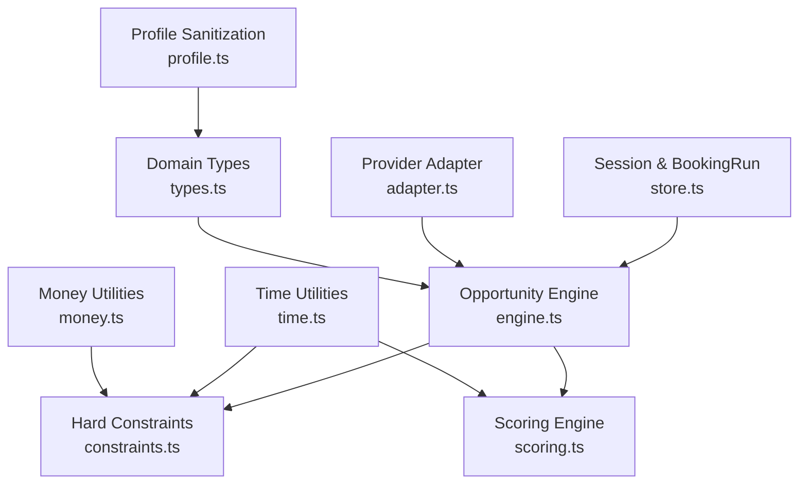
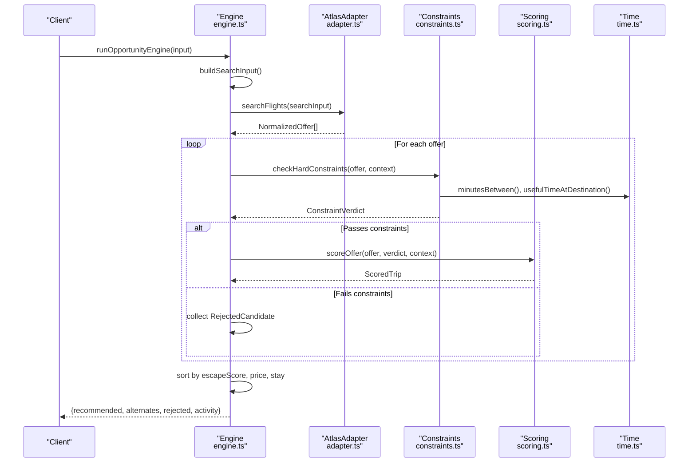
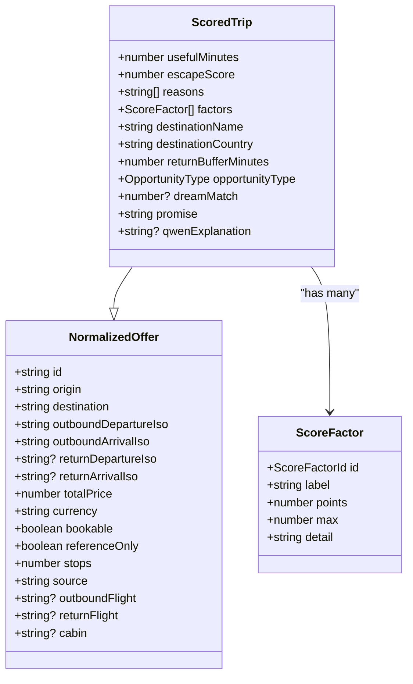
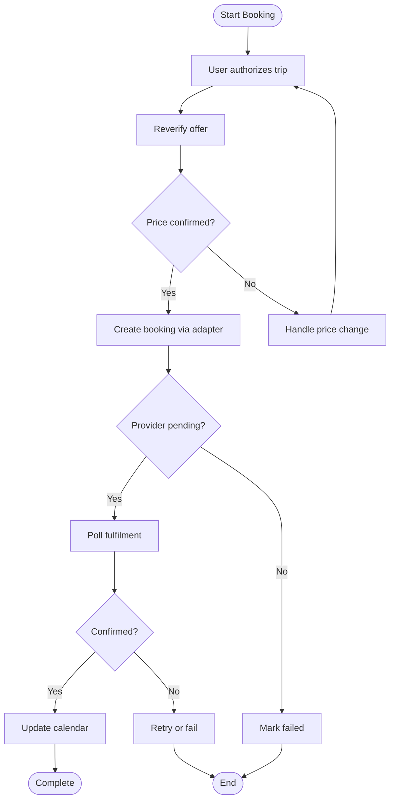
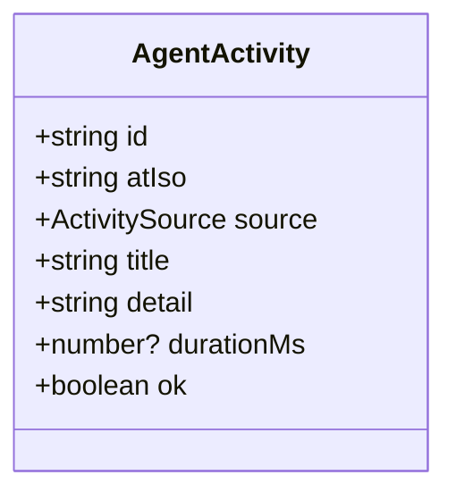
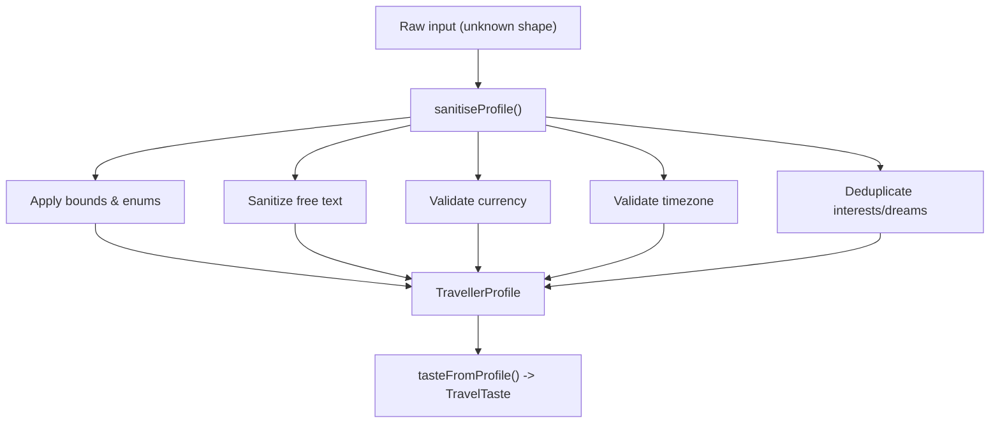
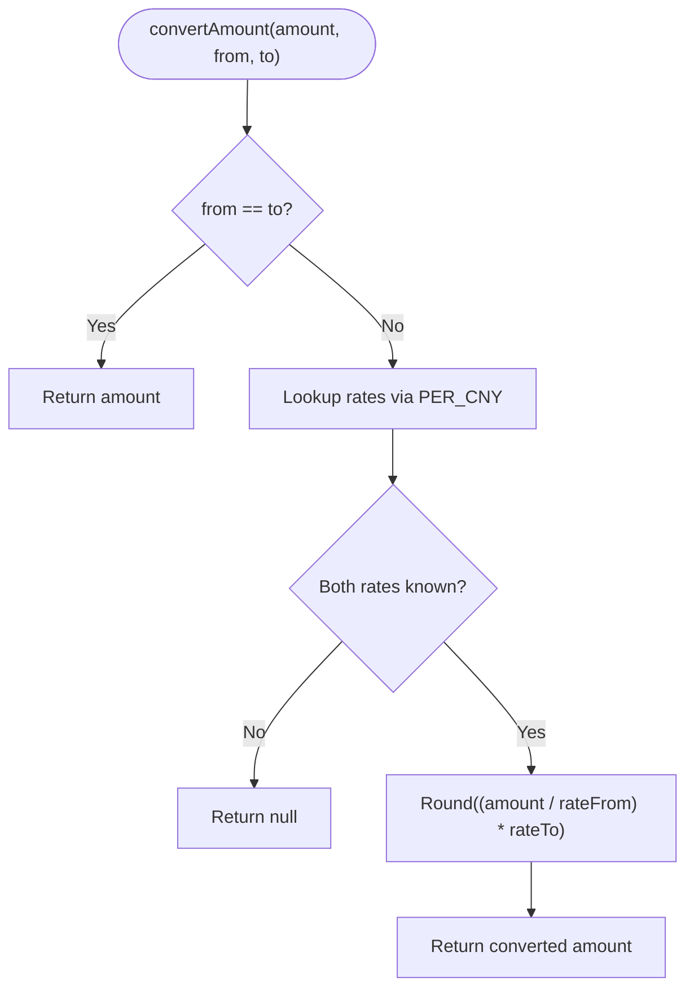
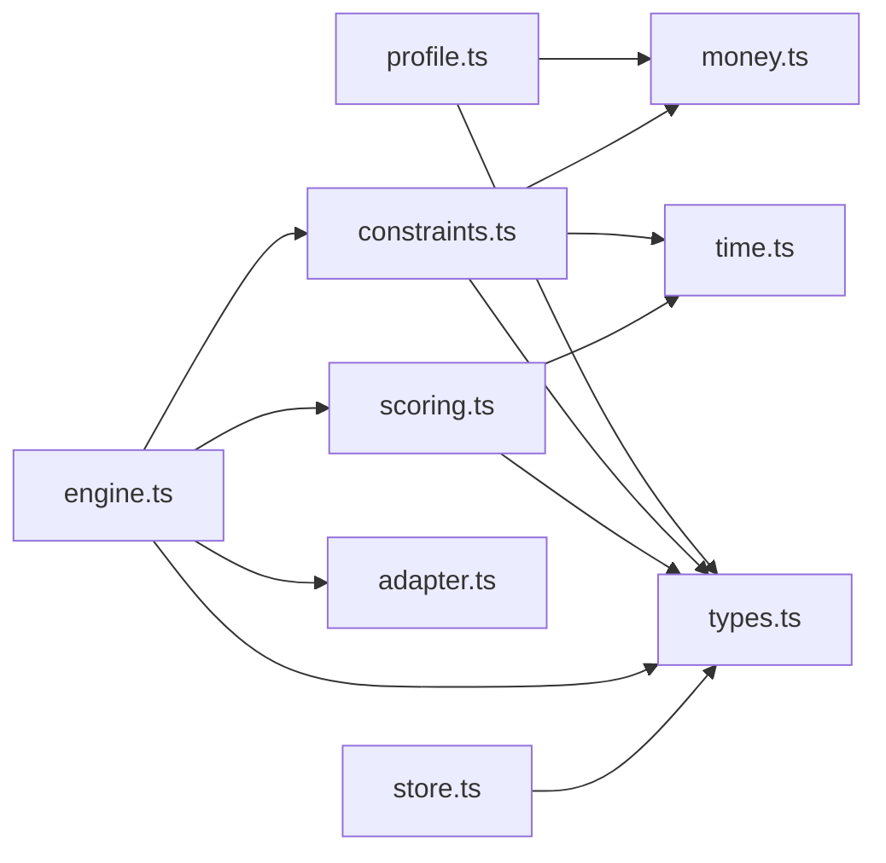

# Data Models & Types

<cite>
**Referenced Files in This Document**
- [types.ts](file://src/lib/calendair/types.ts)
- [profile.ts](file://src/lib/calendair/profile.ts)
- [money.ts](file://src/lib/calendair/money.ts)
- [constraints.ts](file://src/lib/calendair/constraints.ts)
- [scoring.ts](file://src/lib/calendair/scoring.ts)
- [engine.ts](file://src/lib/calendair/engine.ts)
- [time.ts](file://src/lib/calendair/time.ts)
- [adapter.ts](file://src/lib/atlas/adapter.ts)
- [store.ts](file://src/lib/calendair/store.ts)
</cite>

## Table of Contents
1. [Introduction](#introduction)
2. [Project Structure](#project-structure)
3. [Core Components](#core-components)
4. [Architecture Overview](#architecture-overview)
5. [Detailed Component Analysis](#detailed-component-analysis)
6. [Dependency Analysis](#dependency-analysis)
7. [Performance Considerations](#performance-considerations)
8. [Troubleshooting Guide](#troubleshooting-guide)
9. [Conclusion](#conclusion)
10. [Appendices](#appendices)

## Introduction
This document describes CALENDAIR’s TypeScript data model and type system with a focus on domain entities, profile handling, money utilities, and the scoring and constraint pipeline that turns calendar windows into ranked trip recommendations. It explains how types are validated and transformed, how budgets are compared across currencies, and how to extend or create new domain entities while preserving type safety.

## Project Structure
The data model is centered in the calendair library:
- Domain types and contracts live in a single types file for clarity and reuse.
- Profile sanitization and projection to engine inputs live in a dedicated module.
- Money conversion utilities provide deterministic currency normalization.
- Constraints enforce hard pass/fail rules before scoring.
- Scoring computes a transparent 0–100 score from multiple factors.
- The engine orchestrates search input construction, provider calls, filtering, scoring, and ranking.
- Time utilities ensure deterministic date math and overlap checks.
- An adapter interface abstracts the travel provider integration.



**Diagram sources**
- [types.ts:1-274](file://src/lib/calendair/types.ts#L1-L274)
- [profile.ts:1-261](file://src/lib/calendair/profile.ts#L1-L261)
- [money.ts:1-53](file://src/lib/calendair/money.ts#L1-L53)
- [constraints.ts:1-162](file://src/lib/calendair/constraints.ts#L1-L162)
- [scoring.ts:1-283](file://src/lib/calendair/scoring.ts#L1-L283)
- [engine.ts:1-206](file://src/lib/calendair/engine.ts#L1-L206)
- [time.ts:1-123](file://src/lib/calendair/time.ts#L1-L123)
- [adapter.ts:1-79](file://src/lib/atlas/adapter.ts#L1-L79)
- [store.ts:20-60](file://src/lib/calendair/store.ts#L20-L60)

**Section sources**
- [types.ts:1-274](file://src/lib/calendair/types.ts#L1-L274)
- [profile.ts:1-261](file://src/lib/calendair/profile.ts#L1-L261)
- [money.ts:1-53](file://src/lib/calendair/money.ts#L1-L53)
- [constraints.ts:1-162](file://src/lib/calendair/constraints.ts#L1-L162)
- [scoring.ts:1-283](file://src/lib/calendair/scoring.ts#L1-L283)
- [engine.ts:1-206](file://src/lib/calendair/engine.ts#L1-L206)
- [time.ts:1-123](file://src/lib/calendair/time.ts#L1-L123)
- [adapter.ts:1-79](file://src/lib/atlas/adapter.ts#L1-L79)
- [store.ts:20-60](file://src/lib/calendair/store.ts#L20-L60)

## Core Components
This section documents the primary domain types and their relationships.

- DetectedWindow: Represents a free window derived from calendar analysis, including origin airport, duration, companion availability, and contextual metadata such as headline/subhead and which event opened it.
- NormalizedOffer: A normalized flight itinerary returned by the provider, including departure/arrival times, price/currency, stops, and flags indicating bookability or reference-only status.
- VerifiedOffer: Extends NormalizedOffer with a verification timestamp.
- ScoredTrip: Enriched offer with useful minutes, escape score, reasons, factor breakdown, destination details, opportunity classification, and optional explanation text.
- TravelTaste: User preferences used by constraints and scoring (budget, flight tolerances, interests, dream destinations, spontaneity).
- AgentActivity: Immutable audit log entries capturing agent actions with source, title, sanitized detail, timing, and success flag.
- BookingRun: Captures the state of a booking attempt within a session, including current state, approved totals, and results.
- AtlasAdapter: Interface abstracting provider operations (search, verify, book, status).

Relationships:
- DetectedWindow feeds ConstraintContext and EngineInput.
- NormalizedOffer flows through checkHardConstraints to produce ConstraintVerdict, then into scoring to become ScoredTrip.
- TravelTaste influences both constraints and scoring.
- AgentActivity is produced throughout the engine run and stored in sessions.
- BookingRun tracks lifecycle state during booking and fulfilment.

**Section sources**
- [types.ts:16-56](file://src/lib/calendair/types.ts#L16-L56)
- [types.ts:106-138](file://src/lib/calendair/types.ts#L106-L138)
- [types.ts:142-193](file://src/lib/calendair/types.ts#L142-L193)
- [types.ts:197-246](file://src/lib/calendair/types.ts#L197-L246)
- [types.ts:250-273](file://src/lib/calendair/types.ts#L250-L273)
- [store.ts:20-60](file://src/lib/calendair/store.ts#L20-L60)
- [adapter.ts:23-29](file://src/lib/atlas/adapter.ts#L23-L29)

## Architecture Overview
The Opportunity Engine coordinates the end-to-end flow: build search input, call the provider via the adapter, apply hard constraints, score viable offers, rank them, and return a recommended trip plus alternates and activity logs.



**Diagram sources**
- [engine.ts:77-201](file://src/lib/calendair/engine.ts#L77-L201)
- [constraints.ts:42-161](file://src/lib/calendair/constraints.ts#L42-L161)
- [scoring.ts:56-227](file://src/lib/calendair/scoring.ts#L56-L227)
- [time.ts:20-26](file://src/lib/calendair/time.ts#L20-L26)
- [time.ts:74-96](file://src/lib/calendair/time.ts#L74-L96)
- [adapter.ts:23-29](file://src/lib/atlas/adapter.ts#L23-L29)

## Detailed Component Analysis

### DetectedWindow and Calendar Context
DetectedWindow extends a basic CalendarWindow with computed fields like hours, shared/conflicted companions, and human-readable headlines. It is the core input to the engine and constraints. Companion overlap is computed deterministically using time overlap utilities.

```mermaid
classDiagram
class CalendarWindow {
+string id
+string startIso
+string endIso
+string originAirport
+string[] companionIds
+number minUsefulHours
+number returnBufferMinutes
}
class DetectedWindow {
+number hours
+string[] sharedWith
+string[] conflictedWith
+{title,startIso,endIso} openedBy
+string headline
+string subhead
}
DetectedWindow --|> CalendarWindow
```

**Diagram sources**
- [types.ts:17-56](file://src/lib/calendair/types.ts#L17-L56)

**Section sources**
- [types.ts:17-56](file://src/lib/calendair/types.ts#L17-L56)
- [engine.ts:61-86](file://src/lib/calendair/engine.ts#L61-L86)
- [time.ts:116-122](file://src/lib/calendair/time.ts#L116-L122)

### ScoredTrip and Scoring Factors
ScoredTrip extends NormalizedOffer with scoring metadata: useful minutes, escape score, reasons, factor breakdown, destination info, opportunity classification, and optional explanation. Scoring computes nine weighted factors to produce a transparent 0–100 score.



**Diagram sources**
- [types.ts:116-176](file://src/lib/calendair/types.ts#L116-L176)
- [scoring.ts:23-32](file://src/lib/calendair/scoring.ts#L23-L32)
- [scoring.ts:56-227](file://src/lib/calendair/scoring.ts#L56-L227)

**Section sources**
- [types.ts:116-176](file://src/lib/calendair/types.ts#L116-L176)
- [scoring.ts:56-227](file://src/lib/calendair/scoring.ts#L56-L227)

### BookingRun and Session Flow
BookingRun captures the lifecycle of a booking attempt within a session, including state transitions, approved totals, and results. The flow integrates with the provider adapter to create bookings and poll fulfilment.



**Diagram sources**
- [store.ts:20-60](file://src/lib/calendair/store.ts#L20-L60)
- [flow.ts:227-256](file://src/lib/calendair/flow.ts#L227-L256)

**Section sources**
- [store.ts:20-60](file://src/lib/calendair/store.ts#L20-L60)
- [flow.ts:227-256](file://src/lib/calendair/flow.ts#L227-L256)

### AgentActivity
AgentActivity records every meaningful action taken by the system, with strict typing for source, timestamps, sanitized detail, and outcome. Activity is appended throughout the engine run and stored in sessions for transparency and debugging.



**Diagram sources**
- [types.ts:250-261](file://src/lib/calendair/types.ts#L250-L261)
- [engine.ts:41-59](file://src/lib/calendair/engine.ts#L41-L59)

**Section sources**
- [types.ts:250-261](file://src/lib/calendair/types.ts#L250-L261)
- [engine.ts:41-59](file://src/lib/calendair/engine.ts#L41-L59)

### Profile System: TravellerProfile, Sanitization, and Validation
TravellerProfile stores user preferences collected during onboarding. The sanitization process ensures all values are safe, bounded, and valid before being projected into TravelTaste for the engine.

Key behaviors:
- Bounded numeric fields are clamped to safe ranges.
- Enumerated fields are validated against allowed sets.
- Free text is stripped of control characters and truncated.
- Currency codes are validated against supported set.
- Timezone validation uses runtime Intl support.
- Interests and dream destinations are deduplicated and capped.

Projection:
- tasteFromProfile produces a pure TravelTaste object consumed by constraints and scoring.



**Diagram sources**
- [profile.ts:26-49](file://src/lib/calendair/profile.ts#L26-L49)
- [profile.ts:58-67](file://src/lib/calendair/profile.ts#L58-L67)
- [profile.ts:160-240](file://src/lib/calendair/profile.ts#L160-L240)
- [profile.ts:242-261](file://src/lib/calendair/profile.ts#L242-L261)
- [money.ts:32-34](file://src/lib/calendair/money.ts#L32-L34)

**Section sources**
- [profile.ts:26-49](file://src/lib/calendair/profile.ts#L26-L49)
- [profile.ts:58-67](file://src/lib/calendair/profile.ts#L58-L67)
- [profile.ts:160-240](file://src/lib/calendair/profile.ts#L160-L240)
- [profile.ts:242-261](file://src/lib/calendair/profile.ts#L242-L261)
- [money.ts:32-34](file://src/lib/calendair/money.ts#L32-L34)

### Money Handling: Currency Conversion and Budget Comparisons
Money utilities provide a deterministic conversion mechanism between supported currencies via a fixed CNY base rate. convertAmount returns null when either currency is unsupported, forcing callers to handle unknown conversions explicitly rather than silently comparing mismatched units.

Usage:
- Hard constraints convert the traveller’s budget ceiling into the offer’s currency before comparison.
- Supported currencies are enforced during profile sanitization.



**Diagram sources**
- [money.ts:16-52](file://src/lib/calendair/money.ts#L16-L52)
- [constraints.ts:86-108](file://src/lib/calendair/constraints.ts#L86-L108)

**Section sources**
- [money.ts:16-52](file://src/lib/calendair/money.ts#L16-L52)
- [constraints.ts:86-108](file://src/lib/calendair/constraints.ts#L86-L108)

### Type Safety Patterns and Zod Usage
- Strongly typed domain models centralize contracts and reduce drift across modules.
- Profile sanitization enforces runtime safety for untrusted browser input, ensuring downstream code receives well-formed objects.
- API routes use Zod schemas to validate request bodies before processing, preventing malformed payloads from entering the engine.

Examples:
- Zod body validation in session creation and explain endpoints.
- Deterministic projections (e.g., tasteFromProfile) keep engine inputs consistent regardless of source.

**Section sources**
- [profile.ts:160-240](file://src/lib/calendair/profile.ts#L160-L240)
- [types.ts:1-274](file://src/lib/calendair/types.ts#L1-L274)

### Data Transformation Utilities
- Time utilities compute durations, overlaps, and useful ground time deterministically, avoiding timezone pitfalls.
- Humanization helpers format stays and durations consistently across components.
- Constraint and scoring modules rely on these utilities to ensure consistent metrics.

**Section sources**
- [time.ts:14-26](file://src/lib/calendair/time.ts#L14-L26)
- [time.ts:74-96](file://src/lib/calendair/time.ts#L74-L96)
- [time.ts:103-114](file://src/lib/calendair/time.ts#L103-L114)

## Dependency Analysis
The following diagram shows key dependencies among core modules:



**Diagram sources**
- [types.ts:1-274](file://src/lib/calendair/types.ts#L1-L274)
- [profile.ts:1-261](file://src/lib/calendair/profile.ts#L1-L261)
- [money.ts:1-53](file://src/lib/calendair/money.ts#L1-L53)
- [time.ts:1-123](file://src/lib/calendair/time.ts#L1-L123)
- [constraints.ts:1-162](file://src/lib/calendair/constraints.ts#L1-L162)
- [scoring.ts:1-283](file://src/lib/calendair/scoring.ts#L1-L283)
- [engine.ts:1-206](file://src/lib/calendair/engine.ts#L1-L206)
- [adapter.ts:1-79](file://src/lib/atlas/adapter.ts#L1-L79)
- [store.ts:20-60](file://src/lib/calendair/store.ts#L20-L60)

**Section sources**
- [types.ts:1-274](file://src/lib/calendair/types.ts#L1-L274)
- [profile.ts:1-261](file://src/lib/calendair/profile.ts#L1-L261)
- [money.ts:1-53](file://src/lib/calendair/money.ts#L1-L53)
- [time.ts:1-123](file://src/lib/calendair/time.ts#L1-L123)
- [constraints.ts:1-162](file://src/lib/calendair/constraints.ts#L1-L162)
- [scoring.ts:1-283](file://src/lib/calendair/scoring.ts#L1-L283)
- [engine.ts:1-206](file://src/lib/calendair/engine.ts#L1-L206)
- [adapter.ts:1-79](file://src/lib/atlas/adapter.ts#L1-L79)
- [store.ts:20-60](file://src/lib/calendair/store.ts#L20-L60)

## Performance Considerations
- Deterministic time arithmetic avoids expensive or error-prone parsing; prefer integer minute calculations where possible.
- Constraint checks short-circuit early on failures, minimizing unnecessary scoring work.
- Scoring uses clamping and rounding to keep computations stable and fast.
- Sorting scored trips is O(n log n); keeping alternates limited reduces downstream rendering cost.
- Money conversion is constant-time per offer; avoid repeated conversions by caching ceilings per offer currency when feasible.

[No sources needed since this section provides general guidance]

## Troubleshooting Guide
Common issues and diagnostics:
- Unknown currency conversion: convertAmount returns null; ensure both currencies are supported before comparison.
- Timezone mismatches: use offsetMinutes/formatInZone to align wall-clock times with destination zones.
- Overlap detection errors: verify BusyBlock intervals and use overlaps utility for reliable conflict checks.
- Provider not wired: UnwiredAtlasAdapter throws explicit errors; configure adapter mode correctly.
- Profile invalidation: sanitiseProfile degrades bad inputs to safe defaults; inspect intermediate values if scores seem off.

**Section sources**
- [money.ts:32-52](file://src/lib/calendair/money.ts#L32-L52)
- [time.ts:28-61](file://src/lib/calendair/time.ts#L28-L61)
- [time.ts:116-122](file://src/lib/calendair/time.ts#L116-L122)
- [adapter.ts:31-78](file://src/lib/atlas/adapter.ts#L31-L78)
- [profile.ts:160-240](file://src/lib/calendair/profile.ts#L160-L240)

## Conclusion
CALENDAIR’s type system centers on strongly defined domain models, robust sanitization, and deterministic transformations. DetectedWindow, ScoredTrip, BookingRun, and AgentActivity form the backbone of the recommendation and booking workflows. Money utilities and time utilities ensure correctness across currencies and timezones. The adapter abstraction keeps provider integrations decoupled. By following the patterns outlined here—bounded sanitization, explicit conversions, and clear projections—you can safely extend types and add new entities while maintaining consistency across the application.

[No sources needed since this section summarizes without analyzing specific files]

## Appendices

### Extending Existing Types and Creating New Entities
Guidelines:
- Add new fields to existing interfaces only where they propagate cleanly through constraints, scoring, and UI.
- When introducing new enums, centralize allowed values and validate inputs in sanitization.
- For new domain entities, define minimal shapes in types.ts and implement transformation functions to project into engine inputs.
- Use Zod at API boundaries to validate incoming payloads before creating or updating entities.
- Ensure any new monetary or temporal fields go through convertAmount and time utilities respectively.

**Section sources**
- [types.ts:1-274](file://src/lib/calendair/types.ts#L1-L274)
- [profile.ts:160-240](file://src/lib/calendair/profile.ts#L160-L240)
- [money.ts:32-52](file://src/lib/calendair/money.ts#L32-L52)
- [time.ts:14-26](file://src/lib/calendair/time.ts#L14-L26)