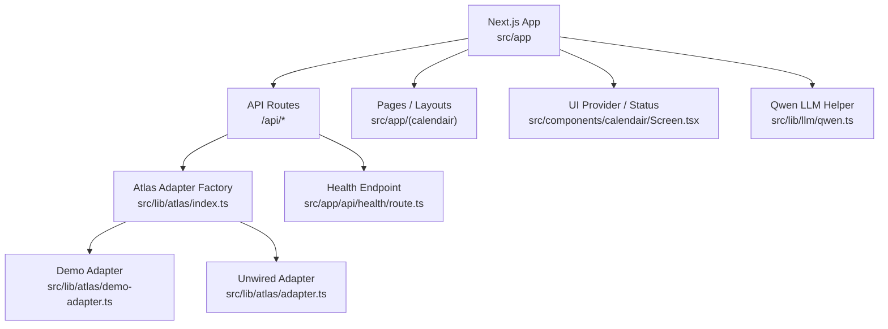
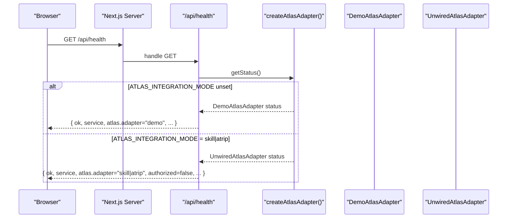
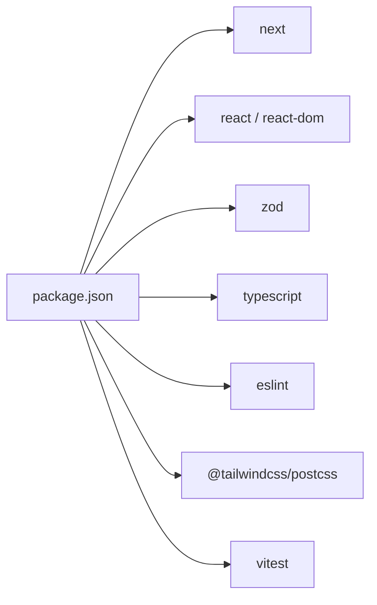

# Deployment & Configuration

<cite>
**Referenced Files in This Document**
- [package.json](file://package.json)
- [next.config.ts](file://next.config.ts)
- [tsconfig.json](file://tsconfig.json)
- [postcss.config.mjs](file://postcss.config.mjs)
- [README.md](file://README.md)
- [scripts/demo.mjs](file://scripts/demo.mjs)
- [scripts/e2e.mjs](file://scripts/e2e.mjs)
- [src/app/api/health/route.ts](file://src/app/api/health/route.ts)
- [src/lib/atlas/index.ts](file://src/lib/atlas/index.ts)
- [src/lib/atlas/adapter.ts](file://src/lib/atlas/adapter.ts)
- [src/lib/atlas/demo-adapter.ts](file://src/lib/atlas/demo-adapter.ts)
- [src/app/(calendair)/demo/page.tsx](file://src/app/(calendair)/demo/page.tsx)
- [src/components/calendair/Screen.tsx](file://src/components/calendair/Screen.tsx)
- [src/lib/llm/qwen.ts](file://src/lib/llm/qwen.ts)
</cite>

## Table of Contents
1. Introduction
2. Project Structure
3. Core Components
4. Architecture Overview
5. Detailed Component Analysis
6. Dependency Analysis
7. Performance Considerations
8. Troubleshooting Guide
9. Conclusion

## Introduction
This document provides deployment and configuration guidance for CALENDAIR, a Next.js application that integrates with an Atlas provider and optional Alibaba Cloud Qwen model for explanations. It covers the build process, environment variables, production considerations, provider configuration (including ATLAS_INTEGRATION_MODE), monitoring and logging, health checks, debugging, containerization options, CI/CD pipeline setup, scaling, security best practices, secret management, access control patterns, troubleshooting, and performance optimization.

## Project Structure
CALENDAIR is a Next.js app with:
- API routes under src/app/api for session lifecycle and health
- Domain logic in src/lib/calendair and src/lib/atlas
- UI components in src/components
- Demo and end-to-end scripts under scripts
- Build and runtime configuration via package.json and Next.js config files

**Diagram sources**
- [src/app/api/health/route.ts:10-38](file://src/app/api/health/route.ts#L10-L38)
- [src/lib/atlas/index.ts:18-37](file://src/lib/atlas/index.ts#L18-L37)
- [src/lib/atlas/demo-adapter.ts:28-41](file://src/lib/atlas/demo-adapter.ts#L28-L41)
- [src/lib/atlas/adapter.ts:31-78](file://src/lib/atlas/adapter.ts#L31-L78)
- [src/components/calendair/Screen.tsx:76-95](file://src/components/calendair/Screen.tsx#L76-L95)
- [src/lib/llm/qwen.ts:19-21](file://src/lib/llm/qwen.ts#L19-L21)

**Section sources**
- [package.json:5-16](file://package.json#L5-L16)
- [next.config.ts:1-8](file://next.config.ts#L1-L8)
- [tsconfig.json:1-35](file://tsconfig.json#L1-L35)
- [postcss.config.mjs:1-8](file://postcss.config.mjs#L1-L8)

## Core Components
- Next.js application entry and scripts: development, demo, build, start, validation, tests, and e2e.
- Health endpoint reporting service status, adapter mode, credentials presence, calendar source, and reasoning provider configuration without leaking secrets.
- Atlas adapter factory selecting between deterministic demo and unwired live adapters based on environment variables.
- Demo adapter providing stable inventory and labels to prevent accidental presentation of demo data as live.
- Unwired adapter refusing calls when live mode is selected but not wired, ensuring loud failures instead of silent fallbacks.
- Qwen helper for explanation-only language generation with graceful degradation when keys or model are missing.

Key environment variables observed across the codebase:
- ATLAS_INTEGRATION_MODE: selects adapter behavior (unset/demo vs skill/atrip)
- ATLAS_ENV: sandbox, production, or unknown
- DEMO_MODE and DEMO_SCENARIO: control demo behavior and scenario
- MAX_REPLANS: limits replanning attempts
- GOOGLE_CLIENT_ID and GOOGLE_CLIENT_SECRET: enable Google Calendar integration
- ALIBABA_CLOUD_MODEL_STUDIO_API_KEY and QWEN_MODEL: enable Qwen explanations
- QWEN_BASE_URL: optional override for Qwen endpoint

**Section sources**
- [package.json:5-16](file://package.json#L5-L16)
- [src/app/api/health/route.ts:10-38](file://src/app/api/health/route.ts#L10-L38)
- [src/lib/atlas/index.ts:18-37](file://src/lib/atlas/index.ts#L18-L37)
- [src/lib/atlas/demo-adapter.ts:28-41](file://src/lib/atlas/demo-adapter.ts#L28-L41)
- [src/lib/atlas/adapter.ts:31-78](file://src/lib/atlas/adapter.ts#L31-L78)
- [src/lib/llm/qwen.ts:19-21](file://src/lib/llm/qwen.ts#L19-L21)

## Architecture Overview
The runtime architecture centers on Next.js serverless/server functions that orchestrate sessions, call the Atlas adapter through a factory, and expose a health endpoint. The UI reads status from both the session context and the health endpoint to display provider mode and authorization state.

**Diagram sources**
- [src/app/api/health/route.ts:10-38](file://src/app/api/health/route.ts#L10-L38)
- [src/lib/atlas/index.ts:18-37](file://src/lib/atlas/index.ts#L18-L37)
- [src/lib/atlas/demo-adapter.ts:28-41](file://src/lib/atlas/demo-adapter.ts#L28-L41)
- [src/lib/atlas/adapter.ts:31-78](file://src/lib/atlas/adapter.ts#L31-L78)

## Detailed Component Analysis

### Build Process and Scripts
- Development: use the provided dev script to run the Next.js development server.
- Demo: wrapper script starts the dev server with sensible defaults and prints provider mode before launch.
- Validation: typecheck, lint, and unit tests.
- Production build: standard Next.js build.
- Start: production server runner.
- End-to-end: drives the full agent loop over HTTP endpoints against a running server.

Operational notes:
- The demo script sets default environment values for demo mode, scenario, max replans, and Atlas environment.
- The e2e script can start its own dev server or connect to an existing BASE_URL and waits for health readiness.

**Section sources**
- [package.json:5-16](file://package.json#L5-L16)
- [scripts/demo.mjs:11-41](file://scripts/demo.mjs#L11-L41)
- [scripts/e2e.mjs:15-48](file://scripts/e2e.mjs#L15-L48)

### Environment Variables and Provider Configuration
- ATLAS_INTEGRATION_MODE:
  - Unset: deterministic demo inventory; safe for staging and demos.
  - skill or atrip: live-mode placeholder that refuses calls until a real adapter is implemented; ensures no silent fallback to demo data.
- ATLAS_ENV: maps to sandbox, production, or unknown; influences adapter labeling.
- DEMO_MODE and DEMO_SCENARIO: control demo behavior and scenario selection at runtime.
- MAX_REPLANS: caps replanning attempts during booking flow.
- GOOGLE_CLIENT_ID and GOOGLE_CLIENT_SECRET: enable Google Calendar integration; otherwise demo calendar source is used.
- ALIBABA_CLOUD_MODEL_STUDIO_API_KEY and QWEN_MODEL: enable Qwen explanations; if missing, the system falls back to deterministic text.
- QWEN_BASE_URL: optional endpoint override for Qwen.

Provider status is surfaced in the UI and health endpoint without leaking secrets.

**Section sources**
- [src/lib/atlas/index.ts:18-37](file://src/lib/atlas/index.ts#L18-L37)
- [src/app/api/health/route.ts:10-38](file://src/app/api/health/route.ts#L10-L38)
- [src/lib/llm/qwen.ts:19-21](file://src/lib/llm/qwen.ts#L19-L21)
- [src/app/(calendair)/demo/page.tsx:79-100](file://src/app/(calendair)/demo/page.tsx#L79-L100)

### Health Check Endpoint
- GET /api/health returns service name, timestamp, demo mode/scenario, max replans, Atlas adapter status (including integration mode and whether credentials are present), calendar source, and reasoning provider configuration.
- Designed to be safe for probes and dashboards; does not expose secrets.

**Section sources**
- [src/app/api/health/route.ts:10-38](file://src/app/api/health/route.ts#L10-L38)

### Monitoring and Logging
- Activity log: per-session agent activity with timestamps, duration, and sanitized details; never includes event titles, tokens, or document numbers.
- UI indicators: screen header shows adapter label and authorization state; demo page exposes detailed provider info including integration mode and credentials presence.
- Health endpoint: suitable for uptime and configuration monitoring.

**Section sources**
- [src/app/(calendair)/activity/page.tsx:126-155](file://src/app/(calendair)/activity/page.tsx#L126-L155)
- [src/components/calendair/Screen.tsx:76-95](file://src/components/calendair/Screen.tsx#L76-L95)
- [src/app/(calendair)/demo/page.tsx:79-100](file://src/app/(calendair)/demo/page.tsx#L79-L100)
- [src/app/api/health/route.ts:10-38](file://src/app/api/health/route.ts#L10-L38)

### Debugging Techniques
- Use the demo page to inspect current adapter, environment, authorization, ticketing availability, integration mode, credentials presence, demo mode, max replans, and session ID.
- Run the e2e suite to validate the full agent loop and safety properties against a running server.
- Inspect console output from the demo script which prints provider mode and configuration before starting the server.

**Section sources**
- [src/app/(calendair)/demo/page.tsx:79-100](file://src/app/(calendair)/demo/page.tsx#L79-L100)
- [scripts/e2e.mjs:15-48](file://scripts/e2e.mjs#L15-L48)
- [scripts/demo.mjs:11-41](file://scripts/demo.mjs#L11-L41)

### Containerization Options
- The project uses Next.js with Node.js runtime; containerize using a Node image aligned with your Next.js version.
- Ensure environment variables are injected at runtime (ATLAS_INTEGRATION_MODE, ATLAS_ENV, DEMO_MODE, DEMO_SCENARIO, MAX_REPLANS, GOOGLE_* secrets, ALIBABA_CLOUD_MODEL_STUDIO_API_KEY, QWEN_MODEL, QWEN_BASE_URL).
- Expose the configured port (default 3000) and configure reverse proxy or ingress as needed.
- For production builds, run the build step inside the container and start with the production runner.

[No sources needed since this section provides general guidance]

### CI/CD Pipeline Configuration
Recommended stages:
- Install dependencies and cache node_modules.
- Typecheck and lint.
- Unit tests.
- Build the Next.js app.
- Optional: run e2e tests against a temporary dev server or a deployed preview.
- Publish artifacts or deploy to target platform.

Environment injection:
- Provide secrets via CI/CD secret stores.
- Set ATLAS_INTEGRATION_MODE appropriately for each environment (unset for demo/staging, skill/atrip for production once wired).
- Configure Google and Qwen secrets per environment.

**Section sources**
- [package.json:5-16](file://package.json#L5-L16)
- [scripts/e2e.mjs:15-48](file://scripts/e2e.mjs#L15-L48)

### Scaling Considerations
- Next.js serverless/server functions scale horizontally; ensure external services (Atlas, Google Calendar, Qwen) have appropriate rate limits and connection pooling.
- Keep long-lived clients where possible (the adapter factory caches instances per configuration).
- Monitor health endpoint latency and error rates.
- Use load balancers and horizontal scaling policies tuned to request volume and downstream timeouts.

[No sources needed since this section provides general guidance]

### Security Best Practices
- Secrets management: store all sensitive values (Google and Atlas credentials, Qwen API key) in secure secret stores; inject via environment variables at runtime.
- Least privilege: grant only required scopes to calendar and provider integrations.
- Input validation: API routes validate payloads; domain layer sanitizes profiles and rebuilds fields server-side.
- Safe logging: activity logs sanitize sensitive data; health endpoint reports configuration without secrets.
- Access control: restrict admin or internal endpoints behind authentication and network policies in production.

**Section sources**
- [src/app/api/calendair/session/route.ts:10-21](file://src/app/api/calendair/session/route.ts#L10-L21)
- [src/app/api/health/route.ts:10-38](file://src/app/api/health/route.ts#L10-L38)
- [src/app/(calendair)/activity/page.tsx:126-155](file://src/app/(calendair)/activity/page.tsx#L126-L155)

## Dependency Analysis
Runtime dependencies include Next.js, React, Zod for validation, and optional integrations with Atlas and Qwen. Build-time tooling includes TypeScript, ESLint, Tailwind via PostCSS, and Vitest for tests.

**Diagram sources**
- [package.json:18-37](file://package.json#L18-L37)

**Section sources**
- [package.json:18-37](file://package.json#L18-L37)

## Performance Considerations
- Prefer production builds for deployments; avoid running dev server in production.
- Cache dependencies in CI/CD to speed up builds.
- Tune timeouts for external calls (e.g., Qwen timeout) to fail fast and degrade gracefully.
- Use health checks to detect slow or failing dependencies early.
- Limit replanning attempts via MAX_REPLANS to bound processing time.

[No sources needed since this section provides general guidance]

## Troubleshooting Guide
Common issues and resolutions:
- Live mode selected but adapter not wired:
  - Symptom: health shows adapter set to skill/atrip with authorized=false and ticketing unavailable; API calls throw explicit errors indicating the adapter is not wired.
  - Resolution: implement the real adapter for the chosen mode or revert ATLAS_INTEGRATION_MODE to unset for demo behavior.
- Missing or incorrect secrets:
  - Symptom: health indicates credentials not present; calendar source remains demo; Qwen explanations disabled.
  - Resolution: provide required environment variables (GOOGLE_CLIENT_ID/SECRET, ALIBABA_CLOUD_MODEL_STUDIO_API_KEY, QWEN_MODEL).
- Unexpected demo data in production:
  - Symptom: adapter is demo; UI warns about deterministic inventory.
  - Resolution: set ATLAS_INTEGRATION_MODE to skill/atrip and wire the adapter; ensure environment variables are correct.
- Health endpoint unreachable:
  - Symptom: e2e cannot reach /api/health within timeout.
  - Resolution: verify server started successfully, ports exposed, and firewall rules allow access.

**Section sources**
- [src/lib/atlas/adapter.ts:31-78](file://src/lib/atlas/adapter.ts#L31-L78)
- [src/app/api/health/route.ts:10-38](file://src/app/api/health/route.ts#L10-L38)
- [scripts/e2e.mjs:36-48](file://scripts/e2e.mjs#L36-L48)

## Conclusion
CALENDAIR’s deployment model leverages Next.js with clear separation between demo and live provider modes. The health endpoint and UI surfaces configuration status safely, while the adapter factory enforces strict boundaries to prevent silent fallbacks. Follow the environment variable guidelines, secure secrets, and use the provided scripts and e2e tests to validate deployments. Apply the recommended CI/CD stages, scaling strategies, and security practices to operate CALENDAIR reliably in production.