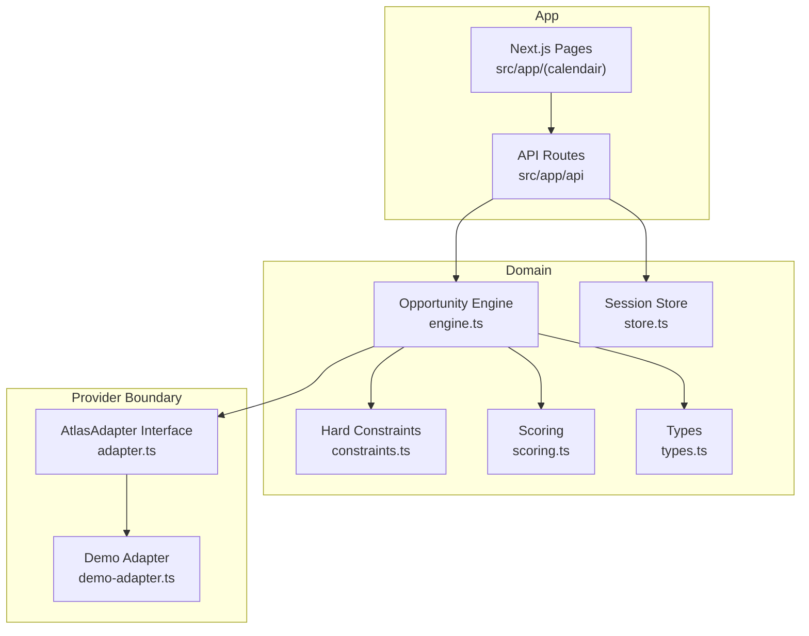
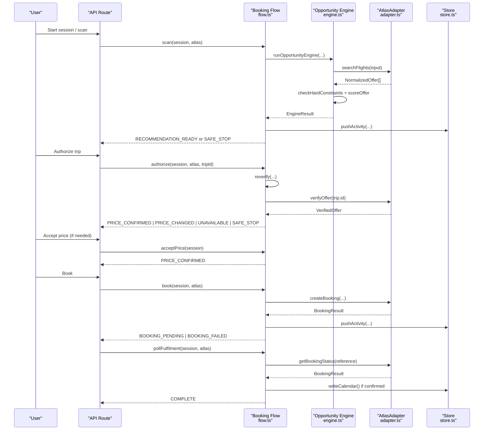
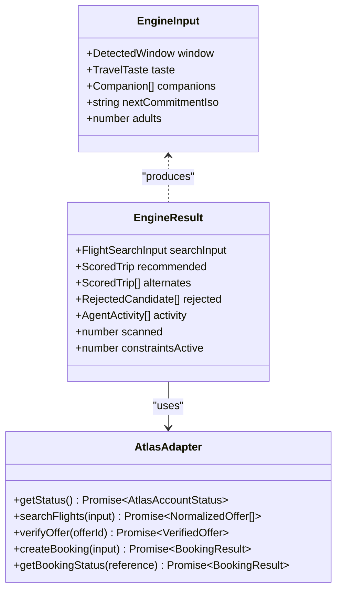
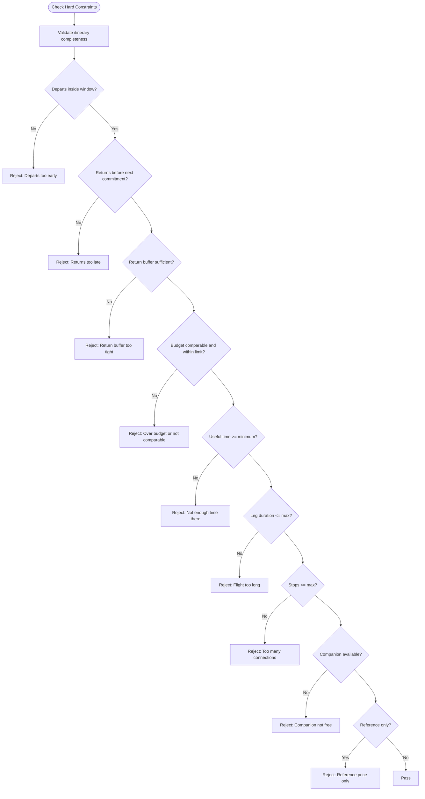
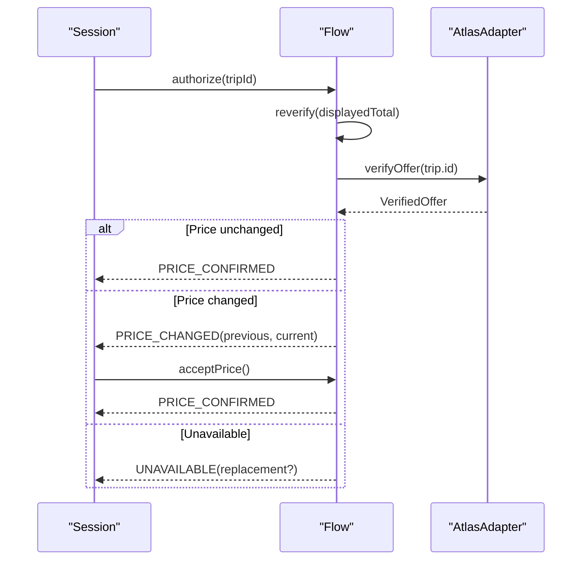
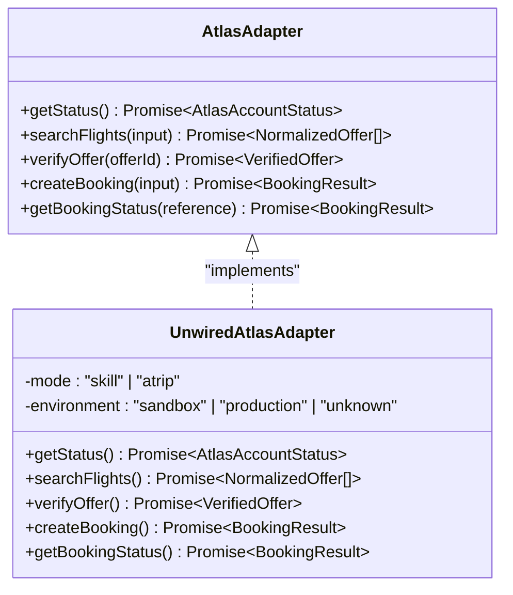
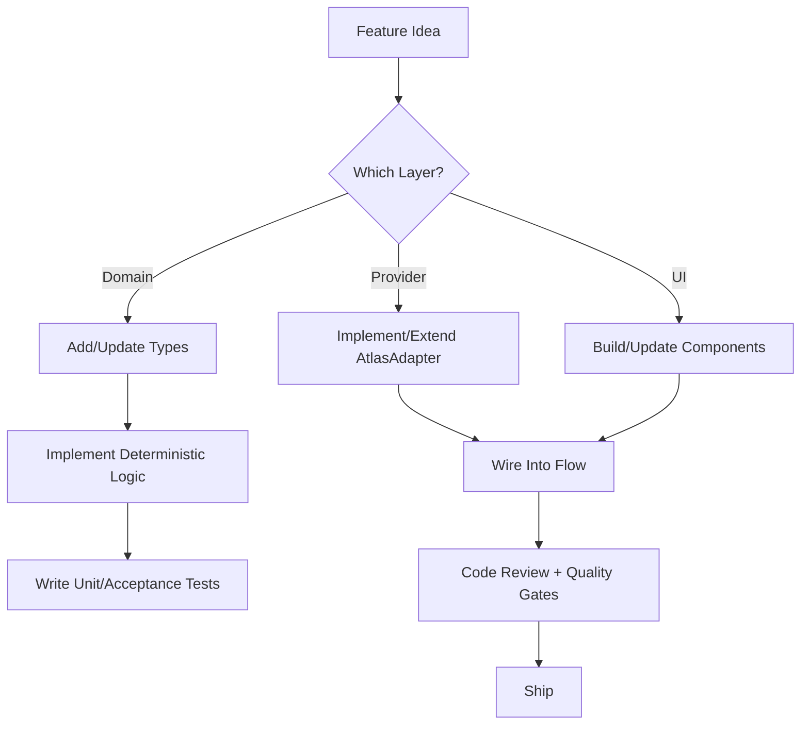
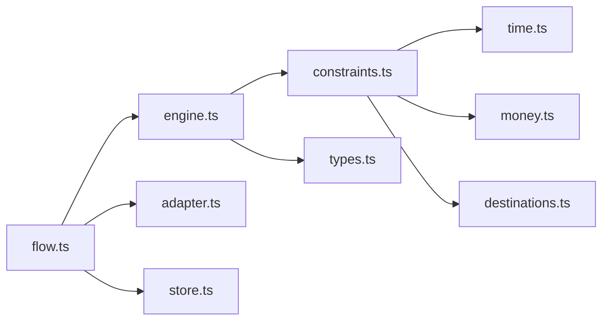

# Developer Guide

<cite>
**Referenced Files in This Document**
- [README.md](file://README.md)
- [package.json](file://package.json)
- [CLAUDE.md](file://CLAUDE.md)
- [AGENTS.md](file://AGENTS.md)
- [next.config.ts](file://next.config.ts)
- [eslint.config.mjs](file://eslint.config.mjs)
- [vitest.config.ts](file://vitest.config.ts)
- [tsconfig.json](file://tsconfig.json)
- [types.ts](file://src/lib/calendair/types.ts)
- [adapter.ts](file://src/lib/atlas/adapter.ts)
- [constraints.ts](file://src/lib/calendair/constraints.ts)
- [engine.ts](file://src/lib/calendair/engine.ts)
- [flow.ts](file://src/lib/calendair/flow.ts)
</cite>

## Table of Contents
1. Introduction
2. Project Structure
3. Core Components
4. Architecture Overview
5. Detailed Component Analysis
6. Dependency Analysis
7. Performance Considerations
8. Troubleshooting Guide
9. Conclusion
10. Appendices

## Introduction
This guide helps contributors set up the development environment, follow coding standards, and contribute features to CALENDAIR safely and consistently. It explains the project structure, naming conventions, architectural principles, code review expectations, testing requirements, and quality gates. It also provides guidance for extending the constraint system, adding new features, and implementing custom adapters, along with debugging techniques, performance profiling tips, and common pitfalls.

Key product principles:
- The agent can be spontaneous; transactions cannot. Every consequential write requires an explicit human checkpoint and a live re-read before writing.
- Hard constraints are pass/fail and cannot be overridden by scoring or language models.
- A reference-only fare must never reach booking.
- Calendar is written only after fulfilment is confirmed.
- Companion matching uses free/busy only; no event titles or sensitive data may leak into logs or prompts.

**Section sources**
- [README.md:73-90](file://README.md#L73-L90)
- [AGENTS.md:18-55](file://AGENTS.md#L18-L55)

## Project Structure
The repository is a Next.js application with a clear separation between domain logic, provider integration, UI components, and routes:
- src/lib/calendair: Domain types, opportunity engine, constraints, scoring, time/money utilities, session store, and demo world.
- src/lib/atlas: Provider boundary (interface, unwired adapter, demo adapter).
- src/components/calendair: Reusable UI components for the CALENDAIR interface.
- src/components/onboarding: Onboarding wizard, guides, and coach marks.
- src/app/(calendair): Route pages for the user journey.
- src/app/api: Server-side API routes that orchestrate flows and expose health/status.

**Diagram sources**
- [engine.ts:1-206](file://src/lib/calendair/engine.ts#L1-L206)
- [adapter.ts:1-79](file://src/lib/atlas/adapter.ts#L1-L79)
- [types.ts:1-274](file://src/lib/calendair/types.ts#L1-L274)

**Section sources**
- [README.md:92-114](file://README.md#L92-L114)
- [AGENTS.md:44-55](file://AGENTS.md#L44-L55)

## Core Components
- Opportunity Engine: Builds search input from calendar windows and preferences, calls the provider, filters offers via hard constraints, scores viable options, ranks them, and returns one recommendation plus alternates and activity logs.
- Hard Constraints: Deterministic pass/fail rules enforcing budget, timing, stops, flight length, return buffer, companion availability, and reference-only fares.
- Booking Flow: Explicit state machine governing scan, authorize, reverify, accept price, book, poll fulfilment, and safe stop. Enforces bounded replanning and human checkpoints.
- Provider Boundary: Single AtlasAdapter interface abstracting travel inventory and ticketing. Includes an unwired adapter that fails loudly when live mode is selected without implementation.

**Section sources**
- [engine.ts:15-206](file://src/lib/calendair/engine.ts#L15-L206)
- [constraints.ts:6-162](file://src/lib/calendair/constraints.ts#L6-L162)
- [flow.ts:8-350](file://src/lib/calendair/flow.ts#L8-L350)
- [adapter.ts:10-79](file://src/lib/atlas/adapter.ts#L10-L79)

## Architecture Overview
High-level flow from calendar opening to confirmed trip:

**Diagram sources**
- [flow.ts:22-350](file://src/lib/calendair/flow.ts#L22-L350)
- [engine.ts:77-206](file://src/lib/calendair/engine.ts#L77-L206)
- [adapter.ts:23-79](file://src/lib/atlas/adapter.ts#L23-L79)

## Detailed Component Analysis

### Opportunity Engine
Responsibilities:
- Build search input from DetectedWindow and TravelTaste.
- Call provider to retrieve offers.
- Apply hard constraints deterministically.
- Score and rank viable offers.
- Return one recommended trip, up to two alternates, rejected candidates, and activity log.

Complexity:
- Filtering and scoring iterate over offers once: O(n) per call.
- Sorting is O(k log k) where k is number of viable offers (typically small).

Optimization opportunities:
- Early exit on hard constraints to reduce scoring cost.
- Cache repeated computations like useful minutes and currency conversions within a single run.

Error handling:
- Activity events record each step with timestamps and durations for observability.

**Section sources**
- [engine.ts:77-206](file://src/lib/calendair/engine.ts#L77-L206)

#### Class Diagram

**Diagram sources**
- [engine.ts:23-39](file://src/lib/calendair/engine.ts#L23-L39)
- [adapter.ts:23-29](file://src/lib/atlas/adapter.ts#L23-L29)

### Hard Constraints
Responsibilities:
- Enforce deterministic pass/fail rules: itinerary completeness, departure/return timing, return buffer, budget conversion and comparison, minimum useful time, max flight leg duration, max stops, companion availability, and reference-only fares.
- Produce rejection details for audit and UI.

Complexity:
- Constant-time checks per offer; overall O(n) across offers.

Edge cases:
- Unknown currency pairs are refused rather than guessed.
- Reference-only fares are blocked from booking.

**Section sources**
- [constraints.ts:6-162](file://src/lib/calendair/constraints.ts#L6-L162)

#### Flowchart

**Diagram sources**
- [constraints.ts:42-162](file://src/lib/calendair/constraints.ts#L42-L162)

### Booking Flow
Responsibilities:
- Manage the lifecycle from scanning to completion using an explicit state machine.
- Ensure human checkpoints at authorization, price changes, and booking confirmation.
- Re-read live state before writes and enforce bounded replanning.

Key states and transitions:
- SCAN → RECOMMENDATION_READY or SAFE_STOP
- AUTHORIZE → REVERIFYING → PRICE_CONFIRMED | PRICE_CHANGED | UNAVAILABLE | SAFE_STOP
- ACCEPT_PRICE → PRICE_CONFIRMED
- BOOK → BOOKING_PENDING | BOOKING_FAILED
- POLL_FULFILMENT → FULFILMENT_CONFIRMED → CALENDAR_UPDATED → COMPLETE

Safety properties:
- Reverification immediately before booking.
- Price change halts flow until explicit acceptance.
- Replacement trips require new human decision.
- Calendar updated only after fulfilment confirmed.

**Section sources**
- [flow.ts:22-350](file://src/lib/calendair/flow.ts#L22-L350)

#### Sequence Diagram

**Diagram sources**
- [flow.ts:65-176](file://src/lib/calendair/flow.ts#L65-L176)

### Provider Boundary (AtlasAdapter)
Responsibilities:
- Define a single interface for all travel provider operations.
- Provide an unwired adapter that refuses to pretend it works in live mode.
- Keep transport details out of domain logic.

Implementation guidance:
- Do not invent endpoints or payloads; implement against installed Skill or official ATRIP interface.
- Report adapter mode and environment clearly so users always know what is running.

**Section sources**
- [adapter.ts:10-79](file://src/lib/atlas/adapter.ts#L10-L79)

#### Class Diagram

**Diagram sources**
- [adapter.ts:23-79](file://src/lib/atlas/adapter.ts#L23-L79)

### Conceptual Overview
Conceptual workflow for adding a new feature:
- Identify the layer: domain logic (lib), provider boundary (atlas), or UI (components/pages).
- Add types first to keep contracts explicit.
- Implement deterministic logic with tests.
- Integrate through existing interfaces (e.g., AtlasAdapter) without leaking transport details into domain.
- Surface status truthfully in UI and logs.

[No sources needed since this diagram shows conceptual workflow, not actual code structure]

## Dependency Analysis
Core dependencies and relationships:
- Engine depends on AtlasAdapter for search and verification.
- Flow orchestrates Engine and AtlasAdapter, managing Session state and activity logging.
- Constraints depend on time and money utilities and destination metadata.
- Types define shared contracts used across layers.

**Diagram sources**
- [engine.ts:1-206](file://src/lib/calendair/engine.ts#L1-L206)
- [flow.ts:1-350](file://src/lib/calendair/flow.ts#L1-L350)
- [constraints.ts:1-162](file://src/lib/calendair/constraints.ts#L1-L162)
- [adapter.ts:1-79](file://src/lib/atlas/adapter.ts#L1-L79)
- [types.ts:1-274](file://src/lib/calendair/types.ts#L1-L274)

**Section sources**
- [engine.ts:1-206](file://src/lib/calendair/engine.ts#L1-L206)
- [flow.ts:1-350](file://src/lib/calendair/flow.ts#L1-L350)
- [constraints.ts:1-162](file://src/lib/calendair/constraints.ts#L1-L162)
- [adapter.ts:1-79](file://src/lib/atlas/adapter.ts#L1-L79)
- [types.ts:1-274](file://src/lib/calendair/types.ts#L1-L274)

## Performance Considerations
- Keep constraint checks constant-time per offer; avoid heavy computation in hot loops.
- Prefer deterministic arithmetic over external calls; cache results within a single run where safe.
- Use activity events with durationMs to identify slow steps (e.g., provider calls).
- Limit replans to MAX_REPLANS to prevent runaway loops.
- Avoid unnecessary re-renders in UI by keeping state updates minimal and focused.

[No sources needed since this section provides general guidance]

## Troubleshooting Guide
Common issues and how to address them:
- Live mode without wired adapter:
  - Symptom: Errors indicating adapter not wired; UI reports adapter mode.
  - Action: Implement the required methods against the installed Skill or ATRIP interface; do not fall back to demo data.
- Price changes during authorization:
  - Symptom: Flow stops at PRICE_CHANGED.
  - Action: Present the new price to the traveller; require explicit acceptance before proceeding.
- No viable offers:
  - Symptom: SAFE_STOP after scanning.
  - Action: Inspect constraints and search input; adjust preferences or wait for better openings.
- Booking pending but not confirmed:
  - Symptom: State remains BOOKING_PENDING.
  - Action: Poll fulfilment until provider reports its own confirmed state; do not assume HTTP success equals confirmation.
- Calendar not updated:
  - Symptom: No blocks written.
  - Action: Ensure fulfilment is confirmed before writing; verify returned times and buffers.

Debugging techniques:
- Use activity logs to trace each step, including durations and outcomes.
- Check /api/health to confirm which adapter is active and whether secrets are configured.
- Run unit tests to validate deterministic logic; run e2e tests to validate full flows.

Quality gates:
- Before shipping: run validation and e2e tests.
- Ensure all safety properties hold and are covered by tests.

**Section sources**
- [adapter.ts:31-79](file://src/lib/atlas/adapter.ts#L31-L79)
- [flow.ts:65-350](file://src/lib/calendair/flow.ts#L65-L350)
- [README.md:26-45](file://README.md#L26-L45)
- [README.md:73-90](file://README.md#L73-L90)

## Conclusion
CALENDAIR prioritizes deterministic, testable logic for critical decisions and enforces strict safety boundaries around bookings and calendar writes. Contributors should:
- Keep domain logic pure and testable.
- Respect the provider boundary and never invent integrations.
- Follow the explicit booking state machine and human checkpoint requirements.
- Maintain truthful status labels and sanitize logs.
- Validate changes with typecheck, lint, unit tests, and e2e tests before submitting.

[No sources needed since this section summarizes without analyzing specific files]

## Appendices

### Development Environment Setup
- Install dependencies and configure environment:
  - Copy environment template and install packages.
  - Run validation and demo scripts to start the app.
- Commands:
  - Development server, demo modes, validation, tests, build, and e2e.

**Section sources**
- [README.md:26-45](file://README.md#L26-L45)
- [package.json:5-16](file://package.json#L5-L16)

### Coding Standards and Naming Conventions
- Strict TypeScript configuration with path aliases.
- ESLint config based on Next.js best practices with global ignores for build artifacts.
- Vitest setup with node environment and alias resolution.
- Domain-first organization: lib contains business logic; components contain UI; routes under app.

**Section sources**
- [tsconfig.json:1-35](file://tsconfig.json#L1-L35)
- [eslint.config.mjs:1-19](file://eslint.config.mjs#L1-L19)
- [vitest.config.ts:1-15](file://vitest.config.ts#L1-L15)
- [AGENTS.md:44-55](file://AGENTS.md#L44-L55)

### Contribution Guidelines and Code Review Process
- Non-negotiables:
  - Never invent provider endpoints or payloads.
  - Never present demo data as live.
  - Never treat HTTP success as confirmed journey.
  - Never let models decide numbers or override hard constraints.
  - Never expose sensitive calendar content or tokens/logs.
  - Never write calendar before fulfilment confirmed.
  - Bounded replans; replacement trips require new human decision.
- Working guidelines:
  - Domain logic lives in lib; provider boundary in atlas; screens in app; components in components.
  - Mobile-first design; truthful status labels; brand-compliant visuals.
- Pre-ship checklist:
  - Run validation and e2e tests.

**Section sources**
- [AGENTS.md:18-55](file://AGENTS.md#L18-L55)
- [README.md:26-45](file://README.md#L26-L45)

### Adding New Features
- Identify the correct layer:
  - New business rule: add to constraints or scoring in lib/calendair.
  - New provider capability: extend AtlasAdapter and implement in atlas.
  - New UI: add components and pages under calendair.
- Add types first to lock contracts.
- Write deterministic logic with tests.
- Integrate via existing interfaces; avoid leaking transport details.
- Update activity logs and status labels truthfully.

**Section sources**
- [types.ts:1-274](file://src/lib/calendair/types.ts#L1-L274)
- [adapter.ts:10-79](file://src/lib/atlas/adapter.ts#L10-L79)
- [engine.ts:77-206](file://src/lib/calendair/engine.ts#L77-L206)
- [flow.ts:22-350](file://src/lib/calendair/flow.ts#L22-L350)

### Extending the Constraint System
- Add new hard constraints in constraints.ts following the existing pattern:
  - Compute verdicts deterministically.
  - Include rejection reasons with detail for UI and logs.
  - Ensure currency conversions and time calculations remain robust.
- Update scoring if the new constraint influences preference-based ranking.

**Section sources**
- [constraints.ts:42-162](file://src/lib/calendair/constraints.ts#L42-L162)
- [engine.ts:153-160](file://src/lib/calendair/engine.ts#L153-L160)

### Implementing Custom Adapters
- Implement AtlasAdapter methods against the installed Skill or ATRIP interface.
- Ensure getStatus reports accurate environment and adapter label.
- Fail loudly if not wired; never substitute demo data for live calls.
- Keep transport details isolated; domain logic remains provider-agnostic.

**Section sources**
- [adapter.ts:10-79](file://src/lib/atlas/adapter.ts#L10-L79)

### Debugging Techniques
- Use activity logs to trace steps and durations.
- Check /api/health to confirm adapter mode and environment.
- Run unit tests for deterministic logic; run e2e tests for full flows.
- Inspect session state transitions in flow functions to pinpoint failures.

**Section sources**
- [flow.ts:94-176](file://src/lib/calendair/flow.ts#L94-L176)
- [README.md:164-167](file://README.md#L164-L167)

### Performance Profiling
- Leverage durationMs in activity events to measure slow steps.
- Profile provider calls (search, verify, booking) to identify bottlenecks.
- Minimize unnecessary re-renders and state updates in UI.
- Keep replans bounded and avoid excessive retries.

**Section sources**
- [engine.ts:131-141](file://src/lib/calendair/engine.ts#L131-L141)
- [flow.ts:104-115](file://src/lib/calendair/flow.ts#L104-L115)

### Common Pitfalls and Anti-patterns
- Anti-patterns:
  - Inventing provider endpoints or payloads.
  - Treating HTTP success as confirmed booking.
  - Letting models decide numbers or override hard constraints.
  - Exposing sensitive data in logs or prompts.
  - Writing calendar before fulfilment confirmed.
- Good patterns:
  - Deterministic constraint checks with clear rejection reasons.
  - Explicit state machine for booking flow with human checkpoints.
  - Truthful status labels and sanitized activity logs.
  - Provider abstraction with unwired adapter failing loudly.

**Section sources**
- [AGENTS.md:18-55](file://AGENTS.md#L18-L55)
- [constraints.ts:6-162](file://src/lib/calendair/constraints.ts#L6-L162)
- [flow.ts:8-350](file://src/lib/calendair/flow.ts#L8-L350)
- [adapter.ts:31-79](file://src/lib/atlas/adapter.ts#L31-L79)