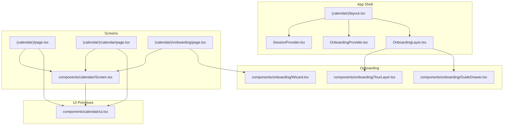
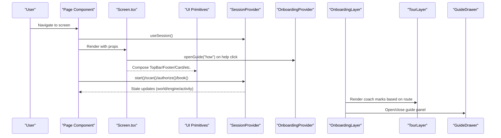
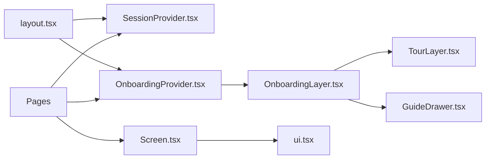

# Frontend Components

<cite>
**Referenced Files in This Document**
- [Screen.tsx](file://src/components/calendair/Screen.tsx)
- [SessionProvider.tsx](file://src/components/calendair/SessionProvider.tsx)
- [ui.tsx](file://src/components/calendair/ui.tsx)
- [Wizard.tsx](file://src/components/onboarding/Wizard.tsx)
- [OnboardingProvider.tsx](file://src/components/onboarding/OnboardingProvider.tsx)
- [OnboardingLayer.tsx](file://src/components/onboarding/OnboardingLayer.tsx)
- [TourLayer.tsx](file://src/components/onboarding/TourLayer.tsx)
- [GuideDrawer.tsx](file://src/components/onboarding/GuideDrawer.tsx)
- [layout.tsx](file://src/app/(calendair)/layout.tsx)
- [page.tsx](file://src/app/(calendair)/page.tsx)
- [calendar/page.tsx](file://src/app/(calendair)/calendar/page.tsx)
- [onboarding/page.tsx](file://src/app/(calendair)/onboarding/page.tsx)
- [globals.css](file://src/app/globals.css)
- [calendair.css](file://src/app/calendair.css)
</cite>

## Table of Contents
1. Introduction
2. Project Structure
3. Core Components
4. Architecture Overview
5. Detailed Component Analysis
6. Dependency Analysis
7. Performance Considerations
8. Troubleshooting Guide
9. Conclusion
10. Appendices

## Introduction
This document explains CALENDAIR’s React component architecture with a focus on the Screen hierarchy, shared UI primitives, and the onboarding system (wizard flow, tour, and guide). It also covers styling via Tailwind CSS and a custom design system, component composition patterns, prop interfaces, event handling, creating new screens, integrating with the session provider, responsive design considerations, and accessibility compliance.

## Project Structure
The application is organized around:
- App shell providers that wrap all routes to share session state and onboarding context.
- A consistent Screen wrapper for every page, providing top bar, content area, and footer.
- Shared UI primitives used across screens.
- An onboarding system composed of a wizard, coach marks tour, welcome modal, and an in-product guide drawer.

**Diagram sources**
- [layout.tsx:1-22](file://src/app/(calendair)/layout.tsx#L1-L22)
- [Screen.tsx:1-69](file://src/components/calendair/Screen.tsx#L1-L69)
- [ui.tsx:1-172](file://src/components/calendair/ui.tsx#L1-L172)
- [Wizard.tsx:1-509](file://src/components/onboarding/Wizard.tsx#L1-L509)
- [OnboardingProvider.tsx:1-166](file://src/components/onboarding/OnboardingProvider.tsx#L1-L166)
- [OnboardingLayer.tsx:1-37](file://src/components/onboarding/OnboardingLayer.tsx#L1-L37)
- [TourLayer.tsx:1-207](file://src/components/onboarding/TourLayer.tsx#L1-L207)
- [GuideDrawer.tsx:1-237](file://src/components/onboarding/GuideDrawer.tsx#L1-L237)

**Section sources**
- [layout.tsx:1-22](file://src/app/(calendair)/layout.tsx#L1-L22)

## Core Components
- Screen: The standard page container with TopBar, content, and Footer. Supports back navigation, “night” mode for agent activity, and a right-side slot. Integrates with onboarding by exposing a help button that opens the guide.
- SessionProvider: Central client state for the demo/session lifecycle. Exposes methods to start, scan, authorize, accept price, book, poll fulfilment, explain trips, and query engine/world snapshots. Persists session id in sessionStorage and resumes on reload.
- UI primitives: Reusable building blocks like Wordmark, TopBar, Card, Medallion, Pill, Stat, Stats, ScoreRing, Footer, Sparkline. Styled consistently using the design tokens.

Key responsibilities:
- Screen composes layout and provides consistent chrome.
- SessionProvider owns cross-screen state and orchestrates server calls.
- UI primitives ensure visual consistency and reduce duplication.

**Section sources**
- [Screen.tsx:1-133](file://src/components/calendair/Screen.tsx#L1-L133)
- [SessionProvider.tsx:1-334](file://src/components/calendair/SessionProvider.tsx#L1-L334)
- [ui.tsx:1-172](file://src/components/calendair/ui.tsx#L1-L172)

## Architecture Overview
The app shell wraps all routes with SessionProvider and OnboardingProvider. Each screen uses Screen for consistent chrome and consumes session data via useSession. Onboarding surfaces are mounted once at the root and react to route changes to drive coach marks and guides.

**Diagram sources**
- [layout.tsx:1-22](file://src/app/(calendair)/layout.tsx#L1-L22)
- [Screen.tsx:1-69](file://src/components/calendair/Screen.tsx#L1-L69)
- [SessionProvider.tsx:114-281](file://src/components/calendair/SessionProvider.tsx#L114-L281)
- [OnboardingProvider.tsx:49-166](file://src/components/onboarding/OnboardingProvider.tsx#L49-L166)
- [OnboardingLayer.tsx:16-37](file://src/components/onboarding/OnboardingLayer.tsx#L16-L37)
- [TourLayer.tsx:19-207](file://src/components/onboarding/TourLayer.tsx#L19-L207)
- [GuideDrawer.tsx:38-237](file://src/components/onboarding/GuideDrawer.tsx#L38-L237)

## Detailed Component Analysis

### Screen Component
- Purpose: Standardized page shell with TopBar, content, and Footer.
- Props:
  - children: Content rendered between header and footer.
  - back: Optional string or boolean to enable back navigation; when string, navigates to that path; when true, uses router.back().
  - night: Boolean to switch to dark surface used by agent activity view.
  - right: Optional node for the right side of the TopBar; defaults to Agent activity link with notification dot.
- Behavior:
  - Left slot shows Back button if provided; otherwise shows a help button that opens the onboarding guide.
  - Wraps content in a shell class that supports light/dark modes.
  - Renders Footer automatically.

Accessibility:
- Buttons include aria-labels for Back and Help.
- Links have descriptive labels.

Styling:
- Uses design tokens and utility classes from calendair.css.

**Section sources**
- [Screen.tsx:11-69](file://src/components/calendair/Screen.tsx#L11-L69)

### SessionProvider
- Purpose: Client-side session state and orchestration for the demo/traveler run.
- State:
  - ready, sessionId, scenario, demoMode, atlas, world, engine, booking, activity, scanning, busy, error, outcome.
- Methods:
  - start(scenario?): Initializes session, reads profile, persists sessionId, sets initial state.
  - scan(): POST /scan, updates engine snapshot and booking state.
  - authorize(tripId): POST /authorize, returns Outcome.
  - acceptPrice(): POST /accept-price, returns Outcome.
  - book(): POST /book, returns boolean success.
  - pollFulfilment(): GET /fulfilment, returns BookingState.
  - explain(tripId): POST /explain, returns explanation text.
  - tripById(id): Lookup helper over recommended and alternates.
- Persistence:
  - Stores sessionId in sessionStorage to resume across reloads.
- Error handling:
  - Sets error messages on failed requests; call helper centralizes error mapping.

Integration points:
- Pages call these methods to progress through the booking flow.
- Activity and booking state updates propagate to consumers via context.

**Section sources**
- [SessionProvider.tsx:27-94](file://src/components/calendair/SessionProvider.tsx#L27-L94)
- [SessionProvider.tsx:114-281](file://src/components/calendair/SessionProvider.tsx#L114-L281)
- [SessionProvider.tsx:283-333](file://src/components/calendair/SessionProvider.tsx#L283-L333)

### UI Primitives
- Wordmark: Brand link with star icon and tagline.
- TopBar: Header with left/right slots and centered wordmark.
- Card: Container with optional flat/pad variants.
- Medallion: Icon badge with tone and size variants.
- Pill: Inline label with multiple tones.
- Stat/Stats: Data display with configurable columns.
- ScoreRing: Visual escape score ring with band label.
- Footer: Provenance footer.
- Sparkline: Inline indicator with star accent.

These components rely on CSS variables and classes defined in calendair.css for consistent theming and responsive behavior.

**Section sources**
- [ui.tsx:10-172](file://src/components/calendair/ui.tsx#L10-L172)
- [calendair.css:10-157](file://src/app/calendair.css#L10-L157)

### Onboarding System

#### Wizard
- Purpose: 8-step traveler profile collection guiding users through availability, origin, spontaneity, hard limits, taste, dream destinations, companion, and notifications.
- Flow:
  - Step-by-step navigation with progress indicators.
  - Validates minimum requirements (e.g., at least one taste).
  - Saves profile to local store and accepts the tour before starting session and navigating home.
  - Provides “skip this — run on prepared demo traveller” option.
- Controls:
  - OptionCard, TasteCard, NumberStepper, SwitchRow, TextField, Segmented, ChipRow, SuggestionRow, Assurance, StepHeading.
- Integration:
  - Calls useSession.start() after saving profile and accepting tour.

**Section sources**
- [Wizard.tsx:28-133](file://src/components/onboarding/Wizard.tsx#L28-L133)
- [Wizard.tsx:135-509](file://src/components/onboarding/Wizard.tsx#L135-L509)

#### OnboardingProvider
- Purpose: Manages welcome modal visibility, tour state, guide panel, and per-screen tour completion.
- Key capabilities:
  - Tracks ready state to avoid hydration flashes.
  - Opens/dismisses welcome modal.
  - Accepts tour to enable coach marks.
  - Ends/restarts tour and tracks completed screens.
  - Keyboard shortcut “?” opens guide unless inside input fields.
  - Computes tour progress.

**Section sources**
- [OnboardingProvider.tsx:17-47](file://src/components/onboarding/OnboardingProvider.tsx#L17-L47)
- [OnboardingProvider.tsx:49-166](file://src/components/onboarding/OnboardingProvider.tsx#L49-L166)

#### OnboardingLayer
- Purpose: Root-mounted layer that renders WelcomeModal, TourLayer, and GuideDrawer based on current route.
- Behavior:
  - Skips welcome modal during wizard flow.
  - Derives current screen key from pathname to drive coach marks.

**Section sources**
- [OnboardingLayer.tsx:10-37](file://src/components/onboarding/OnboardingLayer.tsx#L10-L37)

#### TourLayer
- Purpose: Non-blocking coach marks that highlight elements and teach features step-by-step per screen.
- Features:
  - Anchors to elements via data-tour attributes.
  - Auto-scrolls anchors into view respecting reduced motion preference.
  - Keyboard navigation (arrows, Escape).
  - Remembers completed steps per screen.
  - Shows a chip indicating tour continuation when finished.

**Section sources**
- [TourLayer.tsx:10-207](file://src/components/onboarding/TourLayer.tsx#L10-L207)

#### GuideDrawer
- Purpose: In-product manual accessible via top bar help or keyboard shortcut.
- Tabs: How it works, The flight layer, The screens, Glossary, Questions.
- Accessibility:
  - Focus trap and scroll lock when open.
  - Escape closes panel.
  - Tablist semantics for tabs.
  - Jump-to-term support for glossary entries.

**Section sources**
- [GuideDrawer.tsx:31-237](file://src/components/onboarding/GuideDrawer.tsx#L31-L237)

### Example Screens

#### Home Screen
- Demonstrates usage of Screen, UI primitives, and SessionProvider.
- Automatically scans for opportunities when ready and no engine exists.
- Displays window info, calendar strip, hero opportunity card, and fallback states.

**Section sources**
- [page.tsx:23-213](file://src/app/(calendair)/page.tsx#L23-L213)

#### Calendar Screen
- Shows detailed window analysis, companion overlap, reasons why the window works, and busy list.
- Uses Screen with back navigation.

**Section sources**
- [calendar/page.tsx:13-197](file://src/app/(calendair)/calendar/page.tsx#L13-L197)

#### Onboarding Screen
- Embeds Wizard within Screen for consistent chrome.

**Section sources**
- [onboarding/page.tsx:1-19](file://src/app/(calendair)/onboarding/page.tsx#L1-L19)

## Dependency Analysis
- Provider hierarchy:
  - (calendair)/layout.tsx wraps children with SessionProvider and OnboardingProvider.
  - OnboardingLayer mounts under OnboardingProvider to access its context.
- Screen depends on:
  - Next.js routing (useRouter, Link).
  - SessionProvider (useSession).
  - OnboardingProvider (useOnboarding).
  - UI primitives and icons.
- Pages depend on:
  - SessionProvider for data and actions.
  - Screen for layout.
  - UI primitives for presentation.

**Diagram sources**
- [layout.tsx:1-22](file://src/app/(calendair)/layout.tsx#L1-L22)
- [Screen.tsx:1-69](file://src/components/calendair/Screen.tsx#L1-L69)
- [ui.tsx:1-172](file://src/components/calendair/ui.tsx#L1-L172)
- [OnboardingLayer.tsx:16-37](file://src/components/onboarding/OnboardingLayer.tsx#L16-L37)
- [TourLayer.tsx:19-207](file://src/components/onboarding/TourLayer.tsx#L19-L207)
- [GuideDrawer.tsx:38-237](file://src/components/onboarding/GuideDrawer.tsx#L38-L237)

**Section sources**
- [layout.tsx:1-22](file://src/app/(calendair)/layout.tsx#L1-L22)

## Performance Considerations
- SessionProvider minimizes re-renders by memoizing context value and using stable callbacks.
- Scanning and booking operations set busy flags to prevent redundant calls and provide user feedback.
- TourLayer respects prefers-reduced-motion and avoids unnecessary scrolls.
- OnboardingLayer defers rendering until browser store is ready to prevent hydration flashes.

[No sources needed since this section provides general guidance]

## Troubleshooting Guide
Common issues and where to look:
- Session not resuming: Check sessionStorage usage and state restoration logic in SessionProvider initialization.
- Tour not appearing: Ensure route maps to a known TourRoute and that tourOn is enabled; verify anchor elements exist with correct data-tour attributes.
- Guide not opening: Confirm keyboard handler ignores inputs and that ? key is not intercepted elsewhere.
- Errors during booking flow: Inspect error state set by SessionProvider call helper and corresponding API responses.

**Section sources**
- [SessionProvider.tsx:145-175](file://src/components/calendair/SessionProvider.tsx#L145-L175)
- [SessionProvider.tsx:177-192](file://src/components/calendair/SessionProvider.tsx#L177-L192)
- [TourLayer.tsx:59-90](file://src/components/onboarding/TourLayer.tsx#L59-L90)
- [OnboardingProvider.tsx:104-119](file://src/components/onboarding/OnboardingProvider.tsx#L104-L119)

## Conclusion
CALENDAIR’s frontend centers around a consistent Screen-based layout, a robust SessionProvider for cross-screen state, and a layered onboarding system that teaches users progressively without blocking interaction. The design system built on Tailwind CSS and custom CSS variables ensures cohesive visuals and responsive behavior. By following the documented patterns—wrapping pages with Screen, consuming session via useSession, and leveraging UI primitives—you can create new screens that integrate seamlessly with the existing architecture.

[No sources needed since this section summarizes without analyzing specific files]

## Appendices

### Creating a New Screen
Steps:
1. Create a page under (calendair) and import Screen.
2. Wrap your content with Screen, optionally passing back, night, and right props.
3. Use useSession to read world/engine/state and call methods like scan, authorize, acceptPrice, book.
4. Compose UI primitives (Card, Stat, ScoreRing, etc.) for consistent visuals.
5. Add data-tour attributes to elements you want to highlight in the coach marks tour.

Example references:
- See how Home and Calendar screens use Screen and SessionProvider.

**Section sources**
- [page.tsx:30-213](file://src/app/(calendair)/page.tsx#L30-L213)
- [calendar/page.tsx:20-197](file://src/app/(calendair)/calendar/page.tsx#L20-L197)

### Integrating with the Session Provider
- Read state: const { ready, world, engine, activity, error } = useSession();
- Trigger flows: await scan(), await authorize(id), await acceptPrice(), await book();
- Handle outcomes: inspect outcome and update UI accordingly.
- Poll fulfilment: await pollFulfilment() to track booking status.

**Section sources**
- [SessionProvider.tsx:114-281](file://src/components/calendair/SessionProvider.tsx#L114-L281)

### Styling Approach and Design System
- Tailwind CSS is imported globally alongside custom styles.
- Custom design tokens define colors, typography, spacing, radii, shadows, and theme variants.
- Components use semantic class names (ca-*) and modifiers for variants (flat, pad, tones).
- Night mode switches background and text colors for specialized views.

**Section sources**
- [globals.css:1-14](file://src/app/globals.css#L1-L14)
- [calendair.css:10-157](file://src/app/calendair.css#L10-L157)

### Responsive Design Considerations
- Mobile-first column layout constrained to a max width for readability.
- Grid-based day strips and stats adapt to available space.
- Reduced motion media query disables animations for accessibility.

**Section sources**
- [calendair.css:128-157](file://src/app/calendair.css#L128-L157)
- [globals.css:5-13](file://src/app/globals.css#L5-L13)

### Accessibility Compliance
- Keyboard shortcuts: “?” opens guide outside inputs; tour supports arrow keys and Escape.
- ARIA roles and labels: dialogs, tablists, buttons with aria-labels, aria-expanded for FAQs.
- Focus management: focus trap and scroll lock in guide panel; visible focus styles.
- Motion preferences: reduced motion respected in tours and transitions.

**Section sources**
- [OnboardingProvider.tsx:104-119](file://src/components/onboarding/OnboardingProvider.tsx#L104-L119)
- [TourLayer.tsx:72-90](file://src/components/onboarding/TourLayer.tsx#L72-L90)
- [GuideDrawer.tsx:46-59](file://src/components/onboarding/GuideDrawer.tsx#L46-L59)
- [calendair.css:115-119](file://src/app/calendair.css#L115-L119)