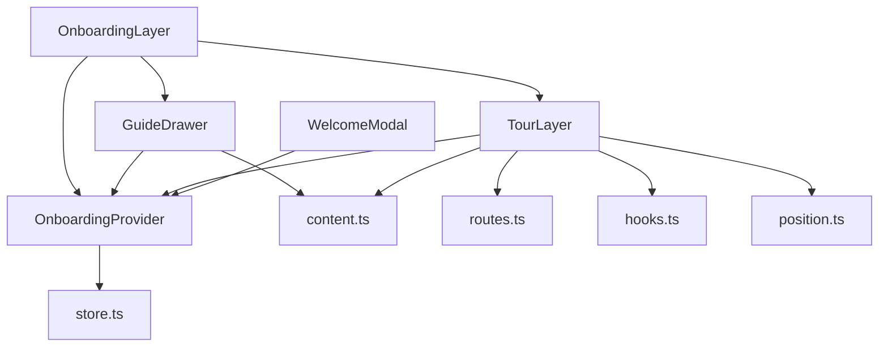
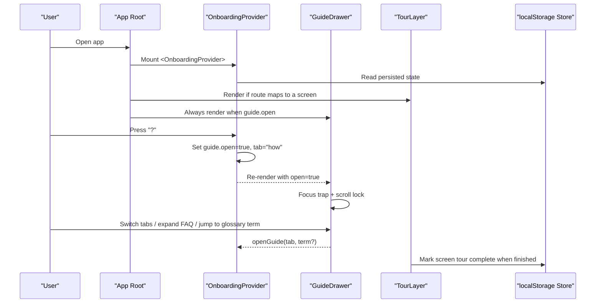
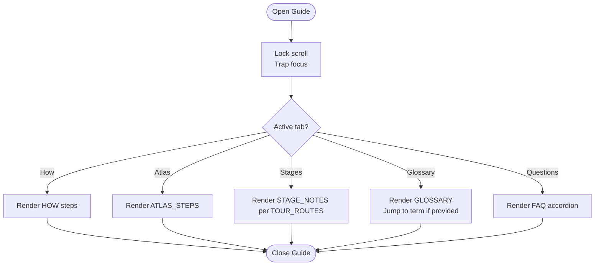
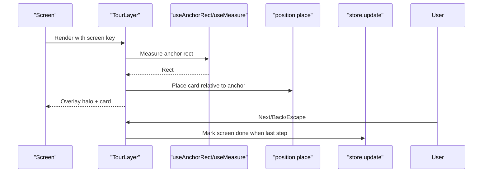
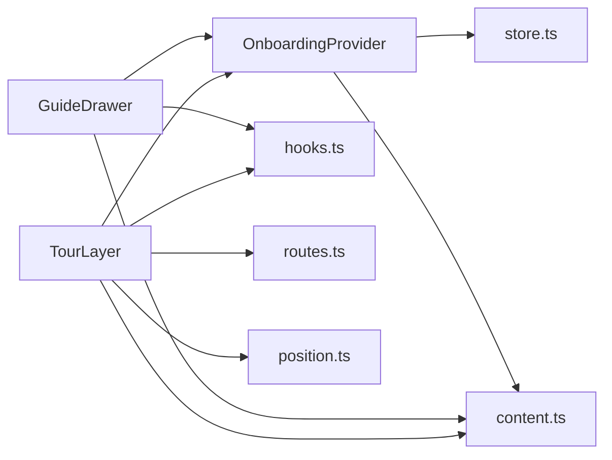

# Contextual Guide Drawer

<cite>
**Referenced Files in This Document**
- [GuideDrawer.tsx](file://src/components/onboarding/GuideDrawer.tsx)
- [OnboardingProvider.tsx](file://src/components/onboarding/OnboardingProvider.tsx)
- [TourLayer.tsx](file://src/components/onboarding/TourLayer.tsx)
- [OnboardingLayer.tsx](file://src/components/onboarding/OnboardingLayer.tsx)
- [content.ts](file://src/lib/onboarding/content.ts)
- [routes.ts](file://src/lib/onboarding/routes.ts)
- [hooks.ts](file://src/components/onboarding/hooks.ts)
- [position.ts](file://src/components/onboarding/position.ts)
- [store.ts](file://src/lib/onboarding/store.ts)
- [WelcomeModal.tsx](file://src/components/onboarding/WelcomeModal.tsx)
</cite>

## Table of Contents
1. Introduction
2. Project Structure
3. Core Components
4. Architecture Overview
5. Detailed Component Analysis
6. Dependency Analysis
7. Performance Considerations
8. Troubleshooting Guide
9. Conclusion
10. Appendices

## Introduction
This document explains the contextual guide drawer system that provides help and explanations throughout the application. It covers the tabbed interface structure (How it works, The flight layer, The screens, Glossary, Questions), content organization, keyboard-driven access, and how guides integrate with onboarding tours and screen context. It also includes practical guidance for adding new tabs, extending content, handling user queries, and providing contextual help based on the current screen or user actions.

## Project Structure
The guide system is composed of:
- A provider that owns global onboarding state and exposes a simple API to open/close guides and track progress.
- A drawer component that renders the tabbed manual with sections for How it works, Atlas, Screens, Glossary, and Questions.
- A tour layer that overlays coach marks anchored to specific UI elements.
- Content modules that define all guide text, glossary entries, FAQs, and tour steps.
- Routing helpers that map URL paths to tour screens.
- Hooks and positioning utilities that manage focus, scroll locking, viewport measurements, and callout placement.



**Diagram sources**
- [OnboardingLayer.tsx:16-33](file://src/components/onboarding/OnboardingLayer.tsx#L16-L33)
- [GuideDrawer.tsx:38-236](file://src/components/onboarding/GuideDrawer.tsx#L38-L236)
- [TourLayer.tsx:19-206](file://src/components/onboarding/TourLayer.tsx#L19-L206)
- [OnboardingProvider.tsx:49-164](file://src/components/onboarding/OnboardingProvider.tsx#L49-L164)
- [content.ts:224-520](file://src/lib/onboarding/content.ts#L224-L520)
- [routes.ts:1-31](file://src/lib/onboarding/routes.ts#L1-L31)
- [hooks.ts:13-214](file://src/components/onboarding/hooks.ts#L13-L214)
- [position.ts:1-109](file://src/components/onboarding/position.ts#L1-L109)
- [store.ts:1-95](file://src/lib/onboarding/store.ts#L1-L95)
- [WelcomeModal.tsx:18-139](file://src/components/onboarding/WelcomeModal.tsx#L18-L139)

**Section sources**
- [OnboardingLayer.tsx:16-33](file://src/components/onboarding/OnboardingLayer.tsx#L16-L33)
- [GuideDrawer.tsx:38-236](file://src/components/onboarding/GuideDrawer.tsx#L38-L236)
- [TourLayer.tsx:19-206](file://src/components/onboarding/TourLayer.tsx#L19-L206)
- [OnboardingProvider.tsx:49-164](file://src/components/onboarding/OnboardingProvider.tsx#L49-L164)
- [content.ts:224-520](file://src/lib/onboarding/content.ts#L224-L520)
- [routes.ts:1-31](file://src/lib/onboarding/routes.ts#L1-L31)
- [hooks.ts:13-214](file://src/components/onboarding/hooks.ts#L13-L214)
- [position.ts:1-109](file://src/components/onboarding/position.ts#L1-L109)
- [store.ts:1-95](file://src/lib/onboarding/store.ts#L1-L95)
- [WelcomeModal.tsx:18-139](file://src/components/onboarding/WelcomeModal.tsx#L18-L139)

## Core Components
- OnboardingProvider: Central state for welcome modal visibility, tour progress, and guide panel state. Exposes openGuide(tab?, term?) and closeGuide(), plus replay/restart controls. Also listens for the “?” key to open the guide from anywhere except input fields.
- GuideDrawer: Renders the tabbed manual with five tabs: How it works, The flight layer, The screens, Glossary, and Questions. Supports keyboard navigation, focus trapping, scroll locking, and deep-linking to glossary terms.
- TourLayer: Renders non-blocking coach marks anchored to page elements via data attributes. Manages step progression, keyboard navigation, and completion tracking per screen.
- OnboardingLayer: Mounts WelcomeModal, TourLayer (based on current route), and GuideDrawer at the app root.
- Content: Defines HOW, ATLAS_STEPS, STAGE_NOTES, GLOSSARY, FAQ, TOUR, and TOUR_TOTAL.
- Routes: Maps pathname prefixes to tour screen keys used by TourLayer.
- Hooks and Position: Provide focus trap, scroll lock, viewport measurement, anchor rect tracking, and callout placement logic.
- Store: Persists onboarding state (welcomed, tourDone, tourOff) in localStorage using a safe external store pattern.

**Section sources**
- [OnboardingProvider.tsx:17-164](file://src/components/onboarding/OnboardingProvider.tsx#L17-L164)
- [GuideDrawer.tsx:10-236](file://src/components/onboarding/GuideDrawer.tsx#L10-L236)
- [TourLayer.tsx:19-206](file://src/components/onboarding/TourLayer.tsx#L19-L206)
- [OnboardingLayer.tsx:16-33](file://src/components/onboarding/OnboardingLayer.tsx#L16-L33)
- [content.ts:224-520](file://src/lib/onboarding/content.ts#L224-L520)
- [routes.ts:1-31](file://src/lib/onboarding/routes.ts#L1-L31)
- [hooks.ts:157-214](file://src/components/onboarding/hooks.ts#L157-L214)
- [position.ts:35-109](file://src/components/onboarding/position.ts#L35-L109)
- [store.ts:13-95](file://src/lib/onboarding/store.ts#L13-L95)

## Architecture Overview
The guide system is a client-side overlay driven by a small external store and React context. The provider coordinates three surfaces:
- Welcome modal for first-run introduction.
- Coach marks (tour) that teach each screen in place.
- Guide drawer as an always-accessible manual reachable via “?”.



**Diagram sources**
- [OnboardingProvider.tsx:92-119](file://src/components/onboarding/OnboardingProvider.tsx#L92-L119)
- [GuideDrawer.tsx:46-75](file://src/components/onboarding/GuideDrawer.tsx#L46-L75)
- [TourLayer.tsx:40-43](file://src/components/onboarding/TourLayer.tsx#L40-L43)
- [store.ts:82-94](file://src/lib/onboarding/store.ts#L82-L94)

## Detailed Component Analysis

### GuideDrawer: Tabbed Manual
- Tabs: How it works, The flight layer, The screens, Glossary, Questions.
- Behavior:
  - Opens/closes via provider; supports Escape to close.
  - Focus trapped inside panel; body scroll locked while open.
  - Glossary supports jumping to a specific term by id and briefly highlighting it.
  - Each tab renders its section from content arrays.
  - Footer offers replay intro and restart tour actions.



**Diagram sources**
- [GuideDrawer.tsx:46-75](file://src/components/onboarding/GuideDrawer.tsx#L46-L75)
- [GuideDrawer.tsx:111-217](file://src/components/onboarding/GuideDrawer.tsx#L111-L217)
- [content.ts:224-520](file://src/lib/onboarding/content.ts#L224-L520)

**Section sources**
- [GuideDrawer.tsx:10-236](file://src/components/onboarding/GuideDrawer.tsx#L10-L236)
- [content.ts:224-520](file://src/lib/onboarding/content.ts#L224-L520)

### OnboardingProvider: State and Keyboard Access
- Maintains guide state (open/tab/term) and onboarding progress (welcomed, tourDone, tourOff).
- Provides openGuide(tab?, term?), closeGuide(), replayEverything(), restartTour().
- Global “?” shortcut opens the guide unless the active element is a text field.
- Progress computed from completed tour steps vs total steps.

```mermaid
classDiagram
class OnboardingProvider {
+ready : boolean
+welcomeOpen : boolean
+openWelcome()
+dismissWelcome()
+acceptTour()
+endTour()
+restartTour()
+screenTourDone(screen)
+completeScreenTour(screen)
+guide : {open, tab, term}
+openGuide(tab?, term?)
+closeGuide()
+replayEverything()
+progress : {done, total}
}
```

**Diagram sources**
- [OnboardingProvider.tsx:17-164](file://src/components/onboarding/OnboardingProvider.tsx#L17-L164)

**Section sources**
- [OnboardingProvider.tsx:17-164](file://src/components/onboarding/OnboardingProvider.tsx#L17-L164)
- [store.ts:13-95](file://src/lib/onboarding/store.ts#L13-L95)

### TourLayer: In-Place Coach Marks
- Reads per-screen steps from TOUR[screen].
- Anchors to elements via data-tour attributes; measures rects and places callouts intelligently.
- Non-blocking: underlying page remains interactive.
- Tracks per-screen completion and shows a chip indicating continuation across screens.



**Diagram sources**
- [TourLayer.tsx:19-206](file://src/components/onboarding/TourLayer.tsx#L19-L206)
- [hooks.ts:80-125](file://src/components/onboarding/hooks.ts#L80-L125)
- [position.ts:35-86](file://src/components/onboarding/position.ts#L35-L86)
- [store.ts:82-94](file://src/lib/onboarding/store.ts#L82-L94)

**Section sources**
- [TourLayer.tsx:19-206](file://src/components/onboarding/TourLayer.tsx#L19-L206)
- [hooks.ts:80-125](file://src/components/onboarding/hooks.ts#L80-L125)
- [position.ts:35-86](file://src/components/onboarding/position.ts#L35-L86)

### Content Organization
- HOW: Step-by-step explanation of the product flow.
- ATLAS_STEPS: Explanation of the travel provider layer.
- STAGE_NOTES: Per-screen descriptions mapped to TOUR_ROUTES.
- GLOSSARY: Terms with short and long definitions; supports deep linking by id.
- FAQ: Common questions with multi-paragraph answers.
- TOUR: Per-screen coach mark steps with anchors, titles, bodies, and preferred sides.
- TOUR_TOTAL: Sum of all tour steps for progress calculation.

**Section sources**
- [content.ts:224-520](file://src/lib/onboarding/content.ts#L224-L520)
- [routes.ts:1-31](file://src/lib/onboarding/routes.ts#L1-L31)

## Dependency Analysis
- GuideDrawer depends on:
  - OnboardingProvider for open/close/tab/term and tour controls.
  - content.ts for HOW, ATLAS_STEPS, STAGE_NOTES, GLOSSARY, FAQ.
  - hooks.ts for focus trap and scroll lock.
- TourLayer depends on:
  - OnboardingProvider for tour state and completion.
  - content.ts for TOUR steps.
  - routes.ts for mapping pathname to screen key.
  - hooks.ts and position.ts for anchoring and placement.
- OnboardingProvider depends on:
  - store.ts for persistent onboarding state.
  - content.ts for TOUR_TOTAL.



**Diagram sources**
- [GuideDrawer.tsx:3-8](file://src/components/onboarding/GuideDrawer.tsx#L3-L8)
- [TourLayer.tsx:3-8](file://src/components/onboarding/TourLayer.tsx#L3-L8)
- [OnboardingProvider.tsx:13-15](file://src/components/onboarding/OnboardingProvider.tsx#L13-L15)
- [store.ts:1-95](file://src/lib/onboarding/store.ts#L1-L95)

**Section sources**
- [GuideDrawer.tsx:3-8](file://src/components/onboarding/GuideDrawer.tsx#L3-L8)
- [TourLayer.tsx:3-8](file://src/components/onboarding/TourLayer.tsx#L3-L8)
- [OnboardingProvider.tsx:13-15](file://src/components/onboarding/OnboardingProvider.tsx#L13-L15)
- [store.ts:1-95](file://src/lib/onboarding/store.ts#L1-L95)

## Performance Considerations
- useSyncExternalStore avoids hydration mismatches and extra re-renders by reading localStorage only after hydration.
- Anchor rect tracking uses requestAnimationFrame with change detection to minimize layout thrash.
- Callout placement computes minimal necessary geometry and clamps within viewport bounds.
- Scroll lock prevents background scrolling without blocking interaction under overlays.
- Focus trap ensures accessible keyboard navigation within dialogs.

[No sources needed since this section provides general guidance]

## Troubleshooting Guide
- Guide does not open with “?”:
  - Ensure the active element is not an input or textarea; the provider intentionally ignores shortcuts in editable contexts.
- Glossary jump not working:
  - Confirm the target term has an id attribute matching the expected format and that the glossary tab is active when jumping.
- Coach marks not appearing:
  - Verify the screen’s data-tour attributes match the anchor ids defined in TOUR steps.
  - Check that the route maps correctly to a screen key.
- Tour progress not persisting:
  - Ensure localStorage is available; the store gracefully handles private browsing or quota errors by keeping session-only state.

**Section sources**
- [OnboardingProvider.tsx:104-119](file://src/components/onboarding/OnboardingProvider.tsx#L104-L119)
- [GuideDrawer.tsx:61-75](file://src/components/onboarding/GuideDrawer.tsx#L61-L75)
- [TourLayer.tsx:59-70](file://src/components/onboarding/TourLayer.tsx#L59-L70)
- [store.ts:82-94](file://src/lib/onboarding/store.ts#L82-L94)

## Conclusion
The contextual guide drawer system provides a consistent, accessible, and extensible way to explain the application. Its tabbed manual, integrated glossary, and FAQ complement the in-place coach marks to support both self-guided learning and guided tours. Adding new content or tabs is straightforward through the centralized content modules and provider APIs.

[No sources needed since this section summarizes without analyzing specific files]

## Appendices

### How to Add a New Guide Tab
- Define a new tab entry in the tabs list with a unique id and label.
- Add rendering logic for the new tab in the guide body, pulling content from a new array in content.ts.
- If the tab requires deep-linking or special behavior, add corresponding handlers in the provider or drawer.

**Section sources**
- [GuideDrawer.tsx:10-16](file://src/components/onboarding/GuideDrawer.tsx#L10-L16)
- [GuideDrawer.tsx:126-217](file://src/components/onboarding/GuideDrawer.tsx#L126-L217)
- [content.ts:224-520](file://src/lib/onboarding/content.ts#L224-L520)

### How to Implement Search Filtering in the Guide
- Current implementation does not include a search box. To add filtering:
  - Add a search input in the drawer header or per-tab area.
  - Maintain a query state and filter the relevant arrays (e.g., GLOSSARY, FAQ, HOW) by title, term, or body text.
  - For glossary, consider mapping results to term ids and programmatically opening the glossary tab and scrolling to the matched entry.
  - Debounce input changes to avoid excessive re-renders.

[No sources needed since this section proposes enhancements not present in the codebase]

### How to Integrate Guides into Application Screens
- Use the provider’s openGuide(tab, term?) to open the guide directly from UI actions (e.g., help buttons).
- For coach marks, ensure your screen elements have data-tour attributes matching TOUR step anchors.
- Map your route path to a TourRoute using routes.ts so TourLayer can render the correct steps.

**Section sources**
- [OnboardingProvider.tsx:92-96](file://src/components/onboarding/OnboardingProvider.tsx#L92-L96)
- [TourLayer.tsx:59-70](file://src/components/onboarding/TourLayer.tsx#L59-L70)
- [routes.ts:13-21](file://src/lib/onboarding/routes.ts#L13-L21)

### Examples of Creating Guide Content
- How it works: Add entries to HOW with id, n, title, body, and optional points.
- The flight layer: Add entries to ATLAS_STEPS with title and body.
- The screens: Add STAGE_NOTES entries keyed by TourRoute with title and body.
- Glossary: Add entries to GLOSSARY with id, term, short, long.
- Questions: Add entries to FAQ with id, q, and a array of paragraphs.
- Coach marks: Add per-screen steps to TOUR with id, anchor, eyebrow, title, body, side, and pad.

**Section sources**
- [content.ts:224-520](file://src/lib/onboarding/content.ts#L224-L520)

### Handling User Queries and Providing Contextual Help
- Use openGuide("glossary", termId) to jump to a specific term when users ask about terminology.
- Use openGuide("questions") to surface relevant FAQs when users express skepticism or confusion.
- Combine with screen context: open the appropriate tab based on where the user is (e.g., stages tab when explaining a screen).

**Section sources**
- [OnboardingProvider.tsx:92-96](file://src/components/onboarding/OnboardingProvider.tsx#L92-L96)
- [GuideDrawer.tsx:61-75](file://src/components/onboarding/GuideDrawer.tsx#L61-L75)
- [content.ts:425-490](file://src/lib/onboarding/content.ts#L425-L490)