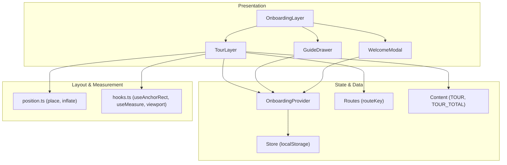
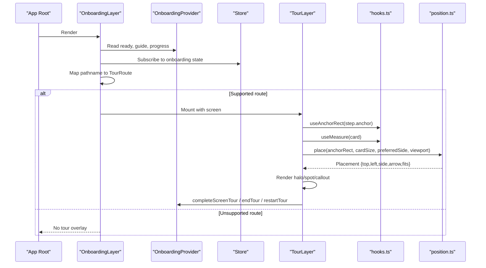
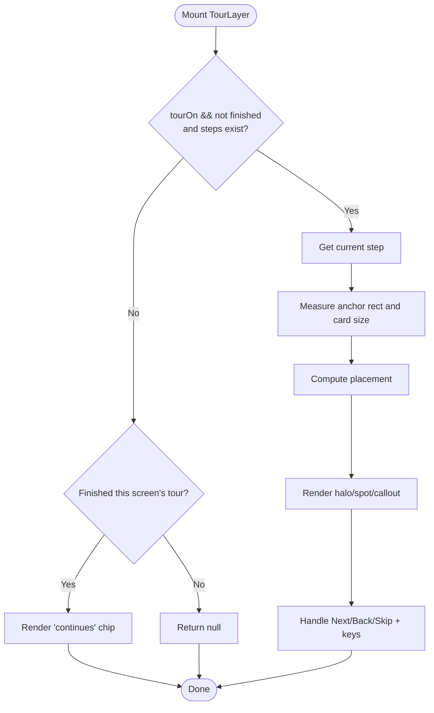
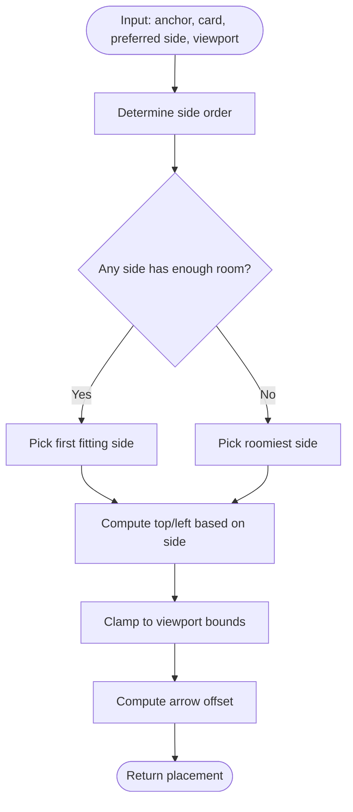
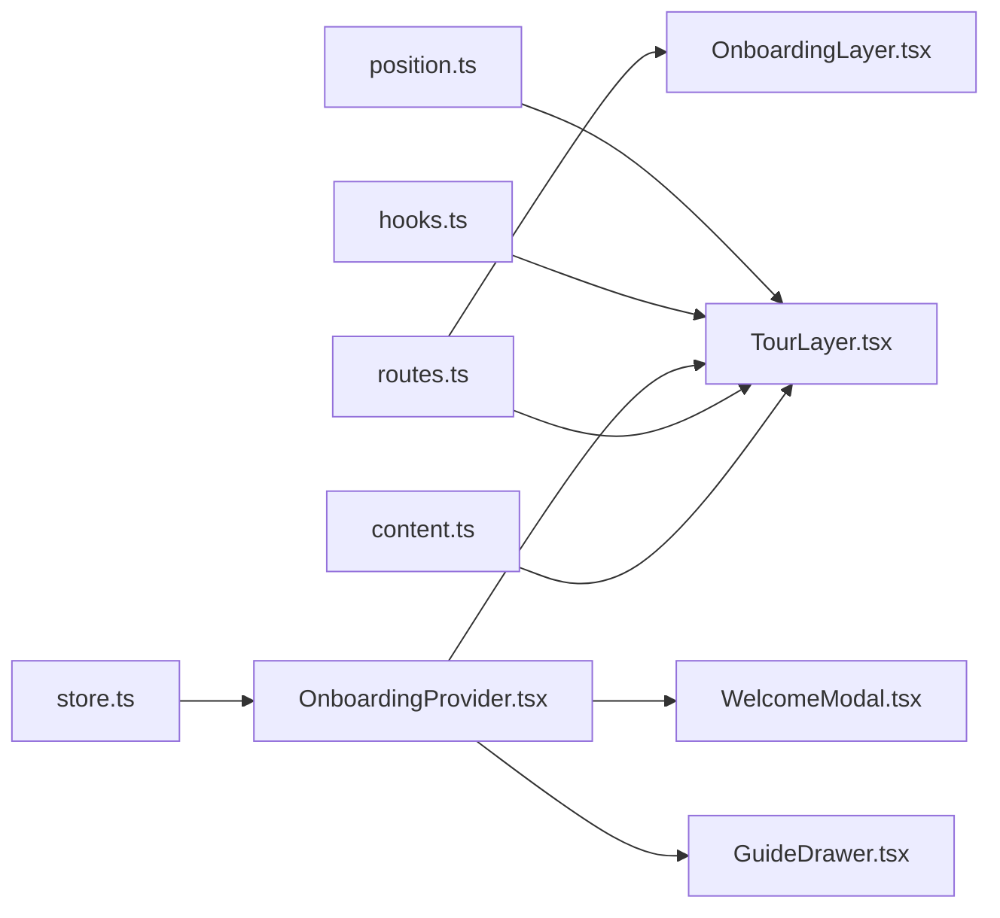

# Interactive Tour System

<cite>
**Referenced Files in This Document**
- [TourLayer.tsx](file://src/components/onboarding/TourLayer.tsx)
- [OnboardingProvider.tsx](file://src/components/onboarding/OnboardingProvider.tsx)
- [OnboardingLayer.tsx](file://src/components/onboarding/OnboardingLayer.tsx)
- [position.ts](file://src/components/onboarding/position.ts)
- [hooks.ts](file://src/components/onboarding/hooks.ts)
- [routes.ts](file://src/lib/onboarding/routes.ts)
- [content.ts](file://src/lib/onboarding/content.ts)
- [store.ts](file://src/lib/onboarding/store.ts)
- [GuideDrawer.tsx](file://src/components/onboarding/GuideDrawer.tsx)
- [WelcomeModal.tsx](file://src/components/onboarding/WelcomeModal.tsx)
- [Wizard.tsx](file://src/components/onboarding/Wizard.tsx)
</cite>

## Table of Contents
1. [Introduction](#introduction)
2. [Project Structure](#project-structure)
3. [Core Components](#core-components)
4. [Architecture Overview](#architecture-overview)
5. [Detailed Component Analysis](#detailed-component-analysis)
6. [Dependency Analysis](#dependency-analysis)
7. [Performance Considerations](#performance-considerations)
8. [Troubleshooting Guide](#troubleshooting-guide)
9. [Conclusion](#conclusion)
10. [Appendices](#appendices)

## Introduction
This document explains the interactive tour system that guides users through application features using non-blocking, route-based coach marks. The system overlays guided tours on top of existing UI, positions callouts relative to page elements, and persists progress across screens. It includes:
- A TourLayer component that renders contextual steps anchored to DOM nodes
- A positioning engine that places callouts around anchors with fallback strategies
- Route-based definitions that map app routes to tour content
- State management for tour lifecycle, screen completion, and global progress
- Integration points to start, end, and restart tours from any screen

The goal is to help you define tour routes, create tour steps with content and actions, integrate tours into screens, handle events, and manage state consistently across the application.

## Project Structure
The tour system is composed of presentation components, a positioning module, hooks for measurement and accessibility, and shared data models for routes and content.

**Diagram sources**
- [OnboardingLayer.tsx:1-37](file://src/components/onboarding/OnboardingLayer.tsx#L1-L37)
- [TourLayer.tsx:1-207](file://src/components/onboarding/TourLayer.tsx#L1-L207)
- [OnboardingProvider.tsx:1-166](file://src/components/onboarding/OnboardingProvider.tsx#L1-L166)
- [position.ts:1-109](file://src/components/onboarding/position.ts#L1-L109)
- [hooks.ts:1-214](file://src/components/onboarding/hooks.ts#L1-L214)
- [routes.ts:1-31](file://src/lib/onboarding/routes.ts#L1-L31)
- [content.ts:1-520](file://src/lib/onboarding/content.ts#L1-L520)
- [store.ts:1-95](file://src/lib/onboarding/store.ts#L1-L95)

**Section sources**
- [OnboardingLayer.tsx:1-37](file://src/components/onboarding/OnboardingLayer.tsx#L1-L37)
- [TourLayer.tsx:1-207](file://src/components/onboarding/TourLayer.tsx#L1-L207)
- [OnboardingProvider.tsx:1-166](file://src/components/onboarding/OnboardingProvider.tsx#L1-L166)
- [position.ts:1-109](file://src/components/onboarding/position.ts#L1-L109)
- [hooks.ts:1-214](file://src/components/onboarding/hooks.ts#L1-L214)
- [routes.ts:1-31](file://src/lib/onboarding/routes.ts#L1-L31)
- [content.ts:1-520](file://src/lib/onboarding/content.ts#L1-L520)
- [store.ts:1-95](file://src/lib/onboarding/store.ts#L1-L95)

## Core Components
- TourLayer: Renders step-by-step guidance anchored to specific elements; handles navigation between steps, keyboard controls, scrolling to anchors, and completion per screen.
- OnboardingProvider: Centralizes tour state (enabled/disabled), welcome modal visibility, per-screen completion tracking, guide drawer state, and overall progress.
- Positioning Engine: Computes placement of callout cards next to anchors with side selection, arrow alignment, and viewport clamping.
- Hooks: Provide anchor rect tracking, element measurement, viewport size, reduced motion preference, focus trapping, and scroll locking.
- Routes & Content: Define which app routes have tours and what each step says and where it points.
- Store: Persists onboarding state (welcome status, completed screens, tour enabled flag) across sessions.

**Section sources**
- [TourLayer.tsx:1-207](file://src/components/onboarding/TourLayer.tsx#L1-L207)
- [OnboardingProvider.tsx:1-166](file://src/components/onboarding/OnboardingProvider.tsx#L1-L166)
- [position.ts:1-109](file://src/components/onboarding/position.ts#L1-L109)
- [hooks.ts:1-214](file://src/components/onboarding/hooks.ts#L1-L214)
- [routes.ts:1-31](file://src/lib/onboarding/routes.ts#L1-L31)
- [content.ts:1-520](file://src/lib/onboarding/content.ts#L1-L520)
- [store.ts:1-95](file://src/lib/onboarding/store.ts#L1-L95)

## Architecture Overview
The tour system mounts once at the app root via OnboardingLayer. It reads the current pathname, maps it to a TourRoute, and conditionally renders TourLayer for supported screens. TourLayer uses hooks to measure the anchor and card, then uses the positioning module to place the callout. OnboardingProvider manages global state and persistence via the store.

**Diagram sources**
- [OnboardingLayer.tsx:1-37](file://src/components/onboarding/OnboardingLayer.tsx#L1-L37)
- [TourLayer.tsx:1-207](file://src/components/onboarding/TourLayer.tsx#L1-L207)
- [position.ts:1-109](file://src/components/onboarding/position.ts#L1-L109)
- [hooks.ts:1-214](file://src/components/onboarding/hooks.ts#L1-L214)
- [store.ts:1-95](file://src/lib/onboarding/store.ts#L1-L95)

## Detailed Component Analysis

### TourLayer: Overlay and Step Navigation
Responsibilities:
- Determine active tour based on provider state and whether the current screen’s tour is finished
- Track current step index and reset when switching screens
- Scroll to anchor elements smoothly or instantly depending on user preferences
- Render spotlight/halo around anchors and position the callout card
- Provide Next/Back/Skip and keyboard navigation (arrows, Escape)
- Show a small chip after finishing a screen’s tour indicating continuation or completion

Key behaviors:
- Non-blocking overlay: underlying UI remains interactive
- Anchor detection by data attribute
- Side-aware placement with fallback if no side fits
- Progress indicators and accessible dialog semantics

**Section sources**
- [TourLayer.tsx:1-207](file://src/components/onboarding/TourLayer.tsx#L1-L207)

#### TourLayer Rendering Flow

**Diagram sources**
- [TourLayer.tsx:1-207](file://src/components/onboarding/TourLayer.tsx#L1-L207)
- [position.ts:1-109](file://src/components/onboarding/position.ts#L1-L109)
- [hooks.ts:1-214](file://src/components/onboarding/hooks.ts#L1-L214)

### Positioning Engine: Anchor-Aware Callout Placement
Responsibilities:
- Choose the best side (top/bottom/left/right) based on available space
- Clamp coordinates to keep the callout within the viewport
- Compute arrow offset along the callout edge
- Inflate anchor rects to create a visible halo

Algorithm highlights:
- Preferred side first, then fallback order
- Space calculation per side considering margins and gaps
- Clamping to avoid overflow
- Arrow inset constraints

**Section sources**
- [position.ts:1-109](file://src/components/onboarding/position.ts#L1-L109)

#### Placement Algorithm

**Diagram sources**
- [position.ts:1-109](file://src/components/onboarding/position.ts#L1-L109)

### Hooks: Measurement, Viewport, Accessibility
Responsibilities:
- Track anchor element rectangles efficiently with requestAnimationFrame and change detection
- Measure callout card dimensions with ResizeObserver
- Provide viewport size updates without layout thrashing
- Respect reduced motion preferences
- Trap focus inside dialogs and lock body scrolling when needed

Usage in TourLayer:
- useAnchorRect finds the element by data attribute and returns its bounding rect
- useMeasure tracks the callout card size for placement
- useViewport supplies width/height for placement calculations
- usePrefersReducedMotion influences scroll behavior

**Section sources**
- [hooks.ts:1-214](file://src/components/onboarding/hooks.ts#L1-L214)

### OnboardingProvider: Global Tour State
Responsibilities:
- Manage welcome modal visibility and tour activation
- Track per-screen tour completion and overall progress
- Expose methods to end/restart tours, open/close guide, and replay introduction
- Persist state to localStorage via store and hydrate without flash

Key state:
- ready: hydration guard
- welcomed: whether intro was shown/dismissed
- tourOff: whether coach marks are disabled
- tourDone: list of completed screen routes
- guide: drawer state
- progress: computed done vs total steps

**Section sources**
- [OnboardingProvider.tsx:1-166](file://src/components/onboarding/OnboardingProvider.tsx#L1-L166)
- [store.ts:1-95](file://src/lib/onboarding/store.ts#L1-L95)

### Routes and Content: Defining Tours
Routes:
- Map pathnames to TourRoute identifiers
- Provide labels for each screen used in the guide

Content:
- TOUR: array of steps per route, each with id, anchor selector, eyebrow, title, body, optional side and padding
- TOUR_TOTAL: total number of steps across all routes
- Additional guide content (how it works, atlas, glossary, questions)

How to define a new tour route:
- Add the route key to the allowed list and mapping function
- Add entries under TOUR for that route
- Ensure your UI elements include matching data-tour attributes

**Section sources**
- [routes.ts:1-31](file://src/lib/onboarding/routes.ts#L1-L31)
- [content.ts:1-520](file://src/lib/onboarding/content.ts#L1-L520)

### Integration Points: Starting Tours and Handling Events
- Welcome flow: Users can accept the tour from the welcome modal or skip to explore
- Wizard completion: Finishing the wizard triggers acceptance of the tour and starts the session
- Keyboard shortcuts: Arrows navigate steps, Escape ends tour; “?” opens guide
- Completion: When a screen’s tour finishes, the system records it and shows a chip indicating continuation

Examples:
- To start the tour after onboarding, call the provider method that enables coach marks
- To end the tour early, call the provider method that disables coach marks
- To restart the tour, clear completed screens and re-enable coach marks

**Section sources**
- [WelcomeModal.tsx:1-139](file://src/components/onboarding/WelcomeModal.tsx#L1-L139)
- [Wizard.tsx:1-509](file://src/components/onboarding/Wizard.tsx#L1-L509)
- [TourLayer.tsx:1-207](file://src/components/onboarding/TourLayer.tsx#L1-L207)
- [OnboardingProvider.tsx:1-166](file://src/components/onboarding/OnboardingProvider.tsx#L1-L166)

## Dependency Analysis

**Diagram sources**
- [content.ts:1-520](file://src/lib/onboarding/content.ts#L1-L520)
- [routes.ts:1-31](file://src/lib/onboarding/routes.ts#L1-L31)
- [store.ts:1-95](file://src/lib/onboarding/store.ts#L1-L95)
- [OnboardingProvider.tsx:1-166](file://src/components/onboarding/OnboardingProvider.tsx#L1-L166)
- [TourLayer.tsx:1-207](file://src/components/onboarding/TourLayer.tsx#L1-L207)
- [OnboardingLayer.tsx:1-37](file://src/components/onboarding/OnboardingLayer.tsx#L1-L37)
- [hooks.ts:1-214](file://src/components/onboarding/hooks.ts#L1-L214)
- [position.ts:1-109](file://src/components/onboarding/position.ts#L1-L109)

**Section sources**
- [OnboardingLayer.tsx:1-37](file://src/components/onboarding/OnboardingLayer.tsx#L1-L37)
- [TourLayer.tsx:1-207](file://src/components/onboarding/TourLayer.tsx#L1-L207)
- [OnboardingProvider.tsx:1-166](file://src/components/onboarding/OnboardingProvider.tsx#L1-L166)
- [position.ts:1-109](file://src/components/onboarding/position.ts#L1-L109)
- [hooks.ts:1-214](file://src/components/onboarding/hooks.ts#L1-L214)
- [routes.ts:1-31](file://src/lib/onboarding/routes.ts#L1-L31)
- [content.ts:1-520](file://src/lib/onboarding/content.ts#L1-L520)
- [store.ts:1-95](file://src/lib/onboarding/store.ts#L1-L95)

## Performance Considerations
- Anchor tracking uses requestAnimationFrame with change detection to minimize re-renders
- Viewport size is cached and only updated on resize events
- Reduced motion preference avoids smooth scrolling animations when requested
- Placement algorithm runs only when anchor/card sizes change
- LocalStorage writes are batched via an external store with listeners to avoid excessive updates

[No sources needed since this section provides general guidance]

## Troubleshooting Guide
Common issues and resolutions:
- Tour does not appear on a screen:
  - Ensure the route is included in the allowed list and mapped by the route function
  - Verify the step’s anchor matches a data attribute on the target element
  - Confirm the tour is enabled and the screen’s tour is not marked as completed
- Callout overlaps or goes off-screen:
  - The positioning engine will try alternative sides; check viewport size and anchor location
  - Adjust step padding if the halo needs more space
- Keyboard navigation not working:
  - Ensure focus is not trapped in an input during tour navigation
  - Confirm event listeners are attached when the tour is active
- State not persisting:
  - Check localStorage availability and permissions
  - Validate that updates are applied via the store’s update function

**Section sources**
- [TourLayer.tsx:1-207](file://src/components/onboarding/TourLayer.tsx#L1-L207)
- [position.ts:1-109](file://src/components/onboarding/position.ts#L1-L109)
- [store.ts:1-95](file://src/lib/onboarding/store.ts#L1-L95)

## Conclusion
The interactive tour system provides a robust, non-blocking guided experience anchored to real UI elements. By defining routes and steps declaratively, leveraging precise placement logic, and managing state centrally, teams can deliver consistent onboarding across screens. Use the provided hooks and provider APIs to integrate tours seamlessly, handle user interactions, and maintain progress across sessions.

[No sources needed since this section summarizes without analyzing specific files]

## Appendices

### How to Define a New Tour Route
- Add the route identifier to the allowed list and mapping function
- Add one or more steps under the route’s entry in the content object
- Mark UI elements with the corresponding data attribute referenced by each step’s anchor
- Optionally set preferred side and padding per step

**Section sources**
- [routes.ts:1-31](file://src/lib/onboarding/routes.ts#L1-L31)
- [content.ts:1-520](file://src/lib/onboarding/content.ts#L1-L520)

### How to Integrate Tours with Screen Components
- Ensure your screen is reachable via a mapped route
- Add data attributes to elements you want to highlight during the tour
- No additional wiring is required; TourLayer auto-detects and renders steps

**Section sources**
- [OnboardingLayer.tsx:1-37](file://src/components/onboarding/OnboardingLayer.tsx#L1-L37)
- [TourLayer.tsx:1-207](file://src/components/onboarding/TourLayer.tsx#L1-L207)

### Managing Tour State Across Screens
- Use provider methods to enable/disable tours, mark screens complete, and restart
- Progress is computed from completed screens and total steps
- Persistence ensures returning users see appropriate states

**Section sources**
- [OnboardingProvider.tsx:1-166](file://src/components/onboarding/OnboardingProvider.tsx#L1-L166)
- [store.ts:1-95](file://src/lib/onboarding/store.ts#L1-L95)