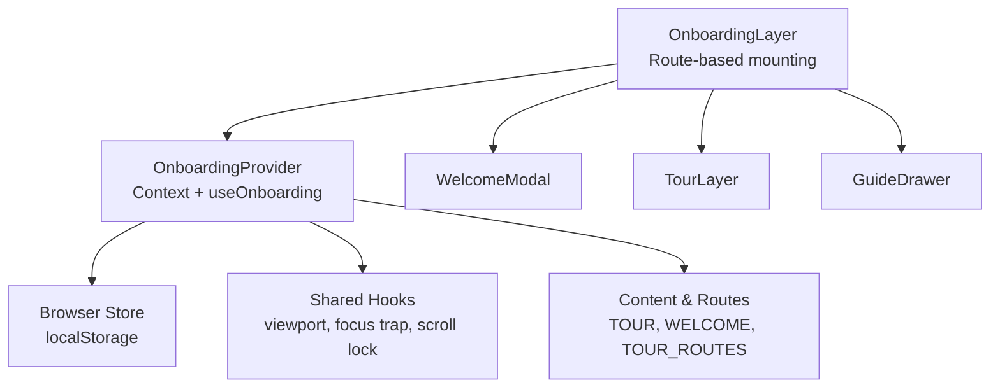
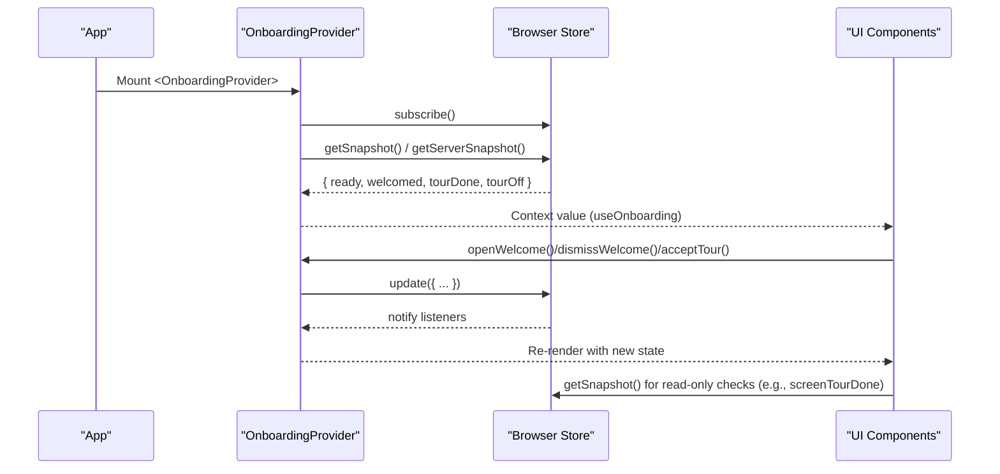
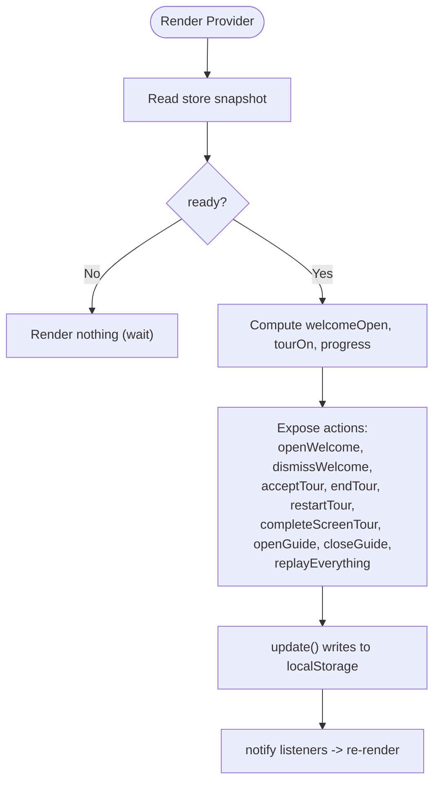
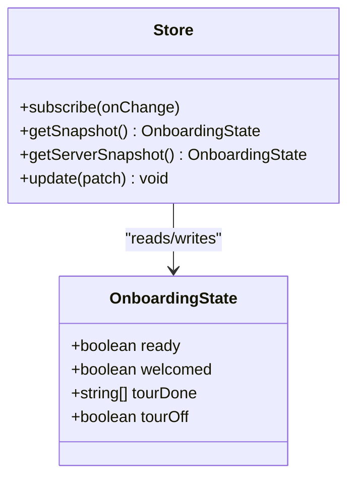
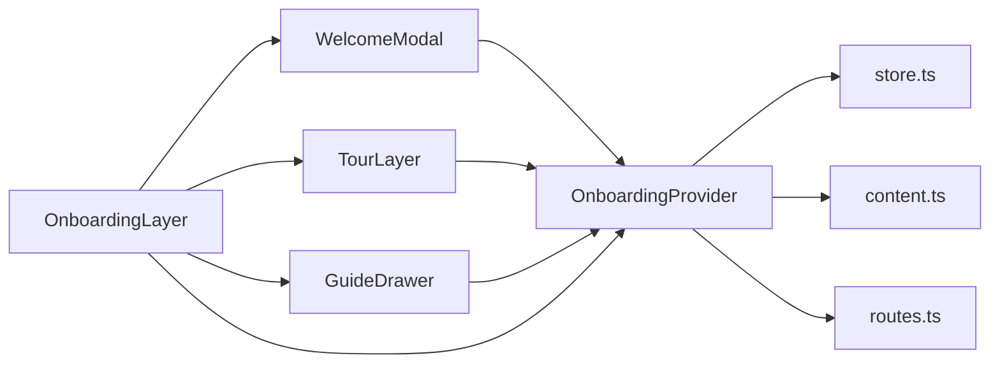

# Onboarding Provider & State Management

<cite>
**Referenced Files in This Document**
- [OnboardingProvider.tsx](file://src/components/onboarding/OnboardingProvider.tsx)
- [store.ts](file://src/lib/onboarding/store.ts)
- [content.ts](file://src/lib/onboarding/content.ts)
- [routes.ts](file://src/lib/onboarding/routes.ts)
- [hooks.ts](file://src/components/onboarding/hooks.ts)
- [WelcomeModal.tsx](file://src/components/onboarding/WelcomeModal.tsx)
- [TourLayer.tsx](file://src/components/onboarding/TourLayer.tsx)
- [GuideDrawer.tsx](file://src/components/onboarding/GuideDrawer.tsx)
- [OnboardingLayer.tsx](file://src/components/onboarding/OnboardingLayer.tsx)
</cite>

## Table of Contents
1. [Introduction](#introduction)
2. [Project Structure](#project-structure)
3. [Core Components](#core-components)
4. [Architecture Overview](#architecture-overview)
5. [Detailed Component Analysis](#detailed-component-analysis)
6. [Dependency Analysis](#dependency-analysis)
7. [Performance Considerations](#performance-considerations)
8. [Troubleshooting Guide](#troubleshooting-guide)
9. [Conclusion](#conclusion)
10. [Appendices](#appendices)

## Introduction
This document explains the OnboardingProvider context and its state management system for guiding new users through the application. It covers:
- Global onboarding state: welcome modal visibility, tour progress tracking, and guide panel state
- Browser persistence using useSyncExternalStore
- State update mechanisms and how components consume state via the useOnboarding hook
- Practical examples of accessing state, managing tour completion, and handling user interactions

The system is designed to be non-blocking and resilient: coach marks highlight UI without preventing interaction, progress persists across sessions, and a built-in guide provides help at any time.

## Project Structure
The onboarding feature spans a small set of focused modules:
- Provider and hooks: central state and consumption API
- Store: external store backed by localStorage with hydration-safe snapshots
- Content and routes: declarative definitions for tours, steps, and screen mapping
- UI layers: Welcome modal, Tour layer (coach marks), and Guide drawer
- Orchestration layer: mounts surfaces based on current route and provider readiness

**Diagram sources**
- [OnboardingProvider.tsx:49-165](file://src/components/onboarding/OnboardingProvider.tsx#L49-L165)
- [store.ts:1-95](file://src/lib/onboarding/store.ts#L1-L95)
- [content.ts:71-222](file://src/lib/onboarding/content.ts#L71-L222)
- [routes.ts:1-31](file://src/lib/onboarding/routes.ts#L1-L31)
- [OnboardingLayer.tsx:16-36](file://src/components/onboarding/OnboardingLayer.tsx#L16-L36)

**Section sources**
- [OnboardingProvider.tsx:49-165](file://src/components/onboarding/OnboardingProvider.tsx#L49-L165)
- [store.ts:1-95](file://src/lib/onboarding/store.ts#L1-L95)
- [OnboardingLayer.tsx:16-36](file://src/components/onboarding/OnboardingLayer.tsx#L16-L36)

## Core Components
- OnboardingProvider: Creates React context, subscribes to an external store, manages local UI state (guide panel, welcome override), exposes methods to open/dismiss welcome, start/end/restart tour, complete screens, and replay everything.
- Browser Store: A tiny external store that reads/writes localStorage, supports server snapshot for SSR/hydration safety, and notifies subscribers on updates.
- useOnboarding hook: Consumes the context; throws if used outside the provider.
- UI Layers:
  - WelcomeModal: First-run introduction panels with keyboard navigation and focus/scroll management.
  - TourLayer: Non-blocking coach marks anchored to elements, step-by-step guidance per screen, and progress tracking.
  - GuideDrawer: In-product manual with tabs (how it works, atlas, stages, glossary, questions), accessible via “?” key.

Key responsibilities:
- Persistence: welcomed flag, completed tour screens, and whether tours are turned off
- Readiness: prevents flashing UI before store is readable
- Keyboard shortcuts: “?” opens guide; arrow keys navigate tours; Escape ends or closes modals
- Progress computation: counts total steps completed vs total available

**Section sources**
- [OnboardingProvider.tsx:21-47](file://src/components/onboarding/OnboardingProvider.tsx#L21-L47)
- [store.ts:13-33](file://src/lib/onboarding/store.ts#L13-L33)
- [WelcomeModal.tsx:18-49](file://src/components/onboarding/WelcomeModal.tsx#L18-L49)
- [TourLayer.tsx:19-45](file://src/components/onboarding/TourLayer.tsx#L19-L45)
- [GuideDrawer.tsx:38-77](file://src/components/onboarding/GuideDrawer.tsx#L38-L77)

## Architecture Overview
The architecture centers around a stable external store and a thin provider that bridges React state and browser storage.

**Diagram sources**
- [OnboardingProvider.tsx:49-102](file://src/components/onboarding/OnboardingProvider.tsx#L49-L102)
- [store.ts:68-94](file://src/lib/onboarding/store.ts#L68-L94)

## Detailed Component Analysis

### OnboardingProvider
Responsibilities:
- Subscribe to external store via useSyncExternalStore
- Manage local UI state for guide panel and temporary welcome override
- Expose actions: open/dismiss welcome, accept/restart/end tour, complete screen tour, open/close guide, replay everything
- Compute derived values: tourOn, progress (done/total)

State shape exposed:
- ready: boolean indicating store readiness
- welcomeOpen: computed from stored.welcomed and session-level override
- tourOn: true when welcomed and tour not turned off
- guide: { open, tab, term }
- progress: { done, total }

Key behaviors:
- Hydration safety: ready=false until store is readable; UI waits
- Keyboard shortcut “?” toggles guide unless inside inputs
- Tour completion per screen tracked in store.tourDone
- Progress computed from TOUR content lengths

**Diagram sources**
- [OnboardingProvider.tsx:49-124](file://src/components/onboarding/OnboardingProvider.tsx#L49-L124)
- [store.ts:82-94](file://src/lib/onboarding/store.ts#L82-L94)

**Section sources**
- [OnboardingProvider.tsx:49-165](file://src/components/onboarding/OnboardingProvider.tsx#L49-L165)

### Browser Store (useSyncExternalStore pattern)
Design:
- External store with subscribe/getSnapshot/getServerSnapshot
- Server snapshot returns ready=false to avoid hydration mismatch
- Client snapshot caches and reads localStorage, migrating legacy keys
- update merges patches, persists to localStorage, and notifies subscribers

Data model:
- ready: rendering concern only
- welcomed: first-run intro dismissed or accepted
- tourDone: array of completed screen keys
- tourOff: global toggle to disable coach marks

Persistence and migration:
- Reads current and legacy keys
- Validates tourDone entries against allowed routes
- Gracefully handles storage errors (private mode, quota exceeded)

**Diagram sources**
- [store.ts:13-33](file://src/lib/onboarding/store.ts#L13-L33)
- [store.ts:68-94](file://src/lib/onboarding/store.ts#L68-L94)

**Section sources**
- [store.ts:1-95](file://src/lib/onboarding/store.ts#L1-L95)

### WelcomeModal
Behavior:
- Multi-panel introduction with keyboard navigation (arrows, Escape)
- Uses focus trap and scroll lock while open
- Dismissing sets welcomed=true and turns tours off
- Accepting starts the guided tour and resets tour progress

Integration:
- Consumed by OnboardingLayer when not on the wizard page
- Controlled by provider’s welcomeOpen and actions

**Section sources**
- [WelcomeModal.tsx:18-139](file://src/components/onboarding/WelcomeModal.tsx#L18-L139)
- [OnboardingLayer.tsx:16-36](file://src/components/onboarding/OnboardingLayer.tsx#L16-L36)

### TourLayer
Behavior:
- Renders coach marks per screen based on TOUR content
- Anchors to elements via data-tour attributes and measures their rects
- Non-blocking: underlying page remains interactive
- Tracks per-screen step index and completion
- Scrolls anchor into view and positions callout card relative to viewport
- Keyboard controls: arrows to navigate, Escape to end tour

Progress:
- Completes screen via completeScreenTour when last step reached
- Displays chip showing overall progress and option to end tour

**Section sources**
- [TourLayer.tsx:19-207](file://src/components/onboarding/TourLayer.tsx#L19-L207)
- [content.ts:71-222](file://src/lib/onboarding/content.ts#L71-L222)

### GuideDrawer
Behavior:
- Accessible via “?” key anywhere (when not in input fields)
- Tabs: How it works, The flight layer, The screens, Glossary, Questions
- Focus trap and scroll lock while open
- Supports jumping to glossary terms and resetting scroll between tabs
- Provides actions to replay intro or restart tour

**Section sources**
- [GuideDrawer.tsx:38-237](file://src/components/onboarding/GuideDrawer.tsx#L38-L237)
- [OnboardingProvider.tsx:104-119](file://src/components/onboarding/OnboardingProvider.tsx#L104-L119)

### Shared Hooks
- useHydrated: indicates client-side hydration status
- useViewport: tracks window size with stable snapshot caching
- useAnchorRect: measures target element rect via rAF loop and interval fallback
- useMeasure: observes element size changes
- useFocusTrap: keeps focus within dialog and restores previous focus
- useScrollLock: locks body scrolling while blocking surfaces are open

These hooks support robust UX for modals and coach marks.

**Section sources**
- [hooks.ts:13-214](file://src/components/onboarding/hooks.ts#L13-L214)

## Dependency Analysis
High-level dependencies:
- OnboardingProvider depends on store, content, and routes
- UI layers depend on provider and shared hooks
- Store depends on routes for validation and uses localStorage

**Diagram sources**
- [OnboardingProvider.tsx:1-16](file://src/components/onboarding/OnboardingProvider.tsx#L1-L16)
- [store.ts:1-2](file://src/lib/onboarding/store.ts#L1-L2)
- [content.ts:1-11](file://src/lib/onboarding/content.ts#L1-L11)
- [routes.ts:1-11](file://src/lib/onboarding/routes.ts#L1-L11)
- [OnboardingLayer.tsx:1-9](file://src/components/onboarding/OnboardingLayer.tsx#L1-L9)

**Section sources**
- [OnboardingProvider.tsx:1-16](file://src/components/onboarding/OnboardingProvider.tsx#L1-L16)
- [store.ts:1-2](file://src/lib/onboarding/store.ts#L1-L2)
- [content.ts:1-11](file://src/lib/onboarding/content.ts#L1-L11)
- [routes.ts:1-11](file://src/lib/onboarding/routes.ts#L1-L11)
- [OnboardingLayer.tsx:1-9](file://src/components/onboarding/OnboardingLayer.tsx#L1-L9)

## Performance Considerations
- Hydration safety: Provider waits for store.ready to prevent flashes during SSR/hydration
- Efficient measurements: useAnchorRect uses requestAnimationFrame plus a slow timer to avoid layout thrashing
- Stable snapshots: viewport cache avoids unnecessary re-renders
- Minimal persistence: only essential flags persisted; ready is not stored
- Non-blocking tours: coach marks do not prevent user interaction, reducing friction

[No sources needed since this section provides general guidance]

## Troubleshooting Guide
Common issues and resolutions:
- Welcome modal does not appear:
  - Ensure provider is mounted and ready; check that store is readable
  - Verify welcomed flag is false or no session override is forcing closed
- Tours not starting:
  - Check that acceptTour was called and welcomed is true
  - Ensure tourOff is false
- Coach marks not appearing:
  - Confirm the target element has the correct data-tour attribute matching the step anchor
  - Verify the element is visible and has dimensions > 0
- Guide not opening with “?”:
  - Ensure active element is not an input or textarea
  - Check that modifier keys are not pressed
- Persistence not working:
  - Private browsing or full quota can cause silent failures; onboarding still functions but forgets between reloads
  - Validate that update calls are executed and listeners are notified

**Section sources**
- [store.ts:82-94](file://src/lib/onboarding/store.ts#L82-L94)
- [TourLayer.tsx:59-70](file://src/components/onboarding/TourLayer.tsx#L59-L70)
- [OnboardingProvider.tsx:104-119](file://src/components/onboarding/OnboardingProvider.tsx#L104-L119)

## Conclusion
The OnboardingProvider system provides a robust, persistent, and user-friendly onboarding experience:
- Centralized state via React context and an external store
- Hydration-safe initialization and smooth transitions
- Per-screen coach marks with progress tracking
- An always-accessible guide for self-service help
- Resilient persistence with graceful fallbacks

Adopting this pattern ensures consistent behavior across the app while keeping components decoupled and testable.

[No sources needed since this section summarizes without analyzing specific files]

## Appendices

### Examples: Using useOnboarding in Components
- Access state and actions:
  - Call useOnboarding to get welcomeOpen, tourOn, guide, progress, and methods like openWelcome, dismissWelcome, acceptTour, endTour, restartTour, completeScreenTour, openGuide, closeGuide, replayEverything
- Example flows:
  - Open welcome modal programmatically: call openWelcome
  - Dismiss welcome and skip tour: call dismissWelcome
  - Start guided tour: call acceptTour
  - End tour early: call endTour
  - Mark a screen’s tour as complete: call completeScreenTour(screen)
  - Open guide with a specific tab or term: call openGuide(tab, term)
  - Replay entire onboarding: call replayEverything

**Section sources**
- [OnboardingProvider.tsx:21-47](file://src/components/onboarding/OnboardingProvider.tsx#L21-L47)
- [OnboardingProvider.tsx:49-165](file://src/components/onboarding/OnboardingProvider.tsx#L49-L165)