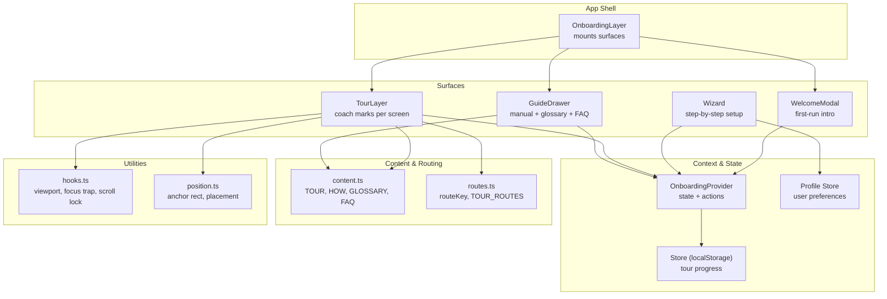
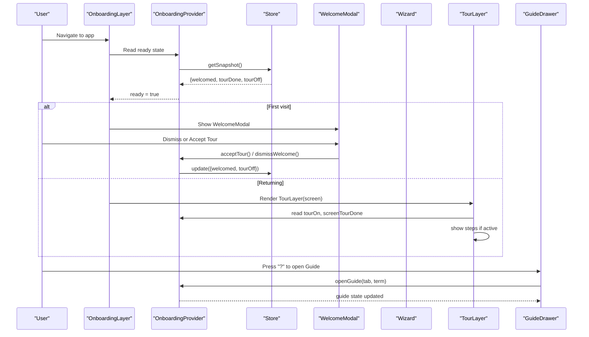
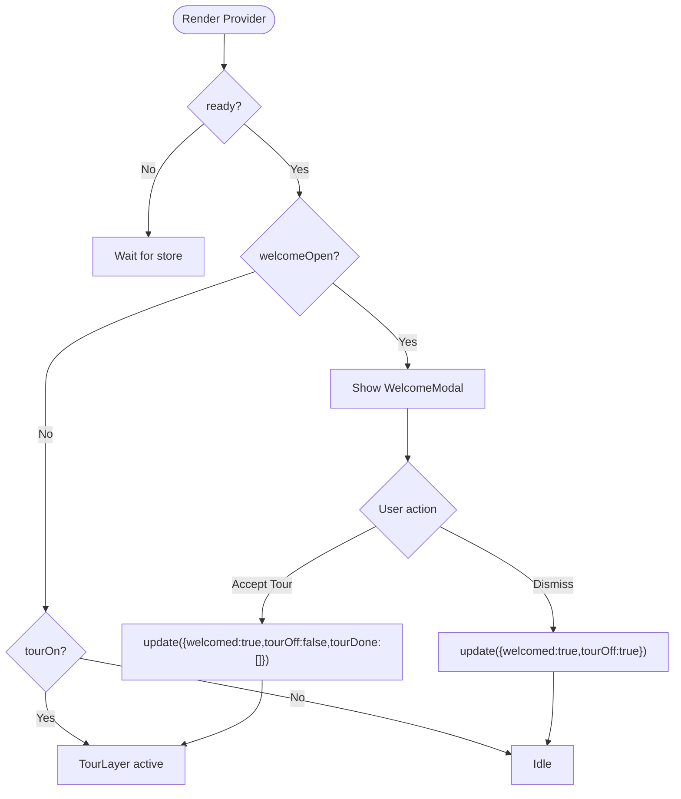
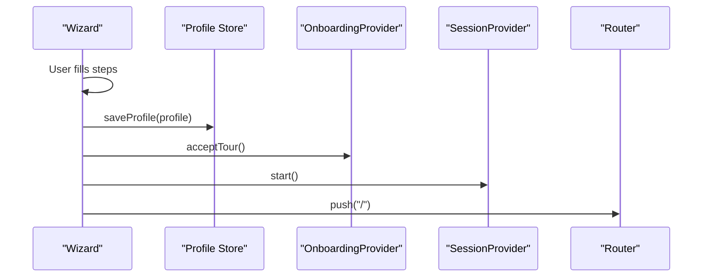
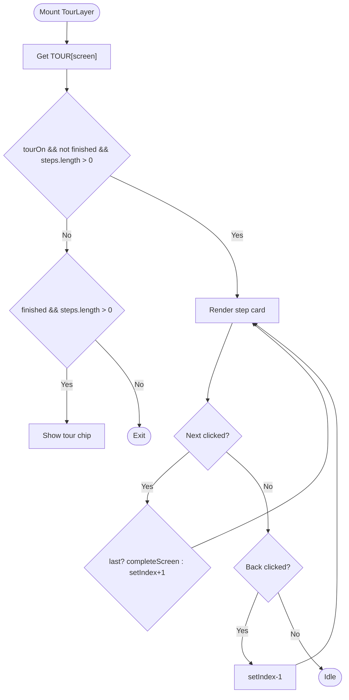
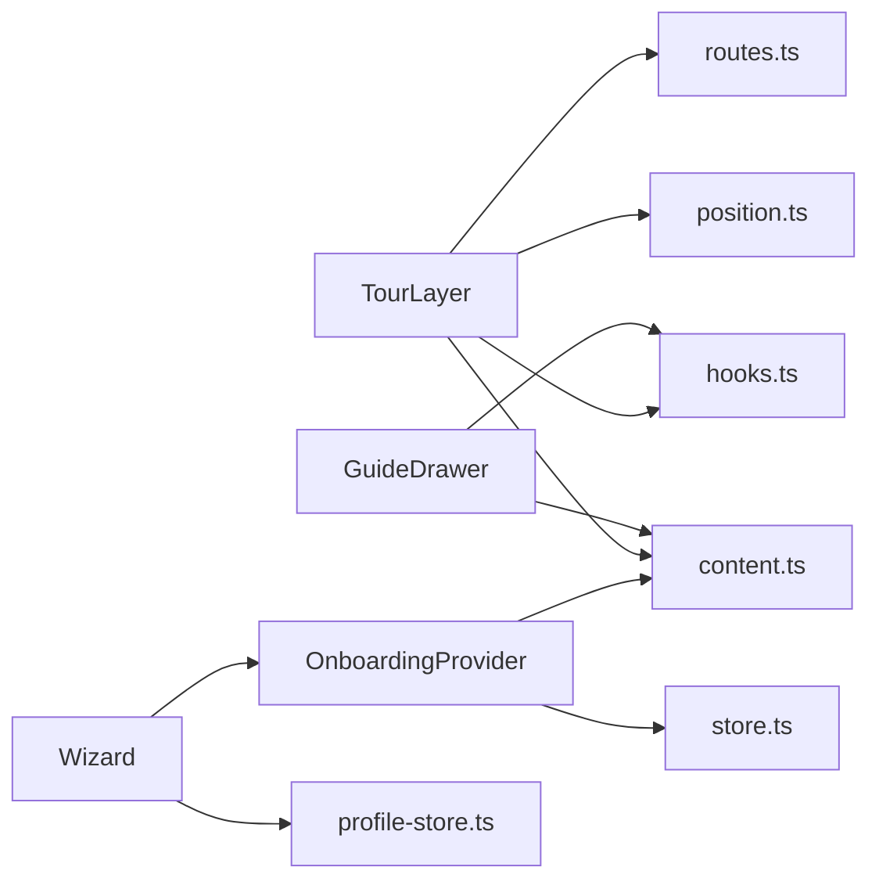

# Onboarding System

<cite>
**Referenced Files in This Document**
- [OnboardingProvider.tsx](file://src/components/onboarding/OnboardingProvider.tsx)
- [Wizard.tsx](file://src/components/onboarding/Wizard.tsx)
- [TourLayer.tsx](file://src/components/onboarding/TourLayer.tsx)
- [GuideDrawer.tsx](file://src/components/onboarding/GuideDrawer.tsx)
- [OnboardingLayer.tsx](file://src/components/onboarding/OnboardingLayer.tsx)
- [store.ts](file://src/lib/onboarding/store.ts)
- [content.ts](file://src/lib/onboarding/content.ts)
- [routes.ts](file://src/lib/onboarding/routes.ts)
- [hooks.ts](file://src/components/onboarding/hooks.ts)
- [position.ts](file://src/components/onboarding/position.ts)
- [WelcomeModal.tsx](file://src/components/onboarding/WelcomeModal.tsx)
- [profile-store.ts](file://src/lib/onboarding/profile-store.ts)
- [onboarding/page.tsx](file://src/app/(calendair)/onboarding/page.tsx)
</cite>

## Table of Contents
1. Introduction
2. Project Structure
3. Core Components
4. Architecture Overview
5. Detailed Component Analysis
6. Dependency Analysis
7. Performance Considerations
8. Troubleshooting Guide
9. Conclusion
10. Appendices

## Introduction
This document explains CALENDAIR’s onboarding system: how it introduces new users, guides them through the product with interactive tours, and provides contextual help at any time. It focuses on:
- The OnboardingProvider context that manages user state and tour progress across the app
- The Wizard component for step-by-step setup flows
- The TourLayer for non-blocking, anchored coach marks
- The GuideDrawer for contextual help and explanations
- State management patterns, persistence mechanisms, and user preference handling
- Customization options and extension points for adding new onboarding experiences

## Project Structure
The onboarding system is composed of a provider layer, UI surfaces, content definitions, routing helpers, and small utilities for measurement and placement.

**Diagram sources**
- [OnboardingLayer.tsx:10-35](file://src/components/onboarding/OnboardingLayer.tsx#L10-L35)
- [OnboardingProvider.tsx:49-164](file://src/components/onboarding/OnboardingProvider.tsx#L49-L164)
- [store.ts:1-95](file://src/lib/onboarding/store.ts#L1-L95)
- [profile-store.ts:1-99](file://src/lib/onboarding/profile-store.ts#L1-L99)
- [content.ts:1-520](file://src/lib/onboarding/content.ts#L1-L520)
- [routes.ts:1-31](file://src/lib/onboarding/routes.ts#L1-L31)
- [hooks.ts:1-214](file://src/components/onboarding/hooks.ts#L1-L214)
- [position.ts:1-109](file://src/components/onboarding/position.ts#L1-L109)

**Section sources**
- [OnboardingLayer.tsx:10-35](file://src/components/onboarding/OnboardingLayer.tsx#L10-L35)
- [OnboardingProvider.tsx:49-164](file://src/components/onboarding/OnboardingProvider.tsx#L49-L164)
- [store.ts:1-95](file://src/lib/onboarding/store.ts#L1-L95)
- [profile-store.ts:1-99](file://src/lib/onboarding/profile-store.ts#L1-L99)
- [content.ts:1-520](file://src/lib/onboarding/content.ts#L1-L520)
- [routes.ts:1-31](file://src/lib/onboarding/routes.ts#L1-L31)
- [hooks.ts:1-214](file://src/components/onboarding/hooks.ts#L1-L214)
- [position.ts:1-109](file://src/components/onboarding/position.ts#L1-L109)

## Core Components
- OnboardingProvider: Central context exposing ready state, welcome modal visibility, tour lifecycle, guide panel state, and progress metrics. Persists tour progress to localStorage via an external store.
- WelcomeModal: First-run introduction panels explaining purpose, privacy, and checkpoints; can redirect to Wizard or start guided tour.
- Wizard: Eight-screen profile setup collecting availability source, origin/timezone, spontaneity, hard limits, interests, dream destinations, companion info, and notification cadence. Saves profile and starts the guided tour upon completion.
- TourLayer: Per-screen coach marks that highlight elements by data-tour anchors, navigate steps, auto-scroll to anchors, and persist completion per screen.
- GuideDrawer: In-app manual with tabs for “How it works,” “The flight layer,” “The screens,” “Glossary,” and “Questions.” Supports keyboard navigation, focus trapping, and quick replay/restart of tour.

**Section sources**
- [OnboardingProvider.tsx:21-164](file://src/components/onboarding/OnboardingProvider.tsx#L21-L164)
- [WelcomeModal.tsx:11-139](file://src/components/onboarding/WelcomeModal.tsx#L11-L139)
- [Wizard.tsx:28-509](file://src/components/onboarding/Wizard.tsx#L28-L509)
- [TourLayer.tsx:10-207](file://src/components/onboarding/TourLayer.tsx#L10-L207)
- [GuideDrawer.tsx:31-237](file://src/components/onboarding/GuideDrawer.tsx#L31-L237)

## Architecture Overview
The system uses a layered architecture:
- Provider layer: OnboardingProvider coordinates state and side effects, bridging React state with a persistent store.
- Surface layer: WelcomeModal, Wizard, TourLayer, and GuideDrawer render user-facing flows.
- Content layer: content.ts defines all copy, tour steps, glossary, and FAQs.
- Routing layer: routes.ts maps pathname to a TourRoute used by TourLayer to pick the right steps.
- Utilities: hooks.ts and position.ts provide viewport tracking, anchor measurement, focus traps, scroll locks, and callout placement.

**Diagram sources**
- [OnboardingLayer.tsx:16-35](file://src/components/onboarding/OnboardingLayer.tsx#L16-L35)
- [OnboardingProvider.tsx:49-164](file://src/components/onboarding/OnboardingProvider.tsx#L49-L164)
- [store.ts:40-95](file://src/lib/onboarding/store.ts#L40-L95)
- [WelcomeModal.tsx:18-139](file://src/components/onboarding/WelcomeModal.tsx#L18-L139)
- [TourLayer.tsx:19-207](file://src/components/onboarding/TourLayer.tsx#L19-L207)
- [GuideDrawer.tsx:38-237](file://src/components/onboarding/GuideDrawer.tsx#L38-L237)

## Detailed Component Analysis

### OnboardingProvider
Responsibilities:
- Manage ready flag to avoid hydration mismatch
- Control welcome modal visibility and session override
- Drive tour lifecycle: accept, end, restart, per-screen completion
- Expose guide panel state and keyboard shortcut to open it
- Compute progress from completed screens and total tour steps

State and persistence:
- Uses useSyncExternalStore to subscribe to a tiny external store backed by localStorage
- Stores welcomed, tourDone, tourOff; migration from legacy key supported
- Provides update function to mutate state and notify subscribers

Keyboard integration:
- Pressing “?” opens the guide unless focused inside inputs or modals

Progress calculation:
- Aggregates completed steps per screen using TOUR_TOTAL

**Diagram sources**
- [OnboardingProvider.tsx:49-164](file://src/components/onboarding/OnboardingProvider.tsx#L49-L164)
- [store.ts:40-95](file://src/lib/onboarding/store.ts#L40-L95)

**Section sources**
- [OnboardingProvider.tsx:21-164](file://src/components/onboarding/OnboardingProvider.tsx#L21-L164)
- [store.ts:1-95](file://src/lib/onboarding/store.ts#L1-L95)

### Wizard
Responsibilities:
- Collect traveller profile across eight steps
- Enforce hard limits vs scoring preferences
- Save profile and transition into the guided tour

Flow highlights:
- Step gating: only the taste step requires selection
- Finish flow: save profile, accept tour, start session, navigate home
- Escape hatch: skip wizard and run prepared demo traveller

Data handling:
- Uses local draft state during flow
- Persists via profile-store after completion
- Integrates with session provider to start the main app flow

**Diagram sources**
- [Wizard.tsx:112-133](file://src/components/onboarding/Wizard.tsx#L112-L133)
- [profile-store.ts:74-88](file://src/lib/onboarding/profile-store.ts#L74-L88)
- [OnboardingProvider.tsx:69-72](file://src/components/onboarding/OnboardingProvider.tsx#L69-L72)

**Section sources**
- [Wizard.tsx:28-509](file://src/components/onboarding/Wizard.tsx#L28-L509)
- [profile-store.ts:1-99](file://src/lib/onboarding/profile-store.ts#L1-L99)

### TourLayer
Responsibilities:
- Render per-screen coach marks based on current route
- Manage step index, next/back navigation, and completion
- Auto-scroll to anchor elements and place callouts intelligently
- Respect reduced motion preferences and accessibility

Behavior:
- Reads TOUR[screen] from content and displays steps sequentially
- Marks screen complete when last step finished
- Shows a small chip indicating tour continuation after completion
- Keyboard shortcuts: arrow keys to navigate, Escape to end tour

Placement logic:
- Measures anchor rects via requestAnimationFrame loop
- Computes placement relative to viewport and preferred side
- Falls back to centered overlay if no side fits

**Diagram sources**
- [TourLayer.tsx:19-207](file://src/components/onboarding/TourLayer.tsx#L19-L207)
- [hooks.ts:80-152](file://src/components/onboarding/hooks.ts#L80-L152)
- [position.ts:40-86](file://src/components/onboarding/position.ts#L40-L86)

**Section sources**
- [TourLayer.tsx:10-207](file://src/components/onboarding/TourLayer.tsx#L10-L207)
- [hooks.ts:1-214](file://src/components/onboarding/hooks.ts#L1-L214)
- [position.ts:1-109](file://src/components/onboarding/position.ts#L1-L109)

### GuideDrawer
Responsibilities:
- Provide in-app manual with multiple sections
- Support keyboard navigation, focus trapping, and scroll locking
- Allow jumping to glossary terms and restarting tour or replaying intro

Tabs:
- How it works: process overview and scoring formula
- The flight layer: Atlas capabilities and authorisation
- The screens: descriptions per route
- Glossary: searchable terms with short/long definitions
- Questions: FAQ accordion

Integration:
- Opens via “?” shortcut or explicit button
- Offers replay intro and restart tour actions

**Section sources**
- [GuideDrawer.tsx:31-237](file://src/components/onboarding/GuideDrawer.tsx#L31-L237)
- [content.ts:224-520](file://src/lib/onboarding/content.ts#L224-L520)

### OnboardingLayer
Mounts all onboarding surfaces once at the app root:
- Renders WelcomeModal unless currently on the Wizard page
- Renders TourLayer for known routes
- Always renders GuideDrawer

Routing:
- Derives screen key from pathname using routeKey
- Guards rendering until provider ready to prevent hydration flash

**Section sources**
- [OnboardingLayer.tsx:10-35](file://src/components/onboarding/OnboardingLayer.tsx#L10-L35)
- [routes.ts:13-21](file://src/lib/onboarding/routes.ts#L13-L21)

## Dependency Analysis
High-level dependencies:
- OnboardingProvider depends on store.ts for persistence and content.ts for totals
- TourLayer depends on content.ts for steps, routes.ts for mapping, hooks.ts for measurements, and position.ts for placement
- GuideDrawer depends on content.ts for manual content and hooks.ts for accessibility
- Wizard depends on profile-store.ts to persist user preferences and integrates with session provider and router

**Diagram sources**
- [OnboardingProvider.tsx:49-164](file://src/components/onboarding/OnboardingProvider.tsx#L49-L164)
- [TourLayer.tsx:19-207](file://src/components/onboarding/TourLayer.tsx#L19-L207)
- [GuideDrawer.tsx:38-237](file://src/components/onboarding/GuideDrawer.tsx#L38-L237)
- [Wizard.tsx:112-133](file://src/components/onboarding/Wizard.tsx#L112-L133)
- [store.ts:1-95](file://src/lib/onboarding/store.ts#L1-L95)
- [content.ts:1-520](file://src/lib/onboarding/content.ts#L1-L520)
- [routes.ts:1-31](file://src/lib/onboarding/routes.ts#L1-L31)
- [hooks.ts:1-214](file://src/components/onboarding/hooks.ts#L1-L214)
- [position.ts:1-109](file://src/components/onboarding/position.ts#L1-L109)
- [profile-store.ts:1-99](file://src/lib/onboarding/profile-store.ts#L1-L99)

**Section sources**
- [OnboardingProvider.tsx:49-164](file://src/components/onboarding/OnboardingProvider.tsx#L49-L164)
- [TourLayer.tsx:19-207](file://src/components/onboarding/TourLayer.tsx#L19-L207)
- [GuideDrawer.tsx:38-237](file://src/components/onboarding/GuideDrawer.tsx#L38-L237)
- [Wizard.tsx:112-133](file://src/components/onboarding/Wizard.tsx#L112-L133)
- [store.ts:1-95](file://src/lib/onboarding/store.ts#L1-L95)
- [content.ts:1-520](file://src/lib/onboarding/content.ts#L1-L520)
- [routes.ts:1-31](file://src/lib/onboarding/routes.ts#L1-L31)
- [hooks.ts:1-214](file://src/components/onboarding/hooks.ts#L1-L214)
- [position.ts:1-109](file://src/components/onboarding/position.ts#L1-L109)
- [profile-store.ts:1-99](file://src/lib/onboarding/profile-store.ts#L1-L99)

## Performance Considerations
- Hydration safety: Provider and stores use useSyncExternalStore with server snapshots to avoid flashes and mismatches
- Efficient anchor tracking: TourLayer uses requestAnimationFrame with change detection to minimize layout thrash
- Reduced motion: Respects prefers-reduced-motion for smoother UX on devices with motion sensitivity
- LocalStorage resilience: Gracefully handles private browsing or quota errors without breaking onboarding
- Minimal re-renders: Provider memoizes derived values and callbacks to limit updates

[No sources needed since this section provides general guidance]

## Troubleshooting Guide
Common issues and resolutions:
- Tour does not appear: Ensure route matches a known TourRoute and the element has the correct data-tour attribute referenced by the step’s anchor
- Anchor not found: Verify the target element exists and is visible before the step scrolls to it
- Guide drawer not accessible: Confirm keyboard handler is not blocked by input focus; press “?” outside text fields
- Progress not persisted: Check localStorage availability; if unavailable, progress resets on reload but still functions in-session
- Hydration mismatch: Ensure OnboardingLayer waits for provider.ready before mounting surfaces

**Section sources**
- [TourLayer.tsx:59-70](file://src/components/onboarding/TourLayer.tsx#L59-L70)
- [store.ts:82-95](file://src/lib/onboarding/store.ts#L82-L95)
- [OnboardingLayer.tsx:21-23](file://src/components/onboarding/OnboardingLayer.tsx#L21-L23)

## Conclusion
CALENDAIR’s onboarding system combines a friendly first-run introduction, a comprehensive step-by-step setup wizard, and a flexible, non-blocking guided tour with contextual help. The design emphasizes clarity, privacy, and robustness:
- Clear separation of concerns between provider, surfaces, content, and utilities
- Persistent, resilient state management with safe server-side behavior
- Extensible content model for adding new tour steps, screens, and help topics
- Accessibility-first interactions with keyboard support and focus management

[No sources needed since this section summarizes without analyzing specific files]

## Appendices

### Implementing New Onboarding Flows
- Add a new screen to the tour:
  - Define a TourRoute entry in routes.ts and add its label
  - Add steps in content.ts under TOUR[newScreen]
  - Ensure each step references a data-tour attribute present on the target element
  - TourLayer will automatically pick up the new steps based on routeKey mapping
- Integrate the tour into a screen:
  - Place data-tour attributes on meaningful elements
  - No additional wiring required; TourLayer reads the current route and shows relevant steps

**Section sources**
- [routes.ts:1-31](file://src/lib/onboarding/routes.ts#L1-L31)
- [content.ts:71-222](file://src/lib/onboarding/content.ts#L71-L222)
- [TourLayer.tsx:19-207](file://src/components/onboarding/TourLayer.tsx#L19-L207)

### Adding Tour Steps
- Extend TOUR in content.ts with new steps for existing or new screens
- Each step includes id, anchor, eyebrow, title, body, and optional side/pad
- Use consistent naming for anchors to match data-tour attributes in UI

**Section sources**
- [content.ts:60-222](file://src/lib/onboarding/content.ts#L60-L222)

### Integrating Guides Into Existing Screens
- Open the guide programmatically from anywhere using useOnboarding().openGuide(tab, term)
- For glossary jumps, pass a term id to openGuide("glossary", termId)
- The GuideDrawer will scroll to and briefly highlight the term

**Section sources**
- [OnboardingProvider.tsx:92-96](file://src/components/onboarding/OnboardingProvider.tsx#L92-L96)
- [GuideDrawer.tsx:61-75](file://src/components/onboarding/GuideDrawer.tsx#L61-L75)
- [content.ts:326-419](file://src/lib/onboarding/content.ts#L326-L419)

### State Management Patterns
- External store pattern: useSyncExternalStore bridges React with a simple pub/sub store backed by localStorage
- Server-safe snapshots: separate server and client snapshots prevent hydration mismatches
- Migration support: legacy keys are migrated automatically on first read

**Section sources**
- [store.ts:1-95](file://src/lib/onboarding/store.ts#L1-L95)
- [profile-store.ts:1-99](file://src/lib/onboarding/profile-store.ts#L1-L99)

### Persistence Mechanisms and User Preferences
- Tour progress stored under a versioned key with migration from legacy key
- Profile saved only after completion and sanitized before storage
- Graceful fallbacks when localStorage is unavailable

**Section sources**
- [store.ts:24-66](file://src/lib/onboarding/store.ts#L24-L66)
- [profile-store.ts:31-41](file://src/lib/onboarding/profile-store.ts#L31-L41)
- [profile-store.ts:74-99](file://src/lib/onboarding/profile-store.ts#L74-L99)

### Customization Options and Extension Points
- Content-driven: All copy, tour steps, glossary, and FAQs live in content.ts for easy editing
- Route-driven: Add new routes and labels in routes.ts to extend tour coverage
- Placement tuning: Adjust pad/side in tour steps; position.ts computes optimal placement
- Accessibility: Hooks provide focus trapping and scroll locking for new modals/drawers

**Section sources**
- [content.ts:1-520](file://src/lib/onboarding/content.ts#L1-L520)
- [routes.ts:1-31](file://src/lib/onboarding/routes.ts#L1-L31)
- [position.ts:40-86](file://src/components/onboarding/position.ts#L40-L86)
- [hooks.ts:156-214](file://src/components/onboarding/hooks.ts#L156-L214)