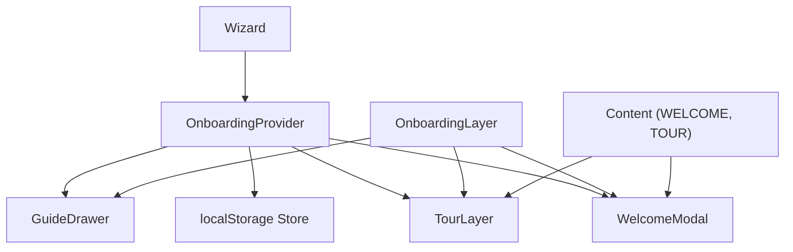
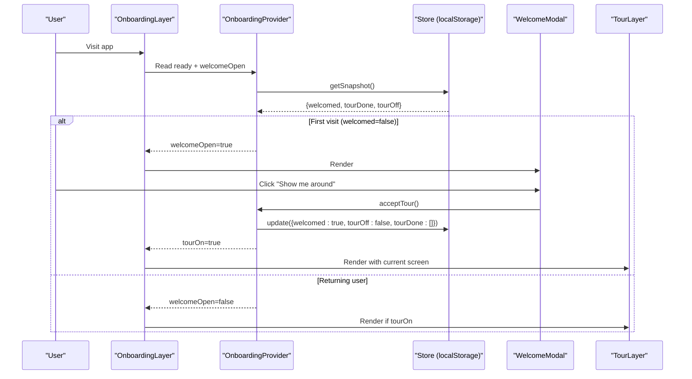
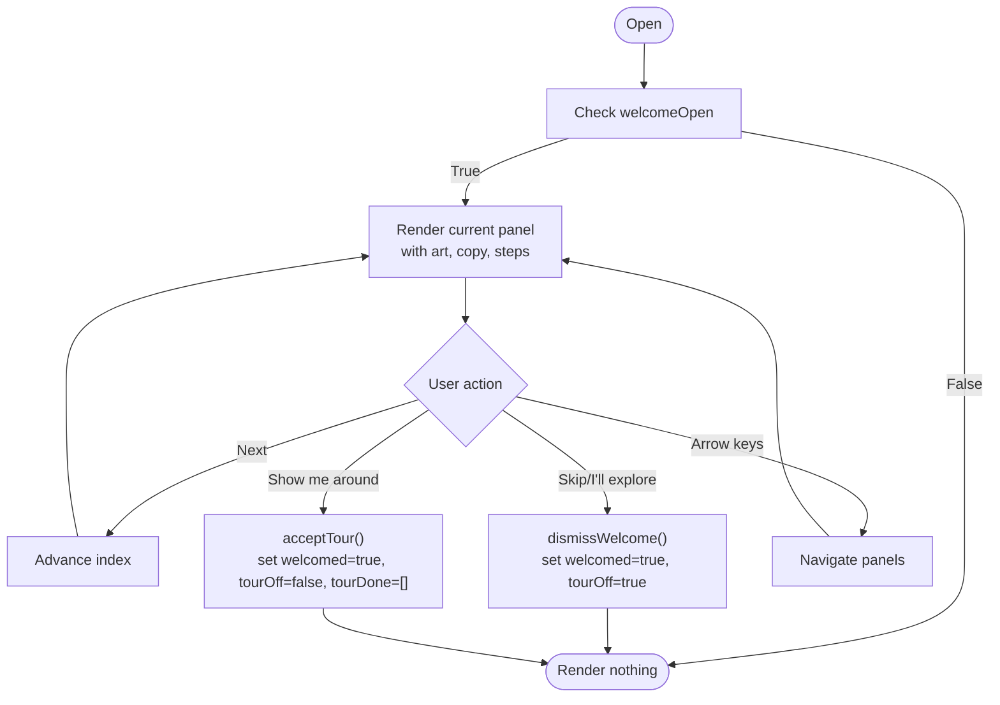
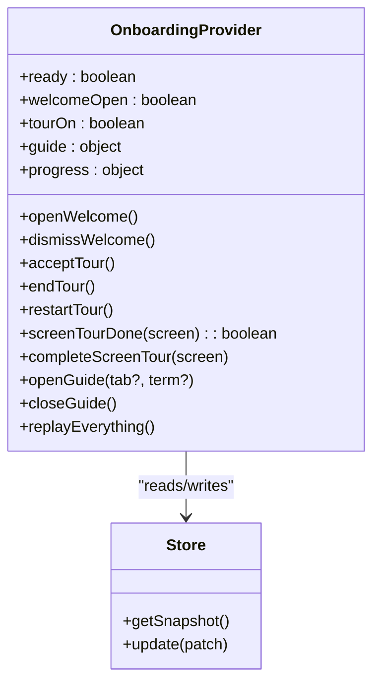
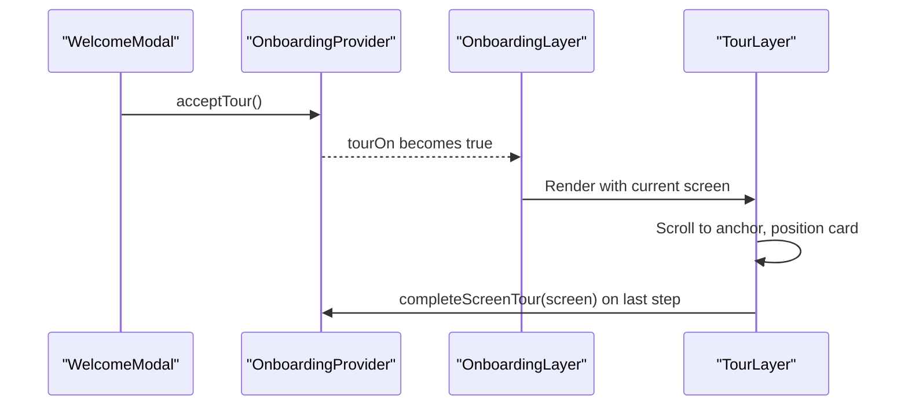
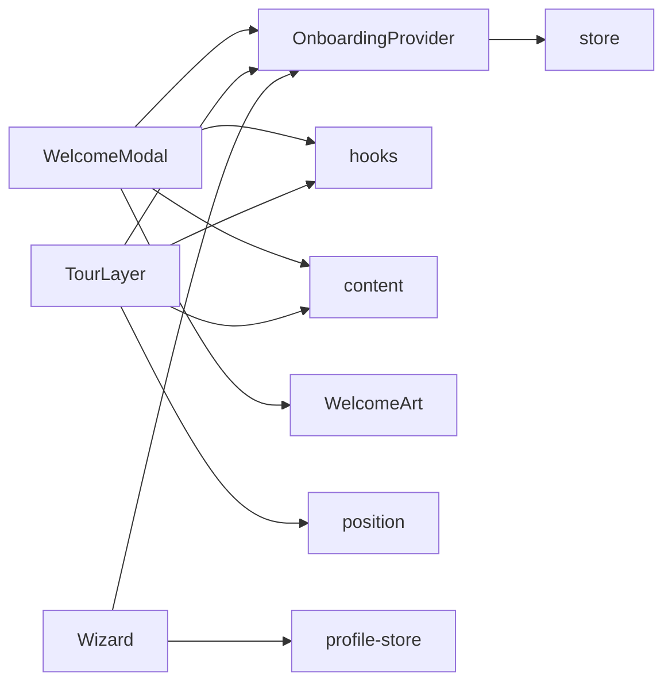

# Welcome Modal & Introduction Flow

<cite>
**Referenced Files in This Document**
- [WelcomeModal.tsx](file://src/components/onboarding/WelcomeModal.tsx)
- [OnboardingProvider.tsx](file://src/components/onboarding/OnboardingProvider.tsx)
- [WelcomeArt.tsx](file://src/components/onboarding/WelcomeArt.tsx)
- [TourLayer.tsx](file://src/components/onboarding/TourLayer.tsx)
- [OnboardingLayer.tsx](file://src/components/onboarding/OnboardingLayer.tsx)
- [Wizard.tsx](file://src/components/onboarding/Wizard.tsx)
- [content.ts](file://src/lib/onboarding/content.ts)
- [store.ts](file://src/lib/onboarding/store.ts)
- [hooks.ts](file://src/components/onboarding/hooks.ts)
- [routes.ts](file://src/lib/onboarding/routes.ts)
- [page.tsx](file://src/app/(calendair)/onboarding/page.tsx)
</cite>

## Table of Contents
1. [Introduction](#introduction)
2. [Project Structure](#project-structure)
3. [Core Components](#core-components)
4. [Architecture Overview](#architecture-overview)
5. [Detailed Component Analysis](#detailed-component-analysis)
6. [Dependency Analysis](#dependency-analysis)
7. [Performance Considerations](#performance-considerations)
8. [Troubleshooting Guide](#troubleshooting-guide)
9. [Conclusion](#conclusion)
10. [Appendices](#appendices)

## Introduction
This document explains the welcome modal system that introduces new users to CALENDAIR, how it integrates with the onboarding provider, and how it transitions into the main tour experience. It covers the modal lifecycle, welcome art display, introduction flow management, user dismissal behavior, and customization points for content and interactive elements.

## Project Structure
The welcome modal is part of a broader onboarding system composed of:
- A provider that owns global state (welcome visibility, tour progress, guide).
- A welcome modal that presents a three-panel introduction with art and copy.
- A coach-mark tour layer that teaches each screen in context.
- A wizard that collects user preferences and can also start the tour.
- A persistent store that remembers whether the welcome has been shown and which tour steps are completed.

**Diagram sources**
- [OnboardingProvider.tsx:49-165](file://src/components/onboarding/OnboardingProvider.tsx#L49-L165)
- [store.ts:24-95](file://src/lib/onboarding/store.ts#L24-L95)
- [WelcomeModal.tsx:18-139](file://src/components/onboarding/WelcomeModal.tsx#L18-L139)
- [TourLayer.tsx:19-207](file://src/components/onboarding/TourLayer.tsx#L19-L207)
- [OnboardingLayer.tsx:16-37](file://src/components/onboarding/OnboardingLayer.tsx#L16-L37)
- [Wizard.tsx:62-124](file://src/components/onboarding/Wizard.tsx#L62-L124)
- [content.ts:25-222](file://src/lib/onboarding/content.ts#L25-L222)

**Section sources**
- [OnboardingLayer.tsx:16-37](file://src/components/onboarding/OnboardingLayer.tsx#L16-L37)
- [OnboardingProvider.tsx:49-165](file://src/components/onboarding/OnboardingProvider.tsx#L49-L165)
- [store.ts:24-95](file://src/lib/onboarding/store.ts#L24-L95)

## Core Components
- WelcomeModal: Renders the first-run introduction panels, handles keyboard navigation, focus trapping, scroll lock, and actions to dismiss or accept the tour.
- OnboardingProvider: Central state for welcome visibility, tour activation/completion, guide drawer, and replay/restart capabilities. Persists state via localStorage.
- TourLayer: Non-blocking coach marks per screen; scrolls to anchors, positions callouts, tracks completion per route, and shows progress.
- Wizard: Multi-step profile setup; on completion, triggers the tour and navigates to the app root.
- Content: Defines WELCOME panels (copy and art types) and TOUR steps per route.
- Hooks: Focus trap, scroll lock, viewport measurement, anchor rect tracking, reduced motion preference.

**Section sources**
- [WelcomeModal.tsx:18-139](file://src/components/onboarding/WelcomeModal.tsx#L18-L139)
- [OnboardingProvider.tsx:21-165](file://src/components/onboarding/OnboardingProvider.tsx#L21-L165)
- [TourLayer.tsx:19-207](file://src/components/onboarding/TourLayer.tsx#L19-L207)
- [Wizard.tsx:62-124](file://src/components/onboarding/Wizard.tsx#L62-L124)
- [content.ts:25-222](file://src/lib/onboarding/content.ts#L25-L222)
- [hooks.ts:156-214](file://src/components/onboarding/hooks.ts#L156-L214)

## Architecture Overview
The welcome modal is mounted by OnboardingLayer when not on the /onboarding page. The provider decides whether to show the modal based on stored welcomed state and a session override. Dismissing the modal sets welcomed true and turns off the tour initially. Accepting the tour sets welcomed true, turns the tour on, and resets completed screens. The tour layer then activates per current route and teaches features in place.

**Diagram sources**
- [OnboardingLayer.tsx:16-37](file://src/components/onboarding/OnboardingLayer.tsx#L16-L37)
- [OnboardingProvider.tsx:58-79](file://src/components/onboarding/OnboardingProvider.tsx#L58-L79)
- [store.ts:73-95](file://src/lib/onboarding/store.ts#L73-L95)
- [WelcomeModal.tsx:117-121](file://src/components/onboarding/WelcomeModal.tsx#L117-L121)
- [TourLayer.tsx:19-33](file://src/components/onboarding/TourLayer.tsx#L19-L33)

## Detailed Component Analysis

### WelcomeModal Lifecycle
- Mounting and visibility: Controlled by provider’s welcomeOpen. When false, the component returns null.
- Panel navigation: Three panels defined by WELCOME array; arrow keys navigate between them; step dots allow direct jumps.
- Art display: Each panel declares an art type (“opening”, “privacy”, “checkpoint”), rendering corresponding art components.
- Accessibility: Uses dialog role, aria-modal, aria-labelledby, focus trap, and scroll lock while open.
- Actions:
  - Dismiss: Closes modal and sets welcomed true, tourOff true (skips intro and coach marks).
  - Next: Advances to next panel unless last.
  - Show me around: Accepts tour, sets welcomed true, tourOff false, tourDone reset, enabling TourLayer.
  - Or tell me your preferences first: Navigates to /onboarding to run Wizard before tour.

**Diagram sources**
- [WelcomeModal.tsx:18-139](file://src/components/onboarding/WelcomeModal.tsx#L18-L139)
- [content.ts:25-56](file://src/lib/onboarding/content.ts#L25-L56)

**Section sources**
- [WelcomeModal.tsx:18-139](file://src/components/onboarding/WelcomeModal.tsx#L18-L139)
- [content.ts:25-56](file://src/lib/onboarding/content.ts#L25-L56)

### Welcome Art Display
Three art components illustrate key messages:
- OpeningArt: Visualizes a week with released commitments and highlighted open time.
- PrivacyArt: Compares two calendars showing free/busy only, emphasizing privacy.
- CheckpointArt: Shows decision checkpoints across the booking flow, highlighting where user consent is required.

These are selected by panel.art and rendered inside the modal’s art area.

**Section sources**
- [WelcomeArt.tsx:7-101](file://src/components/onboarding/WelcomeArt.tsx#L7-L101)
- [WelcomeModal.tsx:76-80](file://src/components/onboarding/WelcomeModal.tsx#L76-L80)

### Introduction Flow Management (Provider)
- State: Tracks ready, welcomeOpen (derived), tourOn, guide state, and progress.
- Persistence: Reads/writes to localStorage via store; migration from legacy key supported.
- Key methods:
  - openWelcome/dismissWelcome: Session-level override to force/hide welcome regardless of persisted state.
  - acceptTour: Marks welcomed true, enables tour, resets completed screens.
  - endTour/restartTour: Control coach marks globally and reset progress.
  - completeScreenTour/screenTourDone: Per-screen completion tracking used by TourLayer.
  - replayEverything: Resets everything to initial state and forces welcome open.

**Diagram sources**
- [OnboardingProvider.tsx:49-165](file://src/components/onboarding/OnboardingProvider.tsx#L49-L165)
- [store.ts:73-95](file://src/lib/onboarding/store.ts#L73-L95)

**Section sources**
- [OnboardingProvider.tsx:49-165](file://src/components/onboarding/OnboardingProvider.tsx#L49-L165)
- [store.ts:24-95](file://src/lib/onboarding/store.ts#L24-L95)

### Transition to Main Tour Experience
- From WelcomeModal: “Show me around” calls acceptTour, enabling TourLayer for the current screen.
- From Wizard: Finishing the wizard calls acceptTour, starts session, and navigates to the home screen where TourLayer will teach the home screen.
- TourLayer behavior:
  - Activates only when tourOn is true and the screen has steps.
  - Scrolls to the anchor element for the current step.
  - Positions callout relative to viewport and anchor.
  - Marks screen complete after final step; shows a chip indicating continuation or completion.

**Diagram sources**
- [WelcomeModal.tsx:117-121](file://src/components/onboarding/WelcomeModal.tsx#L117-L121)
- [OnboardingProvider.tsx:69-85](file://src/components/onboarding/OnboardingProvider.tsx#L69-L85)
- [TourLayer.tsx:19-111](file://src/components/onboarding/TourLayer.tsx#L19-L111)

**Section sources**
- [Wizard.tsx:112-124](file://src/components/onboarding/Wizard.tsx#L112-L124)
- [TourLayer.tsx:19-111](file://src/components/onboarding/TourLayer.tsx#L19-L111)

### Customizing Welcome Content
- Edit WELCOME array in content.ts to change:
  - Eyebrow, title, body paragraphs, and art type per panel.
  - Add/remove panels to extend the introduction sequence.
- Replace art components in WelcomeArt.tsx to change visuals.
- Adjust copy and links in WelcomeModal.tsx to add interactive elements (e.g., additional links or buttons).

Examples:
- To add a fourth panel: append a new object to WELCOME with id, eyebrow, title, body, and art.
- To link to external help: add a Link button in the panel footer similar to existing actions.
- To change art: implement a new art component and reference it via a new art type.

**Section sources**
- [content.ts:25-56](file://src/lib/onboarding/content.ts#L25-L56)
- [WelcomeArt.tsx:7-101](file://src/components/onboarding/WelcomeArt.tsx#L7-L101)
- [WelcomeModal.tsx:93-132](file://src/components/onboarding/WelcomeModal.tsx#L93-L132)

### Managing the Initial User Experience Flow
- Force welcome on demand: Call openWelcome from any component to temporarily show the modal even if welcomed is true.
- Skip intro entirely: Use dismissWelcome to mark welcomed true and turn off tour.
- Replay entire intro: Use replayEverything to reset state and force welcome open again.
- Restart tour without welcome: Use restartTour to reset tour progress and enable coach marks.

**Section sources**
- [OnboardingProvider.tsx:58-102](file://src/components/onboarding/OnboardingProvider.tsx#L58-L102)

## Dependency Analysis
- WelcomeModal depends on:
  - useOnboarding for state and actions.
  - hooks for focus trap and scroll lock.
  - content for WELCOME panels.
  - WelcomeArt for illustrations.
- OnboardingProvider depends on:
  - store for persistence and snapshotting.
  - content for TOUR_TOTAL calculation.
- TourLayer depends on:
  - content for TOUR steps per route.
  - hooks for viewport, anchor rect, reduced motion.
  - position utilities for placement.
- Wizard depends on:
  - useOnboarding to acceptTour upon completion.
  - profile-store to save preferences.

**Diagram sources**
- [WelcomeModal.tsx:1-10](file://src/components/onboarding/WelcomeModal.tsx#L1-L10)
- [TourLayer.tsx:1-9](file://src/components/onboarding/TourLayer.tsx#L1-L9)
- [Wizard.tsx:1-27](file://src/components/onboarding/Wizard.tsx#L1-L27)
- [OnboardingProvider.tsx:1-16](file://src/components/onboarding/OnboardingProvider.tsx#L1-L16)
- [store.ts:1-2](file://src/lib/onboarding/store.ts#L1-L2)

**Section sources**
- [WelcomeModal.tsx:1-10](file://src/components/onboarding/WelcomeModal.tsx#L1-L10)
- [TourLayer.tsx:1-9](file://src/components/onboarding/TourLayer.tsx#L1-L9)
- [Wizard.tsx:1-27](file://src/components/onboarding/Wizard.tsx#L1-L27)
- [OnboardingProvider.tsx:1-16](file://src/components/onboarding/OnboardingProvider.tsx#L1-L16)

## Performance Considerations
- Hydration safety: OnboardingLayer waits until provider.ready is true before rendering any onboarding surfaces, preventing flash mismatches.
- Efficient measurements: TourLayer uses requestAnimationFrame and ResizeObserver to track anchors and card sizes without excessive re-renders.
- Reduced motion: Respects prefers-reduced-motion for smoother scrolling behavior.
- LocalStorage writes: Store batches updates and catches errors gracefully for private browsing or quota limits.

[No sources needed since this section provides general guidance]

## Troubleshooting Guide
- Welcome does not appear:
  - Check if welcomed is true in localStorage; use replayEverything to reset.
  - Ensure OnboardingProvider is mounted above components using useOnboarding.
- Tour not starting after accepting:
  - Verify acceptTour was called and tourOff is false.
  - Confirm current route maps to a valid TourRoute and has steps defined.
- Coach marks not positioning correctly:
  - Ensure target elements have data-tour attributes matching step.anchor.
  - Check viewport size and reduced motion settings.
- Keyboard navigation issues:
  - Confirm focus trap is active and no input fields are intercepting events.
  - Verify Escape handling closes modals or ends tours appropriately.

**Section sources**
- [OnboardingProvider.tsx:58-102](file://src/components/onboarding/OnboardingProvider.tsx#L58-L102)
- [TourLayer.tsx:56-90](file://src/components/onboarding/TourLayer.tsx#L56-L90)
- [hooks.ts:156-214](file://src/components/onboarding/hooks.ts#L156-L214)
- [store.ts:82-95](file://src/lib/onboarding/store.ts#L82-L95)

## Conclusion
The welcome modal provides a concise, accessible first-run introduction with illustrative art and clear actions. It integrates tightly with the onboarding provider to manage state and persist progress, and transitions smoothly into a per-screen coach-mark tour. Customization is straightforward through content definitions and component composition, enabling teams to tailor the initial user experience without altering core logic.

## Appendices

### How to Customize Welcome Content
- Modify WELCOME in content.ts to adjust copy and art selection per panel.
- Extend WelcomeArt.tsx with new illustrations or animations.
- Add interactive elements in WelcomeModal.tsx by inserting buttons or links within the panel footer.

**Section sources**
- [content.ts:25-56](file://src/lib/onboarding/content.ts#L25-L56)
- [WelcomeArt.tsx:7-101](file://src/components/onboarding/WelcomeArt.tsx#L7-L101)
- [WelcomeModal.tsx:93-132](file://src/components/onboarding/WelcomeModal.tsx#L93-L132)

### How to Manage the Initial Flow Programmatically
- Open welcome on demand: call openWelcome from any component.
- Skip intro: call dismissWelcome to set welcomed true and disable tour.
- Accept tour: call acceptTour to enable coach marks and reset progress.
- Replay everything: call replayEverything to reset all onboarding state and force welcome.

**Section sources**
- [OnboardingProvider.tsx:58-102](file://src/components/onboarding/OnboardingProvider.tsx#L58-L102)