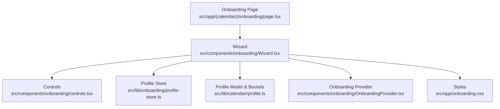
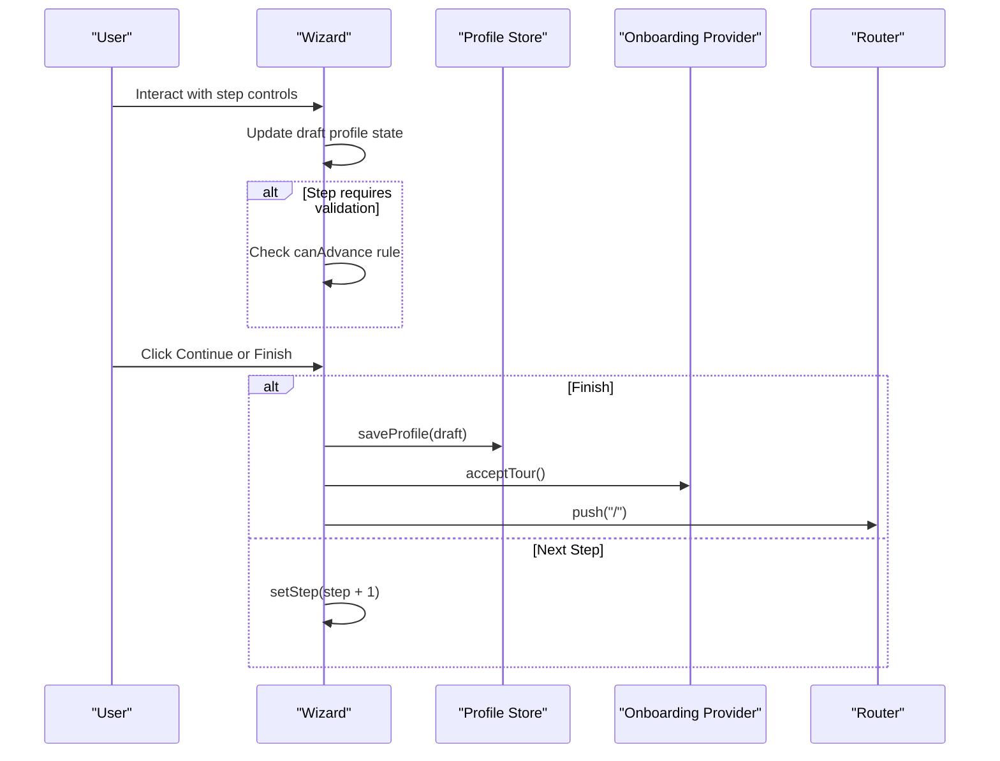
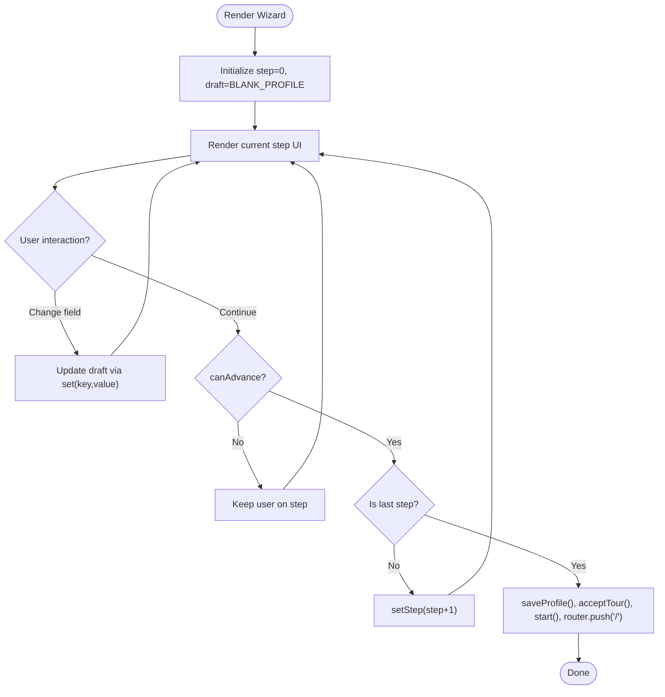
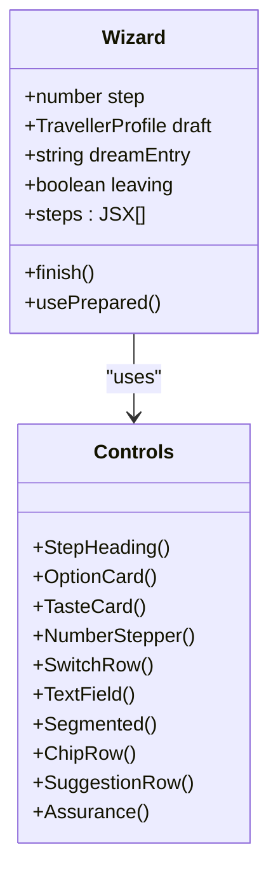
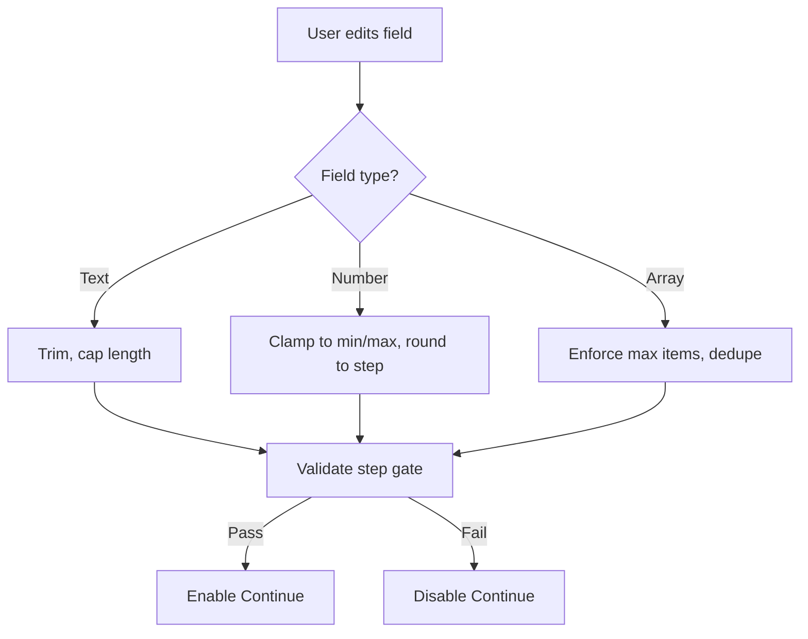
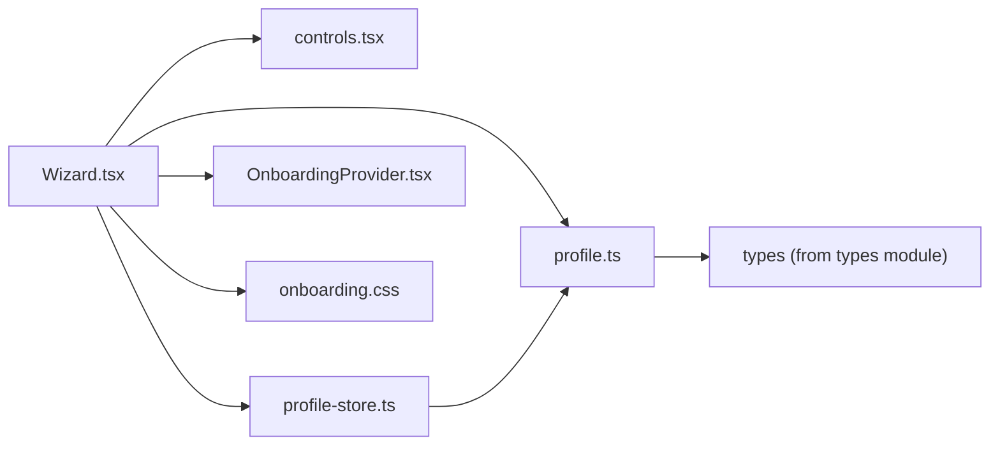

# Wizard Component System

<cite>
**Referenced Files in This Document**
- [Wizard.tsx](file://src/components/onboarding/Wizard.tsx)
- [OnboardingProvider.tsx](file://src/components/onboarding/OnboardingProvider.tsx)
- [hooks.ts](file://src/components/onboarding/hooks.ts)
- [controls.tsx](file://src/components/onboarding/controls.tsx)
- [profile-store.ts](file://src/lib/onboarding/profile-store.ts)
- [profile.ts](file://src/lib/calendair/profile.ts)
- [onboarding/page.tsx](file://src/app/(calendair)/onboarding/page.tsx)
- [onboarding.css](file://src/app/onboarding.css)
</cite>

## Table of Contents
1. [Introduction](#introduction)
2. [Project Structure](#project-structure)
3. [Core Components](#core-components)
4. [Architecture Overview](#architecture-overview)
5. [Detailed Component Analysis](#detailed-component-analysis)
6. [Dependency Analysis](#dependency-analysis)
7. [Performance Considerations](#performance-considerations)
8. [Troubleshooting Guide](#troubleshooting-guide)
9. [Conclusion](#conclusion)
10. [Appendices](#appendices)

## Introduction
This document explains the Wizard component that implements a step-by-step onboarding flow for building a traveller profile. It covers the wizard lifecycle, step navigation, form validation integration, progress tracking, creating new steps, handling step-specific logic, managing state transitions, integrating with the broader onboarding system, and accessibility considerations including keyboard navigation.

## Project Structure
The Wizard is a client-side React component rendered inside the application shell at the onboarding route. It composes small, purpose-built UI controls to collect preferences across eight steps, persists the completed profile, and then hands off to the main session and tour system.

**Diagram sources**
- [onboarding/page.tsx:1-19](file://src/app/(calendair)/onboarding/page.tsx#L1-L19)
- [Wizard.tsx:1-509](file://src/components/onboarding/Wizard.tsx#L1-L509)
- [controls.tsx:1-324](file://src/components/onboarding/controls.tsx#L1-L324)
- [profile-store.ts:1-99](file://src/lib/onboarding/profile-store.ts#L1-L99)
- [profile.ts:1-261](file://src/lib/calendair/profile.ts#L1-L261)
- [OnboardingProvider.tsx:1-166](file://src/components/onboarding/OnboardingProvider.tsx#L1-L166)
- [onboarding.css:1012-1052](file://src/app/onboarding.css#L1012-L1052)

**Section sources**
- [onboarding/page.tsx:1-19](file://src/app/(calendair)/onboarding/page.tsx#L1-L19)
- [Wizard.tsx:1-509](file://src/components/onboarding/Wizard.tsx#L1-L509)

## Core Components
- Wizard: Orchestrates step state, local draft profile, navigation, validation gating, persistence, and completion actions.
- Controls: Accessible, themed input primitives (OptionCard, TasteCard, NumberStepper, SwitchRow, TextField, Segmented, ChipRow, SuggestionRow, Assurance).
- Profile Store: Browser-based persistence for finished profiles with sanitization and hydration-safe reads.
- Profile Model: Types, bounds, defaults, sanitization, and projection into engine-facing shape.
- Onboarding Provider: Tour/welcome/guide state and keyboard shortcuts; used by Wizard to accept the tour after completion.
- Styles: Visual design tokens and wizard-specific styles for progress, fields, and interactions.

Key responsibilities:
- Maintain current step index and draft profile.
- Enforce per-step validation rules.
- Persist completed profile and integrate with session/tour.
- Provide accessible, keyboard-friendly inputs.

**Section sources**
- [Wizard.tsx:62-133](file://src/components/onboarding/Wizard.tsx#L62-L133)
- [controls.tsx:15-324](file://src/components/onboarding/controls.tsx#L15-L324)
- [profile-store.ts:16-99](file://src/lib/onboarding/profile-store.ts#L16-L99)
- [profile.ts:26-67](file://src/lib/calendair/profile.ts#L26-L67)
- [OnboardingProvider.tsx:21-47](file://src/components/onboarding/OnboardingProvider.tsx#L21-L47)

## Architecture Overview
The Wizard renders one step at a time, updates a local draft profile, and validates before allowing progression. On completion, it saves the profile, accepts the tour, starts the session, and navigates away.

**Diagram sources**
- [Wizard.tsx:112-133](file://src/components/onboarding/Wizard.tsx#L112-L133)
- [profile-store.ts:74-88](file://src/lib/onboarding/profile-store.ts#L74-L88)
- [OnboardingProvider.tsx:69-72](file://src/components/onboarding/OnboardingProvider.tsx#L69-L72)

## Detailed Component Analysis

### Wizard Lifecycle and State
- Initialization: Sets current step, draft profile from blank defaults, dream entry text, and leaving flag.
- Draft updates: Centralized setter updates typed fields on the draft profile.
- Derived data: Computes origin zone list based on selected airport and detected timezone.
- Validation gating: Only the taste step enforces selection; other steps allow free navigation.
- Completion: Saves profile, accepts tour, starts session, and navigates home.
- Escape hatch: “Skip this — run on the prepared demo traveller” clears stored profile and proceeds.

**Diagram sources**
- [Wizard.tsx:67-110](file://src/components/onboarding/Wizard.tsx#L67-L110)
- [Wizard.tsx:112-133](file://src/components/onboarding/Wizard.tsx#L112-L133)

**Section sources**
- [Wizard.tsx:62-133](file://src/components/onboarding/Wizard.tsx#L62-L133)

### Step Navigation and Progress Tracking
- Steps array: Eight JSX step definitions keyed by semantic names.
- Progress bar: Renders dots reflecting active and completed steps.
- Navigation buttons: Back button disabled during leaving; Continue disabled until validation passes; Final button triggers finish.
- Conditional rendering: Uses key={step} to animate step transitions.

**Diagram sources**
- [Wizard.tsx:135-449](file://src/components/onboarding/Wizard.tsx#L135-L449)
- [controls.tsx:15-324](file://src/components/onboarding/controls.tsx#L15-L324)

**Section sources**
- [Wizard.tsx:451-509](file://src/components/onboarding/Wizard.tsx#L451-L509)
- [onboarding.css:1024-1044](file://src/app/onboarding.css#L1024-L1044)

### Form Validation Integration
- Per-step rules: The taste step requires at least one interest; all other steps are optional.
- Input constraints: Number steppers clamp values within defined bounds; text fields limit length; arrays enforce maximum sizes.
- Sanitization: On save, the profile is sanitized to safe defaults and validated against allowed sets and ranges.

**Diagram sources**
- [Wizard.tsx:87-110](file://src/components/onboarding/Wizard.tsx#L87-L110)
- [controls.tsx:109-158](file://src/components/onboarding/controls.tsx#L109-L158)
- [profile.ts:112-141](file://src/lib/calendair/profile.ts#L112-L141)
- [profile.ts:160-240](file://src/lib/calendair/profile.ts#L160-L240)

**Section sources**
- [Wizard.tsx:87-110](file://src/components/onboarding/Wizard.tsx#L87-L110)
- [controls.tsx:109-158](file://src/components/onboarding/controls.tsx#L109-L158)
- [profile.ts:112-141](file://src/lib/calendair/profile.ts#L112-L141)
- [profile.ts:160-240](file://src/lib/calendair/profile.ts#L160-L240)

### Creating New Wizard Steps
To add a new step:
- Add a new JSX element to the steps array with a unique key and appropriate heading/body.
- Wire up any inputs to update the draft profile using the centralized setter.
- If the step must be required, extend the canAdvance condition accordingly.
- Optionally add UI hints or assurance messages using existing controls.
- Ensure any derived data (e.g., zones) remains consistent if the step affects them.

Example references:
- Adding a step: [Wizard.tsx:135-449](file://src/components/onboarding/Wizard.tsx#L135-L449)
- Updating draft: [Wizard.tsx:72-73](file://src/components/onboarding/Wizard.tsx#L72-L73)
- Extending validation: [Wizard.tsx:109-110](file://src/components/onboarding/Wizard.tsx#L109-L110)

**Section sources**
- [Wizard.tsx:72-73](file://src/components/onboarding/Wizard.tsx#L72-L73)
- [Wizard.tsx:109-110](file://src/components/onboarding/Wizard.tsx#L109-L110)
- [Wizard.tsx:135-449](file://src/components/onboarding/Wizard.tsx#L135-L449)

### Handling Step-Specific Logic
- Taste step: Enforces minimum selection and caps at a maximum; toggles tags and updates counts.
- Dream destinations: Adds entries with trimming and deduplication; supports suggestions and removal chips.
- Origin/timezone: Derives available timezones from selected airport and browser detection; offers segmented choice when they differ.

References:
- Taste toggle and count: [Wizard.tsx:96-107](file://src/components/onboarding/Wizard.tsx#L96-L107), [Wizard.tsx:320-344](file://src/components/onboarding/Wizard.tsx#L320-L344)
- Dream list add/remove: [Wizard.tsx:87-94](file://src/components/onboarding/Wizard.tsx#L87-L94), [Wizard.tsx:346-386](file://src/components/onboarding/Wizard.tsx#L346-L386)
- Timezone derivation: [Wizard.tsx:75-85](file://src/components/onboarding/Wizard.tsx#L75-L85), [Wizard.tsx:201-209](file://src/components/onboarding/Wizard.tsx#L201-L209)

**Section sources**
- [Wizard.tsx:87-94](file://src/components/onboarding/Wizard.tsx#L87-L94)
- [Wizard.tsx:96-107](file://src/components/onboarding/Wizard.tsx#L96-L107)
- [Wizard.tsx:75-85](file://src/components/onboarding/Wizard.tsx#L75-L85)
- [Wizard.tsx:201-209](file://src/components/onboarding/Wizard.tsx#L201-L209)
- [Wizard.tsx:320-386](file://src/components/onboarding/Wizard.tsx#L320-L386)

### Managing Wizard State Transitions
- Local state: step, draft, dreamEntry, leaving.
- Persistence: saveProfile writes a completed profile to localStorage; clearProfile resets to demo mode.
- Session integration: acceptTour enables coach marks; start initializes the session; router navigates to home.

References:
- Local state and transitions: [Wizard.tsx:67-73](file://src/components/onboarding/Wizard.tsx#L67-L73), [Wizard.tsx:466-509](file://src/components/onboarding/Wizard.tsx#L466-L509)
- Persistence: [profile-store.ts:74-99](file://src/lib/onboarding/profile-store.ts#L74-L99)
- Session/tour: [Wizard.tsx:112-133](file://src/components/onboarding/Wizard.tsx#L112-L133), [OnboardingProvider.tsx:69-72](file://src/components/onboarding/OnboardingProvider.tsx#L69-L72)

**Section sources**
- [Wizard.tsx:67-73](file://src/components/onboarding/Wizard.tsx#L67-L73)
- [Wizard.tsx:112-133](file://src/components/onboarding/Wizard.tsx#L112-L133)
- [Wizard.tsx:466-509](file://src/components/onboarding/Wizard.tsx#L466-L509)
- [profile-store.ts:74-99](file://src/lib/onboarding/profile-store.ts#L74-L99)
- [OnboardingProvider.tsx:69-72](file://src/components/onboarding/OnboardingProvider.tsx#L69-L72)

### Multi-Step Forms, Conditional Rendering, and Onboarding Integration
- Multi-step forms: Each step is a self-contained section with its own inputs and guidance.
- Conditional rendering: Step content changes based on step index; derived options (like timezone choices) depend on prior selections.
- Onboarding integration: After finishing, the wizard calls acceptTour to enable guided tours and starts the session, then navigates to the app root.

References:
- Step rendering and keys: [Wizard.tsx:451-464](file://src/components/onboarding/Wizard.tsx#L451-L464)
- Derived conditions: [Wizard.tsx:75-85](file://src/components/onboarding/Wizard.tsx#L75-L85)
- Tour/session integration: [Wizard.tsx:112-133](file://src/components/onboarding/Wizard.tsx#L112-L133)

**Section sources**
- [Wizard.tsx:75-85](file://src/components/onboarding/Wizard.tsx#L75-L85)
- [Wizard.tsx:112-133](file://src/components/onboarding/Wizard.tsx#L112-L133)
- [Wizard.tsx:451-464](file://src/components/onboarding/Wizard.tsx#L451-L464)

### Accessibility and Keyboard Navigation
- Semantic roles and attributes: Buttons use aria-pressed for toggles, role="switch" and aria-checked for switches, aria-labels for steppers.
- Focus management: Hooks provide focus trapping and scroll locking for dialogs elsewhere in the onboarding system.
- Keyboard support: Global keyboard shortcut opens guide unless inside an input; welcome modal supports Escape and arrow keys.
- Visual feedback: Focus states and selection indicators are styled consistently.

References:
- Control accessibility: [controls.tsx:52-69](file://src/components/onboarding/controls.tsx#L52-L69), [controls.tsx:87-100](file://src/components/onboarding/controls.tsx#L87-L100), [controls.tsx:136-155](file://src/components/onboarding/controls.tsx#L136-L155), [controls.tsx:172-187](file://src/components/onboarding/controls.tsx#L172-L187)
- Focus trap and scroll lock: [hooks.ts:157-213](file://src/components/onboarding/hooks.ts#L157-L213)
- Keyboard shortcuts: [OnboardingProvider.tsx:105-119](file://src/components/onboarding/OnboardingProvider.tsx#L105-L119)
- Welcome modal keyboard: [WelcomeModal.tsx:34-48](file://src/components/onboarding/WelcomeModal.tsx#L34-L48)

**Section sources**
- [controls.tsx:52-69](file://src/components/onboarding/controls.tsx#L52-L69)
- [controls.tsx:87-100](file://src/components/onboarding/controls.tsx#L87-L100)
- [controls.tsx:136-155](file://src/components/onboarding/controls.tsx#L136-L155)
- [controls.tsx:172-187](file://src/components/onboarding/controls.tsx#L172-L187)
- [hooks.ts:157-213](file://src/components/onboarding/hooks.ts#L157-L213)
- [OnboardingProvider.tsx:105-119](file://src/components/onboarding/OnboardingProvider.tsx#L105-L119)
- [WelcomeModal.tsx:34-48](file://src/components/onboarding/WelcomeModal.tsx#L34-L48)

## Dependency Analysis
The Wizard depends on several modules for state, validation, persistence, and UI.

**Diagram sources**
- [Wizard.tsx:1-27](file://src/components/onboarding/Wizard.tsx#L1-L27)
- [controls.tsx:1-13](file://src/components/onboarding/controls.tsx#L1-L13)
- [profile-store.ts:1-14](file://src/lib/onboarding/profile-store.ts#L1-L14)
- [profile.ts:1-24](file://src/lib/calendair/profile.ts#L1-L24)
- [OnboardingProvider.tsx:1-15](file://src/components/onboarding/OnboardingProvider.tsx#L1-L15)
- [onboarding.css:1012-1052](file://src/app/onboarding.css#L1012-L1052)

**Section sources**
- [Wizard.tsx:1-27](file://src/components/onboarding/Wizard.tsx#L1-L27)
- [profile-store.ts:1-14](file://src/lib/onboarding/profile-store.ts#L1-L14)
- [profile.ts:1-24](file://src/lib/calendair/profile.ts#L1-L24)
- [OnboardingProvider.tsx:1-15](file://src/components/onboarding/OnboardingProvider.tsx#L1-L15)

## Performance Considerations
- Minimal re-renders: Step content is keyed by step index to avoid unnecessary updates.
- Efficient state updates: Centralized setter reduces duplication and ensures consistent draft updates.
- Sanitization cost: Profile sanitization runs only on save/clear, not on every keystroke.
- Derived computations: useMemo for timezone list avoids recalculation on unrelated changes.

[No sources needed since this section provides general guidance]

## Troubleshooting Guide
Common issues and resolutions:
- Cannot advance past taste step: Ensure at least one interest is selected; the step gate prevents progression otherwise.
- Invalid numbers or out-of-range values: Steppers clamp values to configured bounds; ensure bounds align with business needs.
- Timezone mismatch: When detected timezone differs from airport zone, offer both and default to a known value.
- Profile not persisting: Save occurs only on completion; check browser storage permissions and errors in private mode.
- Tour not starting: Accept tour is called on finish; verify provider context is available and tour flags are set correctly.

**Section sources**
- [Wizard.tsx:109-110](file://src/components/onboarding/Wizard.tsx#L109-L110)
- [controls.tsx:109-158](file://src/components/onboarding/controls.tsx#L109-L158)
- [Wizard.tsx:75-85](file://src/components/onboarding/Wizard.tsx#L75-L85)
- [profile-store.ts:74-99](file://src/lib/onboarding/profile-store.ts#L74-L99)
- [OnboardingProvider.tsx:69-72](file://src/components/onboarding/OnboardingProvider.tsx#L69-L72)

## Conclusion
The Wizard provides a robust, accessible, and extensible onboarding flow. It centralizes state, enforces sensible validation, integrates cleanly with persistence and the broader onboarding system, and offers a clear path to add new steps and logic while maintaining consistency and usability.

[No sources needed since this section summarizes without analyzing specific files]

## Appendices

### API Surface Summary
- Wizard props: None (self-contained component).
- Key methods exposed internally: finish, usePrepared.
- Integration points: OnboardingProvider (acceptTour), Router (navigation), Profile Store (save/clear).

**Section sources**
- [Wizard.tsx:112-133](file://src/components/onboarding/Wizard.tsx#L112-L133)
- [OnboardingProvider.tsx:21-47](file://src/components/onboarding/OnboardingProvider.tsx#L21-L47)
- [profile-store.ts:16-99](file://src/lib/onboarding/profile-store.ts#L16-L99)