# Screen Components

<cite>
**Referenced Files in This Document**
- [Screen.tsx](file://src/components/calendair/Screen.tsx)
- [ui.tsx](file://src/components/calendair/ui.tsx)
- [calendair.css](file://src/app/calendair.css)
- [onboarding.css](file://src/app/onboarding.css)
- [OnboardingProvider.tsx](file://src/components/onboarding/OnboardingProvider.tsx)
- [SessionProvider.tsx](file://src/components/calendair/SessionProvider.tsx)
- [layout.tsx](file://src/app/(calendair)/layout.tsx)
- [calendar/page.tsx](file://src/app/(calendair)/calendar/page.tsx)
- [activity/page.tsx](file://src/app/(calendair)/activity/page.tsx)
- [settings/page.tsx](file://src/app/(calendair)/settings/page.tsx)
</cite>

## Table of Contents
1. Introduction
2. Project Structure
3. Core Components
4. Architecture Overview
5. Detailed Component Analysis
6. Dependency Analysis
7. Performance Considerations
8. Troubleshooting Guide
9. Conclusion
10. Appendices

## Introduction
This document explains CALENDAIR’s Screen component system that provides a consistent layout structure across all application screens. It covers the Screen wrapper (TopBar, content area, Footer), the ModeBadge for provider status, and the ScreenNav navigation helper. It also documents the night mode used in agent activity views, how to create new screens with back navigation, integration with the onboarding guide system, and the styling approach using CSS custom properties and Tailwind CSS classes.

## Project Structure
The screen system is centered around a reusable shell and shared UI primitives:
- Shell and navigation helpers live in the calendair components directory.
- Shared UI primitives (TopBar, Card, Pill, Stat, ScoreRing, Footer) are provided by a dedicated UI module.
- Styling is defined via CSS custom properties and utility classes; Tailwind is configured through PostCSS.
- Providers at the app layout level supply session state and onboarding context to all screens.

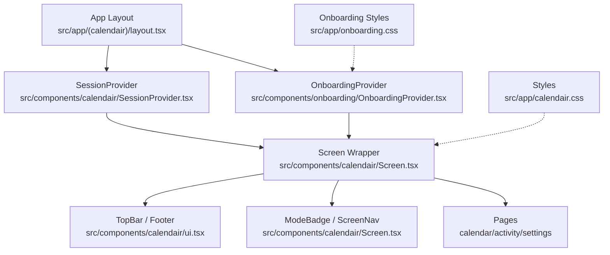

**Diagram sources**
- [layout.tsx:12-21](file://src/app/(calendair)/layout.tsx#L12-L21)
- [Screen.tsx:18-68](file://src/components/calendair/Screen.tsx#L18-L68)
- [ui.tsx:20-28](file://src/components/calendair/ui.tsx#L20-L28)
- [ui.tsx:154-162](file://src/components/calendair/ui.tsx#L154-L162)
- [calendair.css:141-157](file://src/app/calendair.css#L141-L157)
- [onboarding.css:46-110](file://src/app/onboarding.css#L46-L110)

**Section sources**
- [layout.tsx:12-21](file://src/app/(calendair)/layout.tsx#L12-L21)
- [Screen.tsx:18-68](file://src/components/calendair/Screen.tsx#L18-L68)
- [ui.tsx:20-28](file://src/components/calendair/ui.tsx#L20-L28)
- [ui.tsx:154-162](file://src/components/calendair/ui.tsx#L154-L162)
- [calendair.css:141-157](file://src/app/calendair.css#L141-L157)
- [onboarding.css:46-110](file://src/app/onboarding.css#L46-L110)

## Core Components
- Screen: A client-side wrapper that renders a TopBar, page content, and Footer. It supports optional back navigation and a night mode variant for the agent activity view.
- ModeBadge: Displays current provider mode and scenario, with visual tone based on authorization and adapter type.
- ScreenNav: A simple horizontal navigation list linking to key app routes.
- TopBar and Footer: Reusable header and footer components used by every screen.

Key responsibilities:
- Consistent layout: Every screen uses the same column structure (bar, content, provenance).
- Navigation: Back button behavior or default help trigger.
- Contextual actions: Default right action links to Agent activity; can be overridden.
- Night mode: Switches to a dark surface only for the activity view.

**Section sources**
- [Screen.tsx:18-68](file://src/components/calendair/Screen.tsx#L18-L68)
- [Screen.tsx:72-96](file://src/components/calendair/Screen.tsx#L72-L96)
- [Screen.tsx:106-132](file://src/components/calendair/Screen.tsx#L106-L132)
- [ui.tsx:20-28](file://src/components/calendair/ui.tsx#L20-L28)
- [ui.tsx:154-162](file://src/components/calendair/ui.tsx#L154-L162)

## Architecture Overview
Screens are rendered inside providers that maintain session and onboarding state. The Screen wrapper composes TopBar, children, and Footer, while integrating with Next.js routing and the onboarding guide system.

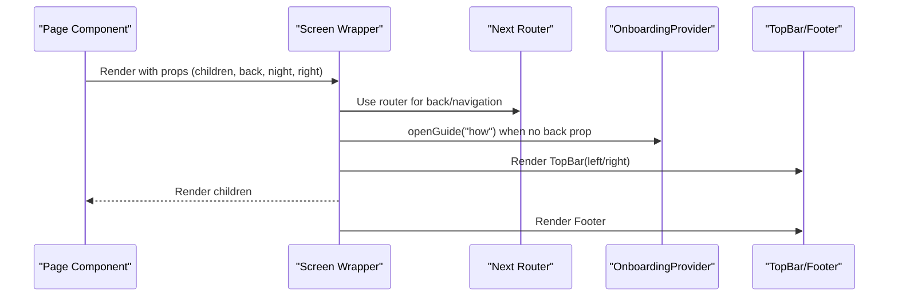

**Diagram sources**
- [Screen.tsx:29-68](file://src/components/calendair/Screen.tsx#L29-L68)
- [OnboardingProvider.tsx:92-96](file://src/components/onboarding/OnboardingProvider.tsx#L92-L96)
- [ui.tsx:20-28](file://src/components/calendair/ui.tsx#L20-L28)
- [ui.tsx:154-162](file://src/components/calendair/ui.tsx#L154-L162)

## Detailed Component Analysis

### Screen Wrapper
- Purpose: Provide a consistent layout shell for all pages.
- Props:
  - children: Page content.
  - back: Optional string URL or boolean true to use browser back.
  - night: Boolean to enable dark surface for agent activity view.
  - right: Override default right action (Agent activity link).
- Behavior:
  - Left slot: If back is provided, render a back button; otherwise render a help button that opens the onboarding guide.
  - Right slot: Defaults to a link to Agent activity with a notification dot; can be replaced.
  - Night mode: Adds a modifier class to switch to dark theme tokens.
  - Footer: Always rendered at the bottom.

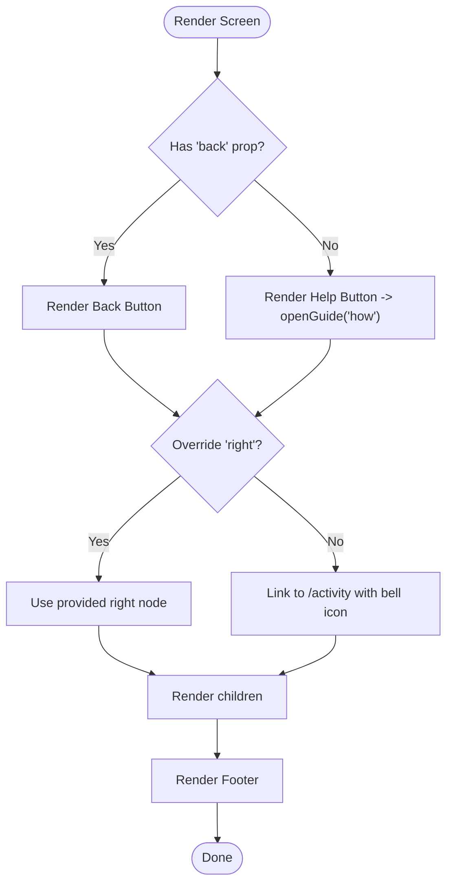

**Diagram sources**
- [Screen.tsx:29-68](file://src/components/calendair/Screen.tsx#L29-L68)

**Section sources**
- [Screen.tsx:18-68](file://src/components/calendair/Screen.tsx#L18-L68)

### ModeBadge
- Purpose: Display provider mode and scenario without implying “live” unless authorized.
- Data source: Session context (atlas account status and scenario).
- Visuals:
  - Dot color varies by adapter and authorization state.
  - Tone class changes based on demo vs. authorized vs. warn states.
  - Clicking navigates to demo route.

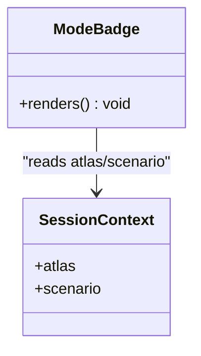

**Diagram sources**
- [Screen.tsx:72-96](file://src/components/calendair/Screen.tsx#L72-L96)
- [SessionProvider.tsx:98-112](file://src/components/calendair/SessionProvider.tsx#L98-L112)

**Section sources**
- [Screen.tsx:72-96](file://src/components/calendair/Screen.tsx#L72-L96)
- [SessionProvider.tsx:98-112](file://src/components/calendair/SessionProvider.tsx#L98-L112)

### ScreenNav
- Purpose: Provide a compact set of primary navigation links.
- Implementation: Renders a flex row of links to Calendar, Agent activity, Onboarding, Preferences, and Demo.

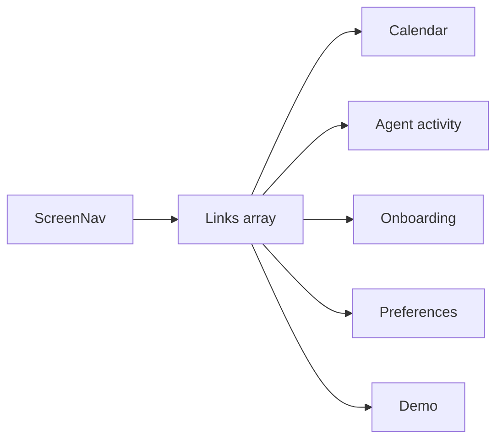

**Diagram sources**
- [Screen.tsx:98-132](file://src/components/calendair/Screen.tsx#L98-L132)

**Section sources**
- [Screen.tsx:98-132](file://src/components/calendair/Screen.tsx#L98-L132)

### TopBar and Footer
- TopBar: Three-column grid with left actions, wordmark center, and right actions.
- Footer: Simple attribution footer.

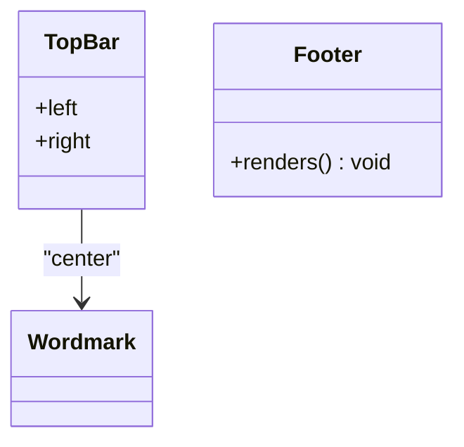

**Diagram sources**
- [ui.tsx:20-28](file://src/components/calendair/ui.tsx#L20-L28)
- [ui.tsx:154-162](file://src/components/calendair/ui.tsx#L154-L162)

**Section sources**
- [ui.tsx:20-28](file://src/components/calendair/ui.tsx#L20-L28)
- [ui.tsx:154-162](file://src/components/calendair/ui.tsx#L154-L162)

### Night Mode in Agent Activity View
- Mechanism: Passing night={true} to Screen adds a modifier class that switches background, text, and card colors to a dark palette.
- Usage: The activity page wraps its content in Screen with night enabled.

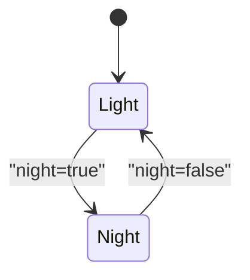

**Diagram sources**
- [calendair.css:150-157](file://src/app/calendair.css#L150-L157)
- [activity/page.tsx:31-33](file://src/app/(calendair)/activity/page.tsx#L31-L33)

**Section sources**
- [calendair.css:150-157](file://src/app/calendair.css#L150-L157)
- [activity/page.tsx:31-33](file://src/app/(calendair)/activity/page.tsx#L31-L33)

### Creating New Screens Using Screen
- Wrap your page content in Screen to get consistent TopBar and Footer.
- Provide back="/" or any URL to add a back button; omit to show help instead.
- Optionally override right to replace the default Agent activity link.
- Example patterns:
  - Calendar screen uses back="/" and standard layout.
  - Settings screen uses back="/" and demonstrates multiple cards and actions.

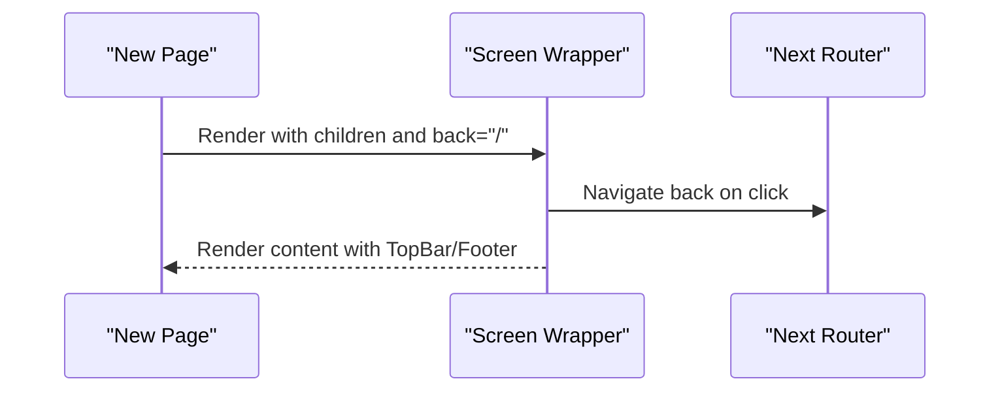

**Diagram sources**
- [Screen.tsx:29-68](file://src/components/calendair/Screen.tsx#L29-L68)
- [calendar/page.tsx:36-38](file://src/app/(calendair)/calendar/page.tsx#L36-L38)
- [settings/page.tsx:47-49](file://src/app/(calendair)/settings/page.tsx#L47-L49)

**Section sources**
- [calendar/page.tsx:36-38](file://src/app/(calendair)/calendar/page.tsx#L36-L38)
- [settings/page.tsx:47-49](file://src/app/(calendair)/settings/page.tsx#L47-L49)

### Handling Back Navigation
- When back is a string: navigate to that URL.
- When back is true: use browser history back.
- When omitted: show help button that opens the onboarding guide.

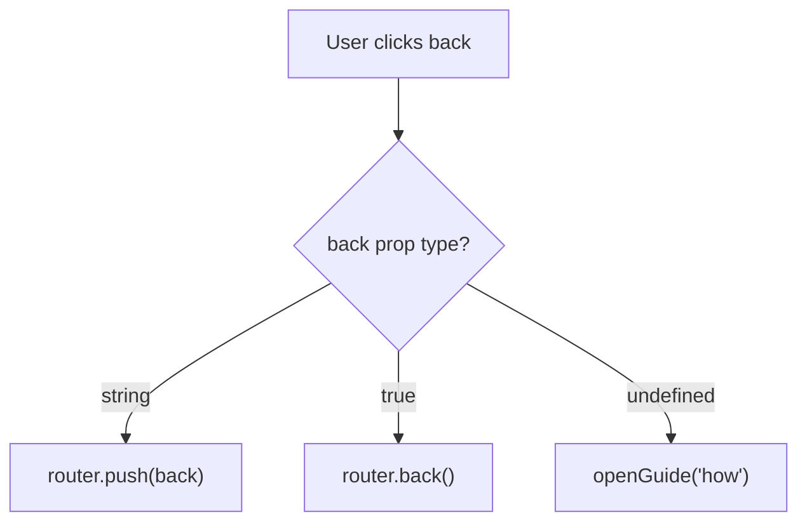

**Diagram sources**
- [Screen.tsx:35-55](file://src/components/calendair/Screen.tsx#L35-L55)

**Section sources**
- [Screen.tsx:35-55](file://src/components/calendair/Screen.tsx#L35-L55)

### Integrating with the Onboarding Guide System
- The Screen’s default left action opens the guide via the onboarding context.
- The OnboardingProvider exposes openGuide(tab, term) and manages tour/welcome state.
- Keyboard shortcut: pressing “?” opens the guide from anywhere except input fields.

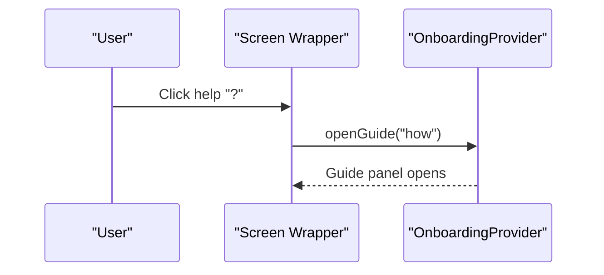

**Diagram sources**
- [Screen.tsx:45-55](file://src/components/calendair/Screen.tsx#L45-L55)
- [OnboardingProvider.tsx:92-96](file://src/components/onboarding/OnboardingProvider.tsx#L92-L96)
- [OnboardingProvider.tsx:104-119](file://src/components/onboarding/OnboardingProvider.tsx#L104-L119)

**Section sources**
- [Screen.tsx:45-55](file://src/components/calendair/Screen.tsx#L45-L55)
- [OnboardingProvider.tsx:92-96](file://src/components/onboarding/OnboardingProvider.tsx#L92-L96)
- [OnboardingProvider.tsx:104-119](file://src/components/onboarding/OnboardingProvider.tsx#L104-L119)

## Dependency Analysis
- Screen depends on:
  - Next.js router for navigation.
  - OnboardingProvider for guide control.
  - ui components for TopBar and Footer.
  - icons for visual elements.
- ModeBadge depends on SessionProvider for atlas and scenario data.
- Pages depend on Screen for layout and on SessionProvider for data.

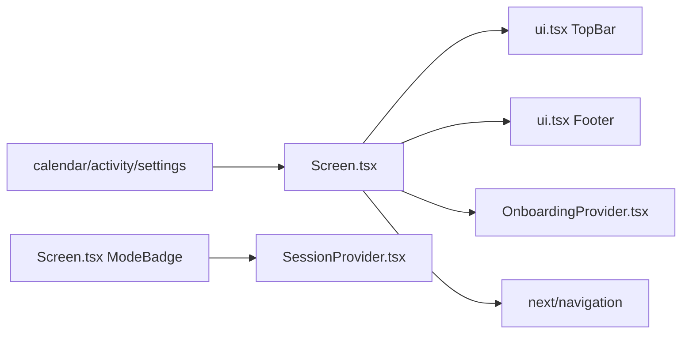

**Diagram sources**
- [Screen.tsx:1-10](file://src/components/calendair/Screen.tsx#L1-L10)
- [Screen.tsx:72-96](file://src/components/calendair/Screen.tsx#L72-L96)
- [ui.tsx:20-28](file://src/components/calendair/ui.tsx#L20-L28)
- [ui.tsx:154-162](file://src/components/calendair/ui.tsx#L154-L162)
- [SessionProvider.tsx:98-112](file://src/components/calendair/SessionProvider.tsx#L98-L112)

**Section sources**
- [Screen.tsx:1-10](file://src/components/calendair/Screen.tsx#L1-L10)
- [Screen.tsx:72-96](file://src/components/calendair/Screen.tsx#L72-L96)
- [ui.tsx:20-28](file://src/components/calendair/ui.tsx#L20-L28)
- [ui.tsx:154-162](file://src/components/calendair/ui.tsx#L154-L162)
- [SessionProvider.tsx:98-112](file://src/components/calendair/SessionProvider.tsx#L98-L112)

## Performance Considerations
- Minimal re-renders: Screen is lightweight; it primarily composes layout and delegates navigation to Next.js router.
- Context usage: ModeBadge reads session context only when needed; ensure providers are placed high enough to avoid unnecessary remounts.
- Night mode: Uses CSS modifiers; no runtime overhead beyond class toggling.
- Avoid heavy computations inside Screen; keep logic in page components.

[No sources needed since this section provides general guidance]

## Troubleshooting Guide
- Back button not working:
  - Ensure back prop is either a valid URL string or true.
  - Verify Next.js router is available (client component).
- Help button does nothing:
  - Confirm OnboardingProvider wraps the app layout.
  - Check keyboard shortcut handler and focus conditions.
- Night mode not applied:
  - Ensure night={true} is passed to Screen.
  - Verify styles are loaded and the modifier class is present.
- ModeBadge shows unexpected tone:
  - Check session atlas state and authorization flags.
  - Confirm adapter value and authorized flag are correctly set.

**Section sources**
- [Screen.tsx:35-55](file://src/components/calendair/Screen.tsx#L35-L55)
- [OnboardingProvider.tsx:104-119](file://src/components/onboarding/OnboardingProvider.tsx#L104-L119)
- [calendair.css:150-157](file://src/app/calendair.css#L150-L157)
- [Screen.tsx:72-96](file://src/components/calendair/Screen.tsx#L72-L96)

## Conclusion
The Screen component system provides a robust, consistent foundation for CALENDAIR’s pages. With built-in navigation, onboarding integration, and a specialized night mode for agent activity, it simplifies building new screens while maintaining a cohesive user experience. Coupled with CSS custom properties and Tailwind configuration, the styling remains flexible and theme-aware.

[No sources needed since this section summarizes without analyzing specific files]

## Appendices

### Styling Approach
- CSS custom properties define design tokens for colors, typography, spacing, and shadows.
- Modifier classes (e.g., ca-shell--night) adapt themes per component.
- Tailwind is integrated via PostCSS plugin; utility classes can be combined with custom tokens.

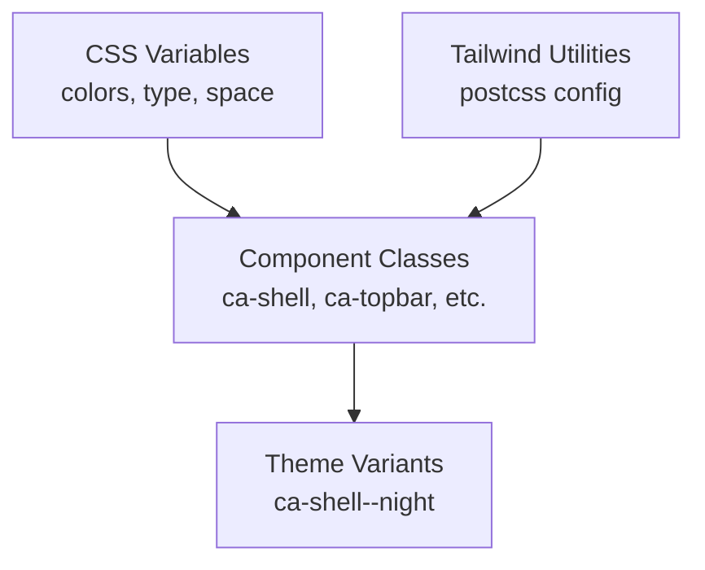

**Diagram sources**
- [calendair.css:10-91](file://src/app/calendair.css#L10-L91)
- [calendair.css:141-157](file://src/app/calendair.css#L141-L157)
- [postcss.config.mjs:1-7](file://postcss.config.mjs#L1-L7)

**Section sources**
- [calendair.css:10-91](file://src/app/calendair.css#L10-L91)
- [calendair.css:141-157](file://src/app/calendair.css#L141-L157)
- [postcss.config.mjs:1-7](file://postcss.config.mjs#L1-L7)