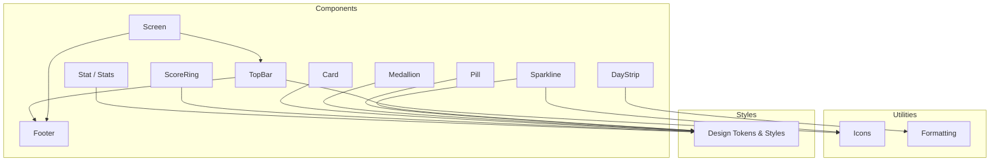
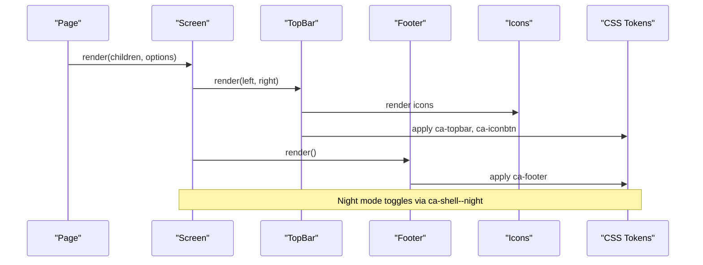
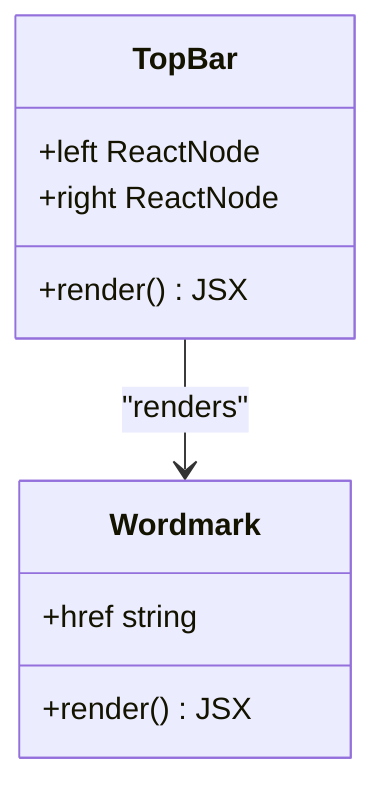
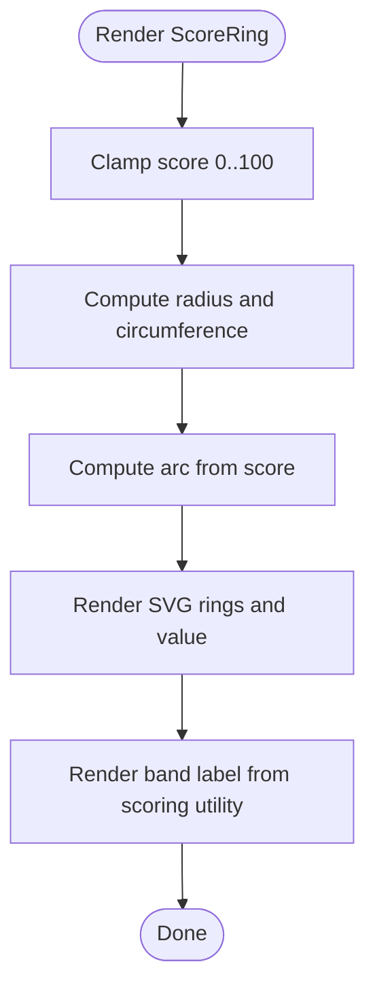
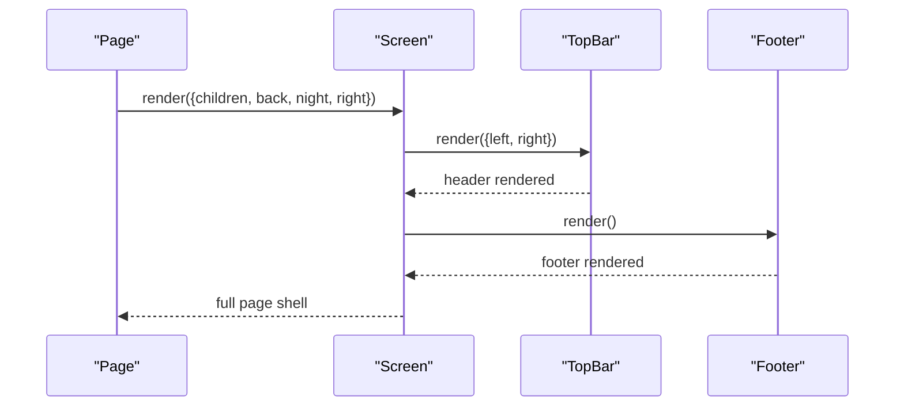
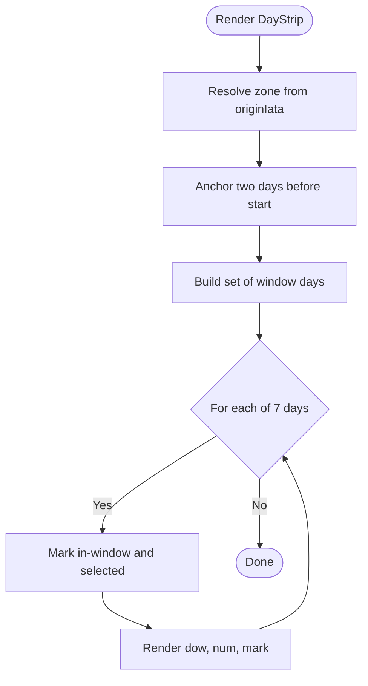
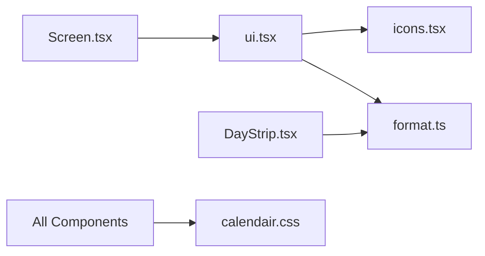

# UI Primitives

<cite>
**Referenced Files in This Document**
- [ui.tsx](file://src/components/calendair/ui.tsx)
- [icons.tsx](file://src/components/calendair/icons.tsx)
- [format.ts](file://src/components/calendair/format.ts)
- [Screen.tsx](file://src/components/calendair/Screen.tsx)
- [DayStrip.tsx](file://src/components/calendair/DayStrip.tsx)
- [calendair.css](file://src/app/calendair.css)
- [globals.css](file://src/app/globals.css)
</cite>

## Table of Contents
1. [Introduction](#introduction)
2. [Project Structure](#project-structure)
3. [Core Components](#core-components)
4. [Architecture Overview](#architecture-overview)
5. [Detailed Component Analysis](#detailed-component-analysis)
6. [Dependency Analysis](#dependency-analysis)
7. [Performance Considerations](#performance-considerations)
8. [Troubleshooting Guide](#troubleshooting-guide)
9. [Conclusion](#conclusion)
10. [Appendices](#appendices)

## Introduction
This document describes CALENDAIR’s shared UI primitives and design system. It covers reusable components (TopBar, Footer, icon buttons), formatting utilities, composition patterns, prop interfaces, styling conventions, color tokens, typography scale, spacing tokens, accessibility considerations, responsive behavior, and guidance for extending the system with custom styled components that follow established patterns.

## Project Structure
The UI primitives live under a focused set of files:
- React components: TopBar, Card, Medallion, Pill, Stat, Stats, ScoreRing, Footer, Sparkline, Screen, DayStrip
- Icons: a consistent SVG icon set with standardized props
- Formatting utilities: money, dates, times, durations, place names
- Styles: centralized CSS variables and component styles

**Diagram sources**
- [ui.tsx:20-28](file://src/components/calendair/ui.tsx#L20-L28)
- [ui.tsx:30-53](file://src/components/calendair/ui.tsx#L30-L53)
- [ui.tsx:55-73](file://src/components/calendair/ui.tsx#L55-L73)
- [ui.tsx:75-83](file://src/components/calendair/ui.tsx#L75-L83)
- [ui.tsx:85-109](file://src/components/calendair/ui.tsx#L85-L109)
- [ui.tsx:118-152](file://src/components/calendair/ui.tsx#L118-L152)
- [ui.tsx:154-162](file://src/components/calendair/ui.tsx#L154-L162)
- [ui.tsx:164-172](file://src/components/calendair/ui.tsx#L164-L172)
- [Screen.tsx:18-69](file://src/components/calendair/Screen.tsx#L18-L69)
- [DayStrip.tsx:13-65](file://src/components/calendair/DayStrip.tsx#L13-L65)
- [icons.tsx:1-24](file://src/components/calendair/icons.tsx#L1-L24)
- [format.ts:6-54](file://src/components/calendair/format.ts#L6-L54)
- [calendair.css:10-91](file://src/app/calendair.css#L10-L91)

**Section sources**
- [ui.tsx:10-172](file://src/components/calendair/ui.tsx#L10-L172)
- [Screen.tsx:18-69](file://src/components/calendair/Screen.tsx#L18-L69)
- [DayStrip.tsx:13-65](file://src/components/calendair/DayStrip.tsx#L13-L65)
- [icons.tsx:1-184](file://src/components/calendair/icons.tsx#L1-L184)
- [format.ts:1-54](file://src/components/calendair/format.ts#L1-L54)
- [calendair.css:10-1109](file://src/app/calendair.css#L10-L1109)
- [globals.css:1-14](file://src/app/globals.css#L1-L14)

## Core Components
- TopBar: Header with left/right slots and a centered Wordmark. Uses icon button styles for actions.
- Footer: Simple attribution footer with night-mode support.
- Card: Container with optional flat/padded variants via class modifiers.
- Medallion: Circular badge with tone and size variants.
- Pill: Inline label/badge with multiple tones.
- Stat/Stats: Data display grid with labels, values, and hints; column count controlled by a CSS variable.
- ScoreRing: Visual escape score ring with band label.
- Sparkline: Inline indicator combining an icon and content.
- Screen: Page shell composing TopBar, content, and Footer; supports back navigation and “night” mode.
- DayStrip: Seven-day strip around an opening window with selection and availability indicators.

Prop interfaces and composition patterns are defined inline per component and rely on CSS class modifiers for visual variants.

**Section sources**
- [ui.tsx:20-28](file://src/components/calendair/ui.tsx#L20-L28)
- [ui.tsx:30-53](file://src/components/calendair/ui.tsx#L30-L53)
- [ui.tsx:55-73](file://src/components/calendair/ui.tsx#L55-L73)
- [ui.tsx:75-83](file://src/components/calendair/ui.tsx#L75-L83)
- [ui.tsx:85-109](file://src/components/calendair/ui.tsx#L85-L109)
- [ui.tsx:118-152](file://src/components/calendair/ui.tsx#L118-L152)
- [ui.tsx:154-162](file://src/components/calendair/ui.tsx#L154-L162)
- [ui.tsx:164-172](file://src/components/calendair/ui.tsx#L164-L172)
- [Screen.tsx:18-69](file://src/components/calendair/Screen.tsx#L18-L69)
- [DayStrip.tsx:13-65](file://src/components/calendair/DayStrip.tsx#L13-L65)

## Architecture Overview
The design system is built on:
- A single source of truth for tokens and styles in calendair.css
- Small, composable React components that apply semantic class names
- Utility functions for consistent formatting across screens
- A page shell (Screen) that standardizes layout and navigation

**Diagram sources**
- [Screen.tsx:18-69](file://src/components/calendair/Screen.tsx#L18-L69)
- [ui.tsx:20-28](file://src/components/calendair/ui.tsx#L20-L28)
- [ui.tsx:154-162](file://src/components/calendair/ui.tsx#L154-L162)
- [icons.tsx:1-24](file://src/components/calendair/icons.tsx#L1-L24)
- [calendair.css:199-270](file://src/app/calendair.css#L199-L270)
- [calendair.css:1007-1025](file://src/app/calendair.css#L1007-L1025)

## Detailed Component Analysis

### TopBar
- Purpose: Consistent header with left/right action slots and brand wordmark.
- Props: left, right (ReactNode).
- Composition: Wraps children in a grid header; centers Wordmark; aligns right slot to end.
- Styling: Uses ca-topbar and ca-iconbtn classes; supports night mode via parent shell.
- Accessibility: Action buttons use aria-labels when used through Screen; Wordmark has aria-label.

**Diagram sources**
- [ui.tsx:20-28](file://src/components/calendair/ui.tsx#L20-L28)
- [ui.tsx:10-17](file://src/components/calendair/ui.tsx#L10-L17)

**Section sources**
- [ui.tsx:20-28](file://src/components/calendair/ui.tsx#L20-L28)
- [ui.tsx:10-17](file://src/components/calendair/ui.tsx#L10-L17)
- [calendair.css:199-270](file://src/app/calendair.css#L199-L270)

### Footer
- Purpose: Minimal attribution footer with night-mode support.
- Props: None.
- Styling: Uses ca-footer; strong elements emphasize partner names.

**Section sources**
- [ui.tsx:154-162](file://src/components/calendair/ui.tsx#L154-L162)
- [calendair.css:1007-1025](file://src/app/calendair.css#L1007-L1025)

### Card
- Purpose: Content container with optional flat or padded variants.
- Props: children, flat?, pad?, className?, style?, plus HTML attributes.
- Styling: Applies ca-card with modifiers ca-card--flat and ca-card--pad.

**Section sources**
- [ui.tsx:30-53](file://src/components/calendair/ui.tsx#L30-L53)
- [calendair.css:274-288](file://src/app/calendair.css#L274-L288)

### Medallion
- Purpose: Circular badge with tone and size variants.
- Props: children, tone ("gold" | "sage"), size ("md" | "lg").
- Styling: Uses ca-medallion with modifiers ca-medallion--sage and ca-medallion--lg.

**Section sources**
- [ui.tsx:55-73](file://src/components/calendair/ui.tsx#L55-L73)
- [calendair.css:334-356](file://src/app/calendair.css#L334-L356)

### Pill
- Purpose: Inline label/badge with multiple tones.
- Props: children, tone ("gold" | "white" | "sage" | "rose" | "outline").
- Styling: Uses ca-pill with ca-pill--{tone}.

**Section sources**
- [ui.tsx:75-83](file://src/components/calendair/ui.tsx#L75-L83)
- [calendair.css:456-496](file://src/app/calendair.css#L456-L496)

### Stat and Stats
- Purpose: Display data points in a responsive grid.
- Props:
  - Stat: label, value, hint?
  - Stats: cols (number), children
- Styling: ca-stats uses CSS variable --ca-stats-cols to control columns; ca-stat contains label/value/hint.

**Section sources**
- [ui.tsx:85-109](file://src/components/calendair/ui.tsx#L85-L109)
- [calendair.css:573-626](file://src/app/calendair.css#L573-L626)

### ScoreRing
- Purpose: Visual open-ring score with numeric value and band label.
- Props: score (number), size? (default 74).
- Behavior: Computes arc length from score; uses SVG circles; displays band via utility function.
- Styling: ca-score, ca-score__ring, ca-score__svg, ca-score__value, ca-score__band.

**Diagram sources**
- [ui.tsx:118-152](file://src/components/calendair/ui.tsx#L118-L152)

**Section sources**
- [ui.tsx:118-152](file://src/components/calendair/ui.tsx#L118-L152)
- [calendair.css:630-691](file://src/app/calendair.css#L630-L691)

### Sparkline
- Purpose: Inline indicator combining a star icon and content.
- Props: children.
- Styling: Uses Star icon with gold color and inline flex layout.

**Section sources**
- [ui.tsx:164-172](file://src/components/calendair/ui.tsx#L164-L172)
- [icons.tsx:20-24](file://src/components/calendair/icons.tsx#L20-L24)

### Screen
- Purpose: Standard page shell with TopBar, content, and Footer; supports back navigation and night mode.
- Props: children, back (string | true), night? (boolean), right? (ReactNode).
- Behavior: Renders TopBar with back button or help trigger; renders Footer; applies ca-shell--night when needed.

**Diagram sources**
- [Screen.tsx:18-69](file://src/components/calendair/Screen.tsx#L18-L69)
- [ui.tsx:20-28](file://src/components/calendair/ui.tsx#L20-L28)
- [ui.tsx:154-162](file://src/components/calendair/ui.tsx#L154-L162)

**Section sources**
- [Screen.tsx:18-69](file://src/components/calendair/Screen.tsx#L18-L69)

### DayStrip
- Purpose: Seven-day strip around an opening window showing availability and selection.
- Props: startIso, endIso, originIata, selectedIso?.
- Behavior: Computes zone, builds a set of window days, marks selected day, and renders each day with dow, number, and mark.
- Styling: Uses ca-days, ca-day, ca-day__dow, ca-day__num, ca-day__mark; state classes like is-selected and is-inwindow.

**Diagram sources**
- [DayStrip.tsx:13-65](file://src/components/calendair/DayStrip.tsx#L13-L65)

**Section sources**
- [DayStrip.tsx:13-65](file://src/components/calendair/DayStrip.tsx#L13-L65)
- [calendair.css:695-771](file://src/app/calendair.css#L695-L771)

## Dependency Analysis
- Components depend on:
  - Icons: consistent SVG components with standardized stroke/fill and accessibility attributes
  - Formatting: time zone resolution, date/time formatting, currency symbols, duration helpers
  - Styles: centralized CSS variables and class-based modifiers
- The Screen composes TopBar and Footer, demonstrating the composition pattern used throughout the app.
- DayStrip depends on formatting utilities for localizing dates and resolving zones.

**Diagram sources**
- [ui.tsx:1-172](file://src/components/calendair/ui.tsx#L1-L172)
- [icons.tsx:1-184](file://src/components/calendair/icons.tsx#L1-L184)
- [format.ts:1-54](file://src/components/calendair/format.ts#L1-L54)
- [Screen.tsx:1-69](file://src/components/calendair/Screen.tsx#L1-L69)
- [DayStrip.tsx:1-65](file://src/components/calendair/DayStrip.tsx#L1-L65)
- [calendair.css:10-1109](file://src/app/calendair.css#L10-L1109)

**Section sources**
- [ui.tsx:1-172](file://src/components/calendair/ui.tsx#L1-L172)
- [icons.tsx:1-184](file://src/components/calendair/icons.tsx#L1-L184)
- [format.ts:1-54](file://src/components/calendair/format.ts#L1-L54)
- [Screen.tsx:1-69](file://src/components/calendair/Screen.tsx#L1-L69)
- [DayStrip.tsx:1-65](file://src/components/calendair/DayStrip.tsx#L1-L65)
- [calendair.css:10-1109](file://src/app/calendair.css#L10-L1109)

## Performance Considerations
- Prefer using CSS variables for colors, spacing, and typography to avoid runtime recalculations.
- Keep component trees shallow; most primitives are presentational and lightweight.
- Use memoization sparingly; these components are small and re-render quickly.
- Avoid excessive inline styles; prefer class modifiers and CSS variables for theming and variants.
- For lists (e.g., DayStrip), ensure stable keys and minimal DOM updates.

[No sources needed since this section provides general guidance]

## Troubleshooting Guide
- Missing styles: Ensure calendair.css is imported via globals.css so all tokens and component styles load.
- Night mode not applying: Verify the parent shell has the ca-shell--night class when rendering night views.
- Incorrect focus ring: Focus-visible uses a gold outline; confirm no global overrides remove outlines.
- Reduced motion: Animations respect prefers-reduced-motion; verify media queries are active if animations seem disabled.
- Icon sizing: Icons accept a size prop; ensure it matches intended scale.

**Section sources**
- [globals.css:1-14](file://src/app/globals.css#L1-L14)
- [calendair.css:115-119](file://src/app/calendair.css#L115-L119)
- [calendair.css:150-157](file://src/app/calendair.css#L150-L157)
- [calendair.css:960-994](file://src/app/calendair.css#L960-L994)
- [icons.tsx:1-17](file://src/components/calendair/icons.tsx#L1-L17)

## Conclusion
CALENDAIR’s UI primitives provide a cohesive, token-driven design system with clear component boundaries and consistent styling. By leveraging CSS variables, class modifiers, and small composable components, teams can build new features that remain visually and behaviorally consistent. The system emphasizes accessibility, responsive behavior, and maintainability through centralized tokens and simple composition patterns.

[No sources needed since this section summarizes without analyzing specific files]

## Appendices

### Design Tokens
- Colors: ink, ivory, gold, sage, rose, night surfaces
- Typography: display and sans families; type scale from micro to 3xl
- Spacing: 1–16 scale
- Radius: sm–full
- Shadows: soft, md, lg
- Page width and easing

**Section sources**
- [calendair.css:10-91](file://src/app/calendair.css#L10-L91)

### Button System Overview
- Variants: navy, gold, outline, quiet, small
- States: hover, active, disabled
- Accessibility: focus-visible, cursor, text semantics

**Section sources**
- [calendair.css:360-435](file://src/app/calendair.css#L360-L435)

### Icon System
- Shared stroke helper ensures consistent sizing, viewBox, stroke width, and accessibility attributes
- Brand star uses fill; others use currentColor stroke

**Section sources**
- [icons.tsx:1-24](file://src/components/calendair/icons.tsx#L1-L24)
- [icons.tsx:26-184](file://src/components/calendair/icons.tsx#L26-L184)

### Formatting Utilities
- Money: localized symbol and integer rounding
- Time/Date: zone-aware formatting for local time, date, day, and ranges
- Duration: human-readable minutes to hours/minutes
- Place info: airport name and city lookup

**Section sources**
- [format.ts:1-54](file://src/components/calendair/format.ts#L1-L54)

### Extending the System
- Add a new variant: create a new CSS modifier class (e.g., .ca-pill--custom) and extend the component’s prop union to include the new option.
- Create a composite component: compose existing primitives (e.g., Card + Stat + ScoreRing) and apply consistent spacing via tokens.
- Theme customization: adjust CSS variables in :root to redefine colors, spacing, or typography while keeping component logic unchanged.
- Accessibility: ensure interactive elements have appropriate roles, labels, and keyboard support; leverage existing focus styles.

[No sources needed since this section provides general guidance]