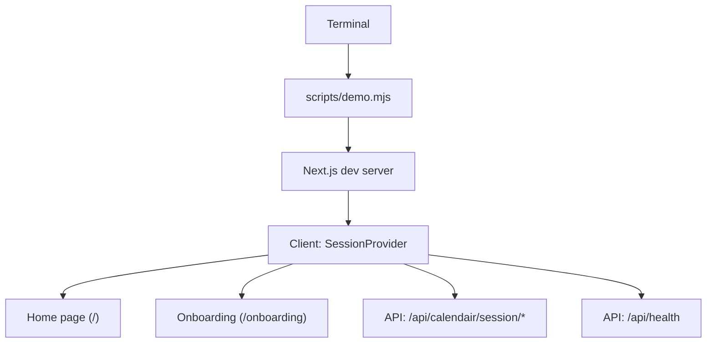
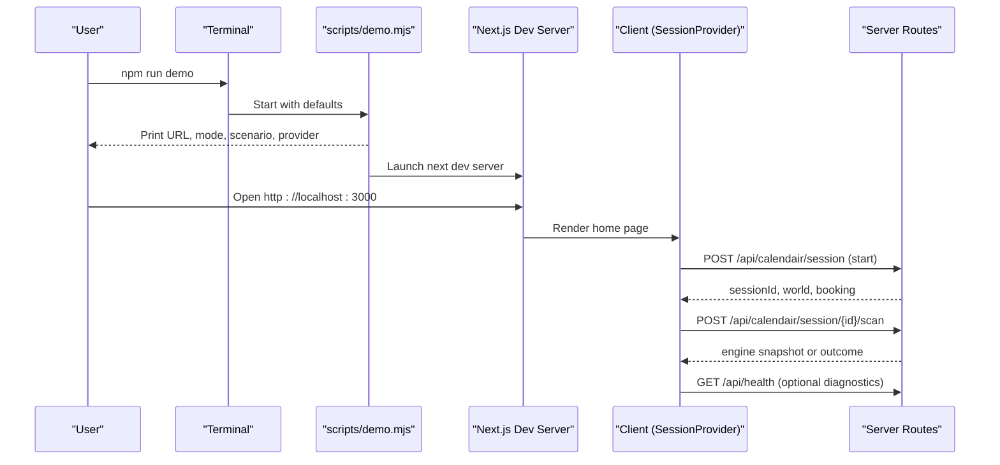
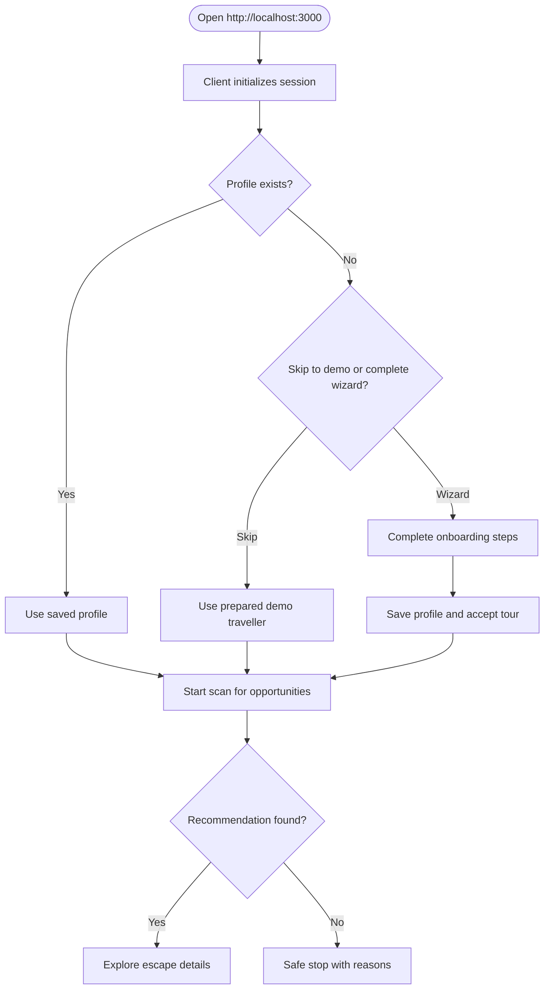
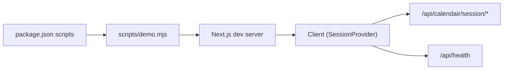

# Getting Started

<cite>
**Referenced Files in This Document**
- [README.md](file://README.md)
- [package.json](file://package.json)
- [.env.example](file://.env.example)
- [.env.local](file://.env.local)
- [scripts/demo.mjs](file://scripts/demo.mjs)
- [src/app/(calendair)/page.tsx](file://src/app/(calendair)/page.tsx)
- [src/app/(calendair)/onboarding/page.tsx](file://src/app/(calendair)/onboarding/page.tsx)
- [src/components/onboarding/Wizard.tsx](file://src/components/onboarding/Wizard.tsx)
- [src/components/calendair/SessionProvider.tsx](file://src/components/calendair/SessionProvider.tsx)
- [src/app/api/health/route.ts](file://src/app/api/health/route.ts)
</cite>

## Table of Contents
1. Introduction
2. Project Structure
3. Core Components
4. Architecture Overview
5. Detailed Component Analysis
6. Dependency Analysis
7. Performance Considerations
8. Troubleshooting Guide
9. Conclusion

## Introduction
CALENDAIR is an AI-powered in-calendar travel booking system that turns unexpected free time into safely bookable travel escapes. Instead of starting with a search, it starts with life: it detects openings in your calendar, matches them to real inventory, applies hard constraints and scoring, and only proceeds when you approve each step. The result is one clear recommendation with transparent reasoning and safe checkpoints before any booking or calendar update.

## Project Structure
This project is a Next.js application with a client-side session layer, server routes for the agent flow, and a demo-first setup that runs deterministically out of the box.

Key areas:
- Environment configuration: .env.example and .env.local define optional integrations (Atlas provider, Google Calendar, Qwen language model).
- Demo runner: scripts/demo.mjs launches the app with sensible defaults and prints the active mode and scenario.
- Client session: src/components/calendair/SessionProvider.tsx manages the run lifecycle, state, and calls to server routes.
- Home screen: src/app/(calendair)/page.tsx shows the detected window and recommended escape.
- Onboarding: src/app/(calendair)/onboarding/page.tsx and src/components/onboarding/Wizard.tsx collect traveller rules and preferences.
- Health endpoint: src/app/api/health/route.ts reports integration status without leaking secrets.

**Diagram sources**
- [scripts/demo.mjs:1-43](file://scripts/demo.mjs#L1-L43)
- [src/components/calendair/SessionProvider.tsx:98-175](file://src/components/calendair/SessionProvider.tsx#L98-L175)
- [src/app/(calendair)/page.tsx:30-48](file://src/app/(calendair)/page.tsx#L30-L48)
- [src/app/(calendair)/onboarding/page.tsx:1-19](file://src/app/(calendair)/onboarding/page.tsx#L1-L19)
- [src/app/api/health/route.ts:10-38](file://src/app/api/health/route.ts#L10-L38)

**Section sources**
- [README.md:26-46](file://README.md#L26-L46)
- [package.json:5-16](file://package.json#L5-L16)
- [.env.example:1-31](file://.env.example#L1-L31)
- [.env.local:1-31](file://.env.local#L1-L31)

## Core Components
- Environment configuration (.env.local): Optional settings for demo mode, scenarios, Atlas provider, Google Calendar, and Qwen language model. Leave everything blank to run the deterministic demo.
- Demo script (scripts/demo.mjs): Starts the app with default environment variables, prints the URL, mode, scenario, and provider information, then launches the Next.js dev server.
- Client session (SessionProvider): Initializes a run, resumes sessions across reloads, scans for opportunities, and orchestrates authorization, booking, and fulfilment checks via server routes.
- Home screen: Displays the detected opening, companion availability, and the recommended escape; triggers scanning automatically when ready.
- Onboarding wizard: Collects eight steps of traveller profile data, including hard limits and preferences, and can skip to the prepared demo traveller.
- Health endpoint: Reports which adapter is live, whether credentials are present, and current demo settings without exposing secrets.

**Section sources**
- [.env.local:1-31](file://.env.local#L1-L31)
- [scripts/demo.mjs:1-43](file://scripts/demo.mjs#L1-L43)
- [src/components/calendair/SessionProvider.tsx:98-175](file://src/components/calendair/SessionProvider.tsx#L98-L175)
- [src/app/(calendair)/page.tsx:30-48](file://src/app/(calendair)/page.tsx#L30-L48)
- [src/app/(calendair)/onboarding/page.tsx:1-19](file://src/app/(calendair)/onboarding/page.tsx#L1-L19)
- [src/components/onboarding/Wizard.tsx:112-133](file://src/components/onboarding/Wizard.tsx#L112-L133)
- [src/app/api/health/route.ts:10-38](file://src/app/api/health/route.ts#L10-L38)

## Architecture Overview
The quick start flow uses deterministic demo data by default. When you run the demo, the script sets environment variables and starts the Next.js development server. The client initializes a session, optionally loads a prepared profile, and begins scanning for opportunities. All consequential actions call server routes, ensuring the state machine and safety properties remain on the server.

**Diagram sources**
- [scripts/demo.mjs:11-41](file://scripts/demo.mjs#L11-L41)
- [src/components/calendair/SessionProvider.tsx:114-175](file://src/components/calendair/SessionProvider.tsx#L114-L175)
- [src/app/(calendair)/page.tsx:34-38](file://src/app/(calendair)/page.tsx#L34-L38)
- [src/app/api/health/route.ts:10-38](file://src/app/api/health/route.ts#L10-L38)

## Detailed Component Analysis

### Quick Start
Follow these steps to set up and run CALENDAIR locally:

- Prepare environment:
  - Copy the example file to create your local environment file:
    - Create .env.local from .env.example
  - No secrets are required to run the demo. Leave all fields blank to use deterministic inventory.

- Install dependencies:
  - Run npm install to install packages.

- Validate:
  - Run npm run validate to typecheck, lint, and run unit tests.

- Start the demo:
  - Run npm run demo to launch the app with recommended defaults.
  - Open http://localhost:3000 in your browser.

- Optional visual rehearsal:
  - Run npm run demo:visual to run in fully deterministic UI rehearsal mode.

What happens at startup:
- The demo script sets default environment variables and prints the active mode, scenario, and provider information.
- It launches the Next.js development server on port 3000.
- The home page reads the session, displays the detected opening, and begins scanning for opportunities.

Available npm scripts:
- dev: Start the Next.js development server directly.
- demo: Start with the recommended hybrid demo scenario.
- demo:visual: Deterministic everything, for UI rehearsal only.
- validate: Typecheck, lint, and unit tests.
- test: Unit tests, including acceptance criteria.
- test:e2e: End-to-end tests driving the agent loop over the HTTP API.
- build: Production build.
- start: Start the production server after building.

**Section sources**
- [README.md:26-46](file://README.md#L26-L46)
- [package.json:5-16](file://package.json#L5-L16)
- [scripts/demo.mjs:11-41](file://scripts/demo.mjs#L11-L41)

### First Launch and Onboarding
When you first open the app:
- The home screen shows the detected opening and may begin scanning for opportunities automatically.
- If no session exists, the client creates one and loads the world snapshot (window, companions, busy blocks).
- You can proceed through onboarding to set your rules and preferences, or skip to the prepared demo traveller.

Onboarding highlights:
- Eight steps cover calendar source, home airport, reach, hard limits, interests, dream destinations, companion, and communication preferences.
- Hard limits become pass/fail constraints; other inputs influence scoring only.
- You can choose the prepared calendar for deterministic runs or connect Google Calendar later.
- Finishing the wizard saves your profile and starts a new run.

**Diagram sources**
- [src/components/calendair/SessionProvider.tsx:114-175](file://src/components/calendair/SessionProvider.tsx#L114-L175)
- [src/components/onboarding/Wizard.tsx:112-133](file://src/components/onboarding/Wizard.tsx#L112-L133)
- [src/app/(calendair)/page.tsx:34-38](file://src/app/(calendair)/page.tsx#L34-L38)

**Section sources**
- [src/app/(calendair)/onboarding/page.tsx:1-19](file://src/app/(calendair)/onboarding/page.tsx#L1-L19)
- [src/components/onboarding/Wizard.tsx:28-40](file://src/components/onboarding/Wizard.tsx#L28-L40)
- [src/components/onboarding/Wizard.tsx:112-133](file://src/components/onboarding/Wizard.tsx#L112-L133)
- [src/components/calendair/SessionProvider.tsx:114-175](file://src/components/calendair/SessionProvider.tsx#L114-L175)
- [src/app/(calendair)/page.tsx:30-48](file://src/app/(calendair)/page.tsx#L30-L48)

### Running the Application Locally
- Ensure Node.js is installed on your system.
- Create .env.local from .env.example if it does not exist.
- Install dependencies with npm install.
- Run npm run demo to start the app with recommended defaults.
- Open http://localhost:3000 in your browser.
- To switch scenarios during a run, visit /demo in the app.

Notes:
- The demo script prints the URL, demo mode, scenario, and provider information before starting the server.
- In visual mode, everything is deterministic and intended for UI rehearsal only.

**Section sources**
- [scripts/demo.mjs:11-41](file://scripts/demo.mjs#L11-L41)
- [README.md:26-46](file://README.md#L26-L46)

### Understanding Available npm Scripts
- dev: Start the Next.js development server directly.
- demo: Start with the recommended hybrid demo scenario.
- demo:visual: Fully deterministic mode for UI rehearsal.
- validate: Run typecheck, lint, and unit tests together.
- test: Run unit tests, including acceptance criteria.
- test:e2e: Drive the full agent loop over the HTTP API in end-to-end tests.
- build: Build the production bundle.
- start: Start the production server after building.

**Section sources**
- [package.json:5-16](file://package.json#L5-L16)

### Environment Configuration
- DEMO_MODE: Controls demo behavior. Default is hybrid. Visual mode disables randomness for UI rehearsal.
- DEMO_SCENARIO: Selects the scripted scenario (e.g., perfect, price-change, sold-out, pending).
- MAX_REPLANS: Limits replanning attempts for safety.
- ATLAS_INTEGRATION_MODE: Leave unset to run deterministic demo inventory. Set to skill or atriP only when a real adapter is implemented; the app refuses to substitute demo data for live calls.
- GOOGLE_CLIENT_ID and GOOGLE_CLIENT_SECRET: Optional Google Calendar integration.
- ALIBABA_CLOUD_MODEL_STUDIO_API_KEY and QWEN_MODEL: Optional language-only explanations; never used for pricing or booking decisions.

You can inspect the active configuration at runtime using the health endpoint exposed by the app.

**Section sources**
- [.env.example:1-31](file://.env.example#L1-L31)
- [.env.local:1-31](file://.env.local#L1-L31)
- [src/app/api/health/route.ts:10-38](file://src/app/api/health/route.ts#L10-L38)

## Dependency Analysis
At runtime, the client depends on server routes to manage sessions and perform agent actions. The demo script configures environment variables and spawns the Next.js process. The health endpoint exposes integration status without leaking secrets.

**Diagram sources**
- [package.json:5-16](file://package.json#L5-L16)
- [scripts/demo.mjs:11-41](file://scripts/demo.mjs#L11-L41)
- [src/components/calendair/SessionProvider.tsx:114-175](file://src/components/calendair/SessionProvider.tsx#L114-L175)
- [src/app/api/health/route.ts:10-38](file://src/app/api/health/route.ts#L10-L38)

**Section sources**
- [package.json:5-16](file://package.json#L5-L16)
- [scripts/demo.mjs:11-41](file://scripts/demo.mjs#L11-L41)
- [src/components/calendair/SessionProvider.tsx:114-175](file://src/components/calendair/SessionProvider.tsx#L114-L175)
- [src/app/api/health/route.ts:10-38](file://src/app/api/health/route.ts#L10-L38)

## Performance Considerations
- Keep DEMO_MODE set to hybrid or visual during development to avoid network latency from live providers.
- Use MAX_REPLANS to bound replanning attempts and keep interactions responsive.
- Avoid enabling Google Calendar unless needed; the prepared calendar provides deterministic performance for demos.
- Language model features (Qwen) are optional and used only for explanations; they do not affect core scheduling or booking logic.

[No sources needed since this section provides general guidance]

## Troubleshooting Guide
Common issues and resolutions:

- Port 3000 is already in use:
  - Stop the process using port 3000 or change the port in your environment before running the demo.

- Dependencies not installed:
  - Run npm install again and ensure there are no errors.

- Validation fails:
  - Run npm run validate to identify type, lint, or test issues. Fix reported problems and re-run.

- No recommendations appear:
  - Check the activity log for rejected candidates and reasons.
  - Try switching scenarios at /demo to reproduce specific flows.

- Provider mode confusion:
  - Review the console output from npm run demo to see the active provider and scenario.
  - Use /demo in the app to inspect adapter, environment, and credentials presence.

- Google Calendar not connected:
  - Add GOOGLE_CLIENT_ID and GOOGLE_CLIENT_SECRET to .env.local and follow the onboarding prompt to connect. Without these, the app uses the prepared calendar.

- Language explanations missing:
  - Add ALIBABA_CLOUD_MODEL_STUDIO_API_KEY and QWEN_MODEL to enable optional explanations. The app works without them.

- Health check:
  - Call /api/health to verify integration mode, credentials presence, and demo settings without exposing secrets.

**Section sources**
- [scripts/demo.mjs:11-41](file://scripts/demo.mjs#L11-L41)
- [src/app/(calendair)/demo/page.tsx:45-99](file://src/app/(calendair)/demo/page.tsx#L45-L99)
- [src/app/api/health/route.ts:10-38](file://src/app/api/health/route.ts#L10-L38)
- [.env.example:1-31](file://.env.example#L1-L31)
- [.env.local:1-31](file://.env.local#L1-L31)

## Conclusion
You can get CALENDAIR running quickly with zero secrets by copying .env.example to .env.local, installing dependencies, validating, and running the demo. The app will start at http://localhost:3000 and guide you through onboarding or let you run the prepared demo traveller. Use the available npm scripts to validate, test, and build, and rely on the health endpoint and demo console to understand the active configuration and provider mode.

[No sources needed since this section summarizes without analyzing specific files]