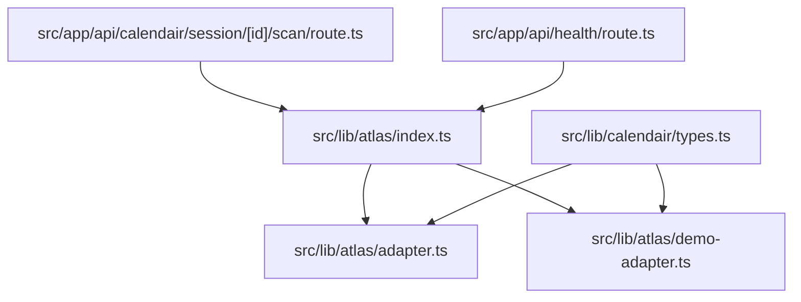
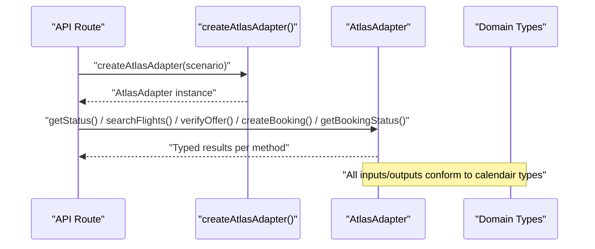
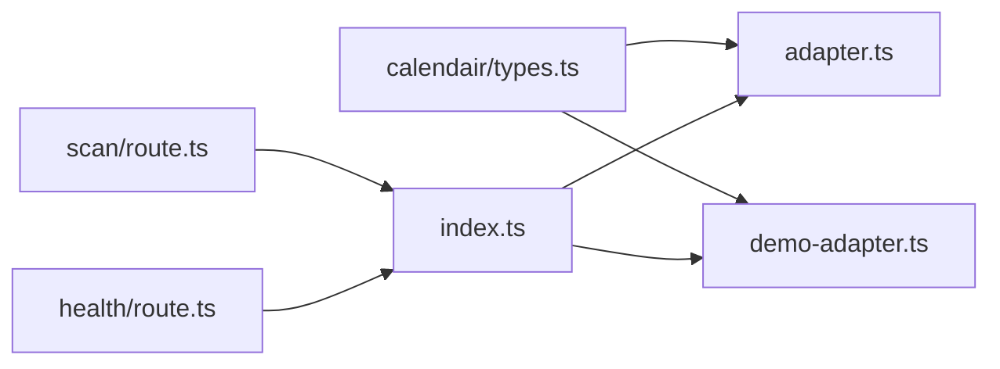

# Atlas Adapter Interface

<cite>
**Referenced Files in This Document**
- [adapter.ts](file://src/lib/atlas/adapter.ts)
- [demo-adapter.ts](file://src/lib/atlas/demo-adapter.ts)
- [index.ts](file://src/lib/atlas/index.ts)
- [types.ts](file://src/lib/calendair/types.ts)
- [scan/route.ts](file://src/app/api/calendair/session/[id]/scan/route.ts)
- [health/route.ts](file://src/app/api/health/route.ts)
</cite>

## Table of Contents
1. [Introduction](#introduction)
2. [Project Structure](#project-structure)
3. [Core Components](#core-components)
4. [Architecture Overview](#architecture-overview)
5. [Detailed Component Analysis](#detailed-component-analysis)
6. [Dependency Analysis](#dependency-analysis)
7. [Performance Considerations](#performance-considerations)
8. [Troubleshooting Guide](#troubleshooting-guide)
9. [Conclusion](#conclusion)
10. [Appendices](#appendices)

## Introduction
This document explains the AtlasAdapter interface that defines a unified contract for travel provider integrations. It details each method signature, input parameters, return types, and error handling patterns. It also documents how the adapter abstracts different providers behind a consistent API surface, including the AtlasNotWiredError class used to prevent accidental demo data in production. Finally, it provides guidance on implementing custom adapters and maintaining type safety across provider boundaries.

## Project Structure
The Atlas integration is implemented under src/lib/atlas with three key files:
- adapter.ts: Defines the AtlasAdapter interface, the AtlasNotWiredError class, and an UnwiredAtlasAdapter placeholder.
- demo-adapter.ts: Provides a deterministic DemoAtlasAdapter for stage reliability.
- index.ts: Exposes createAtlasAdapter(), which selects the appropriate adapter based on environment variables.

**Diagram sources**
- [index.ts:1-38](file://src/lib/atlas/index.ts#L1-L38)
- [adapter.ts:1-79](file://src/lib/atlas/adapter.ts#L1-L79)
- [demo-adapter.ts:1-115](file://src/lib/atlas/demo-adapter.ts#L1-L115)
- [types.ts:1-274](file://src/lib/calendair/types.ts#L1-L274)
- [scan/route.ts:1-34](file://src/app/api/calendair/session/[id]/scan/route.ts#L1-L34)
- [health/route.ts:1-39](file://src/app/api/health/route.ts#L1-L39)

**Section sources**
- [index.ts:1-38](file://src/lib/atlas/index.ts#L1-L38)
- [adapter.ts:1-79](file://src/lib/atlas/adapter.ts#L1-L79)
- [demo-adapter.ts:1-115](file://src/lib/atlas/demo-adapter.ts#L1-L115)
- [types.ts:1-274](file://src/lib/calendair/types.ts#L1-L274)

## Core Components
- AtlasAdapter: The central interface defining the provider contract.
- UnwiredAtlasAdapter: A live-mode placeholder that throws when methods are called without a real implementation.
- DemoAtlasAdapter: A deterministic adapter for staging and demos.
- createAtlasAdapter(): Factory that chooses the adapter based on environment configuration.

Key responsibilities:
- Provide a single abstraction over multiple travel providers.
- Enforce strict behavior in live modes (no silent fallback to demo).
- Offer deterministic behavior for testing and demos.

**Section sources**
- [adapter.ts:23-79](file://src/lib/atlas/adapter.ts#L23-L79)
- [demo-adapter.ts:28-115](file://src/lib/atlas/demo-adapter.ts#L28-L115)
- [index.ts:18-37](file://src/lib/atlas/index.ts#L18-L37)

## Architecture Overview
The system uses a factory pattern to select an adapter at runtime:
- If ATLAS_INTEGRATION_MODE is set to "skill" or "atrip", UnwiredAtlasAdapter is returned until a real implementation is wired.
- Otherwise, DemoAtlasAdapter is used for deterministic behavior.
- All callers interact only with the AtlasAdapter interface, never with provider-specific code.

**Diagram sources**
- [index.ts:18-37](file://src/lib/atlas/index.ts#L18-L37)
- [adapter.ts:23-79](file://src/lib/atlas/adapter.ts#L23-L79)
- [types.ts:106-273](file://src/lib/calendair/types.ts#L106-L273)

## Detailed Component Analysis

### AtlasAdapter Interface
The interface defines five core operations:
- getStatus(): Returns account status and adapter metadata.
- searchFlights(input): Searches offers using flight search criteria.
- verifyOffer(offerId): Re-verifies an offer’s current price and availability.
- createBooking(input): Creates a booking from a verified offer and passenger profile.
- getBookingStatus(reference): Retrieves the latest booking state by reference.

Input and output contracts are defined by domain types:
- FlightSearchInput: origin, destination, departureAfter, returnBefore, adults, cabin, nonstopPreferred.
- NormalizedOffer: standardized fields like id, origin, destination, times, price, currency, bookable flags, stops, source, optional marketing carrier info.
- VerifiedOffer: extends NormalizedOffer with verification timestamp.
- BookingInput: verified offer, passengerProfileId, approvedTotal, approvedCurrency.
- BookingResult: reference, state, testMode, rawStatusLabel, optional ticketNumber and pnr.
- AtlasAccountStatus: authorized, ticketingAvailable, environment, adapter label, and human-readable label.

Error handling:
- In live mode without a real implementation, UnwiredAtlasAdapter throws AtlasNotWiredError for all operational methods except getStatus().
- Callers should catch this error and respond appropriately (e.g., returning 501 with atlasNotWired flag).

Best practices:
- Always validate inputs against the typed interfaces before calling provider APIs.
- Propagate provider errors as rejections; do not mask them with fake success responses.
- Use testMode in BookingResult to distinguish sandbox vs. production outcomes.

**Section sources**
- [adapter.ts:23-79](file://src/lib/atlas/adapter.ts#L23-L79)
- [types.ts:106-273](file://src/lib/calendair/types.ts#L106-L273)
- [scan/route.ts:14-32](file://src/app/api/calendair/session/[id]/scan/route.ts#L14-L32)

### AtlasNotWiredError
Purpose:
- Prevents accidental use of demo data in production or live configurations.
- Signals that a real adapter has not been implemented for the configured mode.

Behavior:
- Thrown by UnwiredAtlasAdapter for searchFlights, verifyOffer, createBooking, and getBookingStatus.
- Includes operation name and configured mode in the message for clear diagnostics.

Usage:
- Catch AtlasNotWiredError in API routes to return a distinct HTTP status and include an atlasNotWired flag in the response payload.

**Section sources**
- [adapter.ts:31-41](file://src/lib/atlas/adapter.ts#L31-L41)
- [adapter.ts:50-79](file://src/lib/atlas/adapter.ts#L50-L79)
- [scan/route.ts:14-32](file://src/app/api/calendair/session/[id]/scan/route.ts#L14-L32)

### UnwiredAtlasAdapter
Role:
- Live-mode placeholder that refuses to pretend to work.
- Ensures visibility in UI via getStatus() reporting adapter mode and environment.

Implementation notes:
- All operational methods throw AtlasNotWiredError.
- getStatus() returns a status indicating no authorization and no ticketing capability.

**Section sources**
- [adapter.ts:50-79](file://src/lib/atlas/adapter.ts#L50-L79)

### DemoAtlasAdapter
Role:
- Deterministic adapter for stage reliability and predictable scenarios.
- Simulates search, verification, booking creation, and polling with controlled states.

Key behaviors:
- getStatus() reports demo inventory and sandbox environment.
- searchFlights() returns offers derived from a scenario-driven world model.
- verifyOffer() re-reads current offers and throws if the offer is no longer present.
- createBooking() creates a pending booking unless the offer is not bookable.
- getBookingStatus() simulates ticketing progression based on elapsed time and scenario.

Type safety:
- All inputs and outputs strictly adhere to the domain types, ensuring compile-time checks across provider boundaries.

**Section sources**
- [demo-adapter.ts:28-115](file://src/lib/atlas/demo-adapter.ts#L28-L115)
- [types.ts:106-273](file://src/lib/calendair/types.ts#L106-L273)

### createAtlasAdapter()
Responsibilities:
- Reads environment variables to determine integration mode and environment.
- Caches adapters per configuration key to support long-lived clients and persistent booking references.
- Selects UnwiredAtlasAdapter for live modes ("skill" or "atrip") or DemoAtlasAdapter otherwise.

Environment variables:
- ATLAS_INTEGRATION_MODE: "skill", "atrip", or unset (defaults to demo).
- ATLAS_ENV: "production", "sandbox", or other (mapped to "unknown").

Caching strategy:
- Uses a Map keyed by mode|environment|scenario to reuse instances across requests.

**Section sources**
- [index.ts:1-38](file://src/lib/atlas/index.ts#L1-L38)

## Dependency Analysis
The adapter layer depends on domain types and is consumed by API routes. The dependency graph ensures separation between provider logic and application flow.

**Diagram sources**
- [types.ts:1-274](file://src/lib/calendair/types.ts#L1-L274)
- [adapter.ts:1-79](file://src/lib/atlas/adapter.ts#L1-L79)
- [demo-adapter.ts:1-115](file://src/lib/atlas/demo-adapter.ts#L1-L115)
- [index.ts:1-38](file://src/lib/atlas/index.ts#L1-L38)
- [scan/route.ts:1-34](file://src/app/api/calendair/session/[id]/scan/route.ts#L1-L34)
- [health/route.ts:1-39](file://src/app/api/health/route.ts#L1-L39)

**Section sources**
- [index.ts:1-38](file://src/lib/atlas/index.ts#L1-L38)
- [scan/route.ts:1-34](file://src/app/api/calendair/session/[id]/scan/route.ts#L1-L34)
- [health/route.ts:1-39](file://src/app/api/health/route.ts#L1-L39)

## Performance Considerations
- Long-lived adapters: The factory caches adapters per configuration to avoid recreating provider clients and to maintain in-memory state (e.g., bookings in DemoAtlasAdapter).
- Deterministic demo behavior: DemoAtlasAdapter avoids network calls and uses local state, improving stability during tests and demos.
- Minimal overhead: The interface adds no runtime cost beyond normal async calls; ensure provider implementations reuse connections and handle rate limits appropriately.

[No sources needed since this section provides general guidance]

## Troubleshooting Guide
Common issues and resolutions:
- AtlasNotWiredError thrown during search or booking:
  - Cause: ATLAS_INTEGRATION_MODE set to "skill" or "atrip" without a real adapter implementation.
  - Resolution: Implement the corresponding adapter or unset the mode to use demo for development.
  - Handling: API routes should catch this error and return a 501 with atlasNotWired flag.

- Unexpected demo data in production:
  - Cause: ATLAS_INTEGRATION_MODE not set, defaulting to demo.
  - Resolution: Set ATLAS_INTEGRATION_MODE to the intended live mode and implement the adapter accordingly.

- Status shows adapter not wired:
  - Check getStatus() response for adapter and label fields to confirm selection and wiring status.

- Booking remains pending:
  - In DemoAtlasAdapter, pending state may persist depending on scenario and elapsed time. Verify scenario and polling intervals.

**Section sources**
- [adapter.ts:31-79](file://src/lib/atlas/adapter.ts#L31-L79)
- [demo-adapter.ts:70-113](file://src/lib/atlas/demo-adapter.ts#L70-L113)
- [scan/route.ts:14-32](file://src/app/api/calendair/session/[id]/scan/route.ts#L14-L32)
- [health/route.ts:10-38](file://src/app/api/health/route.ts#L10-L38)

## Conclusion
The AtlasAdapter interface provides a clean, type-safe abstraction over travel providers, enabling seamless switching between demo and live integrations while preventing accidental misuse of demo data in production. The UnwiredAtlasAdapter enforces explicit wiring requirements, and the factory pattern centralizes configuration decisions. By adhering to the defined types and error-handling patterns, developers can implement custom adapters confidently and maintain robust, predictable behavior across environments.

[No sources needed since this section summarizes without analyzing specific files]

## Appendices

### Method Reference Summary
- getStatus(): Promise<AtlasAccountStatus>
  - Inputs: None
  - Returns: Account authorization, ticketing availability, environment, adapter label
  - Errors: None expected in demo/unwired; live adapters may throw provider errors

- searchFlights(input: FlightSearchInput): Promise<NormalizedOffer[]>
  - Inputs: Origin, destination, date window, passengers, preferences
  - Returns: List of normalized offers
  - Errors: AtlasNotWiredError if unwired; provider errors otherwise

- verifyOffer(offerId: string): Promise<VerifiedOffer>
  - Inputs: Offer identifier
  - Returns: Verified offer with timestamp
  - Errors: AtlasNotWiredError if unwired; provider errors otherwise

- createBooking(input: BookingInput): Promise<BookingResult>
  - Inputs: Verified offer, passenger profile ID, approved total and currency
  - Returns: Booking result with state and optional ticket details
  - Errors: AtlasNotWiredError if unwired; provider errors otherwise

- getBookingStatus(reference: string): Promise<BookingResult>
  - Inputs: Booking reference
  - Returns: Latest booking state and details
  - Errors: AtlasNotWiredError if unwired; provider errors otherwise

**Section sources**
- [adapter.ts:23-79](file://src/lib/atlas/adapter.ts#L23-L79)
- [types.ts:106-273](file://src/lib/calendair/types.ts#L106-L273)

### Example Usage Patterns
- API route usage:
  - Create adapter via createAtlasAdapter(session.scenario)
  - Call methods and handle AtlasNotWiredError distinctly
  - Return structured JSON responses with error indicators

- Health check:
  - Use getStatus() to report adapter mode, environment, and credential presence

**Section sources**
- [scan/route.ts:1-34](file://src/app/api/calendair/session/[id]/scan/route.ts#L1-L34)
- [health/route.ts:1-39](file://src/app/api/health/route.ts#L1-L39)