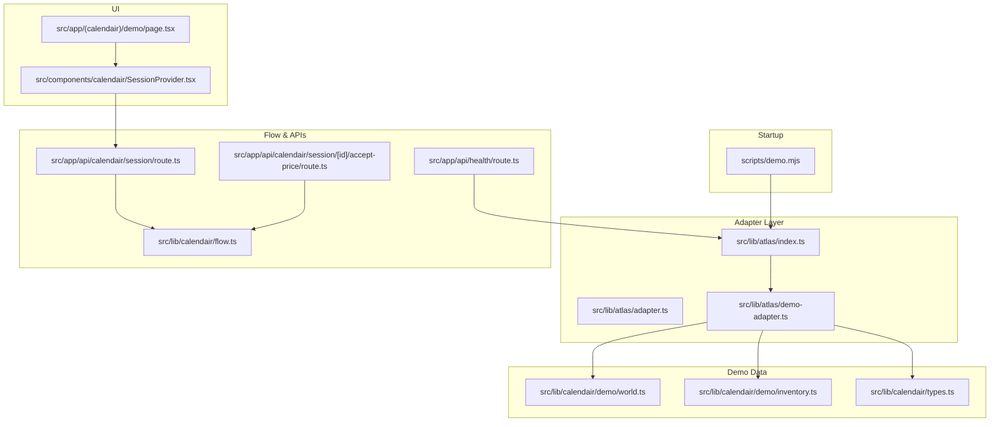
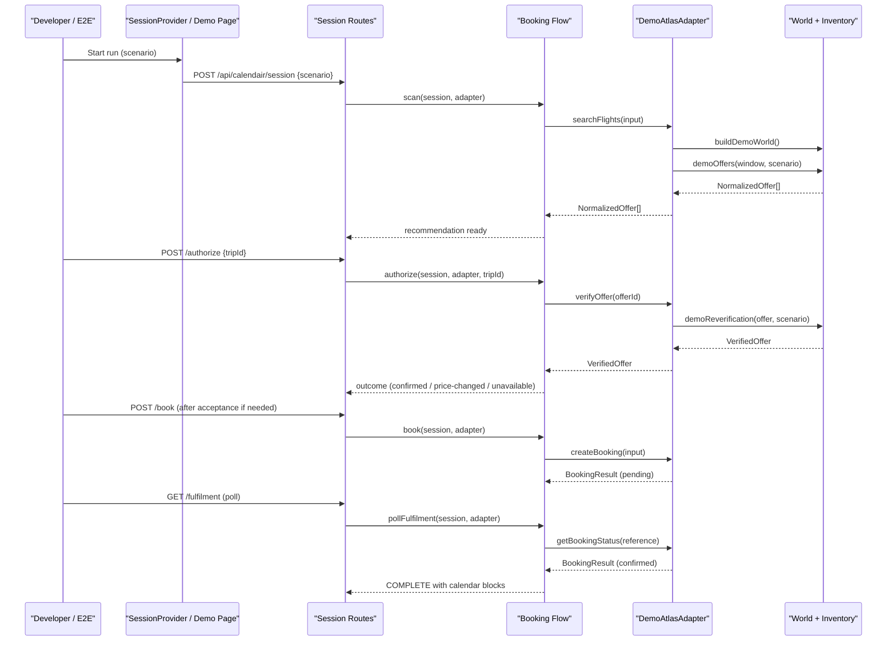
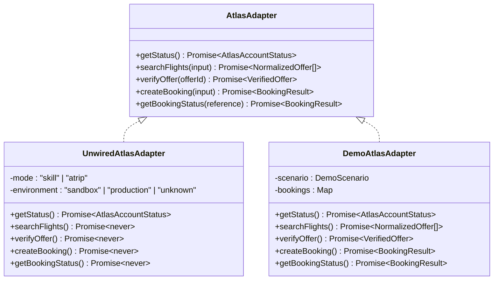
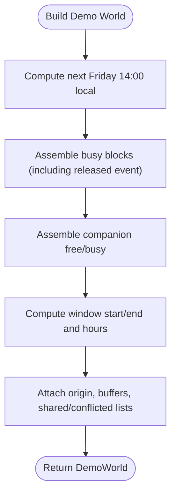
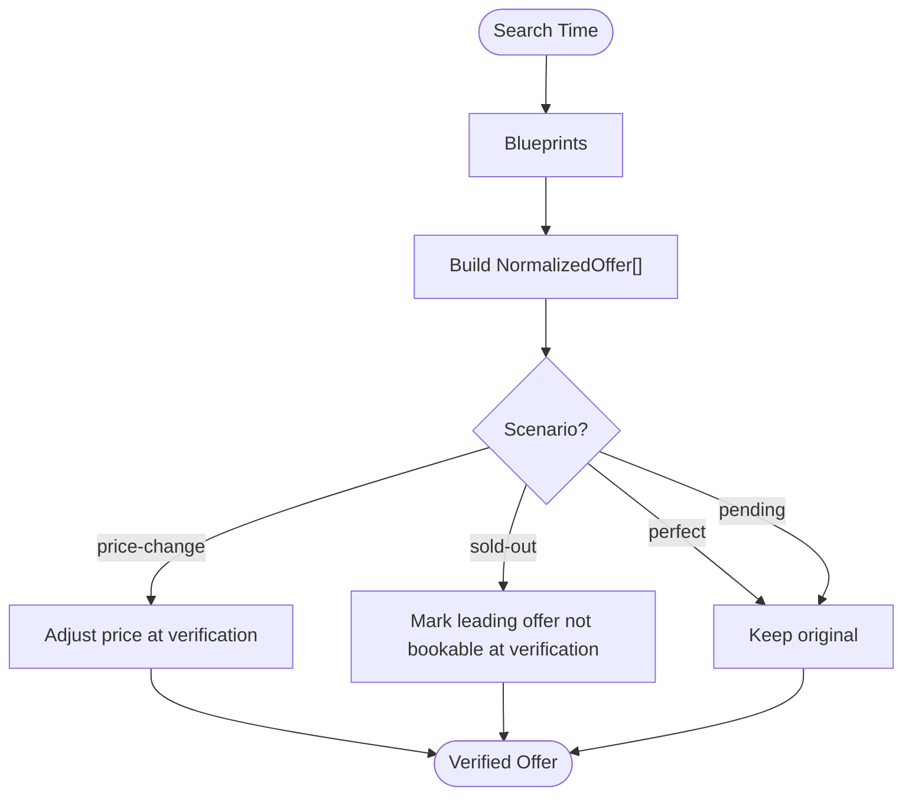
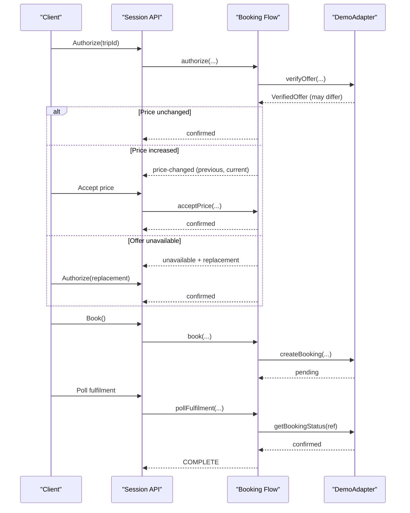
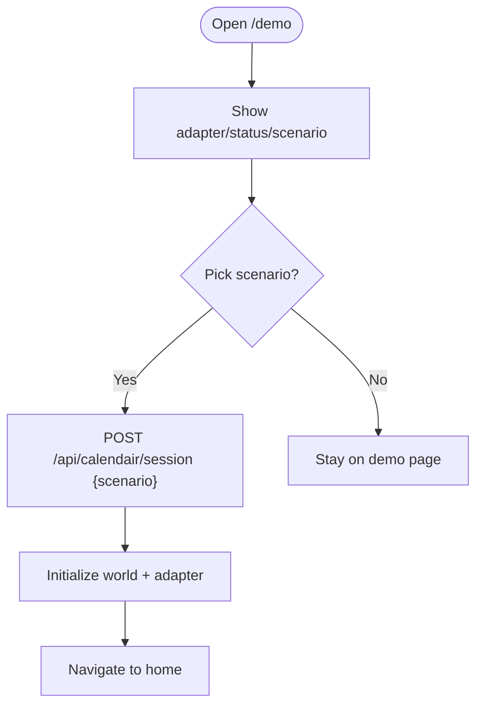
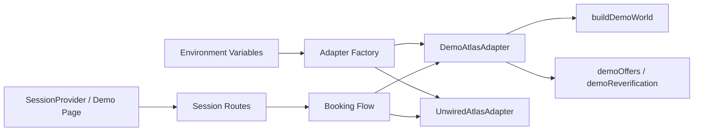

# Demo Adapter Implementation

<cite>
**Referenced Files in This Document**
- [scripts/demo.mjs](file://scripts/demo.mjs)
- [src/lib/atlas/index.ts](file://src/lib/atlas/index.ts)
- [src/lib/atlas/adapter.ts](file://src/lib/atlas/adapter.ts)
- [src/lib/atlas/demo-adapter.ts](file://src/lib/atlas/demo-adapter.ts)
- [src/lib/calendair/demo/inventory.ts](file://src/lib/calendair/demo/inventory.ts)
- [src/lib/calendair/demo/world.ts](file://src/lib/calendair/demo/world.ts)
- [src/lib/calendair/types.ts](file://src/lib/calendair/types.ts)
- [src/lib/calendair/flow.ts](file://src/lib/calendair/flow.ts)
- [src/app/api/calendair/session/route.ts](file://src/app/api/calendair/session/route.ts)
- [src/app/api/calendair/session/[id]/accept-price/route.ts](file://src/app/api/calendair/session/[id]/accept-price/route.ts)
- [src/app/api/health/route.ts](file://src/app/api/health/route.ts)
- [src/components/calendair/SessionProvider.tsx](file://src/components/calendair/SessionProvider.tsx)
- [src/app/(calendair)/demo/page.tsx](file://src/app/(calendair)/demo/page.tsx)
- [scripts/e2e.mjs](file://scripts/e2e.mjs)
</cite>

## Table of Contents
1. Introduction
2. Project Structure
3. Core Components
4. Architecture Overview
5. Detailed Component Analysis
6. Dependency Analysis
7. Performance Considerations
8. Troubleshooting Guide
9. Conclusion
10. Appendices

## Introduction
This document explains the demo adapter implementation that powers deterministic testing scenarios for the CALENDAIR system. It covers how realistic flight offers are generated, how booking workflows proceed through verification and ticketing, and how edge cases like price changes and availability updates are simulated. It also documents test data generation patterns, scenario configuration options, extension points for new scenarios, usage examples for unit/integration tests and development workflows, and security considerations when using demo mode versus live adapters.

## Project Structure
The demo adapter is part of a layered design:
- Environment and startup scripts configure demo mode and scenario selection.
- An adapter factory selects between demo and unwired live adapters based on environment variables.
- The demo adapter composes deterministic world state and inventory to simulate search, verification, booking, and fulfilment.
- The booking flow orchestrates authorization, reverification, replanning, acceptance, booking creation, and polling for confirmation.
- UI and API routes expose session lifecycle, scenario switching, and health diagnostics.

**Diagram sources**
- [scripts/demo.mjs:1-42](file://scripts/demo.mjs#L1-L42)
- [src/lib/atlas/index.ts:1-37](file://src/lib/atlas/index.ts#L1-L37)
- [src/lib/atlas/adapter.ts:1-79](file://src/lib/atlas/adapter.ts#L1-L79)
- [src/lib/atlas/demo-adapter.ts:1-114](file://src/lib/atlas/demo-adapter.ts#L1-L114)
- [src/lib/calendair/demo/world.ts:1-170](file://src/lib/calendair/demo/world.ts#L1-L170)
- [src/lib/calendair/demo/inventory.ts:1-196](file://src/lib/calendair/demo/inventory.ts#L1-L196)
- [src/lib/calendair/types.ts:1-274](file://src/lib/calendair/types.ts#L1-L274)
- [src/lib/calendair/flow.ts:1-350](file://src/lib/calendair/flow.ts#L1-L350)
- [src/app/api/calendair/session/route.ts:1-29](file://src/app/api/calendair/session/route.ts#L1-L29)
- [src/app/api/calendair/session/[id]/accept-price/route.ts:1-15](file://src/app/api/calendair/session/[id]/accept-price/route.ts#L1-L15)
- [src/app/api/health/route.ts:1-39](file://src/app/api/health/route.ts#L1-L39)
- [src/components/calendair/SessionProvider.tsx:96-143](file://src/components/calendair/SessionProvider.tsx#L96-L143)
- [src/app/(calendair)/demo/page.tsx:1-208](file://src/app/(calendair)/demo/page.tsx#L1-L208)

**Section sources**
- [scripts/demo.mjs:1-42](file://scripts/demo.mjs#L1-L42)
- [src/lib/atlas/index.ts:1-37](file://src/lib/atlas/index.ts#L1-L37)
- [src/lib/atlas/adapter.ts:1-79](file://src/lib/atlas/adapter.ts#L1-L79)
- [src/lib/calendair/demo/world.ts:1-170](file://src/lib/calendair/demo/world.ts#L1-L170)
- [src/lib/calendair/demo/inventory.ts:1-196](file://src/lib/calendair/demo/inventory.ts#L1-L196)
- [src/lib/calendair/types.ts:1-274](file://src/lib/calendair/types.ts#L1-L274)
- [src/lib/calendair/flow.ts:1-350](file://src/lib/calendair/flow.ts#L1-L350)
- [src/app/api/calendair/session/route.ts:1-29](file://src/app/api/calendair/session/route.ts#L1-L29)
- [src/app/api/calendair/session/[id]/accept-price/route.ts:1-15](file://src/app/api/calendair/session/[id]/accept-price/route.ts#L1-L15)
- [src/app/api/health/route.ts:1-39](file://src/app/api/health/route.ts#L1-L39)
- [src/components/calendair/SessionProvider.tsx:96-143](file://src/components/calendair/SessionProvider.tsx#L96-L143)
- [src/app/(calendair)/demo/page.tsx:1-208](file://src/app/(calendair)/demo/page.tsx#L1-L208)

## Core Components
- Demo adapter selection: The adapter factory chooses between demo and unwired live adapters based on environment configuration. When no live integration mode is set, the demo adapter is used by default.
- Deterministic world: A fixed passenger profile, calendar window, companion schedule, and taste are generated relative to “now,” ensuring repeatable runs regardless of the day or time.
- Inventory engine: Offers are built from blueprints with offsets from the detected window; prices and bookability can be adjusted per scenario during search and reverification.
- Booking flow: Authorization triggers a live-style recheck; if the price changed or the offer disappeared, the flow stops for explicit user action or bounded replanning. Booking creation returns a pending result; fulfilment polling transitions to confirmed and writes calendar blocks only after confirmation.
- Health and diagnostics: A health endpoint reports adapter type, credentials presence, demo mode, and max replans without leaking secrets.

**Section sources**
- [src/lib/atlas/index.ts:1-37](file://src/lib/atlas/index.ts#L1-L37)
- [src/lib/atlas/adapter.ts:1-79](file://src/lib/atlas/adapter.ts#L1-L79)
- [src/lib/calendair/demo/world.ts:1-170](file://src/lib/calendair/demo/world.ts#L1-L170)
- [src/lib/calendair/demo/inventory.ts:1-196](file://src/lib/calendair/demo/inventory.ts#L1-L196)
- [src/lib/calendair/flow.ts:1-350](file://src/lib/calendair/flow.ts#L1-L350)
- [src/app/api/health/route.ts:1-39](file://src/app/api/health/route.ts#L1-L39)

## Architecture Overview
The demo adapter implements the same interface as a live Atlas provider but returns deterministic results. The booking flow interacts with the adapter at key checkpoints: search, verify, create booking, and poll fulfilment. The UI drives sessions via API routes, and the demo console allows presenters to switch scenarios safely.

**Diagram sources**
- [src/components/calendair/SessionProvider.tsx:96-143](file://src/components/calendair/SessionProvider.tsx#L96-L143)
- [src/app/api/calendair/session/route.ts:1-29](file://src/app/api/calendair/session/route.ts#L1-L29)
- [src/lib/calendair/flow.ts:1-350](file://src/lib/calendair/flow.ts#L1-L350)
- [src/lib/atlas/demo-adapter.ts:1-114](file://src/lib/atlas/demo-adapter.ts#L1-L114)
- [src/lib/calendair/demo/world.ts:1-170](file://src/lib/calendair/demo/world.ts#L1-L170)
- [src/lib/calendair/demo/inventory.ts:1-196](file://src/lib/calendair/demo/inventory.ts#L1-L196)

## Detailed Component Analysis

### Demo Adapter Factory and Modes
- Selection logic: If ATLAS_INTEGRATION_MODE is unset, the demo adapter is selected. If set to skill or atrip, an unwired adapter is returned that throws explicit errors rather than falling back to demo data.
- Caching: Adapters are cached per mode, environment, and scenario to preserve booking references across requests.
- Safety: The unwired adapter refuses all operations with clear errors, preventing accidental substitution of demo data for live calls.

**Diagram sources**
- [src/lib/atlas/adapter.ts:1-79](file://src/lib/atlas/adapter.ts#L1-L79)
- [src/lib/atlas/demo-adapter.ts:1-114](file://src/lib/atlas/demo-adapter.ts#L1-L114)
- [src/lib/atlas/index.ts:1-37](file://src/lib/atlas/index.ts#L1-L37)

**Section sources**
- [src/lib/atlas/index.ts:1-37](file://src/lib/atlas/index.ts#L1-L37)
- [src/lib/atlas/adapter.ts:1-79](file://src/lib/atlas/adapter.ts#L1-L79)

### Deterministic World Generation
- Fixed inputs: Passenger profile, taste, and companion schedules are derived from a prepared demo profile so the opening window is always consistent.
- Window computation: The next Friday afternoon release opens a multi-hour window ending at a Monday morning commitment, including companion conflicts where applicable.
- Output: A DetectedWindow with origin airport, hours, shared/conflicted companions, headline/subhead, and next commitment timestamp.

**Diagram sources**
- [src/lib/calendair/demo/world.ts:1-170](file://src/lib/calendair/demo/world.ts#L1-L170)

**Section sources**
- [src/lib/calendair/demo/world.ts:1-170](file://src/lib/calendair/demo/world.ts#L1-L170)

### Inventory Generation and Scenario Adjustments
- Blueprints: A curated set of itineraries includes both bookable and non-bookable options, each with departure/arrival offsets, stops, cabin, and flights.
- Offer construction: Offers are created relative to the detected window’s start time, ensuring stable scheduling across runs.
- Scenario adjustments:
  - Price change: Reverification increases the leading fare by a fixed amount.
  - Sold out: Reverification marks the leading fare as not bookable.
  - Perfect/pending: No price or availability changes during verification.

**Diagram sources**
- [src/lib/calendair/demo/inventory.ts:1-196](file://src/lib/calendair/demo/inventory.ts#L1-L196)

**Section sources**
- [src/lib/calendair/demo/inventory.ts:1-196](file://src/lib/calendair/demo/inventory.ts#L1-L196)

### Booking Flow with Demo Scenarios
- Authorization and reverification: Before any write, the flow verifies the offer. If the price changed, it stops and requires explicit acceptance. If the offer is gone, it attempts one bounded replan within budget and waits for a decision.
- Booking creation: Returns a pending result; the caller must poll fulfilment until the provider confirms.
- Fulfilment polling: Transitions to confirmed, writes calendar blocks, and completes the session.

**Diagram sources**
- [src/lib/calendair/flow.ts:1-350](file://src/lib/calendair/flow.ts#L1-L350)
- [src/lib/atlas/demo-adapter.ts:1-114](file://src/lib/atlas/demo-adapter.ts#L1-L114)
- [src/app/api/calendair/session/[id]/accept-price/route.ts:1-15](file://src/app/api/calendair/session/[id]/accept-price/route.ts#L1-L15)

**Section sources**
- [src/lib/calendair/flow.ts:1-350](file://src/lib/calendair/flow.ts#L1-L350)
- [src/lib/atlas/demo-adapter.ts:1-114](file://src/lib/atlas/demo-adapter.ts#L1-L114)
- [src/app/api/calendair/session/[id]/accept-price/route.ts:1-15](file://src/app/api/calendair/session/[id]/accept-price/route.ts#L1-L15)

### Demo Console and Session Lifecycle
- Demo console: Presents provider status, scenario list, traveller controls, and onboarding helpers. Switching scenarios restarts the run with the chosen scenario.
- Session start: The client posts a session with optional scenario and profile; the server validates and initializes the world and adapter accordingly.
- Health endpoint: Reports adapter type, credentials presence, demo mode, and max replans without exposing secrets.

**Diagram sources**
- [src/app/(calendair)/demo/page.tsx:1-208](file://src/app/(calendair)/demo/page.tsx#L1-L208)
- [src/app/api/calendair/session/route.ts:1-29](file://src/app/api/calendair/session/route.ts#L1-L29)
- [src/app/api/health/route.ts:1-39](file://src/app/api/health/route.ts#L1-L39)

**Section sources**
- [src/app/(calendair)/demo/page.tsx:1-208](file://src/app/(calendair)/demo/page.tsx#L1-L208)
- [src/app/api/calendair/session/route.ts:1-29](file://src/app/api/calendair/session/route.ts#L1-L29)
- [src/app/api/health/route.ts:1-39](file://src/app/api/health/route.ts#L1-L39)

## Dependency Analysis
- Adapter selection depends on environment variables and caches instances per configuration.
- Demo adapter depends on world and inventory modules for deterministic outputs.
- Booking flow depends on the adapter interface and enforces safety rules (reverification, bounded replans, explicit acceptance).
- UI components depend on session provider and API routes to drive flows.

**Diagram sources**
- [src/lib/atlas/index.ts:1-37](file://src/lib/atlas/index.ts#L1-L37)
- [src/lib/atlas/demo-adapter.ts:1-114](file://src/lib/atlas/demo-adapter.ts#L1-L114)
- [src/lib/calendair/demo/world.ts:1-170](file://src/lib/calendair/demo/world.ts#L1-L170)
- [src/lib/calendair/demo/inventory.ts:1-196](file://src/lib/calendair/demo/inventory.ts#L1-L196)
- [src/lib/calendair/flow.ts:1-350](file://src/lib/calendair/flow.ts#L1-L350)
- [src/components/calendair/SessionProvider.tsx:96-143](file://src/components/calendair/SessionProvider.tsx#L96-L143)
- [src/app/api/calendair/session/route.ts:1-29](file://src/app/api/calendair/session/route.ts#L1-L29)

**Section sources**
- [src/lib/atlas/index.ts:1-37](file://src/lib/atlas/index.ts#L1-L37)
- [src/lib/calendair/flow.ts:1-350](file://src/lib/calendair/flow.ts#L1-L350)

## Performance Considerations
- Deterministic generation avoids network latency and external variability, making tests fast and reliable.
- Adapter caching prevents repeated initialization overhead and preserves booking state across requests.
- Bounded replanning limits computational work during unavailability scenarios.
- Calendar block writing occurs only after confirmed fulfilment, avoiding unnecessary writes.

[No sources needed since this section provides general guidance]

## Troubleshooting Guide
- Unexpected demo vs live mode: Check the health endpoint to confirm adapter type, integration mode, and credentials presence. Ensure ATLAS_INTEGRATION_MODE is set correctly if targeting live adapters.
- Price change loop: Verify that acceptance is called before booking when the flow returns a price-changed outcome.
- Pending bookings: Use fulfilment polling; the demo adapter simulates a delay before confirming unless the pending scenario keeps it open.
- Replan limit reached: Increase MAX_REPLANS if you need more replanning attempts; otherwise, adjust inventory or constraints.

**Section sources**
- [src/app/api/health/route.ts:1-39](file://src/app/api/health/route.ts#L1-L39)
- [src/lib/calendair/flow.ts:1-350](file://src/lib/calendair/flow.ts#L1-L350)
- [src/lib/atlas/demo-adapter.ts:1-114](file://src/lib/atlas/demo-adapter.ts#L1-L114)

## Conclusion
The demo adapter provides a robust, deterministic foundation for testing CALENDAIR’s booking workflows. It generates realistic offers, simulates common edge cases, and enforces safety-critical behaviors like explicit price acceptance and post-confirmation calendar updates. Use it for development, unit tests, and integration tests; switch to live adapters only when explicitly configured, and rely on the unwired adapter to prevent silent fallbacks.

[No sources needed since this section summarizes without analyzing specific files]

## Appendices

### Configuration Options
- DEMO_MODE: Controls presentation mode; printed at startup and visible in the app.
- DEMO_SCENARIO: Selects the scenario for the run; can be switched via the demo console.
- MAX_REPLANS: Limits replanning attempts during sold-out scenarios.
- ATLAS_ENV: Sets environment label for adapter status.
- ATLAS_INTEGRATION_MODE: When set to skill or atrip, forces live-mode behavior (unwired until implemented); otherwise defaults to demo.

**Section sources**
- [scripts/demo.mjs:1-42](file://scripts/demo.mjs#L1-L42)
- [src/app/api/health/route.ts:1-39](file://src/app/api/health/route.ts#L1-L39)
- [src/lib/atlas/index.ts:1-37](file://src/lib/atlas/index.ts#L1-L37)

### Extending the Demo Adapter with New Scenarios
- Add a new scenario identifier to the types definition.
- Update the scenario list in the session route to include the new value.
- Extend inventory adjustments in the inventory module to modify prices or bookability for the new scenario.
- Optionally add UI descriptions and buttons in the demo console to surface the scenario.
- Validate with e2e checks similar to existing scenarios.

**Section sources**
- [src/lib/calendair/types.ts:1-274](file://src/lib/calendair/types.ts#L1-L274)
- [src/app/api/calendair/session/route.ts:1-29](file://src/app/api/calendair/session/route.ts#L1-L29)
- [src/lib/calendair/demo/inventory.ts:1-196](file://src/lib/calendair/demo/inventory.ts#L1-L196)
- [src/app/(calendair)/demo/page.tsx:1-208](file://src/app/(calendair)/demo/page.tsx#L1-L208)

### Usage Examples

- Development workflow:
  - Start the demo server with environment variables to select scenario and replans.
  - Open the demo console to switch scenarios and observe provider status.
  - Use the health endpoint to verify adapter mode and credentials presence.

- Unit tests:
  - Instantiate the demo adapter directly with a scenario and call search/verify/book methods to assert deterministic outcomes.
  - Assert booking states and labels reflect test mode.

- Integration tests:
  - Drive the full HTTP API sequence: create session, scan, authorize, handle price changes, accept price, book, poll fulfilment, and assert final state and calendar blocks.
  - Reproduce edge cases like price changes, sold-out, and pending ticketing.

**Section sources**
- [scripts/demo.mjs:1-42](file://scripts/demo.mjs#L1-L42)
- [src/app/api/health/route.ts:1-39](file://src/app/api/health/route.ts#L1-L39)
- [src/lib/atlas/demo-adapter.ts:1-114](file://src/lib/atlas/demo-adapter.ts#L1-L114)
- [scripts/e2e.mjs:1-194](file://scripts/e2e.mjs#L1-L194)

### Security Implications of Demo Mode
- Always visible mode: Startup prints the active mode and provider; the UI displays adapter details and labels to avoid misrepresentation.
- No silent fallback: Live modes without a wired adapter throw explicit errors instead of returning demo data.
- Test mode markers: Booking results and labels indicate test mode to prevent confusion with real tickets.
- Credential visibility: Health endpoint reports whether credentials are present without exposing values.

**Section sources**
- [scripts/demo.mjs:1-42](file://scripts/demo.mjs#L1-L42)
- [src/lib/atlas/adapter.ts:1-79](file://src/lib/atlas/adapter.ts#L1-L79)
- [src/lib/atlas/demo-adapter.ts:1-114](file://src/lib/atlas/demo-adapter.ts#L1-L114)
- [src/app/api/health/route.ts:1-39](file://src/app/api/health/route.ts#L1-L39)