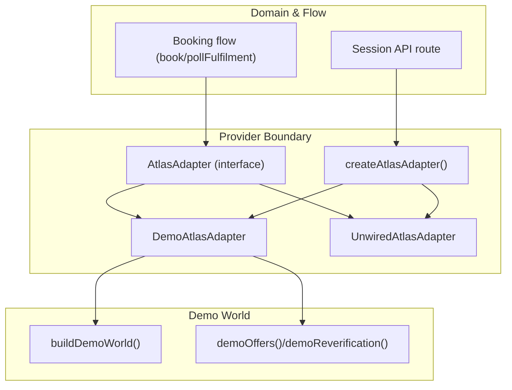
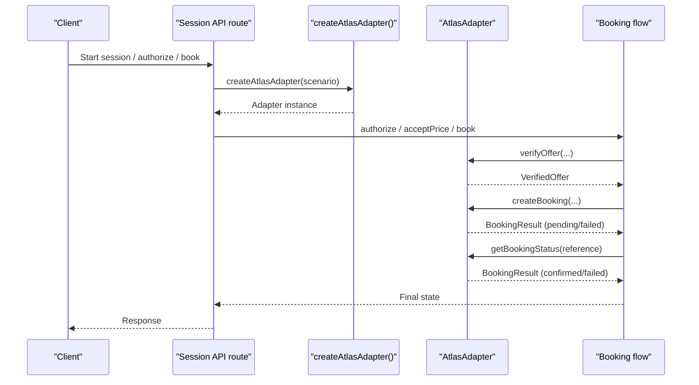
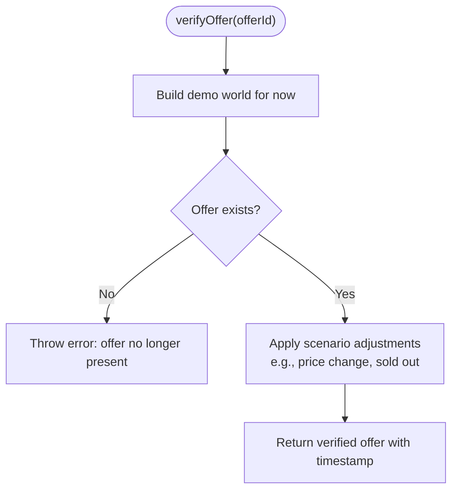
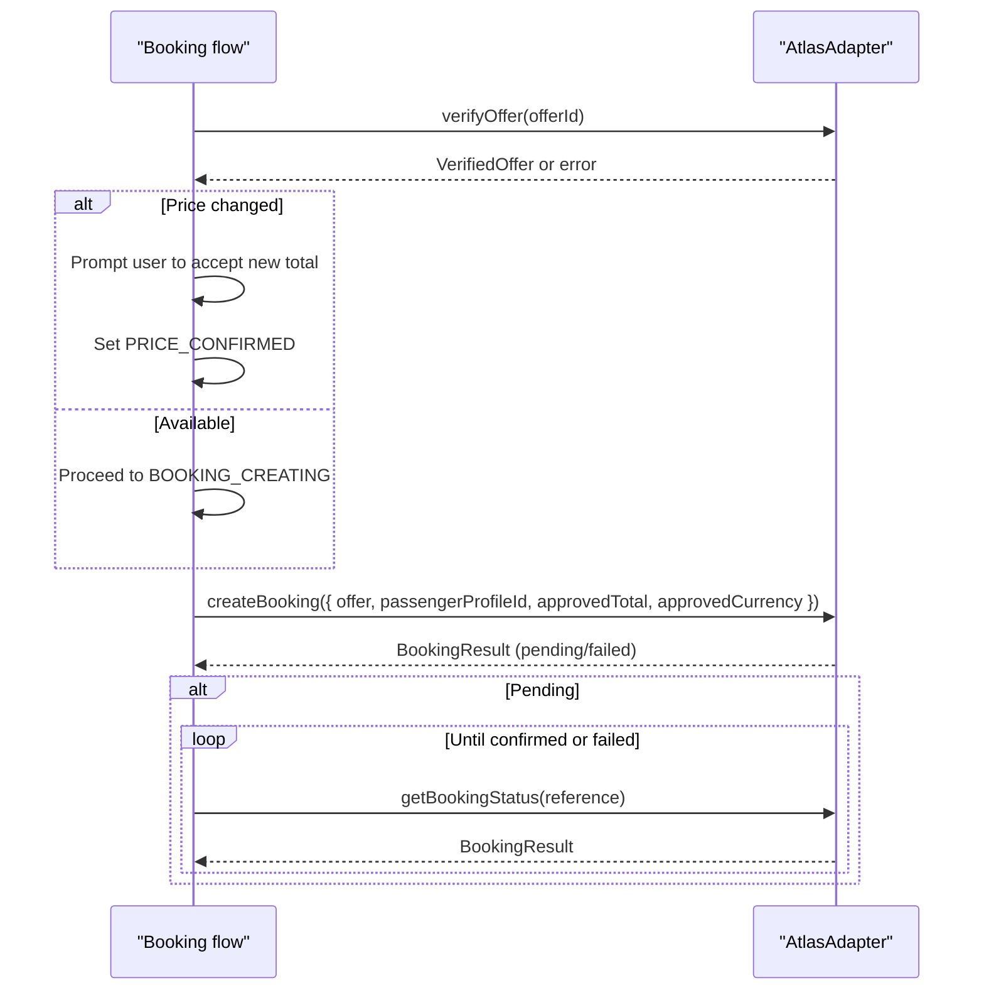
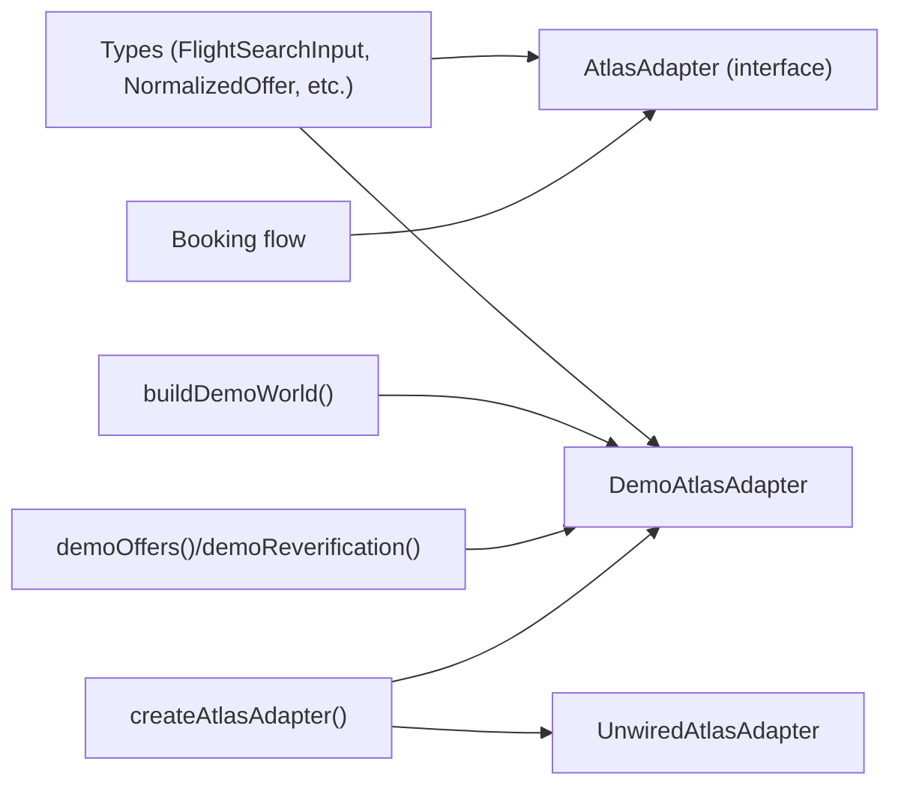

# Provider Integration Layer

<cite>
**Referenced Files in This Document**
- [adapter.ts](file://src/lib/atlas/adapter.ts)
- [index.ts](file://src/lib/atlas/index.ts)
- [demo-adapter.ts](file://src/lib/atlas/demo-adapter.ts)
- [types.ts](file://src/lib/calendair/types.ts)
- [inventory.ts](file://src/lib/calendair/demo/inventory.ts)
- [world.ts](file://src/lib/calendair/demo/world.ts)
- [flow.ts](file://src/lib/calendair/flow.ts)
- [route.ts](file://src/app/api/calendair/session/route.ts)
- [page.tsx](file://src/app/(calendair)/demo/page.tsx)
- [demo.mjs](file://scripts/demo.mjs)
</cite>

## Table of Contents
1. [Introduction](#introduction)
2. [Project Structure](#project-structure)
3. [Core Components](#core-components)
4. [Architecture Overview](#architecture-overview)
5. [Detailed Component Analysis](#detailed-component-analysis)
6. [Dependency Analysis](#dependency-analysis)
7. [Performance Considerations](#performance-considerations)
8. [Troubleshooting Guide](#troubleshooting-guide)
9. [Conclusion](#conclusion)
10. [Appendices](#appendices)

## Introduction
This document explains CALENDAIR’s provider integration layer built on the Atlas adapter pattern. It describes how a single interface abstracts different travel providers, how deterministic demo scenarios are implemented for reliable testing, and what is required to implement a production adapter. It also covers environment-driven mode switching, error handling strategies, fallback behaviors, security considerations, and guidance for integrating with external flight booking services.

## Project Structure
The provider boundary lives under src/lib/atlas and exposes one cohesive interface that hides provider specifics from the rest of the application. The demo world and inventory live under src/lib/calendair/demo and feed the DemoAtlasAdapter with deterministic data. Booking flow logic consumes the adapter through a consistent contract.

**Diagram sources**
- [adapter.ts:23-29](file://src/lib/atlas/adapter.ts#L23-L29)
- [index.ts:18-36](file://src/lib/atlas/index.ts#L18-L36)
- [demo-adapter.ts:28-114](file://src/lib/atlas/demo-adapter.ts#L28-L114)
- [flow.ts:218-256](file://src/lib/calendair/flow.ts#L218-L256)
- [route.ts:24-29](file://src/app/api/calendair/session/route.ts#L24-L29)
- [world.ts:84-168](file://src/lib/calendair/demo/world.ts#L84-L168)
- [inventory.ts:152-195](file://src/lib/calendair/demo/inventory.ts#L152-L195)

**Section sources**
- [adapter.ts:10-29](file://src/lib/atlas/adapter.ts#L10-L29)
- [index.ts:8-36](file://src/lib/atlas/index.ts#L8-L36)
- [demo-adapter.ts:14-114](file://src/lib/atlas/demo-adapter.ts#L14-L114)
- [world.ts:12-168](file://src/lib/calendair/demo/world.ts#L12-L168)
- [inventory.ts:3-195](file://src/lib/calendair/demo/inventory.ts#L3-L195)
- [flow.ts:218-256](file://src/lib/calendair/flow.ts#L218-L256)
- [route.ts:24-29](file://src/app/api/calendair/session/route.ts#L24-L29)

## Core Components
- AtlasAdapter: The unified interface that abstracts all provider operations behind search, verification, booking creation, and status polling.
- DemoAtlasAdapter: Deterministic implementation used for staging and tests; it simulates availability, price changes, sold-out states, and ticketing timelines based on a scenario.
- UnwiredAtlasAdapter: A safe placeholder for live modes that refuses to proceed without a real implementation, preventing accidental substitution of demo data for live calls.
- createAtlasAdapter(): Factory that selects the adapter based on environment variables and caches instances by configuration key.

Key responsibilities:
- Search flights within a detected time window.
- Re-read offers immediately before booking to ensure current pricing and availability.
- Create bookings and poll until the provider confirms fulfilment.
- Surface clear status and labels so UI can always show whether demo or live data is active.

**Section sources**
- [adapter.ts:23-78](file://src/lib/atlas/adapter.ts#L23-L78)
- [index.ts:18-36](file://src/lib/atlas/index.ts#L18-L36)
- [demo-adapter.ts:28-114](file://src/lib/atlas/demo-adapter.ts#L28-L114)

## Architecture Overview
The provider boundary isolates the application from provider-specific details. The domain layer drives a stateful booking flow that uses the adapter only through its interface. Environment variables control which adapter is selected at runtime.

**Diagram sources**
- [route.ts:24-29](file://src/app/api/calendair/session/route.ts#L24-L29)
- [index.ts:18-36](file://src/lib/atlas/index.ts#L18-L36)
- [flow.ts:218-256](file://src/lib/calendair/flow.ts#L218-L256)
- [adapter.ts:23-29](file://src/lib/atlas/adapter.ts#L23-L29)

## Detailed Component Analysis

### AtlasAdapter Interface
The interface defines the complete provider surface:
- getStatus(): Returns account authorization, ticketing capability, environment, adapter identity, and a human-readable label.
- searchFlights(input): Returns normalized offers constrained by origin, dates, passengers, and preferences.
- verifyOffer(offerId): Re-reads an offer to confirm price and availability immediately before booking.
- createBooking(input): Creates a booking using a verified offer and approved totals.
- getBookingStatus(reference): Polls until the provider reports final fulfilment.

Error strategy:
- Live-mode placeholder throws a specific error when invoked without a wired implementation, ensuring failures are explicit rather than silently falling back to demo data.

**Section sources**
- [adapter.ts:23-78](file://src/lib/atlas/adapter.ts#L23-L78)

### DemoAtlasAdapter
Provides deterministic behavior for stage reliability:
- Status always indicates demo inventory and sandbox-like behavior.
- Offers are generated from a fixed blueprint set relative to the detected window, ensuring repeatable results across runs.
- Verification re-reads the current world snapshot to simulate live re-checks and scenario-driven changes (price increases, sold-out).
- Booking creation returns a pending result first; subsequent status polls transition to confirmed after a short simulated delay, except in the pending scenario where it remains open.

**Diagram sources**
- [demo-adapter.ts:60-68](file://src/lib/atlas/demo-adapter.ts#L60-L68)
- [inventory.ts:182-195](file://src/lib/calendair/demo/inventory.ts#L182-L195)

**Section sources**
- [demo-adapter.ts:28-114](file://src/lib/atlas/demo-adapter.ts#L28-L114)
- [inventory.ts:152-195](file://src/lib/calendair/demo/inventory.ts#L152-L195)

### UnwiredAtlasAdapter
A safety guard for live modes:
- Reports not authorized and not ticketing-capable.
- Throws a descriptive error for every operational method if called, making misconfiguration obvious during development or deployment.

This prevents accidental presentation of demo data as live data and forces developers to wire a real adapter before enabling live modes.

**Section sources**
- [adapter.ts:31-78](file://src/lib/atlas/adapter.ts#L31-L78)

### Adapter Factory and Mode Switching
Mode selection is driven by environment variables:
- ATLAS_INTEGRATION_MODE: When unset, defaults to demo. When set to skill or atri p, selects the unwired adapter until a real implementation is provided.
- ATLAS_ENV: Normalized to sandbox, production, or unknown; affects status reporting and environment labeling.
- Scenario parameter: Influences demo inventory behavior (perfect, price-change, sold-out, pending).

Instance caching:
- Adapters are cached per configuration key combining mode, environment, and scenario to preserve booking references across requests.

Startup messaging:
- The demo script prints the selected provider mode before starting the server, reinforcing transparency.

**Section sources**
- [index.ts:18-36](file://src/lib/atlas/index.ts#L18-L36)
- [demo.mjs:11-34](file://scripts/demo.mjs#L11-L34)
- [page.tsx:79-100](file://src/app/(calendair)/demo/page.tsx#L79-L100)

### Booking Flow Integration
The domain flow orchestrates provider interactions:
- Authorize verifies the offer and handles unavailability or price changes, prompting replanning when needed.
- AcceptPrice requires explicit user acceptance when prices change.
- Book creates the booking against the verified offer and approved totals, then transitions to pending unless failed.
- PollFulfilment repeatedly checks provider status until confirmation or failure, then proceeds to calendar updates.

**Diagram sources**
- [flow.ts:192-256](file://src/lib/calendair/flow.ts#L192-L256)
- [adapter.ts:23-29](file://src/lib/atlas/adapter.ts#L23-L29)

**Section sources**
- [flow.ts:192-256](file://src/lib/calendair/flow.ts#L192-L256)

### Data Models and Scenarios
Core types define the contract between the domain and adapters:
- FlightSearchInput: Origin, destination, date window, passengers, cabin, and preference flags.
- NormalizedOffer: Standardized representation of an offer including times, price, currency, bookability, and source.
- VerifiedOffer: Extended offer with verification timestamp.
- BookingInput and BookingResult: Inputs for creating bookings and outcomes returned by providers.

Demo scenarios:
- perfect: Stable inventory and smooth booking.
- price-change: Offer price increases at verification, requiring user acceptance.
- sold-out: Leading offer becomes unavailable, triggering replanning.
- pending: Ticketing remains open for extended duration, exercising polling logic.

**Section sources**
- [types.ts:106-246](file://src/lib/calendair/types.ts#L106-L246)
- [inventory.ts:33-144](file://src/lib/calendair/demo/inventory.ts#L33-L144)
- [inventory.ts:182-195](file://src/lib/calendair/demo/inventory.ts#L182-L195)

## Dependency Analysis
The provider boundary depends on domain types and demo world generation but is independent of UI and routes. The factory centralizes configuration and lifecycle management.

**Diagram sources**
- [types.ts:106-246](file://src/lib/calendair/types.ts#L106-L246)
- [world.ts:84-168](file://src/lib/calendair/demo/world.ts#L84-L168)
- [inventory.ts:152-195](file://src/lib/calendair/demo/inventory.ts#L152-L195)
- [adapter.ts:23-78](file://src/lib/atlas/adapter.ts#L23-L78)
- [index.ts:18-36](file://src/lib/atlas/index.ts#L18-L36)
- [flow.ts:218-256](file://src/lib/calendair/flow.ts#L218-L256)

**Section sources**
- [index.ts:18-36](file://src/lib/atlas/index.ts#L18-L36)
- [flow.ts:218-256](file://src/lib/calendair/flow.ts#L218-L256)

## Performance Considerations
- Adapter caching: The factory caches adapters per configuration key to avoid recreating clients and to preserve booking references across requests.
- Reverification: Offers are re-read immediately before booking to minimize stale data and reduce race conditions.
- Polling cadence: Implementations should use reasonable polling intervals and timeouts to balance responsiveness with provider load.
- Deterministic demo: The demo adapter avoids network calls and randomization, ensuring fast and predictable test execution.

[No sources needed since this section provides general guidance]

## Troubleshooting Guide
Common issues and resolutions:
- Live mode without implementation: If ATLAS_INTEGRATION_MODE is set to skill or atri p without wiring a real adapter, calls will throw a specific error indicating the missing implementation. Fix by implementing the adapter or reverting to demo mode.
- Unexpected demo data in live mode: Ensure ATLAS_INTEGRATION_MODE is explicitly set and validated at startup; the demo script prints the selected provider mode to prevent confusion.
- Booking never confirming: Verify provider status polling and handle pending states correctly; the demo adapter simulates delays to exercise this path.
- Price change not accepted: The flow requires explicit acceptance before proceeding; ensure the UI prompts and records approval.

Operational visibility:
- The demo page displays adapter identity, environment, authorization status, and credentials presence to aid debugging.

**Section sources**
- [adapter.ts:31-78](file://src/lib/atlas/adapter.ts#L31-L78)
- [demo.mjs:11-34](file://scripts/demo.mjs#L11-L34)
- [page.tsx:79-100](file://src/app/(calendair)/demo/page.tsx#L79-L100)

## Conclusion
CALENDAIR’s provider integration layer uses a clean adapter pattern to abstract travel providers behind a stable interface. The demo adapter enables reliable staging and testing with deterministic scenarios, while the unwired adapter ensures live configurations fail loudly until properly implemented. The booking flow enforces strong safety properties, including reverification and explicit user acceptance for price changes. For production, implement the adapter according to the installed Skill or official interface, manage authentication securely, and follow the established error and state-handling patterns.

[No sources needed since this section summarizes without analyzing specific files]

## Appendices

### Implementing a Custom Adapter
Steps to integrate with an external flight booking service:
- Implement AtlasAdapter methods:
  - getStatus(): Report authorization, ticketing capability, environment, adapter identity, and a clear label.
  - searchFlights(): Map provider search inputs to your service’s query and return normalized offers.
  - verifyOffer(): Re-read the offer to confirm price and availability; include verification timestamp.
  - createBooking(): Create a booking using the verified offer and approved totals; return a reference and initial state.
  - getBookingStatus(): Poll provider status until confirmed or failed; include ticketing details when available.
- Handle errors consistently:
  - Distinguish transient errors (retry with backoff) from permanent failures (sold-out, invalid offer).
  - Preserve provider error messages in rawStatusLabel for diagnostics.
- Authentication and security:
  - Store secrets server-side only; never expose tokens or credentials in responses.
  - Use secure transport and rotate credentials regularly.
  - Validate and sanitize all inputs; do not trust client-supplied values for budgets or constraints.
- Testing:
  - Add unit tests covering search normalization, verification, booking creation, and status polling.
  - Simulate edge cases like price changes, sold-out offers, and long-pending ticketing.

**Section sources**
- [adapter.ts:23-29](file://src/lib/atlas/adapter.ts#L23-L29)
- [types.ts:106-246](file://src/lib/calendair/types.ts#L106-L246)
- [flow.ts:218-256](file://src/lib/calendair/flow.ts#L218-L256)

### Security Considerations for Provider Integrations
- Secrets management: Keep API keys, tokens, and endpoints in server-only environment variables; never ship them to the client.
- Least privilege: Scope provider credentials to the minimum required permissions.
- Input validation: Enforce strict schemas for all inputs; rebuild domain rules server-side regardless of client-provided values.
- Auditability: Log provider interactions with sensitive fields masked; capture enough context to diagnose issues without exposing secrets.
- Error exposure: Return generic user-facing messages; log detailed errors server-side.

[No sources needed since this section provides general guidance]