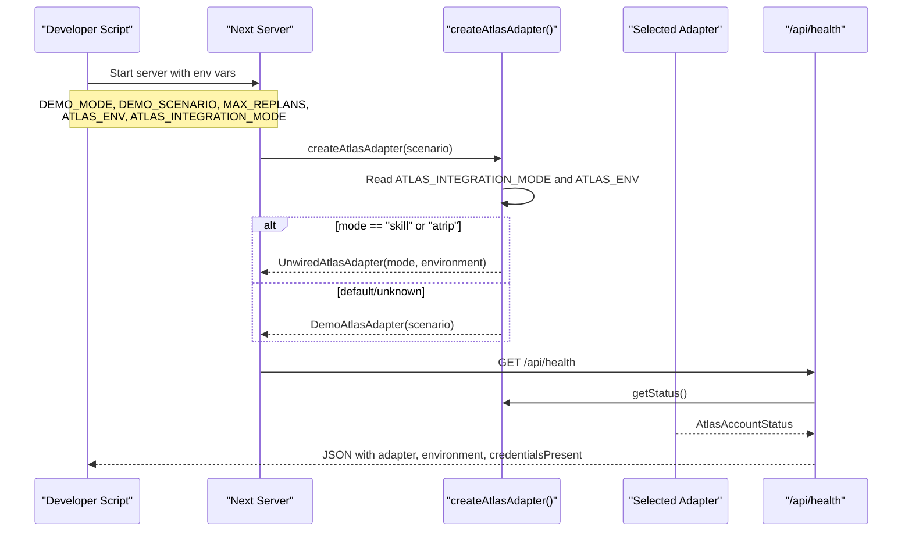
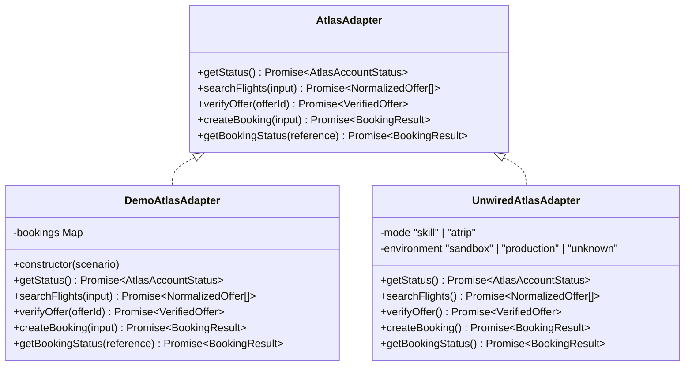
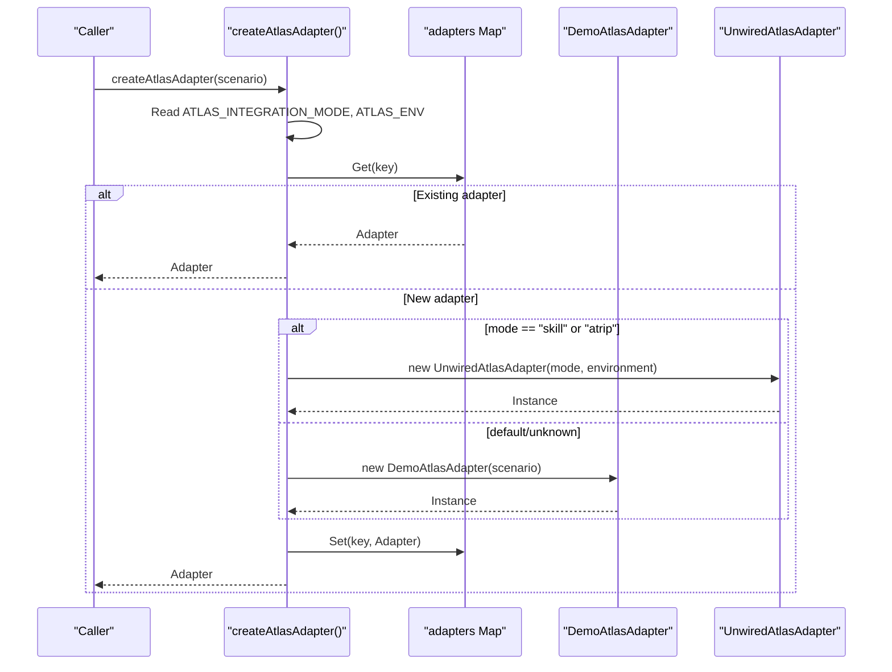
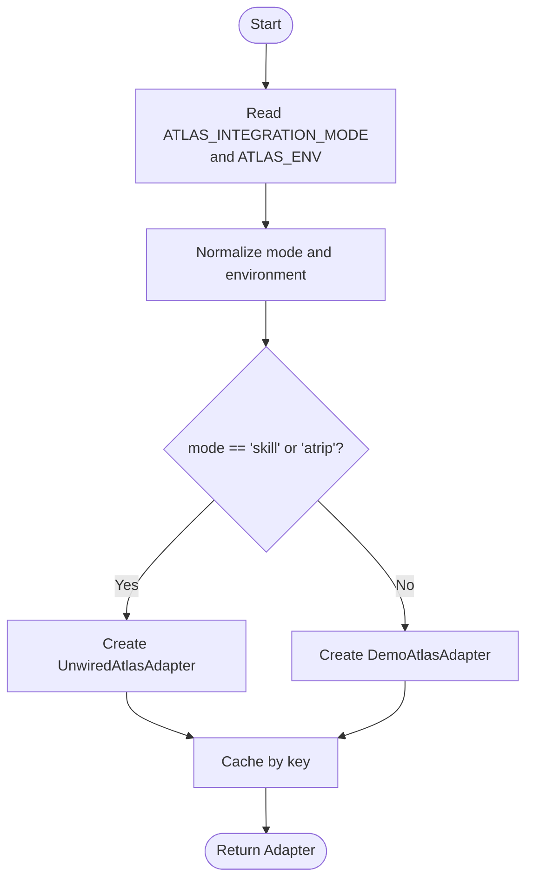
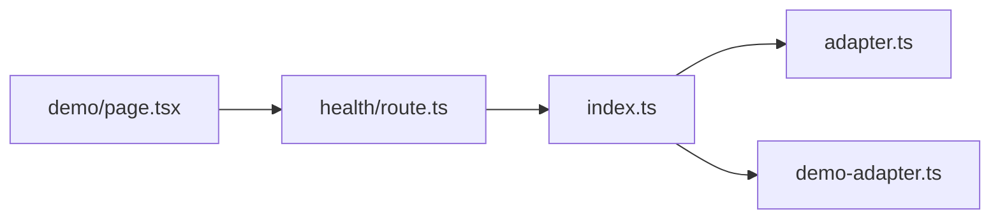

# Provider Mode Switching

<cite>
**Referenced Files in This Document**
- [src/lib/atlas/index.ts](file://src/lib/atlas/index.ts)
- [src/lib/atlas/adapter.ts](file://src/lib/atlas/adapter.ts)
- [src/lib/atlas/demo-adapter.ts](file://src/lib/atlas/demo-adapter.ts)
- [src/lib/calendair/types.ts](file://src/lib/calendair/types.ts)
- [src/app/api/health/route.ts](file://src/app/api/health/route.ts)
- [scripts/demo.mjs](file://scripts/demo.mjs)
- [src/app/(calendair)/demo/page.tsx](file://src/app/(calendair)/demo/page.tsx)
</cite>

## Table of Contents
1. Introduction
2. Project Structure
3. Core Components
4. Architecture Overview
5. Detailed Component Analysis
6. Dependency Analysis
7. Performance Considerations
8. Troubleshooting Guide
9. Conclusion

## Introduction
This document explains how CALENDAIR switches between provider modes to operate safely across environments (demo vs live). It covers:
- How the system chooses an adapter based on environment variables and configuration
- The role of the UnwiredAtlasAdapter in preventing accidental production calls without a real implementation
- Security considerations, validation checks, and error prevention mechanisms
- Configuration examples for development, staging, and production
- Troubleshooting common issues with provider configuration and adapter initialization

## Project Structure
The provider mode switching mechanism is centered around the Atlas adapter layer under src/lib/atlas. A factory function selects an adapter at runtime based on environment variables and caches it per configuration. The health endpoint exposes current configuration status without leaking secrets.

```mermaid
graph TB
Client["Client Code"] --> Factory["createAtlasAdapter()"]
Factory --> |mode = "skill" or "atrip"| Unwired["UnwiredAtlasAdapter"]
Factory --> |default or unknown| Demo["DemoAtlasAdapter"]
Health["/api/health"] --> Factory
UI["/demo page"] --> Health
```

**Diagram sources**
- [src/lib/atlas/index.ts:18-36](file://src/lib/atlas/index.ts#L18-L36)
- [src/lib/atlas/adapter.ts:50-78](file://src/lib/atlas/adapter.ts#L50-L78)
- [src/lib/atlas/demo-adapter.ts:28-41](file://src/lib/atlas/demo-adapter.ts#L28-L41)
- [src/app/api/health/route.ts:10-26](file://src/app/api/health/route.ts#L10-L26)

**Section sources**
- [src/lib/atlas/index.ts:1-37](file://src/lib/atlas/index.ts#L1-L37)
- [src/app/api/health/route.ts:1-39](file://src/app/api/health/route.ts#L1-L39)

## Core Components
- Adapter interface: Defines the contract for all providers (search, verify, book, status).
- Demo adapter: Deterministic, test-mode inventory used for stage reliability.
- Unwired adapter: Live-mode placeholder that refuses to call anything until a real implementation is wired.
- Factory: Chooses adapter based on environment variables and caches instances.
- Health endpoint: Reports active adapter and credentials presence without exposing secrets.

Key responsibilities:
- Enforce explicit mode selection via ATLAS_INTEGRATION_MODE
- Prevent silent fallback from live to demo data
- Surface adapter identity and environment in UI and health endpoints

**Section sources**
- [src/lib/atlas/adapter.ts:23-78](file://src/lib/atlas/adapter.ts#L23-L78)
- [src/lib/atlas/demo-adapter.ts:14-41](file://src/lib/atlas/demo-adapter.ts#L14-L41)
- [src/lib/atlas/index.ts:8-36](file://src/lib/atlas/index.ts#L8-L36)
- [src/app/api/health/route.ts:4-26](file://src/app/api/health/route.ts#L4-L26)

## Architecture Overview
The provider mode switch is driven by environment variables and enforced through a strict adapter selection policy.



**Diagram sources**
- [scripts/demo.mjs:11-23](file://scripts/demo.mjs#L11-L23)
- [src/lib/atlas/index.ts:18-36](file://src/lib/atlas/index.ts#L18-L36)
- [src/app/api/health/route.ts:10-26](file://src/app/api/health/route.ts#L10-L26)

## Detailed Component Analysis

### Adapter Selection Logic
- Reads ATLAS_INTEGRATION_MODE (trimmed, lowercased) and ATLAS_ENV (normalized to sandbox, production, or unknown).
- Caches adapters by key: mode|environment|scenario to ensure consistent behavior across requests.
- If mode is "skill" or "atrip", returns UnwiredAtlasAdapter; otherwise returns DemoAtlasAdapter.

Security implications:
- No implicit fallback to demo when live mode is configured.
- Explicit mode required to attempt live operations; otherwise deterministic demo data is used.

**Section sources**
- [src/lib/atlas/index.ts:18-36](file://src/lib/atlas/index.ts#L18-L36)

### UnwiredAtlasAdapter
- Purpose: Prevent accidental production calls without proper implementation.
- Behavior:
  - getStatus() reports not authorized and identifies adapter mode and environment.
  - All operational methods throw a specific error indicating the adapter is not wired.
- Error type: AtlasNotWiredError includes operation name and mode for clear diagnostics.

Why this matters:
- Avoids silent misrepresentation of demo data as live bookings.
- Forces developers to implement real integration before enabling live mode.

**Section sources**
- [src/lib/atlas/adapter.ts:31-78](file://src/lib/atlas/adapter.ts#L31-L78)

### DemoAtlasAdapter
- Purpose: Deterministic, reliable demo inventory for staging and rehearsal.
- Behavior:
  - getStatus() labels itself as demo and indicates ticketing availability in test mode.
  - searchFlights(), verifyOffer(), createBooking(), getBookingStatus() simulate realistic flows with testMode flags.
- Scenario support: Uses scenario-driven world and offers to simulate price changes, sold-out states, and pending confirmations.

Safety guarantees:
- Never claims to be live Atlas data.
- Booking references are tracked within the adapter instance to support multi-step flows.

**Section sources**
- [src/lib/atlas/demo-adapter.ts:14-115](file://src/lib/atlas/demo-adapter.ts#L14-L115)

### Health Endpoint and UI Visibility
- /api/health returns:
  - Active adapter identity and label
  - Environment classification
  - Credentials presence check without exposing values
  - Integration mode string
- /demo page displays provider details and warns when running on demo inventory.

Operational value:
- Enables quick verification of which adapter is active and whether credentials are present.
- Surfaces configuration state to operators and presenters.

**Section sources**
- [src/app/api/health/route.ts:10-26](file://src/app/api/health/route.ts#L10-L26)
- [src/app/(calendair)/demo/page.tsx:79-100](file://src/app/(calendair)/demo/page.tsx#L79-L100)

### Class Diagram: Adapter Hierarchy


**Diagram sources**
- [src/lib/atlas/adapter.ts:23-78](file://src/lib/atlas/adapter.ts#L23-L78)
- [src/lib/atlas/demo-adapter.ts:28-115](file://src/lib/atlas/demo-adapter.ts#L28-L115)

### Sequence Diagram: Adapter Initialization Flow


**Diagram sources**
- [src/lib/atlas/index.ts:16-36](file://src/lib/atlas/index.ts#L16-L36)

### Flowchart: Mode Decision Algorithm


**Diagram sources**
- [src/lib/atlas/index.ts:18-36](file://src/lib/atlas/index.ts#L18-L36)

## Dependency Analysis
- The factory depends on environment variables and the two adapter implementations.
- The health endpoint depends on the factory to report current adapter status and credential presence.
- The demo page consumes health information to display provider details and warnings.



**Diagram sources**
- [src/lib/atlas/index.ts:1-37](file://src/lib/atlas/index.ts#L1-L37)
- [src/app/api/health/route.ts:1-26](file://src/app/api/health/route.ts#L1-L26)
- [src/app/(calendair)/demo/page.tsx:79-100](file://src/app/(calendair)/demo/page.tsx#L79-L100)

**Section sources**
- [src/lib/atlas/index.ts:1-37](file://src/lib/atlas/index.ts#L1-L37)
- [src/app/api/health/route.ts:1-39](file://src/app/api/health/route.ts#L1-L39)
- [src/app/(calendair)/demo/page.tsx:79-100](file://src/app/(calendair)/demo/page.tsx#L79-L100)

## Performance Considerations
- Adapter caching: The factory maintains a Map keyed by mode|environment|scenario to avoid recreating adapters per request. This ensures long-lived provider clients and stable demo booking state across calls.
- Minimal overhead: Environment reads are lightweight; adapter instantiation occurs once per unique configuration.
- Memory footprint: Keep scenarios limited to necessary combinations to avoid unnecessary adapter instances.

[No sources needed since this section provides general guidance]

## Troubleshooting Guide

Common issues and resolutions:
- Unexpected demo inventory in live mode:
  - Ensure ATLAS_INTEGRATION_MODE is set to "skill" or "atrip".
  - Verify ATLAS_ENV is correctly set to "production" or "sandbox".
  - Confirm credentials are present; health endpoint shows credentialsPresent.
- Calls failing with “adapter not wired”:
  - Indicates UnwiredAtlasAdapter is active because no real implementation exists for the selected mode.
  - Implement the corresponding adapter against the installed Skill or ATRIP interface.
- UI shows demo badge but you expected live:
  - Check health endpoint’s adapter and label fields.
  - Review startup logs printed by the demo script to confirm provider selection.
- Scenario mismatch in demo:
  - Adjust DEMO_SCENARIO to match intended behavior (e.g., perfect, price-change, sold-out, pending).
- Credentials not detected:
  - For live mode, ensure ATLAS_API_KEY or both ATLAS_CLIENT_ID and ATLAS_CLIENT_SECRET are set.

Diagnostic steps:
- Run the health endpoint and inspect:
  - adapter, label, environment, authorized, ticketingAvailable
  - integrationMode, credentialsPresent
- Use the /demo page to view provider details and warnings.
- Inspect console output from scripts/demo.mjs to see provider selection and warnings.

**Section sources**
- [src/app/api/health/route.ts:10-26](file://src/app/api/health/route.ts#L10-L26)
- [src/app/(calendair)/demo/page.tsx:79-100](file://src/app/(calendair)/demo/page.tsx#L79-L100)
- [scripts/demo.mjs:11-23](file://scripts/demo.mjs#L11-L23)

## Configuration Examples

Development (local rehearsal):
- ATLAS_INTEGRATION_MODE: unset or empty (defaults to demo)
- ATLAS_ENV: sandbox
- DEMO_MODE: hybrid
- DEMO_SCENARIO: perfect
- Result: Deterministic demo inventory; safe for local testing and rehearsals.

Staging (pre-production validation):
- ATLAS_INTEGRATION_MODE: skill or atrip
- ATLAS_ENV: sandbox
- DEMO_MODE: hybrid
- DEMO_SCENARIO: pending or price-change
- Result: Live-mode placeholder active; any operational call throws a clear error unless a real adapter is implemented.

Production (live operations):
- ATLAS_INTEGRATION_MODE: skill or atrip
- ATLAS_ENV: production
- DEMO_MODE: live
- Ensure credentials are present (ATLAS_API_KEY or client id/secret)
- Result: Real adapter must be implemented; otherwise calls fail loudly with explicit errors.

Notes:
- The app never quietly downgrades a live configuration to demo data when a call fails.
- The demo script prints provider selection and warnings before starting the server.

**Section sources**
- [src/lib/atlas/index.ts:18-36](file://src/lib/atlas/index.ts#L18-L36)
- [scripts/demo.mjs:11-23](file://scripts/demo.mjs#L11-L23)
- [src/app/api/health/route.ts:17-26](file://src/app/api/health/route.ts#L17-L26)

## Security Considerations
- Explicit mode requirement: Live operations require ATLAS_INTEGRATION_MODE to be explicitly set to "skill" or "atrip". Without it, demo inventory is used.
- No silent fallback: The system does not substitute demo data for live calls; failures are explicit and informative.
- Credential visibility: Health endpoint reports whether credentials are present without exposing values.
- Label transparency: Adapter identity and label are surfaced in UI and health responses to prevent misrepresentation of data source.
- Test mode markers: Demo results include testMode flags to distinguish them from production outcomes.

**Section sources**
- [src/lib/atlas/adapter.ts:31-78](file://src/lib/atlas/adapter.ts#L31-L78)
- [src/lib/atlas/demo-adapter.ts:33-41](file://src/lib/atlas/demo-adapter.ts#L33-L41)
- [src/app/api/health/route.ts:10-26](file://src/app/api/health/route.ts#L10-L26)

## Conclusion
CALENDAIR’s provider mode switching enforces a strict separation between demo and live environments. The factory selects adapters based on environment variables, caches them for consistency, and surfaces configuration state transparently. The UnwiredAtlasAdapter prevents accidental production calls without proper implementation, ensuring safety and clarity. Operators can confidently configure development, staging, and production environments using documented variables and validate behavior via health endpoints and UI indicators.