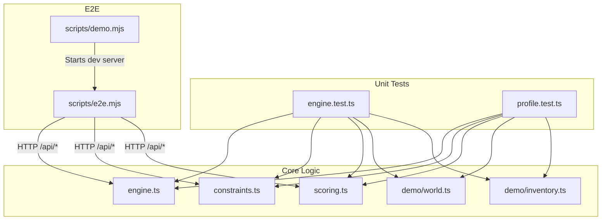
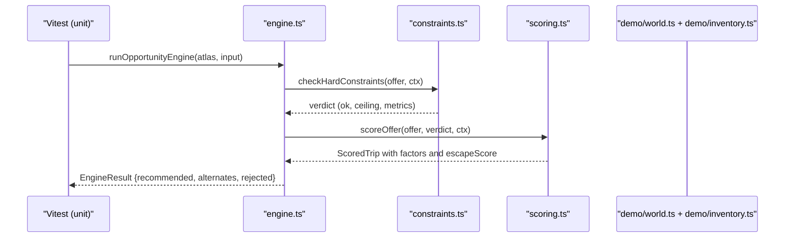
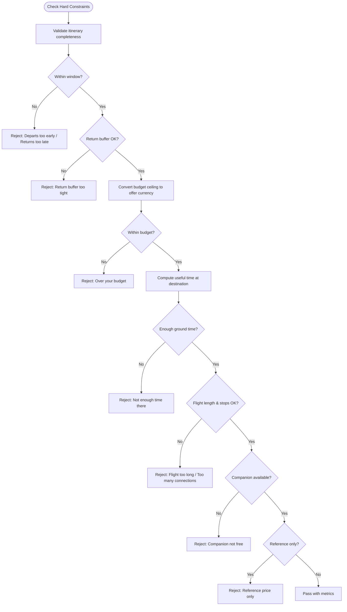
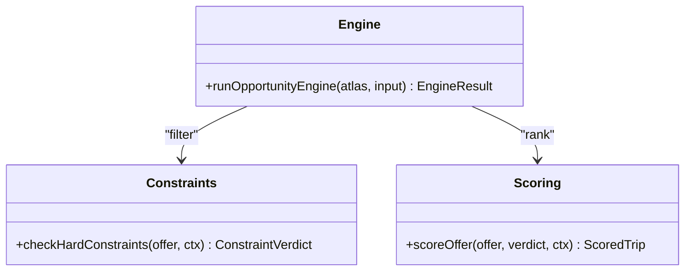
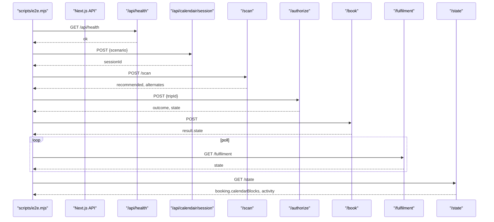
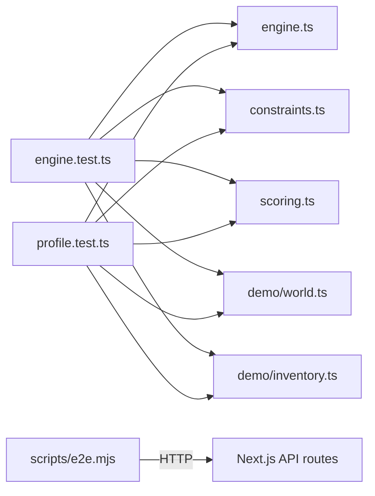

# Testing Strategy

<cite>
**Referenced Files in This Document**
- [vitest.config.ts](file://vitest.config.ts)
- [package.json](file://package.json)
- [scripts/e2e.mjs](file://scripts/e2e.mjs)
- [scripts/demo.mjs](file://scripts/demo.mjs)
- [src/lib/calendair/engine.test.ts](file://src/lib/calendair/engine.test.ts)
- [src/lib/calendair/profile.test.ts](file://src/lib/calendair/profile.test.ts)
- [src/lib/calendair/engine.ts](file://src/lib/calendair/engine.ts)
- [src/lib/calendair/constraints.ts](file://src/lib/calendair/constraints.ts)
- [src/lib/calendair/scoring.ts](file://src/lib/calendair/scoring.ts)
- [src/lib/calendair/demo/world.ts](file://src/lib/calendair/demo/world.ts)
- [src/lib/calendair/demo/inventory.ts](file://src/lib/calendair/demo/inventory.ts)
</cite>

## Table of Contents
1. Introduction
2. Project Structure
3. Core Components
4. Architecture Overview
5. Detailed Component Analysis
6. Dependency Analysis
7. Performance Considerations
8. Troubleshooting Guide
9. Conclusion
10. Appendices

## Introduction
This document explains CALENDAIR’s testing strategy and implementation. It covers unit testing with Vitest for business logic validation (constraint satisfaction and scoring), the end-to-end framework that drives the full agent loop over real HTTP APIs, and the demo scenarios used to exercise safety properties. It also provides guidance for writing effective tests, mocking external dependencies, validating safety properties, managing test data and scenario configuration, and setting up continuous integration.

## Project Structure
Testing is organized around two layers:
- Unit tests under src/lib/calendair/*.test.ts validate deterministic core logic using a demo world and demo inventory.
- End-to-end tests in scripts/e2e.mjs drive the complete Next.js server session flow via HTTP routes, asserting safety properties across scenarios.

**Diagram sources**
- [src/lib/calendair/engine.test.ts:1-254](file://src/lib/calendair/engine.test.ts#L1-L254)
- [src/lib/calendair/profile.test.ts:1-413](file://src/lib/calendair/profile.test.ts#L1-L413)
- [src/lib/calendair/engine.ts:1-206](file://src/lib/calendair/engine.ts#L1-L206)
- [src/lib/calendair/constraints.ts:1-162](file://src/lib/calendair/constraints.ts#L1-L162)
- [src/lib/calendair/scoring.ts:1-283](file://src/lib/calendair/scoring.ts#L1-L283)
- [src/lib/calendair/demo/world.ts:1-170](file://src/lib/calendair/demo/world.ts#L1-L170)
- [src/lib/calendair/demo/inventory.ts:1-196](file://src/lib/calendair/demo/inventory.ts#L1-L196)
- [scripts/e2e.mjs:1-194](file://scripts/e2e.mjs#L1-L194)
- [scripts/demo.mjs:1-43](file://scripts/demo.mjs#L1-L43)

**Section sources**
- [vitest.config.ts:1-15](file://vitest.config.ts#L1-L15)
- [package.json:1-39](file://package.json#L1-L39)

## Core Components
- Vitest configuration sets Node environment, includes src/**/*.test.ts, and aliases @ to src for consistent imports.
- Package scripts expose test, test:watch, and test:e2e; validate runs typecheck, lint, and test together.
- Demo script starts the dev server with deterministic modes and prints provider mode so live Atlas data cannot be accidentally presented as demo inventory.

Key responsibilities:
- Unit tests assert hard constraints, scoring composition, profile sanitization, and adapter lifetime behavior.
- E2E script orchestrates sessions through HTTP endpoints, waits for health, and asserts safety properties across perfect, price-change, sold-out, and pending scenarios.

**Section sources**
- [vitest.config.ts:1-15](file://vitest.config.ts#L1-L15)
- [package.json:1-39](file://package.json#L1-L39)
- [scripts/demo.mjs:1-43](file://scripts/demo.mjs#L1-L43)

## Architecture Overview
The testing architecture separates deterministic unit tests from an HTTP-driven e2e runner. Unit tests use a demo world and demo inventory to validate constraint checks and scoring without network calls. The e2e runner starts or connects to a running Next.js server and exercises the same flows the UI uses, asserting state transitions and safety guarantees.

**Diagram sources**
- [src/lib/calendair/engine.ts:88-202](file://src/lib/calendair/engine.ts#L88-L202)
- [src/lib/calendair/constraints.ts:42-162](file://src/lib/calendair/constraints.ts#L42-L162)
- [src/lib/calendair/scoring.ts:56-227](file://src/lib/calendair/scoring.ts#L56-L227)
- [src/lib/calendair/demo/world.ts:84-169](file://src/lib/calendair/demo/world.ts#L84-L169)
- [src/lib/calendair/demo/inventory.ts:152-196](file://src/lib/calendair/demo/inventory.ts#L152-L196)

## Detailed Component Analysis

### Unit Testing Approach with Vitest
- Configuration: Node environment, include pattern for *.test.ts, path alias @ pointing to src.
- Test organization:
  - engine.test.ts validates calendar opening, companion overlap, useful-hours arithmetic, hard constraints, recommendation shape and selection, stale fare handling, false-success guard, bounded replanning, adapter lifetime, and constraint helper detail messages.
  - profile.test.ts validates sanitization boundaries, currency conversion, interest-based affinity scoring, spontaneity effects, budget-as-hard-rule enforcement, and privacy of profiles.

Best practices demonstrated:
- Deterministic inputs via buildDemoWorld and demoOffers.
- Assertions on named rejections and factor sums to ensure transparency and correctness.
- Safety assertions such as no secret leakage and reference-only fares never reaching booking.

**Section sources**
- [vitest.config.ts:1-15](file://vitest.config.ts#L1-L15)
- [src/lib/calendair/engine.test.ts:1-254](file://src/lib/calendair/engine.test.ts#L1-L254)
- [src/lib/calendair/profile.test.ts:1-413](file://src/lib/calendair/profile.test.ts#L1-L413)

### Constraint Satisfaction Validation
- Hard constraints are pure functions returning named rejections and computed metrics (useful minutes, nights, days, return buffer, converted ceiling).
- Tests verify each rule triggers correctly (budget, time on ground, connections, window bounds, companion availability, reference-only exclusion) and that the first failing rule is reported.

**Diagram sources**
- [src/lib/calendair/constraints.ts:42-162](file://src/lib/calendair/constraints.ts#L42-L162)

**Section sources**
- [src/lib/calendair/constraints.ts:1-162](file://src/lib/calendair/constraints.ts#L1-L162)
- [src/lib/calendair/engine.test.ts:69-112](file://src/lib/calendair/engine.test.ts#L69-L112)
- [src/lib/calendair/engine.test.ts:240-253](file://src/lib/calendair/engine.test.ts#L240-L253)

### Scoring Algorithms Validation
- The Escape Score is composed of nine weighted factors that provably sum to the final score.
- Tests assert:
  - Hero recommendation exists and alternates are limited.
  - Destination preference and non-stop preference are respected within budget.
  - Factors add up to the rounded escape score.
  - Interest tags influence affinity scores deterministically.
  - Spontaneity affects unfamiliar destinations but cannot bypass hard constraints.

**Diagram sources**
- [src/lib/calendair/engine.ts:88-202](file://src/lib/calendair/engine.ts#L88-L202)
- [src/lib/calendair/constraints.ts:42-162](file://src/lib/calendair/constraints.ts#L42-L162)
- [src/lib/calendair/scoring.ts:56-227](file://src/lib/calendair/scoring.ts#L56-L227)

**Section sources**
- [src/lib/calendair/scoring.ts:1-283](file://src/lib/calendair/scoring.ts#L1-L283)
- [src/lib/calendair/engine.test.ts:114-139](file://src/lib/calendair/engine.test.ts#L114-L139)
- [src/lib/calendair/profile.test.ts:212-262](file://src/lib/calendair/profile.test.ts#L212-L262)

### End-to-End Testing Framework
- The e2e script:
  - Starts a dev server unless BASE_URL is provided.
  - Waits for /api/health readiness.
  - Drives sessions via /api/calendair/session and /scan, then authorizes, books, polls fulfilment, and reads final state.
  - Asserts safety properties: price-change stop, sold-out replan, pending state honesty, no secrets in activity logs, and calendar blocks written only after confirmation.

**Diagram sources**
- [scripts/e2e.mjs:36-168](file://scripts/e2e.mjs#L36-L168)

**Section sources**
- [scripts/e2e.mjs:1-194](file://scripts/e2e.mjs#L1-L194)

### Demo Scenarios Used for Testing
- Perfect: Validates clean path — window detection, shared availability, hero recommendation, bounded alternates, rejection reasons, budget adherence, score summation, authorization reverification, pending booking, fulfilled completion, and safe calendar write.
- Price-change: Ensures price differences stop the flow until explicit acceptance; approved total matches current price; booking proceeds post-acceptance.
- Sold-out: Reverification detects unavailability, proposes replacement, counts replans, and requires traveller acceptance before confirming.
- Pending: Confirms that unconfirmed bookings remain pending, labels reflect reality, and no calendar is written prematurely.

These scenarios are driven by deterministic demo world and inventory adjustments.

**Section sources**
- [scripts/e2e.mjs:56-168](file://scripts/e2e.mjs#L56-L168)
- [src/lib/calendair/demo/world.ts:84-169](file://src/lib/calendair/demo/world.ts#L84-L169)
- [src/lib/calendair/demo/inventory.ts:146-196](file://src/lib/calendair/demo/inventory.ts#L146-L196)

### Writing Effective Tests for New Features
Guidelines derived from existing tests:
- Use deterministic inputs: buildDemoWorld and demoOffers to construct reproducible windows and inventories.
- Assert named outcomes: prefer checking specific rules and states rather than generic booleans.
- Verify safety properties:
  - No secrets leak into serialized worlds or activity logs.
  - Reference-only offers never reach booking.
  - Pending states remain honest and do not produce premature calendar writes.
- Validate scoring integrity: ensure factors sum to the final score and stay within bounds.
- Mock external dependencies:
  - Use DemoAtlasAdapter for deterministic search, verification, and booking behavior.
  - For new adapters, keep a demo variant to isolate unit tests from network calls.

**Section sources**
- [src/lib/calendair/engine.test.ts:1-254](file://src/lib/calendair/engine.test.ts#L1-L254)
- [src/lib/calendair/profile.test.ts:1-413](file://src/lib/calendair/profile.test.ts#L1-L413)

### Test Data Management and Scenario Configuration
- Demo world:
  - Generates a fixed Friday-to-Monday window relative to “now,” ensuring repeatable openings.
  - Supports companion conflicts and custom profiles while preserving deterministic timing.
- Demo inventory:
  - Defines bookable and must-reject itineraries with offsets from window start.
  - Adjusts prices or bookability per scenario during verification.
- Environment variables:
  - DEMO_MODE, DEMO_SCENARIO, MAX_REPLANS, ATLAS_ENV control demo behavior and provider mode.
  - E2E_PORT and BASE_URL configure the e2e runner’s target server.

**Section sources**
- [src/lib/calendair/demo/world.ts:1-170](file://src/lib/calendair/demo/world.ts#L1-L170)
- [src/lib/calendair/demo/inventory.ts:1-196](file://src/lib/calendair/demo/inventory.ts#L1-L196)
- [scripts/demo.mjs:1-43](file://scripts/demo.mjs#L1-L43)
- [scripts/e2e.mjs:15-17](file://scripts/e2e.mjs#L15-L17)

### Continuous Integration Setup
Recommended CI steps based on repository scripts:
- Install dependencies.
- Run typecheck and lint to catch issues early.
- Execute unit tests with Vitest.
- Optionally run e2e against a built/dev server if integration coverage is desired.

Suggested commands:
- npm run validate (runs typecheck, lint, and unit tests)
- npm run test (runs Vitest)
- npm run test:e2e (runs e2e suite)

**Section sources**
- [package.json:5-16](file://package.json#L5-L16)

## Dependency Analysis
Unit tests depend on:
- engine.ts for opportunity engine orchestration.
- constraints.ts for hard constraint evaluation.
- scoring.ts for Escape Score computation.
- demo/world.ts and demo/inventory.ts for deterministic inputs.

E2E depends on:
- Running Next.js server exposing /api routes.
- Health endpoint for readiness.
- Session lifecycle endpoints for scanning, authorizing, booking, fulfilling, and reading state.

**Diagram sources**
- [src/lib/calendair/engine.test.ts:1-254](file://src/lib/calendair/engine.test.ts#L1-L254)
- [src/lib/calendair/profile.test.ts:1-413](file://src/lib/calendair/profile.test.ts#L1-L413)
- [scripts/e2e.mjs:1-194](file://scripts/e2e.mjs#L1-L194)

**Section sources**
- [src/lib/calendair/engine.ts:1-206](file://src/lib/calendair/engine.ts#L1-L206)
- [src/lib/calendair/constraints.ts:1-162](file://src/lib/calendair/constraints.ts#L1-L162)
- [src/lib/calendair/scoring.ts:1-283](file://src/lib/calendair/scoring.ts#L1-L283)
- [src/lib/calendair/demo/world.ts:1-170](file://src/lib/calendair/demo/world.ts#L1-L170)
- [src/lib/calendair/demo/inventory.ts:1-196](file://src/lib/calendair/demo/inventory.ts#L1-L196)
- [scripts/e2e.mjs:1-194](file://scripts/e2e.mjs#L1-L194)

## Performance Considerations
- Unit tests are fast and deterministic, relying on in-memory demo data.
- E2E tests include polling loops with short sleeps; tune timeouts and sleep intervals based on CI performance characteristics.
- Avoid unnecessary network calls in unit tests; keep them isolated behind adapters.

[No sources needed since this section provides general guidance]

## Troubleshooting Guide
Common issues and remedies:
- Dev server not ready: Ensure /api/health returns ok before proceeding; the e2e script already polls with a timeout.
- Unexpected scenario behavior: Check DEMO_MODE and DEMO_SCENARIO environment variables; confirm inventory adjustments apply as expected.
- Failing constraint tests: Inspect named rejections and ensure context values (window, taste, nextCommitmentIso, companionAvailable) match expectations.
- E2E failures due to port conflicts: Set E2E_PORT or BASE_URL explicitly to target a known server.

**Section sources**
- [scripts/e2e.mjs:36-48](file://scripts/e2e.mjs#L36-L48)
- [scripts/demo.mjs:11-16](file://scripts/demo.mjs#L11-L16)

## Conclusion
CALENDAIR’s testing strategy combines deterministic unit tests with an HTTP-driven e2e suite to validate both algorithmic correctness and system-level safety properties. Unit tests enforce constraint satisfaction and scoring integrity, while e2e tests ensure the agent loop behaves safely across realistic scenarios like perfect, price-change, sold-out, and pending. The demo world and inventory provide stable inputs, and environment variables enable flexible configuration for demos and CI. Following the guidelines here will help maintain reliability as new features are added.

[No sources needed since this section summarizes without analyzing specific files]

## Appendices

### Appendix A: Key Scripts and Commands
- npm run test: Run Vitest unit tests.
- npm run test:watch: Run Vitest in watch mode.
- npm run test:e2e: Run end-to-end tests against a dev server or provided BASE_URL.
- npm run validate: Run typecheck, lint, and unit tests together.

**Section sources**
- [package.json:5-16](file://package.json#L5-L16)

### Appendix B: Environment Variables
- DEMO_MODE: Controls demo behavior; printed before server start to prevent accidental presentation of live data.
- DEMO_SCENARIO: Selects scenario for demo runs.
- MAX_REPLANS: Limits replanning attempts.
- ATLAS_ENV: Sets adapter environment.
- E2E_PORT: Port for e2e dev server.
- BASE_URL: Target URL for e2e tests.

**Section sources**
- [scripts/demo.mjs:11-16](file://scripts/demo.mjs#L11-L16)
- [scripts/e2e.mjs:15-17](file://scripts/e2e.mjs#L15-L17)